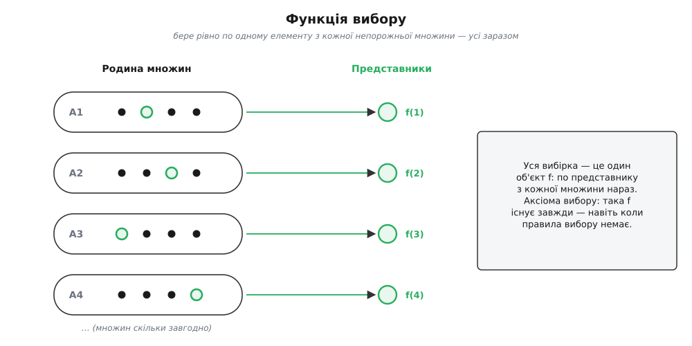
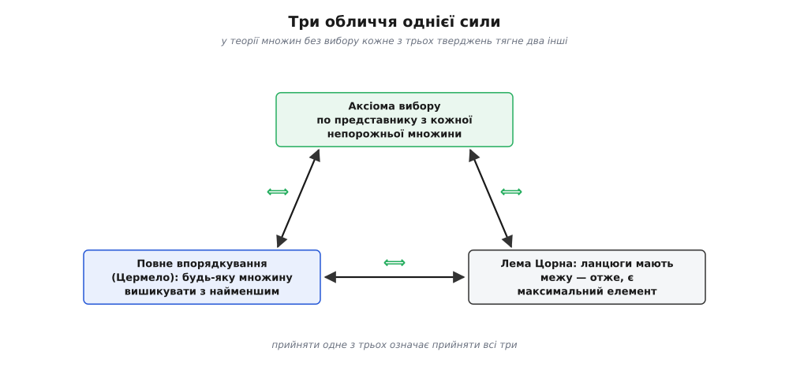
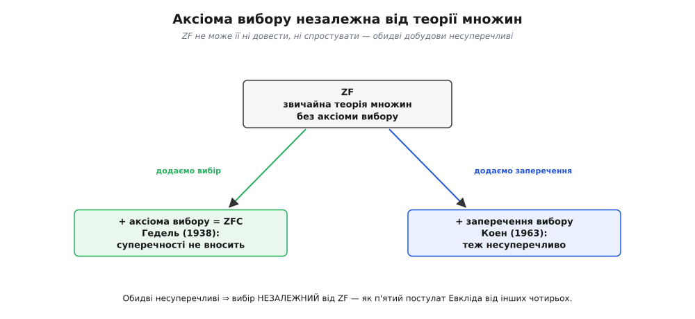

# Аксіома вибору

<preknowlist>
- [Теорія множин](topic:math-logic/set-theory) — множина, елемент, належність; порожня й непорожня множина; родина (зібрання) множин, об'єднання.
- [Математичне доведення](topic:math-logic/mathematical-proof) — що означає «довести», і зокрема різниця між «існує» та «побудовано явно».
- [Зліченні та незліченні множини](topic:math-logic/countable-sets) — чому натуральних чисел «зліченно», а дійсних «незліченно» багато; що буває нескінченність, більша за нескінченність.
</preknowlist>

Уявіть нескінченний склад: ряд за рядом стоять коробки, і про кожну ви знаєте одне-єдине — вона **не порожня**, усередині щось лежить. Завдання просте на позір: витягти по одній речі з **кожної** коробки й скласти все в один візок. З однією коробкою мороки немає — там щось є, простягни руку та бери. З десятьма, з мільйоном — теж: бери по черзі, скінченний перелік дій колись вичерпається. А з **нескінченною** кількістю коробок? Перебрати їх по одній не вийде — черга не має кінця. Потрібне якесь **єдине правило**, що враз, для всіх коробок нараз, каже, котру саме річ узяти з кожної. І ось тут виявляється дивовижне: такого правила може **не існувати**.

Твердження, що витягти по одному все одно завжди можна — навіть коли правила немає, — і є **аксіома вибору** (гр. *axíōma* — «те, що вважають гідним прийняти», від *áxios* — «гідний»; *вибір* — бо йдеться про вибір одного представника з кожної множини). Дослівно вона каже: з будь-якого зібрання непорожніх множин можна одночасно взяти рівно по одному елементу з кожної. На слух — щось середнє між очевидним і зайвим: навіщо це взагалі проголошувати? Уся сіль захована у двох словах — «нескінченного» і «правила може не бути».

### Шкарпетки й черевики

Найясніший образ дав Бертран Расселл (англ. Bertrand Russell), англійський логік і філософ, у книжці «Introduction to Mathematical Philosophy» (1919). Уявіть багача, що має нескінченно багато **пар черевиків** і нескінченно багато **пар шкарпеток**, і хоче з кожної пари відкласти по одному.

З черевиками все гаразд. У кожній парі є лівий і правий — вони **різні**, їх видно нарізно. Тому досить одного правила на всі пари заразом: «бери лівий». Одним розчерком воно визначає вибір із кожної пари, хоч би скільки їх було, — і жодної аксіоми тут не треба, звичайна логіка сама будує вибірку.

Зі шкарпетками халепа. У парі дві однакові шкарпетки — нічим не різняться, «лівої» серед них немає. Для **окремої** пари вибрати легко: тицьни пальцем у будь-яку. Але щоб зробити це для **всіх** пар нараз, потрібне єдине правило, а сказати «бери ліву» тут не можна — лівої немає, а іншого спільного правила теж. Скінченну кількість пар ще обійдеш «тиканням» по черзі; нескінченну — ні, черга не кінчається. Ось де народжується аксіома вибору: вона обіцяє, що вибірка **існує**, хоча жодного правила задати її годі.


*Уся різниця — у наявності правила. Де елементи пари помітно різні (черевики), вибірку задає логіка; де однакові (шкарпетки) і пар нескінченно багато, її існування доводиться постулювати.*

### Що саме стверджує аксіома

Виразимо це точно. Маємо **родину** непорожніх множин — зібрання { *Aᵢ* }, занумероване якимись індексами *i*. **Функцією вибору** називають функцію *f*, яка кожній множині родини дає один її елемент:

```
Дано:  родина непорожніх множин  { Aᵢ : i ∈ I }   (індексів I скільки завгодно)
Аксіома вибору:  існує функція f, для якої  f(i) ∈ Aᵢ  при кожному i.
```

Ця *f* — і є той «візок»: по одному представнику з кожної множини, усі водночас. Аксіома не каже, як *f* влаштована, — лише що вона **є**.

Коли ж її існування очевидне й без аксіоми? У двох випадках. По-перше, для **скінченної** родини — логіка будує *f* крок за кроком, і кроки закінчаться. По-друге, коли в кожній множині є **правило вибрати представника**. Найпоширеніше таке правило — **порядок**: якщо елементи можна порівнювати й у кожній множині є найменший, бери найменший. Для непорожніх множин натуральних чисел це працює завжди — у них найменший є завжди, це [принцип повного впорядкування](topic:math-logic/well-ordering-principle).

```py
# Коли правило Є — функцію вибору можна виписати явно.
family = [{3, 8}, {5, 2}, {9, 4}, {7, 1}]   # родина непорожніх пар
choose = lambda A: min(A)                    # правило вибору: «бери найменший»
picked = [choose(A) for A in family]         # → [3, 2, 4, 1]
```

`min` спрацьовує лише тому, що натуральні числа несуть **готовий порядок** — правило «найменший» уже вбудоване. Приберіть порядок (Расселлові шкарпетки, у яких нема ні «лівої», ні «меншої») — і на місце `min` писати нічого. Аксіома вибору стверджує, що представник знайдеться **й без** `min`: він просто «є», хоч виписати його неможливо.



*Функція вибору* f *призначає кожній непорожній множині одного її представника. Питання не в тому, чи є елемент у кожній окремій множині (він є), а чи можна вибрати з усіх нараз — одним об'єктом* f*.*

### Чому це не задарма

Виписав аксіому вголос Ернст Цермело (нім. Ernst Zermelo) 1904 року, доводячи, що будь-яку множину можна цілком упорядкувати. Він виокремив мовчазний «вибір без правила», яким математики потай уже користувалися, і поставив його на видноті як окреме припущення. Реакція була бурхлива: французька школа — Борель, Бер, Лебеґ — обурилася, бо доведення лише **стверджувало** існування порядку, нічого не будуючи. Ця межа — між «існує» і «ось воно, побудоване» — і є нервом усієї суперечки; повну хроніку, від Канторового «закону мислення» до розколу 1905-го, розказано в [народженні теореми про повне впорядкування](topic:math-logic/well-ordering-principle/hist-zermelo.md).

Головне, що треба тут засвоїти: аксіома вибору **неконструктивна**. Вона видає функцію-вибірку, не кажучи ні слова про те, як її обчислити чи пред'явити. Тому висновок, куплений вибором, слабший за здобутий явною побудовою: він запевняє, що «таке існує», а не показує, «ось як його знайти». Охайний математик пам'ятає, у якому місці його доказ мовчки скористався вибором.

### Три обличчя однієї сили

Аксіома вибору має рису, рідкісну для математичних тверджень: вона **рівносильна** цілій родині тез, що на позір говорять про геть різне. У межах звичайної теорії множин (тобто без самого вибору) будь-яка з них тягне за собою решту.

- **Теорема про повне впорядкування** (Цермело): елементи **будь-якої** множини можна вишикувати в лінію так, щоб кожна її непорожня частина мала найменший елемент. Порядок, «у якому завжди є найменший», накидається на що завгодно — навіть на всі дійсні числа. Звідси й рівносильність: маючи такий порядок, вибирай найменший — ось тобі функція вибору без будь-якого свавілля.
- **Лема Цорна** (лат. *lemma* — «допоміжне твердження»): якщо в частково впорядкованій множині кожен **ланцюг** (лінійно впорядкована частина) має верхню межу, то в усій множині є **максимальний** елемент. Це робочий важіль: щоб довести існування «найбільшого можливого» об'єкта, перевіряєш умову лише на ланцюгах — і лема безкоштовно видає максимум. Її форму дав Казимеж Куратовський (пол. Kazimierz Kuratowski) 1922 року, а розголосив Макс Цорн (нім. Max Zorn) 1935-го.
- **Порівнянність потужностей**: з будь-яких двох множин одна неодмінно вкладається в другу — «незрівнянних за величиною» пар не буває.

Усі троє — та сама сила під різними масками. Чому «накинути порядок», «знайти максимум» і «вибрати представників» — це одне й те саме твердження, і як лемою Цорна за півсторінки добувають базис нескінченновимірного простору, розібрано в [окремому виведенні рівносильностей](topic:math-logic/axiom-of-choice/math-zorn-equivalence.md).



*Три формулювання однієї сили. Вони говорять про різне — вибірку, порядок, максимум, — але доводяться одне з одного, тож прийняти одне означає прийняти всі три.*

> 🔧 **Навіщо це.** На практиці аксіому вибору майже ніколи не викликають прямо — викликають **лему Цорна**. Коли алгебраїк каже «візьмемо максимальний ідеал», а аналітик — «продовжимо функціонал на весь простір», під цим щоразу лема: перевірити, що об'єднання ланцюга знову годиться, і дістати максимальний об'єкт, якого ніхто не будував поелементно. Це найзвичніший спосіб, яким вибір заходить у щоденну математику, — і водночас підказка, де саме доказ на нього оперся.

### Що аксіома дарує

Приймають аксіому вибору не з упертості, а тому що без неї осипається надто багато звичного. Кілька наслідків, кожен із яких математик уживає, не змигнувши оком:

- **У кожного векторного простору є базис.** Для звичних скінченновимірних просторів це шкільна річ, але для нескінченновимірних (простори функцій, послідовностей) базис існує лише завдяки вибору. Ба більше: «у кожного [векторного простору](topic:math-algebra/vector-space) є базис» не просто **випливає** з аксіоми вибору — воно їй **рівносильне** (це довів Андреас Бласс (нім. Andreas Blass) 1984 року, підтвердивши здогад Цермело 1908-го).
- **У кожному ненульовому кільці з одиницею є максимальний ідеал** — наріжна теорема комутативної алгебри.
- **Теорема Гана — Банаха** про продовження лінійного функціонала — фундамент функціонального аналізу.
- **Добуток компактних просторів компактний** (теорема Тихонова) — без вибору падає й вона.
- **У кожного поля є алгебричне замикання**, і воно єдине.

Візерунок усюди той самий: треба довести, що якийсь «повний», «максимальний» чи «всеосяжний» об'єкт **існує**, хоча зібрати його поелементно неможливо. Вибір — через лему Цорна — видає такий об'єкт «згори», не показуючи рецепту.

### Що аксіома накликає: монстри

За цю потугу доводиться платити. Та сама аксіома, що дарує базиси й максимальні ідеали, породжує об'єкти, від яких коробить інтуїцію.

Джузеппе Віталі (іт. Giuseppe Vitali) 1905 року за допомогою вибору побудував на прямій множину, якій **неможливо приписати довжину** — ні нуль, ні якесь додатне число, взагалі жодного несуперечливого значення «міри». Звичні множини довжину мають; вибір дав першу, що її не має. Ще різкіше — **парадокс Банаха — Тарського** (Стефан Банах і Альфред Тарський, обидва польські математики, 1924): суцільну кулю можна розрізати на скінченне число шматків і, лише переставивши й повернувши їх, не розтягуючи, скласти **дві** кулі, кожна така сама, як початкова. Обсяг ніби подвоївся з нічого. Фокус у тому, що шматки — саме такі «невимірні» множини, до яких поняття об'єму не застосовне, тож і питати з них «збереження об'єму» ні з чого.

Ці конструкції — не спростування аксіоми, а її ціна. Докладний розбір, як із вибору народжується невимірна множина і що саме додає до неї подвоєння кулі, — в [окремій вставці про монстрів вибору](topic:math-logic/axiom-of-choice/math-nonmeasurable.md). І та сама двоїстість повертає до дійсних чисел: теорема Цермело обіцяє, що їх **можна** цілком упорядкувати, — але жодного такого порядку ніхто ніколи не виписав і, як з'ясувалося, без вибору й не випише. Гільберт колись просив пред'явити його явно; вибір відповідає «він існує» — і замовкає.

### Незалежна від усього: Гедель і Коен

Настільки спірне твердження хочеться або довести, або спростувати з решти аксіом — і закрити питання назавжди. Виявилося, не можна ні того, ні того. Курт Гедель (нім. Kurt Gödel), австрійський логік, 1938 року показав: якщо звичайна теорія множин несуперечлива, то, додавши до неї аксіому вибору, суперечності не внесеш — **спростувати** вибір неможливо. Пол Коен (англ. Paul Cohen), американський математик, 1963 року своїм методом форсингу показав зворотне: можна збудувати всесвіт множин, де всі звичайні аксіоми чинні, а вибір **хибний**, — отже, **довести** його теж неможливо. Разом це означає одне: аксіома вибору **незалежна** від решти теорії множин (за що Коен дістав Філдсову медаль 1966 року).

Найточніша аналогія — п'ятий постулат Евкліда про паралельні прямі. Дві тисячі років його марно намагалися вивести з чотирьох інших — бо він від них незалежний: є геометрія, де він чинний (евклідова), і є, де ні (неевклідові), обидві несуперечливі. Так само й тут: є математика з вибором — її звуть [ZFC](topic:math-logic/zfc-set-theory) (літера C — від англ. *Choice*, вибір), стандартний фундамент майже всієї сучасної науки, — і є, без вибору чи навіть із його запереченням, теж несуперечлива. Ти не «відкриваєш», істинний вибір чи ні; ти **обираєш**, у якій математиці працювати.

На щастя, «монстри» потребують **повної** сили аксіоми. Для щоденного аналізу вистачає слабших її версій — **зліченного вибору** (вибірка з не більш ніж зліченної родини) чи **залежного вибору** (де кожен наступний вибір може спиратися на вже зроблений): ними будують границі, послідовності, звичні об'єкти — і жодних невимірних множин при цьому не виникає. Роберт Соловей (англ. Robert Solovay) 1970 року довів це строго: є всесвіт множин, де діє залежний вибір, а проте **кожна** множина дійсних має довжину — невимірних немає зовсім. Виходить, невимірна множина Віталі й подвоєна куля потребують саме того «безправильного вибору з незліченної родини», що й був каменем спотикання від самого початку.



*Аксіома вибору незалежна від решти теорії множин — як п'ятий постулат Евкліда від інших чотирьох. Обидві добудови, з вибором і без, несуперечливі; котру взяти — питання вибору, а не істини.*

> 🔧 **Навіщо це.** Знати, **скільки** вибору з'їв твій доказ, — частина математичної гігієни. Висновок, здобутий через повну аксіому вибору, слабший за конструктивний чи здобутий зліченним вибором: він лише запевняє в існуванні, не даючи об'єкт у руки. Тому в конструктивній математиці й у системах машинної перевірки доведень (Coq, Lean) вибір винесено в **окрему**, необов'язкову аксіому — щоб було видно, де саме теорема на нього оперлася і що станеться, якщо його прибрати.

### Підсумок

Аксіома вибору стверджує майже банальне: з будь-якого зібрання непорожніх множин можна взяти по одному представнику. Уся глибина — у слові «нескінченного»: коли множин незліченно багато й спільного **правила** вибору немає (Расселлові однакові шкарпетки проти помітно різних черевиків), просте твердження стає окремим, неконструктивним припущенням. Воно рівносильне теоремі про повне впорядкування й лемі Цорна, і без нього осипаються базиси нескінченновимірних просторів, максимальні ідеали, теорема Гана — Банаха. Та сама аксіома породжує невимірні множини й подвоєну кулю Банаха — Тарського, а сама вона незалежна від решти теорії множин: її, як п'ятий постулат Евкліда, можна прийняти або відкинути, і в обох випадках математика лишається несуперечливою. Не закон і не теорема, а **вибір** — крок, який ти або дозволяєш собі зробити, або ні.
