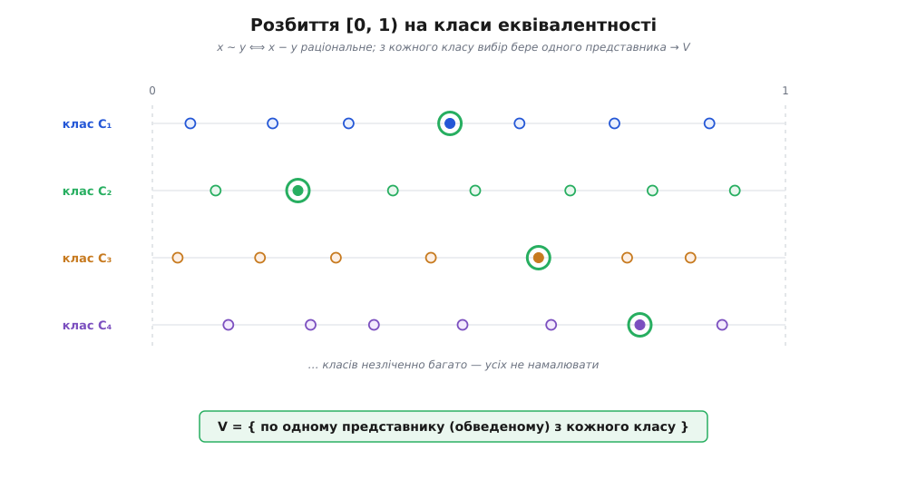
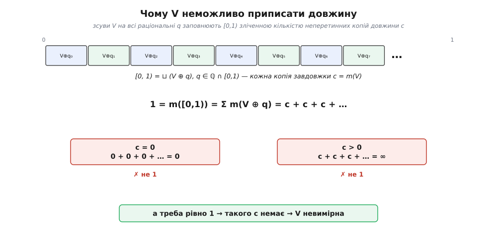

# 🧮 Монстри вибору: невимірна множина Віталі та подвоєна куля

Довжину відрізка знає кожен: від 0.2 до 0.7 — це 0.5, і сперечатися нема про що. Точка довжини не має — нуль. Раз ми вміємо міряти відрізки й точки, напрошується сміливіше питання: а чи має довжину **будь-яка** підмножина прямої? Не лише відрізок чи їх об'єднання, а взагалі яке завгодно зібрання точок — хай найдрібніше розсіяне, найхимерніше. Хочеться функції, що кожній множині *A* на осі дає одне невід'ємне число *m*(*A*) — її «довжину», «міру», — і робить це розумно.

Що означає «розумно»? Три вимоги, кожну з яких годі відкинути:

```
(1) Нормування:              m([a, b)) = b − a
(2) Незалежність від місця:  m(A + t) = m(A)      (посунули множину — довжина не змінилась)
(3) Зліченна адитивність:    m(A₁ ⊔ A₂ ⊔ A₃ ⊔ …) = m(A₁) + m(A₂) + m(A₃) + …
                             (для попарно неперетинних A₁, A₂, A₃, …)
```

Перша прибиває масштаб: відрізок має саме ту довжину, яку показує лінійка. Друга каже, що довжина — про **розмір**, а не про положення: зсунули фігуру вбік — вона не поменшала й не побільшала. Третя — робоча конячка: щоб порахувати довжину складеної множини, ділимо її на неперетинні шматки й додаємо, причому дозволено складати навіть **зліченну нескінченність** шматків. Без третьої не порахувати довжину навіть множини раціональних точок відрізка.

Усе звичне цим трьом правилам кориться. Мрія проста: знайти таку *m*, визначену **на кожній** підмножині прямої. Джузеппе Віталі (іт. *Giuseppe Vitali*), італійський математик, 1905 року показав, що мрія нездійсненна: є множина, якій жодне число за цими правилами приписати не можна. Збудував він її аксіомою вибору — і в цьому вся сіль.

### Поріднити точки: відношення й класи

Почнемо з відрізка [0, 1) — від нуля включно до одиниці не включно. Заведемо на ньому відношення:

```
x ~ y   ⟺   x − y ∈ ℚ        (різниця — раціональне число)
```

Дві точки споріднені, коли різняться на раціональне. Це [відношення еквівалентності](topic:math-logic/equivalence-relation) — рефлексивне, симетричне й транзитивне відношення, а таке завжди робить одне: розбиває множину на неперетинні **класи** взаємно споріднених елементів. Перевірити легко: *x* − *x* = 0 раціональне (рефлексивність); якщо *x* − *y* раціональне, то й *y* − *x* (симетричність); а з *x* − *y* ∈ ℚ і *y* − *z* ∈ ℚ виходить (*x* − *y*) + (*y* − *z*) = *x* − *z* ∈ ℚ (транзитивність).

Який вигляд має один клас? Візьміть точку *x*. Споріднені з нею — усі точки *x* + (раціональне), що ще потрапляють у [0, 1). Раціональних чисел зліченно багато, тож клас — зліченна розсипка, до того ж **щільна**: між будь-якими двома точками відрізка знайдеться точка цього класу. Уявіть клас як слід одної точки, розтиражований усіма раціональними зсувами по всьому відрізку.

Скільки таких класів? Кожен зліченний, а весь [0, 1) — **незліченний**. Тут вирішальна ось яка річ про [зліченні та незліченні множини](topic:math-logic/countable-sets): зліченне об'єднання зліченних множин лишається зліченним. Якби класів було зліченно багато, весь відрізок склався б зі зліченної кількості зліченних класів — тобто був би зліченним, а він незліченний. Отже, класів **незліченно** багато. Запам'ятаймо це — воно вб'є останній цвях.

### Крок вибору: народження V

Тепер — рух, заради якого все й починалося. З **кожного** класу візьмемо рівно по одній точці, одного представника, і складемо всіх обраних в одну множину. Назвемо її *V* — на честь Віталі.

Ось де захована аксіома вибору. Класів незліченно багато; у кожному — суцільно однакові на вигляд точки. Усі споріднені, жодна не «перша» й не «найменша» — усередині класу немає виділеного орієнтира, за який можна вхопитися. Правила, яке б для кожного класу вказало представника, **не існує**, а вибрати треба з незліченної родини нараз. Саме таку вибірку — по одному з кожної множини незліченної родини, без жодного правила — і дозволяє сама лише аксіома вибору. Без неї *V* може взагалі не існувати; це ще спливе наприкінці.

Зверніть увагу, чим *V* незвичайна вже тут: її **неможливо ні намалювати, ні задати формулою, ні перелічити**. Ми не знаємо жодної її конкретної точки — знаємо тільки, що вона «є», бо аксіома пообіцяла. Це не множина, яку креслять; це множина, яку постулюють.



*Кожен рядок — один клас: точки, що відрізняються на раціональне. Обведений — обраний представник. Класів незліченно багато, усіх не намалювати; V збирає по одному з кожного.*

### Пастка: і нуль, і нескінченність

Тепер вкладемо *V* у пастку. Припустімо, що мрія збулася: довжину *m* приписано **всім** підмножинам [0, 1), і вона кориться правилам (1)–(3). Порахуємо *m*(*V*) — і побачимо, що жодне число не годиться.

Зсуватимемо *V* на раціональні числа, але **по колу**: склеїмо кінці відрізка, щоб [0, 1) став кільцем довжини 1, і те, що вилазить за одиницю, поверталося з нуля. Для раціонального *q* ∈ [0, 1) позначимо:

```
V ⊕ q = { (v + q) mod 1 : v ∈ V }        (зсув на q із загортанням через 1)
```

Такий зсув по колу довжини не змінює. Множина *V* розпадається на дві частини: та, що не дістає до 1, їде на +*q*; та, що переходить за 1, їде на +*q* − 1. Обидві — звичайні зсуви, кожен за правилом (2) довжину береже, а лягають вони в [0, 1) неперетинно. Тому *m*(*V* ⊕ *q*) = *m*(*V*), хоч би яким було раціональне *q*.

Далі два спостереження, на яких усе тримається.

**Копії не перетинаються.** Нехай точка потрапила і в *V* ⊕ *q*, і в *V* ⊕ *q*′. Тоді вона — це і *v* + *q*, і *v*′ + *q*′ (за модулем 1) для якихось представників *v*, *v*′ ∈ *V*. Різниця *v* − *v*′ виходить раціональна, отже *v* і *v*′ споріднені — сидять в одному класі. Але у *V* з кожного класу лише **один** представник; тому *v* = *v*′, а тоді й *q* = *q*′. Різні *q* дають цілком неперетинні копії.

**Копії покривають усе.** Візьміть будь-яку точку *x* ∈ [0, 1). Вона лежить у якомусь класі, а з того класу у *V* сидить представник *v*. Отже *x* − *v* раціональне; назвемо його *q* (за модулем 1 воно в [0, 1)). Тоді *x* = *v* ⊕ *q*, тобто *x* ∈ *V* ⊕ *q*. Жодна точка відрізка не лишилася без копії.

Разом це означає: відрізок [0, 1) **точно розкладається** на копії *V*, по одній на кожне раціональне *q* з [0, 1):

```
[0, 1) = ⊔  (V ⊕ q),   q ∈ ℚ ∩ [0, 1)
```

А раціональних чисел у [0, 1) — **зліченно** багато. Виходить, ми розрізали відрізок на зліченну кількість неперетинних конгруентних копій однієї множини. Тепер порахуймо довжину двома очима: зліва «1», справа — сума копій:

```
1 = m([0, 1)) = Σ m(V ⊕ q) = Σ m(V) = m(V) + m(V) + m(V) + …    (зліченно доданків)
```

Позначимо *c* = *m*(*V*) — одне-єдине число, бо всі копії однакові завдовжки. Сума зліченної кількості однакових доданків *c* мусить дорівнювати 1. Але:

```
якщо c = 0   →   0 + 0 + 0 + …  =  0      ≠ 1
якщо c > 0   →   c + c + c + …  =  +∞     ≠ 1
```

Третього не дано: невід'ємне число або нуль, або додатне. Нуль дає в сумі нуль, будь-яке додатне — нескінченність; а треба рівно одиницю. **Жодне *c* не підходить.** Отже, *m*(*V*) не існує: приписати *V* довжину, не зламавши правил (1)–(3), неможливо.



*Довжина відрізка порахована двічі. Копій зліченно багато, усі завдовжки c; сума дає або 0, або ∞, і ніколи 1. Число c, а з ним і довжина V, існувати не може.*

Висновок різкий: **немає** функції-довжини, визначеної на всіх підмножинах прямої. Мрія виміряти геть усе хибна. Математика бере компроміс: будувати міру не на всіх множинах, а на широченному, але **не повному** їх зібранні — «вимірних» множинах. Саме це зробив Анрі Лебег (фр. *Henri Lebesgue*) у дисертації 1902 року «*Intégrale, longueur, aire*» («Інтеграл, довжина, площа»): його **міра Лебега** охоплює кожну множину, яку можна явно задати — відрізки, зліченні розсипки, канторів пил, будь-що з формули чи опису. А *V* у це зібрання не входить: вона **невимірна**. Не тому, що «надто велика» чи «надто дрібна», — а тому, що взагалі не має несуперечливого розміру.

> 🔧 **Навіщо це.** Через *V* жодна серйозна теорія міри не обіцяє виміряти всі множини — вона наперед звужується до **σ-алгебри** вимірних множин і працює лише на ній. Уся теорія ймовірностей стоїть на цьому: «подія» — це не будь-яка підмножина простору наслідків, а лише вимірна; імовірність визначена саме на них. Інтеграл Лебега, випадкові величини, математичне сподівання — усе живе на вимірних множинах. Невимірна множина Віталі — причина, чому цю обережність вбудовано у самий фундамент, а не забаганка педантів.

### Та сама хвороба в просторі: подвоєна куля

Множина Віталі відбирає в прямої довжину. Та сама хвороба в просторі відбирає **об'єм** — і то так нахабно, що спершу не віриться. Стефан Банах і Альфред Тарський (обидва — польські математики; Тарський народився Альфредом Тайтельбаумом у єврейській родині у Варшаві й змінив прізвище близько 1923–24 років, навертаючись у католицтво) 1924 року в журналі *Fundamenta Mathematicae* довели: суцільну **кулю** можна розрізати на скінченну кількість шматків — вистачає п'яти — і, лише **обертаючи та зсуваючи** їх, не розтягуючи й не деформуючи, скласти **дві** кулі, кожна така сама завбільшки, як початкова. Об'єм ніби подвоївся з нічого.

Це не фокус зі схованим рукавом і не гра слів. Щоб побачити, **звідки** береться подвоєння, треба зазирнути в будову обертань — і там на нас чекає та сама вибірка представників, що й у Віталі.

Почнемо не з кулі, а з [групи](topic:math-algebra/group-theory). Розгляньмо два обертання простору — назвемо їх *a* і *b* — та обернені до них *a*⁻¹, *b*⁻¹. Складаючи їх поспіль, дістаємо «слова»: *ab*, *aab*⁻¹, *b*⁻¹*ab* … Домовмося лише скорочувати сусідні *aa*⁻¹ чи *bb*⁻¹ (обертання й зворотне гасять одне одного). Якщо обертання дібрані так, що **жодне нескоротне слово не повертає простір на місце** (ніяке нетривіальне слово не дорівнює тотожності), то ці слова утворюють **вільну групу** з двох твірних — *F*₂. «Вільна» — бо на неї не накладено жодного зайвого зв'язку, крім неминучого гасіння оберненого.

І тут ховається дивовижна самоподібність. Розкладемо всі слова *F*₂ за **першою літерою** — на п'ять купок:

```
F₂ = {e} ∪ S(a) ∪ S(a⁻¹) ∪ S(b) ∪ S(b⁻¹)
```

де *e* — порожнє слово (тотожність), *S*(*a*) — усі слова, що починаються на *a*, і так далі. Тепер магія. Візьміть купку *S*(*a*⁻¹) — слова, що починаються на *a*⁻¹ — і **домножте кожне зліва на *a*** (застосуйте обертання *a*). Початкова *a*⁻¹ погашається, і від слова лишається «хвіст», що може починатися будь-чим, окрім *a* (бо якби він починався на *a*, у вихідному слові після *a*⁻¹ стояла б *a* — а це скоротилося б). Що дістаємо?

```
a · S(a⁻¹) = усі слова, що НЕ починаються на a
           = {e} ∪ S(a⁻¹) ∪ S(b) ∪ S(b⁻¹)      ← три чверті групи плюс тотожність
```

Одна чверть, крутнута обертанням *a*, розбухла до трьох чвертей. Тепер складіть:

```
S(a)  ∪  a · S(a⁻¹)  =  увесь F₂
S(b)  ∪  b · S(b⁻¹)  =  увесь F₂
```

Погляньте, що сталося: з **чотирьох** шматків групи (*S*(*a*), *S*(*a*⁻¹), *S*(*b*), *S*(*b*⁻¹)) ми, обернувши два з них, склали **дві** повні копії *F*₂. Група подвоїлася сама в себе, і жодної точки не додано — самі обертання. Оце й двигун Банаха — Тарського: подвоєння вписане в саму будову вільної групи обертань.


*Самоподібність вільної групи — двигун подвоєння. Крутнувши дві з чотирьох частин, дістаємо дві копії цілого; куля успадковує цей фокус через свою групу обертань.*

Лишається перенести фокус із абстрактних слів на реальну кулю. Ключовий факт: група обертань тривимірного простору, [SO(3)](topic:math-algebra/lie-group-so3), **містить** таку вільну групу — досить узяти два обертання на кут arccos(1/3) навколо перпендикулярних осей, і вони не мають жодного нетривіального співвідношення (це доводять «лемою пінг-понгу»). Далі діємо так: пускаємо цю групу обертати сферу; вона розбиває поверхню на **орбіти** — купки точок, зв'язаних обертаннями зі слів. З кожної орбіти аксіомою вибору беремо по одному представнику — точнісінько трюк Віталі! — і самоподібність групи переноситься на сферу: її точки розпадаються на кілька шматків, які обертаннями складаються у дві такі самі сфери. Від сфери до суцільної кулі — променями від центра; жменю проблемних точок (вісь, центр) залатують ще одним хитрим зсувом. Підсумок — та сама скінченна кількість шматків, що дає дві кулі. Перший крок зробив Фелікс Гаусдорф (нім. *Felix Hausdorff*) 1914 року, подвоївши сферу без зліченної жмені точок; Банах і Тарський за десять років довели справу до суцільної кулі без жодних винятків.

Тепер найважливіше — **чому це не суперечить ні глуздові, ні фізиці**. Шматки в цьому розрізі — не ножем відкраяні кусні, а **невимірні** множини, зіткані з вибору представників, точно як *V*. Об'єм на них **не визначений**. А раз шматки об'єму не мають, то й закон «об'єм зберігається при перекладанні» не має за що вхопитися — зберігати нема чого. Подвоєння не порушує збереження об'єму, бо в самих шматках об'єму просто немає. Справжню матерію так не подвоїш: атоми дискретні, а ці шматки — нескінченно поламані хмари точок, які ні ножем вирізати, ні руками скласти. Парадокс живе виключно у світі ідеальних точкових множин.

І остання, найглибша риса: подвоєння можливе **лише від трьох вимірів угору**. На прямій і на площині ніякого Банаха — Тарського немає, і причина точна. Ще 1923 року Банах довів, що на прямій і на площині існує скінченно адитивна, інваріантна щодо рухів міра, визначена на **всіх** обмежених множинах і згідна зі звичайною площею. Раз така міра є, розрізати фігуру й скласти більшу неможливо: міра шматків склалася б у два різні числа. Чому ж площина «чесна», а простір ні? Бо група рухів площини **надто спокійна** — у ній немає вільної пари твірних (два повороти площини завжди зв'язані співвідношенням). А в SO(3), від трьох вимірів, вільна пара обертань з'являється, і з нею вривається самоподібність, а з самоподібністю — подвоєння. Джон фон Нейман 1929 року вловив саме цю межу, увівши поняття «сумирної» (англ. *amenable*) групи: доки група обертань сумирна (пряма, площина), парадоксу нема; щойно в ній заводиться вільна пара (простір) — він неминучий. Отже, подвоєна куля — не властивість нескінченності взагалі, а властивість **групи обертань тривимірного простору**.

### Без повного вибору — без монстрів

Погляньмо, звідки в обох монстрів росте коріння. І невимірна *V*, і шматки подвоєної кулі народилися з **одного** руху: вибрати по представнику з кожного класу (орбіти) незліченної родини, не маючи правила. Це — повна, необмежена аксіома вибору. А що, як її трохи вгамувати?

Для всього робочого аналізу вистачає слабших версій: **зліченного вибору** (вибірка з не більш ніж зліченної родини) чи **залежного вибору** (коли кожен наступний вибір спирається на попередній). Ними будують границі, послідовності, ряди, звичні функції — і при цьому **жодної невимірної множини не виникає**. Роберт Соловей (англ. *Robert Solovay*), американський математик, 1970 року довів це строго: він збудував модель [теорії множин](topic:math-logic/zfc-set-theory), де чинний залежний вибір (тобто весь звичайний аналіз на місці), а проте **кожна** підмножина дійсних вимірна за Лебегом — невимірних немає зовсім, ні Віталі, ні жодної іншої. За це довелося доплатити припущенням про існування «недосяжного кардинала»; згодом Сахарон Шелах показав, що без такого припущення тут не обійтися, — але суть незмінна.

Отже, монстри — не неминучість математики, а ціна **конкретного** вибору. Візьміть зліченний чи залежний вибір — і ви маєте весь живий аналіз, а невимірних множин нема й близько. Візьміть повну аксіому вибору — і разом із великими зручностями (базис будь-якого простору, максимальний ідеал, продовження функціонала) у дім заходять і невимірна *V*, і подвоєна куля. Це вибір із незліченної родини однакових на вигляд елементів — саме там, де жодного правила немає, — і невимірна множина є рівно його тінню. Не хиба в підвалинах, а рахунок, який виставляє за свою силу найбагатша з математичних аксіом.
