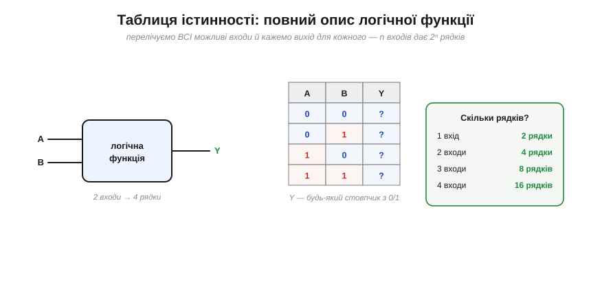
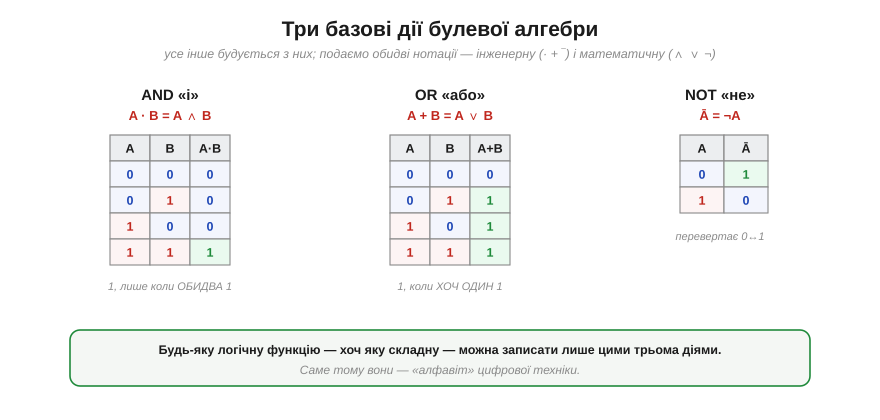
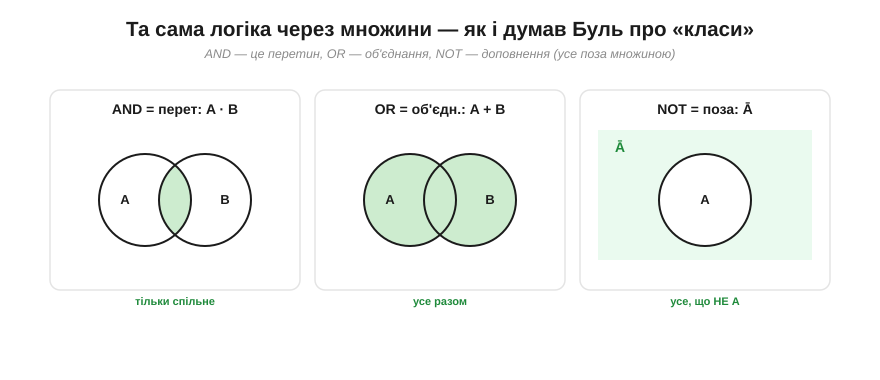
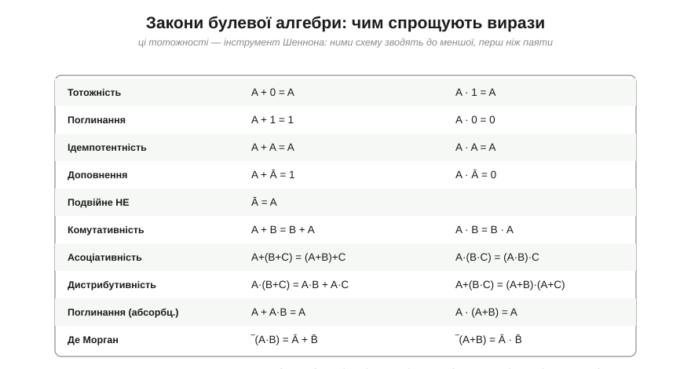
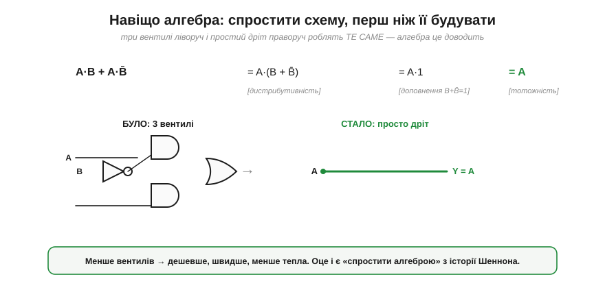
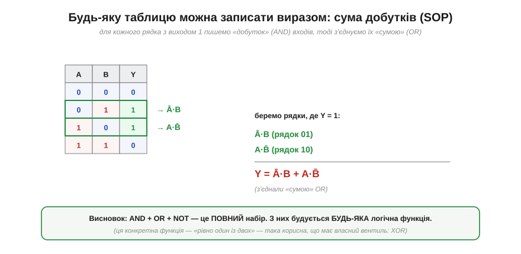

# Булева алгебра: логіка як математика

Зухвала думка Джорджа Буля (*George Boole*) полягала ось у чому: міркування — «і / або / не», «істинно / хибно» — підкоряється **алгебрі** з двома значеннями. Перетворімо цю думку на **робочий інструмент**. Бо булева алгебра — це не філософія, а конкретний апарат, яким інженер описує, перевіряє й **спрощує** цифрові схеми, ще не торкнувшись паяльника.

### Два значення — і все

Уся будова стоїть на тому, що змінна тут набуває лише **двох** значень: **0** і **1**. Що вони означають — залежить від контексту: «хибно / істинно» в логіці, «низько / високо» в [рівнях напруги](topic:hw-digital/logic-levels-as-ranges), «розімкнено / замкнено» в перемикачі, «нема / є». Алгебрі байдуже до фізичного сенсу — вона оперує чистими 0 і 1, а ми вже потім «приземляємо» їх на залізо. У цьому сила абстракції: один апарат описує і реле, і транзистор, і рядок коду.

Варто звикнути до двомовності: значення звуть **0 / 1**, або **false / true** (хибно / істинно), або **low / high**. У різних книгах і даташитах трапляються всі ці назви — це те саме.

### Таблиця істинності — повний опис функції

Найперший і найчесніший спосіб задати логічну функцію — **таблиця істинності** (*truth table*). Ідея проста до краю: перелічити **всі можливі** комбінації входів і навпроти кожної написати, яким буде вихід. Нічого не приховано, нічого не «домислюється» — функція задана **вичерпно**.


*Логічна функція з двома входами A, B і виходом Y. Оскільки кожен вхід — це 0 або 1, усіх комбінацій рівно чотири, і таблиця має 4 рядки. Загальне правило: **n входів дають 2ⁿ рядків** (1→2, 2→4, 3→8, 4→16…). Заповнивши стовпчик Y нулями та одиницями як завгодно, ми задаємо конкретну функцію — і таких функцій для n=2 рівно 2⁴ = 16.*

Зверніть увагу на вибуховість показника: 3 входи — це вже 8 рядків, 4 входи — 16, 10 входів — понад тисячу. Таблиця істинності — чесний, але **громіздкий** опис; саме тому й потрібна компактніша мова — алгебра.

### Три дії: AND, OR, NOT

Уся ця алгебра тримається на **трьох** операціях. Задамо їх строго — таблицями істинності.


***AND** (*кон'юнкція*, «і»): A·B = 1, лише коли обидва входи 1. **OR** (*диз'юнкція*, «або»): A+B = 1, коли хоч один вхід 1. **NOT** (*інверсія*, «не»): Ā просто перевертає 0↔1. Подаємо обидві нотації: інженерну (· + ‾) і математичну (∧ ∨ ¬) — ви зустрінете обидві.*

Кілька слів про **нотацію**, бо вона спершу плутає. Інженери пишуть «і» як **множення** (A·B або просто AB), «або» — як **додавання** (A+B), а «не» — **рискою згори** (Ā) або апострофом (A'). Математики й програмісти частіше пишуть ∧, ∨, ¬ (або `&&`, `||`, `!`). Це **одне й те саме** — просто різні традиції; ми триматимемося інженерної (· + ‾), бо вона ближча до схем. Вибір символів «·» для «і» та «+» для «або» не випадковий: ці операції справді поводяться **схоже** на множення й додавання — з одним дивовижним винятком, до якого ми дійдемо.

### Та сама логіка — через множини

Перш ніж занурюватися в символи, корисно побачити логіку **очима**. Сам Буль думав про свої змінні як про **класи** (множини) предметів — і в цьому образі три операції стають наочними до прозорості.


*AND — це **перетин**: «належить і до A, і до B» (спільна частина). OR — **об'єднання**: «належить до A або до B» (усе разом). NOT — **доповнення**: «усе, що НЕ в A» (поза колом). Ця картинка — той самий зміст, що й таблиці істинності, лише геометрично; вона часто рятує інтуїцію, коли формули заплутуються.*

Тримайте цей образ напохваті: коли алгебраїчний вираз стане надто заплутаним, перемальовування його кругами Венна нерідко вмить показує, що до чого зводиться.

### Закони алгебри — інструмент спрощення

Тепер головне, заради чого Буль усе й затівав. Над операціями ·, + і ‾ діють **закони** — тотожності, які дозволяють **перетворювати** вирази, не міняючи їхнього змісту. Це той самий апарат, що й у шкільній алгебрі (розкрити дужки, винести спільний множник), але зі своїми правилами.


*Основні тотожності. Більшість інтуїтивні: A+0=A (додати «нічого» — без змін), A·1=A, A+1=1 («або істина» — завжди істина). Дещо своєрідне: **A+A=A** та **A·A=A** (ідемпотентність — та сама, що дає x·x=x), і **A+Ā=1**, A·Ā=0 (щось або воно, або не воно). А найдивніша — **друга дистрибутивність** A+(B·C)=(A+B)·(A+C): в арифметиці чисел такого немає, а в булевій алгебрі вона справджується.*

Більшість законів очевидні, щойно згадаєш зміст «+» як «або», «·» як «і». Та два варто виокремити. **Ідемпотентність** (A+A=A) — це прямий наслідок двозначності: «істинно або істинно» = «істинно». А **друга дистрибутивність** (A+B·C = (A+B)·(A+C)) — це чиста екзотика булевого світу: спробуйте підставити числа (1+2·3 = 7, а (1+2)·(1+3)=12 — не рівні!), і побачите, що для чисел вона хибна, а для 0/1 — істинна. Саме такі тотожності й роблять булеву алгебру окремою наукою, а не просто «арифметикою нулів». Якщо хочеться побачити цей апарат **формально** — з повним переліком аксіом, законами Де Моргана та [покроковими доведеннями тотожностей](topic:math-logic/boolean-algebra/math-axioms-proofs.md), — там кожен із цих законів виводиться строго, а не лише підказується інтуїцією.

### Навіщо ці закони: спрощення схеми

Закони — не самоціль. Їхнє практичне призначення — **спрощувати**. Складний вираз (а отже, складна, дорога схема з багатьох вентилів) часто **тотожно дорівнює** значно простішому. Знайти це спрощення на папері — і є та «суперсила», яку алгебра Буля дала інженерії: саме Клод Шеннон (*Claude Shannon*) у магістерській роботі 1937 року показав, що цією алгеброю описуються й спрощуються схеми з перемикачів і реле.

> 📜 Сам Буль вивів свою алгебру за дев'яносто років до першого комп'ютера — і за життя її вважали безплідним філософським курйозом, поки Шеннон не впізнав у ній опис електричних реле. Як син бідного шевця-самоука збудував фундамент цифрової епохи — у нарисі [Джордж Буль: алгебра, що навчилася думати](topic:math-logic/boolean-algebra/hist-boole.md).


*Вираз A·B + A·B̄ виглядає так, ніби потребує трьох вентилів (два AND, один OR, плюс інвертор). Та три кроки алгебри — винесли A за дужку, застосували B+B̄=1, тоді A·1=A — доводять, що все це **тотожно дорівнює просто A**. Тобто складну схему можна викинути й замінити **дротом**. Менше вентилів — дешевше, швидше, холодніше.*

**Приклад (спрощення).** Спростимо вираз `A·B + A·B̄` крок за кроком, посилаючись на закони.

```
A·B + A·B̄
= A·(B + B̄)      [дистрибутивність: винесли A]
= A·1            [доповнення: B + B̄ = 1]
= A              [тотожність: A·1 = A]
```

Результат вражає: громіздкий вираз із чотирьох літер і трьох операцій — це насправді **просто A**. Схема, яку ви вже зібралися паяти з кількох мікросхем, виявляється зайвою: вихід завжди дорівнює входу A. Уся книга «Закони думки» писалася заради таких миттєвостей — коли алгебра показує, що складне насправді просте.

### Будь-яка функція — це сума добутків

Лишилося питання, що замикає весь підрозділ: а чи **будь-яку** логічну функцію можна виразити цими трьома діями? Відповідь — **так**, і спосіб напрочуд механічний. Він зветься **сума добутків** (*sum of products*, SOP).


*Рецепт. Дивимося в таблицю істинності й беремо лише рядки, де вихід Y = 1. Для кожного такого рядка пишемо **добуток** (AND) усіх входів — узявши сам вхід, якщо він тут 1, і його заперечення, якщо 0. Тоді всі ці добутки з'єднуємо **сумою** (OR). Готово: вираз точно відтворює таблицю.*

**Приклад (вираз із таблиці).** Нехай функція Y = 1 лише в рядках (A=0, B=1) і (A=1, B=0). Будуємо SOP:

```
рядок A=0,B=1  →  добуток  Ā·B
рядок A=1,B=0  →  добуток  A·B̄
з'єднуємо сумою:
Y = Ā·B + A·B̄
```

Перевірте по таблиці — збігається. А це означає фундаментальну річ: набір **{AND, OR, NOT}** є **функціонально повним** (*functionally complete*) — з нього будується **геть усе**, хоч яка складна логіка. Не треба вигадувати нових операцій: трьох вистачає на будь-що, від простого порівняння до цілого процесора. (До речі, ця конкретна функція — «рівно один із двох входів є 1» — настільки корисна, що їй дали окремий вентиль [**XOR**](topic:hw-digital/xor-comparison).)

> 🔧 **Навіщо це.** Булева алгебра — це не «теорія для іспиту», а щоденний робочий інструмент, який ви впізнаватимете повсюди. Умова `if (gotovo && !pomylka)` у коді — це булів вираз. Логіка ввімкнення живлення, блокування, дозволів на платі — теж. А таблиця істинності — це ваш найнадійніший спосіб **точно** описати, чого ви хочете від схеми чи функції, перш ніж її будувати, і **перевірити**, що вона робить саме це. Уміння спростити вираз законами — це вміння зробити пристрій дешевшим і швидшим, не змінивши його поведінки. Це буквально гроші й мілісекунди.

---

Отже, **булева алгебра** оперує змінними з двома значеннями (0/1) і трьома діями — **AND** (·), **OR** (+), **NOT** (‾), які строго задають **таблицями істинності** (n входів → 2ⁿ рядків); та сама логіка наочна як множини (перетин/об'єднання/доповнення). Над операціями діють **закони** (тотожність, поглинання, ідемпотентність, доповнення, дистрибутивність, Де Морган), якими вирази **спрощують** — зводячи складну схему до меншої (а то й до дроту). Будь-яку функцію можна записати як **суму добутків**, тож набір {AND, OR, NOT} **функціонально повний** — з нього будується вся цифрова логіка. Усі ці «операції» та «функції» лишалися тут абстрактними; своє фізичне тіло вони дістають у [логічних вентилях](topic:hw-digital/basic-gates) — схемних елементах, де кожна з трьох дій стає реальним пристроєм на платі.

---
