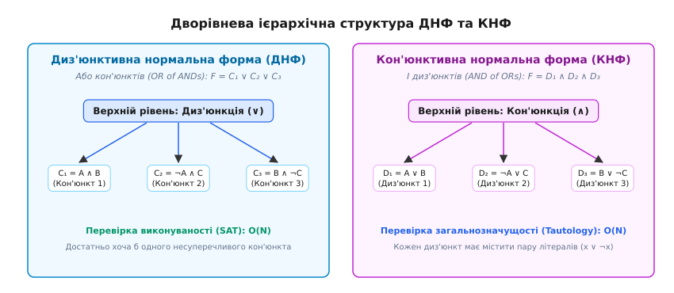
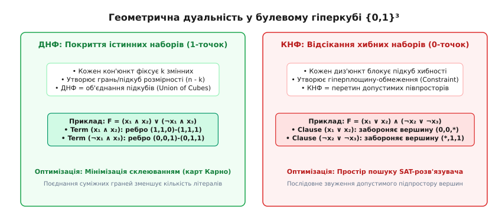
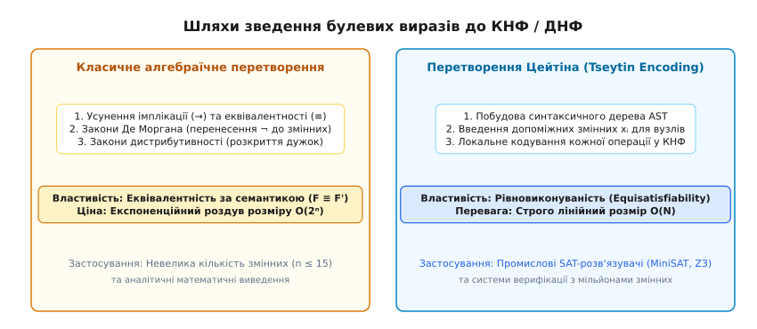

# Диз'юнктивні та кон'юнктивні нормальні форми (ДНФ і КНФ)

<preknowlist>
- [Булева алгебра та логічні операції](topic:math-logic/boolean-algebra) — базова алгебра висловлювань, таблиці істинності та пріоритет операцій `¬`, `∧`, `∨`.
- [Задовільненість булевих формул (SAT)](topic:computability/np-completeness) — поняття виконуваності булевого виразу та клас складності NP.
</preknowlist>

Сучасна система автоматичного аналізу логічної схеми, яка містить `10⁶` транзисторів, або інструмент статичної верифікації криптографічного алгоритму не здатні обробляти синтаксично довільні булеві вирази. Якщо дозволити довільну глибину вкладеності дужок, імплікацій, еквівалентностей та заперечень, то перевірка того, чи є формула завжди істинною (тавтологією), чи існує хоча б один набір вхідних даних для її виконання (SAT), вимагає нескінченного рекурсивного розбору дерев з експоненційними витратами часу. Для подолання синтаксичного хаосу в дискретній математиці та комп'ютерній інженерії застосовують процес канонізації — зведення будь-якого булевого виразу до стандартної дворівневої нормальної форми: **диз'юнктивної нормальної форми (ДНФ)** або **кон'юнктивної нормальної форми (КНФ)**.

Нормалізація перетворює довільний вираз на пласку дворівневу структуру, у якій порядок логічних операцій є строго зафіксованим. Це дозволяє розділити алгоритмічну складність обробки логіки на два чіткі рівні: локальну перевірку простих термів та глобальний аналіз комбінаторного простору.

## 1. Проблема довільного булевого виразу та алгебраїчний базис

Булева алгебра дозволяє описувати одну й ту саму логічну функцію нескінченною кількістю синтаксично різних виразів. Наприклад, вирази `F₁ = (A ∧ B) ∨ (A ∧ ¬B)`, `F₂ = A ∧ (B ∨ ¬B)` та `F₃ = A` є повністю рівносильними, проте їхній синтаксичний вигляд та глибина дерева аналізу є абсолютно різними. 

Для програмних аналізаторів, автоматичних компіляторів логічних мікросхем та доводжувачів теорем ця синтаксична багатоликість створює нездоланні перешкоди:
- **Перевірка еквівалентності:** Щоб з'ясувати, чи реалізують дві довільно записані формули однакову функцію, довелося б обходити всі можливі варіанти логічних перетворень.
- **Оцінка складності:** Глибина синтаксичного дерева виразу не відображає справжньої обчислювальної складності функції.
- **Ефективність збереження:** Довільні дерева вимагають зберігання складних вказівникових структур у пам'яті комп'ютера, що призводить до фрагментації пам'яті та постійних промахів кеш-пам'яті (Cache Misses).

Рішенням цієї проблеми є канонізація — перехід до стандартного дворівневого представлення.

### 1.1. Змінні, атоми та літерали

Нехай `X = {x₁, x₂, ..., xₙ}` — множина булевих змінних, кожна з яких набуває значень із двоелементного множини `B = {0, 1}`.

**Літералом** (від латинського *litteralis* — буквальний, письмовий) називається зміна `xᵢ` або її заперечення `¬xᵢ` (яке також позначається як `x̄ᵢ`). 

- Якщо літерал містить змінну без заперечення (`xᵢ`), він називається **позитивним літералом**.
- Якщо літерал містить заперечення (`¬xᵢ`), він називається **негативним літералом**.

Для довільної змінної `x` літерали `x` та `¬x` називаються **контрарними** (або взаємно доповнюваними). Контрарна пара має фундаментальну властивість: у будь-якому присвоєнні значень один із літералів дорівнює `1`, а інший — `0`.

### 1.2. Елементарні кон'юнкції та елементарні диз'юнкції

З літералів утворюються первинні логічні зв'язки першого рівня:

1. **Елементарна кон'юнкція (кон'юнкт)** — це логічний добуток (операція `∧`, від латинського *conjunctio* — з'єднання) скінченного числа літералів, у якому жодна змінна не зустрічається більше одного разу.
   ```
   C = l₁ ∧ l₂ ∧ ... ∧ lₖ
   ```
   Приклад елементарної кон'юнкції від трьох змінних: `C = x₁ ∧ ¬x₂ ∧ x₃`.
   
   *Властивість кон'юнкта:* Кон'юнкт `C` дорівнює `1` тоді й лише тоді, коли **усі** його літерали одночасно дорівнюють `1`. Якщо кон'юнкт містить контрарну пару (`xᵢ ∧ ¬xᵢ`), він тотожно дорівнює `0` (закон суперечності) і називається суперечливим.

2. **Елементарна диз'юнкція (диз'юнкт)** — це логічна сума (операція `∨`, від латинського *disjunctio* — роз'єднання) скінченного числа літералів, у якому жодна змінна не зустрічається більше одного разу.
   ```
   D = l₁ ∨ l₂ ∨ ... ∨ lₚ
   ```
   Приклад елементарного диз'юнкта: `D = ¬x₁ ∨ x₂ ∨ ¬x₄`.
   
   *Властивість диз'юнкта:* Диз'юнкт `D` дорівнює `0` тоді й лише тоді, коли **усі** його літерали одночасно дорівнюють `0`. Якщо диз'юнкт містить контрарну пару (`xᵢ ∨ ¬xᵢ`), він тотожно дорівнює `1` (закон виключеного третього) і називається тавтологічним.

Довжиною кон'юнкта чи диз'юнкта називається кількість літералів, що до нього входять. Порожній кон'юнкт за визначенням дорівнює константній істині (`1`), а порожній диз'юнкт — константній хибності (`0`, порожній диз'юнкт у SAT-розв'язувачах позначає суперечність).

### 1.3. Основні закони алгебраїчного спрощення

Для маніпуляції літералами та термами використовують фундаментальні тотожності булевої алгебри:
- **Закон ідемпотентності:** `A ∧ A = A`, `A ∨ A = A`.
- **Закон поглинання:** `A ∨ (A ∧ B) = A`, `A ∧ (A ∨ B) = A`.
- **Закон склеювання:** `(A ∧ B) ∨ (A ∧ ¬B) = A`, `(A ∨ B) ∧ (A ∨ ¬B) = A`.
- **Закон розщеплення:** `A ∨ (¬A ∧ B) = A ∨ B`, `A ∧ (¬A ∨ B) = A ∧ B`.

Історичний процес формалізації нормальних форм від робіт Джорджа Буля до систематизації Вільяма Джевонса та Пауля Бернайса описано у вставці [📜 Історія розвитку нормальних форм булевої логіки](topic:math-logic/dnf-cnf/hist-dnf-cnf.md).

## 2. Диз'юнктивна нормальна форма (ДНФ)

**Диз'юнктивною нормальною формою (ДНФ)** називається булева формула, яка є диз'юнкцією (сумою) елементарних кон'юнктів.

Загальний математичний вигляд ДНФ:

```
F_DNF = C₁ ∨ C₂ ∨ ... ∨ Cₘ = ∨_{i=1}ᵐ ( ∧_{j=1}^{kᵢ} lᵢ,ⱼ )
```

де кожне `Cᵢ` є елементарною кон'юнкцією літералів.

Приклад виразу у ДНФ:
```
F(x₁, x₂, x₃, x₄) = (x₁ ∧ ¬x₂ ∧ x₃) ∨ (¬x₁ ∧ x₄) ∨ (x₂ ∧ ¬x₃ ∧ ¬x₄)
```


*Дворівнева структура: ДНФ об'єднує кон'юнкти через OR, а КНФ об'єднує диз'юнкти через AND.*

### 2.1. Геометрична інтерпретація ДНФ

З точки зору дискретної геометрії, простір вхідних даних булевої функції від `n` змінних є `n`-вимірним одиничним гіперкубом `Bⁿ = {0, 1}ⁿ`, який містить `2ⁿ` вершин. 

Кожен елементарний кон'юнкт `C` довжини `k` фіксує значення `k` координат і залишає вільними `(n - k)` координат. Отже, кон'юнкт `C` задає `(n - k)`-вимірну грань (підкуб) у гіперкубі `Bⁿ`. 

- Кон'юнкт максимальної довжини `n` фіксує всі змінні й відповідає одній конкретній вершині (0-вимірному підкубу). Наприклад, для `n = 3` кон'юнкт `x₁ ∧ ¬x₂ ∧ x₃` відповідає точці `(1, 0, 1)`.
- Кон'юнкт довжини `n - 1` фіксує `n - 1` змінних і відповідає ребру (1-вимірному підкубу), що з'єднує дві сусідні вершини. Наприклад, `x₁ ∧ x₂` відповідає ребру між `(1, 1, 0)` та `(1, 1, 1)`.
- Кон'юнкт довжини `n - 2` відповідає двовимірній грані (квадрату з 4 вершин).

Загальна **ДНФ представляє собою геометрію об'єднання підкубів (Union of Subcubes)**. Формула у ДНФ дорівнює `1` на тих і лише тих вершинах гіперкуба, які покриваються бодай одним із її підкубів (кон'юнктів).


*Геометричне зіставлення: ДНФ покриває істинні вершини підкубами, а КНФ відсікає хибні вершини гіперплощинами.*

### 2.2. Алгоритмічні властивості ДНФ

ДНФ володіє асиметричною алгоритмічною складністю щодо двох головних задач математичної логіки:

1. **Перевірка виконуваності (SAT): Проста задача `O(N)`.**
   Щоб перевірити, чи існує набір змінних, на якому `F_DNF = 1`, достатньо перевірити кожен кон'юнкт `Cᵢ` окремо. Кон'юнкт є виконуваним тоді й лише тоді, коли він не містить контрарної пари (`x ∧ ¬x`). 
   Якщо у ДНФ знайдено хоча б один несуперечливий кон'юнкт, уся ДНФ є виконуваною! Набір значень будується миттєво: змінним, присутнім у кон'юнкті, присвоюються відповідні значення (1 для `x`, 0 для `¬x`), а всім іншим змінним — довільні значення (наприклад, 0).
   Часова складність перевірки SAT для ДНФ є строго лінійною `O(N)` від довжини формули.

2. **Перевірка загальнозначущості (Tautology / UNSAT): Складна задача (coNP-повна).**
   Щоб перевірити, чи дорівнює ДНФ тотожній одиниці (`F_DNF ≡ 1`), необхідно переконатися, що об'єднання її підкубів повністю покриває всі `2ⁿ` вершин гіперкуба без жодного пропуску. Прямий перевірочний алгоритм вимагає обходу простору покриття, що у найгіршому випадку вимагає експоненційного часу `O(2ⁿ)`.

### 2.3. Імпліканти, скорочена та мінімальна ДНФ (Метод Quine-McCluskey)

Для оптимізації ДНФ застосовують теорію імплікантів:
- **Імплікант:** Елементарна кон'юнкція `C` називається імплікантом функції `f`, якщо `C ⇒ f` (істинність `C` гарантує істинність `f`).
- **Простий імплікант (Prime Implicant):** Імплікант `C`, з якого неможливо вилучити жодного літерала без втрати властивості бути імплікантом `f`.
- **Скорочена ДНФ:** Диз'юнкція **усіх** простих імплікантів функції `f`. За теоремою Блейка — Квайна, скорочена ДНФ є повністю еквівалентною вихідній функції.
- **Мінімальна ДНФ:** ДНФ, яка має найменшу кількість літералів (або кон'юнктів) серед усіх еквівалентних ДНФ.

#### Розбір роботи алгоритму Quine-McCluskey для функції `f(A, B, C, D)`
Розглянемо функцію 4 змінних, задану мінтермами `m(0, 2, 8, 10, 14, 15)`:
- `m₀ = 0000`, `m₂ = 0010`, `m₈ = 1000`, `m₁₀ = 1010`, `m₁₄ = 1110`, `m₁₅ = 1111`.

**Фаза 1: Склеювання сусідніх термів**
- Склеювання між вагою 1 та 2:
  - `(m₀, m₂) = 00-0` (тобто `¬A ∧ ¬B ∧ ¬D`)
  - `(m₀, m₈) = -000` (тобто `¬B ∧ ¬C ∧ ¬D`)
  - `(m₂, m₁₀) = -010` (тобто `¬B ∧ C ∧ ¬D`)
  - `(m₈, m₁₀) = 10-0` (тобто `A ∧ ¬B ∧ ¬D`)
- Склеювання другого порядку (довжина 4):
  - `(m₀, m₂, m₈, m₁₀) = -0-0` (тобто `¬B ∧ ¬D`)
- Склеювання для `m₁₄, m₁₅`:
  - `(m₁₄, m₁₅) = 111-` (тобто `A ∧ B ∧ C`)
  - `(m₁₀, m₁₄) = 1-10` (тобто `A ∧ C ∧ ¬D`)

**Фаза 2: Таблиця покриття та визначення ядра (Essential Prime Implicants)**
Прості імпліканти: `P₁ = ¬B ∧ ¬D`, `P₂ = A ∧ C ∧ ¬D`, `P₃ = A ∧ B ∧ C`.
- Мінтерми `m₀, m₂` покриваються виключно імплікантом `P₁` ⇒ `P₁` є ядром (Essential).
- Мінтерм `m₁₅` покривається виключно імплікантом `P₃` ⇒ `P₃` є ядром (Essential).
- Мінтерм `m₁₄` покривається `P₂` та `P₃`. Оскільки `P₃` вже входить до ядра, всі мінтерми покриті!
- **Мінімальна ДНФ:** `F_min = (¬B ∧ ¬D) ∨ (A ∧ B ∧ C)`.

> 🔧 **Навіщо це у розробці апаратного забезпечення.**
> ДНФ є прямим алгебраїчним описом двохрівневої комбінаційної логічної схеми на елементах І-АБО (Sum-of-Products, SOP). У проектуванні програмованих логічних матриць (PLA — Programmable Logic Array) та CPLD/FPGA мікросхем, перша матриця елементів І обчислює елементарні кон'юнкти ДНФ, а друга матриця АБО об'єднує їхні виходи. Мінімізація ДНФ (зменшення кількості кон'юнктів та літералів методом карт Карно чи Quine-McCluskey) безпосередньо зменшує площу кристала силіцію та енергоспоживання мікросхеми.

## 3. Кон'юнктивна нормальна форма (КНФ)

**Кон'юнктивною нормальною формою (КНФ)** називається булева формула, яка є кон'юнкцією (добутком) елементарних диз'юнктів.

Загальний математичний вигляд КНФ:

```
F_CNF = D₁ ∧ D₂ ∧ ... ∧ D☥ = ∧_{i=1}ᵐ ( ∨_{j=1}^{pᵢ} lᵢ,ⱼ )
```

де кожне `Dᵢ` є елементарним диз'юнктом (диз'юнктів) літералів.

Приклад виразу у КНФ:
```
F(x₁, x₂, x₃, x₄) = (x₁ ∨ ¬x₂ ∨ x₃) ∧ (¬x₁ ∨ x₄) ∧ (x₂ ∨ ¬x₃ ∨ ¬x₄)
```

### 3.1. Геометрична інтерпретація КНФ

На відміну від ДНФ, яка будує покриття 1-наборів, КНФ працює за принципом **блокування хибних вершин (0-наборів)**.

Кожен диз'юнкт `D` довжини `p` фіксує значення `p` змінних у протилежний бік: диз'юнкт дорівнює `0` тоді й лише тоді, коли всі його позитивні літерали дорівнюють `0`, а негативні — `1`. 

Отже, один диз'юнкт `D` забороняє (перетворює на `0`) підкуб розмірності `(n - p)` у гіперкубі `Bⁿ`. Наприклад, диз'юнкт `(x₁ ∨ ¬x₂ ∨ x₃)` забороняє єдину вершину `(0, 1, 0)`.

Загальна **КНФ представляє собою геометричний перетин допустимих півпросторів (Intersection of Constraints)**. Формула у КНФ дорівнює `1` на тих і лише тих вершинах, які НЕ були відсічені жодним із її диз'юнктів.

### 3.2. Алгоритмічні властивості КНФ

КНФ є двоїстою до ДНФ за дзеркальною алгоритмічною складністю:

1. **Перевірка загальнозначущості (Tautology): Проста задача `O(N)`.**
   Формула у КНФ є тавтологією (`F_CNF ≡ 1`) тоді й лише тоді, коли **кожен** її диз'юнкт `Dᵢ` окремо є тавтологічним (містить контрарну пару `x ∨ ¬x`). Якщо кожен диз'юнкт містить `xᵢ ∨ ¬xᵢ`, він дорівнює `1`, і їхній добуток дорівнює `1 · 1 · ... · 1 = 1`. Перевірка виконується за лінійний час `O(N)`.

2. **Перевірка виконуваності (SAT): Фундаментальна NP-повна задача.**
   Щоб перевірити виконуваність КНФ, необхідно знайти такий вхідний вектор, який задовольняє **усі диз'юнкти одночасно**. Спроба обнулити хоча б один диз'юнкт обнуляє всю КНФ. За теоремою Кука — Левіна, задача CNF-SAT є першою доведеною NP-повною задачею.

### 3.3. Простеження алгоритму CDCL над КНФ-формулою

Розглянемо роботу промислового SAT-розв'язувача CDCL над вхідною КНФ-формулою від 3 змінних:
```
F_CNF = (A ∨ B) ∧ (¬A ∨ C) ∧ (¬B ∨ ¬C) ∧ (¬A ∨ ¬B)
```

**Крок 1: Прийняття рішення (Decision Level 1)**
- Солвер обирає змінну `A` та приймає гіпотезу `A = 1` (Decision Level 1).

**Крок 2: Каскадне поширення одиниць (Unit Propagation)**
- Диз'юнкт `(¬A ∨ C)` при `A = 1` перетворюється на `(0 ∨ C) = C`. Отримуємо одиничний диз'юнкт ⇒ Вимушене присвоєння `C = 1`.
- Диз'юнкт `(¬A ∨ ¬B)` при `A = 1` перетворюється на `(0 ∨ ¬B) = ¬B`. Отримуємо одиничний диз'юнкт ⇒ Вимушене присвоєння `B = 0`.

**Крок 3: Перевірка залишкових диз'юнктів та виявлення конфлікту**
- Перевіряємо диз'юнкт `(¬B ∨ ¬C)`: оскільки `B = 0` та `C = 1`, значення диз'юнкта є `(1 ∨ 0) = 1`.
- Усі диз'юнкти задоволені! Вхідна формула є виконуваною (SAT) при моделі `(A=1, B=0, C=1)`.

Якщо б під час дедукції виник суперечливий диз'юнкт `(0 ∨ 0)`, солвер зафіксував би конфлікт, побудував граф аналізу конфлікту (Implication Graph), вивів новий навчений диз'юнкт (Learned Clause) та здійснив би інтелектуальне повернення (Backtrack) на нижчий рівень прийняття рішень.

### 3.4. Класифікація диз'юнктів у SAT-розв'язувачах

У сучасних логічних рушіях диз'юнкти КНФ класифікують за їхньою довжиною та функціональною роллю:
- **Одиничні диз'юнкти (Unit Clauses):** Диз'юнкти довжини 1 (`l₁`). Вони фіксують значення змінної безумовно (`l₁ = 1`) і запускають каскад поширення одиниць (Unit Propagation).
- **Бінарні диз'юнкти (2-SAT):** Диз'юнкти довжини 2 (`l₁ ∨ l₂`). Еквівалентні логічній імплікації (`¬l₁ → l₂`). Задача задовільненості 2-SAT розв'язується за лінійний час `O(N)` через пошук сильних компонент зв'язності у графі імплікацій.
- **Хорнівські диз'юнкти (Horn-SAT):** Диз'юнкти, що містять **не більше одного** позитивного літерала. Вони описують дедуктивні правила `(p₁ ∧ p₂ ∧ ... ∧ pₖ) → q` і розв'язуються за лінійний час `O(N)` алгоритмом каскадного виведення (див. детально у матеріалі [Horn-SAT](topic:math-logic/horn-sat)).
- **Потрійні диз'юнкти (3-SAT):** Диз'юнкти довжини 3 (`l₁ ∨ l₂ ∨ l₃`). Починаючи з довжини 3, задача задовільненості стає NP-повною.
- **Конфліктні / Навчені диз'юнкти (Learned Clauses):** Нові диз'юнкти, що додаються в КНФ під час роботи CDCL-алгоритму для запобігання повторному обходу хибних гілок дерева пошуку.

> 🔧 **Навіщо це у промисловому верифікаційному ПЗ.**
> КНФ є універсальною мовою специфікації обмежень для сучасних SAT-розв'язувачів (MiniSAT, Z3, CaDiCaL) та SMT-солверів. Кожен диз'юнкт у КНФ трактується як логічне обмеження (constraint), яке відсікає недопустимі стани програми. Алгоритми класи CDCL (Conflict-Driven Clause Learning) аналізують КНФ, знаходять конфлікти та виводять нові навчання-диз'юнкти (learned clauses), що дозволяє розв'язувати задачі верифікації з мільйонами змінних.

Математичні властивості двоїстості Де Моргана, алгоритм побудови досконалих форм та доведення експоненційного роздуву розміру наведено у вставці [🧮 Математична двоїстість та межі стиснення ДНФ і КНФ](topic:math-logic/dnf-cnf/math-dnf-cnf-duality.md).

## 4. Досконалі нормальні форми (ДДНФ та ДКНФ)

Для усунення невизначеності у складі кон'юнктів і диз'юнктів використовують канонічні (досконалі) нормальні форми.

### 4.1. Визначення ДДНФ та ДКНФ

1. **Досконала диз'юнктивна нормальна форма (ДДНФ / SDNF):**
   Це ДНФ, у якій кожен елементарний кон'юнкт містить **усі** `n` змінних даної булевої функції (кожен кон'юнкт є мінтермом `mᵢ`). У ДДНФ немає повторюваних кон'юнктів.

2. **Досконала кон'юнктивна нормальна форма (ДКНФ / SKNF):**
   Це КНФ, у якій кожен елементарний диз'юнкт містить **усі** `n` змінних даної булевої функції (кожен диз'юнкт є макстермом `Mᵢ`). У ДКНФ немає повторюваних диз'юнктів.

### 4.2. Теорема про єдиність канонічного представлення

Для будь-якої булевої функції `f(x₁, x₂, ..., xₙ)` (котра не є тотожнім нулем для ДДНФ і не є тотожньою одиницею для ДКНФ) існують **єдині** ДДНФ та ДКНФ з точністю до перестановки доданків/множників.

Це означає, що ДДНФ та ДКНФ є цифровими папілярними візерунками (паспортом) булевої функції: дві формули `F₁` та `F₂` є повністю рівносильними (`F₁ ≡ F₂`) тоді й лише тоді, коли їхні ДДНФ (або ДКНФ) є повністю ідентичними.

### 4.3. Побудова за таблицею істинності

Побудова досконалих форм за таблицею істинності виконується за строгим алгоритмом:

- **Побудова ДДНФ:**
  1. Знаходимо всі рядки таблиці істинності, у яких значення функції дорівнює `1`.
  2. Для кожного такого рядка виписуємо мінтерм `mᵢ`, що містить усі `n` змінних: якщо змінна в даному рядку дорівнює `1`, виписуємо `x`, якщо `0` — виписуємо `¬x`.
  3. Об'єднуємо всі отримані мінтерми операцією диз'юнкції (`∨`).

- **Побудова ДКНФ:**
  1. Знаходимо всі рядки таблиці істинності, у яких значення функції дорівнює `0`.
  2. Для кожного такого рядка виписуємо макстерм `Mᵢ`: якщо змінна в даному рядку дорівнює `0`, виписуємо `x`, якщо `1` — виписуємо `¬x`.
  3. Об'єднуємо всі отримані макстерми операцією кон'юнкції (`∧`).

#### Покроковий приклад: Однорозрядний повний суматор (Full Adder)

Розглянемо виходи двійкового повного суматора: суму `S(A, B, C_in)` та перенос `C_out(A, B, C_in)`.

Таблиця істинності:

```
A  B  C_in | S  C_out | Канонічний мінтерм S       | Канонічний макстерм S
-----------+----------+----------------------------+---------------------------
0  0   0   | 0    0   | —                          | M₀ = A ∨ B ∨ C_in
0  0   1   | 1    0   | m₁ = ¬A ∧ ¬B ∧ C_in        | —
0  1   0   | 1    0   | m₂ = ¬A ∧ B ∧ ¬C_in        | —
0  1   1   | 0    1   | —                          | M₃ = A ∨ ¬B ∨ ¬C_in
1  0   0   | 1    0   | m₄ = A ∧ ¬B ∧ ¬C_in        | —
1  0   1   | 0    1   | —                          | M₅ = ¬A ∨ B ∨ ¬C_in
1  1   0   | 0    1   | —                          | M₆ = ¬A ∨ ¬B ∨ C_in
1  1   1   | 1    1   | m₇ = A ∧ B ∧ C_in          | —
```

Побудова **ДДНФ для виходу суми S** (за 1-наборами m₁, m₂, m₄, m₇):
```
SDNF(S) = (¬A ∧ ¬B ∧ C_in) ∨ (¬A ∧ B ∧ ¬C_in) ∨ (A ∧ ¬B ∧ ¬C_in) ∨ (A ∧ B ∧ C_in)
```

Побудова **ДКНФ для виходу суми S** (за 0-наборами M₀, M₃, M₅, M₆):
```
SKNF(S) = (A ∨ B ∨ C_in) ∧ (A ∨ ¬B ∨ ¬C_in) ∧ (¬A ∨ B ∨ ¬C_in) ∧ (¬A ∨ ¬B ∨ C_in)
```

Цей приклад демонструє, що для симетричної функції XOR (якою є вихід суми суматора `S = A ⊕ B ⊕ C_in`) жоден мінтерм або макстерм не може бути склеєний, тому її ДНФ та КНФ досягають максимального розміру.

Алгоритмічну реалізацію перетворення булевих виразів у ДНФ та КНФ мовами C та C++ подано у вставці [⚙️ Алгоритми та реалізація конвертера булевих форм](topic:math-logic/dnf-cnf/proj-cnf-dnf-converter.md).

## 5. Алгоритми зведення до ДНФ/КНФ та проблема експоненційного роздуву

Перетворення довільного логічного виразу на КНФ або ДНФ може здійснюватися двома принципово різними шляхами: через класичні алгебраїчні закони або через введення допоміжних змінних.


*Порівняння алгоритмів зведення: еквівалентне розгортання проти рівновиконуваного кодування Цейтіна.*

### 5.1. Класичний алгебраїчний алгоритм

Класичний алгоритм гарантує побудову формули, повністю **семантично еквівалентної (F ≡ F')** вихідній:

1. **Фаза 1: Усунення складних логічних зв'язок.**
   Усі операції імплікації `→` та еквівалентності `≡` виражаються через базовий набір `{¬, ∧, ∨}`:
   ```
   A → B ≡ ¬A ∨ B
   A ≡ B ≡ (¬A ∨ B) ∧ (A ∨ ¬B)
   ```

2. **Фаза 2: Просування заперечень (Побудова NNF).**
   Використовуються закони Де Моргана для спускання оператора `¬` безпосередньо до змінних:
   ```
   ¬(A ∧ B) ≡ ¬A ∨ ¬B
   ¬(A ∨ B) ≡ ¬A ∧ ¬B
   ¬(¬A) ≡ A
   ```
   Отримане дерево називається нормальної формою заперечення (Negation Normal Form, NNF).

3. **Фаза 3: Дистрибутивне розкриття дужок.**
   - Для побудови **КНФ** застосовується закон дистрибутивності диз'юнкції відносно кон'юнкції:
     ```
     A ∨ (B ∧ C) ≡ (A ∨ B) ∧ (A ∨ C)
     ```
   - Для побудови **ДНФ** застосовується закон дистрибутивності кон'юнкції відносно диз'юнкції:
     ```
     A ∧ (B ∨ C) ≡ (A ∧ B) ∨ (A ∧ C)
     ```

### 5.2. Проблема експоненційного вибуху та перетворення Цейтіна

Застосування законів дистрибутивності у Фазі 3 призводить до **експоненційного збільшення кількості термів**. 

Розглянемо формулу в ДНФ, що складається з `k` кон'юнктів по `2` літерали:
```
F = (x₁ ∧ y₁) ∨ (x₂ ∧ y₂) ∨ ... ∨ (x_k ∧ y_k)
```
При спробі перетворити її на КНФ за законами дистрибутивності, кожен диз'юнкт мусить вибрати по одному літералу з кожного кон'юнкта. У результаті виходить КНФ, що містить `2ᵏ` диз'юнктів довжини `k`. Загальний розмір формули зростає від `2k` літералів до `k · 2ᵏ` літералів! Для `k = 30` формула міститиме понад 3 мільярди літералів і вийде за межі оперативної пам'яті будь-якого комп'ютера.

Щоб здолати експоненційний вибух при підготовці даних для SAT-розв'язувачів, застосовують [Перетворення Цейтіна](topic:math-logic/tseytin-transformation). 

Григорій Цейтін запропонував відмовитися від суворої еквівалентності `F ≡ F'` на користь **рівновиконуваності (Equisatisfiability)**. Алгоритм Цейтіна вводить нові допоміжні булеві змінні для кожного внутрішнього вузла синтаксичного дерева виразу і будує КНФ із **строго лінійним розміром `O(N)`**. Це єдиний практичний шлях підготовки промислових формул для розв'язання задач верифікації.

## 6. Джерело альтернативних канонічних форм: Бінарні діаграми рішень (BDD)

Окрім ДНФ та КНФ, у системному програмуванні та верифікації мікросхем застосовують бінарні діаграми рішень (BDD — Binary Decision Diagrams). 

Запропоновані Рендалом Браянтом (Randal Bryant, 1986), скорочені впорядковані BDD (ROBDD) зберігають булеві функції у вигляді орієнтованого безконфліктного графа (DAG). ROBDD є канонічною формою: дві формули еквівалентні тоді й лише тоді, коли їхні BDD-графи є ізоморфними. На відміну від ДНФ/КНФ, операції `AND`, `OR`, `NOT` над ROBDD виконуються за поліноміальний час від розміру графа. Проте розмір самого ROBDD також залежить від порядку змінних і у найгіршому випадку є експоненційним.

## 7. Теорема про перемикання Гастада (Hastad's Switching Lemma) та схемна складність

У теорії обчислювальної складності ДНФ та КНФ прямо відповідають булевим схемним класам малої глибини з необмеженим коефіцієнтом розгалуження (Unbounded Fan-in Circuits).

Формула у ДНФ або КНФ є схемою глибини 2. Фундаментальна **Лема Гастада про перемикання** (Johan Håstad, 1986) стверджує, що якщо застосувати випадкове часткове підставляння (Random Restriction) до КНФ з диз'юнктами малого розміру, вона з високою ймовірністю "перемикається" у ДНФ з кон'юнктами малого розміру. Цей математичний результат дозволив довести нижні оцінки складності: функція парності `PARITY` не може бути обчислена булевими схемами класу `AC⁰` (схеми константної глибини та поліноміального розміру), що підтверджує фундаментальну складність її нормальних форм.

## 8. Принцип резолюції у КНФ та автоматичне доведення теорем

У математичній логіці КНФ слугує фундаментальним базисом для **Правила Резолюції (Resolution Principle)**, відкритого Аланом Робінсоном (Alan Robinson) у 1965 році.

Правило резолюції виводить новий диз'юнкт із двох диз'юнктів, що містять контрарну пару:
```
(A ∨ x) ∧ (B ∨ ¬x) ⊢ (A ∨ B)
```
Диз'юнкт `(A ∨ B)` називається **резольвентою**. 

Система автоматичного доведення теорем (Resolution Theorem Prover) працює шляхом додавання заперечення цільової теореми до множини гіпотез, зведення всього виразу до КНФ та послідовного застосування правила резолюції. Якщо у процесі виведення отримують порожній диз'юнкт `⊥` (суперечність), теорема вважається строго доведеною. Усі сучасні CDCL SAT-розв'язувачі будують дерево резолюції під час аналізу конфліктів.

## 9. Порівняльна дуальність ДНФ і КНФ

Підсумуємо симетричні властивості ДНФ та КНФ у підсумковій таблиці дуальності:

| Параметр / Властивість | Диз'юнктивна нормальна форма (ДНФ) | Кон'юнктивна нормальна форма (КНФ) |
| :--- | :--- | :--- |
| **Зовнішня операція** | Диз'юнкція (`∨`, OR) | Кон'юнкція (`∧`, AND) |
| **Внутрішня операція** | Кон'юнкція (`∧`, AND) | Диз'юнкція (`∨`, OR) |
| **Базові складові** | Елементарні кон'юнкти | Елементарні диз'юнкти (диз'юнкти) |
| **Геометричний зміст** | Об'єднання підкубів (покриття 1-наборів) | Перетин півпросторів (блокування 0-наборів) |
| **Легка проблема (O(N))** | Виконуваність (SAT) | Загальнозначущість (Tautology) |
| **Складна проблема (NP/coNP)** | Загальнозначущість (Tautology) | Виконуваність (SAT / Cook-Levin) |
| **Канонічна форма** | ДДНФ (сума мінтермів `mᵢ`) | ДКНФ (добуток макстермів `Mᵢ`) |
| **Головна сфера застосування** | Специфікація мікросхем / PLA / SOP | SAT-розв'язувачі / CDCL / Верифікація ПЗ |

Специфікацію структур даних для збереження диз'юнктів та літералів у пам'яті SAT-розв'язувачів описано у вставці [📋 Внутрішнє представлення ДНФ та КНФ у логічних рушіях](topic:math-logic/dnf-cnf/api-cnf-dnf-ast.md).
