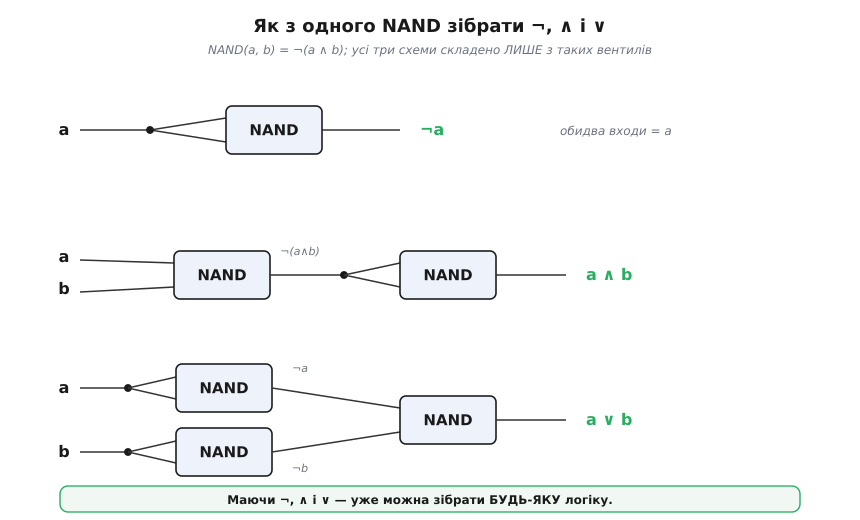

# Функціональна повнота

<preknowlist>
- [Булева алгебра](root:math-logic/boolean-algebra) — значення 0/1, таблиця істинності, дії ∧ («і»), ∨ («або»), ¬ («не») та запис будь-якої функції сумою добутків.
</preknowlist>

Логічних операцій напрочуд багато. «І», «або», «не» — це лише початок. Є ще «виключне або» (⊕: істинно, коли входи **різні**), «якщо…то» (→), «тоді й лише тоді» (≡), «не-і», «не-або»… Якщо порахувати чесно, різних операцій із двома входами рівно **шістнадцять** — стільки, скількома способами можна заповнити стовпчик виходу в таблиці з чотирьох рядків. А з трьома входами їх уже 256, з чотирма — понад шістдесят тисяч. Загальна формула вибухає на очах:

```
функцій від n входів  =  2^(2ⁿ)
n = 1  →      4
n = 2  →     16
n = 3  →    256
n = 4  →  65536
```

Звідси природне, майже господарське запитання: невже для кожної з цих незліченних функцій потрібен свій окремий інструмент? Чи, може, є маленький набір базових дій, з яких **складається геть усе** — як усі слова з кількох десятків літер, усі речовини з сотні хімічних елементів, усі відтінки екрана з трьох кольорів? Якщо такий набір існує, його звуть **функціонально повним** (англ. *functionally complete*). Уся ця стаття — про те, які набори повні, які ні, і, найцікавіше, як цю повноту чи неповноту **строго довести**.

Кілька слів про запис, бо тут зручніша логічна нотація. Далі ¬ — це «не», ∧ — «і», ∨ — «або» (інженери пишуть їх як риску згори, крапку й плюс: Ā, A·B, A+B — це те саме). Знадобляться ще ⊕ (виключне або, XOR) і → (імплікація, «якщо A, то B»).

## Що означає «повний»

Домовмося точно. Набір логічних операцій **функціонально повний**, якщо **будь-яку** булеву функцію — хоч яку завгодно, від будь-якого числа входів — можна виразити формулою, що вживає **лише** операції з цього набору (та самі входи, скільки завгодно разів). Ніяких сторонніх дій доточувати не дозволено: тільки цеглинки з набору, скільки завгодно накладені одна на одну.

Це строга, перевірна властивість, а не враження. «Повний» не означає «зручний» чи «звичний» — означає рівно одне: **нічого не бракує**, з наявного будується все. Порожній набір не повний (з нічого нічого не збудуєш); набір з одного лише ¬ не повний (заперечення жонглює одним входом, але ніяк не поєднує два); а от {¬, ∧, ∨}, як побачимо, повний — і це ще не межа скромності.

## Трьох дій вистачає — і це доводиться механічно

Що набору {¬, ∧, ∨} досить на все — не диво, а наслідок дуже прямого рецепта. Візьмімо **будь-яку** функцію, задану таблицею істинності, і подивімося лише на ті рядки, де вихід дорівнює 1. Для кожного такого рядка випишемо один «добуток» (∧ усіх входів), підібраний так, щоб він давав 1 **тільки** на цьому конкретному наборі входів: беремо сам вхід, де він тут 1, і його заперечення, де 0. Тоді всі ці добутки з'єднаємо через ∨. Готова формула спрацьовує 1 саме там, де треба, і 0 усюди інше — тобто точно відтворює таблицю.

Цей прийом — [сума добутків](root:math-logic/boolean-algebra): будь-яку таблицю істинності механічно переписують у формулу з ¬, ∧, ∨, беручи по одному добутку-«міну» на кожен одиничний рядок і склеюючи їх через ∨. Уже з нього випливає, що {¬, ∧, ∨} — повний набір.

Оскільки рецепт працює для **геть будь-якої** таблиці, а таблиця повністю задає функцію, набір {¬, ∧, ∨} справді покриває все. Але тут ховається важливіша думка: якщо трьох вистачило, то, можливо, і трьох забагато? Раптом якусь із них можна викинути, виразивши через дві інші?

**Викидаємо ∨.** Закон Де Моргана каже: a ∨ b = ¬(¬a ∧ ¬b). Перевіримо цю рівність механічно:

```
a=0, b=0:  ¬(¬0 ∧ ¬0) = ¬(1 ∧ 1) = ¬1 = 0   (і a∨b = 0)  ✓
a=0, b=1:  ¬(¬0 ∧ ¬1) = ¬(1 ∧ 0) = ¬0 = 1   (і a∨b = 1)  ✓
a=1, b=0:  ¬(¬1 ∧ ¬0) = ¬(0 ∧ 1) = ¬0 = 1   (і a∨b = 1)  ✓
a=1, b=1:  ¬(¬1 ∧ ¬1) = ¬(0 ∧ 0) = ¬0 = 1   (і a∨b = 1)  ✓
```

Усі чотири рядки збіглися, отже ∨ — не самостійна дія, а переодягнена комбінація ¬ і ∧. Набір **{¬, ∧}** уже повний. Дзеркально, через другий закон Де Моргана a ∧ b = ¬(¬a ∨ ¬b), повний і **{¬, ∨}**. Виявляється, повних наборів — купа: {¬, ∧}, {¬, ∨}, {¬, →} і так далі. Ніби скромність вичерпано: заперечення нікуди не дінеш, воно ж єдине, що вміє «перевертати».

Так здається — доки не станеться майже фокус.

## Одна-єдина операція на все

Візьмімо дію **NAND** — «не-і», заперечення кон'юнкції: a | b = ¬(a ∧ b). Вертикальна риска — це **штрих Шеффера** (*Sheffer stroke*); словами дія читається просто: «неправда, що обидва». Виявляється, цієї **однієї** операції досить, щоб збудувати ¬, ∧, ∨ — а отже й геть усе.

Ключ до фокуса — подати обидва входи NAND однаковими:

```
a | a  =  ¬(a ∧ a)  =  ¬a          ← ось і заперечення
```

Маємо ¬. Тепер ∧ — це просто NAND, у якого зняли заперечення, а зняти його ми вже вміємо (застосувати NAND до самого себе):

```
(a | b) | (a | b)  =  ¬(a | b)  =  ¬¬(a ∧ b)  =  a ∧ b
```

А ∨ дає Де Морган, бо ¬ і ∧ у нас уже є (або ще коротше — заперечити кожен вхід, тоді NAND):

```
(a | a) | (b | b)  =  ¬a | ¬b  =  ¬(¬a ∧ ¬b)  =  a ∨ b
```

Три рядки — і з самого лише NAND зібрано весь класичний набір, а з ним і будь-яка логіка на світі.


*Три схеми з одного типу вентиля. Зверху: обидва входи NAND зведено до a — виходить ¬a. Посередині: перший NAND дає ¬(a∧b), другий (як інвертор) знімає заперечення — виходить a∧b. Знизу: спершу кожен вхід заперечуємо власним NAND, тоді третій NAND над ними дає a∨b. Маючи ¬, ∧, ∨, далі можна зібрати будь-що.*

Перевірмо це не на слово, а кодом: задамо функцію таблицею істинності й переконаймося, що зібрані з NAND ¬, ∧, ∨ збігаються зі своїми визначеннями на **всіх** входах.

**Приклад (усе з NAND, з машинною перевіркою).** Двовходову функцію представимо четвіркою виходів для входів (0,0), (0,1), (1,0), (1,1).

```python
INPUTS = [(0, 0), (0, 1), (1, 0), (1, 1)]

def nand(a, b):
    return 1 - (a & b)                 # ¬(a ∧ b) — єдина цегла

# З одного лише NAND:
def not_(a):     return nand(a, a)               # ¬a
def and_(a, b):  return not_(nand(a, b))         # a ∧ b = ¬(a | b)
def or_(a, b):   return nand(not_(a), not_(b))   # a ∨ b = ¬a | ¬b

# Звіряємо з еталонними таблицями істинності на всіх входах:
assert [not_(a)    for a, _ in INPUTS] == [1, 1, 0, 0]
assert [and_(a, b) for a, b in INPUTS] == [0, 0, 0, 1]
assert [or_(a, b)  for a, b in INPUTS] == [0, 1, 1, 1]
print("усе зібрано з NAND і збігається")
```

Жоден `assert` не спрацював — отже кожна з трьох дій відтворена точно, самим лише NAND. А маючи {¬, ∧, ∨}, ми вже маємо все.

Те саме вміє й **NOR** — «не-або», a ↓ b = ¬(a ∨ b); риску-стрілку ↓ звуть **стрілкою Пірса** (*Peirce arrow*). І це не випадкові двоє щасливчиків: з усіх шістнадцяти двовходових операцій рівно **дві** — NAND і NOR — самодостатні поодинці. Решта чотирнадцять поодинці неповні; чому саме дві й саме ці — стане видно трохи згодом, коли з'явиться критерій.

> 🔧 **Навіщо це.** Ця «іграшка» лежить в основі цілої індустрії. У кремнії NAND і NOR — найдешевші, найшвидші, найкомпактніші вентилі (у [КМОН](root:hw-digital/nand-nor)-логіці інвертор — це два транзистори, NAND — чотири, а от «чисте» AND доводиться робити як NAND плюс інвертор, тобто **дорожче**). Тому фабрики не тримають окремих схем під кожну функцію: вони будують мільярди однакових NAND-вентилів і з них складають усе — від суматора до цілого процесора. Функціональна повнота — це дозвіл проєктувати весь чип із одного типу цеглинки. А історично цей факт двічі відкрили незалежно: [як Пірс мовчки випередив усіх, а Шеффер і Пост дали йому строгий вигляд](root:math-logic/functional-completeness/hist-post.md).

## Найважче: як довести, що набір НЕ повний

Показати повноту легко — досить один раз збудувати з набору щось універсальне (наприклад ¬ і ∧). А як довести протилежне — що набору **не** вистачає? Тут не спрацює перебір: комбінацій формул нескінченно багато, і «я не зміг скласти ¬» нічого не доводить — може, погано шукав.

Потрібен інший хід — знайти **властивість**, яку (1) мають усі операції набору й яку (2) **зберігає** будь-яке їх сполучення, але якої **немає** в тієї функції, що ми хочемо дістати. Тоді жодна формула з набору тієї функції не дасть — хоч мільйон років складай.

Розгляньмо найпростіший приклад цієї логіки. Спитаймо: чи можна дістати ¬ із самих лише {∧, ∨}? Придивімося до властивості «**монотонність**» (гр. *monótonos* — однаковий хід): функція монотонна, якщо збільшення будь-якого входу з 0 до 1 **ніколи не зменшує** вихід. І ∧, і ∨ монотонні — додавши десь одиницю, ти вихід або лишиш, або піднімеш, але не опустиш. Мало того: **сполучення** монотонних функцій знову монотонне (якщо жодна ланка не вміє «опускати», то й весь ланцюг не вміє). А тепер ¬: піднявши вхід з 0 до 1, воно **опускає** вихід з 1 до 0 — сама антимонотонність. Отже ¬ не витягти з {∧, ∨} ніколи: монотонність — та стіна, крізь яку заперечення не проходить. Набір {∧, ∨} **не повний**.

Ось так це працює: знайшли інваріант (монотонність), показали, що набір його не порушує, а ціль порушує — і питання закрите строго, без перебору.

## П'ять стін Поста

Виникає велика спокуса: а скільки таких «стін» треба перевірити, щоб напевно судити про будь-який набір? Відповідь напрочуд ощадлива, і вона — серце всієї теми. Еміль Пост (*Emil Post*) 1941 року довів, що стін рівно **п'ять**. Ось ці п'ять властивостей-інваріантів (кожну зберігає будь-яке сполучення функцій, що її мають):

- **Зберігає 0** (T₀): на всуціль нульовому вході дає 0, тобто f(0,…,0) = 0. Таких — ∧, ∨, ⊕. Не таких — ¬, NAND, константа 1.
- **Зберігає 1** (T₁): на всуціль одиничному вході дає 1, f(1,…,1) = 1. Таких — ∧, ∨. Не таких — ¬, ⊕, NAND.
- **Монотонна** (M): збільшення входу не зменшує виходу. Таких — ∧, ∨, константи. Не таких — ¬, NAND.
- **Самодвоїста** (S): перевертання всіх входів рівносильне перевертанню виходу, f(¬a,…) = ¬f(a,…). Такою є ¬. Не такі — ∧, ∨.
- **Лінійна (афінна)** (L): вихід — це XOR кількох входів і, можливо, константи, без жодних «множень» ∧ між ними. Такі — ¬, ⊕, константи. Не такі — ∧, ∨, NAND. Це рівно ті функції, що записуються [поліномом Жегалкіна](root:math-logic/zhegalkin-polynomial) — XOR-нормальною формою — **без** доданків з добутком змінних.

**Критерій Поста** формулюється дивовижно чисто: набір функціонально повний **тоді й лише тоді**, коли він **не вміщується цілком у жодну** з цих п'яти властивостей. Інакше кажучи — для **кожної** з п'яти стін у наборі мусить знайтися хоча б одна функція, що цю стіну **порушує** (виходить із класу). Пропустив хоч одну стіну — скажімо, усі твої функції монотонні — і весь набір застряг усередині: сполученнями звідти не вибратися, повноти немає. [Повне доведення — чому саме п'ять і чому цього досить](root:math-logic/functional-completeness/math-post-criterion.md) спирається на те, що кожна з п'яти властивостей замкнена відносно сполучення функцій.

Зведімо це в одну картину — таблицю «хто в якому класі»:


*Рядки — операції, стовпці — п'ять класів Поста. Зелене «∉» означає, що операція **виходить** із класу (порушує його), сіре «∈» — що вона в ньому застрягла. Правило: набір повний ⟸⟹ у кожному стовпці є хоч одна зелена клітина. У NAND і NOR **весь рядок зелений** — вони поодинці виходять з усіх п'яти класів, тому кожен сам по собі повний. А ∧ і ∨ мають однакові «пастки» (обидва застрягли в «зберігає 0», «зберігає 1» і «монотонна»), тож набір {∧, ∨} у цих стовпцях зелені не набере — і повним не буде.*

Тепер видно, чому саме NAND і NOR — щасливчики: їхній рядок у таблиці суцільно зелений, вони самотужки вибивають усі п'ять стін. І видно, чому неповні цілі знайомі набори:

**Приклад (набір {⊕, ¬, 1} не повний).** Усі три — XOR, заперечення, константа-одиниця — **лінійні**: у їхньому поліномі Жегалкіна немає жодного добутку змінних. А лінійність зберігається під сполученням: складіть лінійні функції як завгодно — вийде знову лінійна.

```
стовпець L (лінійна):  ⊕ — лінійна,  ¬ = 1⊕a — лінійна,  1 — лінійна
жодна не виходить з L  →  у стовпці L немає зеленого
отже сполученнями звідси НЕ дістати ∧ (у неї в поліномі є добуток a·b)
```

Набір {⊕, ¬, 1} замкнений у класі лінійних функцій — а ∧ туди не належить, тож її не збудувати. Неповний. (Це, до речі, не абстракція: саме тому на самих лише XOR-ах — хай як їх переплітай — суматор не збудуєш; десь конче потрібна «нелінійна» дія на кшталт ∧.)

**Приклад (одна імплікація → не повна, а з нулем — повна).** Імплікація a → b порушує чотири стіни з п'яти, але застрягла в одній — вона зберігає 1 (з двох одиниць 1 → 1 = 1). Отже сама → неповна: у стовпці «зберігає 1» вона зеленого не дає. Та досить додати константу **0** — вона одиницю не зберігає (0 ≠ 1) і латає рівно цю пробоїну:

```
              T₀    T₁    M     S     L
  →           ∉     ∈     ∉     ∉     ∉
  0           ∈     ∉     ∈     ∉     ∈
разом:        є     є     є     є     є     ← у кожному стовпці зелене
```

У кожному з п'яти стовпців тепер знайшлася функція, що виходить із класу, — отже набір {→, 0} повний. Тому в логіці імплікацію з константою «хибність» беруть за повноцінний фундамент, з якого виводять решту зв'язок.

Якщо хочеться не звіряти таблицю оком, а перевірити повноту будь-якого набору **машинно** — [алгоритм і робочий код](root:math-logic/functional-completeness/proj-completeness-check.md) роблять рівно те саме: рахують для кожної функції п'ять ознак і дивляться, чи кожен стовпець «пробитий».

> 🔧 **Навіщо це.** Критерій Поста — це не колекція курйозів, а робочий інструмент проєктування. Коли ви обираєте базовий набір вентилів для нової технології, елементів для ПЛІС чи навіть примітивів для мови опису обладнання, питання «а чи вистачить цього на все?» вирішується не інтуїцією і не перебором, а перевіркою п'яти ознак. П'ять коротких перевірок дають **гарантію**: якщо набір проходить критерій — він збудує будь-яку логіку, яку ви колись захочете; якщо ні — точно знайдеться функція, яку цим набором не зробити нізащо, і краще дізнатися про це до, а не після запуску фабрики.

## Що з цього забрати

**Функціональна повнота** — це властивість набору логічних операцій бути універсальним будівельним матеріалом: з нього виражається **будь-яка** булева функція, хоч яка складна. Що {¬, ∧, ∨} повний — видно прямо із суми добутків; але набір можна стискати аж до **однієї** операції: NAND (штрих Шеффера) чи NOR (стрілка Пірса) поодинці будують геть усе, і саме тому весь цифровий світ стоїть на цих двох вентилях. Довести ж **не**повноту дає змогу критерій Поста: є рівно п'ять «стін»-властивостей (зберігає 0, зберігає 1, монотонна, самодвоїста, лінійна), кожну з яких сполучення функцій не руйнує; набір повний тоді й лише тоді, коли для кожної з п'яти стін у ньому є функція, що її пробиває. Проста перевірка п'яти ознак заміняє нескінченний перебір — і перетворює туманне «здається, вистачить» на строгу гарантію.
