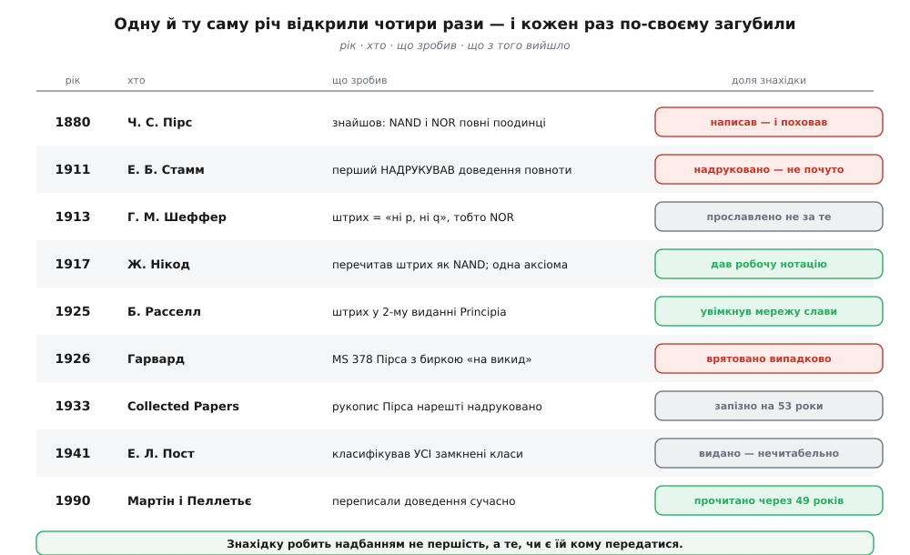
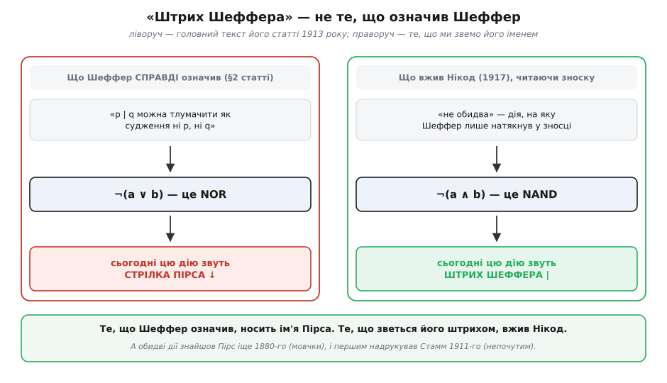
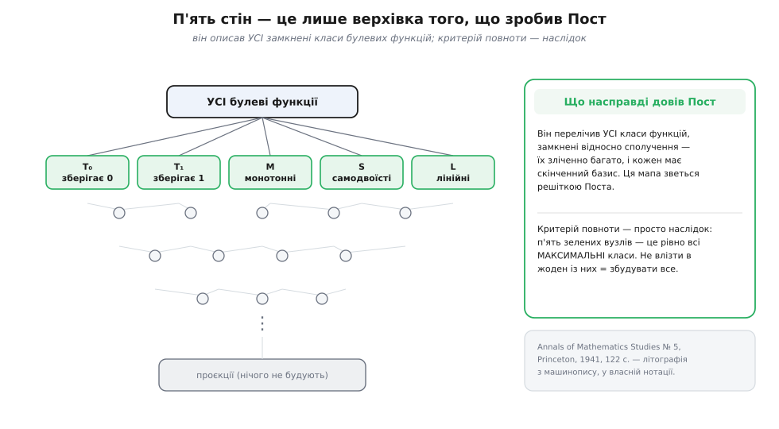

# 📜 Тричі знайдено, раз названо — і названо не тим іменем

Дії, що поодинці будують усю логіку, носять людські імена. NAND — «штрих Шеффера». NOR — «стрілка Пірса». Перевірка, чи набору вистачить на все, — «критерій Поста». Три прізвища на одну невелику ділянку математики: здається, тут усе давно чесно поділено й з'ясовано.

Насправді жодне з цих імен не стоїть там, де мало би стояти. Той, хто знайшов усе першим, не надрукував ані рядка — і його рукопис через сорок шість років лежав у Гарварді з биркою «на викид». Той, хто надрукував першим, дістав зневажливу рецензію й зник із пам'яті на ціле століття. Той, чиїм іменем усе назвали, означив у своїй статті **іншу** дію — не ту, що сьогодні звуть його штрихом. А той, хто дав вичерпну відповідь на все питання, написав її так, що півстоліття її мало хто дочитав.

Розказувати це варто не заради курйозу. Уся плутанина має спільну причину, і причина ця повчальна: **знахідку робить надбанням не першість**. Першість — це мить, коли ти щось побачив. Надбання — це коли побачене має кому передатися. Між цими двома подіями тут лежить від дванадцяти до п'ятдесяти трьох років, і кожен розрив має свою цілком зрозумілу, майже механічну причину.


*Одну й ту саму математичну річ знайшли незалежно кілька разів. Червоне — знахідка не дійшла до людей узагалі. Сіре — дійшла, але скалічена: не тією назвою, не вчасно, не тією мовою. Зелене — знахідка таки поїхала далі. Уся ця історія — у правому стовпці.*

## Питання, з якого все почалося: скільки цеглин конче потрібно

У другій половині XIX століття [алгебра логіки](root:math-logic/boolean-algebra) вже стояла на ногах. Джордж Буль звів міркування до дій над нулями й одиницями, Вільям Стенлі Джевонс і Ернст Шрьодер відшліфували її до звичного нам вигляду з «і», «або», «не». Інструмент працював.

Але щойно інструмент починає працювати, у математика прокидається інший інстинкт — **ощадливість**. Не «чи вистачить цього?», а «а скільки з цього зайве?». Ті самі люди, що будували геометрію з п'яти постулатів, дивилися на набір логічних дій і питали: чи всі вони справді первинні? Може, «або» — це переодягнене «і» з запереченнями? (Так і виявилося: закони Де Моргана.) А якщо так — де дно? Скільки дій **конче** потрібно, щоб із них зібралося геть усе?

Це не було практичне питання: жодного вентиля тоді ще не існувало, кремній лежав у піску, а слово «комп'ютер» означало людину, що рахує. Питання було суто естетичне — питання про **фундамент**. І саме тому відповідь на нього шукали поодинці, у тиші, без поспіху й без грошей. Це багато пояснить далі.

## Пірс, що склав знахідку в шухляду

**Чарлз Сандерс Пірс** (*Charles Sanders Peirce*, 1839–1914) — американський логік, філософ, хімік і геодезист, людина, що заклала семіотику й прагматизм і при тому вміла посваритися з усіма. 1884 року він утратив посаду в Університеті Джонса Гопкінса — і академічної роботи більше не мав ніколи; останні десятиліття доживав у злиднях у містечку Мілфорд у Пенсильванії, пишучи в стіл.

Десь 1880 року Пірс узявся за рукопис, що мав стати першим розділом його «Найпростішої математики» (*The Simplest Mathematics*), і дав йому назву «A Boolian Algebra with One Constant» — «Булева алгебра з однією сталою». Прізвище Буля він при цьому написав із помилкою; так, із помилкою, воно й дійшло до нас. Каталожний номер цього рукопису — MS 378.

Пірс поставив питання руба: доведімо ощадливість до кінця — не дві дії, не три, а **одна**. І знайшов, що це можливо. Мало того — знайшов, що годяться **дві різні** дії, кожна сама по собі: «не обидва» й «ні те, ні те». Тобто рівно те, що ми сьогодні звемо NAND і NOR.

Пізніше, у праці 1902 року, він дав цій дії назву — **ampheck**:

```
ampheck  ←  гр. ἀμφήκης (amphēkēs) — «двосічний», що ріже на обидва боки
```

Назва точна: одна й та сама ощадлива ідея ріже на два боки, бо працює у двох дзеркальних подобах — і як «не обидва», і як «ні те, ні те». Пірс бачив обидві й розумів, що вони рівноправні.

І не надрукував нічого з цього.

Він помер 1914 року. Узимку 1914–15 його вдова Джульєтта передала Гарвардському факультету філософії гори рукописів — тисячі сторінок нерозібраного паперу. Далі сталася річ, від якої й досі бере мороз: **1926 року MS 378 усе ще лежав із позначкою «на викид»**. Сорок шість років після написання рукопис, у якому вперше в історії людства зведено всю логіку до одної дії, стояв у черзі на смітник. Його витягли звідти в останню мить.

Надрукували його аж **1933 року** — у четвертому томі «Зібраних праць» Пірса (*Collected Papers*, ред. Чарлз Гартсгорн і Пол Вайс, Гарвардський університет), на сторінках 13–18. Через п'ятдесят три роки після написання. Через дев'ятнадцять років після смерті автора. І — головне — через **двадцять** років після того, як те саме надрукував і прославив хтось інший.

Це не єдиний такий випадок у Пірса. За висновком історика логіки Ірвінга Анелліса, перша в історії повна таблиця істинності — та сама сітка «вхід → вихід», без якої сьогодні не обходиться жодне пояснення логіки, — накреслена рукою Пірса в неопублікованому рукописі **1893 року**, років на тридцять раніше за всіх, кому це приписують. Доказовий статус тут твердий: рукописи датовані, описані в каталозі й давно надруковані. Спірне не «чи знайшов», а «що це означає».

> 🔧 **Навіщо це.** Історія Пірса ставить незручне питання: а що взагалі означає «відкрив»? Якщо відкриття — це момент, коли одна голова щось побачила, то NAND-повноту відкрив Пірс 1880 року, крапка. Але наука — не змагання голів, а **спільна пам'ять**: факт існує рівно настільки, наскільки він доступний тому, кому знадобиться. За цією міркою знахідка Пірса не існувала до 1933 року — вона лежала в шухляді, як лежить у землі не викопана руда. Обидві відповіді правдиві, і разом вони пояснюють увесь дальший безлад: перша каже, чиє ім'я мало би стояти на дії, а друга — чому там стоїть чуже.

## Стамм, якого надрукували й не почули

Тут історія робить різкий поворот, про який стандартний переказ мовчить.

**Едвард Броніслав Стамм** (*Edward Bronisław Stamm*, 10 березня 1886, Тарнів — листопад 1940, Величка) — польський математик, логік, філософ та історик математики. Не професор: гімназійний учитель із дипломом Віденського університету. Дивак у найкращому сенсі — листувався з Джузеппе Пеано й обстоював його *latino sine flexione*, «латину без відмінювання», сконструйовану мову для науки; частину власних праць писав саме нею.

1911 року Стамм надрукував статтю «Beitrag zur Algebra der Logik» («Внесок до алгебри логіки») у віденському часописі *Monatshefte für Mathematik und Physik*, том 22, сторінки 137–149. У ній він описав обидві дії — «не обидва» й «ні те, ні те» — і показав, що рештою логічних дій із них виражається. Для NAND він уживав знак-**гачок**, для NOR — **зірочку** (∗).

Це перша в історії **надрукована** праця, де доведено повноту NAND. За два роки до Шеффера.

Її не почули. Рецензію на неї написав Леопольд Льовенгайм — той самий, чиїм іменем названо теорему Льовенгайма–Сколема, людина з вагою — і визнав результати не надто корисними. І все. Стамм лишився в пам'яті нащадків хіба що як автор розвідки про «Трактат про континуум» Томаса Бредвардина в часописі *Isis* (1936). Річ, за яку його мали б знати всі, хто вивчав логіку, не згадувалася в стандартній історії поняття майже сто років; лише останнім часом — насамперед стараннями історика логіки Ричарда Заха, який 2023 року запропонував назвати NAND «гачком Стамма», — вона повернулася в обіг.

Чому не почули? Причини сумно буденні, і жодна з них не математична. Стамм друкувався німецькою у фаховому місячнику для математиків і фізиків, а не в логічному виданні. Він був шкільний учитель без кафедри, без учнів і без школи, яка підхопила б і понесла. Він не мав заступника з іменем. А мав — зневажливий відгук від людини з вагою. Знахідка була в друку, тобто формально доступна кожному — і не дійшла ні до кого.

**Порівняйте два провали.** Пірс не мав читача взагалі. Стамм читача мав — і однаково не мав **мережі**: ланцюжка людей, готових прочитати, повторити, послатися й понести далі. Друк сам по собі не є передаванням; він лише робить передавання можливим.

## Шеффер: ім'я, що прилипло до чужої дії

**Генрі Моріс Шеффер** (*Henry Maurice Sheffer*, 1 вересня 1882, Одеса — 17 березня 1964, Бостон).

Тут варто бути точним із походженням, бо його зазвичай окреслюють одним недбалим словом. Шеффер народився в Одесі, що тоді була в Російській імперії, а сьогодні є в Україні. Родина — єврейська, ідишомовна: він був одним із дев'ятьох дітей Макса та Іди (з дому Гіршберг) Шефферів. 1893 року родина емігрувала до Бостона на кораблі «Каліфорнія». Отже: американський логік, народжений в Одесі в єврейській родині. Місце народження було в межах імперії — це факт про кордони імперії, а не про те, ким була ця людина: мовою його дитинства був ідиш, домом — одеська єврейська громада, а до часу написання своєї знаменитої статті він був уже бостонський випускник із гарвардським дипломом.

Учився блискуче: Бостонську латинську школу — шестирічний курс — здолав за три роки. Далі Гарвард: бакалавр 1905, магістр 1907, доктор 1908 — під керівництвом Джозаї Ройса.

Із 1911 до 1916 Шеффер перебивався тимчасовими посадами по різних університетах. Славнозвісна стаття підписана: «Cornell University, February, 1913».

Гляньмо на її назву, бо в ній уже сидить розгадка: «**A Set of Five Independent Postulates for Boolean Algebras, with Application to Logical Constants**» — «Набір із п'яти незалежних постулатів для булевих алгебр, із застосуванням до логічних сталих» (*Transactions of the American Mathematical Society*, т. 14, № 4, с. 481–488). Головна тема — **аксіоматика**: п'ять незалежних постулатів. Те, чим Шеффера знає весь світ, стоїть у назві як «застосування» — коду, приробок наприкінці.

А тепер найсмачніше. У §2 своєї статті Шеффер пише, що його дію можна тлумачити як судження «**ні p, ні q**», і що вона має властивості логічної сталої **відкидання** (*rejection*).

«Ні p, ні q» — це **NOR**. Не NAND.

NAND у статті теж є — але лише у **зносці** наприкінці §2, де Шеффер зауважує, що за принципом двоїстості все сказане так само справджується, якщо читати дію як «не-p або не-q». Окремого знака для неї він не дав. Одна фраза дрібним шрифтом унизу сторінки.

```
Шеффер, §2, 1913:  p | q  ≡  «ні p, ні q»  =  ¬p ∧ ¬q  =  ¬(p ∨ q)   ← це NOR
зноска до §2:      за двоїстістю те саме працює для «не-p або не-q»
                                              ¬p ∨ ¬q  =  ¬(p ∧ q)   ← це NAND, без свого знака
Нікод, 1917:       p | q  ≡  «не обидва»                =  ¬(p ∧ q)   ← і саме це прижилося
```

І це не дрібниця «майже те саме». Дві дії справді різні — вони розходяться рівно там, де входи не однакові:

```
   p  q │  ¬(p∨q)   ¬(p∧q)
        │   NOR      NAND
   0  0 │    1        1      ← збігаються
   0  1 │    0        1      ← розходяться
   1  0 │    0        1      ← розходяться
   1  1 │    0        0      ← збігаються
```

Обидві повні поодинці, обидві однаково варті слави — але це **різні функції**: половина таблиці в них не збігається. А наслідок такий: те, що Шеффер справді означив, ми сьогодні звемо **стрілкою Пірса**. А «штрихом Шеффера» звемо те, що Шеффер помістив у зноску й навіть не позначив.


*Ліворуч — головний текст статті 1913 року: дія, яку Шеффер узяв за основу, це «ні p, ні q», тобто NOR. Праворуч — те, що носить його ім'я сьогодні: «не обидва», тобто NAND, дія зі зноски, яку в обіг увів Нікод. Підміна сталася не через чийсь злий намір, а тому, що назви ліпляться не до першоджерела, а до тієї подоби, у якій факт пішов між людьми.*

Далі життя Шеффера складається так, що іронія стає їдкою. Він майже нічого більше не надрукував — самих деталей свого методу так ніколи й не опублікував, лишивши їх у розмножених на ротаторі конспектах і в коротенькій тезі. 1917 року повернувся до Гарварда — і **десять років** пробув простим викладачем. Першу професорську сходинку він дістав лише 1927 року, через **чотирнадцять** років після статті, що зробила його прізвище загальником у логіці; наступну — 1929; повним професором став аж 1938; на пенсію пішов 1952. Просуванню заважав антисемітизм, звичайний для тодішнього Гарварда; сам Шеффер тяжко страждав від депресії. Колеги згадували його як людину надзвичайно теплу й щедру до учнів. Помер 17 березня 1964 року в Бостоні, у вісімдесят один рік.

Одне з найчастіше вимовлюваних прізвищ у логіці — за вісім сторінок тексту. І приліплене не до тієї дії.

## Нікод і Расселл: як факт нарешті поїхав

Стаття Шеффера вийшла 1913 року й дванадцять років лежала тихо. Її треба було **зрушити** — і зрушили її двоє.

**Жан Нікод** (*Jean Nicod*, 1 червня 1893, Париж — 16 лютого 1924, Женева) — французький логік і філософ, що помер від сухот у тридцять років. 1917 року він надрукував працю «A Reduction in the Number of the Primitive Propositions of Logic» («Скорочення числа первинних тверджень логіки», *Proceedings of the Cambridge Philosophical Society*, т. 19, с. 32–41), де зробив річ разючої краси: показав, що всю класичну логіку висловлювань можна вивести з **однієї-єдиної аксіоми** й **одного** правила виведення — і те, й те записане самим лише штрихом.

Ощадливість, що її Пірс довів до однієї дії, Нікод довів до однієї аксіоми. І саме Нікод першим ужив штрих у значенні «не обидва» — тобто як NAND. Саме його прочитання перемогло: воно було зручніше йому для його аксіоми, а далі його система пішла в люди — і потягла за собою прочитання.

Пішла ж вона в люди через **Бертрана Расселла**. Друге видання «Principia Mathematica» (Кембриджський університет; том I — 1925, томи II–III — 1927) — це передрук першого з новим вступом, який Расселл писав сам. У тому вступі він називає заміну «або» й «не» на штрих Шеффера найпевнішим поліпшенням, що його дала праця з математичної логіки за останні чотирнадцять років, і бере на озброєння одну аксіому Нікода з одним правилом.

Ось і все. **Не стаття 1913 року зробила Шеффера знаменитим, а абзац Расселла 1925-го.** Дванадцять років факт лежав надрукований і майже нікому не потрібний, аж доки найгучніший логік епохи не сказав про нього вголос у найвідомішій книжці епохи.

Поруч дозрівало те саме й з іншого боку. Людвіг Вітґенштайн у «Логіко-філософському трактаті» (німецькою — 1921, англійською — 1922) поклав в основу всієї логіки свій оператор **N** — спільне заперечення будь-якої кількості тверджень, тобто узагальнений NOR. Той самий здогад, у третьому чи четвертому незалежному підході.

> 🔧 **Навіщо це.** Складіть докупи, що саме зрушило факт із місця, — і вийде напрочуд конкретний рецепт, який не має стосунку до математики. Потрібні були три речі: **заступник із трибуною** (Расселл, і жодне слово Стамма не важило проти одного абзацу Расселла), **придатна нотація** (штрих Нікода, у якому справді зручно писати) і **привід ужити** (одна аксіома замість п'яти, тобто відчутний зиск для того, хто візьме). Приберіть будь-яку — і факт лишиться в шухляді Пірса чи в німецькому місячнику Стамма. Це стосується не лише 1913 року: те саме вирішує сьогодні долю бібліотеки, стандарту чи мови програмування.

## Пост: не «одна відповідь», а вся мапа

Хто дав відповідь **вичерпну** — не «ось одна повна дія», а «ось усі можливі відповіді на все питання»?

**Еміль Леон Пост** (*Emil Leon Post*, 11 лютого 1897 — 21 квітня 1954). Народився в Августові Сувальської губернії — це Царство Польське в складі Російської імперії, сьогодні Польща, — у польсько-єврейській родині. Батьки Арнольд і Перл перевезли сім'ю до Нью-Йорка в травні 1904 року. Точно: американський математик, народжений у Царстві Польському в польсько-єврейській родині. Двоє головних дійових осіб цієї історії — Шеффер і Пост — виїхали дітьми з околиць тієї самої імперії, з Одеси й Августова, і стали американцями; імперія не дала їм нічого, крім рядка «місце народження».

У дванадцять років Пост утратив у нещасному випадку ліву руку. Це перекреслило його мрію про астрономію — обсерваторії однорукого не брали — і виштовхнуло в математику. Бакалавр Міського коледжу Нью-Йорка 1917 року, магістр Колумбійського 1918, доктор 1920.

Його докторська, надрукована 1921 року як «Introduction to a General Theory of Elementary Propositions» (*American Journal of Mathematics*, т. 43, с. 163–185), — праця, з якої багато що почалося: систематичні таблиці істинності, доведення несуперечності й **повноти** логіки висловлювань «Principia Mathematica», перші багатозначні логіки.

І тут треба спинитися й розчепити два слова, бо обидва звуть «повнотою Поста», а це геть різні речі:

```
Пост, 1921 — ДЕДУКТИВНА повнота:    твердження про НАБІР АКСІОМ
             кожна тавтологія виводиться з аксіом (нічого істинного не проґавлено)

Пост, 1941 — ФУНКЦІОНАЛЬНА повнота:  твердження про НАБІР ДІЙ
             кожна функція виражається діями набору (нічого не забракло на будову)
```

Слово одне, предмет інший. Плутати їх — звична пастка.

Тим часом у Прінстоні близько 1921 року Пост підійшов упритул до теореми про неповноту — тієї, що за десять років прославить Курта Ґеделя, — і **не надрукував**: вважав, що бракує строгості. Його власний присуд собі гіркий і точний: він відкрив би теорему Ґеделя 1921 року, якби був Ґеделем. 1936-го він описав модель обчислення «Formulation 1» — робітника, що ходить уздовж нескінченної низки комірок і за скупим списком приписів ставить чи стирає в них позначки. Це рівносильно [машині Тюринга](root:computability/turing-machine): тій самій ідеї, у якій нескінченна стрічка з голівкою, що читає, пише й совається за скінченною таблицею правил, окреслює саме поняття «обчислення». Пост дійшов до цього незалежно й того самого року, що й Тюринг. Луну історії Пірса чути виразно: людина, що мала результат і сиділа на ньому.

А 1941 року вийшла та сама праця: «**The Two-Valued Iterative Systems of Mathematical Logic**» (*Annals of Mathematics Studies*, № 5, Прінстонський університет, 122 сторінки). Про неї треба знати дві речі, і жодна не та, якої чекаєш.

**Перша.** Пост не ставив собі за мету довести «є рівно п'ять стін». Він зробив куди більше: перелічив **усі** класи булевих функцій, замкнені відносно сполучення, — тобто всі можливі «замкнені світи», з яких сполученнями не вибратися. Виявилося, що таких класів **зліченно багато**, вони складаються в струнку мапу — сьогодні її звуть **решіткою Поста**, — і кожен клас має скінченний базис. Критерій повноти з п'ятьма стінами випадає з цієї мапи як простий наслідок: п'ять класів — це рівно всі **максимальні** нетривіальні класи, тож «не влізти в жоден із них» і означає «дотягтися до всього».


*Славетний критерій — це верхівка. Під п'ятьма максимальними класами тягнеться зліченно нескінченна мапа всіх замкнених класів, аж до самого дна, де лишаються самі проєкції, з яких не збудуєш нічого. Пост описав усю мапу — а в підручники з неї потрапив один верхній ярус. До речі, позначення теж розійшлися: там, де східноєвропейська традиція пише T₀, T₁, M, S, L, західна пише P₀, P₁, M, D, A — той самий об'єкт, дві школи.*

**Друга.** Цю працю майже ніхто не прочитав. Її **надруковано літографією просто з машинопису** — не набрано в друкарні, а сфотографовано сторінки, вистукані на друкарській машинці. Гірше за вигляд була мова: Пост писав у власній вигадливій нотації — за оцінкою логіків Нормана Мартіна й Френсіса Джеффрі Пеллетьє, це була заплутана переробка й без того заплутаної нотації **Джевонса** (так, того самого [Джевонса](root:math-logic/boolean-algebra/hist-boole.md), що півстоліття перед тим полагодив «плюс» у Булевій алгебрі), і виклад був такий, що сучасний логік у ньому насилу впізнавав доведення. Додайте, що Пост оперував не «клонами» в теперішньому сенсі, а власними «ітеративними системами», які не зобов'язані містити всі проєкції, — і стає ясно, чому книжку радше цитували, ніж читали.

Розв'язка приспіла аж **1990 року**: Мартін і Пеллетьє надрукували статтю «Post's functional completeness theorem» (*Notre Dame Journal of Formal Logic*, т. 31, № 3, с. 462–475) — доведення тієї самої теореми, переписане мовою, якою логіки говорять. Сорок дев'ять років по тому.

Ось третій, найтонший спосіб загубити знахідку. Пірс не надрукував. Стамма не почули. Пост надрукував усе, до останньої деталі, — і написав так, що читати нікому. Формально факт був у світі з 1941 року; насправді він увійшов у людський обіг значно пізніше й чужими руками.

Пост усе життя боровся з біполярним розладом. Викладав у Міському коледжі Нью-Йорка. Помер 21 квітня 1954 року від інфаркту після сеансу електросудомної терапії, у п'ятдесят сім років.

## Жегалкін: п'ята стіна має друге ім'я

Наостанок — коротка історія про те, що та сама хвороба буває не лише особиста, а й географічна.

П'ята стіна Поста — клас **лінійних** функцій — має свою окрему назву, бо в неї є свій окремий винахідник. **Іван Іванович Жегалкін** (*Ivan Zhegalkin*, 3 серпня 1869, Мценськ — 28 березня 1947, Москва) — російський і радянський математик, професор Московського університету, людина, що заклала там осередок математичної логіки. 1927 року він показав річ простої краси: булева алгебра — це насправді **кільце цілих чисел за модулем 2**.

```
Жегалкін, 1927:  логіка = арифметика за модулем 2
  a ⊕ b  — це додавання за модулем 2   (0⊕0=0, 0⊕1=1, 1⊕0=1, 1⊕1=0)
  a ∧ b  — це множення                 (0·0=0, 0·1=0, 1·0=0, 1·1=1)
  ¬a     — це  1 ⊕ a

Будь-яка функція — поліном. Ось повний вигляд для трьох змінних (kᵢ — нулі або одиниці):
  f(a,b,c) = k₀ ⊕ k₁a ⊕ k₂b ⊕ k₃c ⊕ k₄ab ⊕ k₅ac ⊕ k₆bc ⊕ k₇abc

Клас L (лінійні) = рівно ті поліноми, де НЕМА доданків із добутком:
  k₄ = k₅ = k₆ = k₇ = 0     тобто лишається  k₀ ⊕ k₁a ⊕ k₂b ⊕ k₃c
```

Звідси й [поліном Жегалкіна](root:math-logic/zhegalkin-polynomial): кожна булева функція записується таким виразом, і то **єдиним** способом — тому набір коефіцієнтів kᵢ є така сама повноцінна її подоба, як і таблиця істинності. Стіна «лінійність» у критерії Поста — це рівно ті функції, у чиєму поліномі немає жодного добутку змінних. І саме єдиність запису робить цю стіну придатною до вжитку: не «здається, добутків нема», а «їх нема, і це видно з одного погляду на коефіцієнти».

І — та сама хвороба, тільки в іншому масштабі. На захід від певної лінії той самий об'єкт майже завжди звуть **алгебричною нормальною формою** (ANF) і прізвища Жегалкіна не вимовляють. На схід від неї кажуть «поліном Жегалкіна» й рідко чують про ANF. Той самий вираз, дві назви, дві половини світу, що ціле століття робили одну науку, не чуючи одна одну через паркан. Тут, до речі, нема чого «викривати»: Жегалкін справді зробив те, що йому приписують, і його ім'я на цьому об'єкті стоїть по заслузі. Просто половина світу його не чує — з тієї самої причини, з якої ніхто не чув Стамма.

## Що з цього забрати

Четверо людей зробили тут по великій справі — і кожен загубив її по-своєму. Їхні долі складаються в напрочуд повний каталог способів **не** передати факт:

- **Пірс написав і поховав.** Знахідка є, читача немає. Ціна — п'ятдесят три роки й бирка «на викид».
- **Стамма надрукували й не почули.** Читач можливий, мережі немає: ні кафедри, ні школи, ні заступника — зате зневажливий відгук від людини з вагою. Ціна — сто років забуття.
- **Шеффера почули — і прославили за зноску.** Факт поїхав, ім'я приліпилося до сусідньої дії, а сам автор ще чотирнадцять років лишався рядовим викладачем.
- **Пост надрукував усе — нечитабельно.** Мапа накреслена вся, до останнього вузла, — і півстоліття лежить у власній нотації, як шифрований лист без ключа.

А що ж таки понесло факт? Не заслуга й не першість. Заступник із трибуною — Расселл. Придатна нотація — штрих Нікода. І, зрештою, переклад мовою свого часу — Мартін і Пеллетьє. Три речі, жодна з яких не математична.

Тому імена, які ми вимовляємо щодня, брешуть — але брешуть повчально. «Штрих Шеффера» — це прочитання Нікода зноски Шеффера до дії, яку першим надрукував Стамм і першим знайшов Пірс. Ніхто нікого не обманув: усі четверо чесні, кожен зробив своє. Просто назви пристають не до того, хто побачив, а до тих рук, із яких факт випав у обіг.

І остання дрібниця, від якої історія стає майже смішною. Питання, з якого все почалося, було чисто естетичне: скільки цеглин конче потрібно, щоб зібрати всю логіку? Ані Пірс у своїй шухляді, ані Стамм у своєму місячнику, ані Шеффер зі своїми п'ятьма постулатами не мали й гадки, що відповідь на нього колись матиме ціну. А майже через дев'яносто років ощадливість, доведена до однієї дії, [полетіла на Місяць](root:hw-digital/nand-nor/hist-apollo-nor.md): бортовий комп'ютер «Аполлона» інженери свідомо склали майже цілком з одного типу вентиля — [NOR](root:hw-digital/nand-nor). З тієї самої дії, яку Пірс назвав двосічною, Стамм позначив зірочкою, а Шеффер означив у §2 своєї статті — і яку ми, після всієї цієї плутанини, звемо **стрілкою Пірса**.

Тобто, як не крути, іменем того, хто справді був перший. Історія лишила справедливість там, де ніхто її не планував, — і забрала звідти, де на неї чекали.
