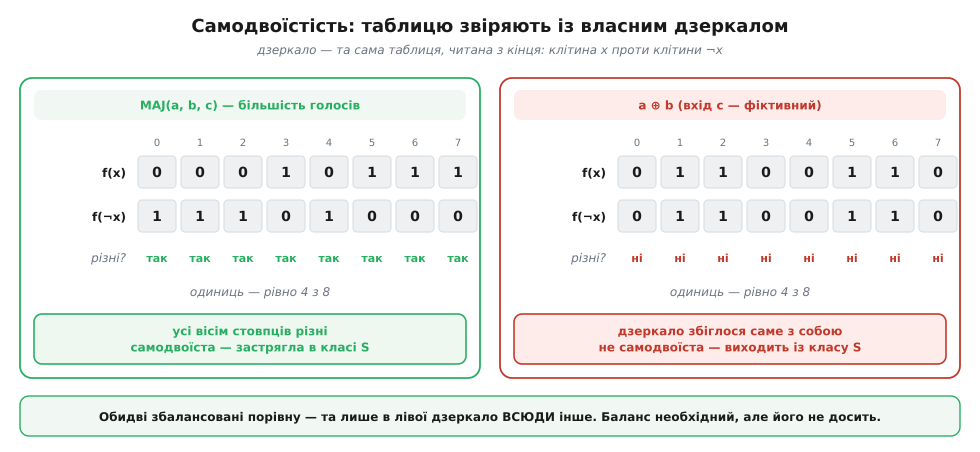
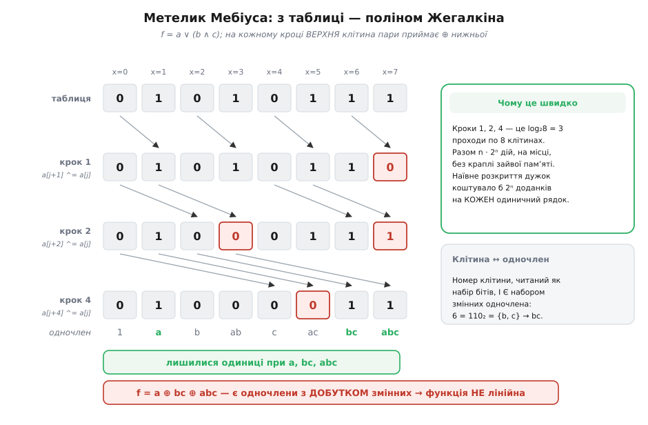

# ⚙️ Перевірка повноти машиною

Уявіть, що ви добираєте набір комірок під нову технологію: маєте вісім різних вентилів, кожен на три-чотири входи, і хочете знати одне — чи збудується з них геть усе. Оком тут уже нічого не звіриш. Функція з чотирма входами — це шістнадцять рядків таблиці; спитати себе «а чи вона, бува, не самодвоїста?» і чесно відповісти в голові не вийде навіть із доброю кавою. Питання просте, відповідь скінченна, ціна помилки — запущена фабрика. Отже, це робота для програми.

І тут одразу видно, де затримка. П'ять стін Поста сформульовано про **властивості функцій**: монотонна, самодвоїста, лінійна. Це прикметники — людські слова. Програма прикметників не бачить, вона бачить біти. Уся робота, отже, зводиться до одного: перекласти п'ять прикметників на п'ять скінченних запитань до скінченного об'єкта. Щойно переклад зроблено, критерій згортається в десяток рядків — і, що найприємніше, в **одну операцію АБО**.

## Що взагалі подавати на вхід

Перше рішення визначає все інше. Функція від n входів — це рівно її [таблиця істинності](topic:math-logic/boolean-algebra): 2ⁿ клітин, у кожній 0 або 1, і більше про функцію знати нічого. Формула, якою її записали, до справи не належить: `a ∧ b`, `¬(¬a ∨ ¬b)` і `¬(a | b)` — три різні тексти й одна функція, бо таблиця в них одна.

Це не дрібниця, а власне те, що робить перевірку можливою. Якби ми аналізували формулу, нас можна було б обдурити переписуванням: заховати заперечення так, щоб його не впізнали. Таблиця не піддається — вона вже врахувала всі перетворення, які взагалі можна зробити.

Домовимося про подання: `table[x]` — значення функції на наборі, закодованому числом `x`, де **біт k числа x — це значення k-ї змінної**. Тоді число входів n береться з довжини самої таблиці (2ⁿ клітин), а не приходить окремим параметром — менше можливостей збрехати:

```
n = 3,  table[x] для x = 0…7

x = 6  →  6 = 110₂  →  a = 0, b = 1, c = 1
довжина 8 = 2³      →  n = 3
```

Ця дрібна домовленість дає несподівано багато. Індекс клітини — уже готовий набір бітів, тож усі операції над входами стають операціями над числом-індексом: «підняти k-й вхід» — це `x | 1 << k`, «перевернути всі входи» — це `x ^ (2ⁿ − 1)`. Обидві знадобляться майже одразу.

## П'ять стін — п'ять запитань до таблиці

### Дві, що коштують по одному погляду

«Зберігає 0» означає f(0,…,0) = 0. Всуціль нульовий вхід — це індекс 0. Отже, весь клас T₀ уміщається в `table[0] == 0`. Дзеркально, «зберігає 1» — це f(1,…,1) = 1, всуціль одиничний вхід має індекс 2ⁿ − 1, тобто останню клітину: `table[last] == 1`. Два звертання до памʼяті — і дві стіни перевірено.

Такий разючий обвал складності не випадковий: обидві властивості говорять про **одну точку** таблиці. Ті три, що лишилися, говорять про таблицю **цілком** — і саме тому цікаві.

### Монотонність: досить ребер, а не всіх пар

«Збільшення будь-якого входу не зменшує виходу» найпростіше прочитати буквально: візьми всі пари наборів x і y, де x усюди не більший за y, і перевір, що f(x) ≤ f(y). Прочитати так можна, реалізувати теж — і це буде помилка ціною в цілий порядок швидкості. Порівнянних пар аж до 3ⁿ (кожна змінна: нуль в обох, одиниця в обох, або нуль→одиниця), а наївний подвійний цикл по всіх x та y обійде взагалі 4ⁿ комбінацій.

Робити цього не треба. Достатньо перевірити лише **сусідів по одному біту** — пари (x, x з піднятим k-м бітом). Причина проста, як сходинки: від будь-якого x до будь-якого більшого y можна дійти, піднімаючи по одному нулю за раз. Якщо жоден окремий крок не опускає вихід, то й уся дорога його не опускає — а якщо десь на дорозі вихід таки впав, то він упав на якомусь **конкретному кроці**, і той крок ми вже перевірили. Ловити нічого іншого не лишається.

Таких сусідських пар — рівно n·2ⁿ⁻¹: кожна з n змінних дає 2ⁿ⁻¹ ребер. Різниця з наївним варіантом не косметична:

```
n = 4:   ребер  4·2³ = 32        пар у наївному циклі  4⁴ = 256
n = 8:   ребер  8·2⁷ = 1 024     пар у наївному циклі  4⁸ = 65 536
n = 12:  ребер 12·2¹¹ = 24 576   пар у наївному циклі  4¹² ≈ 1.7·10⁷
```

І сам код виходить коротшим за буквальне прочитання означення — приємний випадок, коли швидше та ясніше збігаються.

### Самодвоїстість: таблиця проти власного дзеркала

Самодвоїста функція — та, для якої перевертання **всіх** входів рівносильне перевертанню виходу: f(¬a, ¬b, …) = ¬f(a, b, …). У поданні через індекси це лягає на диво чисто. Перевернути всі n входів — це перевернути всі n бітів індексу, тобто взяти `x ^ (2ⁿ − 1)`, а `2ⁿ − 1` — це просто `last`, індекс останньої клітини. Отже, умова читається так: `table[x] != table[last ^ x]` для **кожного** x. Досить одного збігу — і функція вибула з класу.

Ще наочніше: `last ^ x` пробігає індекси з кінця, коли x пробігає їх з початку. Тобто дзеркало функції — це **та сама таблиця, читана навпаки**, а самодвоїстість означає, що перевернута таблиця збігається з побітовим **запереченням** початкової. Не «схожа», а точно доповнює її в кожній клітині.


*Ліворуч — більшість голосів MAJ(a, b, c), праворуч — a ⊕ b, у якої третій вхід фіктивний. Верхній рядок кожної панелі — таблиця, нижній — вона ж, читана з кінця (це і є f(¬x)). Самодвоїстість вимагає, щоб УСІ вісім стовпців розійшлися: ліворуч так і є, праворуч дзеркало збіглося саме з собою в кожній клітині. При цьому одиниць в обох рівно чотири з восьми.*

Ця картина одразу закриває пастку, у яку легко вскочити. Оскільки самодвоїста функція розбиває всі 2ⁿ наборів на 2ⁿ⁻¹ дзеркальних пар і в кожній парі значення різні, одиниць у неї рівно половина. Тож **збалансованість — необхідна умова**, і рахувати одиниці швидко й спокусливо. Але вона ж і **не достатня**: у a ⊕ b одиниць рівно половина, а самодвоїстості нема ні на гріш. Лічильником одиниць цю стіну не перевірити — потрібне саме дзеркало.

### Лінійність: без полінома Жегалкіна не обійтися

Лишилася найхитріша стіна. «Лінійна» означає: вихід — це ⊕ якихось входів і, можливо, константи, без жодних добутків між змінними. Перша думка — подивитися на формулу: є в ній ∧ чи нема? Ця думка хибна, і хибна повчально:

```
(a ∧ b) ⊕ (a ∧ ¬b)  =  a ∧ (b ⊕ ¬b)  =  a ∧ 1  =  a
```

Два ∧ у тексті — а функція виявилася звичайнісіньким `a`, тобто цілком лінійною. Лінійність — властивість **функції**, не її запису; шукати ∧ очима в тексті формули означає перевіряти не те. Тож потрібна форма, яка в кожної функції **одна-єдина**, — щоб питання «є добутки чи нема» мало однозначну відповідь.

Така форма є: [поліном Жегалкіна](topic:math-logic/zhegalkin-polynomial) — запис функції як ⊕ одночленів-добутків (`1`, `a`, `bc`, `abc`, …), і для кожної булевої функції він рівно один. Тоді перевірка стає буквальною: обчислити поліном і подивитися, чи лишився в ньому хоч один одночлен, у якому змінних дві або більше.

Обчислити поліном можна двома способами, і різниця між ними — прірва. Наївний: узяти суму добутків і розкрити дужки, замінюючи ¬a на 1 ⊕ a. Кожен одиничний рядок породжує до 2ⁿ доданків, доданки взаємно знищуються — виходить купа роботи й гори сміття. Розумний спосіб зветься **перетворення Мебіуса** й робить те саме на місці, за log₂(2ⁿ) = n проходів по таблиці.

Працює він так. Пройдімо кроками зі стрідом 1, 2, 4, …, і на кожному кроці кожній «верхній» клітині пари додамо (через ⊕) значення «нижньої»: `a[j + step] ^= a[j]`. Тобто крок за кроком у кожній клітині накопичується ⊕ усіх клітин, чиї індекси є її **підмножинами** за бітами. А це рівно те, чого вимагає коефіцієнт одночлена: коефіцієнт при `bc` дорівнює ⊕ значень функції на всіх наборах, де решта змінних нулі, а b і c пробігають усе. Стрід-подвоєння накопичує цю суму по одному біту за прохід — і жодну клітину не зачіпає двічі.


*Таблиця f = a ∨ (b ∧ c) за три проходи (стріди 1, 2, 4) стає своїм поліномом Жегалкіна. Червоним позначено клітини, що змінилися на кроці; стрілки показують, звідки прийшло ⊕. Останній рядок читають так: номер клітини, розписаний у біти, і Є набором змінних одночлена — 6 = 110₂ означає {b, c}, тобто bc. Одиниці лишилися при a, bc й abc, отже f = a ⊕ bc ⊕ abc: добутки є, функція нелінійна.*

Останній крок — прочитати відповідь. Одночлен клітини `mono` містить рівно ті змінні, чиї біти в `mono` підняті, тож «у цьому одночлені дві або більше змінних» — це просто `popcount(mono) >= 2`. Функція лінійна тоді й лише тоді, коли всі такі клітини — нулі.

## Маска втечі: критерій згортається в один OR

Тепер найкраще. Кожна функція, пройшовши п'ять перевірок, лишає по собі **п'ять бітів**: пробила стіну чи ні. Назвімо це число маскою втечі. І тоді вимога критерію — «для кожної з п'яти стін у наборі мусить знайтися функція, що її пробиває» — читається зовсім по-іншому:

```
маска втечі, біт = «ця функція ВИХОДИТЬ із класу»
   біт 0 → T₀    біт 1 → T₁    біт 2 → M    біт 3 → S    біт 4 → L

маска(∧)  = 11000₂ = 24        маска(∨) = 11000₂ = 24
маска(∧) | маска(∨) = 11000₂ = 24  ≠  11111₂  →  набір НЕ повний

маска(→)  = 11101₂ = 29        маска(0) = 01010₂ = 10
маска(→) | маска(0) = 11111₂ = 31  =  11111₂  →  набір ПОВНИЙ
```

Набір повний ⟺ **АБО всіх масок дорівнює 11111₂**. Оце й усе. «Хоч одна функція виходить із класу» — це і є означення побітового АБО; п'ять незалежних умов рахуються п'ятьма незалежними бітами за один прохід.

Бонусом отримуємо те, чого сам критерій не обіцяв. Якщо АБО вийшло не 11111₂, то **його доповнення — готовий діагноз**: у ньому підняті рівно ті біти, що відповідають стінам, яких не пробив ніхто. Програма не мовчить «не повний» — вона каже «не пробито монотонність, додайте немонотонну функцію». Порада, а не вирок.

> 🔧 **Навіщо це.** Різниця між «не повний» і «не пробито монотонність» — це різниця між тупиком і наступним кроком. Коли перевірку вбудовано в інструмент синтезу чи в тести бібліотеки комірок, діагноз показує **чого саме бракує**, і латка знаходиться одразу: пробоїна в T₁ латається константою 0, у L — будь-яким ∧, у M — будь-яким запереченням. Тому маску варто не згортати до «так/ні» відразу, а везти до самого виходу.

## Робочий код

Повна реалізація — п'ять перевірок, маска, вердикт із діагнозом. Функції в наборі можуть бути **різної арності**: кожна перевіряється сама по собі, зводити їх до спільного числа входів не треба (і фіктивні змінні, до речі, маску не міняють — від дописування входу, який ні на що не впливає, жодна з п'яти властивостей не зʼявляється й не зникає).

:::tabs
```python
T0, T1, M, S, L = 1, 2, 4, 8, 16          # біт = «функція ВИХОДИТЬ із цього класу»
ALL = T0 | T1 | M | S | L                 # 0b11111 = 31
WALLS = [(T0, "зберігає 0"), (T1, "зберігає 1"), (M, "монотонна"),
         (S, "самодвоїста"), (L, "лінійна")]


def zhegalkin(table):
    """Поліном Жегалкіна таблиці — перетворення Мебіуса на місці, O(n·2ⁿ)."""
    a = list(table)
    step = 1
    while step < len(a):
        for base in range(0, len(a), 2 * step):
            for j in range(base, base + step):
                a[j + step] ^= a[j]
        step *= 2
    return a


def escapes(table):
    """П'ятибітова маска втечі: які стіни пробиває ЦЯ функція."""
    last = len(table) - 1
    n = last.bit_length()                              # len(table) = 2ⁿ
    m = 0

    if table[0] != 0:                                  # f(0,…,0) ≠ 0
        m |= T0
    if table[last] != 1:                               # f(1,…,1) ≠ 1
        m |= T1
    if any(table[x] > table[x | 1 << k]                # ребро куба веде ВНИЗ
           for x in range(len(table))
           for k in range(n) if not x >> k & 1):
        m |= M
    if any(table[x] == table[last ^ x]                 # дзеркало десь збіглося
           for x in range(len(table))):
        m |= S
    if any(c and bin(mono).count("1") >= 2             # одночлен із добутком змінних
           for mono, c in enumerate(zhegalkin(table))):
        m |= L
    return m


def inspect(*tables):
    """Вердикт для набору + стіни, яких не пробив ніхто."""
    got = 0
    for t in tables:
        got |= escapes(t)
    return got == ALL, [name for bit, name in WALLS if not got & bit]


NOT, ZERO, ONE = [1, 0], [0, 0], [1, 1]
AND, OR, XOR = [0, 0, 0, 1], [0, 1, 1, 1], [0, 1, 1, 0]
IMPL, NAND, MAJ = [1, 0, 1, 1], [1, 1, 1, 0], [0, 0, 0, 1, 0, 1, 1, 1]

for name, fs in [("{NAND}", [NAND]), ("{¬, ∧}", [NOT, AND]), ("{∧, ∨}", [AND, OR]),
                 ("{⊕, ¬, 1}", [XOR, NOT, ONE]), ("{→}", [IMPL]),
                 ("{→, 0}", [IMPL, ZERO]), ("{¬, MAJ}", [NOT, MAJ])]:
    ok, left = inspect(*fs)
    print("%-11s %s" % (name, "ПОВНИЙ" if ok else
                        "не повний — ніхто не пробив: " + ", ".join(left)))

# усі 16 двовходових операцій: хто з них повний САМ-ОДИН?
solo = ["".join(str((code >> x) & 1) for x in range(4))
        for code in range(16)
        if escapes([(code >> x) & 1 for x in range(4)]) == ALL]
print("самодостатні серед 16 двовходових:", solo)
```
```cpp
#include <bit>          // std::bit_width, std::popcount  (C++20)
#include <cstdint>
#include <iostream>
#include <vector>

using Table = std::vector<uint8_t>;              // table[x] — значення на наборі x

enum : uint8_t { T0 = 1, T1 = 2, M = 4, S = 8, L = 16 };
constexpr uint8_t ALL = T0 | T1 | M | S | L;     // 0b11111 = 31
static const char* WALL[5] = {"зберігає 0", "зберігає 1", "монотонна",
                              "самодвоїста", "лінійна"};

// Поліном Жегалкіна — перетворення Мебіуса на місці, O(n·2ⁿ)
Table zhegalkin(Table a) {
    for (size_t step = 1; step < a.size(); step *= 2)
        for (size_t base = 0; base < a.size(); base += 2 * step)
            for (size_t j = base; j < base + step; ++j)
                a[j + step] ^= a[j];
    return a;
}

bool monotone(const Table& t) {
    const int n = std::bit_width(t.size() - 1);
    for (size_t x = 0; x < t.size(); ++x)
        for (int k = 0; k < n; ++k)
            if (!((x >> k) & 1) && t[x] > t[x | (size_t{1} << k)])
                return false;                    // знайшли ребро, що веде вниз
    return true;
}

bool self_dual(const Table& t) {
    const size_t last = t.size() - 1;
    for (size_t x = 0; x <= last; ++x)
        if (t[x] == t[last ^ x]) return false;   // дзеркало збіглося
    return true;
}

bool linear(const Table& t) {
    const Table p = zhegalkin(t);
    for (size_t mono = 0; mono < p.size(); ++mono)
        if (p[mono] && std::popcount(mono) >= 2) return false;
    return true;
}

// П'ятибітова маска втечі: які стіни пробиває ЦЯ функція
uint8_t escapes(const Table& t) {
    uint8_t m = 0;
    if (t.front() != 0) m |= T0;
    if (t.back() != 1)  m |= T1;
    if (!monotone(t))   m |= M;
    if (!self_dual(t))  m |= S;
    if (!linear(t))     m |= L;
    return m;
}

void report(const char* name, const std::vector<Table>& fs) {
    uint8_t got = 0;
    for (const Table& t : fs) got |= escapes(t);
    std::cout << name;
    if (got == ALL) { std::cout << "  ПОВНИЙ\n"; return; }
    std::cout << "  не повний — ніхто не пробив:";
    for (int i = 0; i < 5; ++i)
        if (!(got & (1 << i))) std::cout << ' ' << WALL[i];
    std::cout << '\n';
}

// Перебір УСІХ 2^(2ⁿ) функцій від n входів — ось тут швидкість уже не забаганка
uint64_t count_solo(int n) {
    const size_t N = size_t{1} << n;
    uint64_t cnt = 0;
    Table t(N);
    for (uint64_t code = 0; code < (uint64_t{1} << N); ++code) {
        for (size_t x = 0; x < N; ++x) t[x] = uint8_t((code >> x) & 1);
        if (escapes(t) == ALL) ++cnt;
    }
    return cnt;
}

int main() {
    const Table NOT_{1, 0}, ZERO{0, 0}, ONE{1, 1};
    const Table AND_{0, 0, 0, 1}, OR_{0, 1, 1, 1}, XOR_{0, 1, 1, 0};
    const Table IMPL{1, 0, 1, 1}, NAND{1, 1, 1, 0};
    const Table MAJ{0, 0, 0, 1, 0, 1, 1, 1};

    report("{NAND}    ", {NAND});
    report("{¬, ∧}    ", {NOT_, AND_});
    report("{∧, ∨}    ", {AND_, OR_});
    report("{⊕, ¬, 1} ", {XOR_, NOT_, ONE});
    report("{→}       ", {IMPL});
    report("{→, 0}    ", {IMPL, ZERO});
    report("{¬, MAJ}  ", {NOT_, MAJ});

    for (int n = 2; n <= 4; ++n)
        std::cout << "n=" << n << ": самодостатніх " << count_solo(n)
                  << " з " << (uint64_t{1} << (size_t{1} << n)) << '\n';
}
```
```ts
/** Таблиця істинності: table[x] — значення на наборі x; біт k числа x — змінна xₖ. */
type Table = readonly (0 | 1)[];

const Wall = { T0: 1, T1: 2, M: 4, S: 8, L: 16 } as const;
const ALL = 0b11111;
const WALLS: ReadonlyArray<readonly [number, string]> = [
  [Wall.T0, "зберігає 0"], [Wall.T1, "зберігає 1"], [Wall.M, "монотонна"],
  [Wall.S, "самодвоїста"], [Wall.L, "лінійна"],
];

/** Поліном Жегалкіна — перетворення Мебіуса на місці, O(n·2ⁿ). */
function zhegalkin(table: Table): number[] {
  const a: number[] = [...table];
  for (let step = 1; step < a.length; step *= 2)
    for (let base = 0; base < a.length; base += 2 * step)
      for (let j = base; j < base + step; j++) a[j + step] ^= a[j];
  return a;
}

const popcount = (m: number): number => { let c = 0; for (; m; m &= m - 1) c++; return c; };

/** П'ятибітова маска втечі: які стіни пробиває ЦЯ функція. */
function escapes(table: Table): number {
  const last = table.length - 1;
  const n = 32 - Math.clz32(last);                    // table.length = 2ⁿ
  let m = 0;

  if (table[0] !== 0) m |= Wall.T0;                   // f(0,…,0) ≠ 0
  if (table[last] !== 1) m |= Wall.T1;                // f(1,…,1) ≠ 1

  for (let x = 0; x <= last; x++)                     // ребро куба веде ВНИЗ
    for (let k = 0; k < n; k++)
      if (!((x >> k) & 1) && table[x] > table[x | (1 << k)]) m |= Wall.M;

  for (let x = 0; x <= last; x++)                     // дзеркало десь збіглося
    if (table[x] === table[last ^ x]) m |= Wall.S;

  zhegalkin(table).forEach((c, mono) => {             // одночлен із добутком
    if (c && popcount(mono) >= 2) m |= Wall.L;
  });
  return m;
}

interface Verdict {
  readonly complete: boolean;
  readonly unbroken: readonly string[];               // стіни, яких не пробив ніхто
}

function inspect(...tables: Table[]): Verdict {
  const got = tables.reduce((acc, t) => acc | escapes(t), 0);
  return {
    complete: got === ALL,
    unbroken: WALLS.filter(([bit]) => !(got & bit)).map(([, name]) => name),
  };
}

const NOT: Table = [1, 0], ZERO: Table = [0, 0], ONE: Table = [1, 1];
const AND: Table = [0, 0, 0, 1], OR: Table = [0, 1, 1, 1], XOR: Table = [0, 1, 1, 0];
const IMPL: Table = [1, 0, 1, 1], NAND: Table = [1, 1, 1, 0];
const MAJ: Table = [0, 0, 0, 1, 0, 1, 1, 1];

const cases: ReadonlyArray<readonly [string, Table[]]> = [
  ["{NAND}", [NAND]], ["{¬, ∧}", [NOT, AND]], ["{∧, ∨}", [AND, OR]],
  ["{⊕, ¬, 1}", [XOR, NOT, ONE]], ["{→}", [IMPL]],
  ["{→, 0}", [IMPL, ZERO]], ["{¬, MAJ}", [NOT, MAJ]],
];

for (const [name, fs] of cases) {
  const { complete, unbroken } = inspect(...fs);
  console.log(name.padEnd(11),
    complete ? "ПОВНИЙ" : `не повний — ніхто не пробив: ${unbroken.join(", ")}`);
}
```
:::

## Що каже прогін

```
{NAND}      ПОВНИЙ
{¬, ∧}      ПОВНИЙ
{∧, ∨}      не повний — ніхто не пробив: зберігає 0, зберігає 1, монотонна
{⊕, ¬, 1}   не повний — ніхто не пробив: лінійна
{→}         не повний — ніхто не пробив: зберігає 1
{→, 0}      ПОВНИЙ
{¬, MAJ}    не повний — ніхто не пробив: самодвоїста
самодостатні серед 16 двовходових: ['1000', '1110']
```

Останній рядок вартий зупинки. Ми не підказували програмі жодного імені — просто прогнали всі шістнадцять двовходових операцій через п'ять перевірок. Із них вижили рівно дві: `1000` — це NOR, `1110` — це NAND. Знамените «поодинці повні лише NAND і NOR» тут не постульовано, а **здобуто перебором**, за мілісекунди й без жодної здогадки. Сам факт усталений і не спірний — те, що самодостатніх двовходових операцій рівно дві, а серед одновходових немає жодної, відоме давно; цінне тут інше: його не довелося брати на віру.

А ось `{¬, MAJ}` — рядок, заради якого варто мати таку програму. Набір здається сильним: є заперечення, є вентиль-більшість, який і нелінійний, і не зводиться до жодної дрібнички. Інтуїція каже «звісно повний». Програма каже: **самодвоїста**. І має рацію — MAJ самодвоїста (перевернути всі три голоси означає перевернути рішення більшості), ¬ теж самодвоїста, а сполучення самодвоїстих лишається самодвоїстим. Скільки їх не переплітай, ∧ звідти не витягнеш ніколи. Це якраз той випадок, коли око не помічає стіни, а п'ять перевірок помічають.

## Скільки це коштує

Порахуймо чесно, у клітинах таблиці. Позначмо N = 2ⁿ — довжину таблиці, тобто **розмір входу програми**:

```
T₀, T₁          O(1)      дві клітини
монотонність    O(n·N)    n·2ⁿ⁻¹ ребер = ½·n·N перевірок
самодвоїстість  O(N)      один прохід дзеркалом
лінійність      O(n·N)    n проходів метелика Мебіуса

разом на одну функцію:  O(n·N) = O(N·log N)
на набір із k функцій:  O(k·n·N)
```

Швидше за це не буде — і не через брак кмітливості. Щоб судити про функцію, треба хоча б **прочитати** її таблицю, а це вже N клітин. Ми витрачаємо N·log N там, де нижня межа — N: перевитрата в log N разів, тобто у **число входів** разів. Для будь-яких мислимих n це дрібниця. [Асимптотика](topic:computability/asymptotic-complexity) тут показує рідкісну картину — алгоритм фактично впирається в розмір власного входу.

Ще й log-множник можна прибрати, якщо [запакувати](topic:sf-algorithms/bits-bytes-endianness) таблицю в машинне слово. При n ≤ 6 усі 2ⁿ ≤ 64 значення влазять в один `uint64_t`, де біт номер x — це f(x). Тоді перевірка монотонності перестає бути циклом по клітинах і стає циклом по **змінних** — n слівних операцій на всю таблицю:

```python
# f — таблиця, запакована в біти: біт x числа f — це значення f(x)
MASK = [0x5555555555555555, 0x3333333333333333, 0x0f0f0f0f0f0f0f0f,
        0x00ff00ff00ff00ff, 0x0000ffff0000ffff, 0x00000000ffffffff]

def monotone_packed(f, n):
    full = (1 << (1 << n)) - 1
    for k in range(n):                       # MASK[k] позначає клітини, де k-й вхід = 0
        if f & ~(f >> (1 << k)) & MASK[k] & full:
            return False                     # десь f(x)=1, а f(x з піднятим k-м)=0
    return True
```

Один зсув, одне заперечення й два «і» — і всі 32 ребра по змінній k перевірено **одночасно**. Для таблиці на 64 клітини це 6 ітерацій замість 192 порівнянь. Класичні константи `0x5555…`, `0x3333…`, `0x0f0f…` тут не магія: вони й є «клітини, де k-й біт індексу нульовий», записані одним числом.

Справжня стіна лежить не тут. Перевірка **одного** набору дешева; дорого коштує перебір **усіх** функцій — того самого штибу, що знайшов NAND і NOR:

```
функцій від n входів = 2^(2ⁿ)

n = 2  →           16   мить
n = 3  →          256   мить
n = 4  →       65 536   частка секунди
n = 5  →  4.3 · 10⁹     десятки хвилин на C++, близько доби на Python
n = 6  →  1.8 · 10¹⁹    не дочекається ніхто й ніколи
```

Ось де вибір мови починає важити. До n = 4 підійде будь-що. На n = 5 різниця між інтерпретатором і машинним кодом — це різниця між «сходити пообідати» й «лишити на вихідні». А на n = 6 не рятує ніщо: подвійна експонента з'їдає будь-яку константу, і жодна оптимізація тут не аргумент. Утішає одне: перебирати всі функції потрібно хіба з цікавості. Реальне питання — «чи повний **мій** набір із восьми вентилів» — коштує вісім дешевих перевірок.

## Пастки

**Перевіряти текст формули, а не функцію.** Найпідступніша. `(a ∧ b) ⊕ (a ∧ ¬b)` містить два ∧ і дорівнює `a` — лінійна попри вигляд. `a ∧ (a ⊕ 1)` — це a ∧ ¬a, тобто стала 0, і теж лінійна, хоч ∧ у ній стоїть. Жодну з п'яти властивостей не можна прочитати з тексту: усі п'ять — про таблицю.

**Рахувати одиниці замість дзеркала.** Збалансованість необхідна для самодвоїстості, тож перевірка одиниць ловить частину функцій — і тим небезпечніша, що майже працює. `a ⊕ b` збалансована й не самодвоїста; програма з лічильником оголосить її самодвоїстою й пропустить пробоїну в стіні S.

**Скорочення, яке правдиве для однієї функції й брехливе для набору.** Тут варто спинитися, бо пастка спокуслива. Прогнавши перебір, легко помітити закономірність: щойно **одна** функція пробила T₀, T₁ і S, вона неодмінно пробиває й решту дві. І це теорема, а не збіг вибірки. З монотонністю просто: якщо f(0,…,0) = 1, а f(1,…,1) = 0, то по дорозі вгору вихід десь мусить упасти — стіна M валиться сама собою. З лінійністю тонше: лінійна функція з f(0,…,0) = 1 має вигляд 1 ⊕ (⊕ кількох входів), і щоб на всуціль одиничному вході вона дала 0, входів під ⊕ мусить бути **непарне** число — а така функція завжди самодвоїста, тобто в S застрягла б. Отже, для однієї функції «пробила T₀, T₁ і S» рівносильне повноті: трьох перевірок досить, п'ять зайві.

Спокуса застосувати це скорочення до набору коштує правильної відповіді:

```
{0, 1, ∧}    маски 01010 | 01001 | 11000 = 11011  → T₀, T₁, S пробито, а M — ні
{⊕, ¬, 1}    маски 01110 | 00111 | 01001 = 01111  → T₀, T₁, S пробито, а L — ні
```

Обидва набори скорочення оголосить повними. Обидва неповні: перший застряг у монотонності, другий у лінійності. Доведення для однієї функції спиралося на те, що T₀ і T₁ порушує **та сама** функція; у наборі ці пробоїни роблять різні учасники, і зв'язок розпадається. Перевірок лишається п'ять.

**Забути, що константи все міняють.** Практична пастка, і найдорожча. У кремнії у вас **завжди** є рейки живлення — а це готові константи 0 і 1, за які не треба платити жодним вентилем. Але константа 1 не зберігає нуля, константа 0 не зберігає одиниці, і константа 0 не самодвоїста. Три стіни з п'яти пробито ще до того, як ви обрали хоч один вентиль:

```
0    маска 01010₂   (пробиває T₁ і S)
1    маска 01001₂   (пробиває T₀ і S)
0|1  маска 01011₂   →  лишаються непробитими рівно M і L
```

Тобто для набору, до якого вільно долучено обидві константи, критерій згортається з п'яти умов до **двох**: серед ваших вентилів має бути хоч один немонотонний і хоч один нелінійний. Це пояснює всі знайомі відповіді одним рухом: `{∧, ∨}` із рейками все одно не повний (обидва монотонні), `{⊕}` із рейками теж (лінійна), а `{→}` — повний, бо → і немонотонна, і нелінійна. Пастка ж у тому, що п'ятибітову перевірку легко прогнати на самих вентилях, забувши подати їй константи, і дістати «не повний» там, де насправді все гаразд.

**Побітові операції там, де слово завузьке.** Суто інженерна, зате з тихим неправильним результатом. Побітові операції JavaScript працюють із 32-бітними цілими, тож підхід «таблиця = бітова маска» ламається рівно на n = 5:

```
1 << 31  ===  -2147483648      // знаковий біт: маска стала від'ємною
1 << 32  ===  1                // зсув береться за модулем 32 — жодної помилки, просто 1
```

`1 << 32` не кине винятку й не поверне нуля — поверне одиницю, і цикл перебору `code < (1 << N)` при N = 32 чесно виконає один оберт, надрукувавши «самодостатніх функцій: 0». У C++ зсув на розрядність типу — узагалі невизначена поведінка. Тому в наведеному коді таблиця лишається масивом, а не маскою: пакування — свідома оптимізація для n ≤ 6, а не подання за замовчуванням.

**Чекати від критерію більше, ніж він обіцяє.** Він відповідає на питання «чи можна», і тільки. Він не будує формулу, не каже, скільки вентилів вона забере, і не обіцяє, що вона буде розумного розміру. `{→, 0}` повний — але скільки імплікацій піде на восьмибітний суматор, п'ять перевірок не скажуть жодним словом. Це перепустка, а не креслення.

## Що з цього забрати

Перекласти п'ять людських прикметників на біти — і критерій Поста перестає бути теоремою для читання й стає функцією на два десятки рядків. Кожна стіна виявляється запитанням до таблиці: T₀ і T₁ — це по одній клітині, монотонність — n·2ⁿ⁻¹ ребер (а не 4ⁿ пар), самодвоїстість — звірка таблиці з її дзеркалом (а не лічильник одиниць), лінійність — поліном Жегалкіна за n проходів метелика Мебіуса (а не аналіз тексту формули). П'ять відповідей складаються в п'ятибітову маску втечі, набір згортається побітовим АБО, і повнота — це `== 0b11111`, а доповнення дає готовий діагноз. Уся перевірка коштує O(n·2ⁿ) на функцію — стільки ж, скільки просто прочитати її таблицю. Дорого обходиться лише цікавість: перебрати **всі** функції від n входів — це 2^(2ⁿ), і на шести входах закінчується не терпіння, а Всесвіт.
