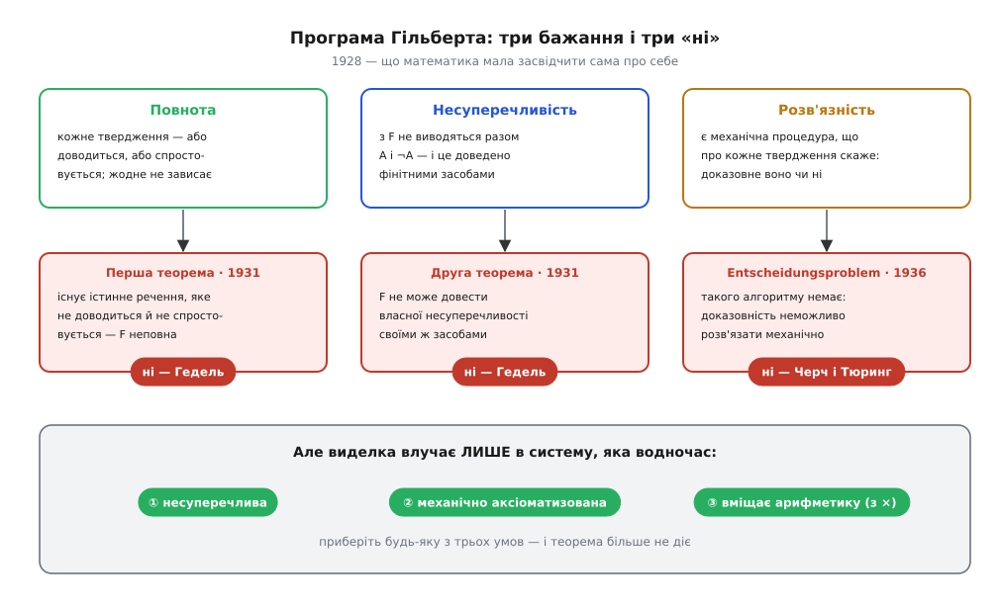
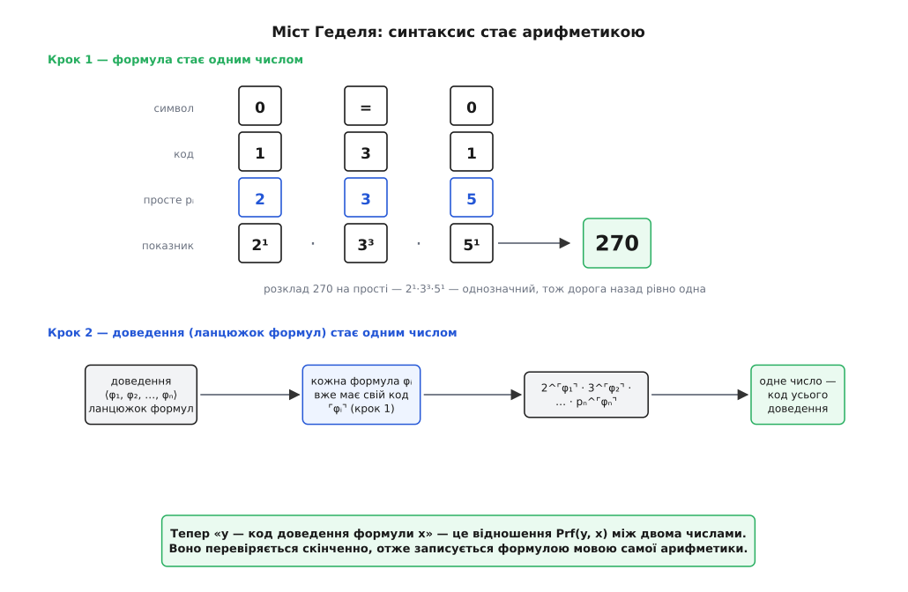
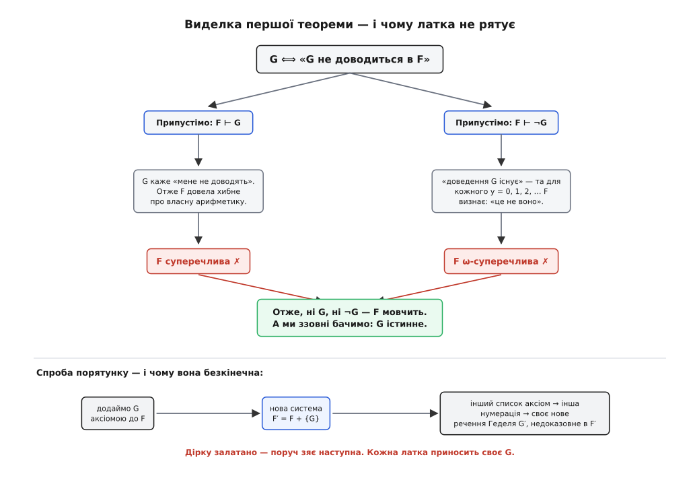
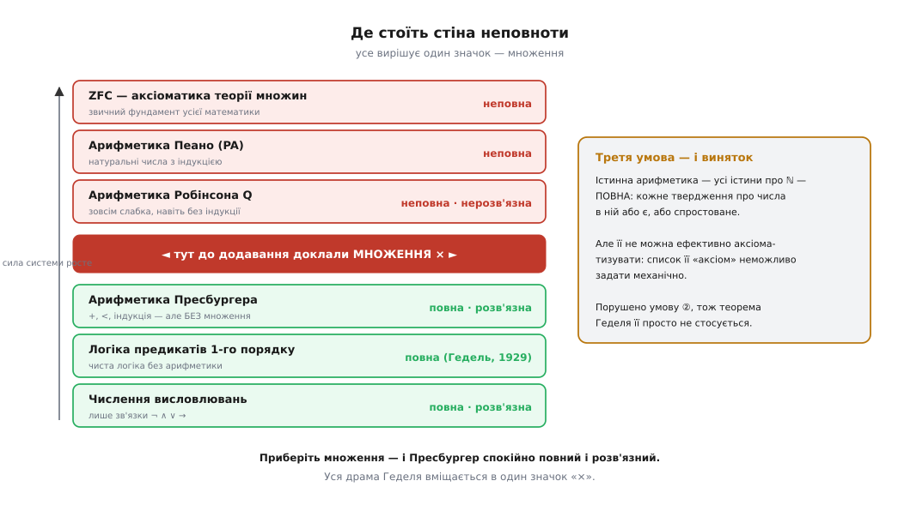

# Теореми Геделя про неповноту

<preknowlist>
- [Математичне доведення](root:math-logic/mathematical-proof) — що таке аксіома й правило виведення; доведення як скінченний ланцюжок кроків, кожен із яких можна перевірити.
- [Формальна мова](root:computability/formal-language) — символи, рядки й граматика: твердження як рядок, зібраний за строгими правилами, без огляду на зміст.
- [Натуральні числа](root:math-logic/natural-numbers) — нуль, наступник, додавання й множення; арифметика як той предмет, про який говорить формальна система.
</preknowlist>

На зламі XIX і XX століть математика вперше злякалася сама себе. Теорію множин щойно почали вважати спільним підмурком усієї науки — і саме в ній знайшли відверту суперечність. [Парадокс Рассела](root:math-logic/russell-paradox) питає про множину всіх множин, які не містять себе: вона мусить водночас містити себе й не містити. Це була не забавка на полях, а тріщина в фундаменті, бо із суперечності виводиться **геть усе** — і теорема, і її заперечення. Система, що доводить усе, не доводить нічого.

Давид Гільберт (*David Hilbert*, 1862–1943) запропонував ліки, геніальні за задумом: якщо інтуїція підводить — приберімо інтуїцію взагалі. Запишімо математику як **формальну систему** (лат. *forma* — «вигляд, обрис»): скінченний список аксіом (гр. *axíōma* — «те, що вважають безсумнівним»), скінченний список правил виведення — і жодних покликань на «очевидне». Тоді доведення стає ланцюжком рядків символів, а перевірка доведення — тупою механічною роботою: дивишся, чи кожен наступний рядок дозволений якимось правилом. Розуміти не треба. Вірити не треба.

Лишалося виконати три бажання. **Несуперечливість:** із системи не виводяться разом A і ¬A. **Повнота:** кожне твердження мовою системи або доводиться, або спростовується — жодне не зависає в порожнечі. **Розв'язність:** існує механічна процедура, яка про будь-яке твердження скаже, доказовне воно чи ні (це і є **Entscheidungsproblem**, нім. *Entscheidung* — «рішення», яку Гільберт із Вільгельмом Аккерманом поставили 1928 року). І найголовніше: несуперечливість треба довести **фінітними засобами** — елементарними міркуваннями про скінченні комбінації значків, без жодної апеляції до нескінченності. Тоді підмурок засвідчив би сам себе, і питання закрилося б назавжди.

7 вересня 1930 року в Кенігсберзі, на круглому столі конференції з теорії пізнання точних наук, двадцятичотирирічний Курт Гедель (*Kurt Gödel*, 1906–1978) — німецькомовний уродженець Брна, на той час австрійський громадянин — кинув побіжну репліку, яка все це поховала. Наступного дня, 8 вересня, Гільберт виступав у тому самому місті перед з'їздом німецьких природознавців і лікарів і закінчив словами, що згодом вибили на його надгробку: «Wir müssen wissen. Wir werden wissen» — «Ми мусимо знати. Ми знатимемо». Останні хвилини промови пішли в радіоефір. Він іще не знав, що напередодні його програму вже спростували. [Як народилася програма Гільберта, що саме сказав Гедель у Кенігсберзі й чому фон Нейман поступився йому першістю](root:math-logic/godel-incompleteness/hist-hilbert-program.md) — історія, варта окремої розповіді.

## Формальна система: машина, що не думає

Щоб зрозуміти удар, треба точно бачити мішень. Формальна система **F** — це три речі й нічого більше:

```
мова     — з яких символів і за якою граматикою будуються твердження
аксіоми  — твердження, прийняті без доведення
правила  — як із наявних тверджень робити нові
```

Теорема F — це будь-який рядок, до якого веде скінченний ланцюжок від аксіом за правилами. Ключова вимога Гільберта — **ефективна аксіоматизація**: список аксіом і правил має бути заданий механічно, так, щоб машина без жодного натхнення вміла перевірити, чи є даний текст правильним доведенням.

Ось де захована іронія всієї історії. Гільберт вимагав механічності заради надійності — щоб виключити людські ілюзії. Але механічність має ціну: те, що робиться механічно, — це маніпуляція скінченними рядками значків. А маніпуляція скінченними рядками значків, як побачив Гедель, **сама є арифметикою**. Тобто система, достатньо сильна, щоб говорити про числа, автоматично достатньо сильна, щоб говорити про **власні доведення**. Гільберт вимагав, щоб математика стала прозорою для машини, — і тим самим зробив її прозорою для себе самої.


*Що саме програма Гільберта просила від математики і що з цього вийшло. Три бажання виглядали як розумний мінімум для надійного підмурка; за шість років кожне дістало окреме «ні» — два від Геделя, одне від Черча й Тюринга. Умови внизу — не дрібний шрифт, а сама суть: удар влучає лише в системи, які несуперечливі, механічно аксіоматизовані й уміщають елементарну арифметику.*

## Міст: як арифметика заговорила про себе

Гедель робить хід, який до нього нікому не спав на думку, а після нього здається неминучим. Формула — це послідовність символів. Символів скінченно багато, тож пронумеруймо їх. Тоді формула стає **послідовністю чисел**, а послідовність чисел треба якось згорнути в одне число — так, щоб потім розгорнути назад без двозначності.

Інструмент для цього лежав напохваті ще з Евкліда: **однозначність розкладу на прості множники**. Кожне натуральне число розкладається в добуток простих рівно одним способом. Отже: посадімо код першого символу в показник двійки, код другого — в показник трійки, третього — в показник п'ятірки, і далі за списком простих. Добуток — одне-єдине число, з якого початкову послідовність відновлюють однозначно.

**Завдання: закодувати формулу «0 = 0» одним числом і повернутися назад.**

```
символ:   0    s    =    (    )    ¬    ∨    ∀    x
код:      1    2    3    4    5    6    7    8    9

Формула   «0 = 0»
символи:    0    =    0
коди:       1    3    1
прості:     2    3    5
число:     2¹ · 3³ · 5¹ = 2 · 27 · 5 = 270
```

Зворотний хід — просто розклад 270 на прості: 270 = 2¹ · 3³ · 5¹, показники дають 1, 3, 1, а це «0», «=», «0». Ось той самий міст робочим кодом:

```python
SYMBOLS = {"0": 1, "s": 2, "=": 3, "(": 4, ")": 5, "¬": 6, "∨": 7, "∀": 8, "x": 9}
BACK = {code: sym for sym, code in SYMBOLS.items()}

def primes(n):
    """Перші n простих — основи, у показники яких сядуть коди символів."""
    out, k = [], 2
    while len(out) < n:
        if all(k % p for p in out):
            out.append(k)
        k += 1
    return out

def encode(formula):
    """Формула (рядок символів) → одне натуральне число."""
    codes = [SYMBOLS[s] for s in formula]
    g = 1
    for p, c in zip(primes(len(codes)), codes):
        g *= p ** c                  # i-й символ сидить у показнику i-го простого
    return g

def decode(g):
    """Число → формула. Розклад на прості однозначний, тож дорога назад одна."""
    out = []
    for p in primes(64):             # із запасом: формула коротша за 64 символи
        if g == 1:
            break
        c = 0
        while g % p == 0:            # скільки разів p ділить g — це й є код символу
            g //= p
            c += 1
        if c == 0:                   # діра в простих: число не кодує формулу
            raise ValueError("не код формули")
        out.append(BACK[c])
    return "".join(out)

encode("0=0")                  # 270
decode(270)                    # '0=0'
encode("ss0=ss0")              # 21462861420
decode(21462861420)            # 'ss0=ss0'
```

**Висновок:** нумерація не додала до математики нічого нового — вона лише **перейменувала**. Але після перейменування питання «чи є цей текст правильним доведенням формули?» перетворилося на питання **про подільність і показники**, тобто на звичайне арифметичне відношення між двома числами. Позначмо його `Prf(y, x)`: «число y кодує доведення формули з кодом x». Це відношення перевіряється скінченною механічною процедурою — а все, що перевіряється скінченною механічною процедурою над числами, **записується формулою мовою самої арифметики**. Ось і все. Система, що вміє додавати й множити, більше не може вберегтися від розмов про себе.

Числа тут ростуть страхітливо: сім символів «ss0=ss0» дали вже двадцять один мільярд. Але Геделя це не обходить анітрохи — йому ніколи не треба ці числа обчислювати. Йому треба лише, щоб вони **існували й були однозначні**.


*Як синтаксис стає арифметикою. Символи дістають коди, коди йдуть у показники простих 2, 3, 5, 7…, добуток дає одне число — і однозначність розкладу на прості гарантує дорогу назад. Той самий прийом застосовують удруге, до послідовності формул, і доведення теж стає числом. Наслідок унизу — головний: «y є доведенням x» перетворилося на відношення між числами, яке система вміє висловити власною мовою.*

> 🔧 **Навіщо це.** Ідея «текст програми — це дані» сьогодні здається банальною, але саме ця нумерація вперше показала її з математичною суворістю, і на ній стоїть половина інструментів розробника. Компілятор читає код як дані. Статичний аналізатор шукає в чужому коді підрядки за правилами. Рефлексія, макроси, самокомпільований компілятор, `eval` — усе це той самий Геделів міст: об'єкт і опис об'єкта живуть в одному просторі. Але міст ходить в обидва боки, і на зворотному шляху приїжджають ті самі стіни, у які впирається Гедель: інструмент, що аналізує програми, рано чи пізно натрапляє на програму, яка аналізує його.

## Речення, що каже про себе

Тепер, коли арифметика вміє говорити про доведення, можна поставити пастку. Візьмімо стародавній **парадокс брехуна**: «це речення хибне». Якщо воно істинне, то воно хибне; якщо хибне — істинне. Дві тисячі років це вважали грою слів.

Гедель змінив у ньому одне слово — і гра слів стала теоремою:

```
G ⟺ «G не доводиться в F»
```

Заміна «хибне» на «недоказовне» виглядає дрібною, але вона все вирішує. **Істинність** усередині системи висловити не можна — це окремий результат, [теорема Тарського про невизначність істини](root:math-logic/tarski-undefinability): предикат «істинне» просто не записується мовою арифметики, інакше брехун негайно вбив би саму арифметику. А от **доказовність** — записується, і ми щойно бачили чому: доведення є скінченний перевіряльний об'єкт, отже `Prf(y, x)` є арифметика, отже «існує y, що є доведенням x» теж є арифметика. Брехун недосяжний, його двоюрідний брат — досяжний.

Лишається технічний крок: як побудувати речення, що посилається саме на свій власний код, коли код відомий лише після того, як речення побудоване? Це замкнене коло розриває **діагональна лема**: для будь-якої формули ψ(x) механічно будується речення D, для якого сама система доводить `D ⟺ ψ(⌜D⌝)`, де ⌜D⌝ — число-код D. Прийом той самий, що [діагональний метод Кантора](root:math-logic/cantor-diagonal): візьми список і зроби об'єкт, який відрізняється від кожного рядка на його ж діагоналі. Підставивши в лему ψ = «не доводиться», дістаємо G. [Як точно працює нумерація, представність арифметичних відношень, діагональна лема й умови вивідності](root:math-logic/godel-incompleteness/math-godel-numbering.md) — це апарат, який варто розібрати покроково. А відчути самопосилання руками найпростіше [на програмах, що друкують власний текст](root:math-logic/godel-incompleteness/proj-self-reference-code.md): квайн — це і є діагональна лема, що працює у вас на екрані.

## Перша теорема: виделка

**Перша теорема про неповноту.** Нехай F — формальна система, яка (1) **несуперечлива**, (2) **ефективно аксіоматизована** — її аксіоми задано механічним списком, і (3) **вміщає елементарну арифметику**. Тоді існує речення мовою F, яке в F **не доводиться й не спростовується**. F неповна.

Доведення — виделка з двох зубців, і обидва впираються в порожнечу.

**Зубець перший: припустімо, F доводить G.** G каже про себе «я не доводжуся в F». Отже, F щойно довела твердження, яке хибне саме тому, що його довели. Система, що доводить хибне про власну арифметику, суперечлива — а ми припустили, що вона несуперечлива. Глухий кут.

**Зубець другий: припустімо, F доводить ¬G.** Це означає «G доводиться», тобто «існує число y — код доведення G». Але з першого зубця ми знаємо, що жодного такого доведення немає: для y = 0, 1, 2, 3 і взагалі для кожного конкретного числа F доводить, що це **не** код доведення G. Виходить система, яка присягається «такий y існує», але щодо кожного окремого y визнає, що це не він. Це не суперечність у прямому сенсі — це саме те, що Гедель назвав **ω-суперечливістю** (від грецької літери ω, якою позначають ряд усіх натуральних чисел). Другий глухий кут.

Отже, ні G, ні ¬G. Система мовчить. А тепер найгостріше: **ми з вами знаємо, що G істинне**. Ми стоїмо ззовні, бачимо, що G не доводиться, — а це рівно те, що G про себе стверджує. Істинне твердження про числа, до якого не дотягується жодне доведення в F.

Тут варто чесно назвати одну латку. Умова ω-несуперечливості сильніша за просту несуперечливість, і це довго муляло. 1936 року Джон Барклі Россер (*J. Barkley Rosser*) хитро переписав Геделеве речення — воно стало казати не «я недоказовне», а «якщо в мене є доведення, то заперечення мого має **коротше** доведення». Із цим формулюванням достатньо звичайної несуперечливості, і теорема набула остаточного вигляду.


*Чому обидва виходи замкнені й чому латка не рятує. Угорі — виделка: доведення G робить систему суперечливою, доведення ¬G робить її ω-суперечливою; отже, не доводиться ні те, ні те, і G лишається істинним, але недосяжним. Унизу — типова спроба порятунку: додаймо G аксіомою. Аксіому додано, але система стала **іншою** — з іншим списком аксіом, іншою нумерацією й власним новим реченням Геделя. Дірку залатано, поруч зяє наступна, і так без кінця.*

## Друга теорема: система не може поручитися за себе

Перша теорема лишала Гільбертові надію: хай не всі істини доказовні — головне, щоб фундамент був надійний, тобто щоб ми довели несуперечливість. Гедель забрав і це, тим самим ходом.

Погляньмо ще раз на перший зубець виделки. Ми міркували так: «якщо F несуперечлива, то G не доводиться». Але ж це міркування — саме собою елементарне й механічне, суцільна робота з кодами й показниками. А все елементарне й механічне, як ми з'ясували, записується всередині F. Отже, сама F доводить:

```
Con(F) → G          де Con(F) — арифметичне речення «F несуперечлива»
```

Далі одна лінія. Припустімо, F довела `Con(F)`. Тоді за правилом відділення F доводить і G. Але з першої теореми F не доводить G — інакше вона суперечлива. Отже, F не доводить `Con(F)`.

**Друга теорема про неповноту.** Жодна несуперечлива, ефективно аксіоматизована система, що вміщає елементарну арифметику, не доводить власної несуперечливості.

Прочитаймо це людською мовою. Система, яка урочисто присягається «я несуперечлива», цим самим себе й викриває: таку присягу здатна вимовити **лише суперечлива** система (а вона, як ми знаємо, доводить геть усе, зокрема й це). Надійна система про власну надійність приречена мовчати. Програма Гільберта в її центральній точці — фінітне самозасвідчення підмурка — виявилася нездійсненною не через брак кмітливості, а за законом.

Це не кінець доведень несуперечливості — це кінець доведень **зсередини**. Уже 1936 року Ґергард Ґенцен (*Gerhard Gentzen*) довів несуперечливість арифметики Пеано, скориставшись трансфінітною індукцією до ординала ε₀ — засобом, якого в самій арифметиці Пеано немає й бути не може. Це чесний результат і водночас чесна ціна: щоб поручитися за систему, доводиться стати на щось за її межами. Фундамент не тримає сам себе; його тримає ґрунт, за який відповідає вже інший фундамент.

> 🔧 **Навіщо це.** Друга теорема — це щоденна реальність формальної верифікації. Coq, Lean, Isabelle доводять теореми й перевіряють програми — але жоден із них не може довести власної коректності своїми ж засобами. Тому їх будують навколо крихітного **ядра** (кількох тисяч рядків), яке перевіряють очима й іншими інструментами, а решту системи змушують проходити через це ядро. Верифікована ОС seL4 має математичне доведення відповідності специфікації — і поруч чесний список припущень: компілятор, залізо, сама специфікація. Це не недбалість авторів. Це Гедель: ланцюжок довіри мусить десь спертися на щось зовнішнє, і єдина інженерна чеснота тут — зробити цю опору маленькою й видимою.

## Де насправді стоїть стіна

Найпоширеніша помилка — прочитати теореми як «математика неповна» чи, ще гірше, «нічого не можна довести». Насправді теорема має **три умови**, і варто прибрати будь-яку — вона перестає діяти. Це не примхи формулювання, а точні координати стіни.

Дивовижно, але межу проводить **множення**. Арифметика Пресбургера — натуральні числа з додаванням, порівнянням і індукцією, але **без множення** — повна, несуперечлива й розв'язна: є алгоритм, що про будь-яке її твердження скаже «істина» чи «хиба». Довів це 1929 року Мойсей Пресбурґер (*Mojżesz Presburger*, 1904–1943), польський математик єврейського походження, учень Тарського й Лукасевича, ще студентом; він загинув у Голокості. Додайте до його арифметики множення — і вже арифметика Робінсона Q, зовсім слабенька система без індукції, стає неповною й нерозв'язною. Уся драма Геделя вміщається в один значок «×».


*Хто під ударом, а хто ні. Слабкі системи спокійно бувають повними й розв'язними; чиста логіка предикатів навіть повна — і це теж теорема Геделя, тільки інша, з його дисертації 1929 року. Стіна встає рівно там, де до додавання доклали множення: від арифметики Робінсона і вище повнота зникає назавжди. Праворуч — третя умова: істинна арифметика повна, але її «аксіоми» неможливо виписати механічним списком, тож теорема її просто не стосується.*

> 🔧 **Навіщо це.** Це не історія логіки, а причина, чому ваш SMT-розв'язувач поводиться саме так. Z3 та його родичі **повністю розв'язують** лінійну цілочисельну арифметику — усі ці `i + 1 < n`, `offset + len ≤ size`, — бо це рівно арифметика Пресбургера, і для неї є алгоритм. Тому перевірка меж масивів і арифметики покажчиків працює надійно. Але напишіть `i * j < n` із двома змінними — і гарантії закінчилися: цілочисельна нелінійна арифметика нерозв'язна взагалі (десята проблема Гільберта; Мартін Девіс, Гіларі Патнем, Джулія Робінсон і, останнім кроком, Юрій Матіясевич, 1970). Розв'язувач перейде на евристики й може відповісти `unknown`. Знаючи, де стоїть стіна, ви не лаєте інструмент, а формулюєте умови так, щоб лишатися з лінійного боку.

Тепер — чого теореми **не** кажуть.

**Не кажуть, що є вічно непізнаванні істини.** Неповнота завжди відносна до системи. Речення G недоказовне **в F** — але його спокійно доводять у сильнішій системі, хоч би просто додавши до F саму `Con(F)`. Немає єдиної абсолютної стіни; є нескінченна вежа систем, і кожна бачить далі за попередню, лишаючись сліпою на власне око.

**Не кажуть, що математика суперечлива або що доведення нічого не варті.** Усі теореми, які ми знаємо, лишилися доведеними. Змінилося одне: зникла надія на **остаточний самозамкнений фундамент**.

**Не стосуються систем, що не вміщають арифметики.** Бібліє, Конституція, ринок, свідомість, будь-яка «система» в переносному значенні — усе це не формальні системи з ефективною аксіоматизацією й множенням. Посилання на Геделя поза цими умовами — просто риторика; логік Торкель Франзен (*Torkel Franzén*) присвятив цілу книжку розбору таких зловживань.

**Не доводять, що розум сильніший за машину.** Аргумент Лукаса–Пенроуза («ми ж бачимо, що G істинне, а машина не бачить») спирається на приховане припущення, що ми **знаємо** несуперечливість власної системи міркувань — а це саме те, чого за другою теоремою знати не можна. Питання лишається відкритим і гостро дискусійним; теорема його не закриває.

**Незалежність — ширше явище, ніж неповнота Геделя.** Континуум-гіпотеза не розв'язується в [аксіоматиці Цермело–Френкеля ZFC](root:math-logic/zfc-set-theory) — Гедель показав 1938 року, що її не спростувати, Пол Коен 1963-го, що не довести. Але доводили це форсингом і моделями, а не Геделевим самопосиланням. Незалежність буває різного походження.

## Що з цього лишається

Речення G довго дорікали штучністю: мовляв, це логічний трюк, справжня математика такого не зустрічає. Дорікали до 1977 року, коли Джефф Періс і Лео Гаррінгтон знайшли **посилену скінченну теорему Рамсея** — нормальне комбінаторне твердження про розфарбування, істинне й недоказовне в арифметиці Пеано. 1982-го Лоуренс Кірбі та той самий Періс показали те саме для **теореми Ґудстайна** — цілком шкільної на вигляд задачі про послідовності чисел, яка щоразу сходиться до нуля, і довести це в арифметиці Пеано неможливо. Дірки не намальовані на полях. Вони в самій тканині.

Ту саму межу, тільки з іншого боку, окреслює обчислення. Алан Тюринг 1936 року показав, що [машина Тюринга](root:computability/turing-machine) не може розв'язати [проблему зупинки](root:computability/halting-problem) — і цим закрив третє бажання Гільберта, розв'язність. Це не збіг і не аналогія: неповнота й нерозв'язність — два обличчя одного факту. Система, що вміє механічно міркувати про скінченні об'єкти, вміє міркувати й про себе, а самопосилання завжди лишає незаповнену клітинку. Логіка впирається в істину без доведення; обчислення — в питання без алгоритму.

Підсумуймо ланцюжок. Гільберт зажадав, щоб математика стала **механічною**, — і механічність виявилася її вразливим місцем. Гедель **пронумерував** формули й доведення числами, і синтаксис став арифметикою. Це дозволило системі говорити про власну доказовість, а **діагональна лема** — зібрати речення G, що каже «мене не доводять». Виделка закрила обидва виходи: **перша теорема** — система неповна, і G істинне ззовні, недосяжне зсередини. Формалізувавши цю саму виделку всередині системи, дістаємо **другу теорему**: несуперечлива система не доводить власної несуперечливості. Латати марно — кожна латка приносить своє G. Але стіна має точну адресу: несуперечливість, ефективна аксіоматизація і множення. Прибрали множення — і Пресбургер спокійно повний і розв'язний; це не філософія, а причина, чому SMT-розв'язувач упевнено рахує індекси масивів і здається на `i * j`. Математика не розвалилася 1931 року. Вона лише дізналася про себе те, що зазвичай дізнаються про інших: щоб поручитися за когось, треба стояти назовні.
