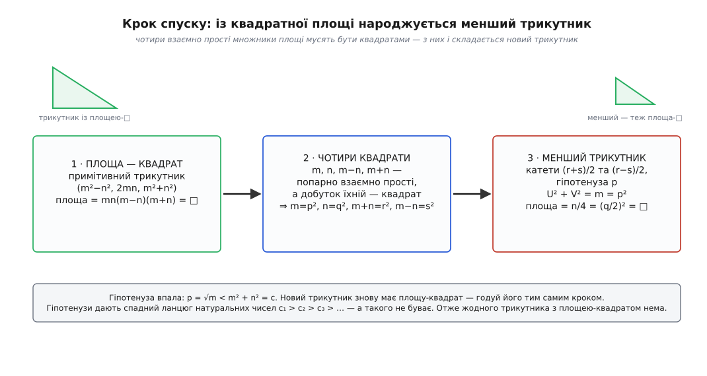
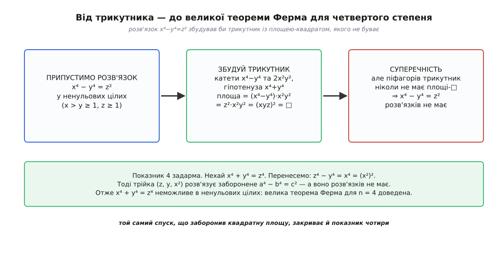

# 📐 Площа піфагорового трикутника — ніколи не квадрат

Прямокутний трикутник із цілими сторонами — річ звична: 3, 4, 5. Його площа дорівнює половині добутку катетів, тут — 3·4/2 = 6, і це завжди ціле число, бо в кожній такій трійці один із катетів парний. Питання просте до нахабства: чи може ця площа виявитися **точним квадратом** — числом 1, 4, 9, 16, 25, …? Не «майже», не «наближено», а рівно квадратом цілого.

Перебираймо. Трійка (3, 4, 5) дає площу 6; (5, 12, 13) — 30; (8, 15, 17) — 60; (7, 24, 25) — 84; (20, 21, 29) — 210; (9, 40, 41) — 180. Жодного квадрата. Проженіть тисячу трійок, мільйон — квадрат не з'явиться. Але тисяча невдач нічого не доводить: попереду завжди лишається нескінченний хвіст неперевіреного, і саме там може ховатися виняток. Пред'явити нам нема чого — уся сила твердження в слові **ніколи**.

І все ж воно доводиться, повністю й остаточно:

```
Немає прямокутного трикутника з цілими сторонами,
площа якого дорівнювала б квадрату цілого числа.
```

Це не розважальна дрібниця. Перед нами один із наріжних фактів теорії чисел, до того ж єдина теорема, для якої сам Ферма лишив на папері повне доведення — записане його рукою на берегах «Арифметики» Діофанта й надруковане сином 1670 року, вже по смерті батька. З неї майже задарма випадає й велика теорема Ферма для четвертого степеня. А оскільки твердження заперечне — «такого трикутника не існує», — прямий перебір безсилий, і працює тут рівно один інструмент: нескінченний спуск. Ми припустимо, що трикутник із квадратною площею таки є, і власними руками збудуємо з нього **менший** трикутник тієї самої властивості. А тоді з меншого — ще менший, і так без кінця; але натуральні числа не дають спускатися вічно, тож перше припущення падає.

Уся конструкція тримається на одному тонкому місці — на тому, **як саме** з трикутника народжується менший трикутник. Розберімо його до останнього гвинтика.

> 🔧 **Навіщо це.** Твердження на позір вузьке — про площі трикутників, — а насправді це замаскований факт про діофантові рівняння четвертого степеня. Мовою раціональних чисел воно каже: жоден прямокутний трикутник із раціональними сторонами не має раціонального квадрата за площу, тобто одиниця не є «конгруентним числом» (площею такого трикутника). Ця сама теорема ще й перекривається з великою теоремою Ферма для показника 4. Одне непомітне «ніколи» тримає на собі кілька гучних результатів одразу — тому й варте повного, чесного виведення.

## Крок нуль: досить розглядати примітивні трикутники

Перш ніж будувати машину спуску, приберімо зайве. Якщо катети *a* і *b* мають спільний дільник *d* > 1, трикутник можна «стиснути»: поділити всі три сторони на *d* і дістати менший подібний трикутник із цілими сторонами.

Що станеться з площею? Нехай *a* = *d*·*a*′, *b* = *d*·*b*′. Тоді площа стискається одразу на *d*²:

```
S = a·b / 2 = d²·(a′·b′ / 2) = d²·S′
```

Ми припустили, що *S* = *W*² — квадрат. Виходить *W*² = *d*²·*S*′, звідки *S*′ = *W*² / *d*². Щоб оголосити *S*′ квадратом, треба знати, що *W* / *d* — ціле. А це так: із *W*² = *d*²·*S*′ видно, що *d*² ділить *W*², а коли квадрат числа ділиться на *d*², то й саме число ділиться на *d* (кожен простий множник *d* входить у *W*² подвоєним, отже входить і у *W*). Тому *S*′ = (*W* / *d*)² — знову точний квадрат.

Висновок: якби існував бодай один трикутник із квадратною площею, існував би й **примітивний** такий трикутник — із взаємно простими катетами. Далі скрізь беремо примітивний; це нічого не втрачає, зате відмикає головний інструмент.

## Апарат: параметризація примітивних трійок

У примітивної піфагорової трійки катети не бувають обидва парними (інакше спільний дільник 2) і не бувають обидва непарними (сума двох непарних квадратів дає остачу 2 при діленні на 4, а квадрат такого вигляду не буває). Отже рівно один катет парний. Позначмо непарний катет *a*, парний — *b*.

Уся арифметика примітивних трійок тримається на одній класичній формулі: знайдуться взаємно прості натуральні *m* > *n* > 0 **різної парності** (одне парне, друге непарне), для яких

```
a = m² − n²      (непарний катет)
b = 2mn          (парний катет)
c = m² + n²      (гіпотенуза)
```

і навпаки — кожна така пара (*m*, *n*) породжує примітивну трійку, причому взаємно однозначно.

> Що треба знати: примітивна піфагорова трійка *a*² + *b*² = *c*² — це та, де *a*, *b*, *c* не мають спільного дільника; кожна така трійка єдиним чином записується як (*m*²−*n*², 2*mn*, *m*²+*n*²) для взаємно простих *m* > *n* різної парності, і навпаки. Саме ця параметризація перетворює геометричне питання на арифметичне. Виведення й перевірка взаємної однозначності — [трійки Піфагора](root:math-number-theory/pythagorean-triples).

Тепер — центральний перерахунок. Підставмо катети в площу:

```
S = a·b / 2 = (m² − n²)·(2mn) / 2 = mn·(m² − n²) = mn·(m − n)·(m + n)
```

Ось де геометрія скінчилась і почалася теорія чисел. Площа трикутника — це **добуток чотирьох множників**:

```
S = m · n · (m − n) · (m + n)
```

Уся подальша доля доведення вирішується тим, як влаштований цей добуток, коли він мусить дорівнювати квадратові.

## Чому кожен із чотирьох множників — сам квадрат

Тут спрацьовує невеличка, але залізна лема арифметики.

**Лема.** Якщо додатні цілі числа попарно взаємно прості, а їхній добуток — точний квадрат, то кожне з них — точний квадрат.

Причина — однозначність розкладу на прості: будь-яке ціле розкладається на прості множники єдиним способом (з точністю до порядку), і саме [основна теорема арифметики](root:math-number-theory/fundamental-theorem-arithmetic) дає цій лемі ґрунт. Візьмімо будь-який простий *ℓ*. Оскільки множники попарно взаємно прості, *ℓ* може входити щонайбільше в **один** із них. Тоді показник *ℓ* у всьому добутку дорівнює його показникові в тому єдиному множнику. А в добутку-квадраті всі показники парні. Отже і в тому множнику показник *ℓ* парний — і так для кожного простого. Число, у якого всі прості входять парне число разів, само є квадратом. Лему доведено.

Лишилося переконатися, що наші чотири множники *m*, *n*, *m*−*n*, *m*+*n* справді попарно взаємно прості. Перевіримо по черзі, спираючись на два факти: *m* і *n* взаємно прості й різної парності.

```
gcd(m, n) = 1                         — за умовою параметризації
m − n, m + n — обидва непарні          — «парне ± непарне = непарне»
gcd(m, m ± n) = gcd(m, n) = 1          — спільний дільник m і m±n ділить і n
gcd(n, m ± n) = gcd(n, m) = 1          — так само
gcd(m − n, m + n) = 1                  — див. нижче
```

Останній рядок вартий окремого слова. Спільний дільник чисел *m*−*n* і *m*+*n* ділить і їхню суму 2*m*, і різницю 2*n*. Але обидва числа непарні, тож і будь-який їхній спільний дільник непарний — значить, ділить уже саме́ *m* і саме́ *n*, а вони взаємно прості. Отже спільний дільник дорівнює 1.

Чотири множники попарно взаємно прості, їхній добуток — квадрат. За лемою кожен окремо — квадрат:

```
m     = p²
n     = q²
m + n = r²
m − n = s²
```

де *p*, *q*, *r*, *s* — натуральні, причому *r* і *s* непарні (бо *m*+*n* і *m*−*n* непарні), і *r* > *s* (бо *m*+*n* > *m*−*n*). Із однієї-єдиної умови «площа — квадрат» вискочили одразу **чотири** нові квадрати. Це і є пружина всієї конструкції: тепер із цих квадратів ми зберемо новий трикутник.

## Серце спуску: складання меншого трикутника

У нас на руках *r*² = *m* + *n* і *s*² = *m* − *n*, обидва *r*, *s* непарні. Складімо з них дві величини:

```
U = (r + s) / 2
V = (r − s) / 2
```

Обидві — **цілі**, бо *r* і *s* непарні, тож *r* + *s* і *r* − *s* парні. І обидві додатні: *r* > *s* > 0 дає *V* > 0, а *U* > 0 й поготів.

Тепер найкрасивіше. Порахуймо *U*² + *V*²:

```
U² + V² = [(r + s)² + (r − s)²] / 4 = [2r² + 2s²] / 4 = (r² + s²) / 2
```

А *r*² + *s*² = (*m* + *n*) + (*m* − *n*) = 2*m*. Отже

```
U² + V² = 2m / 2 = m = p²
```

Зупиніться на цьому рядку. **U² + V² = p².** Пара катетів *U*, *V* із гіпотенузою *p* — це **новий прямокутний трикутник із цілими сторонами**. Він виник сам, з алгебри, без жодного додаткового припущення.

Лишилося дізнатися дві речі про цей трикутник: чи квадратна його площа і чи менший він за початковий. Порахуймо добуток катетів:

```
U · V = (r + s)(r − s) / 4 = (r² − s²) / 4
```

а *r*² − *s*² = (*m* + *n*) − (*m* − *n*) = 2*n*, тож

```
U · V = 2n / 4 = n / 2
```

Ось тихий, але вирішальний момент. Ліворуч *U*·*V* — ціле число (добуток цілих). Праворуч *n*/2. Щоб рівність трималася, *n* мусить бути **парним**. А *n* = *q*², тож парний і *q*²; коли квадрат парний — парне й саме число, отже *q* парне. Запишімо *q* = 2*g*. Тоді площа нового трикутника:

```
S′ = U · V / 2 = (n / 2) / 2 = n / 4 = q² / 4 = (q / 2)² = g²
```

**Площа нового трикутника — точний квадрат** *g*². Помітьте, як витончено вигнулася арифметика: сама лише цілочисловість *U*·*V* примусила *n* бути парним, а це якраз і зробило *n*/4 квадратом. Нічого не довелося вгадувати — усе виринуло з рівностей.

І останнє — розмір. Гіпотенуза нового трикутника *p* = √*m*. Гіпотенуза старого *c* = *m*² + *n*². Оскільки *m* > *n* ≥ 1, маємо *m* ≥ 2, а тоді

```
p = √m  <  m  ≤  m²  <  m² + n² = c
```

Нова гіпотенуза строго менша за стару. Машина спуску готова: вона взяла примітивний трикутник із квадратною площею й повернула трикутник із цілими сторонами, квадратною площею й **строго меншою гіпотенузою**.


*Крок спуску цілком. Із примітивного трикутника, площа якого квадрат, площа розкладається в добуток чотирьох попарно взаємно простих множників; квадратність добутку змушує кожен множник бути квадратом; із їхніх коренів складаються катети (r±s)/2 і гіпотенуза p = √m нового трикутника, площа якого знову квадрат. Гіпотенуза впала з m²+n² до √m — трикутник строго менший.*

## Замкнути петлю: чому трикутника немає зовсім

Далі — суто арифметичний фінал, той самий, що й у будь-якому спуску. Новий трикутник — теж піфагорів і теж із квадратною площею; отже його можна знову звести до примітивного (гіпотенуза при цьому хіба що зменшиться) і знову погодувати нашою машиною. Вона видасть іще менший, той — іще менший, і так без кінця. Гіпотенузи утворять ланцюг натуральних чисел

```
c₁  >  c₂  >  c₃  >  c₄  >  …
```

кожне строго менше за попереднє й без кінця. Такого ланцюга не буває: під натуральним числом рівно стільки сходинок, скільки воно саме, і за скінченну кількість кроків спуск неминуче вперся б у одиницю. Суперечність.

Що ж виявилося неможливим? Не машина — кожен її крок ми довели звичайною алгеброю. Не ланцюг — він лише слухняний наслідок. Хибним було єдине взяте на віру: що **перший** трикутник із квадратною площею існує. Значить, він не існує — а з ним і всі інші.

Той самий доказ можна вкласти в одну фразу без нескінченних ланцюгів. Візьмімо серед усіх трикутників із квадратною площею той, у якого **найменша гіпотенуза** (такий є, бо будь-який непорожній набір натуральних чисел має найменший елемент). Погодуймо його машиною — вона видасть трикутник тієї самої властивості, але з меншою гіпотенузою. Менша за найменшу. Суперечність за один крок.

Записаний як програма, крок спуску виглядає так — і кожен `assert` у ньому доводиться рядком алгебри вище:

```python
from math import isqrt, gcd

def is_square(k):
    r = isqrt(k)
    return r * r == k

def descent_step(a, b, c):
    """Вхід: піфагорів трикутник a²+b²=c² із цілими сторонами,
    площа якого ab/2 — точний квадрат.
    Вихід: ТАКИЙ САМИЙ трикутник зі СТРОГО меншою гіпотенузою."""
    assert a > 0 and b > 0 and a*a + b*b == c*c
    assert (a * b) % 2 == 0 and is_square(a * b // 2)        # площа — цілий квадрат

    # 0. звести до примітивного: поділити катети на їхній спільний дільник
    d = gcd(a, b)
    a, b, c = a // d, b // d, c // d          # площа лишається квадратом (÷ d²)

    # 1. хай a — непарний катет, b — парний
    if a % 2 == 0:
        a, b = b, a
    # з a = m²−n², c = m²+n²:   m² = (c+a)/2,   n² = (c−a)/2
    m = isqrt((c + a) // 2)
    n = isqrt((c - a) // 2)
    assert m*m - n*n == a and 2*m*n == b and m*m + n*n == c

    # 2. площа = mn(m−n)(m+n); множники попарно взаємно прості,
    #    добуток — квадрат ⇒ кожен множник — квадрат
    p, q = isqrt(m), isqrt(n)
    r, s = isqrt(m + n), isqrt(m - n)
    assert p*p == m and q*q == n and r*r == m + n and s*s == m - n

    # 3. менший трикутник: катети (r+s)/2, (r−s)/2, гіпотенуза p
    U, V = (r + s) // 2, (r - s) // 2
    assert U*U + V*V == p*p                    # знову піфагорів трикутник
    assert is_square(U * V // 2)               # площа = n/4 = (q/2)² — знову квадрат
    assert p < c                               # гіпотенуза строго меншає

    return U, V, p
```

Функція коректна — жоден `assert` не спрацює на правильному вході. І саме тому вона **ніколи не виконається**: у неї порожня область визначення, бо правильного входу не існує в природі. Порожнеча цієї області і **є** теорема про трикутник. Якби знайшовся бодай один припустимий трикутник, його можна було б крутити тут вічно, а гіпотенуза строго меншала б на кожному оберті — чого натуральні числа не дозволяють.

## Наслідок: рівняння x⁴ − y⁴ = z² і показник чотири

Тепер — плата за працю. Та сама теорема, майже без нових зусиль, забороняє цілий клас рівнянь.

**Твердження.** Рівняння *x*⁴ − *y*⁴ = *z*² не має розв'язків у ненульових цілих числах.

Доведімо його від супротивного, спираючись **уже** на доведену теорему. Нехай знайшлися ненульові цілі з *x*⁴ − *y*⁴ = *z*². Оскільки права частина додатна, *x* > *y* ≥ 1, і *z* ≥ 1. Розгляньмо три числа:

```
катет   A = x⁴ − y⁴
катет   B = 2x²y²
гіпотенуза  C = x⁴ + y⁴
```

Перевірмо, що це піфагорів трикутник:

```
A² + B² = (x⁴ − y⁴)² + (2x²y²)²
        = x⁸ − 2x⁴y⁴ + y⁸ + 4x⁴y⁴
        = x⁸ + 2x⁴y⁴ + y⁸
        = (x⁴ + y⁴)² = C²
```

Сходиться: *A*² + *B*² = *C*². Сторони цілі, трикутник справжній (обидва катети додатні, бо *x* > *y*). А тепер — площа:

```
S = A · B / 2 = (x⁴ − y⁴)·(2x²y²) / 2 = (x⁴ − y⁴)·x²y²
```

Але *x*⁴ − *y*⁴ = *z*² за припущенням, тож

```
S = z²·x²y² = (x · y · z)²
```

Площа дорівнює (*xyz*)² — **точний квадрат**. Ми щойно збудували піфагорів трикутник із цілими сторонами й квадратною площею. А такого не буває — щойно довели спуском. Суперечність. Отже рівняння *x*⁴ − *y*⁴ = *z*² розв'язків у ненульових цілих не має.

Звідси остання сходинка — велика теорема Ферма для показника 4. Припустімо, що *x*⁴ + *y*⁴ = *z*⁴ у ненульових цілих. Перенесімо один доданок:

```
x⁴ + y⁴ = z⁴      →      z⁴ − y⁴ = x⁴ = (x²)²
```

Права частина — квадрат, тож трійка (*z*, *y*, *x*²) розв'язує заборонене рівняння *a*⁴ − *b*⁴ = *c*². Такого розв'язку немає. Отже й *x*⁴ + *y*⁴ = *z*⁴ неможливе в ненульових цілих — [велика теорема Ферма](root:math-number-theory/fermats-last-theorem) для четвертого степеня доведена цілком. Це єдиний її показник, що його сам Ферма справді закрив на папері, і закрив саме цим спуском.


*Від трикутника до показника 4. Розв'язок x⁴−y⁴=z² склав би трикутник із катетами x⁴−y⁴ і 2x²y² та площею рівно (xyz)² — квадратом, чого доведена теорема не терпить. А коли заборонено x⁴−y⁴=z², то й x⁴+y⁴=z⁴ падає: z⁴−y⁴=(x²)² звело б його до тієї самої заборони.*

> 🔧 **Навіщо це.** Придивіться, що насправді зроблено. Одна заперечна теорема про площі — і з неї, як із замка, відмикаються два різні рівняння четвертого степеня. Це типовий портрет теорії чисел: рівняння, які на позір ніяк не пов'язані (площа трикутника, різниця четвертих степенів, сума четвертих степенів), виявляються тим самим фактом у різних одежах, і доказ одного дарує решту. А коренем усього лишається та сама скромна арифметична істина — що під натуральними числами немає нескінченних сходинок униз.

## Що тут насправді сталося

Варто востаннє окинути поглядом усю будову й побачити, де саме вона тримається. Геометрії в доказі рівно стільки, щоб записати площу; далі все вирішує арифметика цілих чисел. Пружина — параметризація примітивних трійок, яка перетворює площу на добуток чотирьох множників. Спусковий гачок — попарна взаємна простота цих множників: без неї «добуток квадрат» не змушував би кожен множник бути квадратом, і вся конструкція розсипалась би. А те, що з чотирьох квадратів складається саме новий піфагорів трикутник, та ще й із квадратною площею, та ще й меншою гіпотенузою, — це не щаслива випадковість, а прямий наслідок тотожностей (*r*±*s*)² та їхніх сум.

І над усім — дно натуральних чисел, без якого нескінченний спадний ланцюг гіпотенуз був би не суперечністю, а звичайною нескінченною послідовністю. Заміни цілі сторони на раціональні — і те саме міркування, лише злегка причесане (спершу звести дроби до спільного знаменника), доводить сильнішу річ: жоден прямокутний трикутник із раціональними сторонами не має раціонального квадрата за площу. Скромна на вигляд теорема про цілі 3, 4, 5 виявляється парадними дверима, за якими — і показник чотири великої теореми, і ціла сучасна теорія про раціональні точки на кривих.
