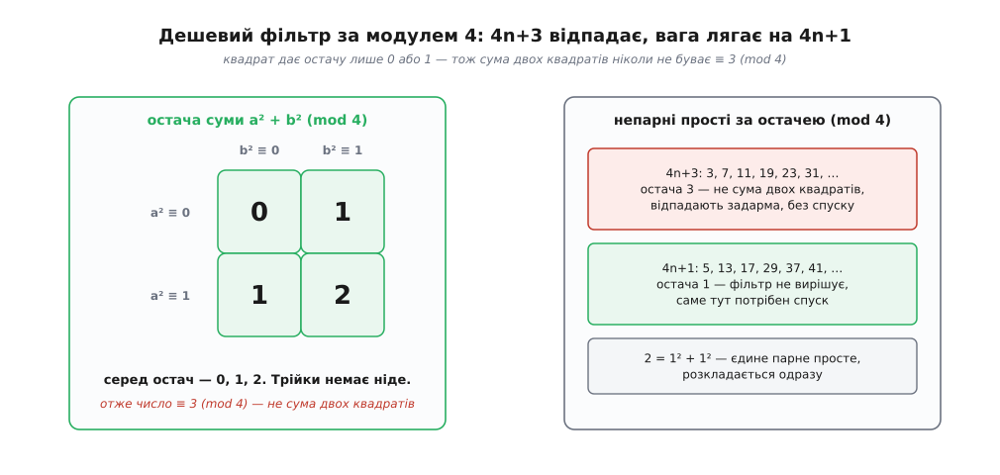
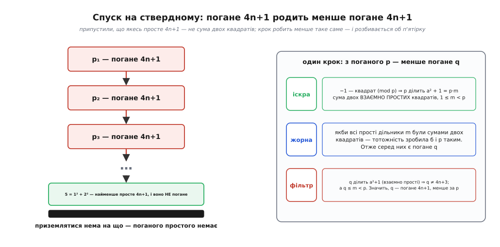

# 🧮 Спуск на ствердному: просте 4n+1 — завжди сума двох квадратів

Спуск створений заперечувати. Його природна відповідь — «такого немає»: немає дробу, рівного √2, немає прямокутного трикутника з квадратною площею, немає розв'язку в цілих. Механізм щоразу той самий — з уявного об'єкта зроби менший об'єкт того ж роду, дістань нескінченний спадний ланцюг натуральних чисел, а такого ланцюга не буває. Але що робити, коли довести треба протилежне — що щось **є, і завжди**?

Ось теорема, на якій це вперше й спробували. Кожне [просте число](root:math-number-theory/prime-numbers) вигляду 4n+1 розкладається в суму двох квадратів:

```
 5 = 1² + 2²
13 = 2² + 3²
17 = 1² + 4²
29 = 2² + 5²
37 = 1² + 6²
41 = 4² + 5²
```

Це не «інколи», не «для перших кількох» — **для кожного** простого, що при діленні на чотири дає остачу один, без винятків. Пред'явити всі такі розклади годі: простих вигляду 4n+1 нескінченно багато. Отже, потрібне скінченне міркування, яке накриє їх усі одразу. Спуск накриє — але спершу його доведеться повернути іншим боком.

## Дешева половина: чому 4n+3 відпадає без бою

Перш ніж мучитися з 4n+1, варто побачити, чому саме цей вигляд, а не якийсь інший. Погляньмо, якою буває остача квадрата при діленні на чотири. Ціле число або парне (2k), або непарне (2k+1); піднесімо кожне до квадрата:

```
(2k)²   = 4k²          → остача 0 (mod 4)
(2k+1)² = 4k² + 4k + 1 → остача 1 (mod 4)
```

Квадрат ніколи не дає остачі 2 чи 3 — тільки 0 або 1. Тоді сума двох квадратів a² + b² за модулем чотири (мова [остач і конгруенцій](root:math-number-theory/modular-arithmetic): a ≡ b (mod m) означає, що a і b дають однакову остачу при діленні на m) може бути лише 0+0, 0+1, 1+0 чи 1+1 — тобто **0, 1 або 2, і ніколи 3**.

Ось і вирок половині простих. Кожне непарне просте дає при діленні на чотири остачу 1 або 3 (остачі 0 і 2 парні, а серед простих парне лише 2). Прості вигляду 4n+3 — 3, 7, 11, 19, 23, … — мають остачу 3, а число з остачею 3 не буває сумою двох квадратів **ніколи**. Один рядок з остачами закриває їх усі задарма, без жодного спуску.

Лишаються двійка (окремий випадок: 2 = 1² + 1²) і прості 4n+1. Двійка розкладається очевидно. А от 4n+1 — єдиний клас, який дешевий фільтр за модулем чотири ні відкидає, ні пропускає: він лишає питання відкритим. Уся вага теореми — саме тут. І це вже підказка, чому робота буде важка: легкої перешкоди, об яку 4n+1 розбилося б само, немає — його остача якраз дозволена.


*Уся арифметика дешевої половини. Квадрат за модулем чотири буває тільки 0 або 1, тому сума двох квадратів не дотягується до остачі 3 — і кожне число вигляду 4n+3, зокрема половина простих, відпадає одним рядком. Лишаються прості 4n+1, де фільтр безсилий, — на них і йде вся справжня робота.*

## Поворот, що коштував стількох зусиль

Тепер той самий трюк, яким спуск обертають проти ствердження. Ми хочемо довести: **кожне** просте 4n+1 — сума двох квадратів. Заперечмо це. Якщо теорема хибна, то знайдеться хоч одне просте вигляду 4n+1, яке сумою двох квадратів **не є**. Назвімо таке просте **поганим**.

Заперечивши ствердне, ми дістали заперечне: «поганого простого не існує» — а це вже саме той тип задачі, який спуск бере голими руками. Треба лише збудувати машину: **з поганого простого зробити менше погане просте того самого вигляду 4n+1**. Якщо машина працює, погані прості 4n+1 утворять нескінченний спадний ланцюг натуральних чисел, а такого не буває. Значить, поганих простих немає жодного — і теорема доведена для всіх.

Мірою спуску тут служить саме просте число. І весь фокус — у машині: як із простого p, що впирається й не хоче бути сумою двох квадратів, добути **менше** таке саме вперте просте. Ця побудова й є те місце, де багато хто застрягав надовго. Аби зрозуміти чому, розберімо машину на частини — їх виявиться три, і кожна прийде зі свого боку математики.

## Іскра: звідки взагалі береться об'єкт, який спускати

Найперша складність не в тому, як зменшувати, а в тому, що **зменшувати нема чого**. Погане просте p — за припущенням — не є сумою двох квадратів; воно саме собою жодної пари квадратів не дає. З порожнечі машину не запустиш. Тож перший крок — роздобути об'єкт, дотичний до p, який суму двох квадратів усе-таки містить.

Ключ ось у якому факті. Для простого p вигляду 4n+1 існує таке ціле a, що

```
a² ≡ −1 (mod p)
```

тобто p ділить a² + 1. Питання «чи є −1 квадратом за модулем простого» — центральне в теорії [квадратичних лишків](root:math-number-theory/quadratic-residues) (лишок — це остача, що є квадратом якогось числа за даним модулем); відповідь для нього залежить від остачі p за модулем чотири, і зараз ми побачимо, звідки це береться.

Візьмімо всі ненульові остачі 1, 2, …, p−1 і перемножмо. За теоремою Вілсона — а її легко побачити, спарувавши кожну остачу з її оберненою, так що всі пари скорочуються до одиниці й лишаються тільки самообернені 1 та p−1 ≡ −1, — цей добуток дорівнює −1 за модулем p:

```
(p−1)! ≡ −1 (mod p)
```

Тепер згорнімо той самий добуток навпіл. Кожному множникові k з першої половини (від 1 до (p−1)/2) відповідає p−k з другої, а p−k ≡ −k. Отже, друга половина — це перша, узята зі знаком мінус, а таких множників рівно (p−1)/2:

```
(p−1)! ≡ [ 1 · 2 · … · ((p−1)/2) ]² · (−1)^((p−1)/2)  (mod p)
```

Для p = 4n+1 показник (p−1)/2 = 2n **парний**, тож (−1)^((p−1)/2) = +1. Порівнявши з Вілсоном, дістаємо

```
[ ((p−1)/2)! ]² ≡ −1  (mod p)
```

Ось і шукане a: сам факторіал ((p−1)/2)!. Його квадрат дає −1, тобто p ділить a² + 1. Саме тут ховається, чому працює лише 4n+1: для простого 4n+3 показник (p−1)/2 непарний, знак вискакує мінус, і −1 квадратом за таким модулем не буває — ця обставина ще стане нам у пригоді.

> 🔧 **Навіщо це.** Число a² + 1 — не абищо, а **сума двох взаємно простих квадратів**: a² + 1². Взаємно простих, бо спільний дільник a і 1 може бути хіба що одиницею. Ось той об'єкт, якого бракувало: він містить пару квадратів, він ділиться на наше погане p, і a в ньому взаємно просте з одиницею — усі три властивості нам знадобляться. Заперечення дало порожнечу; ця іскра з теорії остач наповнила її матеріалом, який можна спускати.

Так закладено перший бік машини: погане p ділить деяке a² + 1 = p·m. Число a можна взяти в межах 0 < a ≤ (p−1)/2 (бо разом з a годиться й p−a, а одне з них не більше за половину p). Тоді a² + 1 ≤ ((p−1)/2)² + 1 < p²/4, звідки множник m = (a²+1)/p менший за p. Запам'ятаймо: **1 ≤ m < p**.

## Жорна: тотожність, що множить і ділить суми квадратів

Другий бік машини — суто алгебраїчний, і він древній. Добуток двох сум із двох квадратів **знову** сума двох квадратів. Це видно з тотожності, яку в різних виглядах знали Діофант Александрійський (III ст.), індійський математик Брамагупта (VII ст.) і Леонардо Пізанський, він же Фібоначчі (у «Книзі квадратів», 1225):

```
(a² + b²)(c² + d²) = (ac + bd)² + (ad − bc)²
                   = (ac − bd)² + (ad + bc)²
```

Розкрийте будь-яку з двох правих частин — зайві доданки взаємно знищаться, лишивши точно ліву. Це не випадковий фокус: a² + b² — це квадрат довжини [комплексного числа](root:math-analysis/complex-numbers) a + bi (число вигляду a + bi, де i² = −1; його довжина |a + bi| = √(a²+b²)), а довжина добутку дорівнює добуткові довжин. Тотожність — просто |z|·|w| = |z·w|, переписане в координатах. Тому вона й неминуча, а не підібрана.

З неї нам потрібні два наслідки.

**Множення.** Перемноживши кілька чисел, кожне з яких — сума двох квадратів, дістанемо знову суму двох квадратів. Просто застосовуй тотожність по черзі.

**Ділення.** Складніший наслідок, але саме він — жорна спуску. Нехай N = a² + b² — сума двох **взаємно простих** квадратів, і нехай N ділиться на просте q, яке саме є сумою двох квадратів, q = c² + d². Тоді частка N/q **теж** сума двох квадратів.

Чому? Та сама тотожність, прочитана назад. Коротка викладка

```
(ad − bc)(ad + bc) = a²d² − b²c² = d²(a²+b²) − b²(c²+d²) = d²·N − b²·q
```

показує: q ділить праву частину, отже ділить і добуток (ad−bc)(ad+bc), а що q просте — ділить один із множників. Візьмімо форму тотожності, де це саме ad − bc (як ні — беремо другу форму, з ad + bc). Тепер з

```
N·q = (a² + b²)(c² + d²) = (ac + bd)² + (ad − bc)²
```

бачимо: ліворуч ділиться на q², і (ad − bc)² ділиться на q², тож (ac + bd)² теж ділиться на q² — а значить, q ділить ac + bd. Поділивши все на q² = q·q, дістаємо

```
N/q = ( (ac + bd)/q )² + ( (ad − bc)/q )²
```

— знову сума двох квадратів. Жорна перемололи один множник q і лишили менше число того самого роду.

## Фільтр: погане просте не буває вигляду 4n+3

Третій бік повертає нас до остач за модулем чотири — але тепер тонше. Раніше ми з'ясували, що просте 4n+3 саме не буває сумою двох квадратів. Тепер потрібне сильніше: просте q = 4n+3 не може навіть **поділити** суму двох взаємно простих квадратів.

Нехай q ділить a² + b², де a і b взаємно прості. Тоді q не ділить b: якби ділило, то ділило б і a² = (a²+b²) − b², отже й a, — а вони взаємно прості. Значить, b має [обернене за модулем q](root:math-number-theory/modular-inverse) (число b⁻¹ з b·b⁻¹ ≡ 1). Помноживши a² + b² ≡ 0 на квадрат оберненого до b, дістанемо

```
(a · b⁻¹)² ≡ −1  (mod q)
```

Отже, −1 — квадрат за модулем q. Але ми вже бачили, звідки в цього факту вимога до остачі: за [малою теоремою Ферма](root:math-number-theory/fermat-little-theorem) (для простого q і не кратного йому t виконано t^(q−1) ≡ 1) корінь із −1 існує лише коли (q−1)/2 парне, тобто коли q вигляду 4n+1. Для q = 4n+3 показник непарний, і −1 квадратом бути не може — суперечність. Виходить, **жодне просте 4n+3 не ділить суми двох взаємно простих квадратів**.

Наслідок для нашої машини прямий. Число a² + 1 — сума двох взаємно простих квадратів. Отже жоден його простий дільник не має вигляду 4n+3. Прості дільники a² + 1 — це хіба двійка (сама сума квадратів, 1² + 1²) та прості 4n+1.

## Крок спуску: з поганого p народжується менше погане q

Тепер троє жорен сходяться. Погане просте p (вигляду 4n+1, не сума двох квадратів) ділить деяке a² + 1 = p·m, де 1 ≤ m < p.

Якби m = 1, то p = a² + 1 = a² + 1² — сума двох квадратів, а p у нас погане. Суперечність, тож m > 1. Розкладімо m на прості — за [основною теоремою арифметики](root:math-number-theory/fundamental-theorem-arithmetic) (кожне натуральне число розкладається в добуток простих, і єдиним способом) це можна зробити однозначно.

Спитаймо: чи можуть **усі** прості дільники m самі бути сумами двох квадратів? Якби так, то m — добуток сум двох квадратів — за тотожністю **сам** був би сумою двох квадратів. Тоді a² + 1 = p·m — сума двох взаємно простих квадратів — ділиться на m, а m теж сума двох квадратів; за правилом ділення частка p = (a²+1)/m мусила б бути сумою двох квадратів. Знову суперечність із поганістю p.

Отже, серед простих дільників m є хоч один поганий — назвімо його q; він теж не сума двох квадратів. Що ми про нього знаємо? По-перше, q ділить m, а m < p, тож **q < p**. По-друге, q ділить a² + 1 — суму двох взаємно простих квадратів, — а такий дільник, за фільтром, не буває вигляду 4n+3; двійка ж — сума квадратів і поганою бути не може. Значить, **q має вигляд 4n+1**.

Ось і вся машина. З поганого простого p вигляду 4n+1 ми збудували менше погане просте q того самого вигляду 4n+1. Точнісінько те, що обіцяв спуск.


*Машина в дії. Праворуч — один крок: іскра з теорії остач дає p·m = a²+1, жорна на тотожності змушують m ховати погане просте, фільтр за модулем чотири робить його знову вигляду 4n+1. Ліворуч — наслідок: погані прості спадають без кінця, аж доки не впираються в п'ятірку, яка чудово розкладається. Приземлятися нема куди.*

## Дно на п'ятірці

Запустімо машину без упину. З поганого p₁ вона робить менше погане p₂, з нього — ще менше p₃, і так без кінця:

```
p₁  >  p₂  >  p₃  >  p₄  >  …    (усі — погані прості вигляду 4n+1)
```

Нескінченний спадний ланцюг натуральних чисел. Такого не буває — під одиницею сходинок немає. Найгостріше це видно на самому дні: найменше просте вигляду 4n+1 — це **п'ятірка**, а вона й не думає бути поганою:

```
5 = 1² + 2²
```

Спускові нема на що приземлитися. Найменше просте цього вигляду вже розкладається, тож поганого простого, меншого за всі, просто немає — а машина вимагала б саме такого. Припущення, з якого все почалося (що погане просте існує), падає. **Кожне просте вигляду 4n+1 є сумою двох квадратів.** Разом із двійкою (1² + 1²) і з тим, що добуток сум двох квадратів знову така сума, звідси розгортається й уся картина: яке ціле взагалі розкладається в суму двох квадратів, а яке ні, вирішують прості 4n+3 у його розкладі (кожне мусить входити в парному степені) — але це вже наслідок, а корінь — доведений спуском випадок простого.

## Машина в прямому ході: як вона справді рахує

Погані прості не існують, тож наочного спадного ланцюга з них не побудувати — його й немає. Зате ту саму тотожність можна пустити у **зворотний бік** і на реальному простому побачити, як вона з нуля виробляє потрібні квадрати. Візьмімо p = 13. Спершу іскра: шукаємо a з a² ≡ −1 (mod 13). Підходить a = 5, бо 5² = 25 = 2·13 − 1:

```
5² + 1² = 26 = 13 · 2      → маємо 13·m із множником m = 2, більшим за 1
```

Тепер жорна. Зменшмо 5 і 1 за модулем m = 2 до найближчих залишків: 5 ≡ 1, 1 ≡ 1. Пара (1, 1) дає 1² + 1² = 2 = m. Перемножмо (5²+1²)(1²+1²) за тотожністю й поділімо на m² = 4:

```
(5·1 + 1·1)² + (5·1 − 1·1)² = 6² + 4² = 52 = 13 · 4
6² + 4² = 52,   кожен доданок ділимо на m = 2   →   3² + 2² = 13
```

Множник упав з 2 до 1 — і ось воно: 13 = 2² + 3². Той самий спуск, тільки мірою тут не просте, а **множник m**: він скотився з 2 до 1, і на одиниці машина видала розклад. Ось код, що робить це для будь-якого простого 4n+1, — і жоден `assert` у ньому не спрацює:

```py
def two_squares(p):
    """Для простого p ≡ 1 (mod 4) повертає (x, y) з x² + y² = p.
    Спуск на множнику: тримаємо x² + y² = p·m і женемо m до 1."""
    # іскра: a² ≡ −1 (mod p) — беремо найменший такий лишок
    a = next(a for a in range(1, p) if (a * a + 1) % p == 0)
    x, y, m = a, 1, (a * a + 1) // p
    while m > 1:
        # залишки x, y за модулем m, зведені в межі (−m/2, m/2]
        u = x % m
        v = y % m
        if u > m // 2: u -= m
        if v > m // 2: v -= m
        # тотожність + ділення на m²: нова пара квадратів, менший множник
        nx = (x * u + y * v) // m
        ny = (x * v - y * u) // m
        x, y, m = abs(nx), abs(ny), (u * u + v * v) // m
    assert x * x + y * y == p
    return x, y
```

Заперечний доказ спускає **просте** й розбивається об дно, доводячи, що поганого нема; цей конструктивний спускає **множник** до одиниці й на дні видає самі квадрати. Жорна ті самі; різне лише те, яке натуральне число оголошено мірою. Одна й та сама тотожність в одному напрямку заперечує, у другому — будує.

## Чому саме тут була така морока

Тепер видно, чому ствердна теорема далася так важко, а заперечні — легко. Візьмімо корону методу, теорему про трикутник, площа якого не квадрат. Там доказ починається з **готового** об'єкта: припустили, що трикутник є, — і ось він, з цілими сторонами, які можна підносити, ділити, комбінувати. Одне алгебраїчне коліщатко перемелює його на менший трикутник. Об'єкт дано; лишається його зменшити.

Тут усе інакше, і саме в цьому пастка. Заперечивши теорему, ми дістаємо погане просте p — і **порожнечу**: жодної пари квадратів воно не дає, бо якраз у цьому його поганість. Зменшувати нема чого. Об'єкт спуску доводиться **виготовити** — і виготовити з матеріалу зовсім іншої галузі: з того, що −1 буває квадратом за модулем p. Це вже не алгебра трикутника, а теорія остач, мала теорема про степені, парність показника (p−1)/2. Троє жорен машини приходять з трьох різних кутів: іскра — з теорії лишків, множення й ділення — з тотожності про суми квадратів, фільтр (що менше просте знову буде 4n+1) — знову з остач, але іншим боком. Кожне окремо неважке; важко було **побачити, що потрібні саме ці троє й що вони змикаються** в одну машину.

Додайте до цього сам поворот — здогад заперечити ствердне, щоб дістати заперечне, з яким спуск узагалі вміє працювати, — і стане зрозуміло, чому до ствердних питань метод так довго не піддавався. П'єр де Ферма оголосив цю теорему в різдвяному листі до Марена Мерсенна 25 грудня 1640 року (звідси її прізвисько — «різдвяна»); ще раніше, близько 1625-го, її без доведення помітив француз Альбер Жірар. Але викладу Ферма, як завжди, не лишив — самі результати. Першу повну збірку цих трьох жорен склав майже через дев'яносто років Леонард Ейлер, і склав саме спуском. Порожні поля Діофантової «Арифметики» тут ні до чого: доказ вимагав не ширших берегів, а трьох ідей з трьох різних галузей, які треба було звести докупи й змусити зачепитися одна за одну.
