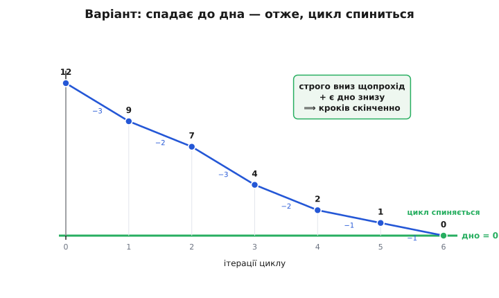
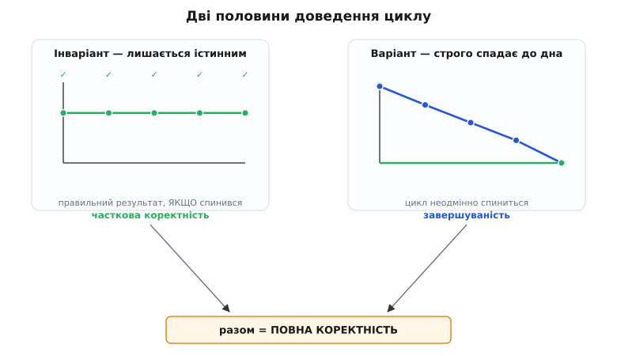
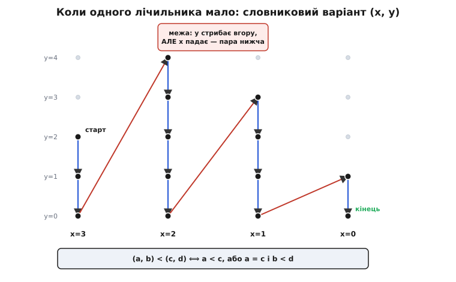

# Варіант циклу

<preknowlist>
- [Математична індукція](topic:math-logic/mathematical-induction) — доведення твердження одразу для всіх натуральних; звідси головне: строго спадна послідовність невід'ємних цілих не може тривати вічно.
- [Інваріант циклу](topic:sf-release/loop-invariants) — парний прийом: інваріант доводить, що результат правильний, ЯКЩО цикл спинився; варіант доводить саму зупинку.
</preknowlist>

Про цикл кажуть, що він «працює», коли на всіх пробах віддає правильну відповідь і повертає керування. Але між цими двома обіцянками — прірва. Що відповідь правильна, доводить [інваріант циклу](topic:sf-release/loop-invariants): величина, яка тримається істинною на кожному проході, тож у мить виходу гарантує потрібний результат. Тільки інваріант каже про той результат лише одне слово — «якщо». *Якщо* цикл спиниться, відповідь буде така. А чи спиниться?

Це питання не закрити пробами, і причина глибша за брак старанності. Щоб пересвідчитися, що цикл на якомусь вході **не** спиняється, довелось би чекати нескінченно: поки він крутиться, ти не знаєш, він завис навік — чи спиниться за наступну мить. Проби доводять хіба «на цих десяти входах спинився», а зависання, як на зло, сидить рівно на тому вході, якого ти не прогнав. Отже, зупинку треба **доводити** — міркуванням, не запуском. Прийом, який це вміє, і зветься варіантом циклу.

## Величина, що не може падати вічно

Почни з найдовірянішого циклу на світі — з відліку вниз. Візьми сотню й віднімай по одиниці: 100, 99, 98… Ти певен, що дійдеш до нуля, і то за скінченне число кроків. Звідки та певність? Не з того, що ти подумки простежив усі сто кроків, — а з єдиної думки: не можна віднімати одиницю без кінця й лишатися невід'ємним. Величина, що на **кожному** кроці строго меншає і при цьому **не може** пробити нуль, мусить рано чи пізно впертися в дно. Байдуже, з якого числа стартувати й наскільки химерно воно скакало б дорогою: сама пара властивостей — «строго вниз» і «є дно» — вичерпує будь-який запас кроків.

Оце й весь прийом, названий повністю. Варіант циклу (англ. *loop variant*, від латин. *variāre* — «змінюватися»; пряма протилежність інваріантові, що якраз **не** змінюється) — це величина, обчислена зі стану програми, яка задовольняє дві умови:

- **строго спадає** на кожному проході тіла — після проходу вона менша, ніж була перед ним, без жодного винятку;
- **обмежена знизу** — не опускається нижче певної межі, найчастіше нуля.

Знайшов для циклу таку величину — цикл **мусить** спинитися. Дві половини одного доведення ділять роботу так: інваріант каже, **що вже зроблено правильно**, а варіант — **скільки роботи ще лишилось**, і показує, що цей запас невпинно тане та вичерпний. Цілочисловий варіант із дном-нулем має ще й окреме ім'я — **обмежувальна функція** (англ. *bound function*): його стартове значення одразу дає стелю на число ітерацій, бо більше кроків, ніж було спочатку запасу, цикл фізично зробити не встигне.

> 🔧 **Навіщо це.** Найгидкіший різновид помилки в циклі — не хибний результат, а **зависання**: умова виходу, що на крайньому вході ніколи не стає хибною. Такий баг не впадає в око — код «начебто працює», аж поки одного дня не натрапить на вхід, де запас роботи перестає спадати. Варіант змушує назвати ту саму величину, яка має вичерпуватись, — і тоді кожна гілка тіла або очевидно її зменшує (добре), або очевидно ні (ось де ховалося зависання). Замість крихкого «здається, зупиниться» дістаєш тверде «зупиниться, ось спадна величина з дном».

## Чому «є дно» — це ще не доведення

Тут криється пастка, через яку прийом легко засвоїти неправильно, а розбір цієї пастки й відрізняє поверхове знання від справжнього. Здавалося б, роботу в парі умов робить друга — «є дно». Насправді ні. Ось цикл, де величина строго спадає, обмежена знизу нулем бездоганно — і не спиняється ніколи:

```py
from fractions import Fraction

x = Fraction(1)
while x > 0:
    x = x / 2      # строго вниз; дно = 0; і НІКОЛИ не спиниться
```

Кожен прохід строго зменшує `x`. Нуль — досконале дно, `x` його не пробиває. Обидві умови виконано дослівно, а цикл вічний, бо `1/2ⁿ` додатне за будь-якого `n`. Отже, «строго спадає плюс обмежена знизу» саме по собі зупинки **не** доводить.

Чого ж бракує? Порівняй два спуски уважно. У натуральних числах кожен крок униз коштує **щонайменше одиницю** — між сусідніми натуральними немає нічого, — тож зі старту `v₀` більше ніж `v₀` кроків просто не вміститься. У додатних дробах крок можна робити дедалі дрібнішим і спускатися вічно, так і не діставши дна. Дно там теж є (той-таки нуль), але воно недосяжне. Виходить, роботу робить не наявність дна, а неможливість дробити спуск без кінця — властивість, якій дали ім'я [фундованість](topic:math-logic/loop-variant/math-well-founded.md) (англ. *well-founded* — «з надійним дном»): у множині немає нескінченного строго спадного ланцюга. Натуральні фундовані, додатні дроби — ні. І ця сама фундованість натуральних рівносильна принципу [математичної індукції](topic:math-logic/mathematical-induction) на них: індукція ллє істину знизу вгору саме тому, що спуск донизу не буває нескінченним, — один факт, прочитаний із двох кінців.

Тепер доведення зупинки складається в один рядок. Значення варіанта на послідовних ітераціях утворюють послідовність `v₀ > v₁ > v₂ > …` невід'ємних цілих. Строго спадна. Живе у фундованій множині. Отже — скінченна. А скільки в ній членів, стільки цикл і зробив проходів; довше крутитися він не може.



*Варіант падає щонайменше на одиницю щопрохід і не може опуститися нижче дна. Строго спадна послідовність невід'ємних цілих не буває нескінченною — тож ітерацій рівно стільки, за скільки кроків величина дістає дна. Це і є вся механіка завершуваності.*

Звідси випливає перше практичне правило, гостре як лезо: **варіант мусить жити у фундованій множині, а не просто «десь спадати».** Дійсне число — «відстань», «похибка», «залишкова вага» — фундованим не буває, тож `while err > 0: err = err/2` є цілком законним нескінченним циклом, хай яким строгим є спад. Саме тому реальні критерії виходу пишуть як `err < 1e-9` чи `for _ in range(max_iter)` — це підміна недоведеного дійсного варіанта на цілочисловий, який фундований. І та сама пильність потрібна до машинних цілих: тип `unsigned` — це не ℕ, а кільце лишків `ℤ/2ⁿ`, у якому дна **немає взагалі** (`0 − 1` дає найбільше число), тож наївний відлік `for (size_t i = n-1; i >= 0; i--)` крутиться вічно — умова `i >= 0` для беззнакового типу тотожно істинна. Обидві ці пастки й ще кілька споріднених розібрано в [каталозі пасток варіанта](topic:math-logic/loop-variant/proj-variant-bounds.md); ширша ж теорія фундованості — чому саме вона робить усю роботу, чим (A) «немає спуску» відрізняється від (B) «є мінімальний елемент» і куди сягають ординали — у [викладі про фундованість](topic:math-logic/loop-variant/math-well-founded.md).

Ключове слово в означенні — **строго**. Якщо варіант лише «не зростає», доведення падає: величина може застрягнути на одному значенні назавжди, і цикл зависне, формально не порушивши умови. Спадати треба саме строго — бодай на найменший крок, але вниз, і на кожному проході без винятку.

## Найпростіший варіант: алгоритм Евкліда

Теорія оживає на класиці. [Алгоритм Евкліда](topic:math-number-theory/gcd-euclidean) шукає найбільший спільний дільник двох чисел, раз по раз замінюючи більше число на остачу від ділення. Що тут спадає?

:::tabs
```py
def gcd(a, b):
    while b != 0:
        v = b                  # варіант — поточне значення b
        a, b = b, a % b
        assert 0 <= b < v      # b невід'ємне й строго впало
    return a
```
```c
#include <assert.h>

int gcd(int a, int b) {
    while (b != 0) {
        int v = b;                 /* варіант — поточне значення b */
        int r = a % b;
        a = b;
        b = r;
        assert(0 <= b && b < v);   /* b невід'ємне й строго впало */
    }
    return a;
}
```
:::

Варіант — це `b`. Після кожного проходу нове `b` дорівнює `a % b`, тобто остачі від ділення на старе `b`. А остача завжди лежить у проміжку `[0, b−1]`: вона невід'ємна за означенням і **строго менша** за дільник, бо якби дорівнювала йому чи була більша, ділення пройшло б іще раз. Отже, `b` щопрохід падає й не пробиває нуль. Спадна невід'ємна цілочислова величина — цикл спиниться, і то не пізніше, ніж за стартове `b` кроків.

Зверни увагу на `assert`: він переносить обіцянку варіанта прямо в код — це [перевірка припущення](topic:sf-apps/assert-panic), що при хибі спиняє виконання. Якщо колись хтось перепише тіло так, що `b` перестане спадати, `assert` спрацює на першому ж такому проході, замість лишити тихе зависання на рідкісному вході. Обіцянка «не пізніше, ніж за `b` кроків» щира, але страшенно щедра: насправді Евклід збігається куди швидше — за число кроків, пропорційне не самому `b`, а **числу його цифр**. Чому так і як із варіанта витягти цю гостру оцінку, показано окремо в [розборі обмежувальних функцій](topic:math-logic/loop-variant/proj-variant-bounds.md); тут досить того, що навіть груба оцінка вже гарантує скінченність.

## Той самий цикл, дві половини доведення

Варіант — не інша тема, а **друга половина** того самого доведення, що починається інваріантом. Найкраще це видно на [двійковому пошуку](topic:sf-algorithms/binary-search), який тримає вікно `[lo, hi)` — проміжок масиву, де ще може бути ціль, — і щоразу відкидає половину:

:::tabs
```py
def bsearch(a, target):
    lo, hi = 0, len(a)              # вікно [lo, hi) — де ще може бути ціль
    while lo < hi:
        v = hi - lo                 # варіант — ширина вікна
        mid = lo + (hi - lo) // 2   # так, а не (lo+hi)//2: різниці нема з чого переповнитись
        if a[mid] == target:
            return mid
        if a[mid] < target:
            lo = mid + 1            # ціль правіше: відкидаємо ліву половину разом з mid
        else:
            hi = mid                # ціль лівіше: відкидаємо праву половину разом з mid
        assert hi - lo < v          # вікно строго звузилось
    return -1
```
```c
#include <assert.h>
#include <stddef.h>

ptrdiff_t bsearch_i(const int *a, size_t n, int target) {
    size_t lo = 0, hi = n;                /* вікно [lo, hi) */
    while (lo < hi) {
        size_t v = hi - lo;               /* варіант — ширина вікна */
        size_t mid = lo + (hi - lo) / 2;  /* різниця невід'ємна: переповнитись нема з чого */
        if (a[mid] == target) return (ptrdiff_t)mid;
        if (a[mid] < target) lo = mid + 1;
        else                 hi = mid;
        assert(hi - lo < v);              /* вікно строго звузилось */
    }
    return -1;
}
```
:::

[Інваріант тут](topic:sf-release/loop-invariants) доводить **правильність**: «якщо ціль є в масиві, вона у вікні `[lo, hi)`». Поки він тримається, пошук не проскочить повз ціль. Але сам собою інваріант не обіцяє, що вікно колись спорожніє й цикл вийде. Це доводить варіант — **ширина вікна** `hi − lo`. Вона невід'ємна й щопрохід строго меншає, бо кожна гілка відкидає половину разом із серединою. Отже, цикл спиниться. Дві величини працюють у парі: одна каже «результат буде правильний», друга — «результат таки буде».

Ці дві половини мають окремі назви. Довести, що результат правильний **за умови** зупинки, — це **часткова коректність** (її забезпечує інваріант). Додати, що цикл **таки** зупиниться, — це **завершуваність** (її забезпечує варіант). Сума двох — **повна коректність**. Формально їх зшивають в одне правило виводу, де `I` — інваріант, `C` — умова циклу, `V` — варіант, а `z` — його значення перед проходом:

```
часткова (інваріант I):     {I ∧ C} S {I}
завершуваність (варіант V): {I ∧ C ∧ V = z} S {I ∧ V < z},  V ≥ 0
──────────────────────────────────────────────────────────────
повна:  {I} while C do S {I ∧ ¬C}  — і цикл спиняється
```

Верхній рядок — це те, що доводили ще з кінця 1940-х: якщо тіло зберігає інваріант, після циклу тримається `I` разом із запереченням умови. Але жодна його частина не питає, чи цикл вийде, — і сумнозвісно `while true` задовольняє **будь-яке** таке твердження порожньо, бо «після циклу» не настає ніколи. Другий рядок затикає цю дірку: він вимагає, щоб той-таки крок тіла ще й строго зменшував невід'ємний `V`. Тільки два рядки разом дають зупинку.



*Дві половини доведення циклу. Інваріант (ліворуч) лишається істинним на кожній ітерації — гарантує правильний результат, якщо цикл спинився: це часткова коректність. Варіант (праворуч) строго спадає до дна — гарантує, що цикл спиниться: це завершуваність. Тільки разом вони дають повну коректність.*

## Від зупинки до часу: варіант як оцінка

Обмежувальна функція дарує ще один подарунок — **час роботи**. Величина `hi − lo` не просто спадає, а щопрохід ділиться навпіл; отже, проходів не більше, ніж `log₂ n`. Варіант, який ти навів для доведення зупинки, часто **одразу** є оцінкою складності: скільки кроків до дна — стільки й ітерацій. Тому в теорії складності варіант — не лише про «спиниться / ні», а й про «як швидко».

Але тут чигає непорозуміння, і воно варте окремого слова. Оцінку дає **не** саме стартове значення варіанта — воно буває смішно щедрим (Евклід обіцяв мільйон кроків, а робить двадцять дев'ять). Гостру оцінку дає **закон**, за яким варіант спадає: лічильник відпадає по одиниці — маєш лінію; вікно ділиться навпіл — маєш логарифм; крок Евкліда з'їдає числа найповільніше на сусідніх числах Фібоначчі — маєш логарифм за золотим перетином. Питання «на скільки вистачить запасу» має чітку відповідь, і будується вона **назад від дна**, найощадливішим спуском. Уся ця техніка — від драбини `W(k)` до того, чому в Евкліда вигулькують числа Фібоначчі, а сортувальна станція вкладається в лінію, — розгорнута в [окремому розборі оцінок](topic:math-logic/loop-variant/proj-variant-bounds.md).

> 🔧 **Навіщо це.** Коли варіант заразом є оцінкою складності, його можна перетворити на живу перевірку теорії. Порахував для двійкового пошуку `⌊log₂ n⌋ + 1` — постав це число «бюджетом» і на кожному проході звіряй лічильник із ним: `assert(steps <= budget)`. Відтепер хибна оцінка складності перестає бути хибним рядком у коментарі й стає **падінням тесту**. Той самий `assert`, що стереже спад, ловить і перевищення передбаченої межі — доведення й профілювання зливаються в один сторожовий рядок.

## Коли одного лічильника мало: словниковий варіант

Іноді жодна окрема величина не спадає весь час. Візьми цикл, де є зовнішній і внутрішній запас роботи: внутрішній вичерпується, потім поповнюється по-новому, а зовнішній при цьому зменшується.

```py
def drain(x, y):
    while x > 0:
        v = (x, y)             # варіант — ПАРА чисел
        if y > 0:
            y -= 1             # менше за другою координатою
        else:
            x -= 1             # перша координата впала...
            y = refill()       # ...а друга підскочила вгору (будь-яке невід'ємне число)
        assert (x, y) < v      # пара все одно менша — за словниковим порядком
    return
```

Тут `y` то падає, то стрибає вгору — сам по собі він не варіант. І `x` спадає не щопрохід. Але спадає **пара** `(x, y)`, якщо порівнювати її за **словниковим порядком** (англ. *lexicographic*, від гр. *lexikón* — «словник»): спершу дивимось на першу координату, і лише при рівних перших — на другу, точно як слова впорядковують у словнику за першою буквою, тоді за другою. Коли `y` меншає, пара меншає за другою координатою. Коли `y` стрибає вгору, `x` перед тим упав — а менша перша координата робить усю пару меншою, хай яка велика друга.



*Пара `(x, y)` спадає за словниковим порядком. Усередині колонки меншає `y` (сині стрілки). На межі `y` стрибає вгору, але `x` падає (червона стрілка) — і за першою координатою пара стає меншою попри більший `y`. Нескінченного спуску немає й у цьому порядку, тож цикл завершується.*

Чи законний такий варіант — залежить від того, чи фундований словниковий порядок на парах, а це зовсім не самоочевидно: друга координата може стрибати вгору як завгодно високо й нескінченно багато разів. І все ж пари **фундовані**, а причина повчальна. Простеж лише перші координати: жоден крок їх не збільшує, тож послідовність `x₀ ≥ x₁ ≥ x₂ ≥ …` не зростає. Невід'ємне ціле, що не зростає, може строго впасти лише скінченне число разів — бо ℕ фундоване, — отже, перша координата рано чи пізно **застигає** назавжди. А від тієї миті вся робота лягає на другу координату, якій за словниковим порядком лишається тільки строго спадати; спадати ж у ℕ вічно вона не може. Нескінченного спуску немає — пара є цілком законним варіантом.

Ця думка масштабується на трійки, кортежі й далі — на структури, багатші за прості лічильники. Той самий прийом, до речі, доводить і завершення [рекурсії](topic:sf-algorithms/recursion): варіант має спадати з кожним вкладеним викликом. Головне не в тому, щоб варіант був числом, а в тому, щоб він жив у множині без нескінченного спуску. Але й тут є край, об який легко перечепитися: словниковий порядок фундований лише для кортежів **фіксованої** довжини. На послідовностях, здатних подовшати новим елементом, він фундованість утрачає — і «список задач, що може вирости», порівнюваний словниково, обертається законною пасткою. Пара за словниковим порядком — це, виявляється, вже трансфінітний варіант зі значеннями в ординалі `ω²`, просто в маскуванні; куди сягає ця драбина ординалів і де прийом ламається, розгорнуто в [розборі фундованості](topic:math-logic/loop-variant/math-well-founded.md).

## Надійний, але не всесильний

Варіант — **надійний** інструмент: знайшов спадну обмежену величину у фундованій множині — і зупинку доведено, без винятків і без «майже завжди». Але він **не всесильний**, і межі його треба знати точно, бо вони не там, де здається на перший погляд.

Найгучніший приклад — послідовність Коллатца (нім. математик Лотар Коллатц, 1937; статус — відкрита проблема, не доведено й не спростовано):

```py
def collatz(n):
    while n != 1:
        n = n // 2 if n % 2 == 0 else 3 * n + 1
    return
```

Число то падає навпіл, то підскакує втричі з гаком. Запусти з будь-якого `n` — і воно, скільки перевіряли, врешті доходить до одиниці. Але **ніхто не довів**, що так буде завжди: досі не знайдено варіанта — жодної величини, яка тут строго спадала б до дна у фундованій множині. Можливо, він існує й чекає відкриття; можливо, цей цикл на якомусь гігантському `n` зациклюється навік. Ми не знаємо.

І це не просто нестача кмітливості. Доведено, що **немає алгоритму**, який для будь-якої програми та її входу відповів би, спиниться вона чи ні, — це [проблема зупинки](topic:computability/halting-problem). Отже, не може бути й загального механічного способу знаходити варіанти: якби він був, ним би розв'язали й нерозв'язне. Понад те, існують цикли, що **насправді** завершуються, але довести це неможливо в межах жодної наперед заданої формальної системи — не тому, що варіанта немає (він є й навіть виписується формулою), а тому, що саме ця система не годна довести, що він **є** варіантом.

Варто вловити, де саме проходить ця межа, бо звична фраза «варіант не завжди можна знайти» її змазує. Надійність методу — беззастережна. Ба більше, у певному сенсі варіант **існує завжди**: для циклу, що справді всюди спиняється, годиться сам «залишок кроків до виходу», і він строго падає на одиницю щопрохід. Ламаються ж рівно дві речі, й обидві — не про існування варіанта: його не знайти **механічно** (це проблема зупинки) і його не завжди **доведеш** у наперед фіксованій системі (це Ґедель). Точний розбір цього зазору — чому метод водночас надійний, семантично повний і практично неповний — у [викладі про фундованість](topic:math-logic/loop-variant/math-well-founded.md). Метод варіанта живе саме тут: він **не** обіцяє знайти доведення завжди — він обіцяє, що **знайдене** доведення бездоганне. Коли ти зумів назвати спадну обмежену величину, питання зупинки закрито остаточно; а чи зумієш назвати — не гарантує ніхто.

## Звідки прийшов прийом

Ідея визріла разом із першими доведеннями про програми, і в неї несподівано довга та обірвана нитка. [Алан Тюрінг ще 1949-го](topic:math-logic/loop-variant/hist-termination-proofs.md) на відкритті кембриджської машини EDSAC доводив завершення циклу через величину, що, за його словами, «невпинно спадає й зникає, коли машина спиняється», — і навіть подав її як ординал зі словниковим порядком, а заразом і як оцінку часу. Повний набір, за одне речення, без жодної попередньої традиції. Але тих трьох сторінок майже ніхто не прочитав, і на подальше вони не вплинули; метод знайшли вдруге з нуля — Роберт Флойд 1967-го зробив його систематичним поряд з інваріантами, а назва «варіант» прийшла ще пізніше, від протилежного до «інваріанта», і стала ключовим словом у мові Eiffel. Хто, коли й що саме зробив у цій історії — з ким сперечалися в залі та чому канонічні назви не Тюрінгові — розказано в [нарисі про доведення завершення](topic:math-logic/loop-variant/hist-termination-proofs.md).

Тож коли наступного разу цикл «начебто зупиняється», спитай себе про одну-єдину величину: що тут щопрохід строго меншає, має дно й живе у множині без нескінченного спуску? Назвав її — і «начебто» стало «доведено». Не назвав — можливо, ти на межі того, що взагалі можна довести.
