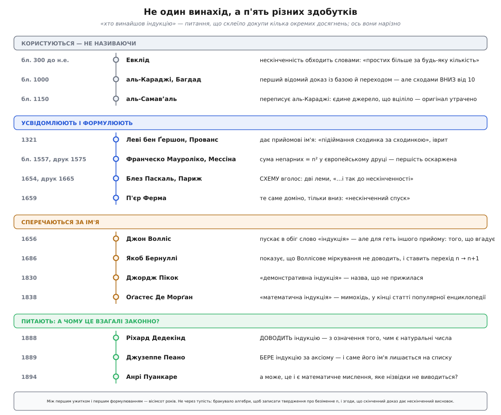
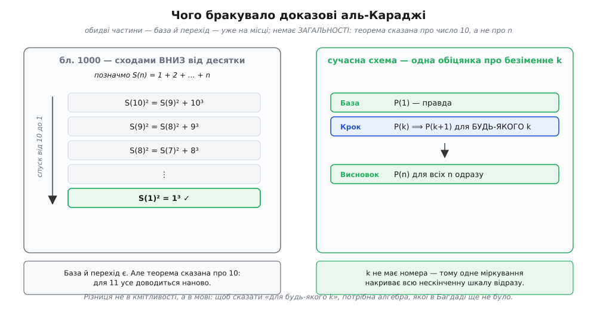

# 📜 Хто винайшов доказ, що ловить нескінченність

З цим методом коїться щось дивне. Він простий настільки, що вміщається у шкільний підручник: перевір перше, доведи перехід — і маєш усю нескінченність. А тепер погляньте на дати. Перше чітке формулювання — 1654 рік. Ім'я — 1838-й. Перший відомий ужиток — близько 1000-го. Між першим ужитком і першим формулюванням лежить шістсот п'ятдесят років, а між формулюванням і назвою — ще майже двісті. І все це після двох тисяч років блискучої математики: Евклід, Архімед, Діофант обходилися без нього зовсім.

Пояснення тут може бути лише одне з двох. Або всі до Паскаля були нетямущі — що дивно, з огляду на те, що вони встигли зробити. Або прийом не такий простий, як здається, і в ньому заховане щось, що ці шістсот років не давалося. Правильна відповідь — друга, і те приховане варте того, щоб його розкопати. Бо здобутків тут насправді не один, а кілька, і кожен дістався окремій людині в окремому столітті.


*Питання «хто винайшов індукцію» склеїло докупи щонайменше п'ять різних досягнень: **ужити** прийом, **усвідомити** його як прийом, **сформулювати** схему окремо від конкретної теореми, **назвати** її і **з'ясувати, чому вона законна**. Це різні речі, і зробили їх різні люди з проміжком у вісімсот років.*

## Греки: обійти нескінченність словами

Почнімо з тих, у кого індукції немає, — бо саме їхня відсутність найкраще показує, чого бракувало.

Евклід (гр. Εὐκλείδης, бл. 300 до н.е.) доводить, що простих чисел безліч. Тільки він цього не каже. Двадцяте твердження дев'ятої книги «Начал» звучить так: простих чисел більше за будь-яку задану їх кількість. Відчуйте обережність цієї фрази. Не «їх нескінченно багато» — це вимагало б говорити про завершену нескінченну сукупність, а такого грецька математика собі не дозволяла. Замість цього: скільки б ви не назвали, знайдеться ще одне. Нескінченність тут не предмет розмови, а обіцянка ніколи не спинитися.

Мало того: Евклід починає доведення не з довільного набору простих, а з трьох — A, B і C. Читач мав сам зрозуміти, що трійка тут просто для прикладу і що міркування не залежить від кількості. Це той самий хід, що трапиться потім і в аль-Караджі, і в Мауроліко: **конкретне число замість загального n**, а загальність — на розсуд читача.

Час від часу в Евклідові намагаються вичитати індукцію, але Девід Джойс, який зробив канонічне гіпертекстове видання «Начал», відрубує коротко: свідчень ужитку принципу індукції в Евкліда немає. Схожа історія з Платоновим «Парменідом»: Фабіо Ачербі (Fabio Acerbi) 2000 року доводив, що там сховане неявне індуктивне міркування, — а 2021-го Стеліос Негрепонтіс і Деметра Фармакі це заперечили. Статус цих читань: **правдоподібно, але не доведено**; на них не варто спиратися.

Тож перешкода в греків не в кмітливості. Вона в дозволі. Щоб зробити індукційний стрибок, треба погодитися сказати вголос твердження про всю нескінченну шкалу — а саме цього грецька математика уникала свідомо й принципово.

## Багдад, близько 1000: аль-Караджі рахує піраміду з кубів

Перший відомий доказ із базою й переходом належить людині, чиє ім'я ми не вміємо певно прочитати.

Абу Бакр аль-Караджі (араб. أبو بكر الكرجي, Abū Bakr al-Karajī, бл. 953 — бл. 1029) працював у Багдаді й писав арабською — тодішньою мовою науки від Кордови до Самарканда. А от звідки він родом — питання відкрите, і відкрите цілком буквально. Арабські рукописи тієї доби часто писали без діакритичних крапок, тож те саме накреслення читається і як **аль-Караджі** (з Караджа — міста в Персії, нині передмістя Тегерана), і як **аль-Каркхі** (з Каркха — передмістя Багдада). Франц Вопке (Franz Woepcke), який 1853 року вперше видав його алгебру в Європі, друкував «аль-Каркхі». 1933-го Джорджо Леві Делла Віда (Giorgio Levi Della Vida) заперечив і став на бік «аль-Караджі» — тобто перського походження. Сьогодні здебільшого пишуть саме так, але історики математики чесно застерігають: аргумент Леві Делла Віди правдоподібний, проте не остаточний. Отже, поширене «перський математик» — це **ймовірне, а не встановлене**; певно ми знаємо тільки місто його праці й мову його книжок.

Що ж він довів? Формулу суми кубів:

```
1³ + 2³ + 3³ + … + n³  =  (1 + 2 + 3 + … + n)²
```

Річ дивовижна сама собою: складіть куби — дістанете точний квадрат, і то квадрат суми самих чисел. Ось як це виглядає до десятки:

**Часткові суми кубів до n = 10**

```
n:                    1    2     3     4     5     6     7      8      9      10
1³+…+n³:              1    9    36   100   225   441   784   1296   2025    3025
корінь із них:        1    3     6    10    15    21    28     36     45      55
1+2+…+n:              1    3     6    10    15    21    28     36     45      55
```

Кожна часткова сума кубів — точний квадрат, і корінь із неї щоразу дорівнює простій сумі чисел. Збіг надто впертий, щоб бути випадковим.

Тільки самої формули замало для слави: її записав ще Аріабгата (санскр. आर्यभट, Āryabhaṭa, 476 — бл. 550) в «Аріабгатії» 499 року — «квадрат суми ряду є сумою кубів». Індійська традиція знала **що**; аль-Караджі перший показав **чому**, і його доказ в «аль-Фахрі» лишається найдавнішим із тих, що дійшли до нас. Ось вам перша чиста ілюстрація до правила, яке варто тримати в голові щоразу, коли заходить мова про першість: **помітити закономірність і довести її — два різні здобутки**, і вони цілком можуть належати різним людям у різних століттях.

Тепер до самого доказу — бо його будова і є тим цікавим. Ключ — ось ця рівність (позначмо S(n) = 1 + 2 + … + n):

```
S(n)² − S(n−1)²  =  (S(n) − S(n−1)) · (S(n) + S(n−1))   [різниця квадратів]
                 =  n · (S(n) + S(n−1))                  [бо S(n) − S(n−1) = n]
                 =  n · (n(n+1)/2 + (n−1)n/2)
                 =  n · n²  =  n³
```

Отже, S(n)² = S(n−1)² + n³: перехід від однієї сходинки до сусідньої. Разом із S(1)² = 1³ це і є база з кроком — обидві частини на місці, за шістсот з гаком років до Паскаля.

І все ж це ще не індукція. Аль-Караджі формулює теорему **не для n, а для десятки**: (1+2+…+10)² = (1+2+…+9)² + 10³. Далі те саме для дев'ятки, для вісімки — і так **вниз**, аж поки спуск упреться в одиницю, де все видно напряму. Віктор Кац (Victor J. Katz) підсумовує це точно: обидві складові сучасного індукційного міркування присутні — істинність при n = 1 і виведення істинності при n = k з істинності при n = k−1, — але загального результату для довільного n аль-Караджі не проголошує і припущення індукції не називає.


*Ліворуч — те, що зробив аль-Караджі: скінченний ланцюжок рівностей від десятки вниз до одиниці. Праворуч — сучасна схема. Різниця не в кмітливості, а в **мові**: щоб сказати «для будь-якого k», потрібна алгебра з буквою на місці числа, а вона в тодішньому Багдаді ще не склалася. Тому доказ аль-Караджі доводить теорему про 10 — і про 11 його доведеться повторити наново.*

Різниця тонка, але вирішальна, і вона не про кмітливість — вона про мову. Щоб написати «для будь-якого k», потрібна алгебра, у якій буква стоїть на місці числа й з нею можна рахувати. Такої алгебри аль-Караджі не мав — він, власне, був одним із тих, хто її поволі вибудовував. Його доказ — скінченні сходи від десятки вниз, а не машина, що виробляє істину для будь-якого n. Для одинадцятки треба спускатися заново.

## Аль-Самавʼаль: той, завдяки кому ми взагалі про це знаємо

Тут історія робить різкий поворот, бо праці аль-Караджі про суму кубів **не існує**. Вона втрачена. Усе, що ми про неї знаємо, дійшло через одного переписувача — і його теж варто назвати на ім'я.

Аль-Самавʼаль аль-Маґрібі (араб. السموأل المغربي, as-Samawʼal ibn Yaḥyā al-Maghribī, бл. 1130 — бл. 1180) народився в Багдаді в єврейській родині: батько, Абуль-Аббас Ях'я аль-Маґрібі — юдейський знавець релігії та літератури, родом із Феса в Марокко; мати, Анна Ісаак Леві — з Басри. Свій трактат «аль-Бахір фі'ль-джабр» («Осяйне в алгебрі») він написав у дев'ятнадцять років. Іслам прийняв 8 листопада 1163 року в Мараґі, відкладаючи цей крок чотири роки з поваги до батька; помер близько 1180-го там-таки, у Мараґі. Звична етикетка «арабський математик» стирає з цього все, крім мови рукопису: народжений у Багдаді син марокканського рабина й басрійки, який навернувся у тридцять із чимось. Кожен із цих вимірів — інший, і жоден не поглинає решти.

Саме аль-Самавʼаль переказав міркування аль-Караджі, і саме йому приписав біноміальну теорему. Тобто найдавніший відомий індукційний доказ ми маємо **не з перших рук**, а зі свідчення учня через півтораста років після вчителя. Так само варто дивитися й на роботу самого аль-Самавʼаля: він проводить міркування для n = 1, звідти для n = 2, і далі десь до п'ятірки — а тоді зауважує, що так можна тягнути скільки завгодно. Це не формальна індукція; це, як обережно кажуть історики, **великий крок до її розуміння**.

Рошді Рашед (Roshdi Rashed) 1972 року присвятив цій парі спеціальне дослідження й доводив, що саме тут — справжній початок методу. Заперечення до нього те саме, що й до аль-Караджі: схеми як схеми ще немає, є вправне користування нею на конкретиці. Статус: **встановлено, що прийом ужито; оскаржується, чи це вже метод**.

## Прованс, 1321: «підіймання сходинка за сходинкою»

Наступний крок зробила людина, яка вперше дала цьому рухові **ім'я** — і не залишила по собі майже жодного впливу.

Леві бен Ґершон (івр. לוי בן גרשון, Levi ben Gershon; він же Ґерсонід, він же РаЛБॠ— за першими літерами «Раббі Леві бен Ґершон»; у латинян Magister Leo Hebraeus) народився 1288 року в Баньоль-сюр-Сез у Лангедоку, жив в Авіньйоні й Оранжі, помер 20 квітня 1344-го, найпевніше в Перпіньяні. Писав івритом. 1321 року закінчив «Маасей Хошев» («Дії лічби») — про арифметичні дії, суми послідовних чисел, квадратів і кубів, біноміальні коефіцієнти й комбінаторні тотожності.

І от у ньому він раз у раз користується прийомом, який називає **гадраґа** (івр. הדרגה) — «підіймання сходинка за сходинкою без кінця». Це нове. Аль-Караджі прийом застосував; Леві бен Ґершон його **побачив як прийом**, дав йому назву й свідомо повторював у різних доведеннях. Нахум Рабінович (Nachum L. Rabinovitch) 1970 року на цій підставі назвав його початком індукції; довідки формулюють це обережніше — найдавніший відомий математик, який ужив індукцію **систематично й самоусвідомлено**. Заперечення чесне і його теж треба сказати: у жодній формальній системі метод не означений — це радше виразна інтуїція, ніж правило числення.

А тепер сумне. Він писав івритом, у Провансі, для єврейської вченої громади — і латинський Захід його майже не читав. Через двісті тридцять років у Мессіні почнуть із того самого місця, нічого про нього не знаючи. Це друге правило, яке варто винести з цієї історії: **першість і вплив — різні речі**, і одна не тягне другої. Хто зробив раніше — не конче той, від кого пішло.

## Мессіна, 1557: сицилієць грецького роду складає непарні числа

Франческо Мауроліко (італ. Francesco Maurolico, лат. Franciscus Maurolycus, 16 вересня 1494 — 22 липня 1575) народився й помер у Мессіні. Його батько Антоніо Марулі — грецький лікар, який утік із Константинополя після османського здобуття міста й учився в колі неоплатоніка Константина Ласкаріса; в тому ж елліністичному дусі виховали й сина. Франческо став священником 1521 року, а з 1550-го — абатом монастиря Санта-Марія-дель-Парто в Кастельбуоно. Звичне «італійський математик» і тут завузьке: сицилієць із родини грецьких утікачів, вихований на грецькій ученості, підданий іспанської корони.

Його «Arithmeticorum libri duo» («Дві книги про арифметику») складено близько 1557 року, а надруковано у Венеції 1575-го, у Франческо Франческі, разом із «Opuscula mathematica» — того самого року, коли автор помер. У першій книзі, твердження 15, він доводить, що сума перших n непарних чисел дорівнює n²:

```
1 + 3 + 5 + … + (2n − 1)  =  n²

1 = 1²;  1+3 = 4 = 2²;  1+3+5 = 9 = 3²;  1+3+5+7 = 16 = 4²;  …
```

Перехід тут навіть видно оком: наступний квадрат перевищує попередній рівно на наступне непарне число, бо (n+1)² = n² + (2n + 1).

І ось із цим твердженням сталася показова пригода. 1909 року Джованні Вакка (Giovanni Vacca) надрукував у бюлетені Американського математичного товариства статтю з назвою «Мауролік, перший відкривач принципу математичної індукції» — і оголосив, що знайдений у Мауроліко «новий і легкий спосіб» є не що інше, як принцип індукції. 1917-го Вільям Бассі (W. H. Bussey) цю думку підхопив. А 1953 року Ганс Фройденталь (Hans Freudenthal) у праці «Zur Geschichte der vollständigen Induktion» ретельно показав, що Вакка **вичитав у тексті більше, ніж там написано**.

Далі почалося те, заради чого цю пригоду й варто розповісти. Ваккине формулювання зажило власним життям. Речення «Arithmeticorum libri duo (1575) містить перший відомий доказ методом математичної індукції» досі стоїть у довідниках — часом просто в сусідній статті того самого видання, де інша стаття вже посилається на спростування Фройденталя. Ніхто нікого не дурить: просто гарне, кругле, легко цитоване твердження живучіше за акуратне заперечення в спеціальному журналі. Тримайте це в голові, коли наступного разу читатимете де-небудь безапеляційне «перший довів». Статус Мауролікової першості: **оскаржено; спеціалісти в тому вигляді, як її сформулював Вакка, не приймають**.

Що лишається за Мауроліко напевно — теж чимало: виразне, друковане, доступне європейцям застосування прийому, з якого справді читали далі.

## Париж, 1654: Паскаль каже це вголос

І нарешті момент, який справді був поворотним, — і він не про новий прийом.

Блез Паскаль (фр. Blaise Pascal, 1623–1662) написав «Traité du triangle arithmétique» («Трактат про арифметичний трикутник») 1654 року; надрукували його аж 1665-го, через три роки після смерті автора. Виріс трактат із цілком приземленої мороки: того ж 1654-го Паскаль листувався з Ферма про поділ ставки між гравцями, чия партія обірвалася посередині, — і трикутник із біноміальними коефіцієнтами був потрібен йому як робочий інструмент для підрахунку шансів.

> 🔧 **Навіщо це.** Про що взагалі йдеться в «дванадцятому наслідку», стане зрозуміло, якщо тримати в голові, що таке [біноміальний коефіцієнт](topic:math-combinatorics/combinations) — число C(n,k) способів вибрати k предметів із n. Саме ці числа стоять у клітинках арифметичного трикутника: кожен рядок відповідає своєму n, а два сусіди в рядку складаються в число під ними. Паскалів «наслідок» — це правило, як відносяться два сусіди в одному рядку.

Дванадцятий наслідок сучасним записом виглядає так:

```
C(n,k) / C(n,k+1)  =  (k+1) / (n−k)

перевірка, рядок n = 4:   C(4,1)/C(4,2) = 4/6 = 2/3
                          (k+1)/(n−k)   = 2/3   ✓
```

Зміст тут не головне. Головне — те, як Паскаль до нього береться. Він пише (мова оригіналу — французька XVII століття):

```
Quoy que cette proposition ait une infinité de cas, j'en donneray une
démonstration bien courte, en supposant 2 lemmes.

Le 1., qui est évident de soy-mesme, que cette proportion se rencontre
dans la seconde base.

Le 2., que si cette proportion se trouve dans une base quelconque, elle
se trouvera nécessairement dans la base suivante.

D'où il se voit qu'elle est nécessairement dans toutes les bases : car
elle est dans la seconde base par le premier lemme ; donc par le second
elle est dans la troisiesme base, donc dans la quatriesme, et à l'infiny.
```

Перекладімо: «Хоча це твердження має нескінченно багато випадків, я дам йому вельми короткий доказ, припустивши дві леми. Перша, очевидна сама собою, — що ця пропорція є в другій основі. Друга — що коли ця пропорція є в якійсь основі, то вона неодмінно буде і в наступній. Звідки видно, що вона неодмінно є в усіх основах: бо в другій основі вона є за першою лемою; отже, за другою вона є в третій основі, отже, в четвертій — і так до нескінченності».

Прочитайте це ще раз, повільно. Тут немає жодного прийому, якого не було в аль-Караджі. Тут є щось інше — **усвідомлення**. Паскаль першим каже вголос усі три речі, яких доти бракувало. Що випадків нескінченно багато, — і це не привід ухилятися, а те, що зараз буде подолано. Що для цього досить **рівно двох** лем — не трьох, не однієї. І що з цих двох висновок котиться самотужки: друга основа, третя, четверта — **et à l'infiny**.

Ось у чім поворот: Паскаль відділив **схему від теореми**. Доти індукція була способом довести оцю конкретну річ. У Паскаля вона вперше стала окремим предметом, який можна назвати, порахувати його частини й прикласти до чого завгодно наступного. Тобіас Данціґ (Tobias Dantzig) 1930 року сформулював це рівно так: перше явне формулювання принципу рекурентності ми завдячуємо генієві Паскаля. Статус: **усталений факт**; це найменш оскаржувана точка в усій хроніці.

## Ферма: те саме доміно, тільки вниз

Поруч із Паскалем стояв його ж адресат по листуванню — і робив ту саму річ навпаки.

П'єр де Ферма (фр. Pierre de Fermat, 1607–1665) у листі до П'єра де Каркаві від 14 серпня 1659 року оголосив метод, який назвав **descente infinie ou indéfinie** — «нескінченний або невизначений спуск», — і перелічив п'ять теорем, які ним доводить: що площа прямокутного трикутника з цілими сторонами не буває квадратом; що x³ + y³ = z³ не має розв'язків у цілих; ще два рівняння; і що кожне просте виду 4n + 1 єдиним способом розкладається в суму двох квадратів.

[Спуск](topic:math-logic/infinite-descent) — це індукція, поставлена з ніг на голову: замість підійматися, ви показуєте, що з будь-якого контрприкладу будується **менший** контрприклад; а спускатися натуральними числами вічно не можна, бо нижче за одиницю їх немає — отже, контрприкладу немає зовсім. Те саме доміно, тільки валиться воно вниз, і зупиняє його не поштовх, а дно.

Тому Фройденталь у своїй хроніці ставить трьох поруч: Мауроліко, Ферма, Паскаль — люди, у чиїх руках у XVI–XVII століттях склалася повна індукція. Спуск і підйом — не два методи, а два боки однієї властивості натурального ряду.

## Слово прийшло не з того боку

А тепер найкраща іронія в цій історії, і водночас пояснення, чому саме цей метод плутають частіше за будь-який інший.

Через два роки після Паскалевого трактата Джон Волліс (англ. John Wallis, 1616–1703) видав «Arithmetica Infinitorum» (1656) і на п'ятнадцятій сторінці пустив в обіг зворот **per modum inductionis** — «способом індукції». Слово він узяв готове: Аристотелева ἐπαγωγή («наведення», «підведення до»), яку ще Цицерон переклав латиною як *inductio*, означала перехід від окремих випадків до загального твердження. Тобто рівно те, що робить природознавець: подивився на випадки, побачив закономірність, оголосив правило.

Саме так Волліс своєю «індукцією» і користувався — щоб дістати, що відношення суми перших n квадратів до n³ + n² прямує до ⅓. Подивився на кілька випадків, побачив, оголосив. І він мав рацію по суті — але не мав доказу, бо цей спосіб доказом і не є: він **угадує**.

1686 року Якоб Бернуллі (нім. Jacob Bernoulli, 1655–1705) сказав це прямо: Воллісове міркування логічно ні до чого не зобов'язує — і поставив на його місце перехід від n до n + 1. Флоріан Кайорі (Florian Cajori) підсумував цю сутичку саме так, і саме Бернуллі відтоді звично називають тим, хто дав методові справжню опору.

Але слово вже прилипло. І прилипло **до переможця від переможеного**: назву «індукція» математичний метод успадкував від того самого прийому, який Бернуллі щойно спростував. Звідси й нескінченне непорозуміння: чуючи «індукція», людина природно думає про узагальнення з прикладів — про річ, яка може й підвести. А математична індукція — навпаки, чиста дедукція, залізна, без жодного вгадування. Ім'я обіцяє протилежне тому, що метод дає. Мало який термін так довго й так уперто працює проти власного змісту.

## Лондон, 1838: ім'я, кинуте мимохідь

Назву метод діставав довго й із кількох спроб.

1830 року Джордж Пікок (англ. George Peacock, 1791–1858) у «Treatise on Algebra» назвав його **демонстративною індукцією** — тобто «доказовою», аби відрізнити від тієї, що вгадує. Чесна, точна назва. Не прижилася.

А 1838-го Оґастес Де Морґан (англ. Augustus De Morgan, 1806–1871) написав статтю «Induction (Mathematics)» — і от тут варто затриматися, бо місце публікації прекрасне. Це не трактат і не журнал. Це **Penny Cyclopaedia**, том XII, сторінки 465–466: дешева популярна енциклопедія, яку випускало Товариство поширення корисних знань для робітників, що вчилися самотужки. Ім'я одного з центральних методів математики народилося в науково-популярній статті для широкого читача.

Мало того — народилося ненароком. Майже всю статтю Де Морґан провадить під власним новим терміном **successive induction**, «послідовна індукція». І вже наприкінці, побіжно, згадує метод як **mathematical induction**. Оце побіжне і вціліло. Кайорі, який 1918 року розкопав цю історію в American Mathematical Monthly, констатує: у статті Де Морґана, вперше надрукованій 1838-го, ім'я «математична індукція» трапляється, як видається, вперше. Пікокова «демонстративна» була влучніша, Де Морґанова «послідовна» — теж; перемогла кинута мимохідь.

Далі спрацював підручник. Айзек Тодгантер (англ. Isaac Todhunter, 1820–1884) у своїй «Algebra for the Use of Colleges and Schools» (1858) — книжці, що витримала півтора десятка видань, — уживав обидві назви, але в заголовок розділу виніс «Mathematical Induction». Через підручник назва й розійшлася.

Цікаво, що інші мови встояли. Німці й досі кажуть **vollständige Induktion** — «повна індукція», де «повна» саме й відрізняє її від тієї, що перебирає випадки й на тім спиняється. Французи взагалі обійшли пастку: **raisonnement par récurrence**, «міркування рекурентністю», без слова «індукція» зовсім. Обидві назви чесніші за англійську. Українська, на жаль, узяла кальку саме з англійської — разом із усім її непорозумінням.

## 1888–1889: із прийому — в аксіому

Дев'ятсот років цим прийомом користувалися. Не було, здається, жодного, хто б спитав: а чому, власне, **можна**? І коли врешті спитали, виявилося, що відповідей дві — і обидві чесні.

Ріхард Дедекінд (нім. Richard Dedekind, 1831–1916) у книжці «Was sind und was sollen die Zahlen?» («Що таке числа і для чого вони», 1888) індукцію **довів**. Його теорія ланцюгів — найглибше місце цієї праці — постала саме з аналізу того, яких умов має задовольняти відображення, щоб доведення індукцією стали можливі. Тобто Дедекінд узявся не за індукцію, а за питання «чим є натуральні числа», — і індукція випала звідти теоремою.

Джузеппе Пеано (італ. Giuseppe Peano, 1858–1932) роком пізніше, в «Arithmetices principia, nova methodo exposita» («Начала арифметики, викладені новим способом», 1889), зробив протилежне: **поклав індукцію в основу** як дев'яту аксіому. Якщо множина містить нуль і разом із кожним n містить наступне за ним, то вона містить усі натуральні числа. Не теорема — правило гри.

Різниця між ними не в правильності, а в тому, **де класти дно**. Дедекінд копає глибше й виводить індукцію з означення числа; Пеано зупиняється раніше й оголошує її вихідною. Обидва варіанти працюють, і сьогодні користуються обома.

А ім'я на списку лишилося одне. У передмові до своїх «Начал» Пеано прямо пише, що вельми корисною йому була недавня праця Дедекінда «Was sind und was sollen die Zahlen» (Брауншвейґ, 1888), де гостро досліджено питання підвалин числа. Дедекінд надрукував раніше, Пеано на нього послався — а аксіоми звуться Пеановими. Статус тут цілком з'ясований: **першість Дедекінда в друці й Пеанове визнання цієї першості — встановлені факти**; назва — просто випадковість слави, як то часто буває.

## Пуанкаре: а може, це і є математичне мислення?

Останнє слово в цій історії — не факт, а суперечка, яка не скінчилася.

1894 року Анрі Пуанкаре (фр. Henri Poincaré, 1854–1912) надрукував статтю «Sur la nature du raisonnement mathématique» («Про природу математичного міркування») і поставив питання руба. Міркування рекурентністю, каже він, **не зводиться до принципу несуперечності** — тобто не є просто логікою. І з досвіду його теж не візьмеш: досвід завжди скінченний, він ніколи не сягає далі перевіреного. Що ж тоді лишається? Пуанкаре відповідає: це правило, недосяжне ні для аналітичного доведення, ні для досвіду, — справжній взірець синтетичного апріорного судження.

Він сперечався з логіцистами — Фреге, потім Расселом, — які хотіли звести всю математику до логіки. Пуанкаре наполягав: ось тут звести не вийде. Індукція — не вивідне правило, а те, чим розум уміє робити нескінченне доступним, і взяти це вміння нізвідки не можна.

Чи мав він рацію — досі сперечаються; це **філософська позиція, а не встановлений факт**. Але висновок, який варто забрати з собою, від відповіді не залежить. Індукція здається очевидною не тому, що вона дрібниця. Можливо, вона здається очевидною тому, що глибше під нею вже нічого немає.

## Що з цього всього виходить

Питання «хто винайшов математичну індукцію» не має відповіді — не через брак даних, а тому, що воно склеїло докупи щонайменше шість різних справ. Ужити прийом — аль-Караджі, близько 1000-го (а можливо, й раніше — просто не дійшло). Побачити його як прийом і назвати — Леві бен Ґершон, 1321-й. Пустити в європейський друк — Мауроліко, 1557/1575, із застереженням, що Ваккине «перший» не витримало перевірки. Сформулювати схему окремо від теореми — Паскаль, 1654-й. Дати ім'я, яке лишилося, — Де Морґан, 1838-й, мимохідь, у популярній енциклопедії. Спитати, чому це законно, і відповісти — Дедекінд і Пеано, 1888–1889. Кожне з цих досягнень справжнє, кожне окреме, і жодне не поглинає решти.

А головне — та вісімсотрічна прогалина між першим ужитком і першим формулюванням. Вона не про тупість. Вона про те, що прийом, який ми вважаємо простим, насправді потребує двох речей, і жодна не дається задарма. Потрібна **алгебра**, у якій можна написати твердження про безіменне n і рахувати з ним, — саме через її брак аль-Караджі мусив говорити про десятку. І потрібна **згода**, що скінченна сторінка міркувань має право видати нескінченний висновок, — саме через її брак Евклід волів казати «більше за будь-яку задану кількість».

Перше дозріло за шістсот років. Друге Паскаль сказав уголос одним реченням: хоча це твердження має нескінченно багато випадків, я дам йому вельми короткий доказ. У цьому реченні й уся відстань від Багдада до Парижа.
