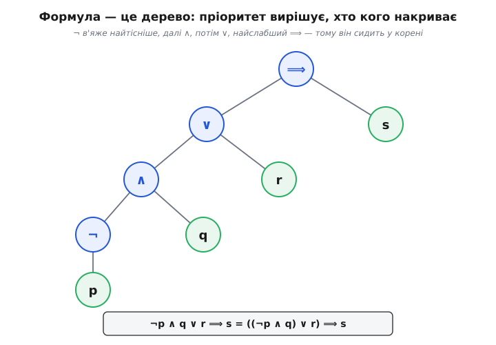
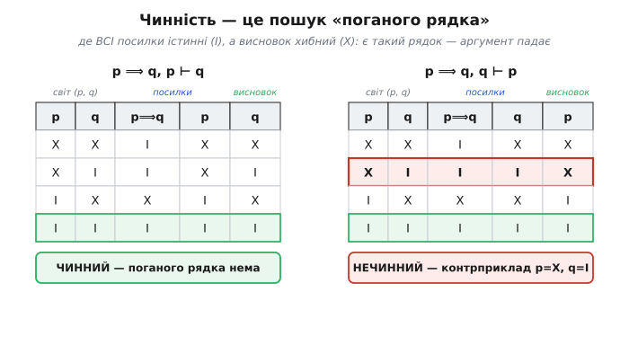

# ⚙️ Перевіряч чинності міркувань

«Якщо йшов дощ, трава мокра; трава мокра; отже йшов дощ» — і щось муляє. А «якщо йшов дощ, трава мокра; йшов дощ; отже трава мокра» — тут не підкопаєшся. У чому різниця, точно? Не в змісті: підставте замість дощу й трави будь-які два твердження — перше міркування лишиться хитким, друге залізним. Уся різниця в чистій **формі**. Логіка вивчає саме її: які форми міркування переносять істину від посилок до висновку, хоч би що ти в них підставив.

Скажімо чіткіше. Аргумент **чинний**, коли **неможливо**, щоб усі посилки були істинні, а висновок водночас хибний. Не «зазвичай так», не «правдоподібно» — неможливо. Упізнаєте? Це та сама певність «неможливо інакше», яку дає доведення, тільки зведена до голого скелета: доведення тягне довгий ланцюг, а тут ми питаємо про один-єдиний його крок — чи справді він чинний.

І ось де щастя. Для тверджень, зібраних лише з атомів та сполучників ¬ (не), ∧ (і), ∨ (або), ⟹ (якщо…то), слово «неможливо» має **скінченний** зміст. Атоми — це прості висловлення, кожне або істинне, або хибне; поставте їм усі можливі значення й перевірте кожен випадок. n атомів — це 2ⁿ комбінацій, скінченна таблиця. Тобто чинність у логіці висловлень машина здатна **вирішити** — механічно, з певним «так» або «ні». Це рідкісний і коштовний факт (нижче побачимо, наскільки рідкісний). Цей проєкт будує таку машину: подаєш їй посилки й висновок — вона повертає ЧИННИЙ або НЕЧИННИЙ. Причому коли каже «ні», то кладе перед тобою точний контрприклад; а коли каже «так», її вичерпна перевірка сама по собі є доведенням — нудним, зате незаперечним.

## Ідея: три деталі й одне питання

Переформулюймо означення так, щоб його можна було виконати. Аргумент «P₁, …, Pₙ ⊢ C» (риска ⊢ читається «отже») чинний тоді й лише тоді, коли **нема** такого присвоєння істини атомам, за якого всі Pᵢ істинні, а C хибний. Одне це речення — уся специфікація. Реалізують його три механізми:

1. **Парсер** перетворює рядок «¬p ∨ q» на дерево, з якого видно, що з чим поєднано.
2. **Обчислювач** бере дерево й конкретне присвоєння {p: істина, q: хиба} і видає істину або хибу.
3. **Двигун** перебирає всі 2ⁿ присвоєнь і шукає «поганий рядок» — той, де всі посилки істинні, а висновок хибний. Знайшов — аргумент нечинний, і сам цей рядок є контрприкладом. Не знайшов ні одного — аргумент чинний.

Порядок будови диктується залежностями: спершу розібрати текст у структуру, потім навчитися обходити структуру за даного присвоєння, і аж тоді ганяти цикл по всіх присвоєннях. Рушаймо по черзі.

## Розбір формули: від рядка до дерева

Чому не обчислювати рядок навпростець, зліва направо? Бо «¬p ∨ q» приховує структуру: це ¬(p ∨ q) чи (¬p) ∨ q? Дві різні функції, і плутати їх не можна. Тому потрібні правила пріоритету й дерево, яке закріплює єдине прочитання раз і назавжди.

Пріоритет сполучників — від найтіснішого до найслабшого: **¬, ∧, ∨, ⟹**. А імплікація ще й **правоасоціативна**: p ⟹ q ⟹ r означає p ⟹ (q ⟹ r). Усе це віддзеркалює звичну арифметику: ¬ поводиться як унарний мінус, ∧ як множення, ∨ як додавання, а ⟹ найслабша, як знак рівності наприкінці. Хто вміє розкривати «2 + 3 · 4» без дужок, той уже відчуває, як «p ∨ q ∧ r» само собою читається «p ∨ (q ∧ r)».

Роботу ділять на дві стадії: **лексер** (символи → лексеми) і **парсер** (лексеми → дерево). Лексер простий: він проходить рядок, викидає пробіли, упізнає дужки й сполучники (приймемо і красиві символи ¬ ∧ ∨ ⟹, і зручні для клавіатури `~ & | ->`), а суцільні букви збирає в назву змінної.

```python
from itertools import product

OPS = {'¬': 'not', '~': 'not', '!': 'not',
       '∧': 'and', '&': 'and',
       '∨': 'or',  '|': 'or',
       '⟹': 'imp', '→': 'imp'}          # приймаємо і ⟹, і →

def tokenize(s):
    toks, i = [], 0
    while i < len(s):
        c = s[i]
        if c.isspace():
            i += 1
        elif s.startswith('->', i) or s.startswith('=>', i):
            toks.append('imp'); i += 2
        elif c in '()':
            toks.append(c); i += 1
        elif c in OPS:
            toks.append(OPS[c]); i += 1
        elif c.isalpha():                  # назва змінної: p, q, rain, …
            j = i
            while j < len(s) and s[j].isalnum():
                j += 1
            toks.append(('var', s[i:j])); i = j
        else:
            raise SyntaxError('невідомий символ %r у позиції %d' % (c, i))
    return toks
```

Тепер парсер. Пріоритет вкладають у саму структуру викликів: **одна функція на кожен рівень пріоритету**, і кожна кличе тіснішу за себе. Функція для найслабшого ⟹ спершу питає рівень ∨; той — рівень ∧; той — заперечення; те — атом або дужку. Дужка ж скидає нас назад на найслабший рівень, бо всередині дужок усе починається спочатку. Це класичний **рекурсивний спуск** — той самий прийом, що розбирає арифметичні вирази в [розборі виразів магазинним автоматом](topic:computability/pushdown-automata/proj-expression-parser.md): граматика прямо перекладається на взаємні виклики функцій.

```python
class Parser:
    def __init__(self, toks):
        self.toks, self.pos = toks, 0

    def peek(self):
        return self.toks[self.pos] if self.pos < len(self.toks) else None

    def eat(self, want=None):
        t = self.peek()
        if want is not None and t != want:
            raise SyntaxError('очікував %r, знайшов %r' % (want, t))
        self.pos += 1
        return t

    def parse(self):
        tree = self.imp()
        if self.pos != len(self.toks):
            raise SyntaxError('зайві лексеми з позиції %d' % self.pos)
        return tree

    def imp(self):                       # ⟹ — найслабший, ПРАВОасоціативний
        left = self.disj()
        if self.peek() == 'imp':
            self.eat('imp')
            return ('imp', left, self.imp())   # рекурсія праворуч
        return left

    def disj(self):                      # ∨ — лівоасоціативний
        node = self.conj()
        while self.peek() == 'or':
            self.eat('or')
            node = ('or', node, self.conj())
        return node

    def conj(self):                      # ∧ — тісніший за ∨
        node = self.neg()
        while self.peek() == 'and':
            self.eat('and')
            node = ('and', node, self.neg())
        return node

    def neg(self):                       # ¬ — найтісніший
        if self.peek() == 'not':
            self.eat('not')
            return ('not', self.neg())   # ¬¬p цілком законне
        return self.atom()

    def atom(self):                      # змінна або (…)
        t = self.peek()
        if t == '(':
            self.eat('(')
            node = self.imp()            # у дужках усе спочатку
            self.eat(')')
            return node
        if isinstance(t, tuple) and t[0] == 'var':
            return self.eat()
        raise SyntaxError('очікував змінну або дужку, знайшов %r' % (t,))

def parse(s):
    return Parser(tokenize(s)).parse()
```

Дерево ми зображуємо простими кортежами: `('var', 'p')` — листок-змінна, `('not', A)` — заперечення піддерева A, `('and', A, B)`, `('or', A, B)`, `('imp', A, B)` — двомісні вузли. Жодних класів не треба: кортеж уже несе і тип вузла (перший елемент), і його дітей. А завдяки пріоритетам той самий текст завжди дає те саме дерево, і будь-яка двозначність зникає.


*Формула — це дерево, і пріоритет вирішує форму. Найтісніший ¬ ховається в самому низу, біля свого атома; найслабший ⟹ спливає в корінь і накриває все. Тому «¬p ∧ q ∨ r ⟹ s» без жодних дужок читається однозначно як «((¬p ∧ q) ∨ r) ⟹ s»: чим тісніше сполучник в'яже, тим глибше він сидить у дереві.*

## Обчислити й перебрати

Дерево є — обійдімо його. Обчислювач рекурсивний, бо рекурсивна сама структура: значення вузла складається зі значень його дітей. П'ять форм дерева дають рівно п'ять випадків. Тільки один із них варто прочитати уважно — імплікацію: `p ⟹ q` за означенням є `(¬p) ∨ q`, тобто вона істинна завжди, крім єдиного випадку «посилка істинна, а наслідок хибний». Це та сама матеріальна імплікація, що дивує новачків (до неї ще повернемось у пастках), але для машини вона — просто три рядки таблиці з чотирьох.

```python
def evaluate(node, env):
    match node:
        case ('var', name):  return env[name]
        case ('not', a):     return not evaluate(a, env)
        case ('and', a, b):  return evaluate(a, env) and evaluate(b, env)
        case ('or', a, b):   return evaluate(a, env) or evaluate(b, env)
        case ('imp', a, b):  return (not evaluate(a, env)) or evaluate(b, env)

def variables(node):
    match node:
        case ('var', name): return {name}
        case ('not', a):    return variables(a)
        case (_, a, b):     return variables(a) | variables(b)
```

Пітонівський `match` тут не прикраса, а точне віддзеркалення структури: скільки форм у дерева, стільки й гілок, і кожна каже, як зібрати значення з дітей. Функція `variables` тим самим ходом збирає всі імена атомів через об'єднання множин — вони визначать розмір таблиці.

Лишається двигун. Він розбирає всі формули, збирає імена атомів **з усіх** — і з посилок, і з висновку (проґавити атом, що є лише у висновку, — типова пастка), а тоді перебирає всі 2ⁿ присвоєнь. `product([False, True], repeat=n)` дає рівно декартів степінь: усі кортежі з n нулів-одиниць. На кожному присвоєнні одне питання: чи істинні **всі** посилки й водночас хибний висновок? Знайшли таке — це «поганий рядок», аргумент падає, і саме це присвоєння повертаємо як контрприклад. Пройшли всі рядки без жодного поганого — аргумент чинний.

```python
def check(premises, conclusion):
    prems = [parse(p) for p in premises]
    goal  = parse(conclusion)
    names = sorted(set().union(*(variables(f) for f in prems + [goal])))
    for combo in product([False, True], repeat=len(names)):
        env = dict(zip(names, combo))
        if all(evaluate(f, env) for f in prems) and not evaluate(goal, env):
            return False, env            # свідок: посилки істинні, висновок хибний
    return True, None                    # поганого рядка нема → чинний
```

Оце й усе ядро — десяток рядків. Означення чинності («нема присвоєння, де…») лягло майже дослівно: `for` по всіх присвоєннях, `all(...)` по посилках, `not evaluate(goal)` по висновку. Логіка не переписана — вона просто виконана.

## Що каже прогін

Обгорнімо перевіряч у друк вердикту й прожену на класичних формах міркування — правильних і хибних. Значення позначимо українськими літерами: **І** — істина, **Х** — хиба.

```python
def show(premises, conclusion):
    valid, cx = check(premises, conclusion)
    arg = '%s  ⊢  %s' % (', '.join(premises), conclusion)
    if valid:
        print('ЧИННИЙ    ' + arg)
    else:
        w = ', '.join('%s=%s' % (k, 'І' if v else 'Х') for k, v in sorted(cx.items()))
        print('НЕЧИННИЙ  %s   контрприклад: %s' % (arg, w))

tests = [
    (['p ⟹ q', 'p'], 'q'),                 # модус поненс
    (['p ⟹ q', '¬q'], '¬p'),               # модус толленс
    (['p ⟹ q', 'q'], 'p'),                 # ХИБА: ствердження висновку
    (['p ⟹ q', '¬p'], '¬q'),               # ХИБА: заперечення посилки
    (['p ∨ q', '¬p'], 'q'),                 # диз'юнктивний силогізм
    (['p ⟹ q', 'q ⟹ r'], 'p ⟹ r'),         # транзитивність імплікації
    (['p ∨ q', 'p ⟹ r', 'q ⟹ r'], 'r'),    # розбір випадків
]
for prem, con in tests:
    show(prem, con)

print('---')
show([], 'p ∨ ¬p')          # порожні посилки: чинність = висновок є тавтологією
show([], 'p ∨ q')           # не тавтологія → нечинний
show(['p', '¬p'], 'q')      # суперечливі посилки доводять будь-що
```

Прогін друкує:

```
ЧИННИЙ    p ⟹ q, p  ⊢  q
ЧИННИЙ    p ⟹ q, ¬q  ⊢  ¬p
НЕЧИННИЙ  p ⟹ q, q  ⊢  p   контрприклад: p=Х, q=І
НЕЧИННИЙ  p ⟹ q, ¬p  ⊢  ¬q   контрприклад: p=Х, q=І
ЧИННИЙ    p ∨ q, ¬p  ⊢  q
ЧИННИЙ    p ⟹ q, q ⟹ r  ⊢  p ⟹ r
ЧИННИЙ    p ∨ q, p ⟹ r, q ⟹ r  ⊢  r
---
ЧИННИЙ      ⊢  p ∨ ¬p
НЕЧИННИЙ    ⊢  p ∨ q   контрприклад: p=Х, q=Х
ЧИННИЙ    p, ¬p  ⊢  q
```

Зупинімося на найцікавішому. Третій і четвертий рядки — два знамениті хибні міркування, «ствердження висновку» (з «p⟹q» і «q» виснувати «p») та «заперечення посилки» (з «p⟹q» і «¬p» виснувати «¬q»). Обидва щодня звучать у побутових суперечках і обом машина каже НЕЧИННИЙ, ще й тим самим одним рядком-свідком: **p=Х, q=І**. Прочитаймо його. Нехай p хибне, а q істинне: тоді «p⟹q» істинне (порожня імплікація), «q» істинне — обидві посилки стоять, — а висновок «p» хибний. Один цей світ валить обидва аргументи. Машина не купується на те, що збиває з пантелику людину; вона тупо знаходить світ, де посилки правдиві, а бажаний висновок — ні.


*Чинність — це буквально пошук поганого рядка. Ліворуч правильний модус поненс «p⟹q, p ⊢ q»: у жодному рядку не стається так, щоб обидві посилки були І, а висновок Х, — аргумент чинний. Праворуч хибне «ствердження висновку p⟹q, q ⊢ p»: рядок p=Х, q=І (червоний) робить обидві посилки істинними, а висновок хибним — і цього одного рядка досить, щоб аргумент упав. Сірі рядки не загрожують: у них якась посилка вже хибна, тож істинності висновку від них не вимагають.*

Нижні три рядки прогону закривають межові випадки. **Порожні посилки**: «⊢ p ∨ ¬p» чинне, бо закон виключеного третього істинний у кожному рядку — тобто «чинний без посилок» означає рівно «висновок є тавтологією». А «⊢ p ∨ q» уже нечинне, з контрприкладом p=Х, q=Х. І нарешті **суперечливі посилки** «p, ¬p ⊢ q»: чинне, хоч висновок узятий зі стелі. Причина глибша, ніж здається, — до неї теж повернемось.

## Це і є задача SAT — і ось чому воно так дорого

Придивімось до серця двигуна ще раз. «Чи є присвоєння, де всі посилки істинні, а висновок хибний?» — це те саме, що спитати: **чи здійсненна формула** (P₁ ∧ … ∧ Pₙ ∧ ¬C)? Здійсненна (satisfiable) — значить існує присвоєння, що робить її істинною. Якщо так — це присвоєння і є контрприклад, аргумент нечинний. Якщо ні — поганого світу нема, аргумент чинний. А питання «чи здійсненна ця булева формула» має власне ім'я і власну славу: це [задача здійсненності SAT](topic:computability/boolean-satisfiability). Отже, наш перевіряч — це найпростіший у світі SAT-розв'язувач, що повертає обернену відповідь: аргумент чинний ⟺ формула (посилки ∧ ¬висновок) **не**здійсненна.

І тут-таки виринає ціна. Ми перебираємо всі 2ⁿ присвоєнь, а це число росте нещадно:

```
n атомів │ рядків таблиці 2ⁿ
   10     │            1 024        мить
   20     │        1 048 576        частка секунди
   30     │    ~1.07 · 10⁹          секунди
   40     │    ~1.10 · 10¹²         вже незручно
   60     │    ~1.15 · 10¹⁸         не дочекатися
  100     │    ~1.27 · 10³⁰         більше, ніж атомів у краплі води
```

Кожен новий атом **подвоює** роботу. Це чиста експонента, і [асимптотика O(2ⁿ)](topic:computability/asymptotic-complexity) тут не фігура мови, а вирок: приблизно на трьох десятках різних атомів наївний перебір упирається в стіну. (Тому й варто повторювати той самий атом, а не плодити нові: «p ∧ p ∧ p» — це один атом і два рядки, а «p ∧ q ∧ r» — три атоми й вісім.)

Чи можна принципово швидше? Ніхто не знає способу, який гарантовано уникав би експоненти. SAT — це перша доведено [NP-повна задача](topic:computability/np-completeness): теорема Кука–Левіна (Стівен Кук, 1971; незалежно — Леонід Левін) показала, що до SAT зводиться будь-яка задача класу NP, тож швидкий розв'язувач SAT дав би швидкий розв'язок їх усіх — а чи існує такий, і є славнозвісне питання «P проти NP», відкрите досі. Практичні розв'язувачі (DPLL, CDCL) хитро відтинають цілі гілки перебору й дають раду формулам на мільйони змінних — але в найгіршому випадку і вони експоненційні. Наш цикл на 2ⁿ — чесний перебір без хитрощів: повільний, зате прозорий.

І все ж є в ньому дивовижа, яку легко проминути: він **завжди зупиняється**. 2ⁿ — велике, але скінченне число, тож відповідь буде, хай і не за нашого життя. Тобто чинність у логіці висловлень **розв'язна** (decidable): існує механічна процедура, що для будь-якого аргументу дає певне «так» чи «ні». Це не дрібниця й не саме собою зрозуміло. Спитайте те саме питання — «чи цей аргумент чинний» — для багатшої логіки предикатів, де є квантори «для всіх x» і «існує x» над нескінченними областями, і ви впираєтесь у Entscheidungsproblem (задачу розв'язності), яку Алонзо Черч і Алан Тюринг незалежно довели **нерозв'язною** ще 1936 року: жоден алгоритм не здатен вирішувати чинність формул першого порядку взагалі. Тюринг ішов до цього через проблему зупинки, кодуючи роботу машини логічною формулою, — і цей місток веде просто до [тези Черча–Тюринга](topic:computability/church-turing-thesis) про межі механічного обчислення. Ми ж працюємо на рідкісному розв'язному острівці: платою за цю розкіш «так/ні» є те, що логіка висловлень не вміє сказати «для всіх x» по нескінченній множині. Скінченність таблиці — і сила наша, і межа.

## Пастки

**Комбінаторний вибух.** Головна й невитравна. n різних атомів — це 2ⁿ рядків, і наївний перебір мертвий десь після тридцяти. Це не вада реалізації, а природа задачі (SAT NP-повна). Практична мораль подвійна: по-перше, не плодь атоми там, де можна повторити наявний; по-друге, не чекай від цієї програми, що вона осилить формулу з сотнею окремих висловлень, — для таких є справжні SAT-розв'язувачі, і навіть їм ніхто не обіцяє швидкості на злих входах.

**Пріоритет і асоціативність.** Найтихіша, бо не падає, а бреше. `¬p ∧ q` — це `(¬p) ∧ q`, а не `¬(p ∧ q)`; `p ∨ q ∧ r` — це `p ∨ (q ∧ r)`; `p ⟹ q ⟹ r` — це `p ⟹ (q ⟹ r)`. Помилися парсер бодай в одному правилі пріоритету — і він мовчки розбере формулу не так, а перевіряч видасть бездоганно обчислений вердикт про **зовсім інший** аргумент. Тому парсер треба перевіряти окремо: згенеруй дерево, роздрукуй його назад із повними дужками й звір із задумом.

**Матеріальна імплікація.** `p ⟹ q` істинна щоразу, коли p хибне, — це «порожня» (вакуумна) істина. «Якщо надворі йде дощ, то я вдома» автоматично істинне будь-якого сухого дня, бо посилка не справдилась і обіцянка ні до чого не зобов'язує. Звідси й «заперечення посилки» хибне: з хибності p не випливає нічого про q. Хто чекає від ⟹ причинного зв'язку чи змісту, той дивуватиметься вердиктам — а машина рахує саме таблицю, і тільки її.

**Плутати чинність з істинністю.** Чинність — про **форму**, не про світ. «Усі птахи ссавці; горобець птах; отже горобець ссавець» — бездоганно **чинний** аргумент із хибною посилкою й хибним висновком. Машина скаже ЧИННИЙ і матиме рацію: форма переносить істину справно, просто вливати в неї нема чого. Чинність обіцяє лиш одне — «**якщо** посилки, **то** висновок»; чи справджуються самі посилки, вирішує не логіка. Аргумент, який і чинний, і має правдиві посилки, називають слушним (sound) — оце вже дає правдивий висновок, і саме його шукають насправді.

**Атом лише у висновку (або лише в частині посилок).** Імена атомів мусиш зібрати з **усіх** формул одразу. Забудеш атом, що трапляється тільки у висновку, — і таблиця недорахує половини рядків, а серед пропущених легко ховається той самий поганий. Тоді програма радісно оголосить «чинний» там, де насправді ні. Тому в коді `variables` пробігає і посилки, і висновок.

**Суперечливі посилки доводять усе.** «p, ¬p ⊢ q» виходить чинним — і це не збій, а закон (ex falso quodlibet, «із хиби — що завгодно»). Поганого рядка нема просто тому, що **жоден** рядок не робить обидві посилки істинними водночас: посилки самі собі суперечать. А де нема жодного світу з істинними посилками, там і висновку нічим не завадиш — умова «усі посилки істинні, а висновок хибний» не справджується ніколи. Логічно бездоганно, та зазвичай це запах біди в самих посилках. Тому спроможність посилок варто перевіряти окремо: чи здійсненна їхня кон'юнкція взагалі.

**Порожні посилки — це запит на тавтологію.** «⊢ C» без жодної посилки чинне тоді й лише тоді, коли C істинне в кожному рядку, тобто є тавтологією. У коді `all(...)` по порожньому списку посилок дає `True`, тож двигун сам правильно обробляє цей край — але корисно розуміти, що саме він тоді перевіряє.

## Чому вердикт машини — це доведення

Придивімось, що ж машина насправді вручає. Коли вона каже ЧИННИЙ, вона перебрала кожен з 2ⁿ мислимих світів і в жодному не знайшла контрприкладу — а це і є **доведення розбором усіх випадків**: скінченне, повне, механічне. Найсмиренніший рід доведення, без жодної дотепності, зате незаперечний. Мало того — на відміну від тонкого людського міркування, де хитрий крок легко приховує діру, цей доказ **тривіально переперевіряється** іншою такою ж дурною машиною: прожени цикл ще раз і звір. А коли вона каже НЕЧИННИЙ, контрприклад-рядок — це готове спростування в один рядок, яке будь-хто підставить і звірить за секунди.

Ось у чому глибина. Вердикт тут — не думка й не авторитет, а **об'єкт, який можна обчислити й перевірити**: доведення, зведене до чогось настільки простого, що його породжує тупий перебір, а перевіряє другий такий самий. Саме про це мова, коли кажуть, що доведення — не лише предмет споглядання, а й механічно перевірюваний об'єкт. Наш перевіряч охоплює крихітний, зате повний куточок логіки, де ця мрія збулася сповна: істина й доказ тут злилися в один скінченний цикл.

## Що з цього забрати

Чинність аргументу — це відсутність світу, де всі посилки істинні, а висновок хибний. Три деталі перетворюють це означення на програму: **парсер** знімає двозначність, укладаючи текст у дерево за пріоритетом ¬ > ∧ > ∨ > ⟹; **обчислювач** рекурсивно бере значення дерева на присвоєнні; **двигун** перебирає всі 2ⁿ присвоєнь і шукає поганий рядок. Знайшов — нечинний плюс контрприклад; не знайшов — чинний. Той перебір по суті є задачею SAT навиворіт, звідси й експонента 2ⁿ, і NP-повнота, і водночас розв'язність — рідкісна розкіш логіки висловлень, якої вже нема в логіці предикатів. Усі пастки збігаються до однієї науки: не плутати форму з істиною, шанувати пріоритет і матеріальну імплікацію та збирати атоми звідусіль. А головне — вердикт цієї машини сам є доведенням: вичерпним, механічним і таким, що його перевірить друга машина, не питаючи в першої дозволу.
