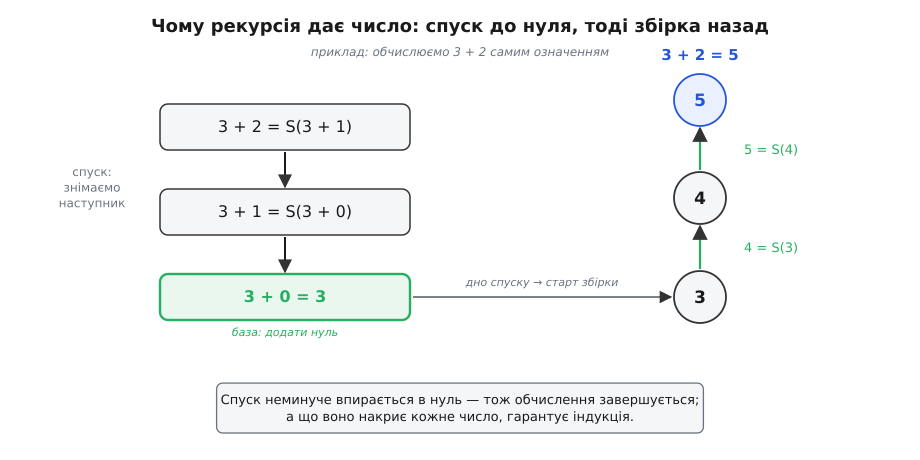
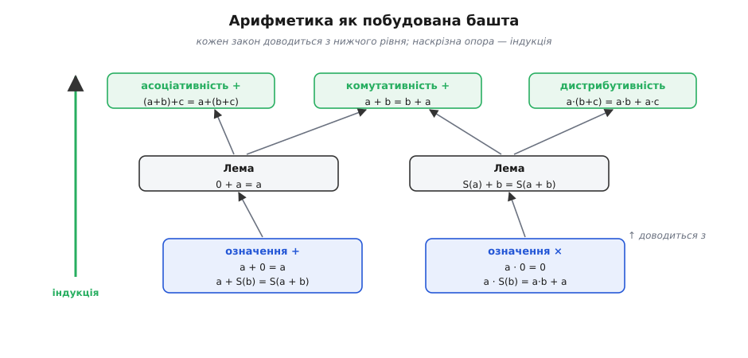
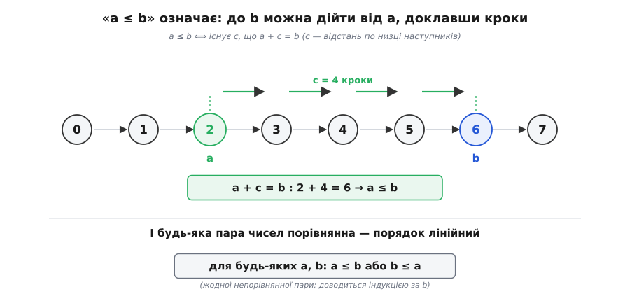

# 🧮 Уся арифметика з наступника й індукції

<preknowlist>
- [Математична індукція](topic:math-logic/mathematical-induction) — база плюс крок валять увесь нескінченний ряд тверджень; це головний робочий інструмент кожного доведення тут.
- [Математичне доведення](topic:math-logic/mathematical-proof) — що означає «довести» твердження і як влаштований доказ від супротивного.
</preknowlist>

У нас на руках майже нічого: нуль, дія «наступник» S, яка від кожного числа дає рівно одне нове, і принцип індукції. Жодного «плюса», жодного «менше», жодної таблиці множення — цього всього ще немає. І ось несподіванка, з якої варто почати: усе перелічене не треба додавати окремими правилами. Додавання, множення, порядок «менше-більше» й **кожен** закон, який ви колись вивчили напам'ять — комутативність, асоціативність, дистрибутивність, — це не нові припущення, а **означення й теореми**, що виводяться з наступника й індукції. Арифметика не постулюється — вона доводиться. Ця замітка й показує, як саме.

Але перш ніж означувати додавання, треба відповісти на питання, яке зазвичай прошмигують не помітивши: а чи **законно** взагалі означувати щось «рекурсією за наступником»? Бо два рядки означення, які ми зараз напишемо, виглядають безневинно — та за їхньою безневинністю ховається теорема, без якої вони були б порожнім звуком.

### Чому рекурсію взагалі можна — теорема про рекурсію

Погляньмо на майбутнє означення додавання ще до того, як його приймемо:

```
a + 0     = a
a + S(b)  = S(a + b)
```

Другий рядок не каже прямо, скільки буде `a + b`. Він каже інше: як `a + S(b)` пов'язане з меншим `a + b`. Щоб дістати справжнє число, доводиться **розкручувати** цей зв'язок, аж поки другий доданок не спаде до нуля:

```
a + 3 = S(a + 2) = S(S(a + 1)) = S(S(S(a + 0))) = S(S(S(a)))
```

Розкручування спиняється, бо другий доданок щокроку втрачає один наступник і мусить урешті впертися в нуль — нижче падати нема куди, під нулем чисел немає. Дуже схоже на рекурсивну функцію в коді, що зводить задачу до простішої, поки не дійде до базового випадку. І тут-таки виринають два неспокійні питання, які легко проґавити.

Перше: а чи **існує** взагалі функція, що задовольняє обидва рядки? Може, рецепт десь суперечить сам собі — вимагає для того самого входу двох різних значень? Друге: якщо існує, то чи вона **єдина** — чи не задовольняють ці рівняння відразу кілька різних функцій, і тоді «додавання» невизначене? Поки на це немає відповіді, два рядки — лише побожне побажання, а не означення.

Відповідь дає **теорема про рекурсію**. У загальному вигляді вона каже так: дайте мені якесь **початкове значення** (куди піти при нулі) і **правило кроку** (як із результату для *b* дістати результат для S(*b*)) — і тоді існує **рівно одна** функція *f* на всіх натуральних числах, для якої

```
f(0)     = початкове значення
f(S(b))  = правило_кроку( f(b) )
```

Для нашого додавання (при фіксованому *a*) початкове значення — це `a`, а правило кроку — «візьми попередній результат і застосуй до нього S». Теорема обіцяє, що таке додавання є, і воно одне.

Чому функція **існує**? Будуймо її по сходинці. Значення `f(0)` задане прямо. Маючи `f(0)`, правило кроку однозначно диктує `f(1)`. Маючи `f(1)` — так само `f(2)`, і далі. Кожне наступне значення **вимушене** попереднім, вибору немає. А чи накриємо ми так **усі** числа, не лишивши дірок? Саме тут вступає індукція: властивість «на цьому числі *f* уже визначена» є в нуля й разом з кожним *n* переходить на S(*n*) — отже, за принципом [індукції](topic:math-logic/mathematical-induction), *f* визначена **скрізь**. І дірок немає, бо кожне значення продиктоване єдиним попереднім, тож ніде не виникає суперечки «а яке ж тут число».

Чому вона **єдина**? Припустімо, дві функції, *f* і *g*, обидві задовольняють ті самі два рівняння. Тоді `f(0) = g(0)` — обидві дорівнюють початковому значенню. А якщо `f(b) = g(b)`, то `f(S(b)) = правило(f(b)) = правило(g(b)) = g(S(b))`. Отже, властивість «*f* і *g* тут збігаються» є в нуля й переходить з *b* на S(*b*) — знову індукція, і функції збігаються на **всіх** числах. Двох різних додавань бути не може.

> 🔧 **Навіщо це.** Теорема про рекурсію — це ліцензія на **кожне** рекурсивне означення й **кожну** рекурсивну програму. Факторіал, числа Фібоначчі, піднесення до степеня, обхід дерева, будь-яка функція «база плюс крок» — усі вони законні рівно тому, що дає ця теорема: рекурсія будує значення **вперед** (з *f*(*b*) робить *f*(S(*b*))), а індукція засвідчує, що це будування таки досягає **кожного** числа й **рівно один раз**. Це один і той самий принцип, побачений з двох кінців: рекурсія ним **означує**, індукція ним **доводить**. Коли ваша рекурсивна функція «магічно» завершується й дає визначений результат, працює саме ця пара.

Тут доречно віддати належне тим, хто це насправді зробив, бо історію арифметики часто стискають до одного імені. Самі рекурсивні означення `+` і `×` — ті два рядки, що ми пишемо, — вперше подав **Герман Ґрассман** (*Hermann Grassmann*) у «Підручнику арифметики» (*Lehrbuch der Arithmetik*, 1861), і там-таки з них вивів комутативність, асоціативність та дистрибутивність. А першим, хто строго **довів** існування й єдиність рекурсивно означених функцій — тобто саме теорему про рекурсію, — був **Ріхард Дедекінд** (*Richard Dedekind*) у праці «Що таке числа і для чого вони» (*Was sind und was sollen die Zahlen?*, 1888, §125–126); там він означив додавання, множення й степінь і формально довів індукцією їхні закони. Джузеппе Пеано (1889) спирався на обох. Це добре задокументований факт, а не легенда про самотнього генія: означення — від Ґрассмана, обґрунтування рекурсії — від Дедекінда.


*Чому два рядки означення дають справжнє число. Зверху вниз кожен крок знімає з другого доданка один наступник — спуск неминуче впирається в нуль, де спрацьовує база. Тоді результат збирається знизу вгору: 3, потім її наступник 4, потім 5. Рекурсія будує вперед; те, що спуск завжди досягає бази, а значить обчислення завершується, гарантує індукція.*

### Додавання: два рядки — і вся асиметрія на видноті

Тепер, коли право на рекурсію здобуто, приймімо означення додавання остаточно:

```
a + 0     = a            (додати нуль — нічого не змінити)
a + S(b)  = S(a + b)     (додати наступного = наступник від суми)
```

Придивімося до однієї деталі, повз яку легко пройти: рекурсія тут іде за **другим** доданком. Означення розбирає на частини `b`, а `a` весь час сидить недоторканим збоку. Ліва й права ролі доданків **не симетричні** — і саме через це комутативність `a + b = b + a`, така очевидна для нас із дитинства, **не** буде очевидною для означення. Її доведеться заслужити доказом. Це перший урок формального підходу: те, що інтуїція подає як безплатне, апарат мусить оплатити.

Одразу випишемо дрібничку, яка знадобиться скрізь. Домовмось, що `1` — це коротке ім'я для S(0). Тоді для будь-якого числа `a`:

```
a + 1 = a + S(0) = S(a + 0) = S(a)
```

Отже, `S(a) = a + 1` — «наступник» і «додати одиницю» це те саме, тепер уже доведено, а не за визначенням. Далі вживатимемо S(*a*) та *a*+1 як синоніми.

### Асоціативність — розминка на самому означенні

Почнімо із закону, що дається легко, бо потребує **лише** означення: асоціативності `(a + b) + c = a + (b + c)`. Дужки можна пересувати, сума не залежить від того, що складати першим. Доводимо індукцією за `c` — саме за тим доданком, якого «торкається» рекурсія.

**Твердження: (a + b) + c = a + (b + c) для всіх c.**
```
База (c = 0):
  (a + b) + 0 = a + b            [означення: + 0]
  a + (b + 0) = a + b            [означення: + 0, всередині]
  → обидві частини дорівнюють a + b. ✓

Крок (від c до S(c)): припускаємо (a + b) + c = a + (b + c).
  (a + b) + S(c) = S((a + b) + c)     [означення: + S(·)]
                 = S(a + (b + c))     [припущення індукції]
                 = a + S(b + c)       [означення: + S(·), назад]
                 = a + (b + S(c))     [означення: + S(·), назад]
  → (a + b) + S(c) = a + (b + S(c)). ✓
```

Вдумаймося, що тут сталося. Ми не перебирали числа й не «підставляли приклади» — ми показали одне міркування про безіменні `a`, `b`, `c` і безіменне `c`-у-кроці, і воно накрило **всю** нескінченну шкалу трійок чисел. Уся робота — акуратно застосувати другий рядок означення вперед і назад та один раз скористатися припущенням. Асоціативність не постульована; вона витекла з форми означення.

### Комутативність — і чому їй потрібні дві леми

Тепер найповчальніше доведення — комутативність `a + b = b + a`. Ось де асиметрія означення дається взнаки: `a + 0 = a` ми маємо задарма (перший рядок), а от `0 + a = a` — **ні**, бо рекурсія за таких доданків не запускається, і це доведеться доводити окремо. Спершу дві підготовчі леми (допоміжні твердження), кожна — індукцією.

**Лема 1: 0 + a = a для всіх a.** (Нуль зліва теж нічого не міняє — але це вже теорема.)
```
База (a = 0):  0 + 0 = 0              [означення: + 0]. ✓
Крок:  припускаємо 0 + a = a.
  0 + S(a) = S(0 + a)                 [означення: + S(·)]
           = S(a)                     [припущення індукції]. ✓
```

**Лема 2: S(a) + b = S(a + b) для всіх b.** (Наступник у лівому доданку можна винести назовні — знову доводимо, бо означення про лівий доданок мовчить.)
```
База (b = 0):
  S(a) + 0 = S(a)                     [означення: + 0]
  S(a + 0) = S(a)                     [означення: + 0]. ✓
Крок:  припускаємо S(a) + b = S(a + b).
  S(a) + S(b) = S(S(a) + b)           [означення: + S(·)]
              = S(S(a + b))           [припущення індукції]
              = S(a + S(b))           [означення: + S(·), назад]. ✓
```

Маючи ці дві леми, комутативність падає в руки. Доводимо індукцією за `b`.

**Твердження: a + b = b + a для всіх a, b.**
```
База (b = 0):
  a + 0 = a                           [означення: + 0]
  0 + a = a                           [Лема 1]
  → a + 0 = 0 + a. ✓

Крок:  припускаємо a + b = b + a.
  a + S(b) = S(a + b)                 [означення: + S(·)]
           = S(b + a)                 [припущення індукції]
           = S(b) + a                 [Лема 2, назад: S(b)+a = S(b+a)]
  → a + S(b) = S(b) + a. ✓
```

Погляньте, як три індукції склалися в башточку: Лема 1 і Лема 2 стоять на самому означенні, а комутативність стоїть на них. Жодна з трьох не «очевидна» для апарата — кожну довелося виснувати, і кожна спиралася на попередню. Те, що для людини є одним поглядом («ну звісно, від переставлення сума не міняється»), для формальної системи є маленькою вежею доведень. У цьому й полягає чесність підходу: ми бачимо **ціну** кожного звичного закону.


*Арифметика як побудована споруда, а не набір припущень. Унизу — самі означення `+` і `×` (по два рядки). Над ними стоять леми (нуль зліва, винесення наступника), а вже на лемах — закони: асоціативність, комутативність, дистрибутивність. Стрілка «доводиться з» показує, хто на чому тримається; наскрізна опора всієї башти — принцип індукції.*

### Множення й дистрибутивність

Множення означують так само — рекурсією за другим множником, тільки крок тепер не «застосувати наступник», а «додати ще одне `a`»:

```
a · 0     = 0            (помножити на нуль — нуль)
a · S(b)  = a · b + a    (ще один множник = попередній добуток плюс a)
```

Це формальний запис думки «множення — це багаторазове додавання»: `a · 3` розкрутиться в `a · 2 + a`, тоді `a · 1 + a + a`, тоді `a · 0 + a + a + a`, тобто `0 + a + a + a` — рівно три доданки `a`. Зверніть увагу, що означення множення **спирається** на вже готове додавання: у правому рядку стоїть `+`. Башта росте далі — множення неможливе без попередньо збудованого додавання.

Швидка перевірка, що множення на одиницю не псує числа:

```
a · 1 = a · S(0) = a · 0 + a = 0 + a = a     [означення ×, тоді Лема 1]
```

Тепер закон, заради якого множення й додавання взагалі уживаються разом, — **дистрибутивність** `a · (b + c) = a · b + a · c`. Він каже, що множник можна «роздати» по доданках. Доводимо індукцією за `c`, і в кроці нам знадобиться вже доведена асоціативність додавання — башта працює:

**Твердження: a · (b + c) = a · b + a · c для всіх c.**
```
База (c = 0):
  a · (b + 0) = a · b                 [означення: + 0]
  a · b + a · 0 = a · b + 0 = a · b   [означення: ·0, тоді +0]
  → рівні. ✓

Крок:  припускаємо a · (b + c) = a · b + a · c.
  a · (b + S(c)) = a · S(b + c)             [означення: + S(·)]
                = a · (b + c) + a           [означення: · S(·)]
                = (a · b + a · c) + a       [припущення індукції]
                = a · b + (a · c + a)       [асоціативність +]
                = a · b + a · S(c)          [означення: · S(·), назад]
  → a · (b + S(c)) = a · b + a · S(c). ✓
```

Комутативність та асоціативність самого множення (`a · b = b · a` і `(a·b)·c = a·(b·c)`) доводяться тим самим прийомом — двома лемами-сходинками (`0 · a = 0` і `S(a) · b = a · b + b`) і завершальною індукцією, точнісінько як робили з додаванням, лише з опорою вже й на дистрибутивність. Виписувати їх повністю не будемо: механізм той самий, і, раз побачивши його на комутативності додавання, ви відтворите решту як вправу. Головне зрозуміти закон побудови: **кожна** знайома тотожність шкільної арифметики — це теорема, доведена скінченним індуктивним міркуванням із означень, а не заклинання, у яке треба вірити.

### Порядок: «менше» — це «додати кроків»

Лишилося дістати з тих самих цеглинок відношення «менше-більше». Як формально сказати, що `a ≤ b`? Через додавання, і дуже природно:

```
a ≤ b   ⟺   існує таке c, що a + c = b
```

Прочитаймо: `a` не більше за `b` рівно тоді, коли від `a` можна **дійти** до `b`, щось до нього доклавши. У картинці наступника це «`b` стоїть на `c` кроків далі по низці, ніж `a`»; те `c` — відстань між ними. Якщо `c = 0`, числа збігаються; якщо `c` — справжній наступник чогось, то `b` строго більше. Означення сперте на `+`, тобто порядок росте з тієї ж рекурсії, що й усе інше.


*«Менше-рівно» — це відстань по низці. `a ≤ b` означає, що від `a` до `b` можна дійти, доклавши `c` кроків наступника (тут `c = 4`, тож `2 + 4 = 6`, і `a ≤ b`). А внизу — те, що доведемо індукцією: будь-яка пара чисел порівнянна, непорівнянних пар немає, тож порядок виходить лінійним.*

Перевірмо, що це справді **порядок** — тобто поводиться, як належить «менше-рівно». Три властивості.

**Рефлексивність (a ≤ a).** Беремо `c = 0`: тоді `a + 0 = a`, свідок знайшовся. Кожне число не більше за себе. ✓

**Транзитивність (a ≤ b і b ≤ d ⟹ a ≤ d).** Нехай `a + c = b` і `b + e = d`. Тоді, користуючись асоціативністю:
```
a + (c + e) = (a + c) + e = b + e = d
```
отже `c + e` — свідок того, що `a ≤ d`. Відстані просто додаються. ✓

**Антисиметричність (a ≤ b і b ≤ a ⟹ a = b).** Нехай `a + c = b` і `b + d = a`. Тоді `a + (c + d) = a`, тобто `a + (c + d) = a + 0`. Тут потрібні два факти, обидва — наслідки аксіом Пеано. По-перше, **скорочення**: з `a + x = a + y` випливає `x = y` (доводиться короткою індукцією за `a`, спираючись на те, що наступники не зливаються). Скоротивши `a`, дістаємо `c + d = 0`. По-друге, `c + d = 0` змушує обидва бути нулем: якби `d = S(e)`, то `c + d = c + S(e) = S(c + e)` було б наступником, а нуль **ні за ким не стоїть** (аксіома Пеано) — суперечність; отже `d = 0`, і так само `c = 0`. А тоді `b = a + 0 = a`. ✓

Разом ці три властивості означають, що `≤` — **частковий порядок** на числах: він рефлексивний, антисиметричний і транзитивний, як і має бути в чесного «менше-рівно».

### Лінійність і повна впорядкованість

Частковий порядок сам по собі ще допускає **непорівнянні** пари — елементи, з яких жоден не менший за інший (так буває, скажімо, при впорядкуванні за вкладеністю множин). Для натуральних чисел такого не буває: будь-які два числа завжди можна поставити в ряд. Це властивість **лінійності** (або повноти) порядку:

```
для будь-яких a, b:   a ≤ b   або   b ≤ a
```

Її теж треба довести — і, звісно, індукцією. Візьмемо індукцію за `b` (для всіх `a` заразом).

**Твердження: для всіх a, b виконано a ≤ b або b ≤ a.**
```
База (b = 0):
  за Лемою 1, 0 + a = a, тобто a — свідок того, що 0 ≤ a.
  Отже завжди b = 0 ≤ a — права половина «або» правдива. ✓

Крок:  припускаємо, що для всіх a вже маємо (a ≤ b) або (b ≤ a).
  Візьмімо довільне a і розберімо два випадки припущення.
  • Якщо a ≤ b, тобто a + c = b, то a + S(c) = S(a + c) = S(b),
    отже a ≤ S(b). ✓
  • Якщо b ≤ a, тобто b + c = a, дивимося на c:
      – якщо c = 0, то a = b, а тоді a + 1 = S(a) = S(b), тобто a ≤ S(b). ✓
      – якщо c = S(e), то a = b + S(e) = S(b + e) = S(b) + e   [Лема 2],
        отже S(b) ≤ a. ✓
  У кожному випадку a ≤ S(b) або S(b) ≤ a. ✓
```

Отже, `≤` — **лінійний (повний) порядок**: числа шикуються в один нерозривний ряд без непорівнянних пар, точно як їх малює низка наступників. Це не дивно — саме таку рівну нитку без розгалужень і забезпечили аксіоми Пеано.

Та натуральні числа мають ще сильнішу властивість, ніж просто лінійність. У **будь-якій** непорожній множині чисел завжди є **найменший** елемент — не лише в скінченних наборів, а й у нескінченних. Порядок, у якому це так, звуть **цілком упорядкованим**, а саме твердження — [принципом повного впорядкування](topic:math-logic/well-ordering-principle). Він не є ще однією окремою аксіомою: його можна довести з індукції — і, що красиво, назад теж, індукцію можна вивести з нього. Це **дві грані одного каменя**: «дійти до кожного числа від нуля вгору» (індукція) і «не можна нескінченно спускатися вниз» (є найменший, немає нескінченного спуску) — той самий факт, розказаний у два боки.

### Що з цього виростає

Відступімо на крок і гляньмо на всю споруду. Ми почали з нуля, наступника й індукції — і не додали більше **жодної** аксіоми. Теорема про рекурсію дала право означувати рекурсивно; два рядки означили додавання, ще два — множення, одне речення — порядок. А тоді самою лише індукцією ми **довели** асоціативність, комутативність, дистрибутивність і те, що числа цілком лінійно впорядковані. Те, що в школі подають як окремі «правила» на різних сторінках підручника, виявилося кількома теоремами з одного коріння.

І це не абстрактна забавка. Коли ви оголошуєте тип натурального числа з двома конструкторами — «нуль» і «наступник» — а тоді пишете `add` і `mul` двома рядками кожну, ви буквально відтворюєте цю башту в коді, і теорема про рекурсію — це те, що гарантує вашим функціям визначеність і завершення. На тій самій рекурсії стоять доведення правильності програм у формальних системах (Coq, Lean, Agda означують ℕ рівно так). І вся подальша драбина чисел — цілі, раціональні, дійсні — будується надбудовами над цією основою: віднімання й від'ємні числа з'являються, коли додаванню дозволяють «ходити назад», дроби — коли те саме роблять із множенням. Усе тримається на початку, наступнику й індукції.

Найглибший висновок, однак, філософський. Рівність `2 + 2 = 4`, тотожність `a + b = b + a`, звичне «будь-які два числа можна порівняти» — це не самоочевидні істини, дані разом із числами. Це **зароблені** теореми, кожна з яких коштує скінченного індуктивного міркування. Апарат не бере на віру нічого, що можна вивести, — і рівно тому найпростіша арифметика, яку ми знаємо змалку, стоїть на дивовижно небагатьох, але дуже точно припасованих підвалинах.
