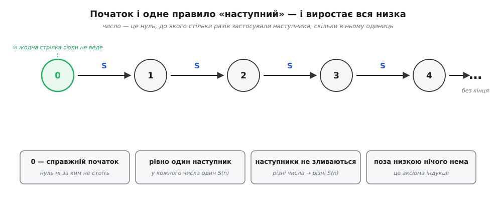
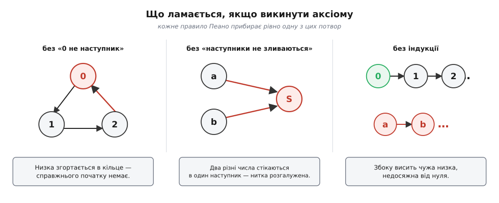
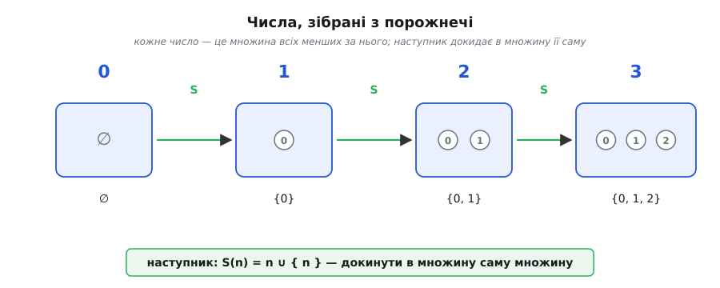

# Натуральні числа

<preknowlist>
- [Математичне доведення](topic:math-logic/mathematical-proof) — що таке аксіома, що означає «довести», і чим аксіома відрізняється від теореми.
- [Теорія множин](topic:math-logic/set-theory) — що таке множина й порожня множина; знадобиться там, де числа будують із самих множин.
</preknowlist>

Спитайте будь-кого, що таке число «три», — і почуєте щось на кшталт «ну, це коли три яблука». Але три яблука — це не число три, це три **яблука**. Три камені — не воно ж саме, і три ноти теж. Число «три» — це те **спільне**, що є в усіх трійок світу й чого немає в жодній двійці чи четвірці. Ми впізнаємо його миттєво, від дитинства, а от сказати, **що** це таке, несподівано важко. Натуральні числа (лат. *naturalis* — «природний»; ті самі 1, 2, 3, … для лічби) — найзнайоміша річ у математиці й водночас одна з найглибших: уся будівля чисел стоїть на них, тож питання «а на чому стоять вони самі?» веде до самих підвалин.

Наївна відповідь — «числа беруться з лічби» — правдива, але не доводить далеко. Порахувати можна пальцями, поки предметів мало; а математика хоче говорити про **всі** числа заразом, зокрема ті, які жодна людина ніколи не полічить. Тому потрібне не оповідання про яблука, а точний опис: що мусить бути правдою про цю нескінченну низку, щоб з неї виросла вся арифметика. І виявляється, для цього не треба знати, **чим** є числа. Досить знати, **як вони влаштовані** — за якими правилами йдуть одне за одним.

### Не предмети, а порядок

Придивімося, що ми насправді робимо, коли лічимо. Ми не витягаємо числа з мішка — ми йдемо **низкою**: один, за ним два, за ним три, і в кожної миті чітко знаємо, яке буде **наступне**. Уся суть натуральних чисел не в тому, які вони, а в тому, що вони вишикувані в одну нескінченну чергу з початком і без кінця.

Розберімо цю чергу на найпростіші цеглинки. По-перше, є **початок** — число, з якого все стартує (назвімо його поки що нулем). По-друге, є дія «взяти наступне»: від будь-якого числа вона дає рівно одне нове. Цю дію звуть **наступником** (англ. *successor*, від лат. *succedere* — «іти слідом»); наступник числа *n* коротко пишуть S(*n*). Ось і все майно: одна відправна точка й одне правило «а далі йде». З них уже видно всю низку — 0, S(0), S(S(0)), S(S(S(0))), — де кожне число є просто нулем, до якого стільки разів застосували наступника, скільки в ньому одиниць. Звичні цифри «1», «2», «3» — лише короткі імена для S(0), S(S(0)), S(S(S(0))).


*Уся низка чисел — це початок і одне правило «наступний». Число — це нуль, до якого певну кількість разів застосували наступника. Чотири підписані вимоги (нуль ні за ким не стоїть, у кожного рівно один наступник, різні числа мають різних наступників, і поза низкою нічого нема) не дають цій нитці ні зациклитися, ні розгалузитися, ні обрости чужими числами.*

Але самої лише пари «початок + наступник» замало: з неї ще можна злити щось потворне — низку, що завертається в кільце, або таку, де два різні числа мають того самого наступника. Щоб вийшли саме натуральні числа, на цю конструкцію треба накласти кілька строгих вимог. Їх сформулювали наприкінці XIX століття, і сьогодні звуть **аксіомами Пеано** (точніше — Дедекінда–Пеано; хто й коли їх насправді виснував — це [окрема, повчальна історія з кількома дійовими особами](topic:math-logic/natural-numbers/hist-peano-axioms.md)).

### П'ять правил, що роблять числа числами

Ось ці вимоги, кожна — усунення однієї конкретної халепи. Домовимось, що починаємо з нуля (чому саме з нього, а не з одиниці, — за мить).

```
1. 0 — натуральне число.               (є з чого починати)
2. У кожного n є наступник S(n),        (низка ніде не уривається)
   і він теж натуральне число.
3. 0 не є наступником жодного числа.    (у низки є справжній початок)
4. Якщо S(a) = S(b), то a = b.          (наступники не зливаються)
5. Індукція: якщо якась властивість є    (поза низкою чисел немає)
   в 0 і разом з кожним n переходить
   на S(n), то вона є в усіх чисел.
```

Перші дві — це просто «початок і наступник», які ми вже маємо. Цікаве починається з третьої. **Третя** забороняє нулю бути чиїмось наступником — без неї низка могла б завернутися в кільце (…→ 2 → 0 → 1 → 2 →…), і «початку» не було б зовсім. **Четверта** каже, що наступник — дія оборотна: якщо у двох чисел той самий наступник, то це одне й те саме число. Без неї дві різні гілки могли б збігтися в одну точку, і низка розгалузилася б, а тоді злилася — знову не та рівна нитка, якої ми хочемо.

А от **п'ята**, індукція, — найтонша й найпотужніша. Перші чотири правила будують нескінченну нитку 0 → 1 → 2 → …, але самі по собі **не забороняють**, щоб десь **збоку** висіла ще одна, чужа нитка чисел, ніяк не з'єднана з нашою й недосяжна від нуля. Аксіома індукції зачиняє ці двері: вона проголошує, що натуральні числа — це **рівно** ті, до яких можна дійти від нуля кроками наступника, і **жодних інших**. Її звична форма — про доведення: коли властивість є в нуля й разом з кожним числом переходить на наступне, вона накриває **всі** числа. Це і є [математична індукція](topic:math-logic/mathematical-induction) — той самий принцип доміно, що валить увесь нескінченний ряд двома скінченними обіцянками. Не випадково: індукція — не теорема **про** натуральні числа, а одна з аксіом, що їх **визначають**. Вона й є формальний запис думки «поза нашою низкою чисел немає».


*Навіщо потрібна кожна аксіома — видно з того, що ламається без неї. Без «нуль ні за ким не стоїть» низка згортається в кільце й губить початок. Без «наступники не зливаються» два різні числа стікаються в одне, і нитка розгалужується. Без індукції поруч із правдивою низкою може висіти чужа, недосяжна від нуля. Кожна аксіома прибирає рівно одну з цих потвор.*

> 🔧 **Навіщо це.** Ці п'ять правил — не філософська забаганка, а робочий фундамент. Коли ви пишете рекурсивну функцію на числі й даєте їй базовий випадок для нуля та крок «звести до попереднього», ви буквально спираєтесь на цю будову: базу дає аксіома 1, спуск до попередника — аксіома 4 (наступник оборотний), а гарантію, що рекурсія **завжди** дійде до бази й зупиниться, — аксіома індукції (нескінченного спуску вниз немає). Тип-натуральне-число з двома конструкторами «нуль» і «наступник» — це та сама аксіоматика, тільки записана як структура даних.

### З цих правил виростає вся арифметика

Найкраще правила показують себе в тому, що з них справді **виводиться** знайома арифметика — не постулюється окремо, а виростає з наступника й індукції. Візьмімо додавання. Його означують двома рядками — через те саме «а що з наступником»:

```
a + 0      = a               (додати нуль — нічого не змінити)
a + S(b)   = S(a + b)        (додати наступного = наступний від суми)
```

Прочитаймо другий рядок: «*a* плюс наступник *b*» — це «наступник від *a* плюс *b*». Він зводить додавання більшого до додавання меншого, аж поки другий доданок не спаде до нуля, де спрацює перший рядок. Порахуймо так 2 + 2, пам'ятаючи, що 2 — це S(S(0)):

**Умова: обчислити 2 + 2 за самим лише означенням.**
```
2 + 2 = 2 + S(1)  = S(2 + 1)          [другий рядок: винесли наступник]
2 + 1 = 2 + S(0)  = S(2 + 0)          [ще раз той самий крок]
2 + 0 = 2                              [перший рядок: додавання нуля]
```
Тепер збираємо назад, знизу вгору: 2 + 0 = 2, отже 2 + 1 = S(2) = 3, отже 2 + 2 = S(3) = 4. Ми ніде не «знали наперед», що два і два — чотири; ми **вивели** це, крутячи два рядки означення. Так само через наступника означують множення (`a·0 = 0`, `a·S(b) = a·b + a`), а тоді **індукцією** доводять, що додавання й множення справді комутативні, асоціативні, розподільні — усі звичні закони. [Як саме з двох рядків народжуються + і ×, порядок «менше-більше» й доведення їхніх законів](topic:math-logic/natural-numbers/math-recursive-arithmetic.md) — окрема тема, але суть уже видно: уся арифметика — це надбудова над початком і наступником.

### Нуль чи одиниця — і чому це не сварка

Уважний читач помітив, що ми весь час починали з нуля, тоді як лічити нас учили з одиниці. Тут криється давня незгода. Сам Джузеппе Пеано, публікуючи аксіоми 1889 року, починав натуральні числа з **одиниці**; на нуль він перейшов згодом, у виданнях свого «Формуляра» близько 1898-го. Донині традиції розділені: у теорії чисел і в шкільній традиції часто беруть {1, 2, 3, …}, а в теорії множин, логіці й інформатиці — {0, 1, 2, 3, …}. Стандарт ISO 80000-2 і школа Бурбакі стали на бік нуля.

Важливо ось що: це не суперечка про **істину**, а вибір **зручної відправної точки**. Структура — початок, наступник, індукція — від цього не міняється ні на йоту; зсувається лише те, як назвати перше число. Математик просто на початку тексту домовляється, що в нього означає «натуральне», — і працює далі. У програмуванні нуль зазвичай природніший: індекси масивів, зміщення в пам'яті, залишки від ділення — усе це рахується від нуля, тож брати нуль за перше число просто менше додає плутанини на межах.

### З чого ж числа зроблені насправді

Ми домовились, що для арифметики досить знати **структуру** й байдуже, **чим** є числа. Але математиків це «байдуже» довго муляло: якщо вся математика мала стояти на надійному фундаменті — на теорії множин, — то й числа хотілося не залишати чарівними атомами, а **побудувати** з чогось іще базовішого. З чого будувати, коли нічого немає? З самого «нічого» — з порожньої множини.

Найвживаніша побудова належить Джону фон Нейману (1923). Ідея зухвало проста: **кожне число — це множина всіх менших за нього чисел**. Тоді нуль, менших за якого немає, — це порожня множина ∅. Одиниця — множина, де лежить сам нуль. Двійка — множина з нуля й одиниці. І так далі:

```
0 = ∅                       (порожня множина — менших немає)
1 = {0} = {∅}
2 = {0, 1} = {∅, {∅}}
3 = {0, 1, 2}
S(n) = n ∪ {n}              (наступник: додати до множини її саму)
```

Гляньте на останній рядок — це наступник, зібраний із самих множин: щоб дістати наступне число, беремо множину *n* і докидаємо в неї ще один елемент — саме *n*. Число «три» тут буквально містить у собі три елементи (0, 1, 2), тож «скільки в числі елементів» і є саме число — лічба вбудована в конструкцію. Фокус у тім, що ми не припустили **жодного** числа наперед: усе виросло з порожньої множини та дії об'єднання.


*Числа, зібрані з порожнечі. Нуль — порожня множина. Кожне наступне число — це множина всіх попередніх, тож коробки вкладаються одна в одну, і в числі рівно стільки елементів, яке воно саме. Наступник — просто «докинути в множину її саму». Жодного числа не припущено наперед: усе тримається на ∅.*

І тут-таки виринає філософська пастка. Фон Нейманова побудова — не єдина. Ернст Цермело ще 1908-го будував числа інакше: 0 = ∅, а далі кожне наступне — це множина, де лежить лиш попереднє (1 = {∅}, 2 = {{∅}}, вкладені матрьошки). Обидві конструкції дають щось, що бездоганно поводиться як натуральні числа, — але «двійка» в них це **різні** множини. То яка ж із них є «справжня» двійка? Правильна відповідь, яку чітко висловив філософ Пол Бенасерраф (1965): **ніяка й обидві**. Питання «чим є число два насправді» — хибне. Число — це не якийсь конкретний предмет, а **роль** у структурі: «те, що стоїть третім від початку, після нуля й одиниці». Будь-яка система об'єктів, що виконує аксіоми Пеано, годиться однаково добре; яку взяти за модель — питання зручності, а не істини. Ми повернулися туди, з чого почали: важлива структура, а не матеріал.

### Один опис — чи все ж лазівка?

Наостанок — тонкість, яку варто бодай побачити. Коли аксіому індукції формулюють у повній силі (як твердження про **всі можливі властивості**), вона прибиває натуральні числа намертво: Дедекінд довів, що будь-які дві системи, які їй задовольняють, по суті **однакові** — між ними є досконала відповідність. Одна структура, з точністю до перейменування.

Та коли ту саму аксіоматику ослабити до вужчої, «першопорядкової» мови (де про властивості можна говорити лише обмежено — так роблять, коли хочуть, щоб з правил можна було механічно доводити теореми), — намертво прибити вже не виходить. Торальф Скулем 1933-го показав, що тоді поряд зі звичними числами тихо оселяються **нестандартні** — чужі «числа», більші за будь-яке звичайне, які проте формально задовольняють усі ті самі правила. Це не помилка й не парадокс, а глибокий факт: скінченним набором формул першого порядку **неможливо** описати натуральні числа так, щоб не пролізли самозванці. Та сама п'ята аксіома, що в повній силі не пускала чужі низки збоку, у послабленій мові вже не всесильна. Для повсякденної арифметики це нічого не міняє — але це одна з тих щілин, крізь яку видно, які глибокі підвалини ховаються під найпростішими 1, 2, 3.

### Числа як структура даних

Найкраще все це відчути, зібравши натуральне число з нічого просто в коді. Мова, де така конструкція виглядає майже як самі аксіоми, — Haskell: тип із двома конструкторами, «нуль» і «наступник».

```haskell
data Nat = Z | S Nat        -- число — це або нуль, або наступник числа

add :: Nat -> Nat -> Nat
add a Z     = a             -- a + 0 = a
add a (S b) = S (add a b)   -- a + S(b) = S(a + b)
```

Погляньте, як точно тип `Nat` повторює аксіоми: `Z` — це аксіома «є нуль», `S Nat` — «у кожного є наступник», а те, що конструктори різні, дає й «нуль не наступник», і «наступники не зливаються». Функція `add` — це буквально ті два рядки означення додавання, перенесені без змін; `S (S Z)` — це двійка, зібрана з наступників нуля. Жодних вбудованих чисел машини ми не чіпали — усе виросло з двох конструкторів, точнісінько як математичні числа виростають з нуля й наступника. [Як зобразити такі «числа Пеано» в кількох мовах, і чому вони прекрасні на папері, але непрактичні в залізі](topic:math-logic/natural-numbers/proj-peano-numbers.md) — окрема замітка; головне тут — що аксіоми й тип даних це те саме, сказане двома мовами.

---

Отже, **натуральні числа** — це не про яблука й не про конкретні предмети, а про **порядок**: є початок і є одне правило «наступний», з яких породжується вся нескінченна низка. П'ять аксіом Пеано (Дедекінда–Пеано) роблять цю низку саме такою, як треба: у неї є справжній початок (нуль ні за ким не стоїть), вона не розгалужується (наступники не зливаються), і поза нею немає чужих чисел (індукція). З цих правил **виводиться** вся звична арифметика — додавання й множення означують через наступника, а їхні закони доводять індукцією. Починати з нуля чи з одиниці — питання зручності, не істини; чим саме є числа «насправді» (вкладеними множинами фон Неймана чи чимось іще) — теж, бо число є **роллю** в структурі, а не окремим предметом. А під усім цим ховається несподівана глибина: скінченними правилами першого порядку натуральні числа не пришпилити без нестандартних самозванців — нагадування, що навіть найпростіші 1, 2, 3 стоять на дуже неочевидному фундаменті.
