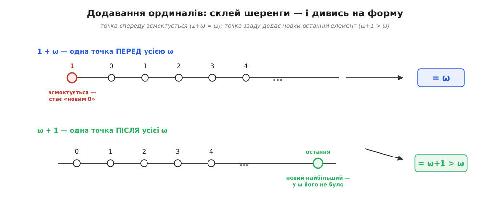
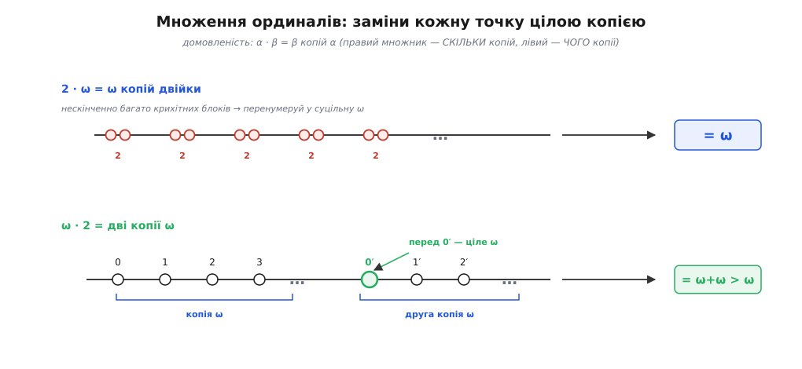
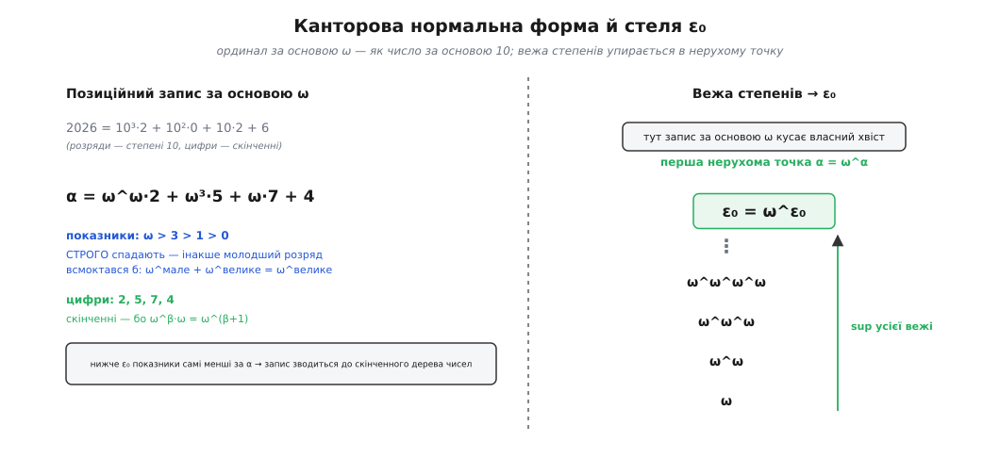

# 🧮 Арифметика ординалів: конкатенація, добуток порядків і нормальна форма

<preknowlist>
- [Принцип повного впорядкування](root:math-logic/well-ordering-principle) — цілком упорядкована множина: у кожній непорожній її частині є найменший елемент. Ординали живуть саме тут, і вся арифметика мусить із цієї множини не випадати.
- [Математична індукція](root:math-logic/mathematical-induction) — база плюс крок «від n до наступного». Означення нижче йдуть рекурсією за цим самим кроком, лише продовженим за нескінченність.
- [Натуральні числа](root:math-logic/natural-numbers) — звична скінченна арифметика +, ·, степінь, яку ординали розширюють; на скінченних числах вони мусять збігтися з нею до останньої коми.
</preknowlist>

Маючи на руках ω, ω+1, ω·2, важко втриматися від спокуси рахувати ними, як звичайними числами. І рахувати справді можна — але спершу варто спитати чесне питання: а звідки взагалі беруться правила? Для натуральних чисел додавання доводиться означувати рекурсією й доводити його закони; чи не доведеться й тут вигадувати аксіоми та сподіватися, що вони не суперечать одна одній?

Виявляється, вигадувати нічого не треба. Ординал — це **форма** цілком упорядкованої шеренги, і як тільки ми це прийняли, арифметика вже **задана** самим цим означенням, її лишається тільки прочитати. Що може означати «додати дві форми порядку»? Рівно одне: постав одну шеренгу за одною й подивись на форму цілого. Що значить «помножити»? Заміни кожну точку однієї шеренги цілою копією другої. Ми не постулюємо `+` і `·` — ми їх **читаємо з порядку**. А тоді, дочитавши, з подивом бачимо, що звичні шкільні закони частиною ламаються — не тому, що хтось так вирішив, а тому, що складати форми — дія по суті **несиметрична**.

### Додавання — постав шеренги одну за одною

Візьмімо два ординали, α і β, тобто дві цілком упорядковані множини, взяті кожна у своїй формі. Щоб їх **додати**, зробімо єдине природне: покладімо копію α, а **за нею**, суцільно, копію β — так, щоб кожен елемент α стояв **перед** кожним елементом β. Форма цієї склеєної шеренги і є **α + β**.

```
α + β :   ●─●─●─ ⋯ ─●   ●─●─●─ ⋯     ← спершу вся α, тоді вся β
          └── копія α ──┘ └─ копія β ─┘
```

Перше, що треба перевірити: а чи це взагалі законний ординал — чи склейка лишилася **цілком упорядкованою**? Так, і причина проста. Візьмімо будь-яку непорожню частину склейки й пошукаймо в ній найменший елемент. Якщо в цій частині є бодай щось із копії α — беремо найменше з α-шматка (він цілком упорядкований, найменше там є), і воно менше за все з β, бо вся α стоїть перед β. Якщо ж α-шматок порожній — уся частина сидить у β, а там найменше теж є. Отже, найменший знаходиться завжди, склейка [цілком упорядкована](root:math-logic/well-ordering-principle), і **α + β** — справжній ординал.

Той самий припис можна записати рекурсією за **правим** доданком, точнісінько як для натуральних чисел, лише з новим, третім рядком для границь:

```
α + 0      = α                          (додати порожнє — нічого не змінити)
α + (β+1)  = (α + β) + 1                 (наступник: доклади одну точку в кінець)
α + λ      = sup { α + β : β < λ }       (границя: збери все, що доклав досі)
```

Придивіться, де тут працює рекурсія: означення розбирає на частини **правий** доданок β, а лівий α весь час сидить недоторканим збоку. Ця асиметрія — не дрібниця оформлення; за мить вона обернеться на найдивовижнішу властивість усієї теми.

Перевірмо арифметику на найпростішому досліді — на одиниці зліва й справа від ω.

**Умова: чим різняться ω + 1 і 1 + ω?**
```
ω + 1 :   0, 1, 2, 3, …            ●      ← вся ω, а ЗА нею одна точка
                              (нова остання)

1 + ω :   ●   0, 1, 2, 3, …               ← одна точка, а ЗА нею вся ω
        (перша)
```

Гляньмо на **ω + 1**. Ми доклали одну точку в кінець натурального ряду. У неї попереду — вся нескінченність 0, 1, 2, …, і вона тепер **найбільша**: далі нікого. А в самої ω найбільшого елемента немає (за кожним числом є більше). Форма з останнім елементом і форма без нього — різні: ізоморфізм порядків зберігає «є найбільший — немає найбільшого». Отже **ω + 1 ≠ ω**, і оскільки ω лежить усередині ω + 1 як початковий шматок, маємо **ω + 1 > ω**. Одна точка ззаду таки збільшила форму.

Тепер **1 + ω** — і ось де підступ. Ми поставили одну точку, а за нею весь натуральний ряд. Перенумеруймо склейку зліва направо: передня точка хай буде «нова 0», перше число ω-хвоста — «нова 1», друге — «нова 2», і так далі. Дістали ту саму форму 0, 1, 2, 3, … без останнього елемента, у якій кожен має скінченно багато попередників. Це **знову ω**:

```
1 + ω = ω
```

Одна точка **спереду** просто всоталася в нескінченність, що за нею, і форма не змінилася ні на йоту. А та сама точка **ззаду** дала нову, більшу форму. Звідси разючий висновок:

```
1 + ω  =  ω  ≠  ω + 1
```

Додавання ординалів **не переставне**. Від порядку доданків результат залежить, і залежить драматично: злитися в ніщо чи додати цілий новий рівень.

### Чому саме лівий доданок всмоктується

Констатувати «не переставне» мало — цікаво зрозуміти, **чому** зникає завжди лівий, а не правий. Тут ховається одна з найкрасивіших причин у всій темі, і корінь її — у тому, як улаштована границя.

Пригадаймо, що ω — це не наступник, а **границя**: ω = sup {0, 1, 2, …}, тобто найменший ординал, більший за всі скінченні. Тепер порахуймо 1 + ω чесно, за третім рядком означення, бо ω — границя:

```
1 + ω = sup { 1 + n : n < ω }        [границя: беремо супремум того, що нижче]
      = sup { 1 + 0, 1 + 1, 1 + 2, … }
      = sup { 1, 2, 3, … }           [для скінченних 1 + n = n + 1, звична арифметика]
      = ω
```

Ось воно. Коли правий доданок — границя, додавання **пропускає ліве число всередину** супремума, і там, серед скінченних, той нещасний «+1» лише зсуває нумерацію на крок, а супремум від зсунутого ряду — все та сама ω. Ліве число не встигає нічого змінити, бо його наздоганяє й переганяє нескінченний хвіст справа.

А з **ω + 1** такого не станеться: тут границя стоїть **зліва**, вже завершена, а справа — звичайний наступник, який за означенням просто докладає точку в кінець. Жодного супремума, жодного всмоктування — чистий приріст.

Тепер видно загальний закон: **усе скінченне (і не лише скінченне) зліва від досить високої границі зникає**. Не тільки одиниця:

```
5 + ω  = sup { 5 + n : n < ω } = sup { 5, 6, 7, … } = ω
ω + ω² = sup { ω + ω·n : n < ω } = sup { ω·(1+n) : n } = sup { ω·1, ω·2, ω·3, … } = ω²
```

У другому рядку ω² — теж границя (ω² = sup ω·n), тож ліва ω так само провалюється всередину супремума й тоне: додати ω перед ω² — все одно що не додати нічого. Лівий доданок всмоктується щоразу, коли правий доростає границею **щонайменше до нього**.



*Чому зліва всмоктує, а справа росте. Ставимо копію лівого доданка, за нею — копію правого. Точка спереду просто перенумеровується разом із нескінченним хвостом і зникає у формі ω. Точка ззаду стає новим найбільшим елементом, якого в ω не було, — і форма більшає.*

### Множення — заміни кожну точку цілою копією

Додавання склеїло дві шеренги. **Множення** робить сміливіше: бере праву шеренгу β і **кожну її точку роздуває в цілу копію** лівої шеренги α. Форма цього — **α · β**. Домовленість, повз яку легко спіткнутися: правий множник каже, **скільки** копій, лівий — **чого** копії. Тобто α · β — це «β копій α, поставлених одна за одною».

Формально це **лексичний добуток**: беремо всі пари (b, a), де b з β, а a з α, і впорядковуємо їх спершу за зовнішнім b, а за однакового b — за внутрішнім a:

```
(b, a) < (b′, a′)   ⟺   b < b′   або   (b = b′  і  a < a′)
```

Зовнішня координата — головна («у якій копії»), внутрішня — другорядна («де в копії»). Рекурсивний запис, знову за правим множником, спирається на вже готове додавання:

```
α · 0      = 0
α · (β+1)  = α · β + α                   (ще одна копія α докладається в кінець)
α · λ      = sup { α · β : β < λ }       (границя)
```

Повторімо на множенні той самий дослід, що й на додаванні, — ω і двійка з двох боків.

**Умова: чим різняться ω · 2 і 2 · ω?**

Спершу **ω · 2** — «дві копії ω». Кладемо ω, за нею ще одну ω:

```
ω · 2 = ω + ω :   0,1,2,…   0′,1′,2′,…        ← дві нескінченні копії поспіль
                  └ копія ω ┘└ копія ω ┘
```

Це та сама форма, що ми вже знаємо, — ω + ω. Друга копія починається з точки 0′, у якої **нескінченно багато** попередників: уся перша ω стоїть перед нею. Сама форма довша за ω, тож **ω · 2 = ω + ω > ω**.

Тепер **2 · ω** — «ω копій двійки». Кладемо блок із двох точок, за ним ще такий блок, і так нескінченно:

```
2 · ω = sup { 2 · n : n < ω } :   ●● ●● ●● ●● …    ← ω блоків по дві точки
      = sup { 2·0, 2·1, 2·2, … } = sup { 0, 2, 4, … } = ω
```

Розгорнімо ланцюжок блоків у суцільний ряд: перший блок дає точки 0, 1, другий — 2, 3, третій — 4, 5, … Кожна точка має скінченно багато попередників, останнього елемента немає — це знову **ω**. Двійка зліва, помножена на нескінченність справа, розчинилася безслідно:

```
2 · ω  =  ω  ≠  ω · 2  =  ω + ω
```

Причина — та сама, що й у додаванні, і бачити її корисно двічі. `2 · ω` рахується як границя, тож ліва двійка провалюється всередину супремума `sup {2·n}` і там нічого не важить: подвоєні скінченні числа — все ті самі скінченні числа, їхній супремум — ω. А `ω · 2` — наступниковий випадок (`2 = 1+1`), чистий приріст `ω·1 + ω`, ніякого супремума. **Лівий множник всмоктується границею справа** — точнісінько як лівий доданок.



*α·β — це β копій α. Ліворуч 2·ω: нескінченно багато крихітних блоків по дві точки перенумеровуються в суцільну ω. Праворуч ω·2: лише дві копії, але кожна нескінченна, тож форма доростає до ω+ω. Мала α зліва тоне, багато копій справа — розганяють.*

Що ж із законів **вціліло**? Асоціативність — і додавання, і множення: `(α+β)+γ = α+(β+γ)` та `(α·β)·γ = α·(β·γ)` виконуються завжди, склеювати й роздувати шеренги можна в будь-якому групуванні. Уціліла й **ліва** дистрибутивність:

```
α · (β + γ)  =  α · β  +  α · γ            ✓ завжди
```

бо роздути точки склейки β+γ — все одно що роздути β, тоді γ, і склеїти результати. А от **права** дистрибутивність гине разом із переставністю. Найкоротший контрприклад — знову двійка й ω:

```
(1 + 1) · ω  =  2 · ω  =  ω
 1·ω + 1·ω   =  ω + ω  =  ω · 2
       ω  ≠  ω · 2
```

Ліворуч множник роздав себе по нескінченному ряду й усмоктався, праворуч ми встигли розкрити дужки до того — і дістали різні форми. Переносити шкільні тотожності сюди наосліп — певний спосіб помилитися.

### Піднесення до степеня

Раз є множення, є й **степінь** — рекурсія тепер за показником, а крок замість «доклади копію» робить «домнож іще раз на основу»:

```
α^0      = 1
α^(β+1)  = α^β · α
α^λ      = sup { α^β : β < λ }        (границя, для α ≥ 1)
```

На скінченних це звичне піднесення: `ω^2 = ω·ω`, `ω^3 = ω·ω·ω`, і `ω^(m+n) = ω^m · ω^n`, як належить степеням. Цікаве починається на границях, і тут на нас чекає той самий фокус зі всмоктуванням — але тепер уже основи. Порахуймо `2^ω`:

```
2^ω = sup { 2^n : n < ω } = sup { 1, 2, 4, 8, 16, … } = ω
```

Основа-двійка, піднесена до нескінченного показника, дає лише **ω** — те саме, що дали `2·ω` і `1+ω`. Скінченна (і будь-яка мала) основа зліва тоне в границі показника справа: `n^ω = ω` для кожного скінченного `n ≥ 2`. А от `ω^ω` — уже незмірно більше:

```
ω^ω = sup { ω^n : n < ω } = sup { ω, ω², ω³, … }
```

Тут корисно на мить побачити, **що** таке `α^β` як форма порядку, бо це дає несподіване прозріння. `ω^ω` — це форма множини **скінченних послідовностей натуральних чисел** (точніше — функцій з ω в ω, що з якогось місця стають нулем), упорядкованих порівнянням на найстаршій позиції, де вони різняться. Простіше кажучи, ординал, менший за `ω^ω`, — це те саме, що **многочлен від ω з натуральними коефіцієнтами**, як-от `ω³·5 + ω·2 + 7`. Скінченно багато «цифр» — тому вся ця величезна форма лишається [зліченною](root:math-logic/countable-sets): точок у ній рівно стільки ж, скільки натуральних чисел. (Порівняйте з **кардинальним** степенем `2^ℵ₀`, який дає вже незліченну потужність континууму, — ще одне місце, де порядок і кількість розходяться: ординальне `2^ω = ω` крихітне, кардинальне `2^ℵ₀` велетенське.)

Ця думка — «ординал як число, записане цифрами за основою ω» — і є ключ до того, як узагалі наводять лад у цьому звіринці форм.

### Один закон, що пояснює все: нормальні функції

Ми тричі побачили те саме диво: `1 + ω = ω`, `2 · ω = ω`, `2^ω = ω` — ліве всмоктується, коли праве доростає границею. Тричі та сама причина — «границя справа рахується супремумом, і ліве тоне всередині». Настав час назвати цю причину одним словом, бо вона керує геть усією арифметикою ординалів.

Зафіксуймо ліве число і дивімося на операцію як на **функцію правого аргументу**. Скажімо, `f(ξ) = α + ξ` при сталому α. Ця функція має дві прикмети:

- вона **строго зростає**: якщо ξ < η, то α + ξ < α + η (довша права шеренга — довша склейка);
- вона **неперервна знизу**: на кожній границі λ значення дорівнює супремуму значень під нею, `f(λ) = sup { f(ξ) : ξ < λ }` — це буквально третій рядок означення.

Функцію ординалів, що заразом строго зростає й неперервна знизу, називають **нормальною**. І `α + ξ`, і `α · ξ` (при α ≥ 1), і `α^ξ` (при α ≥ 2) — усі нормальні за своїм **правим** аргументом. Ось де захована вся слухняність арифметики: справа операції поводяться взірцево — рівно, безстрибково, передбачувано.

А тепер гляньмо на ту саму операцію як на функцію **лівого** аргументу — `g(ξ) = ξ + α` при сталому α. Вона нормальність втрачає. Візьмімо `g(ξ) = ξ + 1`: на границі ω маємо `sup { n + 1 : n < ω } = ω`, а `g(ω) = ω + 1 ≠ ω`. Функція **стрибнула** на границі — неперервність знизу зламалася. І строге зростання теж кульгає: `0 + ω = 1 + ω = ω`, різні входи дали однаковий вихід.

Ось і вся розгадка, з одного кореня:

- **Непереставність і всмоктування зліва** — бо зліва операція не неперервна: на границі справа супремум «дожовує» будь-яке скінченне ліве число, а на границі зліва такого захисту немає.
- **Лівостороння неперервність** (те, що границю правого аргументу операція проносить крізь себе як супремум) — це і є нормальність справа, дослівно.

Тримаючи в голові одне слово «нормальна функція справа», ви передбачите поведінку будь-якого виразу, не рахуючи його.

> 🔧 **Навіщо це.** Нормальні функції — не термінологічна оздоба, а робочий інструмент. Кожна нормальна функція `f` має **нерухомі точки** — ординали з `f(α) = α`, — і то скільки завгодно високо: беручи `α, f(α), f(f(α)), …` і збираючи супремум, завжди дістаєш точку, яку `f` уже не зрушить. Саме цей факт за хвилину подарує нам ε₀ — стелю, до якої дотягується весь звичний запис ординалів. Так абстрактна прикмета «зростає й неперервна» обертається на конкретну межу, об яку спотикається нотація.

### Скоротність

У строгого зростання справа є ще один цінний наслідок — **лівостороння скоротність**. Якщо функція `ξ ↦ α + ξ` строго зростає, то вона й **різнозначна**: різні ξ дають різні `α + ξ`. А з різнозначності негайно:

```
якщо  α + β = α + γ,  то  β = γ            (скорочення лівого доданка)
якщо  α · β = α · γ  і  α > 0,  то  β = γ   (скорочення лівого множника)
```

Спільне ліве число можна викреслити з обох боків рівності — як у звичайній алгебрі. А от **справа** скорочувати не можна, і ми вже знаємо чому: `0 + ω = 1 + ω`, але `0 ≠ 1`; `1 · ω = 2 · ω`, але `1 ≠ 2`. Правий доданок чи множник, потрапивши під границю, губить сліди того, що стояло зліва, — і відновити його неможливо. Скоротність, як і все тут, працює рівно з того боку, з якого операція нормальна.

### Канторова нормальна форма — позиційний запис за основою ω

Ми маємо додавання, множення, степінь — і цілий хаос форм, що з них громадяться. Чи є лад? Є, і напрочуд знайомий. Пригадаймо, як ми записуємо звичайні числа: `2026` — це насправді `10³·2 + 10²·0 + 10·2 + 6`, розклад за степенями десятки з цифрами-коефіцієнтами. **Канторова нормальна форма** робить те саме для ординалів, лише основою бере не 10, а ω.

Теорема (її довів Ґеорґ Кантор): кожен ординал `α > 0` записується **єдиним** способом як

```
α = ω^β₁·c₁ + ω^β₂·c₂ + … + ω^βₖ·cₖ
```

де показники — ординали `β₁ > β₂ > … > βₖ ≥ 0` строго спадають, а коефіцієнти `c₁, …, cₖ` — додатні **скінченні** числа. Це буквально позиційний запис за основою ω: `ω^βᵢ` — «розряди», `cᵢ` — «цифри». Ось приклад:

```
α = ω^ω·2 + ω³·1 + ω·5 + 8
```

Показники `ω > 3 > 1 > 0` спадають, цифри `2, 1, 5, 8` скінченні — форма законна й однозначна.

Чому запис саме такий, а не інакший, підказує вся попередня арифметика. Спад показників `β₁ > β₂ > …` — не примха, а **необхідність**: якби менший розряд стояв перед більшим, менший всмоктався б, бо `ω^мале + ω^велике = ω^велике` (ліве всмоктування!). Лад «від старшого до молодшого» — єдиний, у якому нічого не тоне. А скінченність цифр — з того, що `ω^β·ω = ω^(β+1)`: набравши ω однакових розрядів, ви просто піднімаєте показник, тож більш ніж скінченну цифру тримати в одному розряді немає сенсу.

Ця форма перетворює арифметику на **механічний рахунок цифр**, як стовпчиком. Додати два ординали в нормальній формі — виписати обидва й повикидати з лівого всі розряди, менші за старший розряд правого (вони всмокчуться), а рівний старшому — злити цифрами:

**Умова: скласти ω²·3 + ω·5 + 2  та  ω·4 + 7.**
```
старший розряд правого доданка — ω¹.
у лівому: ω²·3 стоїть ВИЩЕ за ω¹ — лишається;
          ω·5 стоїть рівно на ω¹ — цифри зливаються: 5 + 4 = 9;
          вільне 2 стоїть НИЖЧЕ за ω¹ — всмоктується (2 + ω·4 = ω·4).
результат:  ω²·3 + ω·9 + 7
```

Жодних супремумів наосліп — самий облік розрядів. Нормальна форма і є той **канонічний каталог**: кожному ординалу — рівно один запис, кожному законному запису — рівно один ординал, без пропусків і дублів.

### Стеля каталогу: ε₀

У каталозі є, однак, край — і край цей чарівний. Погляньмо на показники в нормальній формі. Для `ω^ω·2 + …` показник `ω` теж ординал, і його можна розкласти в нормальну форму, а в тому розкладі — знову показники, і так углиб. Поки ця матрьошка **скінченна** — поки, спускаючись показниками показників, ви за скінченно багато кроків доходите до чисел, — увесь ординал можна виписати як скінченне дерево звичайних натуральних чисел. Такий ординал справді **записний**: його можна покласти на папір, у рядок, у структуру даних.

Питання: чи всякий ординал такий? Полізьмо вгору й перевірмо. Побудуймо вежу зі степенів:

```
ω,  ω^ω,  ω^ω^ω,  ω^ω^ω^ω,  …
```

Кожен наступний поверх бере попередній у показник. Вежа зростає нестримно — і все ж вона цілком упорядкована знизу, тож у неї є **супремум**. Цей супремум позначають **ε₀** (епсилон-нуль):

```
ε₀ = sup { ω,  ω^ω,  ω^ω^ω,  … }
```

І ось що з ним відбувається. Функція `f(α) = ω^α` — нормальна (зростає й неперервна справа), а в кожної нормальної функції, ми вже знаємо, є нерухома точка. ε₀ — це її **перша** нерухома точка:

```
ω^ε₀ = ε₀            (α = ω^α — перше рішення)
```

Гляньте, що це означає для запису. Для будь-якого ординала **нижче** ε₀ старший показник `β₁` строго менший за сам ординал (`ω^β₁ > β₁`), тож нормальна форма справді **зводить** ординал до менших — матрьошка скінченна, каталог працює. А в самій ε₀ старший показник дорівнює цілому ординалу: `ε₀ = ω^ε₀`. Нормальна форма кусає власний хвіст — щоб записати ε₀ за основою ω, треба вже мати ε₀ у показнику. **Каталог за основою ω вичерпався**: ε₀ — перший ординал, який цим записом не спіймати. І це попри те, що ε₀ усе ще [зліченна](root:math-logic/countable-sets) — супремум зліченної вежі зліченних поверхів, — тобто до незліченного вона й близько не дотяглася; скінченний запис здався куди раніше, ніж скінчилися зліченні форми.



*Ліворуч — ординал, розкладений за основою ω: розряди ω^βᵢ зі спадними показниками, скінченні цифри cᵢ, точнісінько як число за основою 10. Праворуч — вежа степенів, що збирається в ε₀; на ній рівняння ω^α = α вперше справджується, і позиційний запис кусає власний хвіст.*

### Де ця арифметика працює

Може здатися, що ε₀ — курйоз для колекціонерів нескінченностей. Насправді це один із найгостріших інструментів математичної логіки, і ось де він ріже.

**Ординали доводять, що процеси зупиняються.** Зіставте кожному стану процесу якийсь ординал так, щоб з кожним кроком той **строго меншав**. Ординали цілком упорядковані — нескінченного спадного ланцюга серед них не буває (це зворотний бік [повного впорядкування](root:math-logic/well-ordering-principle)), — тож і кроків буде скінченно, хай яким астрономічним було стартове число. Уся щойно розібрана арифметика — саме мова, якою будують ці спадні ординали: коли натуральної міри замало, бо величина мусить рости, перш ніж упасти, у діло йде нормальна форма, у якій спад молодших розрядів переважує будь-яке зростання цифр.

Найгучніший приклад — **теорема Ґентцена**. Німецький логік Ґергард Ґентцен 1936 року довів **несуперечність арифметики Пеано** — того самого набору аксіом про натуральні числа, — і серцевиною доказу була трансфінітна індукція **рівно до ε₀**. Мало того, ця межа точна: ε₀ виявилася «доказовою силою» арифметики Пеано (її теоретико-доказовий ординал) — найбільшим ординалом, повне впорядкування якого сама арифметика Пеано вже **не** здатна довести. Пеанова арифметика доходить до кожного ординала **нижче** ε₀ й спотикається рівно там, де спотикається її нормальна форма. Стеля запису й стеля доказової сили — той самий ε₀; те, що ми бачили як «нотація кусає хвіст», логіка бачить як «арифметика вперлася в межу того, що [здатна довести про себе](root:math-logic/godel-incompleteness)».

Та сама машина стоїть і за приголомшливими фактами про звичайні натуральні числа — послідовностями, що злітають у захмарні висоти, а тоді неминуче падають до нуля: кожному велетню послідовності підставляють ординал у нормальній формі, і попри всі стрибки чисел той ординал **строго меншає**, тож «нескінченного спуску немає» змушує послідовність завершитися. Арифметика ординалів бачить зупинку там, де сама арифметика чисел її вже не бачить.

### Підсумок

Арифметику ординалів не вигадують — її **читають** із того, чим ординал є. Додати форми — склеїти шеренги одну за одною; помножити — роздути кожну точку в цілу копію; піднести до степеня — рекурсія за показником. З цих трьох означень усе інше випливає силою. Головний сюрприз — **несиметрія**: `1 + ω = ω`, але `ω + 1 > ω`; `2 · ω = ω`, але `ω · 2 = ω + ω`; `2^ω = ω`, а `ω^ω` велетенське. Ліве всмоктується, праве розганяє — і не з примхи, а тому, що кожна з цих операцій є **нормальною функцією свого правого аргументу**: справа вона строго зростає й неперервна (звідси й лівостороння скоротність, і всмоктування), а зліва — стрибає. Один цей факт пояснює всю поведінку. Наводить лад **Канторова нормальна форма** — позиційний запис ординала за основою ω зі спадними показниками, канонічний каталог без пропусків і повторів, — а край цього каталогу є **ε₀**, перша нерухома точка рівняння `α = ω^α`, де запис за основою ω кусає власний хвіст. І саме ця межа, знайдена гортанням каталогу форм, виявляється точною мірою того, як далеко сягає доказова сила звичайної арифметики натуральних чисел.
