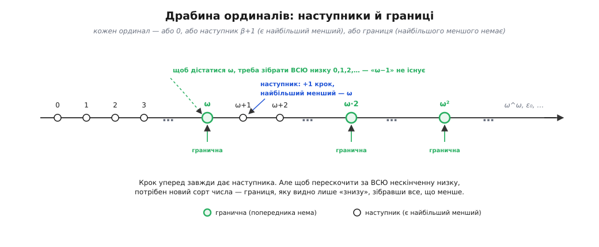
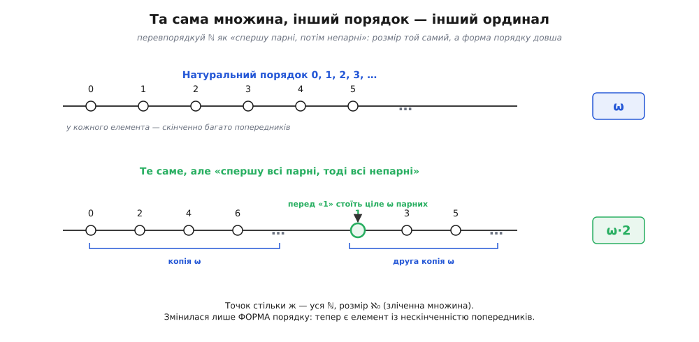
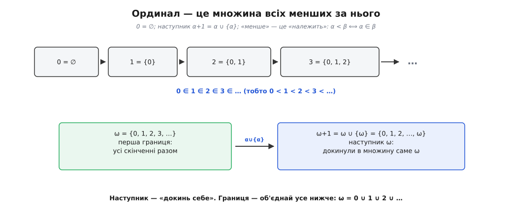

# Порядкові числа (ординали)

<preknowlist>
- [Натуральні числа](root:math-logic/natural-numbers) — низка 0, 1, 2, 3, …: є початок, у кожного рівно один наступник, поза низкою чисел немає.
- [Принцип повного впорядкування](root:math-logic/well-ordering-principle) — цілком упорядкована множина: у кожній непорожній її частині є найменший елемент. Це серце ординалів.
- [Теорія множин](root:math-logic/set-theory) — множина, належність (∈), порожня множина ∅; знадобиться, щоб зібрати ординали з самих множин.
- [Математична індукція](root:math-logic/mathematical-induction) — принцип доміно: база плюс крок «від n до наступного» накривають усю нескінченну низку.
</preknowlist>

Спитайте, скільки літер у слові «сон», — почуєте «три». Спитайте, котра з них «н», — почуєте «третя». Це два різні питання про ту саму трійку: одне про **кількість** («скільки всього»), друге про **позицію** («котрий по порядку»). Для жмені літер відповіді намертво зчеплені: якщо всього три, то остання — третя, і навпаки. Ми так звикли до цього зчеплення, що й не помічаємо, що це дві **різні** ідеї числа. «Один, два, три» відповідають на «скільки» — це числа-**кардинали** (лат. *cardinalis* — «головний»). «Перший, другий, третій» відповідають на «котрий за порядком» — це числа-**ординали** (лат. *ordinalis* — «порядковий», від *ordo* — «ряд, порядок»).

Поки предметів скінченно, розрізняти ці два числа нема потреби — вони йдуть пліч-о-пліч. Уся дивовижа починається, коли ми пробуємо лічити **за** нескінченність, і два обличчя числа раптом розходяться. Ординали — це те, що виходить, коли ідею «котрий за порядком» довести до кінця й далі, за саму межу скінченного.

### Крок за нескінченність

Уявіть, що ви полічили всі натуральні числа: 0, 1, 2, 3, і так без кінця. Насправді ви ніколи не «закінчите» — але уявімо, що вся ця нескінченна низка вже вишикувана перед вами. Питання: чи є **позиція одразу після всіх них**? Здоровий глузд каже «ні, нескінченність — це вже кінець, за нею нічого немає». Ґеорґ Кантор у 1880-х зробив зухвалий хід: сказав «так». Домалюймо після всієї низки 0, 1, 2, 3, … ще одну точку — і назвімо її позицію **ω** (остання літера грецької абетки, «омега» — гр. *ō méga*, «велике О», знак кінця й найдальшого). А тоді продовжуймо, як звикли: за ω йде ω+1, за ним ω+2, ω+3, — і знову без кінця.

ω — це не «найбільше натуральне число» (такого немає) і не «нескінченність узагалі». Це перша **позиція, що стоїть за всіма скінченними**. Ординали — числа саме для таких позицій: вони лічать місця в шерензі, а шеренга буває довшою за ℕ.



*Драбина ординалів. Простим кроком «+1» дістаєшся лише наступних чисел; щоб перескочити за всю нескінченну низку, потрібна границя — ω, ω·2, ω², — яку видно тільки знизу, зібравши все, що менше.*

### Що таке ординал насправді: форма порядку

Щоб це не лишалося грою уяви, скажімо точно, **чим** є ординал. Придивімося, що ми зробили. Ми взяли множину, розставлену **в лінію**, і придивилися до її **форми** — до того, як елементи йдуть один за одним. Дві впорядковані множини мають однакову форму, якщо їх можна поставити в пару «перший з першим, другий з другим, …» так, щоб порядок зберігся: це називають **ізоморфізмом порядків** (гр. *ísos* — «рівний», *morphḗ* — «форма»). Ординал — це і є **форма порядку**, спільна для всіх однаково вишикуваних множин. Достоту як кардинал «три» — це те спільне, що є в усіх трійках, ординал «третій» — те спільне, що є в усіх «трьох-у-ряд».

Але не всяка лінія годиться. Ординали описують форму не будь-яких порядків, а лише **цілком упорядкованих** множин — таких, де кожна непорожня частина має найменший елемент (це і є [принцип повного впорядкування](root:math-logic/well-ordering-principle)). Ця вимога — не примха: саме вона гарантує, що в шерензі завжди є куди рушити далі й що ніде немає «провалля», у яке можна падати без дна. Натуральні числа у звичному порядку цілком упорядковані — і їхня форма порядку є найперший нескінченний ординал, той самий **ω**.

### Розмір той самий — форма інша

Тут і криється те, заради чого ординали варті окремого імені. Візьмімо всі натуральні числа, але переставмо їх: спершу всі парні за зростанням, а тоді всі непарні за зростанням.

**Умова: яка форма порядку в низки 0, 2, 4, 6, …, 1, 3, 5, 7, … ?**
```
0, 2, 4, 6, …               — уся нескінченність парних, форма ω
            1, 3, 5, 7, …   — за ними ще нескінченність непарних, знову ω
```
Ця множина цілком упорядкована: у будь-якій непорожній її частині є найменший елемент (є парне — беремо найменше парне; самі непарні — найменше непарне). Отже, це законний ординал. Але він **не** дорівнює ω. У ω кожен елемент має **скінченно** багато попередників — перед числом 5 стоять лише 0, 1, 2, 3, 4. А тут число 1 має **нескінченно** багато попередників: усі парні стоять перед ним. Ізоморфізм порядків зберігає «скільки попередників», тож ці дві форми різні. Нову форму звуть **ω+ω**, або **ω·2**: дві копії ω, поставлені одна за одною.

Тепер придивіться до фокуса. Ми **не додали жодної нової точки** — це та сама множина натуральних чисел, усі вони до одного. Її **розмір** не змінився: як була зліченна, так і лишилася. Змінилася тільки **форма**, у яку ми їх вишикували, — і форма стала довшою.



*Та сама множина натуральних чисел, вишикувана двома способами. Природний порядок дає форму ω; «спершу парні, потім непарні» — довшу форму ω·2. Точок стільки ж, розмір той самий — інша лише форма порядку.*

Ось де кардинал і ординал розходяться остаточно. **Кардинал** питає «скільки?» — і відповідь для ω, ω+1, ω·2, ω² і навіть ω^ω одна й та сама: усі вони [зліченні](root:math-logic/countable-sets), усі одного розміру ℵ₀ (єврейська літера «алеф» з індексом нуль — так Кантор позначив найменший нескінченний розмір). **Ординал** питає «в якій формі?» — і тут ці самі позиції всі різні. Одна нескінченна множина точок допускає нескінченно багато різних способів бути цілком упорядкованою, і кожен спосіб — окремий ординал.

> 🔧 **Навіщо це.** Розрізняти «скільки» і «в якому порядку» — не педантизм. Коли [кардинальне число](root:math-logic/cardinal-numbers) каже вам, що двох множин «порівну», воно нічого не каже про те, чи можна пройти їх однаково: ω і ω·2 однакові за розміром, але друга форма має «шов» посередині, якого в першій немає. Ординали лічать саме **кроки процесу**, а не предмети, — і тому ними доводять, що процеси зупиняються, навіть коли ті спершу шалено розростаються.

### Складати можна, а переставляти — ні

Раз є ω, ω+1, ω·2, виникає спокуса рахувати ними, як звичайними числами. Додавати й множити ординали справді можна — це прямий доріст звичайних + і ×. Тільки за нескінченністю ця арифметика губить звичну **переставність**. Додати одиницю **перед** ω — усе одно що нічого не змінити: одна зайва точка на початку низки 0, 1, 2, … просто вбирається в неї, і форма лишається ω, тобто 1 + ω = ω. А додати одиницю **після** ω — це вже нова форма, у якої з'явився останній елемент, і вона більша: ω + 1 ≠ ω. Отже, 1 + ω ≠ ω + 1 — від порядку доданків залежить результат. [Як улаштовані додавання, множення й піднесення ординалів до степеня, і чому зліва вони поводяться слухняно, а справа ні](root:math-logic/ordinal-numbers/math-ordinal-arithmetic.md), розібрано окремо; але вже цей приклад застерігає: інтуїцію зі скінченних чисел сюди переносити небезпечно.

### Дві породи ординалів: наступники й границі

Пройдімося драбиною ще раз і придивімося, **як** кожен ординал з'являється. Одні виникають простим кроком «додай один»: за ω йде ω+1, за 4 йде 5. Такий ординал має **найбільший менший за себе** — свого безпосереднього попередника (у ω+1 це ω, у 5 це 4). Їх звуть **наступниковими** (англ. *successor* — «наступник»).

А от сам ω влаштований інакше. Що таке «ω−1»? Це мало б бути найбільше натуральне число — а такого немає. У ω **немає найбільшого меншого**: хоч би яке число ви назвали, за ним є ще більші, усе ще менші за ω. До ω не дійти одним кроком нізвідки — до нього дістаєшся, лише **зібравши разом усю** нескінченну низку, що під ним. Такі ординали звуть **граничними** (лат. *limes* — «межа»): границя — це те, до чого низка прямує, сама не потрапляючи туди по одному кроку.

Отже, кожен ординал — рівно одне з трьох: **нуль** (початок, менших немає), **наступник** (є найбільший менший, ступив крок від нього) або **границя** (менших нескінченно, найбільшого серед них нема, беремо всі гуртом). Цей поділ на три — не класифікаційна дрібниця, а кістяк усього, що з ординалами роблять.

### Ординал, зібраний із порожнечі

Досі ординал був «формою» — трохи абстрактно. Але його можна зробити цілком **відчутним предметом**, зібравши з самих [множин](root:math-logic/set-theory), як це зробив Джон фон Нейман 1923 року. Ідея та сама, що й для [натуральних чисел](root:math-logic/natural-numbers): **кожне число — це множина всіх менших за нього**.

```
0   = ∅                       (порожня множина — менших немає)
1   = {0}
2   = {0, 1}
3   = {0, 1, 2}
…
ω   = {0, 1, 2, 3, …}         (границя: усі скінченні разом)
ω+1 = ω ∪ {ω} = {0, 1, 2, …, ω}
```

Гляньте, що сталося з **порядком**. Сказати «α менше за β» тепер означає просто «α **належить** β» (α ∈ β): 2 менше за 5, бо 2 лежить усередині 5 = {0, 1, 2, 3, 4}. Порядок перестав бути окремою домовленістю — він **вбудований** у самі множини через належність. А дві породи ординалів стали двома операціями над множинами: **наступник** — це «докинь до множини її саму», α+1 = α ∪ {α} (додаємо рівно один новий елемент — сам α); **границя** — це «об'єднай усе, що нижче», ω = 0 ∪ 1 ∪ 2 ∪ … Нуль, з якого все починається, — порожня множина. Жодного числа не припущено наперед: уся драбина, аж за ω, виростає з ∅ та двох дій.



*Ординали, зібрані з порожнечі. Кожне число — множина всіх менших; «менше» стає «належить». Наступник докидає в множину її саму, а границя ω об'єднує всі скінченні числа разом.*

Ця сама побудова відповідає й на питання, звідки взагалі беруться **всі** ординали. Виявляється, кожна цілком упорядкована множина ізоморфна рівно одному фон Нейманову ординалу — тож ординали є **повним каталогом усіх можливих форм** повного впорядкування, без пропусків і повторів. Кожній формі — свій ординал, і кожному ординалу — своя форма.

### Індукція, що дістає за нескінченність

Найбільша користь від ординалів у тому, що на них працює **індукція**, тільки посилена. Звичайна [математична індукція](root:math-logic/mathematical-induction) валить нескінченну низку доміно двома обіцянками: правда для 0, і з правди для n випливає правда для n+1. Але цим важелем не дотягнутися за ω: скільки не роби кроків «+1» від нуля, до самого ω так і не ступиш — між ним і будь-яким скінченним числом лежить ще нескінченність.

Рятує **трансфінітна індукція** (лат. *trans* — «за», *finis* — «межа»: за межею скінченного). Вона повторює той самий поділ на три: щоб довести властивість для **всіх** ординалів, треба показати її (1) для нуля, (2) для кожного наступника — виводячи з попередника, як у звичайній індукції, і (3) для кожної границі — збираючи докупи те, що вже доведено для **всіх** менших. Третій випадок — новий; саме він перестрибує через ω, ω·2, ω² — через кожен «шов», де звичайна індукція буксує. [Механізм трансфінітної індукції та чому він не зривається](root:math-logic/well-ordering-principle/math-well-founded.md) розібрано окремо; суть — у тому, що повне впорядкування ординалів не лишає нескінченного спуску вниз, тож збірка «знизу» завжди доходить до дна.

> 🔧 **Навіщо це.** Ординали — робочий інструмент доведення, що процес **зупиниться**, навіть коли він спершу розростається. Зіставте кожному стану ординал так, щоб з кожним кроком той **строго меншав**. Ординали цілком упорядковані — нескінченного спадного ланцюга серед них не буває, — тож і кроків буде скінченно, хай яким астрономічним було стартове число. Натуральної «міри» тут часто замало: буває, що величина мусить рости, перш ніж упасти, і тоді єдина міра, яка все одно строго спадає, — саме ординальна.

### Приголомшливий доказ: послідовності Ґудстейна

Найяскравіше цю силу видно на **послідовностях Ґудстейна**. Беруть число, записують його особливим чином і за простим правилом будують послідовність, яка стрибає в захмарні висоти — числа роздуваються так, що не влазять у жодну уяву. І все ж **кожна така послідовність зрештою повертається до нуля**. Мало того: цей факт про звичайні натуральні числа **неможливо довести**, користуючись самою лише арифметикою натуральних чисел (Лоренс Кірбі й Джефф Періс, 1982) — він лежить за межею того, що вона [здатна довести про себе](root:math-logic/godel-incompleteness). А доводиться він легко — якщо кожному велетенському числу послідовності підставити ординал, що попри всі стрибки **строго меншає**; далі спрацьовує «нескінченного спуску серед ординалів немає». [Як улаштовані послідовності Ґудстейна, споріднена гра в Гідру і робочий код, що показує спадання ординала](root:math-logic/ordinal-numbers/proj-goodstein.md), — окремий розбір. Це і є ординали в дії: вони бачать зупинку там, де сама арифметика її не бачить.

### Звідки вони й де межа

Ординали не впали з неба — їх виснував Кантор наприкінці XIX століття, і не заради краси, а вибираючись із цілком конкретної задачі про збіжність тригонометричних рядів; звідти проросли «символи нескінченності», які згодом стали ординалами. Ідея «числа за нескінченністю» здалася сучасникам єрессю, і Кантор дорого за неї заплатив. [Як народилися ординали й чому це коштувало Канторові спокою](root:math-logic/ordinal-numbers/hist-cantor-ordinals.md) — окрема історія.

Наостанок — межа, об яку легко перечепитися. Ординалів так багато, що **зібрати їх усі в одну множину не можна**: якби існувала «множина всіх ординалів», вона сама була б цілком упорядкована, а отже, мала б власний ординал — більший за кожен ординал, зокрема за самого себе (цю халепу першим помітив італієць Чезаре Бурала-Форті 1897 року). Тому теорія множин мусить поводитися з ординалами обережно, і саме такі парадокси змусили математику виписати [строгі аксіоми](root:math-logic/zfc-set-theory), на яких вона стоїть донині. А ще з ординалами тісно пов'язана [аксіома вибору](root:math-logic/axiom-of-choice): це вона дозволяє **будь-яку** множину — навіть усі дійсні числа — цілком упорядкувати, тобто причепити до неї якийсь ординал; без неї це вдається не завжди.

### Підсумок

Порядкові числа — це відповідь на питання «котрий за порядком», доведена до кінця й за межу скінченного. Ординал — це **форма порядку** цілком упорядкованої множини, тобто те спільне, що мають усі однаково вишикувані шеренги; найперший нескінченний ординал ω — форма натурального ряду, а за ним ідуть ω+1, ω·2, ω², ω^ω і далі без кінця. Головне прозріння в тому, що **форма — не те саме, що розмір**: ту саму зліченну множину можна вишикувати в нескінченно різні ординали, не додавши й не прибравши жодного елемента, тож ординали (порядок) і кардинали (кількість) за нескінченністю розходяться. Кожен ординал — нуль, наступник або границя, і цей поділ на три стає кістяком трансфінітної індукції, якою доводять твердження й обґрунтовують завершення процесів там, куди звичайна індукція не дотягується. Зібрані фон Нейманом із самої порожньої множини, де «менше» — це «належить», ординали виявляються повним каталогом усіх форм повного впорядкування — і одним із найглибших знарядь, які математика має для розмови про нескінченне.
