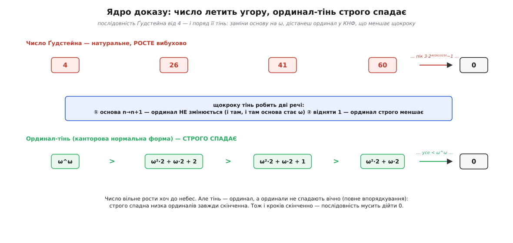
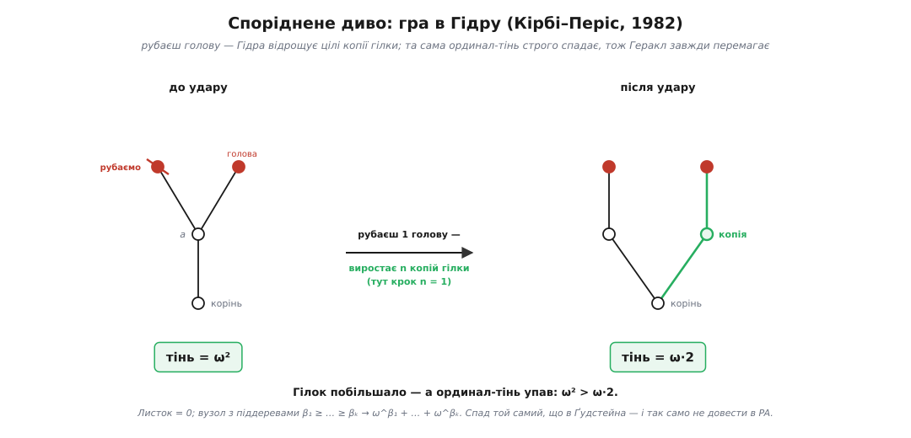

# ⚙️ Ґудстейн у коді: число до небес — і назад до нуля

Візьміть число 4. Зараз за простим, майже дитячим правилом ми розженемо його в таку далеч, що поряд із нею кількість атомів у видимому Всесвіті — округла дрібничка. А тоді, за тим самим правилом і без жодного винятку, воно повернеться рівно в нуль. Мало того: довести, що воно **таки** повернеться, засобами звичайної арифметики натуральних чисел **неможливо**. Щоб побачити повернення, доведеться зіставити кожному числу-велетню ординал — і стежити за **тінню**, яка, попри всі стрибки самого числа, вперто повзе донизу, аж поки не впаде в нуль і не потягне число за собою.

Це — послідовності Ґудстейна: винахід англійського логіка Ройбена Луїса Ґудстейна (Reuben Louis Goodstein), який 1944 року в праці «On the restricted ordinal theorem» описав їх і довів, що всі вони скінченні. Розберімо їх до кісток і напишімо код, який рахує саме число — і поряд його спадну ординал-тінь.

## Задача: спадковий запис і правило «підвищ основу, відніми 1»

Почнімо з незвичного способу записувати числа. Звична двійкова система пише число як суму степенів двійки: 35 = 32 + 2 + 1 = 2⁵ + 2¹ + 2⁰. Але придивіться до **показників**: там сидить 5, а це саме по собі число, яке теж можна розписати за двійкою: 5 = 2² + 2⁰. І показник 2 у ньому — знову двійка. Якщо докрутити цю ідею до самого дна, тобто розкласти за основою 2 **і всі показники, і показники показників**, дістанемо **спадковий запис за основою 2** (англ. *hereditary* — «спадковий»: правило успадковується вглиб, на кожен поверх степенів):

```
35  =  2^(2² + 1) + 2 + 1        (усе, крім самих двійок, — це 0 або 1)
 4  =  2^2                       (найчистіший приклад: сама двійка в самій двійці)
26  =  2·3² + 2·3 + 2            (те саме, але за основою 3)
```

Тепер — правило, що будує послідовність. Беремо стартове число, записуємо його у спадковій основі 2. Далі щокроку робимо дві дії:

```
① підвищ основу:  заміни КОЖНУ основу n на n+1  (і в базах, і в показниках)
② відніми 1:      від того, що вийшло, відніми одиницю
```

І повторюй: наступний крок — основа вже n+1, тоді n+2, і так далі. Основа росте на одиницю щокроку, а «−1» тихо гризе число ззаду. Ось як це грає на числі 3 — воно слухняне й падає швидко:

**Умова: послідовність Ґудстейна від 3.**
```
крок 0:  основа 2:  3 = 2 + 1            → підвищ (3+1=4), −1  →  3
крок 1:  основа 3:  3 = 3                → підвищ (4),     −1  →  3
крок 2:  основа 4:  3 = 3                → підвищ (3),     −1  →  2   ← 3 < основи, «підвищувати» нема що
крок 3:  основа 5:  2                    → підвищ (2),     −1  →  1
крок 4:  основа 6:  1                    → підвищ (1),     −1  →  0
```
Отже, 3, 3, 3, 2, 1, 0 — за п'ять кроків у нуль. Секрет простий: тільки-но число стає меншим за поточну основу, «підвищ основу» його вже не чіпає (нема великих степенів, куди підставляти), і лишається чисте віднімання одиниці — воно й доводить до нуля.

А тепер той самий закон на числі 4 — і воно вибухає:

**Умова: послідовність Ґудстейна від 4 (перші кроки).**
```
крок 0:  основа 2:  4 = 2^2              → підвищ:  3^3 = 27,  −1  →  26
крок 1:  основа 3:  26 = 2·3² + 2·3 + 2  → підвищ:  2·4²+2·4+2 = 42, −1  →  41
крок 2:  основа 4:  41 = 2·4² + 2·4 + 1  → підвищ:  2·5²+2·5+1 = 61, −1  →  60
крок 3:  основа 5:  60 = 2·5² + 2·5      → підвищ:  2·6²+2·6 = 84,    −1  →  83
                                                             …  далі: 109, 139, 173, 211, …
```
Різниця з трійкою — в одному фатальному місці. На кроці 0 підвищення основи перетворює 2² не на 3², а на **3³**: показник — теж двійка, і він теж підвищується. Це і є спадковість, і саме вона розганяє число. Число 4 повзе вгору неспинно; воно сягне піка аж коло основи 3·2⁴⁰²⁶⁵³²⁰⁹ — значення завбільшки 3·2⁴⁰²⁶⁵³²¹⁰ − 1 — і лише **потім** почне спадати, дійшовши нуля за 3·2⁴⁰²⁶⁵³²¹¹ − 2 кроків. Це число не має імені й не влазить у жодну фізичну аналогію.

Ось задача-загадка. Число росте так люто, що будь-яка спроба «зловити» його зверху приречена. Звідки ж певність, що воно **завжди** повертається? І чому, як з'ясувалося згодом, цю певність не можна обґрунтувати самою арифметикою?

## Ідея: зіставити ординал і дивитися на тінь

Хід, що розв'язує все, до безсоромності простий. Візьмімо запис числа у спадковій основі n — і **замінімо кожну основу n на ω** (перший нескінченний ординал). Число-велетень стає ординалом; назвімо його **тінню**:

```
крок 0:  4  за основою 2:  2^2              →  ω^ω
крок 1:  26 за основою 3:  2·3² + 2·3 + 2   →  ω²·2 + ω·2 + 2
крок 2:  41 за основою 4:  2·4² + 2·4 + 1   →  ω²·2 + ω·2 + 1
крок 3:  60 за основою 5:  2·5² + 2·5       →  ω²·2 + ω·2
```

Те, що вийшло праворуч, — це ординал у **канторовій нормальній формі** (КНФ): запис за «основою ω» так само, як звичне число — за основою 10, з тією різницею, що показники самі є ординалами й строго спадають зліва направо. Тепер придивіться до правого стовпчика уважно, бо тут уся сіль: **тінь щокроку строго меншає**. ω^ω більше за ω²·2 + ω·2 + 2 (бо ліворуч показник ω, а праворуч найбільший показник лише 2, а ω > 2); далі кожен наступний ординал менший за попередній. Число летить угору — тінь повзе вниз.



*Дві доріжки одного кроку. Угорі натуральне число росте вибухово; унизу тінь-ординал строго спадає. Підвищення основи не зрушує тінь, а «−1» щоразу зсуває її на щабель нижче.*

Чому тінь спадає — видно, якщо розкласти крок на дві дії окремо.

**Дія ① — підвищити основу n → n+1 — тінь НЕ змінює.** Це найтонше місце. Коли ми переписуємо те саме дерево цифр, міняючи символ n на n+1, а потім підставляємо ω замість основи, то однаково дістаємо ω на місці кожної основи — байдуже, було там n чи n+1. Формально: тінь числа за основою n і тінь того-таки числа, підвищеного до основи n+1, — **той самий ординал**. Підвищення основи роздуває натуральне число, але для тіні воно невидиме.

**Дія ② — відняти 1 — тінь строго меншає.** А от відняти одиницю від числа за основою n+1 означає взяти ординал на щабель менший: у канторовій нормальній формі відняти одиницю — це строго спуститися (можливо, з «позикою» зі старшого розряду, як у звичайному відніманні). Строго менший ординал — і крапка.

Складімо докупи: за крок тінь спершу не змінюється (①), тоді строго меншає (②). Отже, **тінь щокроку строго меншає**. А тепер — фінальний удар, задля якого все й затівалося. Ординали цілком упорядковані: [строго спадна низка ординалів завжди скінченна — нескінченного спуску вниз серед них не буває](topic:math-logic/well-ordering-principle). Тінь не може меншати вічно, тож кроків **скінченно**. А коли тінь падає в 0, то й саме число вже 0 (нульовий ординал відповідає лише нулю). Послідовність Ґудстейна мусить дійти нуля — хай яким астрономічним був старт.

> 🔧 **Навіщо це.** Тінь-ординал — чесний бухгалтер процесу. Він **не бачить** інфляції основи, якою число дурить око, і рахує лише справжню ерозію — те єдине «−1» за крок. Де арифметика бачить число-втікача, ординал бачить зворотний відлік. Це і є загальний рецепт із [трансфінітної індукції](topic:math-logic/well-ordering-principle): щоб довести, що процес спиниться, зістав кожному стану ординал, який строго меншає, — і хай натуральна величина хоч вибухає.

Тим, хто зустрічав [нескінченний спуск Ферма](topic:math-logic/infinite-descent), тут вчувається знайоме. Ферма доводив неможливість, спускаючись донизу **натуральними** числами, які теж не спадають вічно. Ґудстейнів доказ — той самий спуск, але сходами **ординалів**; і саме тому, що ординали багатші за ℕ, вони дозволяють натуральному числу рости, поки тінь падає. Одна ідея — «вниз без дна не буває» — на двох різних драбинах.

## Робочий код: число і його тінь пліч-о-пліч

Тепер — програма, що робить рівно те, що ми щойно описали руками: рахує послідовність Ґудстейна й **паралельно** будує спадний ординал-тінь, ще й перевіряючи щокроку, що тінь справді меншає. Мова — Python, і це не випадковість: тут потрібна довга арифметика (значення миттю переростають будь-яку машинну розрядність, а рідні цілі Python необмежені), а рекурсивна природа спадкового запису й дерево канторової форми лягають у кілька прозорих функцій без жодного стороннього рядка. Це доменно-замкнена задача — одна мова, без вкладок.

```python
from dataclasses import dataclass

# ── 1. Спадкова основа: прочитати v за основою b, переписати за основою c ──────
def bump(v, b, c):
    """Спадковий запис v за основою b, з КОЖНОЮ основою (і в показниках!)
    заміненою на c. При c = b+1 це і є «підвищ основу» кроку Ґудстейна."""
    if v == 0:
        return 0
    total, power = 0, 0
    while v > 0:
        d = v % b                                 # цифра при b^power
        if d:
            total += d * c ** bump(power, b, c)   # показник теж підвищуємо — рекурсія
        v //= b
        power += 1
    return total

# ── 2. Ординал-тінь у канторовій нормальній формі ─────────────────────────────
@dataclass(frozen=True)
class Ord:
    """КНФ: терми (показник: Ord, коефіцієнт: int); показники строго спадають."""
    terms: tuple            # ((exp, coef), …)

ZERO = Ord(())

def to_ordinal(v, b):
    """Та сама схема, що й bump, але замість основи підставляємо ω."""
    if v == 0:
        return ZERO
    terms, power = [], 0
    while v > 0:
        d = v % b
        if d:
            terms.append((to_ordinal(power, b), d))   # показник — теж ординал
        v //= b
        power += 1
    return Ord(tuple(reversed(terms)))                 # показники — за спаданням

def ord_cmp(A, B):
    """-1 / 0 / +1. Лексикографічно: показник важить більше за коефіцієнт."""
    for (ea, ca), (eb, cb) in zip(A.terms, B.terms):
        c = ord_cmp(ea, eb)
        if c:
            return c
        if ca != cb:
            return -1 if ca < cb else 1
    if len(A.terms) == len(B.terms):
        return 0
    return 1 if len(A.terms) > len(B.terms) else -1    # довший запис — більший

SUP = str.maketrans("0123456789", "⁰¹²³⁴⁵⁶⁷⁸⁹")
def _wrap(e):
    return e if all(ch not in e for ch in "+· ") else "(%s)" % e
def ord_str(A):
    if not A.terms:
        return "0"
    out = []
    for exp, c in A.terms:
        if exp == ZERO:                              # ω⁰ = 1  →  просто число
            out.append(str(c))
        else:
            e = ord_str(exp)
            base = "ω" if e == "1" else ("ω" + e.translate(SUP) if e.isdigit()
                                         else "ω^" + _wrap(e))
            out.append(base if c == 1 else "%s·%d" % (base, c))
    return " + ".join(out)

# ── 3. Крок Ґудстейна + паралельна тінь ───────────────────────────────────────
def goodstein(start, max_steps=40):
    v, b = start, 2
    prev = None
    for step in range(max_steps):
        shadow = to_ordinal(v, b)                    # тінь поточного числа
        mark = "" if prev is None else (
            "↓ строго меншає" if ord_cmp(shadow, prev) < 0 else "??? НЕ МЕНШАЄ")
        print(f"крок {step:>2}: основа {b:>2}   G = {v:<20} тінь = {ord_str(shadow):<18}{mark}")
        prev = shadow
        if v == 0:
            print(f"→ дійшли 0 за {step} кроків"); return
        v = bump(v, b, b + 1) - 1                     # ① підвищ основу  ② −1
        b += 1

goodstein(3)
print()
goodstein(4, max_steps=6)
```

Ключ до всієї програми — те, що функції `bump` (реальне число) і `to_ordinal` (тінь) — це **одна й та сама** рекурсія, лише в одній основа стає числом `c`, а в другій — символом ω. Саме тому дія «підвищ основу» на тіні непомітна: `to_ordinal` підставляє ω незалежно від того, яка там основа. Порівняння `ord_cmp` реалізує саме той закон, який ми довели руками: показник важить більше за коефіцієнт, тож ω²·1 > ω·1000000. А `goodstein` веде обидві доріжки поряд і щокроку звіряє, що тінь меншає. Ось що воно друкує:

```
крок  0: основа  2   G = 3                    тінь = ω + 1
крок  1: основа  3   G = 3                    тінь = ω                 ↓ строго меншає
крок  2: основа  4   G = 3                    тінь = 3                 ↓ строго меншає
крок  3: основа  5   G = 2                    тінь = 2                 ↓ строго меншає
крок  4: основа  6   G = 1                    тінь = 1                 ↓ строго меншає
крок  5: основа  7   G = 0                    тінь = 0                 ↓ строго меншає
→ дійшли 0 за 5 кроків

крок  0: основа  2   G = 4                    тінь = ω^ω
крок  1: основа  3   G = 26                   тінь = ω²·2 + ω·2 + 2    ↓ строго меншає
крок  2: основа  4   G = 41                   тінь = ω²·2 + ω·2 + 1    ↓ строго меншає
крок  3: основа  5   G = 60                   тінь = ω²·2 + ω·2        ↓ строго меншає
крок  4: основа  6   G = 83                   тінь = ω²·2 + ω + 5      ↓ строго меншає
крок  5: основа  7   G = 109                  тінь = ω²·2 + ω + 4      ↓ строго меншає
```

Трійка на очах падає в нуль; четвірка вже на шостому кроці перевалила за сотню й пре далі — а тінь при цьому щоразу «строго меншає», жодного разу не збившись. Програма не бреше: доріжки й справді розходяться в різні боки.

## Складність і пастки

**Ця програма — трасувальник, а не бігун.** Запустіть `goodstein(4)` без обмеження кроків — і вона не спиниться за час життя Всесвіту: пам'ятаймо, для четвірки треба 3·2⁴⁰²⁶⁵³²¹¹ − 2 кроків, і кожне проміжне значення теж росте до 3·2⁴⁰²⁶⁵³²¹⁰ − 1. Людськими темпами до кінця добігають хіба послідовності від 0, 1, 2, 3. Код цінний іншим — він **показує ідею доказу**: тінь, що спадає поряд із числом, яке злітає. Саме тінь, а не число, доводить зупинку.

**Швидкість зростання — за межею примітивної рекурсії.** Функція «скільки кроків до нуля» зростає казково швидко: вона переганяє функцію Аккермана і взагалі не є [примітивно-рекурсивною](topic:computability/primitive-recursive-functions). Це не технічна дивина, а прямий провісник наступного факту: функція росте так швидко, що арифметика Пеано не годна навіть довести, що вона **всюди визначена**.

**І ось шок: цю теорему про звичайні числа не довести звичайною арифметикою.** 1982 року Лоренс Кірбі й Джефф Періс у праці «Accessible independence results for Peano arithmetic» довели: теорема Ґудстейна **істинна** (її легко довести в теорії множин або трансфінітною індукцією), але **недовідна в арифметиці Пеано** (PA) — тій самій першопорядковій системі звичайних аксіом натуральних чисел з індукцією. Історично це був **третій** приклад істинного твердження про натуральні числа, недовідного в PA, — після [Геделевого речення](topic:math-logic/godel-incompleteness), що посилається саме на себе (1931), і Ґентценового результату про недовідність індукції до ε₀ (1943). Чесно варто додати: за кілька років до того, 1977-го, Періс і Гаррінгтон дали перший **суто комбінаторний** природний приклад (посилену скінченну теорему Рамсея), тож «третій» стосується саме цієї трійки, а не абсолютного порядку в часі. Але Ґудстейнова послідовність приваблива тим, що її правило пояснюють за хвилину школяреві.

**Чому ж PA не дає ради.** Усі тіні тут — ординали **менші за ε₀** (епсилон-нуль): це найменша нерухома точка рівняння α = ω^α, стеля нескінченної вежі ω, ω^ω, ω^ω^ω, … Доказ спирається на те, що спуск серед ординалів **аж до ε₀** завжди скінченний, — а це рівно та сила, якої PA бракує. Ґергард Ґентцен ще 1936 року показав, що індукція до ε₀ рівносильна несуперечності самої PA, тож за [теоремами Геделя](topic:math-logic/godel-incompleteness) вивести її всередині PA неможливо. Арифметика вміє спускатися ординалами до будь-якої скінченної висоти вежі, але не до самої ε₀ — а тіні Ґудстейна її саме туди і сягають.

**Пастка номер один — забути про спадковість.** Найпоширеніша помилка: підвищувати тільки основу, а показники лишати як є (2² → 3², а не 3³). Це вже **інша**, «слабка» послідовність Ґудстейна — вона теж завжди доходить нуля, але зростає сумирно й, головне, її скінченність **чудово доводиться** всередині PA. Уся магія — саме в тому, що показники підвищуються теж; варто зняти спадковість — і зникає і вибух, і недовідність.

**Пастка номер два — шукати натуральну міру.** Спокуса знайти якесь звичайне число, що спадало б щокроку, і ним довести зупинку — марна: величина ж **росте**. Жодна міра зі значеннями в ℕ не спадає тут монотонно. Працює лише міра, що живе в багатшому цілком упорядкованому світі — в ординалах. У цьому й урок: інколи єдиний спосіб довести, що земний процес спиниться, — вийти за межу скінченного.

**Споріднене диво — гра в Гідру.** У тій самій праці 1982 року Кірбі й Періс подали ще й гру. Гідра — це вкорінене дерево; її «голови» — листки. Геракл рубає голову; якщо в тієї є «дідусь» (голова не росте прямо з кореня), Гідра мстить: вирощує n **копій** гілки, з якої стриміла голова, і чіпляє їх до дідуся (n — номер ходу). Дерево лавиноподібно розростається — та Геракл однаково завжди перемагає. Причина буквально та сама: кожній Гідрі зіставляють ординал (листок — 0; вузол із піддеревами тіней β₁ ≥ … ≥ βₖ дістає ω^β₁ + … + ω^βₖ), і з кожним ударом цей ординал строго меншає. Знову ε₀, знову недовідність у PA — два обличчя одного явища.



*Один удар по Гідрі. Голів (і гілок) побільшало, а ординал-тінь упав: ω² > ω·2. Той самий спадний ординал, що й у Ґудстейна, гарантує, що Гідра колись загине.*

Лишається тихий підсумок, від якого й досі трохи паморочиться. Ось твердження про найзвичайніші числа — 4, 5, 26, — яке беззаперечно **істинне**, і водночас недосяжне для повного апарату шкільної арифметики: щоб його побачити, треба на мить вийти за нескінченність, зіставити числам ординали й повірити в те, що спуск ординалами колись доходить дна. Число тікає в захмарну далеч — а ординал уже знає, що це зворотний відлік.
