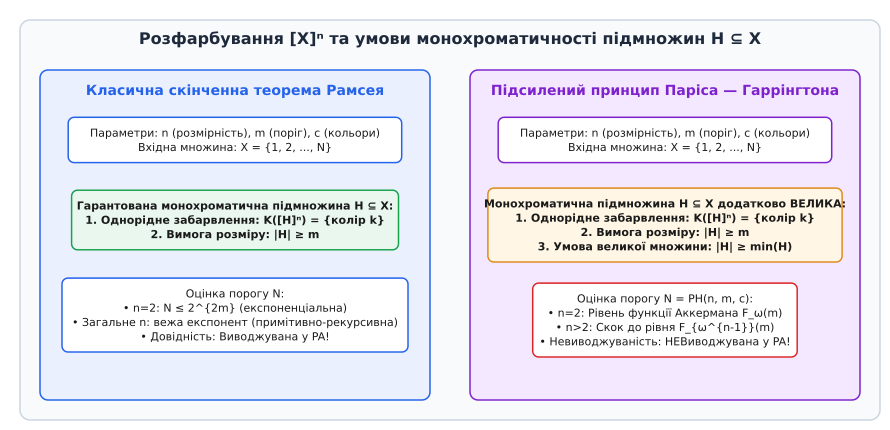
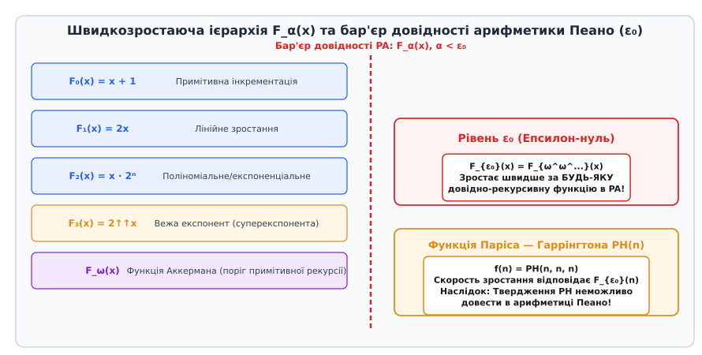
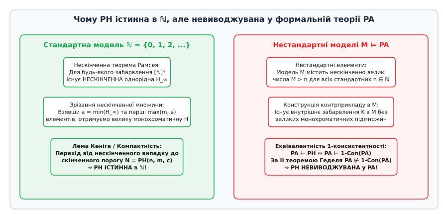

# Теорема Паріса — Гаррінгтона

<preknowlist>
- [Проблема зупинки](root:computability/halting-problem) — алгоритмічна нерозв'язність та фундаментальні межі обчислюваності.
- [Теорема Ґеделя про неповноту](root:math-logic/godel-incompleteness) — наявність істинних, але невиводжуваних тверджень у формальній арифметиці.
- [Арифметична ієрархія](root:computability/arithmetic-hierarchy) — класифікація логічних формул першого порядку за кванторною складністю.
</preknowlist>

Коли математики та спеціалісти з формальної верифікації аналізують стійкість та повноту аксіоматичних систем, вони спираються на фундаментальне припущення: будь-яке математичне твердження, сформульоване строговою мовою логіки першого порядку, має бути або виводжуваним з базових аксіом, або спростовним у межах цієї ж системи. Упродовж багатьох десятиліть центральною метою математичної логіки було обґрунтування того, що звичайна математика, побудована на аксіомах арифметики Пеано (PA), є повністю самодостатньою, повною та не містить внутрішніх суперечностей або незаповнюваних прірв.

У 1931 році австрійський логік Курт Гедель (нім. *Kurt Gödel*) зруйнував цей ідеал, довівши свою знамениту першу теорему про неповноту. Він показав, що в будь-якій несуперечливій формальній системі, здатності виразити базову арифметику натуральних чисел, існують істинні твердження, які неможливо довести інструментами самої системи.

Проте початкова логічна формула Геделя мала штучний, штучно сконструйований метаматематичний характер. Вона будувалася за допомогою геделівського кодування синтаксичних виразів числами та фактично стверджувала: «Ця формула не має доведення у системі». Упродовж понад чотирьох десятиліть у математичній спільноті точилися гострі дискусії щодо того, чи є геделівська неповнота лише курйозним побічним ефектом формального самокодування, чи вона являє собою природний бар'єр реальної комбінаторики та обчислювальної математики.

Відповідь на це фундаментальне запитання у 1977 році надали математики Джефф Паріс (англ. *Jeff Paris*) та Лео Гаррінгтон (англ. *Leo Harrington*). Вони сформулювали підсилений принцип Рамсея (англ. *Strengthened Finite Ramsey Theorem*) — повністю природне, скінченне комбінаторне твердження про розфарбування графів та гіперграфів. Воно виявилося полностью істинним у стандартній математичній дійсності натуральних чисел `ℕ`, але принципово невиводжуваним у найголовнішій системі формальної математики — арифметиці Пеано (PA).

## Загадка неповноти та пошук комбінаторного аналогу

Щоб зрозуміти масштаби відкриття Паріса та Гаррінгтона, необхідно повернутися до концептуальних витоків проблеми обґрунтування математики на початку XX століття.

У 1900 році на Другому Міжнародному конгресі математиків у Парижі видатний німецький математик Давид Гільберт (нім. *David Hilbert*) проголосив масштабну програму («програма Гільберта»), метою якої було звести всі галузі математики до формальних аксіоматичних систем та фінітними засобами довести їхню несуперечливість. Гільбертівський формалізм передбачав, що математичне знання можна повністю кодувати алгоритмічними правилами виводу: якщо твердження є істинним, для нього повинен існувати скінченний покроковий ланцюжок логічних аксіом і правил `modus ponens`, який можна автоматично перевірити механічним алгоритмом.

Перша теорема Геделя про неповноту 1931 року довів, що для будь-якої формальної системи `T`, яка включає арифметику Пеано, існує сформульоване мовою цієї системи речення `G`, таке що ані `T ⊢ G`, ані `T ⊢ ¬G`. Речення Геделя `G` конструювалося через діагональну лему Карнапа — Геделя та арифметизацію синтаксису (нумерацію виразів натуральними числами). Формула `G` дорівнювала логічному еквіваленту виразу `¬Prov_T(┌G┐)`, що означало: «Число коду формули G не має доведення в T».

Для звичайних математиків — алгебраїстів, аналітиків, комбінаторників — геделівське речення `G` здавалося чужорідним утворенням. Воно не стосувалося властивостей чисел, геометрії чи графів, а являло собою парадокс брехуна, переодягнений у систему числових кодів. Тому протягом 1930–1970-х років панувало переконання, що неповнота стосується виключно патологічних логічних формул, які свідомо описують свій власний синтаксис, тоді як «реальна» чиста та прикладна математика є повністю повною й захищеною від геделівських аномалій.

Шукання «природного» твердження — тобто висловленого звичними поняттями теорії чисел або комбінаторики без жодного кодування синтаксису, яке б водночас було істинним у `ℕ`, але невиводжуваним у PA — тривало понад 40 років. Саме цим граалем логіки першого порядку і стала теорема Паріса — Гаррінгтона.

## Від класичної теореми Рамсея до принципу Паріса — Гаррінгтона

В основі конструкції Паріса та Гаррінгтона лежить одна з найвидатніших теорем комбінаторики XX століття — теорема Френка Рамсея (англ. *Frank Ramsey*, 1930 рік). Теорія Рамсея досліджує виникнення впорядкованих структур усередині великих хаотичних об'єктів. Загальне гасло теорії Рамсея стверджує: «Повний хаос неможливий: будь-яка достатньо велика система містить високовпорядковану підсистему».

Розглянемо скінченну множину послідовних натуральних чисел `X = {1, 2, ..., N}`. Позначимо через `[X]ⁿ` множину всіх підмножин `X`, які містять рівно `n` елементів:

```
[X]ⁿ = { S ⊆ X : |S| = n }
```

Геометричний та комбінаторний зміст `[X]ⁿ` залежить від параметра `n`:
- При `n = 1`: `[X]¹` — це просто множина окремих елементів (вершин).
- При `n = 2`: `[X]²` — це множина всіх пар елементів з `X`. Якщо інтерпретувати `X` як вершини графа, то `[X]²` — це множина всіх ребер повного графа `K_N`.
- При `n = 3`: `[X]³` — це множина трійок елементів (трикутників або ребер 3-гіперграфа).

Нехай кожен `n`-елементний блок розфарбовано в один із `c` можливих кольорів за допомогою функції розфарбування `K: [X]ⁿ → {1, 2, ..., c}`. Підмножина `H ⊆ X` називається **монохроматичною** (або однорідною відносно розфарбування `K`), якщо всі її `n`-елементні підмножини мають однаковий колір під дією `K`:

```
∃ k ∈ {1, ..., c}  ∀ S ∈ [H]ⁿ ( K(S) = k )
```

**Класична скінченна теорема Рамсея:** Для будь-яких фіксованих параметрів `n` (розмірність підмножин), `m` (бажаний розмір монохроматичної множини) та `c` (кількість кольорів) існує таке достатньо велике число `N`, що будь-яке розфарбування `[X]ⁿ` гарантовано містить монохроматичну підмножину `H` розміру `|H| ≥ m`.


*Порівняння умов стандартної скінченної теореми Рамсея та підсиленого принципу Паріса — Гаррінгтона для розфарбування графів та гіперграфів.*

Класична теорема Рамсея є **повністю виводжуваною у формальній арифметиці Пеано (PA)**. Індукцією за `n` та `m` у PA легко будуються примітивно-рекурсивні верхні оцінки для порогу `N`. Для випадку `n = 2` (прості графи) поріг Рамсея `R(m, m)` оцінюється експоненціально `R(m, m) ≤ 2^{2m}`, що повністю вкладається у звичайні арифметичні виводи.

Паріс та Гаррінгтон внесли у це класичне твердження одну невибагливу, але глибоку зміну. Вони ввели поняття **великої множини** (англ. *large set* або *relatively large set*).

**Означення (Велика множина):** Скінченна множина натуральних чисел `H ⊂ ℕ` називається великою, якщо кількість її елементів не менша за її найменший елемент:

```
|H| ≥ min(H)
```

Розглянемо декілька конкретних наочних прикладів:
- Множина `H₁ = {3, 8, 14, 25}` має розмір `|H₁| = 4`, а її мінімальний елемент `min(H₁) = 3`. Оскільки `4 ≥ 3`, множина `H₁` є великою.
- Множина `H₂ = {10, 15, 30}` має розмір `|H₂| = 3`, а її мінімальний елемент `min(H₂) = 10`. Оскільки `3 < 10`, множина `H₂` не є великою.
- Множина `H₃ = {1, 100}` має розмір `|H₃| = 2`, а її найменший елемент `1`. Оскільки `2 ≥ 1`, вона є великою.
- Множина `H₄ = {5, 6, 7, 8, 9}` має розмір `5`, а найменший елемент `5`. Оскільки `5 ≥ 5`, вона є великою.

Зверніть увагу на тонку інтуїцію: вимога `|H| ≥ min(H)` створює динамічний зв'язок між найменшим елементом множини та її підсумковим розміром. Якщо однорідна множина починається з малих чисел (наприклад, з `1` або `2`), вимога великої множини виконується майже безкоштовно. Але якщо забарвлення змушує монохроматичну множину починатися з великого числа (скажімо, з `100` або `1000`), ця підмножина повинна містити щонайменше `100` або `1000` елементів відповідно!

**Підсилений принцип Паріса — Гаррінгтона (PH):** Для будь-яких натуральних чисел `n ≥ 1`, `m ≥ 1` та `c ≥ 1` існує таке натуральне число `N = PH(n, m, c)`, що для будь-якого розфарбування `K: [{1, 2, ..., N}]ⁿ → {1, 2, ..., c}` існує монохроматична підмножина `H ⊆ {1, 2, ..., N}`, яка одночасно задовольняє дві умови:
1. `|H| ≥ m` (стандартна вимога розміру);
2. `|H| ≥ min(H)` (вимога великої множини).

Детальний аналіз хронології цього відкриття та його впливу на математичну логіку розкрито в [історичному нарисі](root:math-logic/paris-harrington-theorem/hist-paris-harrington.md).

## Доведення істинності в стандартній моделі ℕ: Компактність та нескінченний Рамсей

Перший фундаментальний результат про принцип Паріса — Гаррінгтона полягає в тому, що він є безумовно **істинним** у звичайному математичному світі натуральних чисел `ℕ = {1, 2, 3, ...}`.

Його доведення будується за допомогою елегантного поєднання нескінченної теореми Рамсея та топологічного аргументу компактності (леми Кеніга про нескінченне дерево).

Схема виводу складається з двох послідовних логічних кроків.

### Крок 1: Нескінченна теорема Рамсея

Припустимо, що нам дано довільне розфарбування `K` усіх `n`-елементних підмножин нескінченного ряду натуральних чисел `[ℕ]ⁿ` у `c` кольорів.

За нескінченною теоремою Рамсея (англ. *Infinite Ramsey Theorem*) існує **нескінченна** монохроматична підмножина `H_∞ ⊆ ℕ`. Доведення цього факту здійснюється математичною індукцією за розмірністю `n`:
- База індукції (`n = 1`): розфарбування окремих елементів `K: ℕ → {1, ..., c}` розбиває нескінченну множину `ℕ` на `c` класів еквівалентності. За узагальненим принципом Діріхле для нескінченних множин принаймні один із `c` класів є нескінченним. Цей клас і формує шукану підмножину `H_∞`.
- Індукційний крок (`n > 1`): припускаємо істинність для `n - 1`. Зафіксуємо елемент `x₁ ∈ ℕ` і розглянемо забарвлення `(n-1)`-підмножин у залишеній частині. За індукційним припущенням виділяємо нескінченну послідовність сумісних елементів та побудуємо нескінченну однорідну підмножину `H_∞`.

Оскільки `H_∞` є нескінченною підмножиною натуральних чисел, за принципом найменшого елемента в `ℕ` вона містить свій мінімальний елемент `a = min(H_∞)`.

Зафіксуємо число `k = max(m, a)` і виберемо перші `k` елементів з `H_∞`:

```
H = { x₁, x₂, ..., xₖ } ⊂ H_∞,  де x₁ = a = min(H_∞)
```

Оскільки `H` є скінченною підмножиною `H_∞`, вона успадковує монохроматичність: усі її `n`-елементні блоки мають один і той самий колір. Кількість її елементів дорівнює `|H| = k = max(m, a)`. Звідси:
- `|H| ≥ m` (оскільки `k ≥ m`);
- `|H| ≥ a = min(H)` (оскільки `k ≥ a`).

Це доводить, що для **будь-якого** нескінченного розфарбування `[ℕ]ⁿ` обов'язково існує скінченна велика монохроматична підмножина потрібного розміру.

### Крок 2: Топологічна компактність (Лема Кеніга)

Тепер виконаємо перехід від нескінченного середовища `ℕ` до скінченного порогу `N`. Припустимо від супротивного, що для деякого набору `n, m, c` скінченний поріг `N` не існує.

Це означає, що для кожного `N = 1, 2, 3, ...` можна побудувати «погане» розфарбування `K_N: [{1, ..., N}]ⁿ → {1, ..., c}`, яке **не містить жодної** великої монохроматичної підмножини розміру `≥ m`.

Побудуємо нескінченне дерево розгалуження `T` усіх можливих «поганих» розфарбувань:
- Коренем дерева на рівні `0` є порожнє розфарбування.
- Вузли на рівні `N` відповідають усім можливим поганим розфарбуванням `K_N` множини `[{1, ..., N}]ⁿ`.
- Ребро з'єднує розфарбування `K_N` з розфарбуванням `K_{N+1}`, якщо `K_{N+1}` є продовженням `K_N` (тобто їхні кольори збігаються на всіх `n`-підмножинах із `{1, ..., N}`).

Проаналізуємо властивості дерева `T`:
1. Скінченність степенів розгалуження: додавання елемента `N+1` вимагає визначення кольорів для скінченної кількості нових `n`-підмножин. Оскільки кількість кольорів `c` є скінченною, кожна вершина дерева `T` має лише скінченне число нащадків.
2. Нескінченність дерева: за припущенням від супротивного, погані розфарбування існують для кожного `N`, тому дерево `T` містить нескінченну кількість вершин.

За лемою Кеніга про дерево (англ. *König's Tree Lemma*) будь-яке нескінченне скінченно-розгалужене дерево містить принаймні одну нескінченну гілку.

З точки зору загальної топології, цей аргумент відповідає теоремі Тихонова про компактність добутку компактних топологічних просторів: простір усіх забарвлень `c^{[ℕ]ⁿ}` є компактним Канторовим дисконумом, тому будь-яка послідовність скінченних наближень має граничну точку.

Ця нескінченна гілка задає послідовність узгоджених розфарбувань, яка визначає граничне нескінченне розфарбування `K_∞: [ℕ]ⁿ → {1, ..., c}`.

Але за Кроком 1 для нескінченного розфарбування `K_∞` мусить існувати скінченна велика монохроматична підмножина `H` розміру `|H| ≥ m`. Нехай `M = max(H)` — найбільший елемент цієї підмножини. Оскільки `H ⊆ {1, ..., M}`, ця ж підмножина `H` має бути монохроматичною й у скінченному розфарбуванні `K_M` на рівні `M`.

Це прямо суперечить тій умові, що `K_M` є «поганим» розфарбуванням і не містить великих монохроматичних підмножин!

Отримане суперечство доводить, що припущення хибне, і скінченний поріг `N = PH(n, m, c)` існує для будь-яких `n, m, c`. Принцип Паріса — Гаррінгтона є **істинним теоремою стандартної математики**.

Строгий математичний вивід цього компактного аргументу та його топологічну інтерпретацію наведено у [матеріалі](root:math-logic/paris-harrington-theorem/math-strengthened-ramsey.md).

## Чому арифметику Пеано спіткала поразка: Ієрархія швидкозростаючих функцій

Виникає фундаментальне парадоксальне запитання: якщо доведення істинності принципу Паріса — Гаррінгтона займає не більше трьох сторінок і спирається на зрозумілу топологічну компактність, чому його неможливо вивести у формальній арифметиці Пеано (PA)?

Причина полягає у **дивовижній швидкості зростання** функції порогу `PH(n, m, c)`.

У формальній логіці кожна теорема виду `∀x ∃y R(x, y)`, доведена всередині арифметики Пеано, визначає деяку обчислювальну функцію `f(x) = min y [ R(x, y) ]`. Якщо система PA здатна довести тотальність цієї функції (те, що вона повертає скінченний результат для будь-якого входу `x`), то швидкість зростання `f(x)` обмежена внутрішніми можливостями формального виводу PA.

Класифікацію обчислюваних функцій за швидкістю їхнього зростання дає **Швидкозростаюча ієрархія** (англ. *Fast-Growing Hierarchy*), позначувана через `F_α(x)`, де `α` — трансфінітні ординали:

```
F₀(x) = x + 1
F_{α+1}(x) = F_α^(x)(x)             [x-кратна повторна ітерація функції F_α]
F_λ(x) = F_{λ[x]}(x)                 [для граничного ординалу λ]
```

Розглянемо перші рівні цієї ієрархії:
- `F₁(x) = 2x` (лінійне зростання);
- `F₂(x) = x · 2ˣ` (експоненціальне зростання);
- `F₃(x) ≈ 2↑↑x` (суперекспонента, вежа степенів);
- `F_ω(x)` — функція Аккермана, яка мажорує всі класичні примітивно-рекурсивні функції.


*Порівняння швидкості зростання функцій у швидкозростаючій ієрархії та прорив функції Паріса — Гаррінгтона за межу довідності арифметики Пеано ε₀.*

У 1936 році Ґергард Ґентцен (нім. *Gerhard Gentzen*) довів, що межа довідності арифметики Пеано відповідає ординалу `ε₀` (епсилон-нуль). Ординал `ε₀` є найменшим трансфінітним числом, яке є нерухомою точкою ординальної степені: `ε₀ = ω^{ε₀} = sup(ω, ω^ω, ω^{ω^ω}, ...)`.

Результат Ґентцена означає:
- Будь-яка функція, тотальність якої можна довести в PA, зростає не швидше за `F_α(x)` для деякого ординалу `α < ε₀`.
- Якщо якась функція зростає зі швидкістю `F_{ε₀}(x)` або швидше, система PA **фізично не здатна довести її тотальність**.

У 1981 році Юссі Кетоннен (фін. *Jussi Ketonen*) та Роберт Соловей (англ. *Robert Solovey*) провели точний комбінаторний аналіз функції Паріса — Гаррінгтона `PH(n, m, c)`:
1. Для розмірності `n = 1` (розфарбування окремих вершин) поріг оцінюється лінійно: `PH(1, m, c) = c · (m - 1) + 1` (за принципом Діріхле).
2. Для розмірності `n = 2` (розфарбування ребер графів) функція `m ↦ PH(2, m, c)` зростає зі швидкістю функції Аккермана `F_ω(m)`.
3. Для розмірності `n = 3` (3-гіперграфи) зростання здійснює скок до рівня `F_{ω²}(m)`.
4. Для довільного `n` функція зростає зі швидкістю `F_{ω^{n-1}}(m)`.

Якщо ми розглянемо діагональну функцію Паріса — Гаррінгтона `f(n) = PH(n, n, n)`, де розмірність гіперграфа, кількість кольорів та поріг зростають одночасно, її швидкість зростання досягає рівня:

```
f(n) ∈ Ω( F_{ε₀}(n) )
```

Оскільки швидкість зростання `f(n)` пробиває верхню межу `ε₀`, арифметика Пеано не може довести, що число `PH(n, m, c)` є скінченним для всіх `n, m, c`!

> 🔧 **Навіщо це.** У практичній верифікації програмного забезпечення та автоматичному доведенні теорем (англ. *Automated Theorem Proving*) оцінка швидкості зростання за ієрархією `F_α` є індикатором завершуваності алгоритмів. Якщо рекурсивна програма опирається на структури з ординалом `ε₀` (як-от складні редукції у терм-переписуванні), стандартна індукція за натуральними числами в компіляторі або верифікаторі не зможе гарантувати її зупинку без залучення більш потужних ординальних систем.

## Семантична картина: Нестандартні моделі арифметики та 1-консистентність

Щоб остаточно зрозуміти механізм невиводжуваності, слід звернутися до теорії моделей та поняття нестандартних моделей арифметики Пеано.

За теоремою про повноту логіки першого порядку, формула `A` є виводжуваною з аксіом теорії `T` (`T ⊢ A`) тоді й лише тоді, коли `A` є істинною в **усіх** можливих математичних моделях цієї теорії (`T ⊨ A`).

Арифметика Пеано має не лише стандартну модель натуральних чисел `ℕ = {0, 1, 2, 3, ...}`, але й нескінченне різноманіття **нестандартних моделей** `M ⊨ PA`. Нестандартна модель `M` містить крім звичайних натуральних чисел нові об'єкти — «нестандартні елементи» `C ∈ M`, які є більшими за кожне звичайне натуральне число:

```
∀ n ∈ ℕ  ( M ⊨ n < C )
```


*Геометрична та модельна інтерпретація розбіжності між стандартною моделлю ℕ та нестандартними моделями M під час оцінки принципу Паріса — Гаррінгтона.*

У нестандартній моделі `M` елемент `C` сприймається зсередини системи як скінченне натуральне число, до нього застосовуються всі аксіоми додавання, множення та математичної індукції.

Джефф Паріс та Лео Гаррінгтон довели, що в деяких нестандартних моделях `M ⊨ PA` можна побудувати «внутрішнє» розфарбування `K`, для якого не існує жодної великої монохроматичної підмножини.

Чому Крок 1 (який так легко довів істинність у `ℕ`) не працює в нестандартній моделі `M`?
1. Внутрішній аналог нескінченної теореми Рамсея у модель `M` не переношується, оскільки модель `M` «бачить» лише ті підмножини, які визначаються внутрішніми формулами.
2. Нескінченна однорідна множина `H_∞` є зовнішнім математичним об'єктом, відсутнім усередині моделі `M`.
3. Якщо найменший елемент `a = min(H)` виявиться нестандартним числом `a = C`, то умова великої множини `|H| ≥ min(H)` вимагатиме, щоб підмножина `H` мала елементів не менше за нестандартне число `C`. Проте в `M` скінченні підмножини не можуть мати нестандартну кількість елементів без порушення аксіом.

Крім того, Паріс та Гаррінгтон довели фундаментальну логічну еквівалентність всередині системи PA:

```
PA ⊢ ( PH ⇔ 1-Con(PA) )
```

де `1-Con(PA)` позначує 1-консистентність (англ. *1-consistency*) арифметики Пеано — твердження про те, що PA не виводить жодного хибного `Σ₁⁰`-речення.

За Другою теоремою Геделя про неповноту, несуперечлива система PA не здатна довести власну 1-консистентність `1-Con(PA)`. Оскільки `PH` еквівалентне `1-Con(PA)`, система PA **не здатна довести принцип Паріса — Гаррінгтона**.

## Практичні обчислення та межі алгоритмічного пошуку

Незважаючи на теоретичну невиводжуваність у PA, для конкретних числових значень `n, m, c` поріг `PH(n, m, c)` є конкретним натуральним числом, яке можна шукати алгоритмічно.

Розглянемо практичну динаміку зростання чисел Паріса — Гаррінгтона для `n = 2` (розфарбування ребер повних графів `K_N`) та двох кольорів `c = 2`:

1. **Для `m = 1` та `m = 2`:**
   Вимога великої множини `|H| ≥ min(H)` задовольняється тривіально для малих елементів.

2. **Для `m = 3`:**
   Класичне число Рамсея дорівнює `R(3, 3) = 6` (серед 6 людей завжди є 3 взаємно знайомих або 3 взаємно незнайомих).
   Для принципу Паріса — Гаррінгтона ми шукаємо найменше `N`, де будь-яке 2-розфарбування `K_N` містить монохроматичний трикутник `H = {x₁, x₂, x₃}` з умовою `3 ≥ min(H) = x₁`.
   Точне обчислення дає:

   ```
   PH(2, 3, 2) = 13
   ```

   Для `N = 12` все ще існує розфарбування ребер `K₁₂`, яке не містить жодного монохроматичного трикутника з найменшою вершиною `x₁ ≤ 3`.

3. **Для `m = 4`:**
   Класичне число Рамсея `R(4, 4) = 18`.
   Але для підсиленого принципу Паріса — Гаррінгтона число робить колосальний стрибок:

   ```
   PH(2, 4, 2) = 586
   ```

4. **Для `m = 5`:**
   Значення `PH(2, 5, 2)` перевищує `2 · 10²⁰⁰` — це число, яке набагато перевищує загальну кількість атомів у спостережуваному Всесвіті (яка оцінюється в `10⁸⁰`)!

Для розмірності `n = 3` (розфарбування 3-елементних підмножин / 3-гіперграфів) значення `PH(3, 3, 2)` виходить за межі будь-яких фізично можливих обчислень і репрезентується вежею степенів, вищою за вежу Аккермана.

Для практичного пошуку малих значень `PH(n, m, c)` використовують кодування проблеми у форматах SAT (англ. *Boolean Satisfiability Problem*). Забарвлення ребер репрезентується булевими змінними `x_{u,v}`, після чого SAT-резольвери (як-от Glucose або CaDiCaL) здійснюють пошук контрприкладу.

Практичний алгоритм пошуку та перевірки чисел Паріса — Гаррінгтона реалізовано у [практичному алгоритмі](root:math-logic/paris-harrington-theorem/proj-ramsey-checker.md).
Опис програмного інтерфейсу бібліотеки для роботи з монохроматичними підмножинами та перевірки вимоги великих множин знаходиться в [специфікації інтерфейсу](root:math-logic/paris-harrington-theorem/api-ramsey-solver.md).

## Значення для теорії обчислюваності та математичної логіки

Теорема Паріса — Гаррінгтона стала поворотним моментом у математиці XX століття. Вона розвіяла міф про те, що геделівська неповнота є лише штучним синтаксичним парадоксом.

Основні наслідки відкриття для теорії обчислюваності та логіки:

1. **Доказ фундаментальності комбінаторних меж:**
   Вона показала, що в комбінаториці та теорії графів природні вимоги до розміру структур легко приводять до задач, розв'язання яких вимагає методів, потужніших за стандартну арифметичну індукцію.

2. **Відкриття нових природних невиводжуваних теорем:**
   Слідом за теоремою Паріса — Гаррінгтона були відкриті інші природні комбінаторні незалежні твердження:
   - **Теорема Ґудстейна (1944/1982):** будь-яка послідовність Ґудстейна обнуляється за скінченну кількість кроків у `ℕ`, але це неможливо довести у PA.
   - **Гра в Гідру Кірбі — Паріса (1982):** Герой завжди перемагає будь-яку Гідру в `ℕ`, але PA не здатна це довести.
   - **Теорема про дерева Крускала (1960/1981):** послідовності дерев задовольняють відношення гомеоморфного вкладення, але доведення цієї теореми виходить за межі не лише PA, але й значно потужніших систем другої арифметики (умова системи `ATR₀`).

3. **Вплив на теорію обчислювальної складності:**
   Теорема встановила чітку межу між примітивно-рекурсивними алгоритмами та швидкозростаючими рекурсивними процесами. Вона продемонструвала, що формальні системи автоматичного доведення теорем мають суворі теоретико-модельні обмеження: існують властивості кодів та програм, істинність яких є беззаперечною, але автоматичний верифікатор на базі PA ніколи не зможе згенерувати фінітний сертифікат їхньої коректності.
