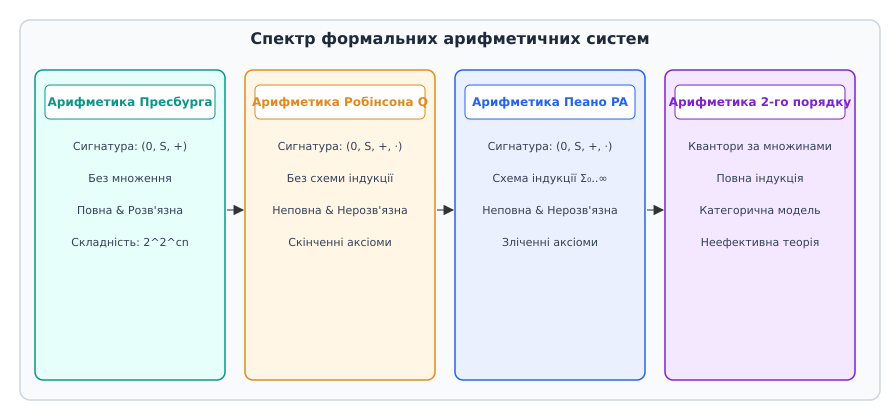
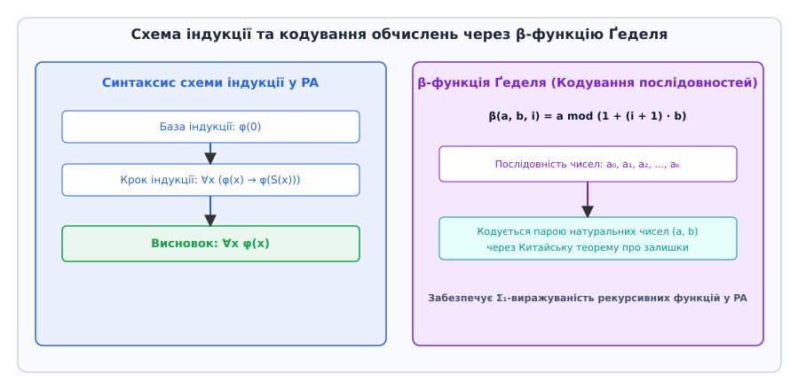
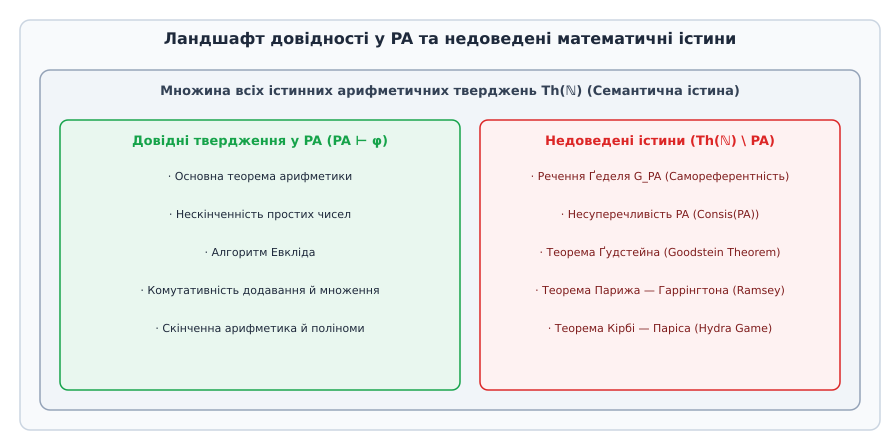

# Арифметика Пеано

<preknowlist>
- [Логіка першого порядку](root:computability/descriptive-complexity) — терми, предикати, квантори, синтаксис та семантика вираження властивостей.
- [Теорема Ґеделя про неповноту](root:math-logic/godel-incompleteness) — кодування синтаксису, самореферентність та межі формальних систем.
- [Проблема зупинки Тюринга](root:computability/halting-problem) — алгоритмічна нерозв'язність аналізу поведінки детермінованих обчислювальних процесів.
</preknowlist>

Спроба опису натуральних чисел `ℕ = {0, 1, 2, 3, ...}` (з латинської *arithmetica*, від грецького ἀριθμός — «число») за допомогою скінченної множини логічних аксіом здавалася математикам XIX століття технічною формальністю. Проте коли інтуїтивне уявлення про лічбу зіткнулося з формальними парадоксами теорії множин, виявилося, що просте правило «до кожного числа можна додати одиницю» приховує в собі фундаментальний водорозділ між обчислювальністю, довідністю та семантичною істиною.

Арифметика Пеано (Peano Arithmetic, PA) — це формальна аксіоматична теорія першого порядку, побудована для фіксації алгебраїчних та індуктивних властивостей натуральних чисел. Вона є фундаментальним об'єктом теорії алгоритмів та математичної логіки, оскільки саме у системі `PA` формалізуються поняття рекурсивних функцій, кодування синтаксису, роботи машин Тюринга та межі автоматичного доведення теорем.

## 1. Криза інтуїції та необхідність формалізації лічби

Протягом тисячоліть натуральні числа сприймалися як інтуїтивно зрозумілий первинний об'єкт. Математики припускали, що будь-яке істинне твердження про додавання та множення чисел можна легко довести, якщо систематично застосовувати логічні міркування. Проте стрімке поглиблення математичного аналізу у XIX столітті показало, що неконтрольована інтуїція призводить до суперечностей.

Коли Бертран Рассел у 1901 році продемонстрував, що наївна теорія множин Готлоба Фреге містить руйнівний парадокс `R = {x | x ∉ x}`, а Георг Кантор та Чезаре Буралі-Форті виявили парадокси нескінченних множин та ординальних чисел, стало зрозуміло: математика не може спиратися на розмиті поняття «множини всіх елементів, які мають певну властивість». На початку XX століття у вищому математичному світі виникло три основних філософсько-методологічних напрями щодо обґрунтування математики:

1. **Логіцизм (Готлоб Фреге, Бертран Рассел, Альфред Норт Уайтхед):** Прагнув повністю звести арифметику та всю математику до чистої логіки вищих порядків у праці *Principia Mathematica*.
2. **Інтуїціонізм (Лейтзен Егберт Ян Брауер, Аренд Гейтінг):** Стверджував, що натуральні числа є первинною конструктивною інтуїцією людського розуму, і відкидав закон виключеного третього `A ∨ ¬A` та чисті теореми існування для нескінченних множин.
3. **Формалізм (Давид Гільберт):** Пропонував розглядати математику як гру зі скінченними синтаксичними символами за чіткими строгими правилами, абстрагуючись від їх змістовного значення.

Щоб усунути суперечності та захистити класичний аналіз, Давид Гільберт на II Міжнародному конгресі математиків у Парижі у 1900 році поставив Другу проблему зі свого знаменитого списку 23 проблем: довести несуперечливість аксіом арифметики чисто фінітними логічними засобами.

Гільбертівська програма висувала три стрижневі вимоги до формалізованої арифметики:
- **Повнота (Completeness):** Кожне істинне арифметичне речення має формальне доведення.
- **Несуперечливість (Consistency):** У теорії принципово неможливо вивести суперечність `0 = 1`.
- **Розв'язність (Entscheidungsproblem):** Існує механічний алгоритм перевірки довідності будь-якої формули.

Упродовж 1920-х років у Гьоттінгенській математичній школі під керівництвом Гільберта (за участі Пауля Бернайса, Вільгельма Аккермана та Джона фон Ноймана) велася інтенсивна робота над побудовою такої фінітної системи. Проте у 1930 році на конференції у Кенігсбергу 25-річний австрійський математик Курт Ґедель зробив коротке оголошення, яке назавжди змінило ландшафт логіки та теорії алгоритмів.

Для реалізації цієї програми необхідно було чітко зафіксувати:
- З яких саме вихідних символів конструюються вирази.
- Які аксіоми вважаються істинними за визначенням.
- Які точні синтаксичні правила дозволяють отримувати нові твердження з вже доведених.

Аксіоматизація натуральних чисел стала першим і найважливішим випробувальним майданчиком формалізму. Детальний історичний огляд переходу від комбінаторних ідей Германа Грассмана та теоретико-множинного аналізу Ріхарда Дедекінда до символічного формалізму Джузеппе Пеано 1889 року наведено у вставці [📜 Історія формалізації арифметики: від Грассмана та Дедекінда до Пеано](root:math-logic/peano-arithmetic/hist-peano-dedekind.md).

## 2. Сигнатура та мова арифметики Пеано

Щоб описати арифметику як формальну систему першого порядку, слід зафіксувати її мову `L_PA`. Сигнатура цієї мови складається з таких строго визначених синтаксичних символів:

- **Константа:** `0` (нуль).
- **Унарний функціональний символ:** `S` (операція взяття наступника, від англійського *successor*, `S(x) = x + 1`).
- **Бінарні функціональні символи:** `+` (додавання) та `·` (множення).
- **Предикатний символ рівності:** `=`.

У мові `L_PA` немає явних окремих символів для конкретних чисел `1, 2, 3, 42...`. Замість цього кожне натуральне число `n ∈ ℕ` синтаксично кодується у вигляді **нумерала** `n̄`, який отримують послідовним застосуванням оператора `S` до константи `0`:

```
0̄ = 0
1̄ = S(0)
2̄ = S(S(0))
3̄ = S(S(S(0)))
n̄ = S(S(...S(0)...))    [n разів]
```

Формальне синтаксичне дерево термів та формул мови `L_PA` будується індуктивно за такими суворими правилами:

### 2.1. Індуктивне визначення термів та підстановки
1. **База:** Константа `0` є термом. Довільна змінна `x, y, z, x₁, x₂...` є термом.
2. **Індукційний крок:** Якщо `t₁` та `t₂` — терми, то:
   - `S(t₁)` є термом (наступник).
   - `(t₁ + t₂)` є термом (сума).
   - `(t₁ · t₂)` є термом (добуток).

Ніщо інше не є термом. Терм називається **замкненим**, якщо він не містить вільних змінних. Наприклад, `S(S(0) + S(0))` — замкнений терм, а `S(x + 0)` — відкритий терм зі вільною змінною `x`.

Операція підстановки терма `s` замість вільної змінної `x` у термі `t` позначається `t[x ↦ s]` і виконується структурною рекурсією. Підстановка називається **вільною від захоплення змінних** (capture-avoiding), якщо жодна вільна змінна терма `s` не стає зв'язаною квантором у результаті підстановки.

### 2.2. Побудова формул та синтаксичні скорочення
- **Атомарна формула:** Якщо `t₁` та `t₂` є термами, то вираз `t₁ = t₂` є атомарною формулою.
- **Складені формули:** Якщо `φ` та `ψ` є формулами, то `¬φ`, `(φ ∧ ψ)`, `(φ ∨ ψ)`, `(φ → ψ)`, `(φ ↔ ψ)` є формулами.
- **Квантифікація:** Якщо `φ` — формула, а `x` — змінна, то `∀x φ` та `∃x φ` є формулами.

Спеціальні математичні відносини та поняття не вводяться як нові вихідні символи сигнатури, а виражаються як синтаксичні скорочення (абревіатури):

1. **Відношення порядку:**
```
x ≤ y  ≡  ∃z (x + z = y)
x < y  ≡  ∃z (S(x) + z = y)
```

2. **Відношення діливості (`x` ділить `y`):**
```
x | y  ≡  ∃z (x · z = y)
```

3. **Предикат простого числа (`x` є простим числом):**
```
Prime(x)  ≡  S(0) < x ∧ ∀y ∀z (x = y · z → y = S(0) ∨ z = S(0))
```

4. **Порівняння за модулем (`x ≡ y (mod m)`):**
```
ModEq(x, y, m)  ≡  ∃k (x = y + k · m) ∨ ∃k (y = x + k · m)
```

Стандартною семантичною моделлю мови `L_PA` є **стандартна модель арифметики** `ℕ = (ℕ, 0, S, +, ·, =)`, у якій константа `0` інтерпретується як число нуль, `S` — як додавання одиниці, `+` та `·` — як звичайні арифметичні додавання та множення над множиною натуральних чисел.

## 3. Аксіоматика Пеано першого порядку та виведення основних алгебраїчних законів

Формальна теорія `PA` будується у численні предикатів першого порядку. Її аксіоми поділяються на дві групи: алгебраїчні аксіоми для функціональних символів `S, +, ·` та нескінченну схему аксіом індукції.

### 3.1. Аксіоматизація рівності та конгруентність

Оскільки рівність `=` є первинним предикатним символом, теорія `PA` містить стандартні аксіоми рівності першого порядку:
1. **Рефлексивність:** `∀x (x = x)`.
2. **Симетричність:** `∀x ∀y (x = y → y = x)`.
3. **Транзитивність:** `∀x ∀y ∀z (x = y ∧ y = z → x = z)`.
4. **Аксіоми конгруентності для функцій:**
   - `∀x ∀y (x = y → S(x) = S(y))`
   - `∀x₁ ∀x₂ ∀y₁ ∀y₂ (x₁ = y₁ ∧ x₂ = y₂ → x₁ + x₂ = y₁ + y₂)`
   - `∀x₁ ∀x₂ ∀y₁ ∀y₂ (x₁ = y₁ ∧ x₂ = y₂ → x₁ · x₂ = y₁ · y₂)`

### 3.2. Алгебраїчні аксіоми Пеано

```
1. ∀x ¬(S(x) = 0)                       [Нуль не є наступником жодного числа]
2. ∀x ∀y (S(x) = S(y) → x = y)           [Ін'єктивність оператора S]
3. ∀x (x + 0 = x)                       [База додавання]
4. ∀x ∀y (x + S(y) = S(x + y))           [Крок додавання]
5. ∀x (x · 0 = 0)                       [База множення]
6. ∀x ∀y (x · S(y) = (x · y) + x)        [Крок множення]
```

Розглянемо фундаментальну роль кожної аксіоми:
- **Перша аксіома** `∀x ¬(S(x) = 0)` гарантує, що оператор наступника не зациклюється назад у нуль. Без цієї аксіоми модель могла б складатися з єдиного елемента `0 = S(0)`, у якому всі числа збігаються.
- **Друга аксіома** `∀x ∀y (S(x) = S(y) → x = y)` встановлює ін'єктивність (однозначність) відображення наступника. Вона забороняє злиття двох різних числових гілок в одну.
- **Аксіоми (3)–(6)** є рекурсивними обчислювальними визначеннями додавання та множення. Вони дозволяють редукувати будь-яку алгебраїчну операцію над константними нумералами до послідовного зсуву оператора `S`.

### 3.3. Схема аксіом індукції (Induction Axiom Schema)

У логіці першого порядку ми не можемо кількісно охопити «всі можливі підмножини» натуральних чисел квантором `∀X`, оскільки зв'язані змінні першого порядку пробігають лише окремі елементи (числа). Тому математична індукція у `PA` формулюється як **зліченна схема аксіом**:

Для кожної формули `φ(x, y₁, ..., y_k)` мови `L_PA` з виділеною вільною змінною `x` виводиться окрема аксіома:

```
(φ(0) ∧ ∀x (φ(x) → φ(S(x)))) → ∀x φ(x)
```

Ця схема означає: якщо предикат `φ` виконується для `0`, і з припущення істинності `φ(x)` випливає істинність `φ(S(x))`, то `φ` виконується для всіх натуральних чисел. Оскільки синтаксично коректних формул мови `L_PA` існує зліченна кількість `ℵ₀`, то й формальна теорія `PA` містить нескінченно багатьох аксіом.

### 3.4. Приклад покрокового доведення комутативності додавання `0 + x = x`

Проілюструємо, як за допомогою схеми індукції доводиться ліва база додавання `0 + x = x`, яка не входить до аксіом `PA` безпосередньо.

**Доведення (індукцією за змінною `x`):**
1. **База індукції (`x = 0`):**
   Нам потрібно довести `0 + 0 = 0`.
   За аксіомою (3) `x + 0 = x`, підставляючи `x = 0`, отримуємо `0 + 0 = 0`. Базу доведено.

2. **Крок індукції (`0 + x = x → 0 + S(x) = S(x)`):**
   Припустимо індукційну гіпотезу: `0 + x = x`.
   Розглянемо ліву частину для `S(x)`: `0 + S(x)`.
   За аксіомою (4) `a + S(b) = S(a + b)`, підставляючи `a = 0, b = x`, отримуємо:
   `0 + S(x) = S(0 + x)`.
   Застосовуючи індукційну гіпотезу `0 + x = x`, замінюємо внутрішній вираз:
   `S(0 + x) = S(x)`.
   Отже, `0 + S(x) = S(x)`. Крок індукції доведено.

3. **Висновок:**
   За аксіомою індукції для формули `φ(x) ≡ (0 + x = x)` отримуємо `∀x (0 + x = x)`. ∎

### 3.5. Виведення асоціативності та комутативності множення

Спираючись на тотожність `0 + x = x` та комутативність додавання, доведемо комутативність множення `x · y = y · x`:

1. **Допоміжна лема 1 (`0 · x = 0`):**
   Доводиться індукцією за `x`. Для `x = 0` за аксіомою (5) `0 · 0 = 0`. Для `S(x)` маємо `0 · S(x) = 0 · x + 0 = 0 + 0 = 0`. Лему доведено.

2. **Допоміжна лема 2 (`S(x) · y = x · y + y`):**
   Доводиться індукцією за `y`. Для `y = 0` маємо `S(x) · 0 = 0` та `x · 0 + 0 = 0 + 0 = 0`. Для `S(y)` використовується асоціативність та комутативність додавання.

3. **Основна теорема комутативності (`x · y = y · x`):**
   Доводиться індукцією за `y`:
   - **База `y = 0`:** `x · 0 = 0` (аксіома 5), а `0 · x = 0` (лема 1). Обидві частини рівні.
   - **Крок `y → S(y)`:** Ліва частина `x · S(y) = x · y + x` (аксіома 6).
     За індукційною гіпотезою `x · y = y · x`. Отже `x · S(y) = y · x + x`.
     За лемою 2 `S(y) · x = y · x + x`.
     Отже, `x · S(y) = S(y) · x`. Крок доведено. ∎

### 3.6. Сильна індукція та трансфінітна індукція у PA

У математичній практиці часто використовується **сильна (повна) індукція**: щоб довести `φ(x)`, припускають істинність `φ(y)` для всіх `y < x`:

```
∀x ((∀y < x φ(y)) → φ(x)) → ∀x φ(x)
```

У логіці першого порядку можна довести, що сильна індукція є еквівалентною звичайній схемі індукції Пеано. Для доведення розглядають допоміжну формулу `ψ(x) ≡ ∀y < x φ(y)` і застосовують до неї стандартну аксіому індукції.

### 3.7. Арифметична ієрархія формул (Arithmetical Hierarchy)

Залежно від кількості та чергування кванторів, формули мови `L_PA` класифікуються в арифметичну ієрархію:
- **`Δ₀` (або `Σ₀`, `Π₀`):** Формули, що містять лише обмежені квантори `(∀x ≤ t)` та `(∃x ≤ t)`. Усі предикати `Δ₀` є алгоритмічно розв'язуваними за скінченне число кроків.
- **`Σ₁`:** Формули вигляду `∃x₁ ... ∃x_k ψ`, де `ψ ∈ Δ₀`. Вони виражають перераховувані (n.r.) властивості та зупинку алгоритмів.
- **`Π₁`:** Формули вигляду `∀x₁ ... ∀x_k ψ`, де `ψ ∈ Δ₀`. Вони виражають універсальні властивості (наприклад, несуперечливість теорії `Consis(PA)` або Велику теорему Ферма).
- **`Σ_n` та `Π_n`:** Формули з `n` чергуваннями необмежених кванторів.

## 4. Спектр арифметичних систем: Пресбургер, Робінсон та Пеано

Щоб зрозуміти, яку саме роль відіграє кожна аксіома та операція у `PA`, розглянемо спектр формальних арифметичних теорій.


*Спектр арифметичних систем від арифметики Пресбурга до PA другого порядку: експресивність, розв'язність та повнота.*

### 4.1. Арифметика Пресбурга (Presburger Arithmetic) та елімінація кванторів

Якщо з мови `L_PA` повністю вилучити операцію множення `·`, залишивши лише `(0, S, +)`, ми отримаємо **арифметику Пресбурга** (`PA \ {·}`), сформульовану польським математиком Мойжешем Пресбургером у 1929 році.

Арифметика Пресбурга володіє унікальними властивостями:
- **Вона є синтаксично повною:** для будь-якої замкненої формули `φ` мови додавання, або `PA \ {·} ⊢ φ`, або `PA \ {·} ⊢ ¬φ`.
- **Вона є алгоритмічно розв'язуваною:** існує детермінований алгоритм (заснований на елімінації кванторів), який перевіряє істинність довільного аддитивного твердження.

Алгоритм елімінації кванторів у Пресбургера працює шляхом зведення будь-якої формули `∃x φ(x)` до еквівалентної бескванторної системи лінійних порівнянь за модулем (система порівнянь `a · x ≡ b (mod m)`).

Для автоматичного розв'язання формул Пресбурга використовують такі алгоритми, як алгоритм Купера (Cooper's Algorithm) та Omega Test. Часова складність найгіршого випадку для перевірки формул в арифметиці Пресбурга є двократно експоненціальною `2^(2^(c·n))`. Проте ціна розв'язності — обмежена експресивність. В арифметиці Пресбурга неможливо виразити поняття простого числа, ділимості, кодування послідовностей чи виконання алгоритмів.

### 4.2. Арифметика Робінсона Q (Robinson Arithmetic)

Що станеться, якщо ми повернемо множення `·`, але повністю вилучимо схему аксіом індукції? Рафаель Робінсон у 1953 році створив **арифметику Робінсона Q** — скінченно аксіоматизовану теорію, яка містить 7 алгебраїчних аксіом:

```
1. ¬(S(x) = 0)
2. S(x) = S(y) → x = y
3. x = 0 ∨ ∃y (x = S(y))
4. x + 0 = x
5. x + S(y) = S(x + y)
6. x · 0 = 0
7. x · S(y) = (x · y) + x
```

Дивовижний факт полягає у тому, що навіть без індукції арифметика Робінсона `Q` є **істотно нерозв'язною та неповною**! Операція множення `·` дозволяє кодувати обчислення машин Тюринга. Проте `Q` є надзвичайно слабкою теорією: у ній неможливо довести навіть такі базові загальні твердження, як комутативність додавання `∀x ∀y (x + y = y + x)` або що `x + 1 ≠ x`.

### 4.3. Арифметика Пеано другого порядку (PA₂)

У логіці другого порядку аксіома індукції записується як єдина формула з квантором за множинами:

```
∀X ((0 ∈ X ∧ ∀x (x ∈ X → S(x) ∈ X)) → ∀x (x ∈ X))
```

Арифметика другого порядку є **категоричною**: її єдиною моделлю з точністю до ізоморфізму є стандартний ряд натуральних чисел `ℕ`. Проте за це доводиться платити втратою алгоритмічної зліченності правил виведення: логіка другого порядку не має повної дедуктивної системи (теорема Гьоделя про неповноту логіки другого порядку).

## 5. Кодування обчислень, β-функція Ґеделя та Σ₁-виражуваність

Головна сила арифметики Пеано полягає у її здатності кодувати складні обчислювальні структури даних (масиви, списки, графіки виконання програм) за допомогою числових відносин.


*Ієрархія формул і кодування обчислень через β-функцію Ґеделя.*

### 5.1. Функції парності Кантора

Для кодування впорядкованої пари натуральних чисел `(x, y)` єдиним числом використовується поліноміальна **функція парності Кантора** (Cantor Pairing Function):

```
⟨x, y⟩ = ((x + y) · (x + y + 1)) / 2 + y
```

Ділення на `2` синтаксично виражається у `PA`, оскільки добуток двох послідовних натуральних чисел `(x+y)(x+y+1)` завжди є парним числом. Існують також зліченні зворотні функції-проекції `π₁(z)` та `π₂(z)` такі, що `π₁(⟨x, y⟩) = x` та `π₂(⟨x, y⟩) = y`, які є первісно-рекурсивними і виражаються `Δ₀`-формулами.

### 5.2. β-функція Ґеделя (Gödel's Beta Function)

Щоб виразити факт «алгоритм `A` на кроці `t` перебуває у стані `q`», необхідно вміти кодувати послідовності чисел довільної довжини `a₀, a₁, ..., a_k` єдиним натуральним числом.

Курт Ґедель у праці 1931 року спочатку кодував послідовності через піднесення простих чисел у степеновому розкладі `2^(a₀+1) · 3^(a₁+1) · ... · p_k^(a_k+1)`. Проте піднесення до степеня не є базовим функціональним символом мови `L_PA`. Щоб уникнути додавання нового символу, Ґедель розробив **β-функцію**, яка спирається на Китайську теорему про залишки:

```
β(a, b, i) = a mod (1 + (i + 1) · b)
```

> **Лема Ґеделя про β-функцію:**
> Для довільної скінченної послідовності натуральних чисел `a₀, a₁, ..., a_k` існують натуральні числа `a` та `b` такі, що для кожного `0 ≤ i ≤ k`:
> `β(a, b, i) = a_i`.

**Обчислений приклад кодування послідовності `(5, 12, 3)`:**
1. Кількість елементів `k = 3`. Максимальний елемент `m = max(3, 5, 12, 3) = 12`.
2. Обчислюємо факторіал `b = m! = 12! = 479001600`.
3. Формуємо три модулі:
   - `m₀ = 1 + (0 + 1) · b = 1 + 479001600 = 479001601`
   - `m₁ = 1 + (1 + 1) · b = 1 + 2 · 479001600 = 958003201`
   - `m₂ = 1 + (2 + 1) · b = 1 + 3 · 479001600 = 1437004801`
4. За Китайською теоремою про залишки знаходимо число `a`, таке що:
   - `a ≡ 5 (mod m₀)`
   - `a ≡ 12 (mod m₁)`
   - `a ≡ 3 (mod m₂)`
5. Тоді `β(a, b, 0) = 5`, `β(a, b, 1) = 12`, `β(a, b, 2) = 3`.

Предикат `y = β(a, b, i)` виражається у `PA` за допомогою бескванторної арифметичної формули, оскільки операція остачі від ділення `a mod m` записується через множення та додавання: `∃q (a = q · m + y ∧ y < m)`.

### 5.3. Виражуваність первісно-рекурсивних функцій (Primitive Recursion)

Первісно-рекурсивні функції будуються з вихідних функцій (нуль, наступник, проекції) за допомогою операцій композиції та первісної рекурсії:

```
f(x, 0) = g(x)
f(x, S(y)) = h(x, y, f(x, y))
```

Завдяки β-функції Ґеделя, існування значення `f(x, y) = z` еквівалентне існуванню закодованої послідовності `(a, b)` довжини `y + 1`, у якій перший елемент дорівнює `g(x)`, а кожен наступний пов'язаний із попереднім за допомогою функції `h`.

Узагальнення на всі обчислювані функції досягається додаванням оператора мінімізації (`μ-оператора`):

```
f(x) = μy (g(x, y) = 0)
```

За теоремою Кліні про нормальну форму (Kleene's Normal Form Theorem), будь-яку частково рекурсивну функцію можна представити у формі `f(x) = U(μy (T(e, x, y) = 0))`, де `T` — предикат Кліні, який перевіряє, чи кодує `y` успішний протокол обчислення програми `e` на вході `x`.

> **Теорема про виражуваність:**
> Будь-яка частково рекурсивна функція (і відповідно будь-яка обчислювана програма на машині Тюринга) є **`Σ₁`-виражуваною у `PA`**.

Це означає, що існує `Σ₁`-формула `Halts(M, w, t)`, яка синтаксично стверджує: «Машина Тюринга `M` з вхідним словом `w` зупиняється за `t` кроків».

> 🔧 **Навіщо це.**
> Здатність `PA` виражати виконання програм перетворює формальну арифметику на універсальну мову специфікації обчислень. Будь-яка проблема верифікації програмного забезпечення (відсутності виходу за межі масиву, відсутності дедлоків, відповідності специфікації) може бути сформульована як арифметична формула мови `PA`.

Для практичного ознайомлення з тим, як виконується символьна редукція термів та перевірка кроків виведення, розроблено практичний проект у вставці [⚙️ Інтерпретатор та верифікатор символьних виразів арифметики Пеано](root:math-logic/peano-arithmetic/proj-peano-interpreter.md).

Також специфікацію системних функцій та кодів помилок для побудови промислових верифікаторів наведено у вставці [📋 Інтерфейс та специфікація модулів верифікації формальних доведень PA](root:math-logic/peano-arithmetic/api-peano-proof-checker.md).

## 6. Неповнота, недоведені істини та теорема Парижа — Гаррінгтона

Оскільки арифметика Пеано здатна кодувати власні синтаксичні формули та доведення (через Ґеделеву нумерацію `┌φ┐`), на неї поширюються перша та друга теореми Ґеделя про неповноту.


*Взаємозв'язок між довідністю в PA, нерозв'язними комбінаторними твердженнями та нестандартними моделями.*

### 6.1. Речення Ґеделя та умови доказовості Гільберта — Бернайса

Ключовим елементом побудови недовідних речень є **Лема про нерухому точку (Fixpoint Lemma)**: для довільної формули `A(x)` з однією вільною змінною існує таке замкнене речення `F`, що `PA ⊢ F ↔ A(┌F┐)`.

Застосовуючи цю лему до предиката недоказуваності `¬ Prov_PA(x)`, Ґедель сконструював речення `G_PA`:

1. **Перша теорема Ґеделя:** Існує таке замкнене арифметичне речення `G_PA`, яке є істинним у стандартній моделі `ℕ`, але **недовідним і неспростовним у `PA`**:

```
PA ⊬ G_PA   та   PA ⊬ ¬G_PA
```

2. **Друга теорема Ґеделя:** Формула `Consis(PA)`, яка арифметично виражає синтаксичну несуперечливість теорії `PA` (`¬ ∃p Prov_PA(p, ┌0 = 1┐)`), не може бути доведена всередині самої `PA`:

```
PA ⊬ Consis(PA)
```

Предикат доказовості `Prov_PA(x)` задовольняє три **умови доказовості Гільберта — Бернайса**:
1. Якщо `PA ⊢ φ`, то `PA ⊢ Prov_PA(┌φ┐)`.
2. `PA ⊢ Prov_PA(┌φ → ψ┐) → (Prov_PA(┌φ┐) → Prov_PA(┌ψ┐))`.
3. `PA ⊢ Prov_PA(┌φ┐) → Prov_PA(┌Prov_PA(┌φ┐)┐)`.

З цих умов випливає **теорема Льоба (Löb's Theorem)**: `PA ⊢ Prov_PA(┌φ┐) → φ` тоді й лише тоді, коли `PA ⊢ φ`.

Джон Россер (John Rosser) у 1936 році вдосконалив конструкцію Ґеделя, створивши речення Россера `R_PA`, яке дозволило послабити вимогу `ω-несуперечливості` до звичайної синтаксичної несуперечливості `PA`.

Також з теорем неповноти випливає **теорема Тарського про невиражуваність істини** (Tarski's Undefinability Theorem): предикат арифметичної істини `True_N(x)`, який справджується для Ґеделевих номерів усіх істинних формул стандартної моделі `ℕ`, не є виражуваним жодною формулою першого порядку у `PA`.

### 6.2. Природні недоведені комбінаторні теореми

Довгий час математики вважали, що недовідні твердження Ґеделя є штучними синтаксичними конструкціями, створеними виключно через самореференцію («Я недоведене речення»). Проте у другій половині XX століття було відкрито цілу низку строго математичних, комбінаторних тверджень, які мають просте формулювання, є істинними для звичайних чисел, але **принципово не доводяться в арифметиці Пеано**:

1. **Теорема Ґудстейна (Goodstein's Theorem, 1944):**
   Розглянемо приклад побудови послідовності Ґудстейна. Запишемо число `n = 4` у спадковій основі 2: `4 = 2^2`.
   - **Крок 1:** Замінюємо основу 2 на 3 та віднімаємо 1: `3^3 - 1 = 26`.
   - **Крок 2:** Записуємо 26 у спадковій основі 3: `26 = 2 · 3^2 + 2 · 3 + 2`. Замінюємо основу 3 на 4 та віднімаємо 1: `2 · 4^2 + 2 · 4 + 1 = 41`.
   - **Крок 3:** Замінюємо основу 4 на 5 та віднімаємо 1: `2 · 5^2 + 2 · 5 = 60`.
   Незважаючи на колосальний ріст значень на перших кроках (числа швидко досягають `10^100`), теорема Ґудстейна стверджує, що будь-яка така послідовність обов'язково знижується до нульового значення `0` за скінченне число кроків. Доведення спирається на заміщення основи на трансфінітний ординал `ω`, що утворює строго спадний ланцюжок ординалів `α₀ > α₁ > α₂...`. Оскільки ординали є цілком впорядкованою множиною, нескінченного спадання бути не може, тому послідовність термінує. Проте довести це у `PA` неможливо, оскільки функція росту перевищує всі рекурсивні функції `PA`.

2. **Теорема Парижа — Гаррінгтона (Paris-Harrington Theorem, 1977):**
   Посилена скінченна теорема Рамсея про існування великих монохроматичних підмножин у розфарбованих графах є істинною, але не доводиться у `PA`.

3. **Гра Гідри Кірбі — Паріса (Kirby-Paris Hydra Game, 1982):**
   Гідра представляє собою впорядковане дерево. Геракл відтинає одну голову (листок). Гідра вирощує `n` нових копій відтятої гілки на рівень вище. Гра завжди завершується перемогою Геракла, але доведення цієї завершуваності виходить за межі синтаксичної сили індукції першого порядку.

### 6.3. Ординальний аналіз та теорема Ґентцена (1936)

Німецький математик Герхард Ґентцен (Gerhard Gentzen) у 1936 році довів несуперечливість `PA`, використавши правило трансфінітної індукції до ординала Кантора `ε₀` (який виражається як границя `ω, ω^ω, ω^(ω^ω)...`).

Це доведення показало точну межу доказової сили `PA`:
- Арифметика Пеано здатна довести трансфінітну індукцію для будь-якого ординала `α < ε₀`.
- `PA` принципово не здатна довести індукцію для самого ординала `ε₀`.

Глибокий математичний аналіз того, чому саме ці теореми є недовідними у `PA`, спирається на існування **нестандартних моделей арифметики** з нескінченно великими елементами. Детальний модельно-теоретичний розбір та доведення за допомогою теореми Сколема наведено у вставці [🧮 Нестандартні моделі арифметики Пеано та теорема Сколема](root:math-logic/peano-arithmetic/math-nonstandard-models.md).

## 7. Практичне значення у сучасних SMT-редукторах та інженерії верифікації

Хоча арифметика Пеано є нерозв'язною у загальному випадку, її підмножини та фрагменти формують основу сучасних інструментів автоматизованого аналізу програмного забезпечення.

### 7.1. SMT-солівери (Satisfiability Modulo Theories) та фрагменти LIA / NIA

Сучасні інструменти автоматичного доведення, такі як **Z3** (Microsoft Research), **CVC5** та **Yices**, використовують алгоритми елімінації кванторів та симплекс-метод для розв'язання формул арифметики Пресбурга (`PA \ {·}`).

Архітектура SMT-соліверів спирається на парадигму DPLL(T):
- **SAT-рушій (DPLL):** Займається комбінаторним пошуком оцінок для логічних зв'язок `∧, ∨, ¬`.
- **T-солівер (Theory Solver):** Перевіряє сумісність отриманих числових нерівностей у теорії Linear Integer Arithmetic (LIA).

Коли у програмі виникає множення на константу (наприклад, обчислення зміщення в масиві `i * 4`), SMT-редуктор зводить це до додавання, залишаючись у межах розв'язної арифметики Пресбурга. Якщо ж у виразі з'являється множення двох змінних `x * y` (теорія Non-linear Integer Arithmetic, NIA), солівер застосовує евристичні методи абстракції або обмежену індукцію (Bounded Model Checking).

### 7.2. Інтерактивні доводчики теорем (Proof Assistants) та ізоморфізм Каррі — Говарда

У системах верифікації критичного програмного забезпечення, таких як **Coq**, **Isabelle/HOL** та **Lean 4**, арифметика Пеано слугує еталонним типом даних для моделювання дискретних станів. В індуктивних типах даних Lean 4 формулюються так:

```lean
inductive Nat : Type
| zero : Nat
| succ (n : Nat) : Nat
```

З точки зору **ізоморфізму Каррі — Говарда** (Curry-Howard Isomorphism), математичне доведення арифметичного твердження дорівнює виконуваній програмі, а сама формула — її типу даних («Доведення як програми, Твердження як типи»). Реалізація схеми індукції відповідає функції вищого порядку рекурсивного обходу терма.

Завдяки цьому інструменту програмісти здатні здійснювати математично верифіковану розробку: доводити відсутність помилок переповнення буфера, математичну точність алгоритмів криптографії та відповідність складних ядер операційних систем (проект seL4) їхнім формальним логічним специфікаціям.

Арифметика Пеано залишається чудовим прикладом того, як спроба формалізувати найпростішу дитячу лічбу відкрила найглибші закони теорії обчислень, встановивши непорушний зв'язок між символьною логікою, комбінаторикою та межами штучного інтелекту.
