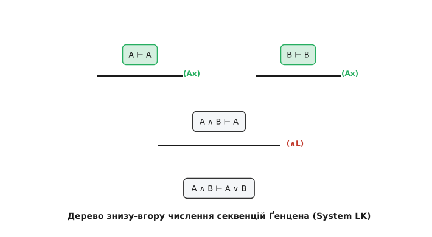

# Системи дедукції: секвенційне числення Ґентцена та системи Гільберта

<preknowlist>
- [Числення висловлювань](root:math-logic/propositional-logic) — аксіоматика, правила виводу та пропозиційні зв'язки.
- [Логіка першого порядку](root:math-logic/first-order-logic) — квантори, предикати та семантика Тарського.
- [Таблиці істинності](root:math-logic/truth-tables) — семантична тавтологічність виразів.
</preknowlist>

Формальне доведення у математичній логіці — це скінченна послідовність формул або синтаксичне дерево виводу, побудоване за суворими правилами дедукції від вихідних аксіом до шуканого висновку.

Проте формальні системи дедукції суттєво відрізняються за своєю архітектурою, призначенням та метаматематичними властивостями. Історично склалися два головних класи формальних систем: **аксіоматичні системи Гільбертівського типу (Hilbert-style systems)**, орієнтовані на мінімалізм аксіом, та **структурні системи Ґентцена (Секвенційне числення LK/LJ та Природна дедукція)**, орієнтовані на симетричний обхід синтаксичного дерева та автоматизацію виводу.

> 🔧 **Навіщо це.**
> Секвенційне числення Ґентцена є фундаментом сучасного автоматичного доведення теорем, виправлення типів (Type Checking), аналізу незалежності аксіом у системі Coq / Lean та ізоморфізму Каррі-Говарда у теоретичній інформатиці.

---

## 1. Системи Гільбертівського Типу (Hilbert Systems)

Системи Гільберта будуються на ідеї використання мінімальної кількості правил виводу (як правило, лише Modus Ponens) за рахунок багатого набору складних аксіоматичних схем.

### Синтаксична структура
Формальний вивід теореми `A` з множини гіпотез `Γ` у системі Гільберта — це послідовність формул `A₁`, `A₂`, …, `Aₙ`, де `Aₙ = A`, і кожна формула `Aᵢ` задовольняє одну з трьох умов:
1. `Aᵢ ∈ Γ` (є гіпотезою);
2. `Aᵢ` є екземпляром однієї з аксіом системи;
3. `Aᵢ` отримано з попередніх формул `Aⱼ, Aₖ` (`j, k < i`) за правилом Modus Ponens:

```text
Aⱼ,    Aⱼ ⇒ Aᵢ
================== [Modus Ponens]
Aᵢ
```

### Переваги та обмеження Гільбертівських систем
- **Переваги**: Надзвичайна простість для метаматематичних доведень (теорема про повноту, теорема про несуперечливість, кодування Ґеделя), оскільки система має мінімальну кількість правил виводу.
- **Недоліки**: Формальні доведення навіть елементарних теорем (наприклад, `A ⇒ A`) вимагають довгих штучних трюків і є абсолютно непридатними для автоматичного пошуку виводу комп'ютером.

---

## 2. Природна Дедукція Ґентцена (Natural Deduction, System N)

Числення секвенцій Ґенцена (System LK/LJ) оперує формальними об'єктами `Γ ⊢ Δ`, наближаючи математичне виведення до природного мислення.


*Розкладання секвенції знизу-вгору до аксіоматичних вершин у System LK.*

Прагнучи наблизити формальний вивід до реального мислення математиків, Герхард Ґентцен у 1934 році розробив систему Природної Дедукції.

У природній дедукції аксіоми повністю відсутні. Натомість для кожного логічного зв'язку (`∧`, `∨`, `⇒`, `¬`, `∀`, `∃`) визначається ровно пара симетричних правил:
1. **Правило Введення (Introduction Rule)** — показує, як побудувати формулу з цим зв'язком.
2. **Правило Елімінації (Elimination Rule)** — показує, як використовувати формулу з цим зв'язком для отримання нових наслідків.

### Правила для Імплікації та Кон'юнкції
- **Введення Імплікації (`⇒ I`)**: Якщо за припущення `A` можна вивести `B`, то виводиться `A ⇒ B`.
- **Елімінація Імплікації (`⇒ E`)**: З `A` та `A ⇒ B` виводиться `B` (Modus Ponens).
- **Введення Кон'юнкції (`∧ I`)**: З `A` та `B` виводиться `A ∧ B`.
- **Елімінація Кон'юнкції (`∧ E`)**: З `A ∧ B` виводиться `A`, або з `A ∧ B` виводиться `B`.

Дерево дедукції у природній дедукції розростається зверху вниз, утворюючи ієрархію тимчасових скинутих припущень (discharged assumptions).

---

## 3. Секвенційне Числення Ґентцена (Sequent Calculus, System LK/LJ)

Для аналізу структури доведень та автоматизації пошуку Ґентцен створив **Секвенційне числення LK** (для класичної логіки) та **LJ** (для інтуїціоністської логіки).

### Поняття Секвенції
Секвенція — це формальний вираз вигляду:

(∧ I)`Γ ⊢ Δ`(∧ I)

де Γ = A₁, …, Aₘ та Δ = B₁, …, Bₙ — скінченні мультимножини формул.
Семантичний зміст секвенції полягає у кон'юнкції лівої частини та диз'юнкції правої частини:

```text
(A₁ ∧ … ∧ Aₘ) ⇒ (B₁ ∨ … ∨ Bₙ)
```

Якщо ліва частина порожня (`⊢ Δ`), це означає істинність хоча б однієї формули з `Δ`. Якщо права частина порожня (`Γ ⊢`), це означає суперечливість гіпотез `Γ`.

---

## 4. Класифікація Правил Секвенційного Числення LK

Правила секвенційного числення LK поділяються на три класи: початкові аксіоми, структурні правила та логічні правила.

### 1. Початкова Аксіома (Identity Axiom)
Атомарне тотожність:

```text
===== [Identity Axiom]
A ⊢ A
```

### 2. Структурні Правила (Structural Rules)
- **Утончення (Weakening)**: Додавання довільної формули в антецедент або сукцедент:

```text
Γ ⊢ Δ
=========== [Weakening Left]
Γ, A ⊢ Δ

Γ ⊢ Δ
=========== [Weakening Right]
Γ ⊢ A, Δ
```

- **Скорочення (Contraction)**: Вилучення дублікатів формул:

```text
Γ, A, A ⊢ Δ
=========== [Contraction Left]
Γ, A ⊢ Δ

Γ ⊢ A, A, Δ
=========== [Contraction Right]
Γ ⊢ A, Δ
```

- **Перестановка (Exchange)**: Дозволяє змінювати порядок формул у мультимножині.

- **Переріз (Cut Rule)**: Правило проміжного висновку (леми):

`	ext
Γ ⊢ A, Δ    Γ', A ⊢ Δ'
====================== [Cut]
Γ, Γ' ⊢ Δ, Δ'
`

---

## 5. Логічні Правила Секвенційного Числення LK

Кожен логічний зв'язок отримує два правила: одне для введення в ліву частину (антецедент), інше — в праву частину (сукцедент).

### Правила для Імплікації (`⇒`)
- **Ліворуч (`⇒ L`)**:

`	ext
Γ ⊢ A, Δ    Γ', B ⊢ Δ'
====================== [⇒ Left]
Γ, Γ', A ⇒ B ⊢ Δ, Δ'
`

- **Праворуч (`⇒ R`)**:

```text
Γ, A ⊢ B, Δ
====================== [⇒ Right]
Γ ⊢ A ⇒ B, Δ
```

### Правила для Диз'юнкції (`∨`)
- **Ліворуч (`∨ L`)**:

```text
Γ, A ⊢ Δ    Γ, B ⊢ Δ
====================== [∨ Left]
Γ, A ∨ B ⊢ Δ
```

- **Праворуч (`∨ R`)**:

```text
Γ ⊢ A, B, Δ
====================== [∨ Right]
Γ ⊢ A ∨ B, Δ
```

### Правила для Заперечення (`¬`)
- **Ліворуч (`¬ L`)**:

```text
Γ ⊢ A, Δ
====================== [¬ Left]
Γ, ¬A ⊢ Δ
```

- **Праворуч (`¬ R`)**:

```text
Γ, A ⊢ Δ
====================== [¬ Right]
Γ ⊢ ¬A, Δ
```

---

## 6. Дзеркало Інтуїціонізму: Числення LJ

Інтуїціоністське секвенційне числення LJ отримується з класичного числення LK накладанням строгого синтаксичного обмеження:
> У будь-якій секвенції `Γ ⊢ Δ` сукцедент `Δ` містить **не більше однієї формули** (`|Δ| ≤ 1`).

Це синтаксичне обмеження повністю унеможливлює вивід закону виключеного третього (`⊢ A ∨ ¬A`) та закону подвійного заперечення (`¬¬A ⊢ A`), автоматично зводячи логіку до конструктивної [Семантика Кріпке](root:math-logic/kripke-semantics).

---

## 7. Головна Теорема Ґентцена: Hauptsatz (Cut Elimination Theorem)

Найвидатнішим досягненням Герхарда Ґентцена є **Теорема про Усунення Перерізу (Cut Elimination Theorem / Hauptsatz, 1934)**.

> **Теорема (Hauptsatz)**: Будь-яке доведення секвенції `Γ ⊢ Δ` у численні LK або LJ за допомогою правила Cut можна алгоритмічно перебудувати у доведення тієї ж секвенції **взагалі без використання правила Cut**.

### Математичне значення усунення Cut
Правило Cut уособлює використання допоміжних лем `A`, які відсутні у фінальному висновку `Γ ⊢ Δ`. Усунення Cut гарантує:
1. **Властивість підформульності (Subformula Property)**: Кожна формула, яка зустрічається у бескетовому доведенні секвенції `Γ ⊢ Δ`, є точною підформулою вихідних формул `Γ` або `Δ`.
2. **Абсолютна несуперечливість**: Прямий доказ несуперечливості формальної арифметики та числення предикатів без залучення семантичних моделей.
3. **Алгоритмічний децидер**: Можливість бестаргетованого обходу дерева виводу знизу вгору для автоматичного пошуку доведень.

---

## 8. Автоматичний Пошук Виводу та Зворотно-Спрямований Обхід

Властивість підформульності перетворює секвенційне числення на бектрекінговий алгоритм пошуку доведення.

Для перевірки секвенції `Γ ⊢ Δ`:
1. Ми застосовуємо логічні правила знизу вгору, розкладаючи формули на простіші підформули.
2. Якщо на всіх верхівках синтаксичного дерева утворюються початкові аксіоми `A ⊢ A`, секвенція є доведеною (тавтологічною).
3. Якщо на якійсь гілці формули розкладено до атомів, але аксіома `A ⊢ A` не виконується, ця гілка визначає **контрамодель** (контрекземпляр), що спростовує вихідне твердження.

---

## 9. Табличні методи (Semantic Tableaux) та методи семантичних дерев

Метод семантичних таблиць Еверта Бета та Раймонда Смалліана є елегантною дуальною формулюванням бескетового секвенційного числення.

У семантичних таблицях ми намагаємось побудувати інтерпретацію, яка спростовує формула `A` (тобто припускаємо, що `A` є хибною). Правила розщеплення дерев таблиць точно відповідають правилам секвенційного числення, застосованим знизу вгору.

Якщо всі гілки семантичного дерева закриваються (містять суперечність `P` та `¬P`), вихідна формула є тавтологією. Якщо хоча б одна гілка залишається відкритою, вона надає оцінку істинності для атомарних змінних, яка є контрамоделю.

---

## 10. Покрокова нормалізація дерев виводу у Природній Дедукції

У той час як у секвенційному численні усувається правило Cut, у Природній Дедукції відбувається аналогічний процес під назвою **Нормалізація доведення (Proof Normalization)**.

Обхід нормалізації вилучає так звані «обхідні шляхи» (Detours), коли за правилом введення логічного зв'язку одразу ж іде правило елімінації того ж самого зв'язку.

Наприклад, якщо за допомогою правила (∧ I)(\wedge I)(∧ I) побудовано формулу `A ∧ B`, а на наступному кроці застосовано правило (∧ I)(\wedge E_1)(∧ I) для отримання `A`:

```text
A    B
====== [∧ I]
A ∧ B
====== [∧ E₁]
A
```

Нормалізація згортає цей обхідний крок безпосередньо до доведення `A`. За теоремою Нормалізації, кожне доведення у природній дедукції можна звести до нормальної форми, що відповідає виконанню обчислень за ізоморфізмом Каррі-Говарда.

---

## 11. Синтаксична симетрія та дуальність Диз'юнкції і Кон'юнкції

Одним із головних естетичних і математичних здобутків секвенційного числення LK є повна симетричність відносно дзеркального відображення правил.

Двостороння форма секвенції `Γ ⊢ Δ` дозволяє трактувати ліву частину як гіпотези, що поєднуються кон'юнктивно, а праву — як висновки, що поєднуються диз'юнктивно. Перенесення формули `A` з антецедента у сукцедент перетворює її на ¬A.

Ця симетрія дозволяє легко виводити всі дуальні закони де Моргана та дуальність між кванторами загальності та існування у логіці першого порядку.

---

## 12. Субструктурні Логіки та відмова від структурних правил

Якщо вилучити або обмежити окремі структурні правила у численні Ґентцена, отримують **субструктурні логіки (Substructural Logics)**:

1. **Лінійна логіка Жан-Іва Жирара (Linear Logic)**: Вилучаються правила Скорочення (`C`) та Утончення (`W`). Кожна гіпотеза (ресурс) повинна бути використана у доведенні **рівно один раз**. Це моделює ресурсно-орієнтовані обчислення та системи управління пам'яттю без Garbage Collector (наприклад, семантику володіння Ownership у мові Rust).
2. **Афінна логіка (Affine Logic)**: Дозволяється Утончення, але забороняється Скорочення. Кожна гіпотеза може бути використана **не більше одного разу**.
3. **Строга логіка (Relevance Logic)**: Дозволяється Скорочення, але забороняється Утончення. Гіпотези повинні бути суттєво використані у доведенні.

---

## 13. Порівняльний аналіз систем дедукції

| Характеристика | Система Гільберта | Природна Дедукція | Секвенційне Числення LK | Метод Резолюцій |
| :--- | :--- | :--- | :--- | :--- |
| **Основний елемент** | Послідовність формул | Дерево виводу | Секвенції `Γ ⊢ Δ` | Множина диз'юнктів |
| **Аксіоми** | Багатий набір | Відсутні | `A ⊢ A` | Порожній диз'юнкт `□` |
| **Правила виводу** | Modus Ponens | Введення / Елімінація | Ліворуч / Праворуч | Резолюція |
| **Зручність людини** | Низька | Висока | Середня | Низька |
| **Автоматизація** | Практично неможлива | Складна | Висока (без Cut) | Дуже висока |
| **Властивість підформульності** | Відсутня | Лише для нормальних | Гарантована (Hauptsatz) | Обмежена |

---

## 14. Модальні та інтуїціоністські розширення секвенційного числення

Секвенційне числення Ґентцена чудово адаптується до некласичних логік шляхом внесення маркерів або мульти-сукцедентних обмежень.

Наприклад, у модальній логіці `S4` або `S5` правила введення модальних операторів `□` (необхідність) та `◇` (можливість) вимагають перевірки модальних контекстів в антецеденті:

```text
□Γ ⊢ A
=========== [□ R]
□Γ ⊢ □A
```

Цей підхід дозволяє створювати єдині автоматичні прувери для широкого спектра модальних, часових та епістемічних логік у теоретичній інформатиці.

---

## 15. Категоріальна семантика та дедуктивні категорії

З точки зору теорії категорій, секвенційне числення описує моноїдальні та замкнені категорії.

Формули `A, B` відповідають об'єктам категорії, а секвенція `A ⊢ B` відповідає морфізму `f: A → B`. Правило Cut описує композицію морфізмів `g ∘ f`, а тотожна аксіома `A ⊢ A` відповідає тотожному морфізму `id_A`.

Бескетовий вивід виявляє категоріальну структуру без явного використання композицій, що надає зв'язок із денотаційною семантикою мов програмування.

---

## 16. [Ізоморфізм Каррі — Говарда](root:math-logic/curry-howard-isomorphism) та Доведення як Програми

Структурний зв'язок між дедукцією та обчисленнями формалізується Ізоморфізмом Каррі-Говарда (Proofs-as-Programs):
- Логічне речення відповідає **Типу даних**.
- Формальне доведення відповідає **Програмі (Лямбда-терму)**.
- Усунення Cut у секвенційному численні (або редукція у природній дедукції) відповідає **Обчисленню (Нормалізації програми)**.

Отже, секвенційне числення Ґентцена є не лише інструментом математичної логіки, але й теоретичним фундаментом мов функціонального програмування з залежними типами (Agda, Idris, Coq, Lean).
