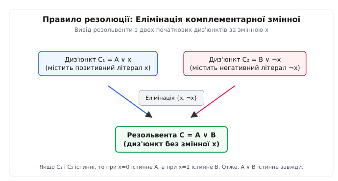
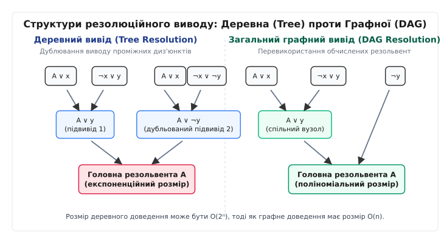
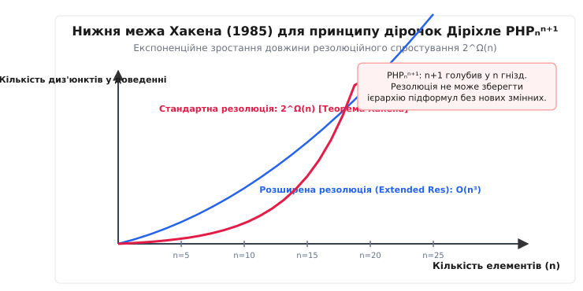
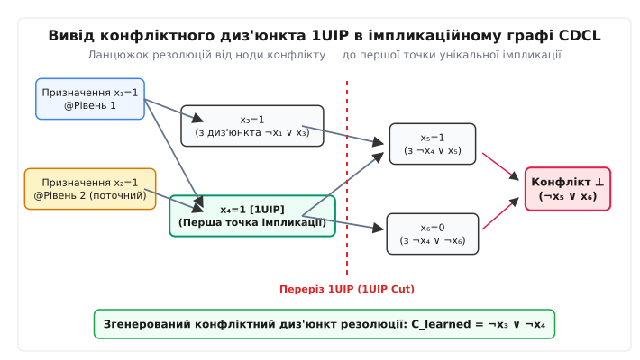

# Система резолюційних виводів (Resolution Proof System)

<preknowlist>
- [Перетворення Цейтіна](root:math-logic/tseytin-transformation) — зведення булевих формул до КНФ без експоненційного вибуху.
- [Теорема Кука — Левіна](root:computability/cook-levin-theorem) — NP-повнота проблеми здійсненності SAT.
- [Horn-SAT і здійсненність](root:math-logic/horn-sat) — поліноміальні окремі випадки проблеми SAT.
- [NP-повнота](root:computability/np-completeness) — класи складності та поліноміальне зведення.
</preknowlist>

Автоматизований аналіз логічних схем, формальна верифікація програмного забезпечення та перевірка еквівалентності мікропроцесорів вимагають аналізу здійсненності булевих формул із мільйонами змінних. Коли сучасний SAT-розв'язувач аналізує формулу і визначає її нездійсненність (результат `UNSAT`), експоненційний перебір усіх `2ⁿ` варіантів можливих інтерпретацій є абсолютно неприйнятним ані для обчислювальних машин, ані для незалежної зовнішньої перевірки. Система резолюційних виводів (Resolution Proof System), запропонована Джон Аланом Робінсоном у 1965 році, забезпечує універсальний синтаксичний механізм побудови машинного доведення суперечності. Вона спирається на єдине правило дедуктивного виводу, що вилучає протилежні літерали з дизюнктів. Послідовне застосування цього правила до виведення порожнього диз'юнкта `⊥` дає спростувально-повне доведення, яке лежить в основі сучасних алгоритмів CDCL та сертифікатів формальної верифікації.

## 1. Механіка резолюційного правила та синтаксична замкненість

В основі резолюційної системи лежить подання логічних виразів у кон'юнктивній нормальній формі (КНФ). Булева формула подається як кон'юнкція (операція І) окремих диз'юнктів, де кожен диз'юнкт — це диз'юнкція (операція АБО) скінченного набору літералів.

Термінологічний апарат системи резолюцій походить від латинських коренів:
- **Літерал** (лат. *litteralis* — буквений): атомарна булева змінна `x` (позитивний літерал) або її заперечення `¬x` (негативний літерал). Полярність літерала показує, робить його істинним значення 1 чи 0.
- **Диз'юнкт** (лат. *disjunctus* — роз'єднаний): множина літералів, об'єднаних логічним АБО. Диз'юнкт розглядається як математична множина, де порядок елементів не має значення, а дублікати автоматично усуваються за законом ідемпотентності (`x ∨ x ≡ x`).
- **Резолюція** (лат. *resolutio* — розв'язання, розкладання, розщеплення): синтаксична операція виключення комплементарної змінної із двох початкових дизюнктів.
- **Резольвента** (лат. *resolvens* — той, що розв'язує): новий диз'юнкт, утворений у результаті застосування правила резолюції.
- **Спростування** (англ. *refutation*): послідовність резолюційних кроків, що завершується виводом порожнього диз'юнкта `⊥`, що є доведенням тотожної хибності формули.

Правило резолюції застосовується до двох дизюнктів, які містять протилежні (комплементарні) літерали щодо однієї й тієї самої булевої змінної `x`.

Формально, якщо початкова множина містить два диз'юнкти `C₁` та `C₂` вигляду:

```
C₁ = A ∨ x
C₂ = B ∨ ¬x
```

де `A` та `B` — довільні диз'юнкції літералів (можливо порожні), то правило резолюції виводить новий диз'юнкт — **резольвенту**:

```
Res(C₁, C₂) = A ∨ B
```

Змінна `x` називається **резолюційною змінною** (pivotal variable). 


*Правило резолюції: елімінація комплементарної змінної x з двох початкових диз'юнктів для побудови нової резольвенти.*

Логічна обґрунтованість цього кроку пояснюється аналізом таблиці істинності. Щоб початкова КНФ-формула була істинною, обидва диз'юнкти `C₁` та `C₂` мусять виконуватися одночасно. Розглянемо можливі значення змінної `x` у довільній інтерпретації `I`:
1. Якщо `I(x) = 0`, то літерал `x` у першому диз'юнкті є хибним. Щоб диз'юнкт `C₁ = A ∨ x` був істинним, підвираз `A` мусить бути істинним (`I(A) = 1`).
2. Якщо `I(x) = 1`, то літерал `¬x` у другому диз'юнкті є хибним. Щоб диз'юнкт `C₂ = B ∨ ¬x` був істинним, підвираз `B` мусить бути істинним (`I(B) = 1`).

Отже, незалежно від того, яке саме значення приймає змінна `x`, у будь-якій моделі початкової формули гарантовано виконується вираз `A ∨ B`. Резольвента взагалі не містить змінної `x`, тобто змінна `x` повністю елімінується з підсумкового диз'юнкта.

Проілюструємо механізм резолюції на конкретному прикладі. Нехай задано два диз'юнкти від змінних `{x₁, x₂, x₃}`:

```
C₁ = x₁ ∨ x₂ ∨ ¬x₃
C₂ = ¬x₁ ∨ x₃
```

Якщо вибрати резолюційною змінною `x₁`, то в диз'юнкті `C₁` вона міститься у позитивній полярності `x₁`, а в `C₂` — у негативній `¬x₁`. Застосування правила резолюції дає:

```
C₁ = (x₂ ∨ ¬x₃) ∨ x₁
C₂ = (x₃) ∨ ¬x₁
------------------------------------------------ [Резолюція за x₁]
Res(C₁, C₂) = x₂ ∨ ¬x₃ ∨ x₃
```

Отримана резольвента містить паралельно літерали `¬x₃` та `x₃`. Оскільки `¬x₃ ∨ x₃ ≡ 1` (закон виключеного третього), диз'юнкт `x₂ ∨ 1` є тотожно істинним (тавтологією). Тавтології не несуть жодної інформації для шуканого спростування і вилучаються автоматичними розв'язувачами на етапі нормалізації.

Якщо ж у тих самих диз'юнктах виконати резолюцію за змінною `x₃`:

```
C₁ = (x₁ ∨ x₂) ∨ ¬x₃
C₂ = (¬x₁) ∨ x₃
------------------------------------------------ [Резолюція за x₃]
Res(C₁, C₂) = x₁ ∨ x₂ ∨ ¬x₁
```

Цей вивід також дає тавтологію через наявність `x₁` та `¬x₁`. Це демонструє важливе правило синтаксичної дисципліни: **резолюція виконується строго за однією змінною за один крок**. Спроба одночасно скоротити дві комплементарні пари (наприклад, видалити й `x₁`, і `x₃`, отримавши `x₂`) є грубою логічною помилкою, яка порушує семантичну обґрунтованість виводу.

Спеціальні випадки резолюційного правила включають:
1. **Одинична резолюція** (Unit Resolution): резолюція між атомарним одиничним диз'юнктом `C₁ = x` та диз'юнктом `C₂ = ¬x ∨ B`. Результатом є укорочений диз'юнкт `Res(C₁, C₂) = B`. Вона становить ядро алгоритму поширення одиничних літералів (Unit Propagation).
2. **Вивід порожнього диз'юнкта** (Empty Clause Derivation): резолюція між двома однолітеральними суперечливими диз'юнктами `C₁ = x` та `C₂ = ¬x`. Підвирази `A` та `B` є порожніми:
   ```
   C₁ = x
   C₂ = ¬x
   ------------------- [Резолюція за x]
   Res(C₁, C₂) = ⊥
   ```
   Порожній диз'юнкт `⊥` не містить жодного літерала. За означенням, порожня диз'юнкція є хибною за будь-якої інтерпретації, що означає успішне синтаксичне доведення суперечності.
3. **Поглинання диз'юнктів** (Subsumption): якщо формула містить диз'юнкти `C₁` та `C₂` такі, що `C₁ ⊆ C₂` (наприклад, `C₁ = x₁`, а `C₂ = x₁ ∨ x₂`), диз'юнкт `C₂` є семантично слабшим і видаляється без втрати інформації.
4. **Усунення чистих літералів** (Pure Literal Elimination): якщо змінна `x` входить у формулу лише в одній полярності (наприклад, тільки позитивно `x`, і ніде немає `¬x`), то всі диз'юнкти, що містять `x`, можна задовольнити, призначивши `x = 1`. Вони вилучаються з басейну без побудови резольвент.

## 2. Семантична коректність та спростувальна повнота

Будь-яка дедуктивна система оцінюється за двома фундаментальними критеріями логіки: коректністю (обґрунтованістю) та повнотою.

**Обґрунтованість** (Soundness) означає, що система не здатна вивести хибні твердження: якщо з формули `F` синтаксично виводиться диз'юнкт `C` (позначається `F ⊢_Res C`), то `C` є семантичним наслідком `F` (позначається `F ⊨ C`). Для резолюції ця властивість виконується неухильно: кожен резолюційний крок зберігає істинність на множині моделей початкової формули.

**Повнота** (Completeness) у класичному розумінні вимагає, щоб для будь-якої формули `F` та її семантичного наслідку `C` існував синтаксичний вивід `F ⊢ C`. У цьому загальному сенсі система резолюцій **не є повною**. Для прикладу, з порожньої формули `F = ∅` семантично випливає тавтологія `C = x ∨ ¬x` (оскільки тавтологія істинна завжди), проте правила резолюції не можуть згенерувати диз'юнкт `x ∨ ¬x` з порожньої множини початкових даних, оскільки резолюція не має аксіом і лише комбінує наявні літерали.

Проте для задач автоматизованого доведення класична дедуктивна повнота є надлишковою. Задачу перевірки того, чи є формула `C` наслідком `F` (`F ⊨ C`), можна еквівалентно звести до перевірки нездійсненності формули `F ∧ ¬C`. Для перевірки нездійсненності система резолюцій володіє абсолюдною **спростувальною повнотою** (Refutational Completeness).

**Теорема про спростувальну повноту резолюції:** Множина дизюнктів `F` є нездійсненною (не має жодної моделі) тоді й лише тоді, коли з `F` за допомогою скінченної послідовності резолюційних кроків виводиться порожній диз'юнкт `⊥`:

```
F ⊨ ⊥   ⇔   F ⊢_Res ⊥
```

Геометричний та логічний доказ цієї теореми можна подати через **семантичні дерева** (Semantic Trees). Бінарне семантичне дерево формули від `n` змінних розгортає всі `2ⁿ` можливих часткових призначень істинності. Оскільки формула `F` нездійсненна, будь-яка повна гілка дерева від кореня до листка фальсифікує принаймні один початковий диз'юнкт у КНФ. 

Розглянемо два сусідні листки, які відрізняються лише призначенням останньої змінної `xₙ` (один листок має `xₙ = 0`, інший `xₙ = 1`). Ліва гілка фальсифікується некорисним диз'юнктом видами `A ∨ xₙ`, а права — диз'юнктом `B ∨ ¬xₙ`. Резолюція за змінною `xₙ` виводить резольвенту `A ∨ B`, яка фальсифікується вже у батьківському вузлі бінарного дерева на глибині `n - 1`. Послідовно згортаючи семантичне дерево від листків до кореня за допомогою резолюційних кроків, ми гарантовано досягаємо кореня дерева, який відповідає порожньому диз'юнкту `⊥`.

Детальне формальне доведення теорем обґрунтованості, спростувальної повноти та нерівності ширини виводу наведено у вставці [🧮 Обґрунтованість, спростувальна повнота та теорема про ширину резолюції](root:math-logic/resolution-proof-system/math-completeness.md).

## 3. Графова топологія виводів: Деревна проти Графної резолюції

Резолюційний вивід порожнього диз'юнкта з формули `F` можна формально подати у вигляді спрямованого ациклічного графа (DAG — Directed Acyclic Graph). Вузлами графа є диз'юнкти. Вхідні листки відповідають початковим диз'юнктам формули `F`, внутрішні вузли — проміжним резольвентам, а єдиний підсумковий сток (sink) — порожньому диз'юнкту `⊥`. Ребра спрямовані від батьківських дизюнктів до їхньої резольвенти.

Залежно від топологічних обмежень на цей граф розрізняють два фундаментальні класи резолюційних виводів:

1. **Деревний резолюційний вивід** (Tree Resolution):
   Граф виводу є математичним деревом. Кожна проміжна резольвента може використовуватись як посилка для наступного резолюційного кроку **не більше одного разу** (вихідний степінь вузла дорівнює 1). Якщо один і той самий проміжний диз'юнкт `C` потрібен для доведення кількох різних гілок, його вивід мусить бути повністю продубльований у кожній із цих гілок заново.
2. **Загальний графний резолюційний вивід** (DAG Resolution / General Resolution):
   Граф виводу є довільним DAG. Будь-яка виведена резольвента зберігається в пам'яті і може перевикористовуватись як посилка для довільної кількості наступних резолюційних кроків (вихідний степінь вузла може бути довільним).


*Порівняння деревного виводу з дублюванням проміжних диз'юнктів та графного виводу з перевикористанням резольвент.*

Різниця між деревним та графним виводом має колосальне значення для обчислювальної складності. У деревній резолюції відсутність пам'яті для збереження проміжних результатів призводить до експоненційного вибуху розміру доведення на багатьох класах формул. Існують формули, для яких найкоротший графний вивід має лінійну довжину `O(n)`, тоді як будь-який деревний вивід вимагає експоненційної кількості кроків `2^{Ω(n)}`.

Окрім деревного та графного виводів, у теорії складності досліджуються спеціальні обмежені форми резолюції:
- **Регулярна резолюція** (Regular Resolution): уздовж будь-якого шляху від листка до кореня `⊥` у графі виводу кожна булева змінна вилучається за допомогою резолюції не більше одного разу.
- **Лінійна резолюція** (Linear Resolution): кожен резолюційний крок (крім першого) виконується між останньою отриманою резольвентою (центральним диз'юнктом) та початковим диз'юнктом або раніше виведеною резольвентою. Лінійна резолюція є основою механізму виконання мови програмування Prolog (SLD-резолюція для дизюнктів Горна).
- **Резолюція Девіса — Патнема** (DP-Resolution / Variable Elimination): змінні усуваються послідовно у фіксованому порядку. Для вибраної змінної `x` будуються всі можливі резольвенти між диз'юнктами з `x` та `¬x`, після чого початкові диз'юнкти вилучаються.

## 4. Межі обчислювальної складності: Принцип Діріхле та нижня межа Хакена

Після створення резолюційного методу у 1965 році тривалий час залишалося відкритим питання: чи є система резолюцій поліноміально обмеженою? Іншими словами, чи існує для будь-якої нездійсненної КНФ-формули `F` розміром `N` резолюційне спростування, яке містить `Poly(N)` диз'юнктів?

У 1985 році Армін Хакен здобув фундаментальний результат, довівши, що **система резолюцій не є поліноміально обмеженою**.

Хакен розглянув математичне формулювання **принципу дірочок Діріхле** (Pigeonhole Principle, `PHP_n^{n+1}`). Твердження описує неможливість розміщення `n + 1` голуба у `n` гніздах так, щоб у кожному гнізді опинилося не більше одного голуба.

Для формулізації `PHP_n^{n+1}` вводиться `(n + 1) · n` булевих змінних `x_{i, j}`, де `x_{i, j} = 1` означає, що голуб `i` перебуває у гнізді `j` (де `i ∈ {1, ..., n+1}`, `j ∈ {1, ..., n}`).

Формула `PHP_n^{n+1}` складається з двох груп диз'юнктів:
1. Кожен голуб `i` мусить сидіти принаймні в одному гнізді (набір з `n + 1` диз'юнктів довжиною `n`):
   ```
   P_i = (x_{i, 1} ∨ x_{i, 2} ∨ ... ∨ x_{i, n}),   для i = 1, ..., n+1
   ```
2. У гнізді `j` не можуть одночасно сидіти два різні голуби `i₁` та `i₂` (набір з `O(n³)` бінарних дизюнктів):
   ```
   Q_{i₁, i₂, j} = (¬x_{i₁, j} ∨ ¬x_{i₂, j}),   для 1 ≤ i₁ < i₂ ≤ n+1,  1 ≤ j ≤ n
   ```

Загальний розмір КНФ-формули `PHP_n^{n+1}` становить `O(n³)` дизюнктів. Формула є строго нездійсненною.


*Експоненційне зростання кількості диз'юнктів у резолюційному спростуванні принципу дірочок Діріхле PHPₙⁿ⁺¹.*

**Теорема Хакена (1985):** Будь-який резолюційний вивід порожнього диз'юнкта з формули `PHP_n^{n+1}` (як деревний, так і графний) має розмір, що зростає експоненційно від `n`:

```
Length(PHP_n^{n+1} ⊢_Res ⊥) = 2^{Ω(n)}
```

Для доведення Хакен застосував метод обмежень (random assignments restrictions). Він показав, що на середині будь-якого резолюційного виводу для `PHP_n^{n+1}` мусить виникнути астрономічна кількість «широких» диз'юнктів, які містять літерали про більшість голубив і гнізд. Жоден резолюційний кроку не може спростити ці диз'юнкти без попередньої побудови експоненційної кількості проміжних резольвент.

Слідом за Хакеном Аласдер Уркварт (1987) довів експоненційну нижню межу для **формул Цейтіна на графах-розширювачах** (expander graphs). Це довело, що експоненційна складність резолюції не є специфічною аномалією принципу Діріхле, а виникає на фундаментальному топологічному рівні для складних систем зв'язків.

У 1988 році Вацлав Хватал та Ендре Семередон встановили, що випадкові 3-SAT формули вимагають експоненційного резолюційного спростування з ймовірністю, близькою до 1.

У 1999 році Елі Бен-Сассон та Аві Вігдерсон узагальнили ці результати, довівши теорему про зв'язок ширини та довжини. **Ширина диз'юнкта** `w(C)` — це кількість літералів у ньому, а ширина виводу `w(F ⊢ ⊥)` — це максимальна ширина диз'юнкта у найоптимальнішому спростуванні. Бен-Сассон і Вігдерсон довели нерівність:

```
Length(F ⊢_Res ⊥) ≥ exp( Ω( ((w(F ⊢ ⊥) - w(F))²) / n ) )
```

Ця теорема сформулювала універсальний закон складності: **якщо формула не має резолюційного спростування малого розміру дизюнктів (малої ширини), вона не має і короткого за кількістю кроків спростування**.

Деталі історичного розвитку досліджень нижніх меж складності викладено у вставці [📜 Історія резолюційного виводу та еволюція автоматизованого доведення](root:math-logic/resolution-proof-system/hist-resolution.md).

## 5. Архітектура CDCL: Вивід конфліктних диз'юнктів 1UIP

Незважаючи на теоретичну експоненційну складність у найгіршому випадку, система резолюцій є головним обчислювальним двигуном сучасних індустріальних SAT-розв'язувачів серії **CDCL** (Conflict-Driven Clause Learning).

У класичному алгоритмі DPLL при виникненні суперечності розв'язувач здійснював хронологічний повернення (backtracking) на один рівень назад. В алгоритмі CDCL при виникненні конфлікту розв'язувач аналізує причинно-наслідкові зв'язки за допомогою **імпликаційного графа** (Implication Graph) і генерує новий конфліктний диз'юнкт за допомогою ланцюжка резолюцій.

Структура імпликаційного графа:
- Вузли графа — це літерали, призначені розв'язувачем.
- Вершини прийняття рішень (Decision Nodes) відповідають вибору значень змінних на різних рівнях прийняття рішень (Decision Levels).
- Виведені вершини (Propagated Nodes) утворюються в результаті поширення одиничних літералів (Unit Propagation).
- Ребра спрямовані від літералів диз'юнкта до літерала, який вони вимушено встановили.
- Вузол конфлікту `⊥` виникає, коли одна й та сама змінна вимушено отримує протилежні значення (`x` та `¬x`).


*Ланцюжок резолюцій від ноди конфлікту до першої точки унікальної імпликації у графі CDCL.*

Для побудови вивченого конфліктного диз'юнкта (Learned Clause) алгоритм виконує зворотний ланцюжок резолюцій, починаючи від конфліктного диз'юнкта:

1. Береться диз'юнкт, що спричинив безпосередній конфлікт `C_{conflict} = (¬x₅ ∨ x₆)`.
2. Знаходиться змінна `x₆`, яка була виведена останньою на поточному рівні прийняття рішень за допомогою диз'юнкта `C_{reason} = (¬x₄ ∨ ¬x₆)`.
3. Виконується крок резолюції між `C_{conflict}` та `C_{reason}` за змінною `x₆`:
   ```
   Res((¬x₅ ∨ x₆), (¬x₄ ∨ ¬x₆)) = ¬x₅ ∨ ¬x₄
   ```
4. Процес резолюції продовжується рекурсивно назад уздовж графа імпликації, доки отримана резольвента не міститиме **точно один літерал з поточного рівня прийняття рішень**.

Ця точка зупинки називається **1UIP** (First Unique Implication Point — Перша точка унікальної імпликації). Диз'юнкт, виведений у точці 1UIP, володіє унікальною властивістю: він є **асертивним** (asserting clause). Після повернення назад на відповідний рівень цей новий диз'юнкт стає одиничним (Unit Clause) і негайно вимушує нове значення змінної без додаткових рішень.

Завдяки тому, що кожен новий диз'юнкт CDCL є математичною резольвентою початкових диз'юнктів та раніше виведених конфліктних блоків, увесь процес роботи CDCL розв'язувача є не чим іншим, як **цілеспрямованою побудовою графного резолюційного виводу** (DAG Resolution Proof).

Практичну реалізацію алгоритмів резолюції та побудови конфліктних дизюнктів мовами C та C++ наведено у вставці [⚙️ Алгоритм резолюційного спростування та вивід конфліктних диз'юнктів](root:math-logic/resolution-proof-system/proj-solver.md).

> 🔧 **Навіщо це.**
> Резолюційні виводи є фундаментальною основою автоматичного доведення у формальній верифікації апаратного та програмного забезпечення. Коли статичний аналізатор або системний верифікатор (наприклад, у криптографії або авіолушні) перевіряє відсутність переповнення буфера чи безпеку викликів системних функцій, він зводить задачу до булевої формули. Якщо формула є нездійсненною (`UNSAT`), резолюційний вивід створює машинно-перевіряйний сертифікат доведення. Тільки наявність коректного резолюційного трасування дозволяє незалежним ядерам верифікації гарантувати 100% безпеку критичних систем без довіри до складного коду самого SAT-розв'язувача.

## 6. Формальні сертифікати доведення (DRAT/LRAT) та межі резолюції

Зі зростанням складності SAT-розв'язувачів виник виклик: код сучасного індустріального розв'язувача містить десятки тисяч рядків евристик C/C++, у яких можуть траплятися помилки. Якщо розв'язувач видає результат `UNSAT` для задачі верифікації об'єкта атомної енергетики або космічного апарата, як гарантувати відсутність помилки в самому розв'язувачі?

Рішенням став перехід до **зовнішньої сертифікації резолюційних доведень**. Організатори міжнародних змагань SAT Competition зобов'язали розв'язувачі виводити трасу доведення у форматах **DRUP**, **DRAT** або **LRAT**:

- **DRAT** (Deletion Resolution Asymmetric Tautology): траса записує послідовність додавання виведених резольвент та видалення неактуальних дизюнктів.
- **LRAT** (Lineated DRAT): розширює DRAT явними ідентифікаторами дизюнктів-посилок. Це дозволяє формально верифікованому перевіряльнику (наприклад, написаному та доведеному в системі Coq або Isabelle/HOL) перевірити трасу за лінійний час `O(N)`.

Детальний опис синтаксису, бінарного стиснення та специфікації C API для генерації сертифікатів доведення наведено у вставці [📋 Інтерфейс та формат сертифікатів резолюційних доведень DRAT та LRAT](root:math-logic/resolution-proof-system/api-proof-format.md).

### Подолання меж резолюції: Розширена резолюція

Оскільки класична резолюція вимагає експоненційного часу для принципу Діріхле та графових формул Цейтіна, постає питання: як піднятися на вищий рівень дедуктивної потужності?

Відповіддю є **Розширена резолюція** (Extended Resolution, ER), запропонована Джон Аланом Робінсоном та Цейтіним. Розширена резолюція дозволяє під час виводу вводити **нові допоміжні булеві змінні** `z`, пов'язані з виразами від наявних змінних:

```
z ↔ (x ∧ y)
```

Ця еквівалентність додає до формули три малі КНФ-диз'юнкти: `(¬z ∨ x)`, `(¬z ∨ y)` та `(z ∨ ¬x ∨ ¬y)`.

Нові змінні діють як «абстракції» або підформули, що дозволяє стискати широкі диз'юнкти та виводити еквівалентності без експоненційного вибуху. Доведено, що **Розширена резолюція легко вирішує принцип дірочок Діріхле `PHP_n^{n+1}` за поліноміальне число кроків `O(n³)`**, долаючи бар'єр Хакена.

Більшість сучасних потужних систем доведення (Frege systems, Cutting Planes, Polynomial Calculus) спираються саме на ідеї розширеної резолюції, поєднуючи синтаксичну простоту правила Робінсона з можливістю динамічного введення нових концептуальних змінних.
