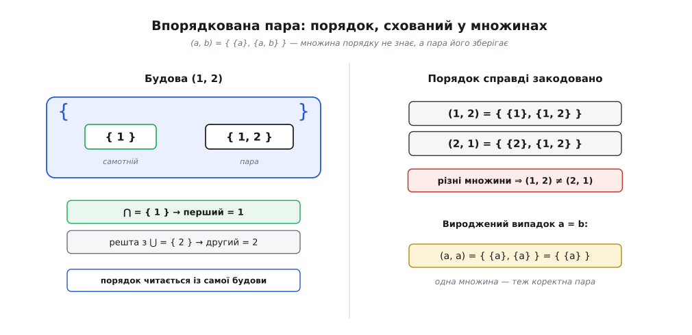
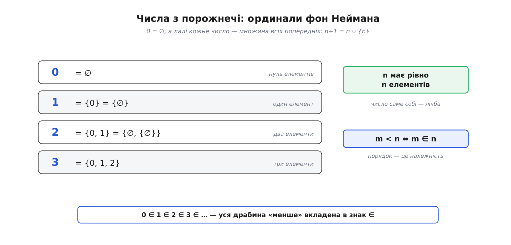
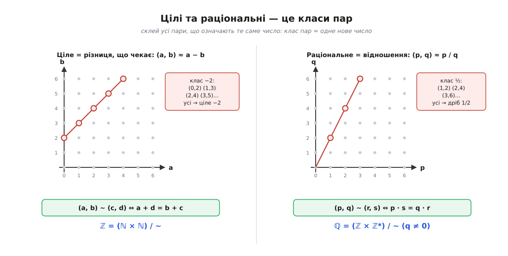
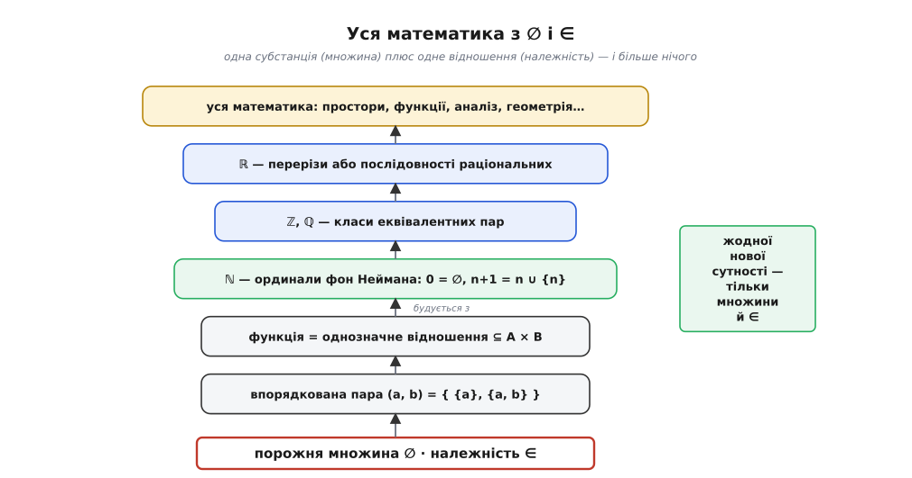

# 🧮 Усе — множина: математику зібрати з ∅ і ∈

<preknowlist>
- [Математичне доведення](topic:math-logic/mathematical-proof) — що означає «довести» твердження і як влаштований доказ; тут ним користуються майже в кожному абзаці.
- [Математична індукція](topic:math-logic/mathematical-induction) — база плюс крок валять увесь нескінченний ряд чисел; на ній тримається рекурсивна побудова чисел.
- [Відношення еквівалентності](topic:math-logic/equivalence-relation) — коли «різне вважаємо однаковим»: рефлексивність, симетрія, транзитивність і розбиття на класи; з нього виростуть цілі й раціональні.
</preknowlist>

Уся хімія речовин зводиться до кількох десятків атомів і кількох типів зв'язку між ними. У математики економія ще суворіша: атом **один** — множина, зв'язок **один** — належність ∈. Твердження, яке спершу звучить як перебільшення, а насправді є доведеною теоремою: маючи саму лише порожню множину ∅ і саме лише відношення «лежить у», можна зібрати впорядковані пари, відповідності, функції, а далі натуральні, цілі, раціональні й дійсні числа — і жодного разу не доведеться постулювати нову сутність. Далі — як саме це робиться, з обчисленнями, які можна перевірити пальцем.

Навіщо взагалі така аскеза? Бо доки «число», «функція», «пара» — окремі первинні поняття, кожне з них треба окремо описувати аксіомами, стежити, щоб вони не суперечили одне одному, і вірити, що список повний. А якщо все це — просто множини особливого ґатунку, то список первинних понять худне до одного, аксіоми потрібні лише про множини, і решта математики стоїть на них, як будинок на фундаменті. Ощадливість тут не естетична забаганка, а спосіб зробити всю будівлю перевірною з одного місця.

### Порядок, схований у безпорядку: пара за Куратовським

Множина нічого не знає про порядок: {a, b} і {b, a} — та сама множина, бо про кожен елемент обидві кажуть однакове «так, лежить». А математиці порядок потрібен щокроку. Координати точки (x, y) — не те саме, що (y, x). «Вхід дав такий-то вихід» — це напрямлена пара, у якій ліве й праве не рівноправні. Тож перше питання: чи можна дістати **впорядковану** пару, маючи тільки неупорядковані множини й більше нічого?

Відповідь знайшли не одразу. Першу таку побудову дав 1914 року Норберт Вінер (американський математик, згодом батько кібернетики) — щоправда, громіздку: (x, y) = { { {x}, ∅ }, { {y} } }. Того ж 1914-го свій варіант запропонував Фелікс Гаусдорф. А просту й досконалу форму, яку вживають досі, подав 1921 року польський математик Казімеж Куратовський:

```
(a, b)  :=  { {a}, {a, b} }
```

Придивімося, чому ця дивна на вигляд конструкція працює. Пара пакує два «мішки». Один мішок — {a} — містить лише перший елемент. Другий — {a, b} — містить обидва. Асиметрія, якої бракувало множині, з'явилася: перший елемент — той, що лежить **сам-один** у котромусь із мішків; другий — той, що трапляється лише в мішку-двійці. Порядок більше не окреме поняття, він **закодований будовою**: хто отримав власний однокомпонентний мішок, той і перший.

Але «на вигляд працює» в математиці не аргумент. Треба довести головне: що з пари можна **однозначно відновити**, хто перший, а хто другий. Формально — що дві пари рівні тоді й лише тоді, коли поелементно збігаються.

> 🔧 **Навіщо це.** Уся аналітична геометрія, кожна таблиця «аргумент → значення», кожен кортеж у базі даних, кожна пара «ключ — значення» у словнику стоїть на тому, що (a, b) і (b, a) — різні об'єкти, а з пари завжди видно, де перше поле, а де друге. Якби відновлення було неоднозначним, координати перепліталися б і геометрія розсипалась. Теорема нижче — це гарантія, що фундамент під усім цим не хитається.

**Теорема: (a, b) = (c, d) тоді й лише тоді, коли a = c і b = d.**

Один бік очевидний: якщо a = c і b = d, то й множини однакові. Уся суть — у зворотному боці. Нехай { {a}, {a, b} } = { {c}, {c, d} }; треба видобути звідси a = c і b = d. Розберемо два випадки, бо будова пари залежить від того, чи збігаються її елементи.

```
Випадок 1:  a = b.
  Тоді {a, b} = {a, a} = {a}, отже (a, b) = { {a}, {a} } = { {a} }.
  Права частина { {c}, {c, d} } мусить дорівнювати { {a} } —
  а це множина з РІВНО ОДНИМ елементом, {a}.
  Тому  {c} = {a}  і  {c, d} = {a}.
  Із {c} = {a}     →  c = a.
  Із {c, d} = {a}  →  c = a  і  d = a.
  Отже  a = c  і  b = a = d.  ✓
```

```
Випадок 2:  a ≠ b.
  Тоді {a} (один елемент) ≠ {a, b} (два елементи),
  тож (a, b) має РІВНО ДВА різні члени. Значить і права частина
  має два різні члени, отже c ≠ d.

  {a} — член правої частини, тож  {a} = {c}  або  {a} = {c, d}.
  Але {c, d} має два елементи, а {a} — один, тож {a} ≠ {c, d}.
  Лишається  {a} = {c}   →   a = c.

  {a, b} — теж член правої частини, тож {a, b} = {c} або {a, b} = {c, d}.
  Але {a, b} має два елементи, а {c} — один, тож {a, b} ≠ {c}.
  Лишається  {a, b} = {c, d}.  Оскільки a = c, це {a, b} = {a, d}.
  b лежить у {a, d}, а b ≠ a  →  b = d.  ✓
```

В обох випадках дістали a = c і b = d. Теорему доведено: **порядок відновлюється однозначно**. Куратовський дав множинам пам'ять про те, чого вони за природою не знають.

Відновлення можна навіть виписати діями над множинами, без жодних «дивись, який мішок менший». Перетин двох членів пари завжди дає першу компоненту, а їхнє об'єднання — обидві:

```
переріз членів:  {a} ∩ {a, b} = {a}     →  перший = a
об'єднання:      {a} ∪ {a, b} = {a, b}   →  другий = той елемент об'єднання,
                                            якого немає в перерізі
```


*Порядок, схований у неупорядкованих множинах. Ліворуч: пара (1, 2) — це два «мішки»; той, хто лежить у мішку сам, і є перший, а перший читається як спільне обох мішків, другий — як решта об'єднання. Праворуч: (1, 2) і (2, 1) справді різні множини, тож пара пам'ятає, хто де. Навіть вироджений випадок a = b, де пара стискається до { {a} }, лишається коректним.*

### Декартів добуток, відповідності, функції

Маючи пари, зробімо з них множину — і одразу дістанемо весь апарат відповідностей. **Декартів добуток** двох множин A і B — це множина **всіх** пар, де перше з A, друге з B:

```
A × B  :=  { (a, b) : a ∈ A,  b ∈ B }
```

Що це справді множина, а не якийсь «занадто великий» об'єкт на кшталт тих, що породжують парадокси, видно так: кожна пара (a, b) за Куратовським — це множина, складена з елементів A∪B та їхніх підмножин, тож усі пари живуть усередині степеневої множини від степеневої, P(P(A ∪ B)). Отже, A × B — це просто та частина вже наявної множини, яку відбирає властивість «бути парою з a∈A і b∈B»; вирізати підмножину за властивістю аксіоми дозволяють. Тут ми спираємося на правила, за якими взагалі вільно будувати множини, — на [аксіоми ZFC](topic:math-logic/zfc-set-theory): систему з десятка аксіом, що чітко кажуть, які множини дозволено утворювати, і саме тому не впускають Расселове чудовисько.

Тепер — ключове спостереження, з якого все й закрутиться. **Відношення** (відповідність) між A і B — це будь-яка **підмножина** декартового добутку:

```
R  ⊆  A × B
```

І більше нічого. «Бути меншим», «бути батьком», «бути з'єднаним ребром» — усі ці абстрактні зв'язки виявляються звичайнісінькими множинами пар. Наприклад, відношення «менше» на множині {1, 2, 3} — це просто множина тих пар, де ліве менше за праве:

```
«<»  =  { (1, 2), (1, 3), (2, 3) }
```

Розпливчасте «менше» стало чимось цілком предметним — конкретним набором трьох пар, з яким можна працювати, як із будь-якою множиною.

Серед усіх відношень виділяється особливо важливий підвид — **функції**. Функція з A в B — це таке відношення f ⊆ A × B, яке підкоряється двом умовам:

```
1) всюди визначене: для кожного a ∈ A знайдеться пара (a, b) ∈ f;
2) однозначне:      для кожного a таке b — РІВНО ОДНЕ
                    (не буває (a, b) ∈ f і (a, b′) ∈ f при b ≠ b′).
```

Друга умова — серце означення. Саме **однозначність** робить відношення функцією: кожному входу відповідає один-єдиний вихід, тож запис f(a) = b (що означає рівно «(a, b) ∈ f») не двозначний. A звуть областю визначення, B — областю значень.

І ось висновок, який спершу здається надто простим, щоб бути правдою: **функція — не окрема магічна сутність, а просто множина пар**. Той «графік функції», який у школі малюють поряд із формулою, і **є** сама функція — не її зображення, а вона власною персоною. Формула — лише спосіб цю множину пар описати.

**Умова: записати функцію f(n) = n² на множині {0, 1, 2} як множину.**

```
f  =  { (0, 0), (1, 1), (2, 4) }

Перевірка однозначності: кожне з 0, 1, 2 стоїть першим
рівно в одній парі — умову виконано, це функція.
Обчислення значення:  f(2) = 4,  бо (2, 4) ∈ f  і  іншої пари з 2 немає.
```

Функція звелася до трьох пар. Ніякого окремого поняття не знадобилося — лише множина, вирізана з декартового добутку.

> 🔧 **Навіщо це.** Гешмапа, словник, асоціативний масив — усе це буквально функція, збережена як множина пар «ключ → значення». Коли ви пишете `d[key] = value`, ви додаєте пару до множини; коли читаєте `d[key]` — знаходите те єдине друге поле, що відповідає ключу. Вимога однозначності — це те, чому в словнику один ключ не може мати двох значень. Абстрактне означення функції як множини пар і практична структура даних — це той самий об'єкт, побачений з двох боків.

### Числа з порожнечі: ординали фон Неймана

Найсміливіший крок попереду. У нас є ∅ — коробка, у якій нічого немає. Невже з неї можна дістати **числа**? Виявляється, так, і трюк геніально простий: нехай кожне число **буде** множиною всіх чисел, менших за нього.

У нуля попередників немає, тож нуль — це порожня множина. Одиниці передує тільки нуль, тож одиниця — множина {0}. Двійці передують нуль і одиниця, тож двійка — {0, 1}. І загальне правило «наступного числа»: узяти все, що знає теперішнє, і докласти саме теперішнє:

```
0      :=  ∅
n + 1  :=  n ∪ {n}
```

Розкрутимо перші кроки явно — це найкраще показує, як число народжується зі згорнутих одна в одну порожніх коробок.

**Умова: обчислити 0, 1, 2, 3 за правилом n + 1 = n ∪ {n}.**

```
0 = ∅
1 = 0 ∪ {0} = ∅ ∪ {∅}        = {∅}              = {0}
2 = 1 ∪ {1} = {∅} ∪ {{∅}}    = {∅, {∅}}         = {0, 1}
3 = 2 ∪ {2} = {0,1} ∪ {2}                        = {0, 1, 2}
```

Кожне число — акуратно вкладена вежа з порожніх множин. І ця конструкція, яку 1923 року подав угорський математик Джон фон Нейман (Neumann János Lajos із Будапешта), дарує дві властивості такої краси, що вони й виправдовують усю затію.

**Перша: число n має рівно n елементів.** Двійка {0, 1} — два елементи, трійка {0, 1, 2} — три. Тобто «скільки» вбудоване в саме число: щоб дізнатися, яке воно завбільшки, досить порахувати, що в ньому лежить. Число саме собі є мірою.

**Друга, ще глибша: m < n тоді й лише тоді, коли m ∈ n.** Порядок «менше» — це просто належність! Адже n = {0, 1, …, n−1} містить якраз усі менші числа. Перевіримо:

```
2 < 3 ?   →   2 ∈ 3 ?   3 = {0, 1, 2},  так, 2 ∈ 3.   Отже 2 < 3.  ✓
3 < 3 ?   →   3 ∈ 3 ?   3 = {0, 1, 2},  трійки серед них немає.
              Отже 3 ∉ 3, і 3 не менше за себе.  ✓
```

Зупинімося на цьому, бо це не дрібниця. Ми не додавали окремого відношення «менше» — воно **вже було** в знаку ∈. Уся драбина порядку на числах, 0 ∈ 1 ∈ 2 ∈ 3 ∈ …, — це та сама належність, з якої почалася вся теорія. Одне первинне відношення тягне за собою і числа, і їхній порядок.


*Числа як вкладені порожні коробки. Кожне n — це множина всіх попередніх, тож у ньому рівно n елементів (число саме собі лічба), а «менше» збігається з «належить»: m < n означає просто m ∈ n. Уся впорядкованість чисел уже сидить у знаку ∈.*

Операція «наступник» S(n) = n ∪ {n} — це достеменно той наступник, з якого аксіоми Пеано вирощують арифметику; з ординалів фон Неймана самі ці аксіоми стають доведеними теоремами, а не окремими припущеннями. Як із нуля, наступника й індукції постає все додавання, множення й порядок, показано в темі [натуральних чисел](topic:math-logic/natural-numbers).

Одна тонкість, яку легко проґавити. Скінченними об'єднаннями з ∅ ми щоразу дістаємо чергове скінченне число, але ніколи — усю сукупність ℕ = {0, 1, 2, …} як завершене ціле. Щоб вона існувала окремим об'єктом, потрібна спеціальна **аксіома нескінченності** — одна з [аксіом ZFC](topic:math-logic/zfc-set-theory), що просто дарує нам одну нескінченну множину, з якої вже вирізають ℕ. Отримавши ℕ, її саму позначають ω — це перший нескінченний ординал; а за ним ідуть ω + 1 = ω ∪ {ω}, ω + 2, … — [трансфінітні ординали](topic:math-logic/ordinal-numbers), що продовжують ту саму ідею «множина всіх попередніх» за межу скінченного.

Варто знати, що вибір саме такої побудови не був єдино можливим — і це чесно показує, що ми **конструюємо** числа, а не відкриваємо їхню єдино правильну множинну природу. Ще 1908 року Ернст Цермело кодував числа інакше: 0 = ∅, 1 = {∅}, 2 = {{∅}}, тобто щоразу загортав попереднє в один новий шар. Його числа теж працюють, але не мають ні властивості «n елементів», ні збігу порядку з ∈. Побудова фон Неймана перемогла саме через ці дві зручності — вона не «правдивіша», а розумніша.

### Цілі та раціональні: склеїти пари в класи

ℕ уміє додавати й множити, але не вміє віднімати не виходячи за свої межі: 3 − 5 у натуральних чисел відповіді не має. Щоб з'явилися від'ємні числа, застосуємо прийом, який працюватиме й далі: **нове число — це клас старих пар, які домовилися вважати однаковими**.

Ідея така. Ціле число — це «віднімання, що чекає на виконання»: пара (a, b) означатиме результат a − b. Але багато різних пар означають те саме: (3, 5), (4, 6), (10, 12) — усі це «−2». Тож склеїмо всі пари, що дають однакову різницю, в один об'єкт. Ось де тонкість: різницю ми ще не вміємо рахувати (від'ємних чисел немає!), тому означуємо однаковість **лише через додавання**, яке в ℕ уже є:

```
(a, b) ~ (c, d)   ⟺   a + d  =  b + c
```

Прочитаймо: a − b = c − d рівносильне a + d = b + c — те саме, тільки перенесене так, щоб ніде не стояв мінус. Це відношення ~ рефлексивне, симетричне й транзитивне, тобто [відношення еквівалентності](topic:math-logic/equivalence-relation): воно розбиває всю площину пар ℕ × ℕ на класи, що не перетинаються, і кожен клас — це рівно одне ціле число. Формально:

```
ℤ  :=  (ℕ × ℕ) / ~
```

**Умова: перевірити, що (3, 5) і (4, 6) — одне й те саме ціле (−2).**

```
(3, 5) ~ (4, 6) ?   ⟺   3 + 6  =  5 + 4   ⟺   9 = 9.   Так. ✓
Обидві пари лежать в одному класі — тому й задають одне число, −2.
```

Дії переносяться на класи природно. Додавання цілих — це покомпонентне додавання пар, `[(a, b)] + [(c, d)] := [(a + c, b + d)]`, бо (a − b) + (c − d) = (a + c) − (b + d). Треба лише впевнитися, що результат не залежить від того, яку пару-представника класу взяли, — і ця незалежність справді виконується (її й гарантує означення ~).

Із раціональними — точно та сама пісня, лише замість різниці тепер відношення. Раціональне число — це «ділення, що чекає»: пара (p, q) з ненульовим q означає дріб p/q. Однакові дроби склеюємо, знову обходячись без самого ділення — через множення навхрест:

```
(p, q) ~ (r, s)   ⟺   p · s  =  q · r
ℚ  :=  (ℤ × ℤ*) / ~        (ℤ* — цілі без нуля)
```

**Умова: перевірити, що (2, 4) і (1, 2) — той самий дріб (½).**

```
(2, 4) ~ (1, 2) ?   ⟺   2 · 2  =  4 · 1   ⟺   4 = 4.   Так. ✓
Пари (1,2), (2,4), (3,6), … лежать в одному класі — це число ½.
```


*Нове число — це склеєний клас старих пар. Ліворуч: усі пари (a, b) з однаковою різницею a − b лягають на одну лінію й задають одне ціле (виділено клас −2). Праворуч: усі пари (p, q) з однаковим відношенням p/q лежать на одному промені з початку й задають один дріб (виділено ½). Склейка щоразу означується без забороненої дії — цілі через додавання, раціональні через множення.*

> 🔧 **Навіщо це.** Саме так усередині влаштований тип «раціональне число» в будь-якій системі точної арифметики: дріб зберігають як пару (чисельник, знаменник), а рівність двох дробів перевіряють множенням навхрест p·s = q·r, а не діленням, щоб не втратити точність. Комп'ютерна алгебра, точні обчислення у криптографії, символьні пакети — усі оперують числами саме як класами пар. Абстрактна фактормножина (ℤ × ℤ*)/~ і робочий клас `Fraction` — це одне й те саме.

### Дійсні числа: залатати діри (ескіз)

ℚ густа, але дірява: немає раціонального q, для якого q² = 2, — √2 випадає між дробами. Дійсні числа затикають ці діри, і — що знову тішить — обидва класичні способи це зробити цілком множинні.

**Дедекіндів переріз** (Ріхард Дедекінд, праця «Неперервність та ірраціональні числа», 1872). Дійсне число — це просто множина раціональних: усіх тих, що лежать **лівіше** за нього. Число √2 означують як

```
√2  :=  { q ∈ ℚ :  q < 0  або  q² < 2 }
```

— множину всіх раціональних, менших за √2. Діру називають на ім'я, показавши пальцем на все, що під нею: сам «край» бути раціональним не мусить, а множина його ліворуч — цілком реальний об'єкт. Дійсне число **є** цією множиною раціональних.

**Послідовності Коші** (Ґеорґ Кантор, того ж 1872 року, незалежно). Дійсне число — це клас раціональних послідовностей, які збігаються докупи (їхні члени тісняться все ближче один до одного), причому дві послідовності вважають одним числом, якщо їхня різниця прямує до нуля. Тут доречно замкнути коло: послідовність раціональних — це функція ℕ → ℚ, а функція, як ми домовилися, — множина пар. Отже, і цей шлях не виходить за межі множин ані на крок.

Обидві побудови з'явилися одночасно, 1872-го, двома незалежними руками — рідкісний випадок, коли математика двічі підтвердила саму себе. Нам тут досить ескізу; головне видно вже з нього: дійсні — це множини раціональних (або класи послідовностей раціональних), раціональні — класи пар цілих, цілі — класи пар натуральних, натуральні — ординали фон Неймана, а ті виростають із ∅. Уся драбина замикається на порожню множину й належність.

### Одна субстанція, одне відношення

Відступімо й гляньмо на всю вежу. Ми почали з ∅ — єдиного об'єкта — і ∈ — єдиного відношення. Куратовський дав нам упорядковані пари; пари, зібрані в множину, дали декартів добуток, а його підмножини — усі відношення й функції; порожня множина з операцією «наступник» дала натуральні числа разом з їхнім порядком; класи пар дали цілі й раціональні; множини раціональних — дійсні. А маючи ℝ, дістаємо ℝⁿ (пари, трійки, кортежі — знову множини пар), неперервні функції (множини пар), простори, міри, ймовірності — і так вгору без кінця, аж до всієї математики. На кожному поверсі — **жодної нової сутності**, лише множини та їхня належність.


*Уся математика на двох цеглинах. Знизу — порожня множина ∅ і відношення належності ∈; над ними поверх за поверхом виростають пара, декартів добуток і функція, числа фон Неймана, класи пар (ℤ, ℚ), переріз ℚ (ℝ) — і врешті весь корпус математики. На жодному кроці не додано нової первинної сутності: лише множини й ∈.*

Аналогія з хімією тут майже точна — і саме тому корисно побачити, **де вона ламається**. Хімік каже, що вода **справді складається** з атомів гідрогену й оксигену; це факт про будову речовини. А от математик, побудувавши 2 як {∅, {∅}}, **не** стверджує, що двійка «насправді є» саме цією множиною. Адже Цермелова двійка {{∅}} служить числу 2 нітрохи не гірше. Якщо два різні множинні об'єкти обидва бездоганно грають роль двійки, то жоден із них не є двійкою **по-справжньому й однозначно** — важлива не конкретна множина, а **структура**: наступник, порядок, закони арифметики, відтворені без жодної хиби. Побудова доводить не «чим число є», а дещо скромніше й глибше: **множин вистачає**, щоб понести на собі всю математику. Це доказ достатності, а не одкровення про природу чисел.

Оце й є справжня здобич. Домовившись про множини та їхні правила, ми більше не мусимо окремо постулювати, «що таке пара», «що таке функція», «що таке число», — усе воно вже є всередині, зібране з ∅ рукою належності. Одна субстанція, одне відношення — і на них тримається все інше.
