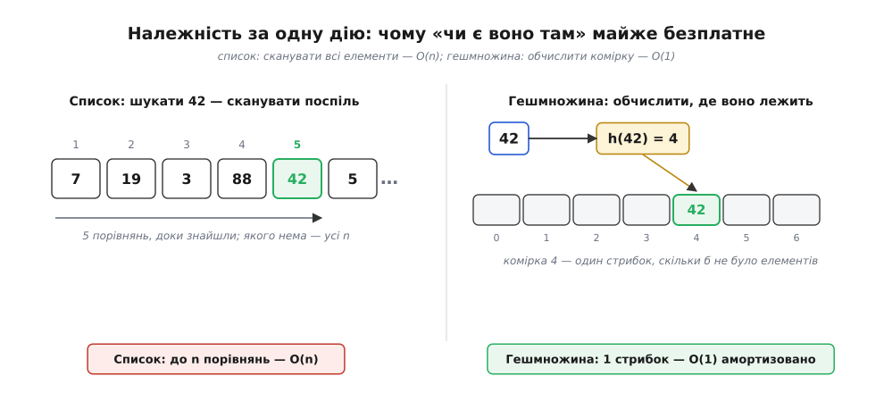
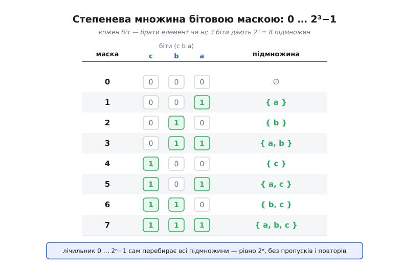

# 🛠 Множини в коді: чому «чи є воно там» майже безплатне

Множина, як математичний об'єкт, уміє відповідати рівно на одне питання: чи лежить предмет усередині неї, чи ні. Уся її сила — в цьому одному слові «належить». І коли множину переносять у код, уся інженерна майстерність теж крутиться довкола цього одного питання: зробити відповідь «чи є воно там» **майже безплатною**. Бо якщо належність дешева, то й усе інше — об'єднання, переріз, різниця, перевірка підмножини — теж стає дешевим, адже кожна з цих дій під капотом лише багато разів питає «а це лежить?». Тож почнімо саме з ціни належності: вона й вирішує все.

## Належність за одну дію

Найпростіше, що спадає на думку, — тримати елементи у списку (масиві), одне за одним. Тоді перевірка «чи є 42» перетворюється на чесний обхід: порівняти з першим, з другим, з третім… доки не знайдемо або не впремося в кінець. Якщо елементів мільйон, а шуканого немає, доведеться зробити мільйон порівнянь. Ціна росте разом із розміром — це те, що [записують як O(n)](root:computability/asymptotic-complexity): удвічі більше елементів — удвічі довший пошук.

Хитрість, яка ламає цю залежність, зветься **гешуванням** (англ. *hash* — «покришити, перемішати»). Замість шукати, ми **обчислюємо, де предмет мав би лежати**. Спеціальна функція `h(x)` перемелює елемент на число, а число — це вже адреса комірки: не треба перебирати всі, досить стрибнути одразу в потрібну й зазирнути тільки туди. У середньому — одне порівняння, скільки б елементів не було. Уся ця машинерія живе всередині [геш-таблиці](root:sf-algorithms/hash-table); множину, збудовану на ній, звуть гешмножиною (англ. *hash set*).


*Список мусить пройти елементи поспіль — ціна росте з розміром. Гешмножина обчислює `h(42)`, дістає адресу комірки й зазирає лише туди: один стрибок незалежно від того, мільйон там елементів чи десять.*

**Умова: перевірити, чи є число у мільйонній колекції — списком і множиною.**
```python
import time, random

n = 1_000_000
data = random.sample(range(10 * n), n)   # мільйон різних чисел

as_list = list(data)                      # звичайний список
as_set  = set(data)                       # гешмножина з тих самих чисел

needle = -1                               # свідомо якого НЕМА — найгірший випадок

t = time.perf_counter()
_ = needle in as_list                     # доведеться пройти всі n елементів
print("список: ", time.perf_counter() - t)   # ~десяті частки секунди

t = time.perf_counter()
_ = needle in as_set                      # h(needle) → одна комірка, і все
print("множина:", time.perf_counter() - t)   # ~мікросекунди
```
Різниця в тисячі разів — і вона не випадкова, а закономірна: список платить за кожен елемент, множина не платить майже ні за що. Слово «майже» тут чесне. У найгіршому уявному випадку, коли `h` кладе геть усі елементи в одну комірку, гешмножина вироджується назад у список і перевірка знову стає O(n). Але добра геш-функція розкидає елементи рівномірно, а таблиця час від часу підростає, щоб комірок вистачало, — тож на довгому відрізку кожна перевірка коштує сталий час. Саме тому обережно кажуть [«амортизоване O(1)»](root:computability/amortized-analysis): не «завжди одна дія», а «в середньому одна, якщо міряти по всіх операціях разом».

> 🔧 **Навіщо це.** Прибрати дублікати з мільйона рядків, перевірити, чи бачили ми вже цей ідентифікатор, знайти спільних друзів двох людей — усе це впирається в «чи є воно там». Зі списком кожна така перевірка O(n), і якщо вона в циклі, весь код стає O(n²) — класична причина, чому програма «раптом» починає думати хвилинами замість мілісекунд. Заміна списку на множину часто перетворює години на секунди одним рядком.

## Дії з множин — і перевірка де Морґана перебором

Коли належність дешева, три головні дії пишуться майже дослівно за їхнім означенням. Переріз — це «пройти по одній множині й лишити те, що є і в другій»; кожне «чи є в другій» коштує O(1), тож увесь переріз — це один прохід:

```python
def intersect(A, B):
    out = set()
    for x in A:            # йдемо по A (розумно — по меншій із двох)
        if x in B:         # x ∈ A і x ∈ B  → лишаємо
            out.add(x)
    return out

def union(A, B):
    out = set(A)           # усе з A
    for x in B:
        out.add(x)         # плюс усе з B; повтори множина відкине сама
    return out

def difference(A, B):
    return {x for x in A if x not in B}   # x ∈ A і x ∉ B
```

Придивіться: за перерізом стоїть зв'язка «**і**», за об'єднанням — «**або**», за різницею — «**і не**». Це не метафора, а буквальна відповідність: дії над множинами і є логічні зв'язки, тільки записані через предмети. У самому Python усе це вже вбудоване й записується одним знаком:

```python
A = {1, 2, 3}
B = {3, 4, 5}

A | B     # об'єднання  → {1, 2, 3, 4, 5}
A & B     # переріз     → {3}
A - B     # різниця     → {1, 2}
A ^ B     # симетрична різниця (в одній, але не в обох) → {1, 2, 4, 5}
```

А тепер найцікавіше — коли код не просто рахує, а **перевіряє закон**. Візьмімо [закон де Морґана](root:math-logic/boolean-algebra), який зв'язує доповнення з об'єднанням і перерізом: доповнення об'єднання дорівнює перерізу доповнень.

```
(A ∪ B)ᶜ = Aᶜ ∩ Bᶜ        і симетрично        (A ∩ B)ᶜ = Aᶜ ∪ Bᶜ
```

Доповнення `Sᶜ` має сенс лише в межах якогось всесвіту `U` — це «все з `U`, чого немає в `S`». Найчесніший спосіб пересвідчитися, що тотожність не бреше, — **перебрати всі можливі пари підмножин** малого всесвіту й порівняти обидві сторони. А всі підмножини ми якраз уміємо перебирати бітовою маскою (про це — за мить):

**Умова: перевірити закон де Морґана на всіх парах підмножин 8-елементного всесвіту.**
```python
U = list(range(8))                  # всесвіт: 8 елементів
full = set(U)                       # сам всесвіт як множина

def subset(mask):                   # маска (число) → підмножина U
    return {U[i] for i in range(len(U)) if mask >> i & 1}

def de_morgan_holds():
    N = 1 << len(U)                 # 2⁸ = 256 підмножин
    for a in range(N):
        A = subset(a)
        for b in range(N):
            B = subset(b)
            left  = full - (A | B)          # (A ∪ B)ᶜ
            right = (full - A) & (full - B)  # Aᶜ ∩ Bᶜ
            if left != right:
                return False, (A, B)         # знайшли контрприклад
    return True, None                        # усі 256·256 пар збіглися

print(de_morgan_holds())            # (True, None)
```
65 536 пар — і жодного розходження. Тут варто чесно назвати межу такої перевірки: це **не доведення**, а вичерпний перебір для конкретного всесвіту. Доведення виглядало б інакше й простіше: будь-який елемент `x` або лежить в `A ∪ B`, або ні; випишіть, що це означає для лівого й правого боку, — і побачите, що вони збігаються для кожного `x`, а отже множини рівні. Але коли інтуїція буксує, перебір — прекрасний спосіб швидко впевнитися, що ви не помилилися в самому формулюванні, перш ніж сідати доводити.

## Степенева множина бітовою маскою

Ми вже двічі скористалися одним трюком — і час його розкрити. Степенева множина (булеан) множини з `n` елементів містить рівно **2ⁿ** підмножин: для кожного елемента ми незалежно вирішуємо «брати чи ні», а `n` таких двійкових рішень дають 2·2·…·2 = 2ⁿ варіантів. Але ж «`n` незалежних так/ні» — це точнісінько те, що кодує **`n`-бітове число**. Тож між підмножинами й числами 0, 1, …, 2ⁿ−1 є ідеальна відповідність: беремо число (маску), дивимось на його біти — біт `i` стоїть означає «взяти елемент `i`».


*Лічильник від 0 до 2ⁿ−1 сам перебирає всі підмножини: кожна маска — це набір рішень «так/ні» по кожному елементу. Три біти дають рівно 2³ = 8 рядків — від `000` (порожня) до `111` (уся множина).*

Уся генерація вкладається в один цикл: лічильник `mask` пробігає 0…2ⁿ−1, а внутрішній цикл читає його біти. Бітова гра тут природніша за все, тож покажу її і в Python, і в C — де зсув і маскування біта видно вже на рівні машини:

:::tabs
```python
def powerset(xs):
    xs = list(xs)
    n = len(xs)
    for mask in range(1 << n):        # 0, 1, …, 2ⁿ−1  (1 << n  це 2ⁿ)
        # лишаємо ті елементи, чий біт у масці стоїть
        yield [xs[i] for i in range(n) if mask >> i & 1]

for sub in powerset(['a', 'b', 'c']):
    print(sub)
# []               ← маска 000
# ['a']            ← маска 001   (стоїть біт 0)
# ['b']            ← маска 010   (біт 1)
# ['a', 'b']       ← маска 011
# ['c']            ← маска 100   (біт 2)
# ['a', 'c']       ← маска 101
# ['b', 'c']       ← маска 110
# ['a', 'b', 'c']  ← маска 111
```
```c
#include <stdio.h>

void powerset(const char *xs[], int n) {
    for (unsigned mask = 0; mask < (1u << n); mask++) {  /* 0 … 2ⁿ−1 */
        printf("{");
        for (int i = 0; i < n; i++)
            if (mask >> i & 1)         /* біт i стоїть? → беремо xs[i] */
                printf(" %s", xs[i]);
        printf(" }\n");
    }
}

int main(void) {
    const char *xs[] = { "a", "b", "c" };
    powerset(xs, 3);                   /* 2³ = 8 рядків */
    return 0;
}
```
:::

Краса тут у тому, що **лічильник і є переліком**: нам не треба окремо вигадувати, «яку підмножину брати наступною», — звичайне `+1` до маски автоматично дає наступний набір рішень. Одна змінна, що росте від нуля, перебирає весь булеан без пропусків і повторів.

## frozenset: коли множина сама стає елементом

Стаття про теорію множин наголошує тонку, але важливу річ: елементами множини можуть бути **самі множини**. Степенева множина — прямий приклад: `P(A)` це множина, кожен елемент якої — підмножина `A`, тобто теж множина. Спробуймо зібрати `P(A)` у коді не списком підмножин, а справжньою множиною множин — і наштовхнемося на пастку.

```python
{ {1, 2}, {3} }        # TypeError: unhashable type: 'set'
```
Причина глибша, ніж вередливість Python. Щоб покласти елемент у гешмножину, треба вміти обчислити його `h(x)` — а звичайна множина **змінна** (їй можна додати елемент), тож її геш «попливе», і елемент загубиться у своїй комірці. Тому змінні об'єкти гешувати заборонено. Виходом є **`frozenset`** — заморожена, незмінна множина: усе те саме, лише без додавання й вилучення, зате її можна гешувати й отже класти всередину іншої множини.

```python
def powerset_set(xs):
    xs = list(xs)
    n = len(xs)
    result = set()                    # множина, елементами якої будуть множини
    for mask in range(1 << n):
        sub = frozenset(xs[i] for i in range(n) if mask >> i & 1)
        result.add(sub)               # frozenset незмінний → гешовний → лягає
    return result

P = powerset_set({1, 2, 3})
print(len(P))                         # 8   — потужність |P(A)| = 2³
print(frozenset() in P)               # True — порожня множина теж підмножина
print(frozenset({1, 2}) in P)         # True — і {1, 2} серед підмножин
```

Оце `len(P)` — потужність множини, її розмір; для скінченної множини це просто кількість елементів. А перевірка підмножини й рівності записується знаками порівняння, які читаються майже як математичні:

```python
A = {1, 2, 3}
len(A)              # 3      — потужність |A|
{1, 2} <= A         # True   — {1, 2} ⊆ A  (підмножина)
{1, 2} <  A         # True   — {1, 2} ⊊ A  (власна підмножина, бо ≠ A)
A <= A              # True   — множина є підмножиною самої себе
{1, 9} <= A         # False  — дев'ятки в A немає
A.issubset({1, 2, 3, 4})   # True — те саме словами
```

## Складність і типові пастки

Коли належність коштує O(1), решта цін випливає з неї — усе це просто «скільки разів ми спитали `чи є`»:

```
дія                     складність          чому саме так
належність  x in S      O(1) амортизовано   h(x) → одна комірка
додати / вилучити       O(1) амортизовано   те саме, зрідка + перебудова таблиці
об'єднання  A ∪ B       O(|A| + |B|)        треба торкнутися обох
переріз     A ∩ B       O(min(|A|, |B|))    йти по меншій, питати більшу
різниця     A \ B       O(|A|)              пройти A, кожне питати в B
степенева   P(A)        O(n · 2ⁿ)           2ⁿ підмножин, у кожній до n елементів
```

Тепер — пастки, на яких спотикаються майже всі, і кожна випливає прямо з природи множини.

**Порожня множина — це `set()`, а не `{}`.** Фігурні дужки без вмісту зайняв собі словник, бо історично з'явився раніше.
```python
type({})       # <class 'dict'>  — це порожній СЛОВНИК, не множина!
type(set())    # <class 'set'>   — ось так пишуть порожню множину
```

**Елементи мають бути незмінними (гешовними).** Список, множину чи словник у множину не покладеш — вони змінні. Кортеж і `frozenset` можна.
```python
{ [1, 2], [3] }      # TypeError: unhashable type: 'list'
{ (1, 2), (3,) }     # ок — кортежі незмінні, отже гешовні
```

**Множина не має порядку.** Вона пам'ятає лише «лежить / не лежить», а не «на якому місці», тож покладатися на порядок обходу не можна — він може відрізнятися між запусками.
```python
list({3, 1, 2})      # порядок НЕ гарантований — не думайте, що це [1, 2, 3]
sorted({3, 1, 2})    # [1, 2, 3] — потрібен певний порядок? впорядкуйте явно
```

**Не міняйте множину під час обходу.** Викидати елементи з-під ніг ітератора не можна — Python це ловить.
```python
s = {1, 2, 3, 4}
for x in s:
    if x % 2 == 0:
        s.discard(x)     # RuntimeError: set changed size during iteration
s = {x for x in s if x % 2}   # правильно — зібрати нову множину (тут: непарні)
```

**NaN ламає інтуїцію про рівність.** У множині два елементи вважаються тим самим, якщо вони рівні; але `NaN` (не-число) не дорівнює навіть собі. Python спершу звіряє на **тотожність** (той самий об'єкт?), і аж потім на рівність, тож результат залежить від того, один це об'єкт чи різні:
```python
a = float('nan')
{a, a}                          # {nan}       — той самий об'єкт: тотожність збіглася
{float('nan'), float('nan')}    # {nan, nan}  — різні об'єкти, а рівність дає False!
```
Друга множина містить «два» NaN — попри те, що на позір вони однакові. Урок ширший: не будуйте множини на числах з рухомою комою, де рівність сама по собі хистка (`0.1 + 0.2` не дорівнює `0.3`).

---

Отже, уся практика множин тримається на одному стовпі — дешевій належності. Гешування робить питання «чи є воно там» майже безплатним, і з цієї однієї дешевизни виростає все решта: об'єднання, переріз і різниця виявляються кількома проходами з питанням «чи є», закон де Морґана можна перевірити тупим перебором усіх пар, а вся степенева множина перебирається одним лічильником, чиї біти кажуть «брати чи ні». Математична множина обіцяла тільки одне — знати, що в ній лежить; добра структура даних цю обіцянку виконує дослівно, за сталий час, і саме тому множина стала одним із найужиткованіших інструментів у коді.
