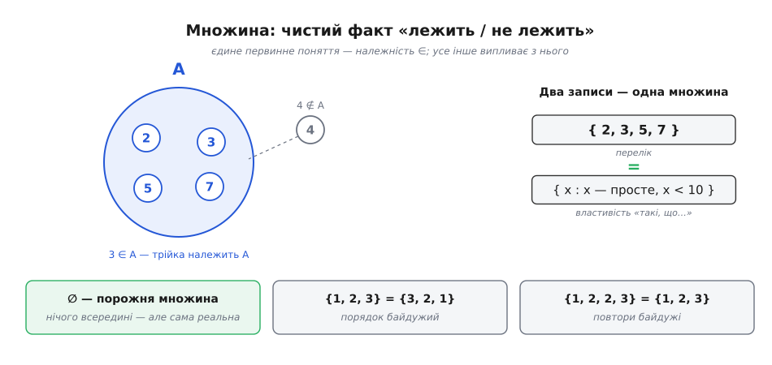
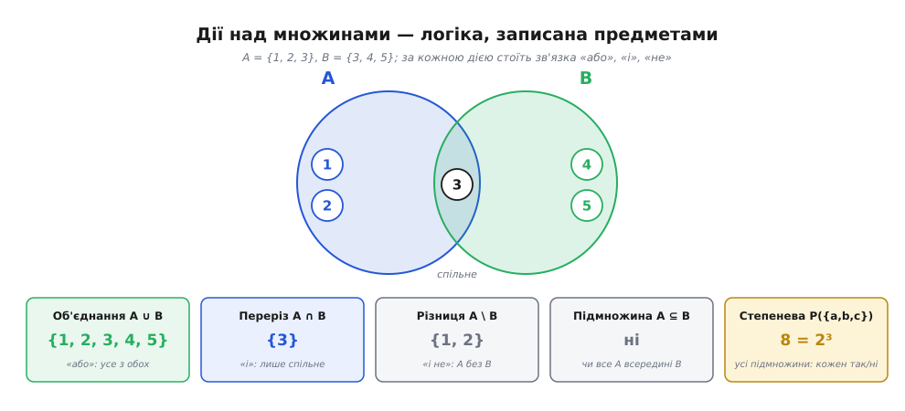
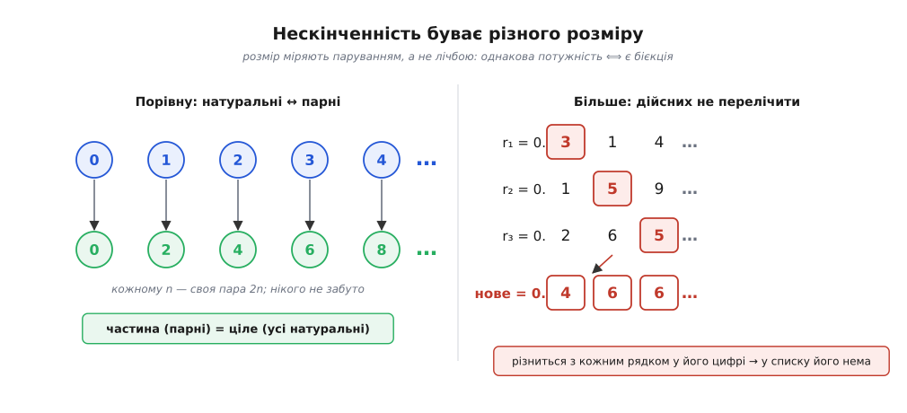
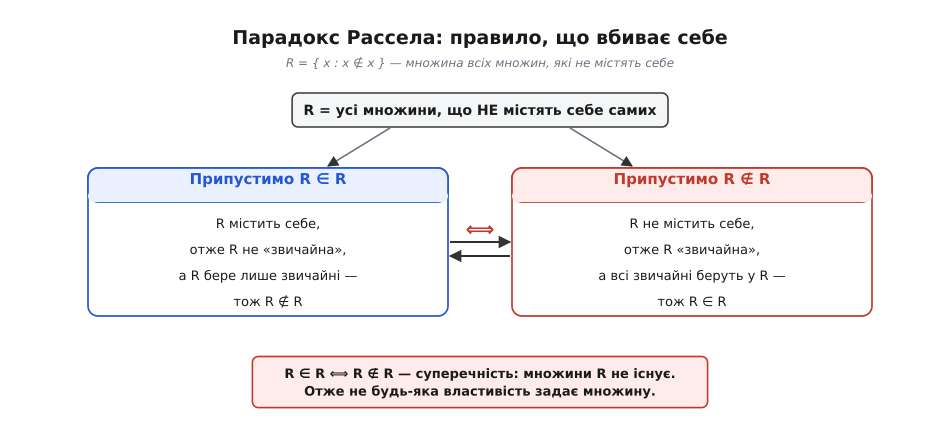

# Теорія множин

<preknowlist>
- [Математичне доведення](root:math-logic/mathematical-proof) — що таке аксіома, що означає «довести» і чим припущення відрізняється від висновку; знадобиться там, де наївні правила ламаються й доводиться будувати теорію обережно.
</preknowlist>

Візьміть три яблука на столі, ноти в акорді й планети, що ближчі до Сонця за Землю. На перший погляд — нічого спільного. Та математик каже: у кожному разі перед нами одне й те саме — **множина**, себто якісь предмети, зібрані думкою в одне ціле, про яке далі можна говорити як про окрему річ. Здається, що це надто просто, щоб бути глибоким. А насправді на цій одній ідеї — «зібрати щось у ціле» — стоїть уся сучасна математика: числа, функції, простори, ймовірності виявляються різними множинами, побудованими за різними правилами. Зрозуміти множину — це зрозуміти цеглину, з якої складено все інше.

Слово ввів наприкінці XIX століття Ґеорґ Кантор (нім. *Menge* — «сукупність, велика кількість»), і ввів не заради краси. Він бився над цілком конкретною задачею з аналізу — чи єдиним способом можна розкласти функцію в тригонометричний ряд, — і щоб її здолати, мусив навчитися говорити про **нескінченні сукупності точок** як про окремі об'єкти, порівнювати їх, різати на частини. Так побічно, з технічної потреби, народилася ціла наука, [історія якої варта окремої розповіді](root:math-logic/set-theory/hist-cantor.md). Почнімо ж із того, що таке множина сама по собі.

### Зібрати в ціле

Множина задається однією-єдиною відповіддю: про будь-який предмет вона каже, **лежить він у ній чи ні**. Оце «лежить у ній» — головне і, по суті, єдине первинне поняття всієї теорії; його звуть **належністю** й позначають знаком ∈. Запис `x ∈ A` читають «*x* належить *A*» (елемент *x* є в множині *A*), а `x ∉ A` — навпаки. Елемент (лат. *elementum* — «первина, складник») — це просто те, що в множині лежить. Більше про множину знати нічого не треба: дві множини однакові рівно тоді, коли в них ті самі елементи, і крапка.

З цього єдиного правила одразу випливають дві звички, які спершу дивують. По-перше, множині байдужий **порядок**: {1, 2, 3} і {3, 2, 1} — та сама множина, бо про кожне число обидві кажуть однакове «так, лежить». По-друге, їй байдужі **повтори**: {1, 2, 2, 3} — це знову ж таки {1, 2, 3}, адже питання лише в тому, чи є двійка всередині, а не скільки разів її вписали. Множина — не список і не мішок, де щось лежить «двічі» чи «на першому місці»; це чистий факт присутності.

Задати множину можна двома способами. Можна **перелічити** елементи — `{2, 3, 5, 7}`, — коли їх небагато. А коли їх забагато або й нескінченно, перелік замінюють **описом властивості**: `{ x : x — просте число }` читається «усі *x*, для яких правда, що *x* просте». Двокрапка тут означає «такі, що». Обидва записи задають ту саму річ — набір предметів; різниця лише в тому, показуємо ми їх пальцем чи називаємо ознаку, за якою їх упізнати.

Є й гранична, найбідніша множина — та, у якій **немає жодного елемента**. Її звуть порожньою й позначають ∅. Порожня множина одна-єдина (бо будь-які дві «нічого не містять» однаково, отже рівні), і вона зовсім не те саме, що «ніщо»: сама множина цілком реальна, просто всередині в неї порожньо — як порожня коробка, яка є, хоч у ній нічого немає. З цієї коробки зрештою можна зібрати геть усе.

А ще елементами можуть бути **самі множини**. Ніщо не забороняє множині `{ ∅, {1}, {1, 2} }`, де лежать три речі, і кожна з них — теж множина. Ця дрібниця виявиться напрочуд важливою: саме вона дасть змогу побудувати з множин числа, а згодом і породить найгостріший парадокс (гр. *parádoxos* — «проти сподівання») усієї теорії.


*Множина — це чистий факт «лежить / не лежить». Про кожен предмет вона відповідає лише «так» або «ні», тож порядок і повтори для неї не існують: {1,2,2,3} і {3,1,2} — та сама множина. Задають її або переліком, або властивістю. Порожня множина ∅ не містить нічого — але сама цілком реальна.*

### Дії над множинами

Якщо множини — це предмети, з ними мають бути й дії, як додавання з числами. І справді, з двох множин легко зробити третю, знову-таки не вигадуючи нічого, крім належності.

Найпростіше відношення — **підмножина**: `A ⊆ B` означає, що кожен елемент *A* лежить і в *B* (*A* цілком поміщається в *B*). Далі йдуть три основні дії. **Об'єднання** `A ∪ B` збирає все, що є хоч в одній з двох: елемент туди потрапляє, якщо він у *A* **або** в *B*. **Переріз** `A ∩ B` лишає тільки спільне: елемент проходить, якщо він у *A* **і** в *B*. **Різниця** `A \ B` — це те, що є в *A*, але чого немає в *B*. Придивіться: за кожною дією над множинами стоїть логічна зв'язка — «або», «і», «не». Це не збіг; множинні дії і є логіка, тільки записана через предмети, а не через істинність.


*За кожною дією стоїть логічна зв'язка: об'єднання — це «або», переріз — «і», різниця — «і не». Підмножина каже, що одне коло цілком усередині іншого. А степенева множина збирає геть усі підмножини даної — і їх завжди рівно 2ⁿ.*

Окремо стоїть дія, що з однієї множини робить значно більшу, — **степенева множина** (її ще звуть булеаном), позначувана `P(A)`: це множина **всіх підмножин** *A*. Порахуймо її для маленького прикладу — це найкраще показує, звідки береться її розмір.

**Умова: виписати всі підмножини множини {a, b, c} і знайти, скільки їх.**
```
∅                          — порожня (нічого не взяли)
{a}   {b}   {c}            — по одному елементу
{a,b} {a,c} {b,c}         — по два
{a,b,c}                   — усі три
```
Разом 1 + 3 + 3 + 1 = 8 підмножин. Звідки саме вісім? Погляньмо на кожну підмножину як на три незалежні рішення «так / ні»: чи брати *a*, чи брати *b*, чи брати *c*. Три вибори по дві можливості дають 2 · 2 · 2 = 2³ = 8. Тому для множини з *n* елементів підмножин завжди рівно **2ⁿ** — степенева множина росте вибухово, і це буде ключем до найглибшого відкриття теорії.

Ці абстрактні дії — не просто гра значків: вони буквально живуть у кожній мові програмування. Ось як ті самі об'єднання, переріз і належність виглядають у Python, де множина — вбудований тип:

```python
A = {1, 2, 3}
B = {3, 4, 5}

A | B        # об'єднання  → {1, 2, 3, 4, 5}
A & B        # переріз     → {3}
A - B        # різниця     → {1, 2}
A <= B       # чи A підмножина B? → False
3 in A       # належність  → True
```

> 🔧 **Навіщо це.** Коли база даних виконує запит «клієнти з Києва, які купували за останній місяць», вона перетинає дві множини — «кияни» ∩ «покупці місяця». Коли компілятор перевіряє, які змінні «живі» в точці програми, він ганяє об'єднання й різниці множин змінних. Індекси пошуковика — це переріз списків документів. Множинні дії — не шкільна абстракція, а щоденний робочий інструмент; [як вони реалізовані в коді й чому належність коштує майже нічого](root:math-logic/set-theory/proj-sets-in-code.md) — окрема практична замітка.

### Чому це підвалини всієї математики

Тепер — головне, заради чого множини й стали мовою математики. Виявляється, майже кожен математичний об'єкт можна **зібрати з самих лише множин**, не додаючи жодної нової сутності. Це схоже на те, як уся хімія речовин зводиться до кількох десятків атомів: тут «атом» один — множина, а «зв'язок» один — належність.

Візьмімо **впорядковану пару** (*a*, *b*), де порядок уже важливий: лівий елемент не те саме, що правий. Множина порядку не знає, але пару все одно можна закодувати самими множинами — хитрощами `(a, b) = { {a}, {a, b} }`: у цій конструкції видно, хто «перший» (той, що самотою), а хто «другий». Маючи пари, будуємо **відповідність** (математики кажуть «відношення») як множину пар; а **функцію** — як таку множину пар, де кожному входу відповідає рівно один вихід. Виходить, що функція — це не якась окрема магія, а просто спеціальна множина. Так само з множин збудували й самі **числа**: нуль — це порожня множина ∅, а кожне наступне число — множина всіх попередніх, тож числа теж виявляються множинами особливого ґатунку. [Як саме з порожньої множини виростають пари, функції та всі числові системи](root:math-logic/set-theory/math-everything-is-a-set.md) — окрема, дуже показова побудова; а те, [як із порожнечі й дії «наступний» постає вся арифметика](root:math-logic/natural-numbers) — тема натуральних чисел.

Ось чому теорію множин звуть фундаментом. Не тому, що вона найважливіша чи найцікавіша, а тому, що на неї можна **поставити все інше**: домовившись про множини та їхні правила, ми більше не мусимо окремо постулювати, «що таке функція» чи «що таке число», — усе це вже є всередині. Одна мова на всю математику.

### Нескінченність буває різного розміру

І тут теорія множин зробила крок, який спершу здавався божевіллям, а тепер вважається одним з найкрасивіших відкриттів людства. Питання просте: як порівняти розміри двох множин? Для скінченних — легко, порахуй елементи. Але як порівняти дві **нескінченні** множини, де рахувати ніколи не скінчиш?

Кантор дав відповідь, гідну свого генія: не рахуймо, а **паруймо**. Дві множини мають однаковий розмір, якщо їхні елементи можна поставити в пари — кожному елементу першої рівно один елемент другої, і навпаки, без залишків з жодного боку. Таке досконале парування звуть **бієкцією** (лат. *bi-* «двічі» + *iacere* «кидати»; взаємно однозначна відповідність). Для скінченних множин це просто інший спосіб сказати «порівну». А для нескінченних — єдиний спосіб, який узагалі має сенс, і він дає карколомні наслідки.

Скільки є парних чисел? «Удвічі менше, ніж усіх», — підказує чуття. А тепер спаруймо кожне натуральне число *n* з парним числом 2*n*: 0↔0, 1↔2, 2↔4, 3↔6, … Кожне натуральне дістало свою пару, кожне парне — теж, нікого не забуто й не повторено. Отже, **парних чисел рівно стільки ж, скільки всіх натуральних** — попри те, що парні є лише «половиною». Для нескінченних множин частина може дорівнювати цілому; це не помилка, а сама природа нескінченного.

Може, тоді всі нескінченності однакові, і всі вони — просто «нескінченність»? Ні. Кантор довів (уперше 1874 року) приголомшливу річ: **дійсних чисел строго більше, ніж натуральних**. Скільки не паруй натуральні числа з точками на прямій — завжди знайдеться точка, яку проґавили; нескінченність континууму більша за нескінченність лічби. Доводять це знаменитим [діагональним методом](root:math-logic/cantor-diagonal) — беруть будь-яке гадане парування й будують число, що відрізняється від кожного в списку хоча б однією цифрою, тож у списку його бути не могло. Отже, існує **ієрархія нескінченностей**: ті множини, що їх можна повністю перелічити в один нескінченний список (як натуральні числа), звуть [зліченними, а більші за них — незліченними](root:math-logic/countable-sets). Розмір множини — навіть нескінченної — назвали її **потужністю**; і потужностей, як з'ясувалося, безліч, одна більша за іншу.


*Розмір міряють паруванням. Натуральні числа парують з парними один-в-один (n ↔ 2n) — отже, їх порівну, хоч парні й «половина». А от дійсні числа спарувати з натуральними неможливо: за будь-яким списком діагональний метод будує число, якого в ньому немає. Нескінченність континууму строго більша за нескінченність лічби.*

### Тріщина в підмурку: парадокс Рассела

Поки Кантор будував свій рай нескінченностей, під ним визрівала прірва. Наївне правило задавати множину властивістю здавалося очевидним: яку ознаку не візьми, є множина всіх предметів, що її мають. Саме на цьому правилі німецький логік Ґотлоб Фреге зводив увесь фундамент арифметики. Аж 1901 року молодий Бертран Рассел поставив одне лукаве питання — і фундамент тріснув.

Ознака Рассела така: назвімо множину **звичайною**, якщо вона не містить саму себе як елемент (майже всі множини звичайні — множина яблук не є яблуком). Тепер за наївним правилом збираємо `R = { x : x ∉ x }` — множину всіх звичайних множин. І питаємо: а сама *R* — звичайна? Тобто чи `R ∈ R`?

```
Якщо R ∈ R  →  R містить себе  →  R НЕзвичайна  →  R ∉ R
Якщо R ∉ R  →  R не містить себе →  R звичайна   →  R ∈ R
```

Обидві дороги ведуть у стіну: припустивши одне, дістаємо протилежне. Множина *R* не може ні належати собі, ні не належати — а іншого не дано. Це не хитра загадка з відповіддю, яку ми проґавили; це [справжня суперечність](root:math-logic/russell-paradox), яка означає, що наївне правило **саме по собі несправне**. Рассел написав про це Фреге 1902 року, коли той якраз друкував другий том своєї головної праці, — і Фреге чесно дописав у кінці, що підвалину його будівлі вибито. Не можна дозволяти **будь-якій** властивості задавати множину: деякі описи, цілком осмислені на слух, не відповідають жодній множині взагалі.


*Наївне правило «будь-яка властивість задає множину» вбиває себе саме. Множина R усіх множин, що не містять себе, заганяє себе в кут: якщо вона в собі — то за означенням не має там бути, а якщо не в собі — то мусить. Обидві відповіді хибні водночас, тож множини R просто не існує — правило треба обмежити.*

### Як полагодили: аксіоматична теорія множин

Спокуса після такого — оголосити всю теорію хворою й викинути. Але математики вчинили мудріше: не викинули множини, а **приборкали правило їх творення**. Ернст Цермело 1908 року виписав список аксіом (гр. *axíōma* — «безсумнівне засадниче твердження»), які чітко кажуть, які множини **дозволено** будувати, — і серед них немає тієї, що народжує Расселове чудовисько. Головна хитрість зветься аксіомою виділення: властивістю не можна створити множину **з нічого**, можна лише **вирізати підмножину з уже наявної**. Замість зловісного `{ x : x ∉ x }` дозволено тільки `{ x ∈ A : x ∉ x }` — але це вже нешкідливо, бо спирається на готову множину *A*.

Ще одна ідея прибирає множини, що містять самі себе, начисто: увесь світ множин будують **знизу, поетапно**. На дні — порожня множина; далі на кожному кроці беруть усе, що можна зібрати з уже наявного; і жодна множина не з'являється раніше за свої елементи. У такій вежі множина просто не може містити саму себе, а «множини всіх множин» немає взагалі — вона ніколи не «добудовується». Систему Цермело допрацювали Абрагам Френкель і Торальф Скулем (обидва 1922 року), додавши ще кілька аксіом; разом з окремою [аксіомою вибору](root:math-logic/axiom-of-choice) вона й стала [сучасним стандартом на ім'я ZFC](root:math-logic/zfc-set-theory) — фундаментом, на якому сьогодні формально стоїть решта математики. Наївну простоту довелося проміняти на обережні правила — але саме ця обережність тримає всю будівлю, щоб вона знову не завалилася в парадокс.

### Питання, на яке годі відповісти

Насамкінець — тонкість, що показує, які глибокі води ми зачепили. Кантор знав дві нескінченності: розмір натуральних чисел і більший за нього розмір дійсних. Природно спитати: а чи є щось **між** ними — множина, більша за натуральні числа, але менша за дійсні? Кантор вірив, що ні (це припущення звуть гіпотезою континууму), і роками намагався його довести. Гільберт 1900 року поставив його **першим** у списку найважливіших нерозв'язаних задач століття.

Розв'язка виявилася химернішою за будь-який здогад. Курт Гедель 1940 року довів, що гіпотезу континууму **не можна спростувати** з аксіом ZFC. А Пол Коен 1963 року — що її й **не можна довести**. Разом це означає: питання [лежить поза досяжністю нинішніх аксіом узагалі](root:math-logic/continuum-hypothesis) — теорія множин не каже про нього ні «так», ні «ні». Можна прийняти гіпотезу — вийде несуперечлива математика; можна прийняти її заперечення — вийде інша, теж несуперечлива. Фундамент, на якому стоїть уся математика, виявився достатньо міцним, щоб на ньому все звести, — і водночас не всесильним: у нього є прості на слух питання про власні множини, на які він принципово не має відповіді.

---

Отже, **множина** — це найпростіша й найглибша ідея математики: якісь предмети, зібрані думкою в одне ціле, про яке відомо єдине — що в ньому лежить, а що ні. З цього одного відношення належності виростає все: дії «об'єднати», «перетнути», «відняти» виявляються логікою в предметах; впорядковані пари, функції та числа виявляються особливими множинами, тож теорія множин стає спільною мовою всієї математики. Кантор показав, що навіть нескінченність має різні розміри, які міряють не лічбою, а паруванням, — і що дійсних чисел строго більше, ніж натуральних. Наївна свобода творити множину з будь-якої властивості привела до парадоксу Рассела, і його довелося приборкати обережними аксіомами ZFC, де множини будують знизу, а не викликають з нічого. А над усім цим висить гіпотеза континууму — нагадування, що навіть найтвердіший фундамент математики має щілини, крізь які видно межу самого пізнання.
