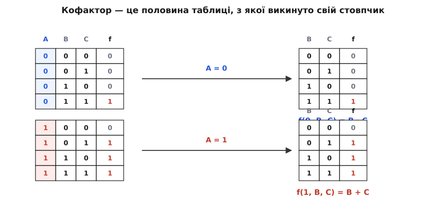
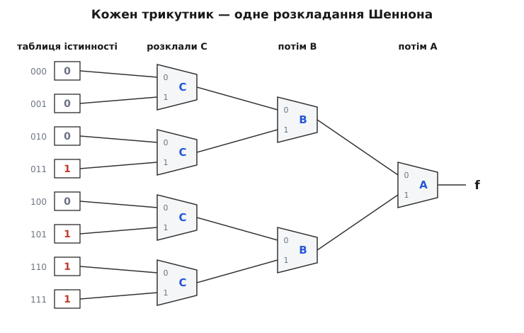
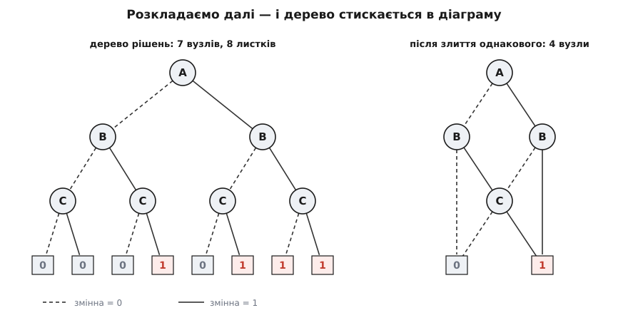

# Теорема Шеннона про розкладання

<preknowlist>
- [Булева алгебра](root:math-logic/boolean-algebra) — операції «і» (·), «або» (+), «не» (‾), закони A·1 = A, A·0 = 0, A + Ā = 1, поглинання A + A·B = A; таблиця істинності як вичерпний опис функції.
- [Мультиплексор](root:hw-digital/multiplexer) — вузол, що пропускає на вихід один із двох входів залежно від керувального сигналу.
- [Рекурсія](root:sf-algorithms/recursion) — розв'язок, що звертається сам до себе на меншій задачі й спиняється на тривіальному випадку.
</preknowlist>

Логічна функція від n змінних — річ оманливо дрібна на вигляд і страхітлива за розміром. Її чесний опис — таблиця істинності на 2ⁿ рядків: десять входів дають тисячу рядків, двадцять — мільйон, шістдесят чотири — більше рядків, ніж минуло секунд від Великого вибуху. Такої таблиці ніхто ніколи не побачить цілком. А проте питання до схем із десятками входів інженер ставить щодня, і питання гранично конкретні: чи ці дві схеми — та сама функція? чи існує взагалі набір входів, на якому ввімкнеться аварійний вихід? чи можна зібрати це дешевше?

Отже, потрібен важіль: спосіб стверджувати щось про функцію, не переглядаючи всіх її рядків. У двозначному світі такий важіль рівно один, і він до сміховинного простий. Змінна тут або 0, або 1 — третього немає. Тому будь-яке питання про функцію можна поставити двічі: «а що, як ця змінна — одиниця?» і «а що, як нуль?». Дві відповіді разом накривають геть усе, бо накривати більше нема чого.

Теорема про розкладання (англ. *expansion*, від лат. *expandere* — «розгортати») стверджує, що цей обмін чесний до останнього біта: розпад на два випадки не втрачає нічого, а склеювання половин назад коштує один рядок алгебри.

### Розкладання за однією змінною

Візьмімо функцію f(x, y, z, …) і виберімо в ній одну змінну — хай це буде x. Підставмо замість неї одиницю. Вийде f(1, y, z, …) — уже інша функція, від решти змінних: x у ній не лишилося взагалі, вона про нього нічого не знає. Так само підстановка нуля дає f(0, y, z, …). Обидві простіші за вихідну — у кожної на одну змінну менше.

Тепер саме твердження:

```
f(x, y, z, …)  =  x · f(1, y, z, …)  +  x̄ · f(0, y, z, …)
```

Доведення вміщається у два рядки, і в цьому вся краса.

```
При x = 0:  0 · f(1, y, z, …)  +  1 · f(0, y, z, …)  =  f(0, y, z, …)   ✓
При x = 1:  1 · f(1, y, z, …)  +  0 · f(0, y, z, …)  =  f(1, y, z, …)   ✓
```

Обидва рази права частина дала рівно те, чим є ліва при цьому значенні x. Інших значень x не набуває — тож дві перевірки доводять тотожність на всіх наборах одразу: решта змінних у обох частинах їдуть пасажирами й ні на що не впливають. Рідкісний випадок, коли «перебрати всі випадки» — не втеча від доведення, а повноцінне доведення на два рядки.

Придивімося до форми виразу: `x·A + x̄·B` — це «якщо x, то A, інакше B». Розгалуження, записане алгеброю. Та сама конструкція, яку програміст пише як `if`, а схемотехнік малює трикутником мультиплексора. Три різні мови, одна думка — і теорема каже, що цією думкою можна виразити **будь-яку** логічну функцію, бо жодних припущень про f ми не робили.

З тотожності негайно випливає наслідок, заради якого вона переважно й потрібна: **дві функції рівні тоді й лише тоді, коли рівні їхні половини**. Справді, якщо f(1,…) = g(1,…) і f(0,…) = g(0,…), то праві частини розкладань для f і g — той самий вираз буква в букву, а отже, f = g. У зворотний бік ще простіше: рівні функції дають рівні підстановки. Питання про рівність двох функцій від n змінних щойно перетворилося на два питання про рівність функцій від n−1 змінної.

> 🔧 **Навіщо це.** Коли верифікатор питає «чи ця перероблена схема робить те саме, що й стара?», він не звіряє таблиці на 2⁶⁴ рядків — це неможливо. Він бере одну змінну, розкладає за нею обидві функції й порівнює половини; кожна половина розкладається далі. Задача весь час ділиться навпіл, а однакові піддерева впізнаються й порівнюються один раз. Уся індустрія формальної верифікації мікросхем стоїть на цьому кроці — інших входів у задачу просто немає.

### Кофактори: половина таблиці

Дві функції, що народилися з підстановки, мають назву: **кофактори** (від лат. *co-* — «спільно» і *factor* — «той, що робить»; тут — співмножник, що стоїть при змінній). f(1, y, z, …) — позитивний кофактор за x, скорочено f₁; f(0, y, z, …) — негативний, f₀. Кажуть іще «звуження функції» — назва теж чесна, бо підстановка звужує область, у якій функцію розглядають.

Слово звучить поважно, а річ за ним — до сміху дешева.


*Мажоритарна функція f = A·B + A·C + B·C («одиниця, коли одиниць на вході більшість») і її розкладання за A. Верхня половина таблиці — усі рядки, де A = 0; у ній стовпчик A всюди однаковий, а тому не несе інформації, і його можна викинути. Лишається повноцінна таблиця функції двох змінних — це й є кофактор f(0, B, C) = B·C. Нижня половина так само дає f(1, B, C) = B + C. Жодних обчислень: кофактор — це просто половина рядків без свого стовпчика.*

Ось чому важіль працює. Розкладання не потребує кмітливості, здогаду чи перебору: узяти половину таблиці — операція механічна. Функція від n змінних розпадається на дві від n−1 задарма, і кожну з них можна розкласти знову.

### Перенос суматора за один хід

Механічний прийом сам собою нічого не вартий, поки не покаже щось, чого не було видно. Візьмімо мажоритарну функцію не як абстракцію, а як те, чим вона є в кожному процесорі: **вихідний перенос однорозрядного суматора**. Перенос у наступний розряд виникає тоді, коли одиниць серед трьох входів — двох доданків A, B і вхідного переносу C — більшість.

**Приклад (перенос суматора).** Розкладімо перенос за вхідним переносом C.

```
Cout        = A·B + A·C + B·C

Cout|C=1    = A·B + A·1 + B·1
            = A·B + A + B                  A·1 = A
            = A + B                        A·B + A = A   (поглинання)

Cout|C=0    = A·B + A·0 + B·0
            = A·B                          A·0 = 0

Cout        = C·(A + B) + C̄·(A·B)          теорема про розкладання
```

Результат уже промовистий: перенос виникає або тому, що C = 1 і хоч один доданок його підхопив (A + B), або тому, що C = 0, зате обидва доданки одиниці (A·B). Але вираз ще й скорочується. Перевіримо здогад, що доданок `C̄` зайвий, тим самим інструментом — розкладемо за C кандидата `A·B + C·(A + B)`:

```
при C=1:  A·B + 1·(A + B)  =  A·B + A + B  =  A + B      = Cout|C=1   ✓
при C=0:  A·B + 0·(A + B)  =  A·B                        = Cout|C=0   ✓

Cout        = A·B + C·(A + B)
            = G + P·C                      G = A·B,  P = A + B
```

Кофактори збіглися — отже, функції рівні, і заперечення C̄ справді можна викинути: коли C = 1, доданок A·B уже накритий ширшим A + B, тож стерегти його нема потреби.

Те, що вийшло, має власні імена й ціле сімейство схем за собою: **G** (*generate*) — «перенос породжується тут» — і **P** (*propagate*) — «перенос крізь цей розряд пропускається». Рівняння `Cout = G + P·C` — фундамент [суматора з прискореним переносом](root:hw-digital/carry-lookahead-adder), де переноси всіх розрядів рахують наперед, не чекаючи, поки одиниця дошкандибає ланцюжком від молодшого біта. (У живих суматорах беруть P = A ⊕ B, бо той самий сигнал потрібен для біта суми; для переносу обидва варіанти дають те саме.) Одне розкладання за правильно вибраною змінною — і структура, на якій тримається швидка арифметика, лежить перед очима.

Звідси ж видно й перша пастка. Розкладання **завжди правильне, але не завжди найкоротше**: воно чесно тягне за собою обидва вартові, x і x̄, навіть коли один із них зайвий. Це не інструмент [мінімізації](root:hw-digital/logic-minimization) — на відміну від [карт Карно](root:hw-digital/karnaugh-maps), розкладання нічого не скорочує саме собою. Воно дає структуру; шукати в ній зайве — окрема робота.

### Те саме в машинному слові

Твердження «кофактор — це половина таблиці» перестає бути метафорою, щойно таблицю покласти в регістр. Функція трьох змінних — це вісім бітів, тобто один байт: біт номер i зберігає значення f на наборі з номером i. Тоді розкладання виконується зсувами й масками, а тотожність Шеннона стає складанням двох половин назад.

```c
#include <stdint.h>
#include <stdio.h>

/* Уся функція трьох змінних — 8 бітів: біт i несе значення f на наборі
   A = (i>>2)&1, B = (i>>1)&1, C = i&1. Мажоритарна функція A·B+A·C+B·C
   має одиниці в рядках 011, 101, 110, 111 — це 0xE8. */

static const uint8_t WHERE_1[3] = { 0xAA, 0xCC, 0xF0 };   /* де C=1, де B=1, де A=1 */

/* Кофактор за змінною j: лишаємо потрібну половину рядків і копіюємо її
   на місце викинутої — після цього змінна j ні на що не впливає. */
static uint8_t cofactor(uint8_t f, int j, int value)
{
    int shift = 1 << j;                  /* відстань між рядками, що різняться бітом j */
    uint8_t half = f & (value ? WHERE_1[j] : (uint8_t)~WHERE_1[j]);
    return value ? (uint8_t)(half | (half >> shift))
                 : (uint8_t)(half | (half << shift));
}

int main(void)
{
    uint8_t maj = 0xE8;
    printf("f           = %02X\n", maj);
    printf("f при C = 1 = %02X   (A + B)\n", cofactor(maj, 0, 1));
    printf("f при C = 0 = %02X   (A · B)\n", cofactor(maj, 0, 0));

    /* Тотожність — це просто збирання половин назад. Перевіримо її на ВСІХ
       256 функціях трьох змінних і за кожною з трьох змінних. */
    for (int f = 0; f < 256; f++)
        for (int j = 0; j < 3; j++) {
            uint8_t m = WHERE_1[j];
            uint8_t f1 = cofactor((uint8_t)f, j, 1);
            uint8_t f0 = cofactor((uint8_t)f, j, 0);
            if ((uint8_t)((m & f1) | (~m & f0)) != (uint8_t)f) {
                printf("спростовано: f=%02X, змінна %d\n", f, j);
                return 1;
            }
        }
    puts("тотожність справджується для всіх 256 функцій трьох змінних");
    return 0;
}
```

Програма друкує `f при C = 1 = FC` (це A + B) і `f при C = 0 = C0` (це A·B) — ті самі кофактори, що вийшли алгеброю, лише в шістнадцятковому вигляді, — а тоді мовчки перебирає всі 256 функцій трьох змінних і не знаходить жодного контрприкладу. Саме так функції й тримають справжні програми синтезу логіки: доки змінних не більше шести, уся таблиця істинності — це одне 64-бітове слово, а розкладання коштує пару тактів. [Розгорнути цей підхід у повноцінну рекурсивну машинку](root:math-logic/shannon-expansion/proj-recursive-expansion.md) — з деревом розкладань, спільними піддеревами та підрахунком розв'язків — можна на сотні рядків коду; там же видно, де вона вибухає й чому.

### Тотожність, відлита в кремнії

Вираз `x·f₁ + x̄·f₀` описує не лише думку, а й залізо. [Мультиплексор](root:hw-digital/multiplexer) (лат. *multiplex* — «багатократний») пропускає на вихід один із двох входів залежно від керувального сигналу: подали 0 — вийшов нульовий вхід, подали 1 — перший. Це буквально теорема про розкладання, вилита в кремній: керувальний сигнал — змінна x, входи — її кофактори.

А тепер прийом застосуємо не раз. Кофактори — теж функції, їх теж можна розкласти, і так доти, доки змінних не лишиться зовсім: на дні сидять уже не функції, а константи 0 і 1 — тобто рядки таблиці істинності.


*Мажоритарна функція, розкладена до кінця. Ліворуч — уся таблиця істинності у вигляді восьми констант; праворуч — вихід f. Кожен трикутник виконує одне розкладання: «змінна = 0 — верхній вхід, змінна = 1 — нижній». Дерево не обчислює нічого хитрого — воно просто вибирає потрібний рядок таблиці; цим і пояснюється, чому будь-яку функцію трьох змінних можна зібрати з семи однакових мультиплексорів, не знаючи про неї нічого.*

Ця картинка — точний опис [таблиці підстановки (LUT)](root:hw-digital/lut), базової клітинки [будь-якої FPGA](root:hw-digital/inside-fpga). Конфігураційна пам'ять зберігає ті самі 2ⁿ констант, дерево мультиплексорів вибирає з них рядок за входами — і мікросхема стає якою завгодно логікою, бо теорема гарантує, що іншої логіки не буває. Із того самого дерева випливає й [функціональна повнота](root:math-logic/functional-completeness) мультиплексора: маючи лише його й константи, можна зібрати «не» (входи 1 і 0), «і» (входи 0 і y), «або» (входи y і 1) — а отже, взагалі все.

### Розкласти все до кінця

Дерево з констант на дні — це не лише схема, а й алгебраїчний факт. Розкладімо f за x₁, потім кожен кофактор — за x₂, і так до останньої змінної. Кожен спуск домножує доданок на чергову змінну — пряму або з запереченням, — а на дні кожного шляху стоїть значення f на відповідному наборі:

```
f(x, y) = x·y·f(1,1) + x·ȳ·f(1,0) + x̄·y·f(0,1) + x̄·ȳ·f(0,0)
```

Вийшла канонічна (гр. *kanōn* — «мірило») [сума добутків](root:math-logic/boolean-algebra): по одному доданку на кожен рядок таблиці, а значення f у ролі коефіцієнта — воно або лишає доданок, або гасить його нулем. Тобто «будь-яку функцію можна записати сумою добутків» — не окрема істина, яку треба запам'ятати, а просто ця сама теорема, догнана до дна. Саме так її й уживав Джордж Буль (*George Boole*), називаючи процедуру **розвитком** функції.

Дно, щоправда, коштує 2ⁿ доданків — від тієї самої експоненти ми й тікали. Порятунок у тому, що дерево розкладань майже завжди страшенно надлишкове: різні шляхи приводять до однакових підфункцій.


*Ліворуч — розкладання, доведене до кінця: вісім листків у порядку рядків таблиці. Праворуч — те саме після двох прибирань. Перше: однакові піддерева не тримають двічі — усі листки «0» стають одним листком, усі «1» — одним, а вузол C, до якого приводять і гілка «B = 1» при A = 0, і гілка «B = 0» при A = 1, лишається в одному примірнику. Друге: вузол, обидві гілки якого ведуть в одне й те саме місце, викидають — його змінна на результат не впливає. Було сім вузлів рішення і вісім листків — лишилося чотири й два, а функція та сама.*

Так народжується [двійкова діаграма рішень](root:hw-digital/binary-decision-diagram) — структура, у якій зберігають логіку сучасні верифікатори. Її головна властивість цінніша за компактність: якщо змінні розкладають у **сталому порядку** й старанно зливають однакове, то в кожної функції діаграма рівно одна. Дві функції рівні тоді й лише тоді, коли їхні діаграми — той самий об'єкт у пам'яті; порівняння таблиць на мільярд рядків вироджується в порівняння двох вказівників.

Лишається пояснити, чому весь цей спуск узагалі можливий. Річ у тім, що підстановка **проходить крізь операції наскрізь**:

```
(f · g)|x=1  =  f|x=1 · g|x=1        (f + g)|x=1  =  f|x=1 + g|x=1        (f̄)|x=1  =  (f|x=1)‾
```

Підстановці байдуже до будови виразу — вона просто підміняє букву, а «і», «або» й «не» рахуються після того однаково. Тому розкладати можна не готову функцію, а її формулу, і зібрати результат із розкладених частин. На цій непримітній властивості тримається вся рекурсивна техніка роботи з логікою; [алгебра кофакторів](root:math-logic/shannon-expansion/math-cofactors.md) — від строгого доведення й двоїстої форми до похідної булевої функції та розкладання Давіо — розгортає її як окремий апарат.

### Розгалуження в пошуку

Питання «чи існує набір входів, на якому f = 1?» — [задача здійсненності](root:computability/boolean-satisfiability) — теж не має чесних ходів, крім одного. Візьмімо змінну x. Якщо потрібний набір існує, у ньому x або 1, або 0; отже, f здійсненна тоді й лише тоді, коли здійсненний хоч один із кофакторів. Це знову теорема, лише прочитана як «або»:

```
∃x f  =  f₁ + f₀            f здійсненна ⟺ здійсненна f₁ або f₀
∀x f  =  f₁ · f₀            f істинна завжди ⟺ істинні обидва кофактори
```

Саме це робить розв'язувач, коли обирає змінну й пробує їй значення: він виконує розкладання Шеннона й спускається в один із кофакторів, лишивши другий на потім. Уся конструкція — [розділяй і володарюй](root:sf-algorithms/divide-and-conquer) у найчистішому вигляді: та сама задача, на змінну менша. Правило розгалуження, з якого 1962 року почалися всі сучасні SAT-розв'язувачі, — це воно й є; уся дальша хитрість галузі стосується того, **яку** змінну брати й що запам'ятовувати з провалених гілок, а не самого кроку.

### Де важіль не рятує

Теорема нічого не обіцяє про розмір — лише про правильність, і три межі варто знати наперед.

Перша вже траплялася на переносі суматора: розкладання дає структуру, а не мінімум. Вартові x і x̄ виписуються завжди, навіть коли один зайвий.

Друга — **порядок змінних**. Дерево розкладань залежить від того, з якої змінної починати, і різниця буває катастрофічна: для функції `x₁·y₁ + x₂·y₂ + … + xₙ·yₙ` порядок «пара за парою» дає діаграму, що росте лінійно, а порядок «спершу всі x, потім усі y» — експоненційно, бо перед першим y доводиться пам'ятати всі n значень x. Функція та сама; змінилося тільки, у якому порядку ставити запитання.

Третя — найтверезіша. Жодне розкладання не скасовує експоненти. Є функції, у яких діаграма велика **за будь-якого** порядку: класичний приклад — середній біт добутку двох n-бітових чисел, для якого Рендел Браянт (*Randal Bryant*) 1991 року довів нижню оцінку 2^(n/8) вузлів незалежно від порядку змінних (усталений результат). Розкладання — це важіль, а не диво: воно дає за що вхопитися там, де раніше не було нічого, але переставити гору не обіцяє.

### Чия це теорема

Назва «розкладання Шеннона» тримається в інженерній літературі міцно, а от історія за нею інша.

Тотожність надруковано в Джорджа Буля у «Дослідженні законів думки» (*An Investigation of the Laws of Thought*, 1854) — як Твердження II, «розвинути функцію, що містить будь-яке число логічних символів». В алгебрі Буля заперечення записували як (1 − x), тож його рядок виглядав так: f(x) = f(1)·x + f(0)·(1 − x) — та сама формула, буква в букву. Логіки XIX століття користувалися нею широко.

Клод Шеннон (*Claude Shannon*) у магістерській роботі 1937 року, надрукованій 1938-го, зробив інше й теж величезне: показав, що двозначна алгебра Буля описує схеми з реле й перемикачів. Саму тотожність із її схемною інтерпретацією він навів у праці 1949 року про синтез двополюсних схем. Література з логічного синтезу після того закріпила за нею його ім'я — атрибуцію, яку фахівці називають хибною прямим текстом (Перковський і Григель, 1995; Браун, 2012). Статус: **усталено**, що першість — Булева, а внесок Шеннона реальний, але інший — не тотожність, а міст між нею та залізом. [Як формула 1854 року дочекалася свого імені](root:math-logic/shannon-expansion/hist-boole-shannon.md) — сюжет із бідного шевського сина, релейних схем і звички галузі називати речі на честь того, хто голосніше показав, навіщо вони.

Справедливості заради, ім'я прижилося не на порожньому місці. Буль розвивав функції, щоб розв'язувати рівняння логіки; Шеннон розкладав їх, щоб будувати схеми, — і саме в цьому другому житті одна арифметична тотожність виявилася хребтом усієї цифрової техніки. Мультиплексор, клітинка FPGA, канонічна сума добутків, діаграма рішень у верифікаторі, розгалуження SAT-розв'язувача — усе це один і той самий хід, зроблений із різними намірами: узяти змінну й запитати, а що, як вона одиниця.
