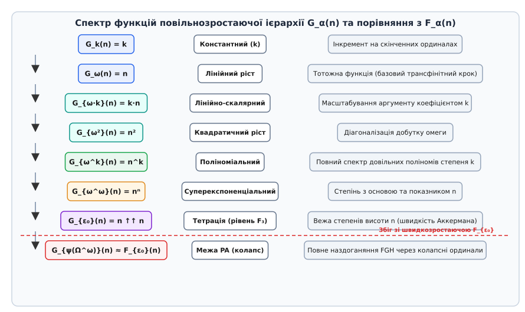
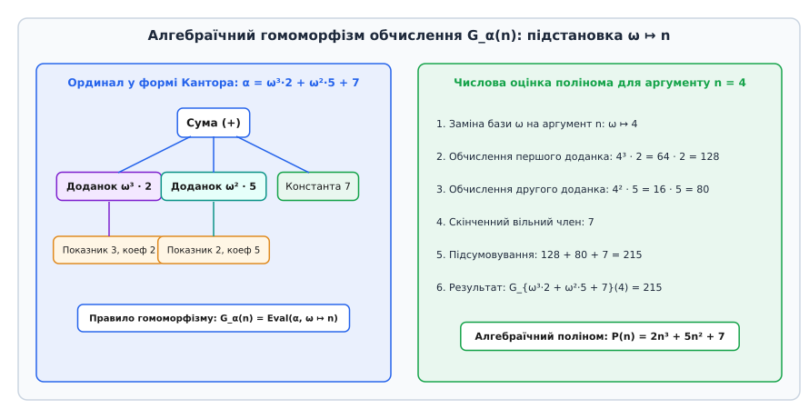
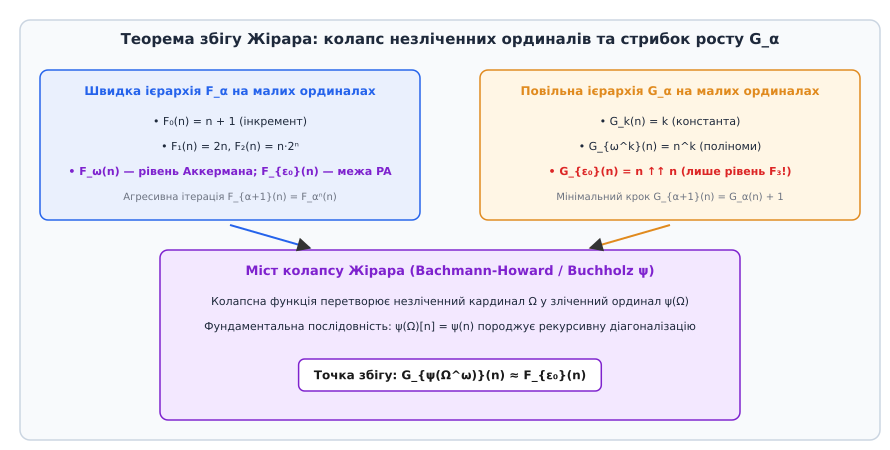
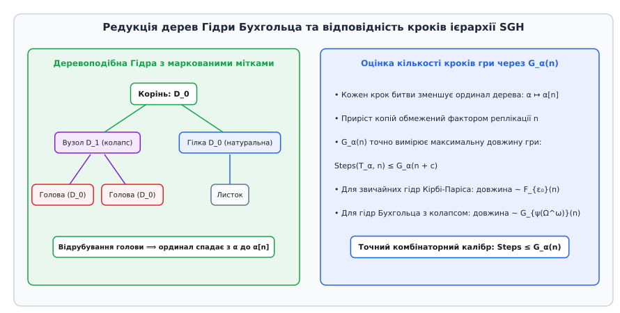

# Повільнозростаюча ієрархія

<preknowlist>
- [Швидкозростаюча ієрархія](root:math-logic/fast-growing-hierarchy) — FGH, трансфінітна діагоналізація, рівні від додавання до межі Пеано.
- [Порядкові числа (ординали)](root:math-logic/ordinal-numbers) — цілковите впорядкування, нескінченні лічильники, ω, ε₀ та нормальна форма Кантора.
- [Ієрархія Веблена](root:math-logic/veblen-hierarchy) — нерухомі точки, розширення Канторової форми та предикативна межа Γ₀.
- [Системи переписування термів](root:computability/term-rewriting-systems) — TRS, правила редукції, ординальні порядки RPO та KBO.
- [Функція Аккермана](root:computability/ackermann-function) — діагоналізація гіпероператорів, не-примітивна рекурсія та шкала F_ω.
- [Арифметична ієрархія та арифметика Пеано](root:math-logic/peano-arithmetic) — формальні системи, аксіоми індукції та обчислювальні межі.
- [Теорема Паріса — Гаррінгтона](root:math-logic/paris-harrington-theorem) — комбінаторні принципи, недовідні у формальній арифметиці.
- [Асимптотична складність](root:computability/asymptotic-complexity) — O-нотація, класи складності, поліноми та експоненти.
- [Теорема Геделя про неповноту](root:math-logic/godel-incompleteness) — синтаксичні межі, недоказовність несуперечливості та трансфінітні розширення.
</preknowlist>

Коли алгоритмічний аналізатор досліджує процедуру нормалізації у типізованому лямбда-численні, розв'язання рівнянь Knuth-Bendix чи завершуваність гри в Гідру, традиційна шкала швидкозростаючої ієрархії виявляється парадоксально сліпою до дрібних деталей процесу. Її крок наступника `F_{α+1}(n) = F_α^(n)(n)` настільки вибуховий, що будь-який поліноміальний ріст — чи то лінійний `O(n)`, квадратичний `O(n²)`, чи кубічний `O(n³)` — грубо стискається в один і той самий нульовий та перший рівні. Швидка шкала бачить лише стрибки між класами примітивної рекурсії, функцією Аккермана та межею арифметики Пеано, але повністю втрачає можливість виміряти точну кількість елементарних кроків, які робить алгоритм усередині поліноміального та елементарного світів.

Причина цієї сліпоти полягає в тому, що дерева переписування термів і комбінаторні графи зменшуються не стрибками через суперпозиції функцій, а поступово — відтинанням однієї гілки за раз. Для точного вимірювання таких делікатних обчислювальних траєкторій потрібна функціональна шкала, яка робить найменший можливий крок на кожному етапі індукції. Такою вимірювальною лінійкою є повільнозростаюча ієрархія (англ. *Slow-Growing Hierarchy*, SGH), яка перетворює складну геометрію нескінченних ординалів Кантора на прямий алгебраїчний гомоморфізм числових поліномів.

## Межа швидкозростаючої шкали та потреба у повільному калібруванні

У класичному ординальному аналізі складності кожному алгоритму або формальній теорії зіставляють ординальне число (лат. *ordinalis* — порядковий). Ординал описує тип цілком упорядкованої множини кроків, необхідних для гарантованого завершення обчислення. Довгий час єдиним стандартним способом перетворення ординала на числову функцію складності була швидкозростаюча ієрархія `F_α`.

Проте на практиці `F_α` діє як астрономічний телескоп: вона чудово бачить наддалекі межі доказовості теорій, але не здатна розрізнити об'єкти на відстані витягнутої руки. Якщо перевірка типу програми займає `100 · n³` кроків, а оптимізація запиту до бази даних — `2ⁿ` кроків, для швидкозростаючої шкали обидві ці задачі є майже тривіальними: вони лежать нижче рівня `F₃`. Більше того, шкала `F_α` не відображає природну структуру додавання й множення ординалів. Наприклад, ординали `ω + 1`, `ω + 2`, `ω · 2` та `ω²` у швидкозростаючій ієрархії породжують стрибки через експоненти та тетрації, які не мають прямої відповідності до звичних поліномів.

Виникла фундаментальна потреба у створенні мікроскопа теорії складності — ієрархії, де операція переходу до наступного ординала збільшує значення функції лише на одиницю. Такий підхід дозволяє перевірити, наскільки далеко може зайти процес обчислень, якщо кожна трансформація додає мінімальний квант складності.

## Рекурсивне визначення та базова драбина рівнів SGH

Повільнозростаюча ієрархія (грец. *hierarchia* — священний порядок) визначається як сімейство тотальних обчислювальних функцій `(G_α)_{α < µ}`, де індекс `α` належить до множини зліченних трансфінітних ординалів, а аргумент `n` є додатним натуральним числом (`n ∈ ℕ, n ≥ 1`).

Побудова спирається на три базові правила, які прямо відповідають трьом типам ординальних чисел:

1. **Базовий крок (нульовий ординал `α = 0`):**
```
G₀(n) = 0
```
Функція `G₀` завжди повертає точний числовий нуль, фіксуючи початок відліку.

2. **Крок ординала-наступника (`α + 1`):**
```
G_{α + 1}(n) = G_α(n) + 1
```
На відміну від швидкозростаючої ієрархії, де крок наступника вимагав повної `n`-кратної діагоналізації `F_{α+1}(n) = F_α^(n)(n)`, повільнозростаюча ієрархія робить найпростішу базову дію — додає константу 1.

3. **Граничний крок (`α = λ`):**
```
G_λ(n) = G_{λ[n]}(n)
```
де `(λ[n])_{n ∈ ℕ}` є канонічною фундаментальною послідовністю менших ординалів, яка строго наближається до граничного ординала `λ` знизу (`sup { λ[n] | n ∈ ℕ } = λ`).


*Спектр рівнів повільнозростаючої ієрархії G_α(n) від скінченних констант до межі колапсу.*

Розглянемо, як ця проста трійка аксіом породжує всю шкалу обчислювальної складності:

### Скінченні ординали k < ω

Послідовне застосування аксіоми наступника для натуральних чисел дає:
```
G₁(n) = G₀(n) + 1 = 1
G₂(n) = G₁(n) + 1 = 2
G_k(n) = k
```
На всіх скінченних ординалах функція `G_k(n)` є тривіальною константою `k` і взагалі не залежить від вхідного числа `n`. Це означає, що скінченний індекс ординала вимірює лише чисту константну надбавку до загального часу роботи алгоритму.

### Перший нескінченний ординал ω та лінійні функції

За канонічним правилом фундаментальної послідовності `ω[n] = n`. Застосовуючи граничну аксіому, отримуємо:
```
G_ω(n) = G_{ω[n]}(n) = G_n(n) = n
```
Функція `G_ω` перетворюється на тотожне відображення — лінійну функцію `f(n) = n`.

Якщо ми додаємо скінченні константи до омеги, аксіома наступника природно переносить додавання у числовий результат:
```
G_{ω + 1}(n) = G_ω(n) + 1 = n + 1
G_{ω + k}(n) = n + k
```

### Множення на скінченні константи: ординали ω · k

Граничний ординал `ω · 2 = ω + ω` наближається послідовністю `(ω · 2)[n] = ω + n`. Тоді:
```
G_{ω · 2}(n) = G_{ω + n}(n) = G_ω(n) + n = n + n = 2n
```
Множення ординала на 2 згенерувало подвоєння числового аргументу.

Для довільного натурального множника `k` індукція дає:
```
G_{ω · k}(n) = k · n
```
Усі лінійні функції зі скалярними множниками точно каталогізуються ординалами першого поверху `ω · k`.

### Степені омеги та поліноміальний континуум

Граничний ординал `ω² = ω · ω` наближається послідовністю `(ω²)[n] = ω · n`. Застосуємо граничний перехід:
```
G_{ω²}(n) = G_{ω · n}(n) = n · n = n²
```
Ординал `ω²` породив чистий квадратичний ріст `n²`.

Для довільного натурального степеня `k`:
```
G_{ω^k}(n) = n^k
```
Повільнозростаюча ієрархія на скінченних степенях омеги охоплює повний спектр поліноміальної складності: кожен поліном степеня `k` має власний ординальний прообраз у формі Кантора.

## Теорема про алгебраїчний гомоморфізм Кантора

Справжня математична краса повільнозростаючої ієрархії розкривається у тому, як вона взаємодіє з канонічною нормальною формою Кантора (CNF). Будь-який ординал `α < ε₀` записується у вигляді скінченної суми степеней:

```
α = ω^(β₁) · c₁ + ω^(β₂) · c₂ + ... + ω^(βₘ) · cₘ
```
де `β₁ > β₂ > ... > βₘ ≥ 0` — спадна послідовність показників, а `cᵢ > 0` — натуральні коефіцієнти.


*Алгебраїчний гомоморфізм Кантора: заміна нескінченної бази ω на числовий аргумент n.*

Для будь-якого такого ординала обчислення `G_α(n)` є точним **алгебраїчним гомоморфізмом** (грец. *homos* — однаковий + *morphe* — форма): значення функції отримується прямою заміною кожного входження символу `ω` на число `n`.

Розглянемо, як працює це правило для складного ординала:
```
α = ω³ · 2 + ω² · 5 + 7
```
Для аргументу `n = 4` обчислення виконується за лінійний час безпосередньо за формою виразу:
```
G_α(4) = 4³ · 2 + 4² · 5 + 7 = 64 · 2 + 16 · 5 + 7 = 128 + 80 + 7 = 215
```

Операції над ординалами Кантора нижче `ε₀` повністю ізоморфні операціям над числовими функціями:
- Додавання ординалів `α + β` переходить у додавання функцій: `G_{α + β}(n) = G_α(n) + G_β(n)`.
- Множення ординалів `α · β` переходить у добуток функцій: `G_{α · β}(n) = G_α(n) · G_β(n)`.
- Піднесення омеги до степеня `ω^α` переходить у показникову функцію з основою `n`: `G_{ω^α}(n) = n^(G_α(n))`.

Цей дивовижний факт пояснює, чому SGH є найзручнішим аналітичним інструментом для розрахунку складності: замість виконання складних рекурсивних викликів комп'ютер просто оцінює поліноміальний вираз у точці `n`.

Детальний математичний апарат побудови фундаментальних послідовностей, доведення властивості Бахмана та теореми про гомоморфізм викладено у вставці [🧮 Алгебраїчний гомоморфізм, фундаментальні послідовності та теорема збігу](root:math-logic/slow-growing-hierarchy/math-slow-growing-proofs.md).

## Некомутативність ординальної арифметики та канонічна форма

Варто звернути увагу на важливу концептуальну деталь, яка часто спантеличує програмістів, що вперше стикаються з трансфінітними числами: арифметика ординалів є принципово некомутативною.

Розглянемо дві операції додавання:
```
1 + ω = sup { 1 + n | n ∈ ℕ } = ω
ω + 1 = { 0, 1, 2, ..., ω } > ω
```
Додавання скінченного елемента зліва поглинається нескінченністю `ω`, тоді як додавання справа створює новий виділений останній елемент.

Аналогічно для множення:
```
2 · ω = sup { 2 · n | n ∈ ℕ } = ω
ω · 2 = ω + ω > ω
```
Ліве множення на 2 відповідає нескінченній послідовності пар, яка ізоморфна звичайному натуральному ряду `ω`. Праве множення створює дві копії `ω`, що йдуть одна за одною.

Теорема про гомоморфізм Кантора працює саме тому, що нормальна форма Кантора завжди приводить вирази до канонічного вигляду зі старшими показниками степенів омеги, де множники стоять праворуч. Завдяки цьому канонічному розкладу некомутативність ординалів зникає, поступаючись місцем звичайній комутативній алгебрі цілих чисел над змінною `n`.

## Класифікація за Ґжеґорчиком та субрекурсивні замикання

У класичній теорії обчислюваності функції класифікують за класами Ґжеґорчика `Eⁿ` (розробленими польським логіком Анджеєм Ґжеґорчиком у 1953 році). Повільнозростаюча ієрархія встановлює точну границю між класами Ґжеґорчика через ординальні індекси форми Кантора:

1. **Клас E⁰ (константи та інкремент):** відповідає скінченним ординалам `k < ω`. Для кожного `k` функція `G_k(n) = k` належить до `E⁰`.
2. **Клас E¹ (лінійні функції):** породжується ординалами вигляду `ω · k`. Функції `G_{ω·k}(n) = k · n` є базовими генераторами класу лінійної складності.
3. **Клас E² (поліноми та множення):** відповідає ординалам `α < ω^ω`. Будь-який поліном степеня `k` кодується ординалом `ω^k`, тому клас `E²` тотожно збігається із субрекурсивним замиканням функцій `{ G_α | α < ω^ω }`.
4. **Клас E³ (елементарні функції за Кальмаром, експоненти та тетрації):** відповідає ординалам `α < ε₀`. Усі скінченні вежі степенів генеруються ординалами `ω ↑↑ k`.
5. **Клас примітивно-рекурсивних функцій PR:** відповідає ординалу Фефермана — Шютте `Γ₀` у повільнозростаючій ієрархії, оскільки `G_{Γ₀}` вперше виходить за межі будь-якого фіксованого примітивно-рекурсивного опису.

Цей ізоморфізм показує, що повільнозростаюча ієрархія є неперервною лінійкою, яка калібрує класи складності від елементарної арифметики до трансфінітних меж теорії доведень.

## Вихід за межі поліномів: суперекспоненти, тетрація та межа ε₀

Коли показник степеня омеги сам стає нескінченним ординалом, повільнозростаюча ієрархія плавно переходить від поліномів до суперекспоненціальних та гіперекспоненціальних класів складності:

1. **Рівень `ω^ω`:**
Фундаментальна послідовність `(ω^ω)[n] = ωⁿ`. Тоді:
```
G_{ω^ω}(n) = G_{ωⁿ}(n) = nⁿ
```
Функція росте швидше за будь-яку фіксовану експоненту `2^(c·n)`.

2. **Рівень `ω^(ω + 1)`:**
Фундаментальна послідовність `(ω^(ω + 1))[n] = ω^ω · n`. Тоді:
```
G_{ω^(ω + 1)}(n) = G_{ω^ω}(n) · n = nⁿ · n = n^(n + 1)
```

3. **Рівень веж степенів `ω^(ω^ω)`:**
```
G_{ω^(ω^ω)}(n) = n^(nⁿ) = n ↑↑ 3
```
де позначення `↑↑` вказує на операцію тетрації (вежу експонент).

4. **Межа арифметики Пеано `ε₀`:**
Ординал `ε₀` є найменшим розв'язком рівняння `ω^α = α` і визначається як супремум послідовності веж омег: `ε₀ = sup { ω, ω^ω, ω^(ω^ω), ... }`.
Канонічна фундаментальна послідовність для `ε₀` задається вежею омег висоти `n`: `ε₀[n] = ω ↑↑ n`.
Підставляючи це у визначення повільнозростаючої функції, отримуємо:
```
G_{ε₀}(n) = G_{ε₀[n]}(n) = G_{ω ↑↑ n}(n) = n ↑↑ n
```

Тут виникає разючий контраст між двома ієрархіями:
- Швидкозростаюча функція `F_{ε₀}(n)` виходить за межі всіх функцій, тотальність яких можна довести в арифметиці Пеано `PA`. Вона росте швидше за будь-яку примітивно-рекурсивну функцію і навіть швидше за функцію Аккермана.
- Повільнозростаюча функція `G_{ε₀}(n) = n ↑↑ n` є звичайною тетрацією — вона перебуває на скромному рівні `F₃` швидкозростаючої шкали і легко доводиться в елементарній арифметиці!

Цей гігантський розрив тривалий час змушував дослідників вважати, що повільна ієрархія принципово не здатна сягнути справжньої складності вищих формальних систем.

## Теорема Жірара про наздоганяння та колапс незліченних ординалів

У 1981 році французький логік Жан-Ів Жірар (фр. *Jean-Yves Girard*) перевернув уявлення про природу обчислювальної складності, довівши теорему про порівняння ієрархій (англ. *Girard's Hierarchy Comparison Theorem*).

Жірар довів, що якщо продовжити повільнозростаючу ієрархію за межі ординалів Веблена `φ_γ(β)` та предикативного ординала Фефермана — Шютте `Γ₀` у простір **ординальних колапсувальних функцій** (англ. *Ordinal Collapsing Functions*, OCF), повільна шкала неминуче «наздоганяє» швидку.


*Теорема збігу Жірара: механізм колапсу незліченних ординалів та вибуховий стрибок G_α.*

Як функція, що на кожному кроці додає лише одиницю, може досягти швидкості росту `F_{ε₀}`?

Секрет криється у використанні незліченного кардинала `Ω = ω₁` (перший незліченний ординал). Колапсувальна функція Бахмана — Бухгольца `ψ` проектує незліченні ординали назад у зліченний діапазон. При побудові фундаментальних послідовностей для колапсованих виразів незліченна база замінюється на аргумент `n`:
```
Ω[n] = n
```

Розглянемо ординал Бахмана — Говарда `BHO = ψ(ε_{Ω+1})` або спрощений вираз `α = ψ(Ω^ω)`.
При обчисленні повільної функції гранична підстановка замінює `Ω` на `n`, що призводить до лавиноподібного вкладення операцій:
```
G_{ψ(Ω^ω)}(n) = G_{ψ(Ωⁿ)}(n) = G_{ψ(nⁿ)}(n)
```
Оскільки внутрішній член `nⁿ` генерує каскад рекурсивних колапсів, дія операції `+ 1` повторюється стільки разів, що темп росту функції здійснює колосальний стрибок.

Жірар, а згодом Едвард Цихон і Стенлі Вейнер строго довели еквівалентність:
```
G_{ψ(Ω^ω)}(n) ≈ F_{ε₀}(n)
```

Повільнозростаюча ієрархія на ординалі Бахмана — Говарда породжує ту саму обчислювальну потужність, що й швидкозростаюча ієрархія на межі арифметики Пеано. Повна історія відкриття Жірара, наукових суперечок довкола дилататорів та розвитку теорії Цихона — Вейнера наведена у вставці [📜 Історія повільнозростаючої ієрархії та теореми Жірара](root:math-logic/slow-growing-hierarchy/hist-girard-hierarchy.md).

## Чутливість до фундаментальних послідовностей та умова Бахмана

Однією з найглибших відмінностей між швидкозростаючою та повільнозростаючою ієрархіями є їхня реакція на вибір фундаментальних послідовностей `λ[n]`.

У швидкозростаючій ієрархії операція наступника `F_{α+1}(n) = F_α^(n)(n)` діє як потужний стабілізатор: навіть якщо ми дещо змінимо наближення для граничного ординала (наприклад, оберемо `ω[n] = 2n` замість `n`), на наступних поверхах `n`-кратна суперпозиція поглине цю різницю, зберігши асимптотичний клас складності.

Натомість повільнозростаюча ієрархія є **гіперчутливою** до вибору фундаментальних послідовностей. Оскільки на кожному кроці додається лише одиниця, найменша зміна у призначенні граничних точок миттєво спотворює всю конструкцію. Якщо для `ω` взяти `ω[n] = 2n`, то замість `G_{ω^k}(n) = n^k` ми отримаємо `(2n)^k = 2^k · n^k`, що порушить властивість гомоморфізму Кантора.

Щоб уникнути подібних аномалій, система фундаментальних послідовностей повинна задовольняти **властивість Бахмана** (англ. *Bachmann's property*):
```
∀ n < m : λ[n] < λ[m]
∀ n < m : (λ[m])[n] ≤ λ[n]
```
Властивість Бахмана гарантує, що сітка наближень граничних ординалів є «вкладеною»: наближення з більшим індексом `m` при подальшій редукції з кроком `n` повертає нас у межі початкового наближення `λ[n]`. Тільки за виконання цієї умови повільнозростаюча ієрархія залишається монотонною, однозначною та коректною.

## Системи переписування термів та порядок рекурсивних шляхів

У теоретичній інформатиці однією з найважливіших практичних задач є перевірка завершуваності систем переписування термів (англ. *Term Rewriting Systems*, TRS). Системи TRS лежать в основі компіляторів функціональних мов, оптимізаторів SQL-запитів та систем комп'ютерної алгебри.

Для доведення завершуваності TRS кожному терму програми зіставляють ординальний індекс за допомогою порядку рекурсивних шляхів (англ. *Recursive Path Ordering*, RPO) або порядку Кнута — Бендікса (KBO). Якщо кожне правило переписування зменшує ординал терма, процес гарантовано зупиниться.

Проте інженерів цікавить не просто теоретична зупинка, а максимальна кількість кроків переписування (довжина деривації). Якщо оцінювати довжину деривації через швидкозростаючу ієрархію `F_α`, ми отримуємо астрономічні числа, які не несуть практичної користі. Повільнозростаюча ієрархія `G_α` надає точну, щільну верхню межу кількості кроків редукції, дозволяючи оцінити реальні часові витрати оптимізатора.

## Ієрархія Веблена та вихід до ординала Фефермана — Шютте Γ₀

Коли ми переходимо за межу ординала `ε₀`, канонічна форма Кантора перестає бути однозначною, оскільки `ε₀` є найменшим нерухомим коренем рівняння `ω^α = α`. Спроба записати `ε₀` через степені омеги призводить до нескінченного циклічного виразу `ω^(ω^(ω^...))`.

Для подолання цієї межі американський математик Освальд Веблен (англ. *Oswald Veblen*) у 1908 році ввів ієрархію функцій `φ_γ(β)`:
- `φ₀(β) = ω^β` — звичайна показникова функція Кантора;
- `φ₁(β) = ε_β` — послідовність епсилон-ординалів (`ε₀, ε₁, ε₂, ...`), тобто нерухомих точок експоненти `ω^α = α`;
- `φ₂(β) = ζ_β` — послідовність дзета-ординалів, тобто спільних нерухомих точок епсилон-функцій `ε_α = α`;
- `φ_{γ + 1}(β)` — функція, що перелічує нерухомі точки попередньої сім'ї функцій `φ_γ`.

Будь-який ординал нижче ординала Фефермана — Шютте `Γ₀` записується у **нормальній формі Веблена**:
```
α = φ_{γ₁}(β₁) + φ_{γ₂}(β₂) + ... + φ_{γₘ}(βₘ)
```
де кожен доданок задовольняє канонічну умову строгого спадання та рекурсивної нормалізації аргументів.

Фундаментальні послідовності для функцій Веблена будуються за рекурсивними правилами:
1. Для `ε₀ = φ₁(0)`: `ε₀[n] = ω ↑↑ n`.
2. Для ординала-наступника `ε_{β + 1} = φ₁(β + 1)`:
```
(ε_{β + 1})[0] = ε_β + 1
(ε_{β + 1})[n + 1] = ω^( (ε_{β + 1})[n] )
```
3. Для граничного індексу `ε_λ = φ₁(λ)`:
```
(ε_λ)[n] = ε_{λ[n]}
```

Обчислення повільнозростаючої функції на шкалі Веблена демонструє контрольований, плавний перехід через усі класи гіпероператорів:
- `G_{ε₀}(n) = n ↑↑ n` — тетрація (вежа степенів висоти `n`);
- `G_{ε₁}(n) = n ↑↑ (n ↑↑ n) = n ↑↑² 2` — пентація;
- `G_{ζ₀}(n) = G_{φ₂(0)}(n)` — гексація (наступний гіпероператор над пентацією);
- `G_{Γ₀}(n)` — вихід за межі всіх скінченних гіпероператорів.

Ординал Фефермана — Шютте `Γ₀ = sup { φ_α(0) | α < Γ₀ }` є строгою межею предикативного математичного аналізу (межа теорій, де множини визначаються без самопосилань на ще не побудовані сукупності). У повільнозростаючій ієрархії функція `G_{Γ₀}(n)` вперше досягає рівня повної функції Аккермана `F_ω(n)` з довільним змінним індексом.

## Анатомія Гідри Бухгольца: марковані дерева та повільні редукції

Класична комбінаторна гра в Гідру Кірбі — Паріса розгортається на скінченних кореневих немаркованих деревах. У цій грі Геракл на кожному кроці відтинає одну голову (листок дерева). У відповідь Гідра відрощує `n` копій пошкодженої гілки від найближчого вузла-предка. Довжина такої битви зростає катастрофічно швидко: навіть для простого дерева висоти 3 кількість кроків вимірюється значеннями швидкозростаючої функції `F_{ε₀}(n)`, що робить класичну гру недовідно тотальною в межах арифметики Пеано.

Проте для дослідження систем, що значно перевершують арифметику Пеано за теоретико-доказовою силою (зокрема теорії множин Кріпке — Платека `KP` та систем індуктивних визначень `ID₁`), німецький логік Вільфрід Бухгольц (нім. *Wilfried Buchholz*) розробив **Гідру з маркованими вузлами**.

Кожен вузол дерева Гідри Бухгольца має цілочисельну мітку `v ∈ {0, 1, ..., ν}`, яка кодує рівень колапсу незліченних ординалів:
- Мітка `0` представляє звичайні зліченні гілки (натуральні кроки редукції);
- Мітка `1` представляє перший незліченний кардинал `Ω = ω₁`;
- Мітка `ν` представляє вищі незліченні кардинали `Ω_ν`.

Правила битви з Гідрою Бухгольца безпосередньо моделюють дію ординальних колапсувальних функцій `ψ_ν`:
1. Геракл обирає голову (листок) `H` з найнижчою міткою `0`.
2. Відтинання голови зрізає сегмент до найближчого вузла-предка `P`.
3. Якщо на шляху від `H` до кореня зустрічається вузол `C` з вищою міткою `1` (точка колапсу), Гідра не просто дублює відрізану гілку: вона замінює незліченну мітку `1` на каскад із `n` зліченних гілок з міткою `0`.
4. Дерево трансформується за канонічною фундаментальною послідовністю ординалів `T_α ↦ T_{α[n]}`.


*Редукція дерев Бухгольца та оцінка довжини гри в Гідру через G_α.*

Оскільки ординал дерева спадає на кожному кроці за строгим порядком `α[n] < α`, битва гарантовано завершується повною загибеллю Гідри. Проте довжина битви для дерева з міткою колапсу виходить далеко за межі можливостей арифметики Пеано:
```
Steps(T_{ψ(Ω^ω)}, n) ≈ G_{ψ(Ω^ω)}(n) ≈ F_{ε₀}(n)
```

Коли ж розглядається **повільна гра в Гідру** (англ. *Slow Hydra*), де коефіцієнт розмноження копій обмежений або модифікуються внутрішні мітки колапсу за регулярними правилами Бухгольца, ординал дерева спадає плавно й контрольовано. Едвард Цихон і Стенлі Вейнер довели фундаментальну теорему про точну нормовану оцінку тривалості процесу:

```
Steps(T_α, n) ≤ G_α(n + |α|)
```
де `|α|` — синтаксична довжина (норма) запису ординала дерева.

Повільнозростаюча ієрархія виступає точним фізичним хронометром процесу: значення `G_α(n)` задає точну максимальну кількість кроків, за яку деревоподібна структура гарантовано колапсує до повного нуля, безпосередньо зв'язуючи топологічну кількість вузлів у дереві Гідри Бухгольца з реальним часом виконання алгоритму.

## Послідовності Ґудстейна: стандартні та повільні

У 1944 році англійський математик Рубен Ґудстейн (англ. *Reuben Goodstein*) відкрив дивовижні числові послідовності, які записуються у спадковій системі числення за зростаючою основою. Початкове число розкладається у спадкову форму за основою 2; на кожному наступному кроці основа числення збільшується на одиницю (`2 ↦ 3 ↦ 4 ↦ ...`), а потім від отриманого велетенського значення віднімається 1:

```
g₁(4) = 2^(2)              [база 2]
g₂(4) = 3^(3) - 1 = 26     [база замінена на 3, віднято 1]
g₃(4) = 4^(4) - 1 = 255    [база 4]
```

Незважаючи на колосальний первинний ріст чисел, послідовність Ґудстейна неминуче повертається до 0, що довів сам Ґудстейн за допомогою зіставлення кожному числу ординала Кантора, який монотонно спадає на кожному кроці. У 1982 році Лоренс Кірбі та Джефф Періс довели, що цей факт завершуваності принципово неможливо довести всередині звичайної арифметики Пеано `PA`, а довжина стандартної гри Ґудстейна оцінюється швидкозростаючою функцією `F_{ε₀}`.

Андреас Ваєрман та Гарві Фрідман розробили **повільні послідовності Ґудстейна** (англ. *Slow Goodstein sequences*), де основа числення зростає не на цілу одиницю щокроку, а за значно повільнішим дробовим або логарифмічним законом `b_{k+1} = b_k + 1/b_k`. Завдяки такому плавному сповільненню траєкторія чисел втрачає вибуховий характер, а точна кількість кроків до повного обнулення калібрується саме повільнозростаючими функціями `G_{ω^k}` та `G_{ε₀}`, дозволяючи аналізувати мікродинаміку арифметичного колапсу.

## Фазові переходи Андреаса Ваєрмана та точний розрахунок порогів

На межі тисячоліть німецький математик Андреас Ваєрман (нім. *Andreas Weiermann*) здійснив революційний прорив у комбінаторній логіці, відкривши за допомогою повільнозростаючої ієрархії явище **фазових переходів у логіці та комбінаториці**.

Ваєрман досліджував класичні математичні принципи, недовідні в арифметиці Пеано — модифіковану теорему Паріса — Гаррінгтона про розфарбування гіперграфів та теорему Краскала про вкладення дерев. Він параметризував ці твердження контрольною функцією граничного росту `f: ℕ → ℕ`.

У модифікації теореми Паріса — Гаррінгтона `PH_f` розглядається довільне розфарбування підмножин розміру `e` множини натуральних чисел у `c` кольорів. Принцип стверджує існування однорідної підмножини `H`, розмір якої задовольняє умову відносної величності:
```
|H| ≥ f(min(H))
```

Ваєрман встановив точний поріг доказовості:
- Якщо функція `f(n)` мажорується повільнозростаючою функцією критичного рівня `G_{ε₀}(n)` або росте повільніше (наприклад, як поліноми `G_{ω^k}(n)` чи одинарні експоненти), твердження `PH_f` залишається довідним у базовій арифметиці Пеано `PA`, а алгоритми пошуку однорідної множини мають передбачуваний і помірний час роботи.
- Щойно функція `f(n)` перетинає критичний ординальний поріг `f(n) ≥ G_{ε₀ + α}(n)`, відбувається миттєвий якісний злам — фазовий перехід: твердження `PH_f` стає принципово недовідним у `PA`, його доведення вимагає трансфінітної індукції вищого порядку, а часова складність пошукових процедур стрибає до астрономічних масштабів `F_{ε₀}`.

Аналогічний фазовий перехід Ваєрман довів для теореми Краскала про вкладення дерев з обмеженням на розмір послідовних графів `|T_i| ≤ f(i)`. Повільнозростаюча ієрархія стала унікальним математичним термометром, здатним точно обчислити критичну точку переходу між алгоритмічною розв'язністю та логічною неповнотою, оскільки її висока роздільна здатність уловлює найдрібніші поліноміальні варіації комбінаторного росту.

## Методологічний синтез: мікроскоп і телескоп теорії доведень

Повільнозростаюча ієрархія разом зі швидкозростаючою ієрархією утворюють завершену дуальну систему координат математичної логіки та теоретичної інформатики:

1. **Швидкозростаюча ієрархія (FGH) — це макроскоп та астрономічний телескоп:** вона вимірює глобальну дедуктивну силу аксіоматичних систем, швидкість усунення перетинів (англ. *cut elimination*) у секвенційному численні Ґентцена та калібрує граничні теоретико-множинні бар'єри несуперечливості.
2. **Повільнозростаюча ієрархія (SGH) — це мікроскоп та прецизійний хронометр:** вона вимірює геометричну довжину деривацій, точну кількість кроків нормалізації у лямбда-численні, параметри фазових переходів у комбінаториці та надає природну поліноміальну шкалу для практичного аналізу алгоритмів.

Відкриття Жірара про те, що мікроскоп SGH на ординалі Бахмана — Говарда `ψ(Ω^ω)` наздоганяє телескоп FGH на ординалі Пеано `ε₀`, довело глибоку внутрішню єдність математики: навіть найпотужніші процеси трансфінітного росту можуть бути природно зібрані з елементарних мікрокроків додавання одиниці, якщо ці кроки впорядковані багаторівневою нескінченною архітектурою ординальних дерев.

## Практична інженерія: рушій обчислень та довідник інтерфейсу

Для використання повільнозростаючої ієрархії в реальних системах автоматичного доведення теорем (Lean, Coq, Isabelle/HOL), аналізаторах складності систем переписування термів та комп'ютерній алгебрі розроблено програмний комплекс `SGH Engine`.

Двигун надає дві взаємодоповнюючі реалізації:
1. Високопродуктивна версія на мові C з ручним контролем пам'яті та бінарним піднесенням до степеня за `O(|α| · log E)`.
2. Безпечна об'єктно-орієнтована версія на C++20 з використанням розумних покажчиків `std::unique_ptr`, поліморфних вузлів AST, парсера рядкових виразів та повною потокобезпечністю.

Повний вихідний код двигуна, аналіз інваріантів пам'яті, бенчмарки та порівняльні тести мовами C та C++ наведено у вставці [⚙️ Двигун редукції ординалів та обчислювач повільнозростаючої ієрархії C/C++](root:math-logic/slow-growing-hierarchy/proj-sgh-evaluator.md).

Повний довідник функцій C API, специфікацію класів C++, таблицю кодів помилок `SghStatus` та інструкції з підключення через FFI для Rust і Python викладено у вставці [📋 Специфікація програмного інтерфейсу SGH Engine](root:math-logic/slow-growing-hierarchy/api-sgh-evaluator.md).

> 🔧 **Навіщо це.**
> У розробці компіляторів функціональних мов (Haskell, OCaml, Rust) та верифікаторів смарт-контрактів критично важливо доводити завершуваність оптимізаційних перетворень і взаємно-рекурсивних функцій. Традиційні міри складності часто видають хибне попередження про можливе зациклення або вимагають надто грубих трансфінітних меж.
> Повільнозростаюча ієрархія надає точний кількісний сертифікат складності: вона зіставляє кожному правилу переписування його ординальну тінь, гарантуючи, що кількість кроків редукції не перевищить поліном `G_{ω^k}(n) = n^k` або вежу `n ↑↑ n`, запобігаючи неконтрольованому споживанню ресурсів процесора.

## Зіставлення трансфінітних ієрархій

Підсумуємо фундаментальні відмінності між головними субрекурсивними ієрархіями сучасної комп'ютерної логіки:

| Характеристика | Повільнозростаюча (SGH, `G_α`) | Ієрархія Гарді (`h_α`) | Швидкозростаюча (FGH, `F_α`) |
| :--- | :--- | :--- | :--- |
| **Крок наступника** | `G_{α+1}(n) = G_α(n) + 1` | `h_{α+1}(n) = h_α(n + 1)` | `F_{α+1}(n) = F_α^(n)(n)` |
| **Рівень `α = 1`** | `G₁(n) = 1` (константа) | `h₁(n) = n + 1` (інкремент) | `F₁(n) = 2n` (множення) |
| **Рівень `α = ω`** | `G_ω(n) = n` (лінійний ріст) | `h_ω(n) = 2n` (подвоєння) | `F_ω(n) = A(n, n)` (Аккерман) |
| **Рівень `α = ω^k`** | `G_{ω^k}(n) = n^k` (поліноми) | `h_{ω^k}(n) ~ 2^(2^...^n)` | `F_{ω^k}(n)` (поза елементарними) |
| **Рівень `α = ε₀`** | `G_{ε₀}(n) = n ↑↑ n` (тетрація, `F₃`) | `h_{ε₀}(n)` (межа доказовості PA) | `F_{ε₀}(n)` (межа доказовості PA) |
| **Точка збігу з FGH** | На ординалі Бахмана — Говарда `ψ(Ω^ω)` | Збігається з FGH через зсув `h_{ω^α} = F_α` | Базова шкала порівняння |
| **Роль у науці** | Високоточний мікроскоп мікроструктури | Алгебраїчний міст композицій | Телескоп міжгалактичних меж |

Повільнозростаюча ієрархія доводить, що навіть найпростіша операція додавання одиниці, керована нескінченною геометрією ординалів, здатна охопити весь неозорий простір обчислювальної складності від елементарної арифметики до трансфінітних висот математичної логіки.
