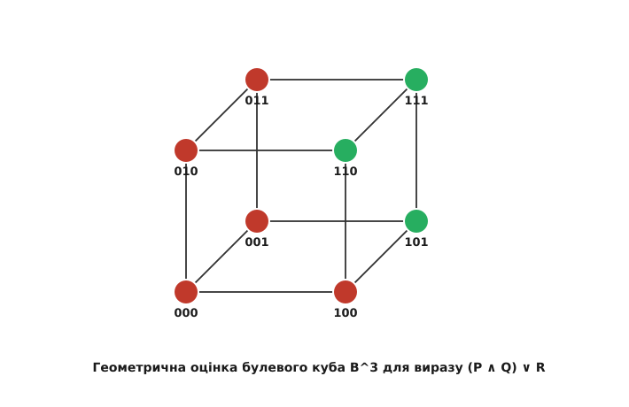

# Таблиці істинності та логічні зв'язки

<preknowlist>
- [Булева алгебра](root:math-logic/boolean-algebra) — базові закони логіки, тотожності та логічні операції.
- [Математичне доведення](root:math-logic/mathematical-proof) — поняття твердження, виводу та логічної строгості.
- [Поліном Жегалкіна](root:math-logic/zhegalkin-polynomial) — представлення булевих функцій через XOR та AND.
</preknowlist>

Таблиця істинності — це систематичне алгебраїчне відображення, яке зіставляє кожній можливій комбінації істинносних значень вхідних змінних відповідне підсумкове значення складного логічного виразу.


*Геометричне представлення вершин 3-вимірного двійкового куба та розфарбовування їхніх оцінок.*

У математичній логіці будь-яке висловлювання оцінюється за допомогою двозначної множини значень істинності: `𝔹 = {0, 1}`, де `0` відповідає хибі (False), а `1` — істині (True). Метод таблиць істинності надає абсолютний конструктивний алгоритм для перевірки еквівалентності виразів, визначення тавтологій та аналізу здійснюваності формул.

> 🔧 **Навіщо це.**
> Таблиці істинності є фундаментальним інструментом верифікації дикретних систем. Вони лежать в основі мінімізації комбінаційних цифрових схем, побудови компіляторних оптимізацій у гілкуванні умовних операторів та формального доведення коректності криптографічних протоколів.

---

## 1. Першопричини логічних зв'язок та функціональний простір

Логічна зв'язка — це функція, яка приймає один або декілька істіннісних аргументів із множини `𝔹` і повертає значення з цієї ж множини. Формально, `n`-арна логічна зв'язка є відображенням виду:

```text
f: 𝔹^n → 𝔹
```

Оскільки множина `𝔹^n` містить `2^n` різних вхідних кортежів, існує `2^{2^n}` різних `n`-арних логічних функцій. Для унарних функцій (`n=1`) існує `2^{2^1} = 4` варіанти, а для бінарних (`n=2`) — `2^{2^2} = 16` різних логічних зв'язок.

### Унарні логічні операції (`n=1`)
Для однієї змінної `P ∈ 𝔹` існує 4 можливих функції:
1. **Константа 0**: `f_0(P) = 0`.
2. **Тотожність (Identity)**: `f_1(P) = P`.
3. **Заперечення (NOT)**: `f_2(P) = ¬ P = 1 - P`.
4. **Константа 1**: `f_3(P) = 1`.

Таблиця істинності унарних операцій:

| `P` | `f_0` | `f_1 (P)` | `f_2 (¬ P)` | `f_3` |
| :-: | :---: | :-------: | :------------: | :---: |
|  0  |   0   |     0     |       1        |   1   |
|  1  |   0   |     1     |       0        |   1   |

Заперечення є єдиною нетривіальною унарною операцією, що змінює значення на протилежне. Алгебраїчно воно виражається через віднімання від одиниці: `¬ P = 1 - P`.

---

## 2. Повна систематизація 16 бінарних зв'язок (`n=2`)

Для двох логічних змінних `P` та `Q` вхідний простір складається з `2^2 = 4` кортежів: `(0,0)`, `(0,1)`, `(1,0)`, `(1,1)`. Оскільки кожен із 4 рядків може набувати значення `0` або `1`, існує `2^4 = 16` унікальних бінарних логічних операцій `f_0, f_1, ..., f_{15}`.

Нижче наведено повну таблицю істинності для всіх 16 бінарних логічних зв'язок:

| `P` | `Q` | `f_0` | `f_1` | `f_2` | `f_3` | `f_4` | `f_5` | `f_6` | `f_7` | `f_8` | `f_9` | `f_{10}` | `f_{11}` | `f_{12}` | `f_{13}` | `f_{14}` | `f_{15}` |
| :-: | :-: | :---: | :---: | :---: | :---: | :---: | :---: | :---: | :---: | :---: | :---: | :------: | :------: | :------: | :------: | :------: | :------: |
|  0  |  0  |   0   |   0   |   0   |   0   |   0   |   0   |   0   |   0   |   1   |   1   |    1     |    1     |    1     |    1     |    1     |    1     |
|  0  |  1  |   0   |   0   |   0   |   0   |   1   |   1   |   1   |   1   |   0   |   0   |    0     |    0     |    1     |    1     |    1     |    1     |
|  1  |  0  |   0   |   0   |   1   |   1   |   0   |   0   |   1   |   1   |   0   |   0   |    1     |    1     |    0     |    0     |    1     |    1     |
|  1  |  1  |   0   |   1   |   0   |   1   |   0   |   1   |   0   |   1   |   0   |   1   |    0     |    1     |    0     |    1     |    0     |    1     |

### Аналітичний розбір ключових операцій:
- **`f_0 = 0`**: Тотожна хиба (Contradiction).
- **`f_1 = P ∧ Q`**: Кон'юнкція (AND). Логічне множення `P · Q`.
- **`f_2 = P ∧ ¬ Q`**: Асиметрична неімплікація.
- **`f_3 = P`**: Проекція на першу змінну (Projection `P`).
- **`f_4 = ¬ P ∧ Q`**: Обернена неімплікація.
- **`f_5 = Q`**: Проекція на другу змінну (Projection `Q`).
- **`f_6 = P ⊕ Q`**: Виключне АБО (XOR). Додавання за модулем 2: `P ⊕ Q = P + Q - 2PQ`.
- **`f_7 = P ∨ Q`**: Диз'юнкція (OR). Логічне додавання: `P + Q - PQ`.
- **`f_8 = P ↓ Q`**: Стрілка Пірса (NOR). Заперечення диз'юнкції `¬ (P ∨ Q) = (1-P)(1-Q)`.
- **`f_9 = P ⇔ Q`**: Еквівалентність (XNOR). `¬ (P ⊕ Q) = 1 - P - Q + 2PQ`.
- **`f_{10} = ¬ Q`**: Заперечення другої змінної.
- **`f_{11} = P ⇐ Q`**: Обернена імплікація (`Q ⇒ P`).
- **`f_{12} = ¬ P`**: Заперечення першої змінної.
- **`f_{13} = P ⇒ Q`**: Пряма матеріальна імплікація (`¬ P ∨ Q = 1 - P + PQ`).
- **`f_{14} = P ↑ Q`**: Штрих Шеффера (NAND). Заперечення кон'юнкції `¬ (P ∧ Q) = 1 - PQ`.
- **`f_{15} = 1`**: Тотожна істина (Tautology).

---

## 3. Глибокий розбір імплікації та причинно-наслідкового виводу

Матеріальна імплікація `P ⇒ Q` часто викликає інтуїтивне непорозуміння через випадок, коли антецедент `P = 0`. 

Аналіз таблиці істинності пояснює це з першопричин:

| `P` | `Q` | `P ⇒ Q` | Алгебраїчна суть |
| :-: | :-: | :------------: | :--------------: |
|  0  |  0  |       1        | З хиби випливає хиба — твердження правильне |
|  0  |  1  |       1        | З хиби випливає істина — валідне твердження |
|  1  |  0  |       0        | З істини випливає хиба — єдине порушення закону |
|  1  |  1  |       1        | З істини випливає істина — істинне твердження |

Імплікація `P ⇒ Q` виражає гарантію: «Якщо обіцянка `P` виконується, то гарантується `Q`». Якщо ж обіцянка `P` не була надана (`P = 0`), гарантія не була порушена, тому вираз `P ⇒ Q` за визначенням є істинним (`1`).

Алгебраїчна тотожність:

```text
P ⇒ Q ≡ ¬ P ∨ Q
```

Звідси випливає Закон Контрапозиції, який доводиться прямою рівністю таблиць істинності:

```text
(P ⇒ Q) ≡ (¬ Q ⇒ ¬ P)
```

| `P` | `Q` | `¬ Q` | `¬ P` | `P ⇒ Q` | `¬ Q ⇒ ¬ P` |
| :-: | :-: | :------: | :------: | :------------: | :----------------------: |
|  0  |  0  |    1     |    1     |       1        |            1             |
|  0  |  1  |    0     |    1     |       1        |            1             |
|  1  |  0  |    1     |    0     |       0        |            0             |
|  1  |  1  |    0     |    0     |       1        |            1             |

Збіг 5-го та 6-го стовпчиків доводить, що доведення контрапозицією є 100% еквівалентним прямому доведенню імплікації.

---

## 4. Алгоритм побудови та алгебраїчний синтез канонічних форм

Для довільної логічної формули `F(P_1, P_2, ..., P_n)` таблиця істинності будується за покроковим алгоритмом:

1. **Формування вхідного простору**: Створюється `2^n` рядків, де змінні `P_1, ..., P_n` приймають усі двійкові числа від `00...0` до `11...1`.
2. **Дерево синтаксичного розбору**: Вираз розбивається на піддерево операцій згідно з пріоритетом: `(¬) > (∧) > (∨) > (⇒) > (⇔)`.
3. **Обчислення стовпчиків**: Для кожного рядка обчислюються значення всіх вузлів синтаксичного дерева.

### Відновлення ДДНФ та ДКНФ за таблицею істинності

Таблиця істинності є конструктивним мостом до побудови канонічних форм Булевої алгебри.

Нехай `T_1` — множина рядків таблиці, де `F = 1`, а `T_0` — множина рядків, де `F = 0`.

- **Досконала Диз'юнктивна Нормальна Форма (ДДНФ)** будується за рядками `T_1`:

```text
F(P_1, ..., P_n) = ⋁(a ∈ T_1) ( ⋀(i=1)^n P_i^{a_i} ),   де  P_i^1 = P_i, P_i^0 = ¬ P_i
```

- **Досконала Кон'юнктивна Нормальна Форма (ДКНФ)** будується за рядками `T_0`:

```text
F(P_1, ..., P_n) = ⋀(b ∈ T_0) ( ⋁(i=1)^n P_i^{1 - b_i} )
```

Отже, таблиця істинності повністю та однозначно задає алгебраїчний вид будь-якої булевої функції.

---

## 5. Універсальний базис та Критерій Поста про функціональну повноту

Таблиця істинності дозволяє аналізувати замкнені класи булевих функцій та доводити Критерій Поста про функціональну повноту.

Система булевих функцій `K` є **функціонально повною** тоді й лише тоді, коли вона не міститься повністю у жодному з п'яти замкнених класів Поста:

1. **Клас `T_0`**: Функції, що зберігають нуль (`f(0, 0, ..., 0) = 0`).
2. **Клас `T_1`**: Функції, що зберігають одиницю (`f(1, 1, ..., 1) = 1`).
3. **Клас `S`**: Самодвоїсті функції (`f^*(P_1, ..., P_n) = f(P_1, ..., P_n)`).
4. **Клас `M`**: Монотонні функції (при збільшенні вхідних бітів значення функції не зменшується).
5. **Клас `L`**: Лінійні функції (виражаються поліномом Жегалкіна першого степеня без добутків змінних `P_i P_j`).

### Базис Шеффера (NAND, `↑`) та Пірса (NOR, `↓`)
Операції Штрих Шеффера `P ↑ Q` та Стрілка Пірса `P ↓ Q` не належать до жодного з п'яти класів Поста:
- `0 ↑ 0 = 1 ≠ 0 ⇒ ∉ T_0`
- `1 ↑ 1 = 0 ≠ 1 ⇒ ∉ T_1`
- Не є монотонними, не є лінійними та не є самодвоїстими.

Звідси випливає, що кожна з цих операцій утворює одноелементний функціонально повний базис:
- `¬ P ≡ P ↑ P`
- `P ∧ Q ≡ (P ↑ Q) ↑ (P ↑ Q)`
- `P ∨ Q ≡ (P ↑ P) ↑ (Q ↑ Q)`

---

## 6. Зв'язок із формальними системами доведень та семантикою

У математичній логіці існує строге розрізнення між **синтаксичним виводом** (`⊢`) та **семантичною істинністю** (`⊨`).

- **Семантична істинність (`⊨ F`)**: Формула `F` є тавтологією (істинна при всіх варіантах таблиці істинності).
- **Синтаксичний вивід (`⊢ F`)**: Формула `F` доведена в аксіоматичній системі (наприклад, системі Гільберта чи секвенційному численні Ґентцена) за допомогою правил виводу (Modus Ponens).

Теорема про повноту та коректність числення висловлювань доводить еквівалентність двох підходів:

```text
⊢ F ⇔ ⊨ F
```

Отже, побудова таблиці істинності надає абсолютну семантичну верифікацію для будь-якої синтаксично доведеної теореми в пропозиційній логіці.

---

## 7. Мінімізація за допомогою таблиць істинності та алгоритм Квайна-Маккласкі

Окрім прямої побудови канонічних ДДНФ, таблиця істинності використовується для конструктивної мінімізації булевих функцій. Алгоритм Квайна-Маккласкі аналізує мінтерми з одиничними значеннями в підсумковому стовпчику і виконує послідовне склеювання за тотожністю:

```text
A · P ∨ A · ¬ P = A
```

1. **Групування мінтермів**: Минтерми таблиці групуються за кількістю одиниць у двійковому представленні.
2. **Первинне склеювання**: Мінтерми суміжних груп, що відрізняються лише в одному біті, об'єднуються у склеєні імпліканти.
3. **Покриття покривальної матриці**: Обирається мінімальний набір первинних імплікантів, який повністю покриває всі одиничні рядки таблиці істинності.

Отже, таблиця істинності дає повний інформаційний базис для побудови мінімальної диз'юнктивної нормальної форми (МДНФ).

---

## 8. Багатозначні логіки та тризначна логіка SQL (3VL)

Класична таблиця істинності спирається на двозначну логіку Арістотеля (`𝔹 = {0, 1}`). Проте в обчислювальних системах та базах даних виникає потреба в обробці невизначених значень (NULL).

У тризначній логіці Кліні та Стівенсона множина значень розширюється: `𝔹_3 = {0, 1/2, 1}`, де `1/2` означає «Невідомо» (Unknown / NULL).

Таблиці істинності 3VL у системах баз даних (SQL):

| `P` | `Q` | `P ∧ Q` | `P ∨ Q` | `¬ P` |
| :-: | :-: | :----------: | :--------: | :------: |
|  0  | UNK |      0       |    UNK     |    1     |
|  1  | UNK |     UNK      |     1      |    0     |
| UNK | UNK |     UNK      |    UNK     |   UNK    |

Звідси випливає важливий практичний результат: у тризначній логіці вираз `P ∨ ¬ P` не завжди дорівнює `1`. Якщо `P = UNK`, то `UNK ∨ UNK = UNK`, що пояснює особливості обробки умов `WHERE` в SQL базах даних при наявності NULL значень.
