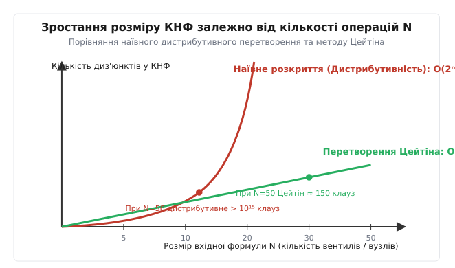
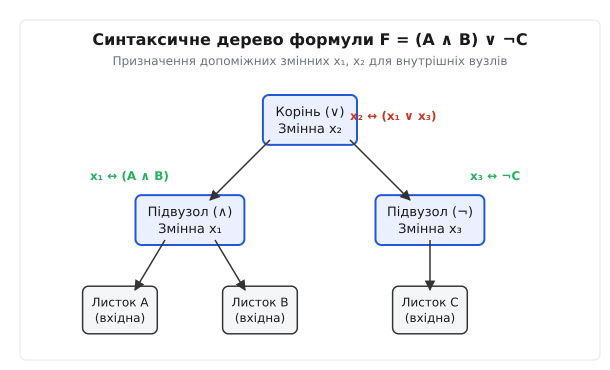
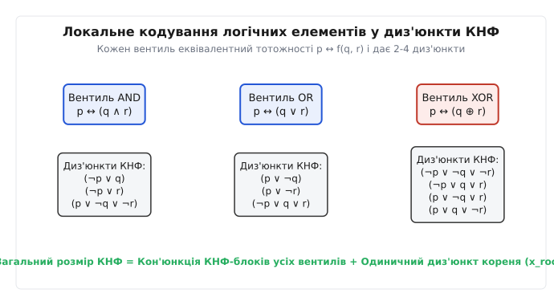
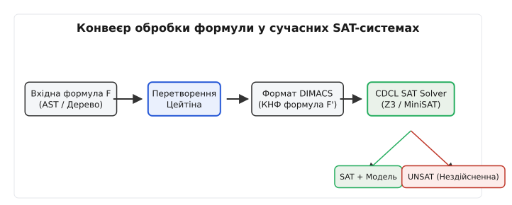

<preknowlist>
- [Теорема Кука — Левіна](root:computability/cook-levin-theorem)
- [Проблема NP-повноти](root:computability/np-completeness)
- [Horn-SAT і здійсненність](root:math-logic/horn-sat)
- [Бінарні діаграми рішень (BDD)](root:hw-digital/binary-decision-diagram)
- [Сортувальні мережі](root:sf-algorithms/sorting-networks)
</preknowlist>

# Перетворення Цейтіна

Автоматизована перевірка логічних схем із десятками тисяч вентилів за допомогою класичного розкриття дужок вичерпує оперативну пам'ять комп'ютера за мілісекунди, оскільки спроба звести вираз `(A₁ ∧ B₁) ∨ (A₂ ∧ B₂) ∨ ... ∨ (A₃₀ ∧ B₃₀)` до кон'юнктивної нормальної форми законами дистрибутивності породжує `2³⁰` (понад мільярд) диз'юнктів. Алгоритм перетворення Цейтіна вирішує цю проблему, вводячи унікальну допоміжну булеву змінну для кожного внутрішнього оператора формули. Це знижує розмір підсумкової КНФ із експоненційного `O(2ⁿ)` до строго лінійного `O(N)` і робить можливим функціонування сучасних SAT-розв'язувачів та систем формальної верифікації.

## 1. Бар'єр кон'юнктивної нормальної форми у SAT-системах

Сучасні алгоритми розв'язання проблеми здійсненності булевих формул (SAT solvers), зокрема сімейство алгоритмів CDCL (Conflict-Driven Clause Learning) та класичний алгоритм DPLL, вимагають входження формули виключно у кон'юнктивній нормальній формі (КНФ). КНФ є кон'юнкцією (операцією І) дизюнктів (операцій АБО), де кожен диз'юнкт містить скінченну множину літералів — вхідних змінних або їх заперечень:

```
F_cnf = C₁ ∧ C₂ ∧ ... ∧ C_m
C_i = (l_i1 ∨ l_i2 ∨ ... ∨ l_ik)
```

Причиною такого вибору стандарту є алгоритмічна ефективність резолюційного виводу. Для КНФ-дизюнктів операція поширення одиничного літерала (Unit Propagation) та виявлення конфліктів виконуються за запізненням `O(1)` завдяки структурам даних зі спостережуваними літералами (Watched Literals).

Проте реальні логічні вирази, що виникають під час аналізу програмного забезпечення, компіляції апаратних описувачів Verilog/VHDL або формальної верифікації криптографічних протоколів, подаються у вигляді довільних синтаксичних дерев із широким набором логічних зв'язок: імплікацією (`→`), рівносильністю (`↔`), виключним АБО (`⊕`), мультиплексорами (`MUX`) та запереченнями (`¬`).

Класичний спосіб зведення довільної формули `F` до КНФ полягає у застосуванні логічних рівносильностей:
1. Заміна імплікацій та еквівалентностей: `A → B ≡ ¬A ∨ B`, `A ↔ B ≡ (¬A ∨ B) ∧ (A ∨ ¬B)`.
2. Закони Де Моргана для просування заперечень до листків: `¬(A ∧ B) ≡ ¬A ∨ ¬B`, `¬(A ∨ B) ≡ ¬A ∧ ¬B`.
3. Дистрибутивний закон диз'юнкції відносно кон'юнкції: `A ∨ (B ∧ C) ≡ (A ∨ B) ∧ (A ∨ C)`.

Слабким місцем цього алгоритму є третій крок. Кожного разу, коли диз'юнкція застосовується до двох кон'юнкцій, кількість диз'юнктів подвоюється. Проілюструємо це математично на класичному прикладі формули вибору між пари елементів:

```
F_k = (A₁ ∧ B₁) ∨ (A₂ ∧ B₂) ∨ ... ∨ (A_k ∧ B_k)
```

При спробі відкрити дужки за дистрибутивністю кожен підсумковий диз'юнкт мусить вибрати по одному літералу з кожної з `k` дужок. Перша дужка має 2 варіанти (`A₁` або `B₁`), друга — 2 варіанти (`A₂` або `B₂`), і так далі до `k`-ї дужки. За правилом добутку комбінаторики загальна кількість диз'юнктів у КНФ дорівнює точно:

```
Num_Clauses(F_k) = 2^k                    [експоненційний вибух кількості диз'юнктів]
```

Для виразу з `k = 10` отримаємо `2¹⁰ = 1024` диз'юнкти.
Для виразу з `k = 30` кількість диз'юнктів становить `2³⁰ = 1 073 741 824` (понад мільярд диз'юнктів).
Для виразу з `k = 50` кількість диз'юнктів перевищує `10¹⁵`.


*Порівняння кількості диз'юнктів у КНФ для наївного розкриття за дистрибутивністю та лінійного кодування Цейтіна.*

Навіть якщо обчислювальна машина володіє гігабайтами оперативної пам'яті, спроба сформувати файл із мільярдом диз'юнктів вичерпує пам'ять та зупиняє роботу ще до запуску самого SAT-розв'язувача. Детальний аналіз хронології подолання цієї перешкоди та розвитку автоматичного доведення наведено у вставці [📜 Історія перетворення Цейтіна та виклики автоматизованого доведення](root:math-logic/tseytin-transformation/hist-tseytin.md).

## 2. Фундаментальний прийом Цейтіна: Структурні змінне-позначення

У 1968 році Григорій Цейтін запропонував відмовитися від спроб побудувати **логічно еквівалентну** КНФ у початковому алфавіті вхідних змінних. Натомість алгоритм Цейтіна будує розширену формулу `F'`, яка є **еквізатисфіабельною** (рівноздійсненною) з початковою формулою `F`.

Ключова ідея перетворення Цейтіна полягає у проведенні межі між глобальною структурою формули та її локальними логічними елементами:
1. Початкова формула `F` розглядається як абстрактне синтаксичне дерево (AST) або спрямований ациклічний граф (DAG).
2. Кожному внутрішньому вузлу `u` цього дерева зіставляється нова унікальна допоміжна булева змінна `xᵤ`.
3. Для кожного внутрішнього вузла описується локальна тотожність еквівалентності `xᵤ ↔ (x₁ ⊙ x₂)`, де `⊙` — логічна операція цього вузла, а `x₁` та `x₂` — допоміжні або вхідні змінні його дочірніх вузлів.
4. Кожна локальна тотожність розкладається у малий КНФ-блок, який містить від 2 до 4 диз'юнктів фіксованої довжини.
5. Загальна КНФ складається з кон'юнкції КНФ-блоків усіх внутрішніх вузлів та одного одиничного диз'юнкта `x_root`, який фіксує вимогу істинності кореня всієї формули.


*Призначення допоміжних булевих змінних x₁, x₂ внутрішнім вузлам синтаксичного дерева формули F = (A ∧ B) ∨ ¬C.*

Розглянемо докладний приклад побудови допоміжних змінних для формули `F = (A ∧ B) ∨ ¬C`.
Вхідні змінні: `V = {A, B, C}`.
Синтаксичне дерево містить два внутрішні вузли:
- Вузол кон'юнкції `(A ∧ B)` отримує допоміжну змінну `x₁`. Його локальна тотожність: `x₁ ↔ (A ∧ B)`.
- Вузол заперечення `¬C` отримує допоміжну змінну `x₃`. Його локальна тотожність: `x₃ ↔ ¬C`.
- Кореневий вузол диз'юнкції отримує змінну `x₂`. Його локальна тотожність: `x₂ ↔ (x₁ ∨ x₃)`.

Замість експоненційного розкриття вкладеності алгоритм Цейтіна оперує автономними КНФ-блоками для кожного вузла.

## 3. Таблиці локального кодування логічних вентилів

Кожен елемент логічної схеми чи вузол AST з вихідною змінною `p` та вхідними операндами `q` і `r` локально перетворюється у КНФ за допомогою законів класичної логіки.


*Схема локального розкладу вентилів AND, OR, XOR у диз'юнкти КНФ.*

### 3.1. Кодування унарного заперечення (NOT)

Локальна еквівалентність для заперечення `p ↔ ¬q` виводяться наступним чином:

```
p ↔ ¬q
= (p → ¬q) ∧ (¬q → p)                 [розклад еквівалентності на імплікації]
= (¬p ∨ ¬q) ∧ (q ∨ p)                 [усунення імплікацій: A → B ≡ ¬A ∨ B]
= (¬p ∨ ¬q) ∧ (p ∨ q)                 [коммутативність диз'юнкції]
```

Таким чином, вентиль NOT генерує точно 2 диз'юнкти довжиною 2.

### 3.2. Кодування бінарної кон'юнкції (AND)

Локальна еквівалентність `p ↔ (q ∧ r)` розкладається у 3 диз'юнкти:

```
p ↔ (q ∧ r)
= (p → (q ∧ r)) ∧ ((q ∧ r) → p)       [розклад еквівалентності]
= (¬p ∨ (q ∧ r)) ∧ (¬(q ∧ r) ∨ p)     [усунення імплікацій]
= (¬p ∨ q) ∧ (¬p ∨ r) ∧ (¬q ∨ ¬r ∨ p) [дистрибутивність та закон Де Моргана]
= (¬p ∨ q) ∧ (¬p ∨ r) ∧ (p ∨ ¬q ∨ ¬r) [впорядкування літералів]
```

Результат містить два диз'юнкти довжиною 2 та один диз'юнкт довжиною 3.

### 3.3. Кодування бінарної диз'юнкції (OR)

Локальна еквівалентність `p ↔ (q ∨ r)` кодується дзеркально до AND:

```
p ↔ (q ∨ r)
= (p → (q ∨ r)) ∧ ((q ∨ r) → p)       [розклад еквівалентності]
= (¬p ∨ q ∨ r) ∧ (¬(q ∨ r) ∨ p)       [усунення імплікації та Де Морган]
= (¬p ∨ q ∨ r) ∧ ((¬q ∧ ¬r) ∨ p)      [закон Де Моргана]
= (¬p ∨ q ∨ r) ∧ (p ∨ ¬q) ∧ (p ∨ ¬r)  [дистрибутивність]
```

Кодування дає два диз'юнкти довжиною 2 та один диз'юнкт довжиною 3.

### 3.4. Кодування виключного АБО (XOR)

Операція `p ↔ (q ⊕ r)` кодується 4 диз'юнктами довжиною 3, оскільки виключне АБО є істинним на 2 з 4 можливих наборів операндів:

```
p ↔ (q ⊕ r)
= (¬p ∨ ¬q ∨ ¬r) ∧ (¬p ∨ q ∨ r) ∧ (p ∨ ¬q ∨ r) ∧ (p ∨ q ∨ ¬r) [КНФ-розклад]
```

### 3.5. Кодування умовного вибору / Мультиплексора (MUX / ITE)

Мультиплексор з селектором `s`, входом `q` (при `s=1`) та входом `r` (при `s=0`) реалізує функцію `If-Then-Else`: `p ↔ (s ? q : r)`. Логічна формула має вигляд `p ↔ ((s ∧ q) ∨ (¬s ∧ r))`.

КНФ-розклад мультиплексора містить точно 4 диз'юнкти довжиною 3:

```
(¬p ∨ ¬s ∨ q) ∧ (¬p ∨ s ∨ r) ∧ (p ∨ ¬s ∨ ¬q) ∧ (p ∨ s ∨ ¬r)
```

Цей розклад гарантує, що при `s = 1` вихід `p` строго слідує за `q`, а при `s = 0` вихід `p` слідує за `r`.

### 3.6. Загальна таблиця кодувань операторів

Узагальнимо КНФ-блоки для всіх логічних вентилів, що використовуються при трансляції:

| Логічна операція | Визначення `p` | Диз'юнкти КНФ | Кількість диз'юнктів | Max довжина диз'юнкта |
| :--- | :--- | :--- | :---: | :---: |
| **NOT** | `p ↔ ¬q` | `(¬p ∨ ¬q) ∧ (p ∨ q)` | 2 | 2 |
| **AND** | `p ↔ (q ∧ r)` | `(¬p ∨ q) ∧ (¬p ∨ r) ∧ (p ∨ ¬q ∨ ¬r)` | 3 | 3 |
| **OR** | `p ↔ (q ∨ r)` | `(p ∨ ¬q) ∧ (p ∨ ¬r) ∧ (¬p ∨ q ∨ r)` | 3 | 3 |
| **IMPLIES** | `p ↔ (q → r)` | `(p ∨ q) ∧ (p ∨ ¬r) ∧ (¬p ∨ ¬q ∨ r)` | 3 | 3 |
| **XOR** | `p ↔ (q ⊕ r)` | `(¬p ∨ ¬q ∨ ¬r) ∧ (¬p ∨ q ∨ r) ∧ (p ∨ ¬q ∨ r) ∧ (p ∨ q ∨ ¬r)` | 4 | 3 |
| **EQUIV** | `p ↔ (q ↔ r)` | `(¬p ∨ ¬q ∨ r) ∧ (¬p ∨ q ∨ ¬r) ∧ (p ∨ ¬q ∨ ¬r) ∧ (p ∨ q ∨ r)` | 4 | 3 |
| **MUX / ITE**| `p ↔ (s?q:r)` | `(¬p ∨ ¬s ∨ q) ∧ (¬p ∨ s ∨ r) ∧ (p ∨ ¬s ∨ ¬q) ∧ (p ∨ s ∨ ¬r)` | 4 | 3 |

Точна текстова специфікація формату та структура C/C++ API для роботи з DIMACS файлами детально описані у вставці [📋 Інтерфейс та специфікація формату DIMACS CNF для SAT-інструментів](root:math-logic/tseytin-transformation/api-dimacs-cnf.md).

## 4. Конвеєр перетворення та роль кореневого диз'юнкта

Процес зведення довільного логічного виразу до КНФ методом Цейтіна здійснюється за чітким чотирикроковим конвеєром.


*Конвеєр трансляції вхідного виразу через Цейтін-кодер у формат DIMACS та передача до CDCL SAT-солвера.*

1. **Побудова AST / DAG:** Вхідна формула або логічна схема синтаксично розбирається у спрямований граф, де листки відповідають вхідним змінним, а внутрішні вузли — логічним вентилям.
2. **Нумерація змінних:** Вхідним змінним присвоюються індекси `1, 2, ..., n`. Потім обходом у зворотному порядку (Post-order Traversal) кожному внутрішньому вузлу присвоюється новий унікальний індекс `n+1, n+2, ..., n+m`.
3. **Генерація локальних КНФ-блоків:** Для кожного внутрішнього вузла виписується відповідний набір диз'юнктів згідно з таблицею кодування.
4. **Додавання кореневого диз'юнкта:** У підсумковий набір клауз додається одиничний диз'юнкт `(x_root)`, де `x_root` — змінна, що відповідає найвищому (кореневому) вузлу всієї формули.

Роль одиничного кореневого диз'юнкта `(x_root)` є принциповою. Без його наявності КНФ-блоки лише описують коректність функціонування кожного окремого вентиля, але не вимагають, щоб уся формула була істинною. Якщо вилучити диз'юнкт `(x_root)`, формулу можна буде завжди легко задовольнити, присвоївши всім допоміжним змінним значення `0`. Фіксація `x_root = 1` примушує SAT-розв'язувач шукати такий набір вхідних змінних, який робить вихід всієї системи істинним.

Практичну реалізацію цього конвеєра з виділенням пам'яті та експортом у DIMACS мовами C та C++ наведено у вставці [⚙️ Реалізація Цейтін-кодера булевих виразів мовами C та C++](root:math-logic/tseytin-transformation/proj-tseytin-encoder.md).

## 5. Кодування багатоарних операторів (n-ary Gates) та кардинальних обмежень

На практиці логічні схеми містять кон'юнкції та диз'юнкції з трьома і більше операндами: `p ↔ (q₁ ∧ q₂ ∧ ... ∧ qₙ)`.

Існує два варіанти розкладу таких операторів у КНФ:

### 5.1. Розклад через бінарне дерево

Багатоарний оператор розбивається на збалансоване дерево бінарних вентилів. Для `n` операндів вводиться `n-1` допоміжних змінних.
Перевага: усі диз'юнкти залишаються строго бінарними або тернарними (максимум 3 літерали у клаузі).

### 5.2. Прямий n-арний КНФ-розклад

Для оператора `p ↔ (q₁ ∧ q₂ ∧ ... ∧ qₙ)` можна виписати безпосередній КНФ-блок без проміжних змінних:

```
(¬p ∨ q₁) ∧ (¬p ∨ q₂) ∧ ... ∧ (¬p ∨ qₙ) ∧ (p ∨ ¬q₁ ∨ ¬q₂ ∨ ... ∨ ¬qₙ)
```

Такий розклад дає `n` бинарних диз'юнктів та один `(n+1)`-арний диз'юнкт. Це економить допоміжні змінні, але створює довгий диз'юнкт, що вимагає більше пам'яті у SAT-солвері. Сучасні кодери обирають бінарне розбиття для `n > 4`.

### 5.3. Кодування апаратних суматорів та кардинальних обмежень (At-Most-One)

У верифікації апаратних систем часто виникають обмеження виду «щонайбільше один активний сигнал з N» (**At-Most-One, AMO**).

Прямий квадратний розклад без допоміжних змінних дає `O(N²)` диз'юнктів: `∧_{i < j} (¬x_i ∨ ¬x_j)`.

Для великих `N` застосовують Цейтінівське кодування через лінійні мережі (Commander Encoding або Sequential Counter Encoding), яке вводить `O(N)` допоміжних Цейтін-змінних і знижує кількість диз'юнктів до строго `O(N)`.

## 6. Доказ еквізатисфіабельності: Equisatisfiability vs Logical Equivalence

Поняття еквізатисфіабельності (equisatisfiability) є ключовим математичним фундаментальним підґрунтям Цейтінівського перетворення.

Дві формули `F` (над змінними `V`) та `F'` (над розширеними змінними `V ∪ X`) є **еквізатисфіабельними** (`F ⊵⊲ F'`), якщо:

```
Формула F є здійсненною ⇔ Формула F' є здійсненною
```

При цьому формула `F'` **не є** логічно еквівалентною формулі `F`. Якщо розглянути інтерпретацію, яка задовольняє `F`, вона визначає значення лише вхідних змінних з `V`. Формула `F'` містить додаткові змінні з `X`, тому для перевірки її істинності інтерпретацію потрібно індуктивно розширити.

Доведення теореми про еквізатисфіабельність розбивається на дві протилежні імплікації:

### 6.1. Пряма імплікація (Здійсненність F ⇒ Здійсненність F')

Нехай початкова формула `F` здійсненна, і `I: V → {0, 1}` — задовольняюча інтерпретація (`val(F, I) = 1`).
Побудуємо розширену інтерпретацію `I': V ∪ X → {0, 1}` за індуктивним правилом:
- Для кожної вхідної змінної `v ∈ V` покладемо `I'(v) = I(v)`.
- Для кожного внутрішнього вузла `u` зі зіставленою змінною `xᵤ` та підформулою `Fᵤ` покладемо `I'(xᵤ) = val(Fᵤ, I)`.

Оскільки значення кожної допоміжної змінної `xᵤ` збігається з семантичним значенням підформули `Fᵤ`, усі локальні еквівалентності `xᵤ ↔ (x₁ ⊙ x₂)` набувають значення `1`. Відповідно, усі КНФ-блоки є істинними при `I'`. Оскільки `val(F, I) = 1`, то і для кореневої змінної маємо `I'(x_root) = 1`. Отже, `I' ⊨ F'`, що доводить здійсненність `F'`.

### 6.2. Обернена імплікація (Здійсненність F' ⇒ Здійсненність F)

Нехай розширена формула `F'` здійсненна, і `I': V ∪ X → {0, 1}` — її задовольняюча інтерпретація (`val(F', I') = 1`).
Розглянемо звуження інтерпретації `I = I'|_V` на множину вхідних змінних.
Математичною індукцією за висотою вузла доводиться, що завдяки істинності КНФ-блоків для кожного вузла `u` виконується рівність `I'(xᵤ) = val(Fᵤ, I)`.
Оскільки `I' ⊨ F'`, одиничний кореневий диз'юнкт вимагає `I'(x_root) = 1`. Звідси `val(F, I) = I'(x_root) = 1`, що означає `I ⊨ F`. Формула `F` є здійсненною.

Повний математичний вивід та аналітичне доведення цієї теореми наведено у вставці [🧮 Математична теорема про еквізатисфіабельність перетворення Цейтіна](root:math-logic/tseytin-transformation/math-tseytin-equisatisfiability.md).

## 7. Оптимізація Плейстеда-Ґрінбаума: Однонаправлене кодування

У 1986 році Девід Плейстед та Стівен Ґрінбаум запропонували важливе удосконалення алгоритму Цейтіна, яке дозволяє скоротити кількість згенерованих диз'юнктів майже вдвічі для багатьох практичних формул.

Вони помітили, що для збереження еквізатисфіабельності не обов'язково вимагати повну двосторонню еквівалентність `xᵤ ↔ (x₁ ⊙ x₂)`. У багатьох випадках достатньо кодувати лише однонаправлену імплікацію.

Необхідність двостороннього чи однонаправленого кодування визначається **полярністю** входження підформули:
- **Позитивна полярність (+1):** підформула знаходиться під парною кількістю заперечень (або у лівому операнді імплікації). Підвищення значення підформули з 0 до 1 може лише покращити (або не змінити) підсумкове значення усієї формули.
- **Негативна полярність (-1):** підформула знаходиться під непарною кількістю заперечень. Підвищення значення підформули з 0 до 1 може лише погіршити значення всієї формули.
- **Обопільна полярність (0):** підформула знаходиться всередині еквівалентності (`↔`) або виключного АБО (`⊕`).

Правила розкладу Плейстеда-Ґрінбаума (Plaisted-Greenbaum Encoding) підпорядковуються наступній логіці:

```
Якщо pol(F, u) = +1  ⇒ кодується тільки імплікація xᵤ → (x₁ ⊙ x₂)
Якщо pol(F, u) = -1  ⇒ кодується тільки імплікація (x₁ ⊙ x₂) → xᵤ
Якщо pol(F, u) = 0   ⇒ кодується повна еквівалентність xᵤ ↔ (x₁ ⊙ x₂)
```

Для вентиля AND з виходом `p` та входами `q, r`:
- При позитивній полярності кодується лише `p → (q ∧ r)`, що дає 2 диз'юнкти: `(¬p ∨ q)` та `(¬p ∨ r)`. Третій диз'юнкт `(p ∨ ¬q ∨ ¬r)` відкидається.
- При негативній полярності кодується лише `(q ∧ r) → p`, що дає тільки 1 диз'юнкт: `(p ∨ ¬q ∨ ¬r)`.

Оскільки більшість практичних формул у верифікації містять переважно монотонні оператори (AND, OR), кодування Плейстеда-Ґрінбаума зменшує обсяг підсумкового DIMACS файлу на 35–45%.

## 8. Кодування над спрямованими ациклічними графами (DAG Encoding)

У реальних програмах верифікації формули подаються не у вигляді дерев (де підвирази дублюються), а у вигляді DAG (Directed Acyclic Graph) з повторним використанням вузлів.

Якщо вираз `(A ∧ B)` зустрічається у 100 різних місцях логічної схеми, деревоподібний алгоритм створив би 100 унікальних допоміжних змінних `x₁...x₁₀₀` та 300 диз'юнктів.

Кодування Цейтіна над DAG застосовує мемоізацію (Hash Consing):
- Для кожної підформули обчислюється канонічний хеш від пари операндів та логічної операції.
- Перед створенням нової змінної кодер шукає хеш у глобальній таблиці.
- Якщо операція `(A ∧ B)` вже кодувалася змінною `x₁`, кодер повертає `x₁` без генерації дубльованих диз'юнктів.

Це знижує кількість змінних у КНФ від розміру синтаксичного дерева до кількості **унікальних вузлів графа**, що забезпечує додаткове колосальне стиснення даних.

## 9. Формули Цейтіна над графами та теорія складності доведень (Proof Complexity)

Окрім практичного кодування КНФ, Цейтін у своїй праці 1968 року сформулював родину формул над графами (Tseytin Formulas on Graphs), які стали класичним інструментом теорії складності доведень (Proof Complexity).

Нехай `G = (V, E)` — неорієнтований граф, а `ch: V → {0, 1}` — функція зарядів вершин така, що сума всіх зарядів непарна:

```
∑_{v ∈ V} ch(v) ≡ 1 (mod 2)               [непарна сума зарядів графа]
```

Для кожного ребра `e ∈ E` вводиться булева змінна `x_e`. Формула Цейтіна `T(G, ch)` стверджує, що для кожної вершини `v ∈ V` сума значень інцидентних ребер за модулем 2 дорівнює її заряду:

```
∀ v ∈ V : ⊕_{e ∈ Incident(v)} x_e = ch(v)
```

Оскільки кожне ребро `e` входить у суми рівно двох вершин, загальна сума всіх лівих частин за модулем 2 повинна бути парною (`0`). Проте сума правих частин `ch(v)` є непарною (`1`). Отже, формула `T(G, ch)` є нездійсненною (UNSAT).

Цейтін довів, що для `d`-регулярних графів-розширювачів (Expander Graphs) будь-яке доведення нездійсненності формули `T(G, ch)` у системі резолюцій (Resolution Proof System) вимагає розміру доведення:

```
Size(Resolution Proof) = 2^(Ω(n))          [експоненційна нижня оцінка резолюції]
```

Цей результат став першим у світі формальним доведенням того, що система резолюцій є автоматично експоненційною на певних класах формул.

## 10. Порівняння з іншими канонічними формами (AIG, BDD, NNF)

У теорії логічного аналізу виділяють кілька альтернативних форм представлення булевих функцій:

1. **[BDD (Binary Decision Diagrams)](root:hw-digital/binary-decision-diagram):** Канонічні бінарні діаграми рішень. Вони дозволяють перевіряти еквівалентність за `O(1)`, але їх розмір може зростати експоненційно для помножувачів та XOR-мереж.
2. **AIG (And-Inverter Graphs):** Спрямовані графи, що містять лише двоарні вентилі AND та унарні заперечення (Inverters). Сучасні транслятори (Yosys, ABC) спочатку приводять логічну схему до формату AIG, а вже потім застосовують Цейтін-кодування. Вентиль AIG кодується всього у 3 диз'юнкти, що спрощує трансляцію.
3. **NNF (Negation Normal Form):** Форма, де заперечення входять лише безпосередньо перед вхідними змінними. Зведення формули до NNF є попереднім етапом перед застосуванням кодування Плейстеда-Ґрінбаума.

| Канонічна форма / Модель | Операторний алфавіт | Розмір представлення | Застосування |
| :--- | :--- | :--- | :--- |
| **Цейтін КНФ** | `∧, ∨, ¬` (у 3-CNF) | строго `O(N)` | SAT/SMT розв'язувачі |
| **AIG (And-Inverter)** | `∧, ¬` | `O(N)` | Логічний синтез та EDA |
| **ROBDD** | `If-Then-Else` | від `O(N)` до `O(2ⁿ)` | Моделювання та верифікація |
| **NNF** | `∧, ∨` (заперечення у листках) | `O(N)` | Передумова Плейстеда-Ґрінбаума |

## 11. Відновлення моделей та зворотна трансляція (Model Reconstruction)

Коли SAT-розв'язувач визначає, що згенерована Цейтін-КНФ `F'` є здійсненною, він виводить задовольняючу оцінку для **всіх** змінних: вхідних `V` та допоміжних `X`.

Приклад виходу розв'язувача у форматі DIMACS:

```
s SATISFIABLE
v 1 -2 3 -4 5 0
```

Процедура зворотної трансляції (Model Reconstruction) виконує відсікання внутрішнього шуму:
1. Зчитується вектор значень усіх змінних.
2. Ігноруються усі змінні `x_i`, чиї індекси перевищують кількість вхідних змінних `N_input`.
3. Сформоване значення `(A=1, B=0, C=1)` повертається користувачу як дійсне рішення вхідної задачі.

Оскільки теорема еквізатисфіабельності гарантує, що обмеження розширеної інтерпретації на вхідні змінні точно задовольняє початкову формулу `F`, ця процедура завжди є математично коректною та не потребує додаткових перевірок.

## 12. Інтеграція Цейтін-кодерів у промислові EDA-інструменти

У сучасних відкритих і закритих EDA-системах перетворення Цейтіна впроваджено як ключовий перехідний шар:

- **Yosys Open SYNThesis Suite:** При оптимізації логічних схем Yosys транслує RTL-опис (Verilog) у мережу AIG, після чого викликом модулю `sat` запускає Цейтін-кодер для генерації КНФ та передачі до розв'язувачів MiniSAT або CryptoMiniSat.
- **ABC Logic Synthesis (UC Berkeley):** Системи синтезу застосовують Цейтін-кодування над зорієнтованими графами AIG для побудови КНФ під час розв'язання задач комбінаторного еквівалентного контролю (CEC).
- **LLVM KLEE / S2E:** Інструменти символьного виконання коду (Symbolic Execution Engines) транслюють умовні оператори мови C у булеві формули, зводять їх алгоритмом Цейтіна до КНФ та викликають SMT-розв'язувач Z3 для автоматичної генерації тестів.

## 13. Сортувальні мережі та кодування Pseudo-Boolean constraints

При розв'язанні комплексних задач дискретної оптимізації виникають так звані псевдобулеві обмеження (Pseudo-Boolean Constraints, PB):

```
a₁·x₁ + a₂·x₂ + ... + aₙ·xₙ ≤ K
```

Для передачі таких задач звичайному SAT-солверу псевдобулеві обмеження піддаються бітовізації (Bit-blasting). Замість прямого комбінаторного вибуху будується **[сортувальна мережа (Sorting Network)](root:sf-algorithms/sorting-networks)** на основі Цейтінівських мультиплексорів та компараторів (наприклад, Bitonic Sort або Odd-Even Mergesort):
- Кожен компаратор двох бітів кодується 3 Цейтін-змінними.
- Виходи сортувальної мережі дають відсортований за спаданням вектор прапорців, де перевірка `≤ K` зводиться до одиничного диз'юнкта `¬y_{K+1}`.

Такий підхід дозволяє перетворювати довільні оптимізаційні задачі над булевими змінними у КНФ розміром `O(N · log² N)`.

## 14. Порівняльний аналіз складності та параметрів КНФ

Алгоритм Цейтіна гарантує суворі теоретичні межі складності підсумкової КНФ-формули.

Позначимо через `N` кількість внутрішніх вузлів синтаксичного дерева (вентилів), а через `V` — кількість вхідних змінних.

### 14.1. Кількість змінних

Загальна кількість змінних у згенерованій КНФ дорівнює:

```
Var_total = V + N                         [вхідні змінні + допоміжні змінні]
```

Збільшення кількості змінних є строго лінійним: `O(N)`.

### 14.2. Кількість дизюнктів (Clauses)

Кожен вентиль додає у КНФ від 2 до 4 диз'юнктів. Загальна кількість диз'юнктів `M` обмежена зверху:

```
M ≤ 4 · N + 1                             [верхня межа кількості диз'юнктів]
```

Константа 1 додається за рахунок кореневого одиничного диз'юнкта `(x_root)`. Таким чином, кількість диз'юнктів також зростає строго лінійно: `O(N)`.

### 14.3. Максимальна довжина диз'юнкта

Усі диз'юнкти, згенеровані для базових бінарних операторів, мають довжину не більше 3 літералів. Отже, перетворення Цейтіна природним чином зводить довільну булеву формулу до еквізатисфіабельної **3-КНФ (3-CNF)**.

Порівняємо характеристики трьох підходів до зведення формули до КНФ:

| Параметр порівняння | Наївне дистрибутивне розкриття | Перетворення Цейтіна (Tseytin) | Оптимізація Плейстеда-Ґрінбаума |
| :--- | :---: | :---: | :---: |
| **Тип співвідношення** | Логічна еквівалентність (`≡`) | Еквізатисфіабельність (`⊵⊲`) | Еквізатисфіабельність (`⊵⊲`) |
| **Кількість змінних** | `V` (без нових) | `V + N` | `V + N` |
| **Кількість диз'юнктів** | `O(2ⁿ)` (експоненційна) | `O(N)` (лінійна) | `O(N)` (зменшена на ~40%) |
| **Максимальна довжина клаузи** | `O(V)` | 3 | 3 |
| **Придатність для верифікації** | Неможлива при `N > 30` | Промисловий стандарт | Промисловий стандарт |

## 15. Взаємодія Цейтін-КНФ з оптимізаціями CDCL SAT-солверів

Особлива структура КНФ, згенерованої алгоритмом Цейтіна, володіє важливими математичними властивостями, які активно використовуються сучасними SAT-розв'язувачами під час спрощення (Preprocessing та In-processing):

1. **Елімінація змінних за допомогою резолюції (Bounded Variable Elimination, BVE):** Оскільки кожна допоміжна змінна `xᵤ` з'являється у формулі лише у межах свого КНФ-блоку та у батьківському вентилі, SAT-солвер може легко усунути `xᵤ` за допомогою резолюції (Resolution), якщо це не збільшує кількість диз'юнктів.
2. **Виявлення еквівалентних змінних (Equivalent Literal Substitution):** Солвери виявляють ланцюжки заперечень `x₁ ↔ ¬x₂` та замінюють літерали напряму, скорочуючи загальну кількість змінних.
3. **Обрізання заблокованих диз'юнктів (Blocked Clause Elimination, BCE):** Диз'юнкти Цейтіна, які описують невикористовувані гілки логічних схем, усуваються на етапі препроцесингу як заблоковані, що додатково прискорює пошук рішень.

## 16. Поширені помилки та практичні пастки при реалізації

При проектуванні власних Цейтін-кодерів у розробників нерідко виникають специфічні помилки:

1. **Забутий кореневий диз'юнкт:** Найпоширеніша помилка. Без виведення одиничного диз'юнкта `(x_root)` КНФ-формулу можна завжди легко задовольнити за допомогою тотожності `0 = 0`, і SAT-солвер поверне хибне рішення `SAT`.
2. **Пропускання нумерації змінних:** Використання змінного індексу `0` як ідентифікатора булевої змінної руйнує DIMACS файл, оскільки нуль інтерпретується SAT-солвером як термінатор диз'юнкта.
3. **Використання бінарного розкладу для XOR-ланцюгів великої арності:** Спроба розкласти n-арний XOR `(A₁ ⊕ A₂ ⊕ ... ⊕ Aₙ)` без проміжних змінних породжує `2ⁿ⁻¹` диз'юнктів. Для XOR-мереж застосування Цейтінівського бінарного розкладу є суворо обов'язковим.

## 17. Застосування у сучасній інженерії та автоматизованій верифікації

Перетворення Цейтіна є фундаментальним алгоритмічним ядром для цілої низки сучасних інженерних технологій:

1. **Формальна верифікація логічних схем (Equivalence Checking):** При проектуванні процесорів (Intel, AMD, ARM) логічна схема після етапу оптимізації синтезу повинна бути перевірена на повну відповідність початковій специфікації. Схема `A` та схема `B` об'єднуються через оператор XOR (`A ⊕ B`). Перетворення Цейтіна будує КНФ для цього виразу. Якщо SAT-розв'язувач повертає `UNSAT`, схеми тотожні; якщо повертає `SAT`, знайдений вектор є контрприкладом (помилкою в апаратурі).
2. **SMT-розв'язувачі (Z3, CVC5):** Системи розв'язання теорій (Satisfiability Modulo Theories) переводять високорівневі вирази (арифметика, масиви, покажчики) у булеві формули (Bit-blasting), після чого алгоритм Цейтіна перетворює їх на КНФ для SAT-ядра.
3. **Автоматична генерація тестових векторів (ATPG):** При виробництві мікросхем алгоритми на основі Цейтін-кодування обчислюють комбінації вхідних сигналів, які дозволяють фізично протестувати наявність коротких замикань чи обривів шин на силіконовій пластині.
4. **Статичний аналіз та верифікація смарт-контрактів:** Аналізатори коду (наприклад, для мов C/C++ та Solidity) перетворюють умови виконання програм у логічні формули, зводять їх методом Цейтіна до КНФ та перевіряють відсутність витоків пам'яті, недосяжного коду або уразливостей переповнення буфера.

Завдяки переходу від логічної еквівалентності до еквізатисфіабельності та введенню допоміжних змінних, алгоритм Цейтіна перетворив теоретичну логіку висловлювань на потужний обчислювальний інструмент сучасного комп'ютерного інжинірингу.
