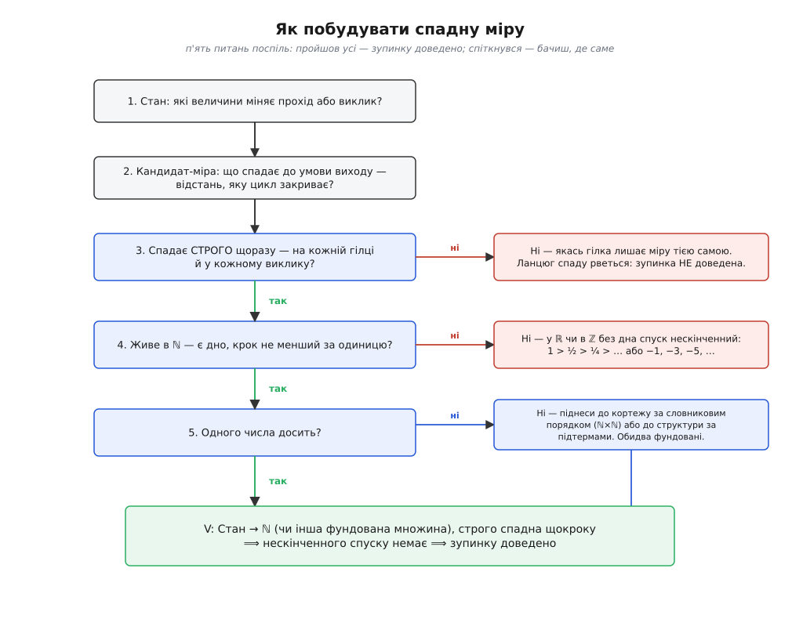
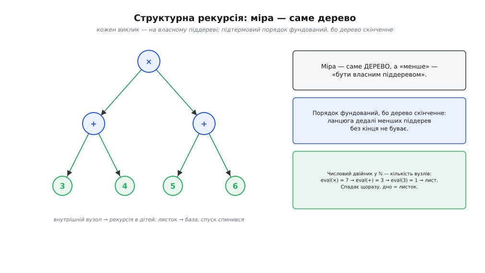

# ⚙️ Доводимо завершуваність: як знайти спадну міру

Маємо один-єдиний факт: у [натуральних числах](topic:math-logic/natural-numbers) немає нескінченного спуску — спадний ланцюг рано чи пізно впирається в дно. Факт скромний. А тепер перетворімо його на робочий інструмент, що доводить: **оцей конкретний цикл зупиниться**, оця рекурсія не крутитиметься вічно.

Спокуса — просто запустити й подивитися. Але запуск нічого не доводить: входів нескінченно багато, і те, що на тисячі перевірених програма спинилася, не каже нічого про тисячу першу. Потрібне доведення, яке накриває **всі** входи одним махом. І принцип повного впорядкування дає для цього рівно один хід.

**Хід такий.** Зістав кожному стану обчислення натуральне число — назвімо його **мірою** (в інженерній традиції ту саму річ звуть [варіантом циклу](topic:math-logic/loop-variant), а в теорії — ранжувальною функцією). Домовся, що з кожним кроком міра **строго спадає**. Якщо це вдалося — зупинку доведено, і ось чому. Візьми будь-яке виконання: воно породжує послідовність мір `V(s₀) > V(s₁) > V(s₂) > …`. Це строго спадний ланцюг натуральних чисел. А такого нескінченного ланцюга не буває — він мусить обірватися за скінченне число кроків. Отже, виконання скінченне. Один рядок міркування, і вся сила в ньому: метод переносить «немає нескінченного спуску» з натуральних чисел на твій цикл.

Уся хитрість — не в теоремі (вона тривіальна), а в тому, щоб **знайти міру**. Це ремесло, і його варто розібрати покроково — від очевидних циклів до тих, де жодне число не годиться.

## Три обов'язки, які легко недобачити

Перш ніж шукати міру, треба точно знати, що з неї вимагається. Обов'язків рівно три, і кожен колись когось підводив.

```
(1) міра — натуральне число        V: Стан → ℕ   (є дно; крок не дрібніший за одиницю)
(2) спадає СТРОГО                   V(після) < V(до),  а не ≤
(3) на КОЖНОМУ переході             жодна гілка тіла й жоден виклик не виняток
```

Пропусти бодай один — і доведення розсипається, часто тихо. Нижче видно, як саме кожен ламається; поки що затям, що всі три однаково обов'язкові.

Варто одразу відмежувати міру від її сусіда. Міра доводить, що цикл **зупиниться**, — і тільки це. Вона нічого не каже про те, чи цикл порахує **правильну** відповідь; за це відповідає інша річ — [інваріант циклу](topic:sf-release/loop-invariants), твердження, що лишається істинним на кожному витку. Інваріант стереже, що нічого не зіпсувалося (безпека); міра стереже, що робота посувається до кінця (поступ). Разом вони й дають повну правильність: програма не бреше й не зависає. Цю пару вперше поставив на цілком упорядковані множини Роберт Флойд 1967 року в праці «Assigning Meanings to Programs» — і відтоді доведення зупинки виглядає саме так: відображення станів у множину без нескінченного спуску. (Усталено.)

## Найпростіша міра: прочитати її з умови виходу

Почнімо з циклу, де міра лежить на видноті:

```py
def count_up(n):
    i = 0
    while i < n:        # умова виходу: i < n стане хибною
        i += 1          # міра — це (n − i): відстань до виходу
    return i
```

Умова циклу — `i < n`. Вона перестане виконуватись, коли `i` дожене `n`, тобто коли `n − i` впаде до нуля. Ось і міра: **`V = n − i`**. Кожен прохід збільшує `i` на одиницю, тож `n − i` строго меншає на одиницю; дно — нуль, нижче якого умова вже хибна. Усі три обов'язки виконано, зупинку доведено.

Прийом, який тут спрацював, узагальнюється ширше, ніж здається. **Міра — це найчастіше та відстань, яку цикл закриває до своєї умови виходу.** Не самі змінні циклу, а те, як далеко ще до краю. Знайшов, що саме звужується до нуля, — знайшов кандидата в міру.

## Коли міра — не та змінна, за якою стежить умова

Тепер випадок, де прямолінійне «візьму змінну з умови» вимагає обережності. [Алгоритм Евкліда](topic:math-number-theory/gcd-euclidean) шукає найбільший спільний дільник, замінюючи пару `(a, b)` на `(b, a mod b)`:

```py
def gcd(a, b):
    while b != 0:           # умова виходу: b стане нулем
        a, b = b, a % b     # міра — це b
    return a
```

Умова тестує `b`, тож кандидат — `b`. Але тут не можна просто оголосити «`b` спадає» й піти далі: **треба перевірити**, що воно справді спадає строго. Нове значення `b` — це `a mod b`, остача від ділення. А остача завжди строго менша за дільник: `a mod b < b` при `b > 0`. Отже, наступне `b` строго менше за поточне, і оскільки воно невід'ємне, міра живе в ℕ. Обов'язки виконано.

Придивись, чого ми **не** робили. Ми не стежили за `a` — воно мірою не є. Ми не рахували, **наскільки швидко** падає `b`: це окреме, тонше питання — скільки кроків насправді, — і його аж до точних оцінок через числа Фібоначчі розібрано з боку алгоритмів у [варіанті циклу](topic:math-logic/loop-variant). Для доведення **зупинки** досить факту `a mod b < b`. Мораль: кандидата підказує умова виходу, але строгий спад доводиться окремо — інколи через властивість операції (тут — остачі), а не через очевидність.

## Рекурсія: міра — це аргумент, на якому кличеш

Цикл і рекурсія — той самий спуск, лише вбраний по-різному. [Рекурсія](topic:sf-algorithms/recursion) завершується, коли **кожен вкладений виклик робиться на «меншому» аргументі**, а «менше» міряється в ℕ:

```py
def length(node):
    if node is None:                   # база: далі не кличемо
        return 0
    return 1 + length(node.next)       # виклик на коротшому хвості
```

Міра — довжина списку від `node` до кінця. Кожен виклик передає `node.next`, тобто список на один вузол коротший; довжина строго спадає й упирається в нуль на `None`. Тут виразно видно, що база рекурсії — це і є дно міри: місце, звідки вже нікуди спускатися.

Іноді аргумент і міра збігаються (факторіал від `n` кличе `n−1` — міра просто `n`), а іноді міру треба вивести з аргументів, як щойно з вузла — його «залишкову довжину». Питання завжди те саме: **що в аргументах строго меншає з кожним заглибленням і не може меншати вічно?**

## Коли одного числа мало: кортеж за словниковим порядком

Буває, що жодне окреме число не спадає щокроку — а завершуваність є. Класика — цикл із **скиданням** внутрішнього лічильника:

```py
def drain(x, N):
    y = N
    while x > 0:
        if y > 0:
            y -= 1          # тут x стоїть на місці
        else:
            x -= 1          # а тут y підскакує вгору
            y = N
```

Ані `x`, ані `y` окремо мірою не є: у першій гілці `x` не змінюється, у другій `y` **зростає**. Та варто поглянути на **пару** `(x, y)` — і спуск проявляється. Порівнюймо пари **словниково** (як у словнику: спершу за першим, за рівності — за другим):

```
(x, y) < (x′, y′)   ⟺   x < x′,   або   x = x′ і y < y′

гілка y−=1:   x той самий, y меншає  →  пара меншає (за другою координатою)
гілка x−=1:   x меншає  →  пара меншає (за першою), і байдуже, що y підскочив
```

Щокроку пара строго спадає словниково. А множина пар `ℕ×ℕ` зі словниковим порядком **фундована** — нескінченного спуску в ній немає. Причина проста: перша координата може впасти лише скінченне число разів (вона натуральна), тож рано чи пізно застигне назавжди; а від тієї миті вся робота лягає на другу, якій донизу теж скінченно. Стрибки `y` вгору не безкоштовні — кожен оплачено падінням `x`, а `x` має скінченний запас падінь.

Якщо хочеться не пари, а **одного** числа (наприклад, щоб дістати ще й оцінку кроків), пару згортають в одометр. Оскільки `y` не перевищує `N`, беремо

```
V = x·(N + 1) + y
```

— і перевіряємо, що обидві гілки таки збивають це число:

```
гілка y−=1:   ΔV = −1                          (x·(N+1) те саме, y на 1 менше)
гілка x−=1:   ΔV = −(N+1) + (N − 0) = −1        (x на 1 менше;  y: 0 → N)
```

Обидві — крок униз щонайменше на одиницю, і `V` живе в ℕ. Той самий цикл, тепер із мірою-числом.

## Функція Аккермана: коли лексикографічна міра неминуча

Найяскравіший приклад, де без кортежа не обійтися, — **функція Аккермана**. Її стислу двоаргументну форму вивели угорка Рожа Петер (1935) і американець Рафаель Робінсон (1948) із тризначної функції, що її 1928 року побудував німець Вільгельм Аккерман як приклад обчислюваної функції, яка **не є примітивно рекурсивною** (усталено). Ось вона:

```py
def ack(m, n):
    if m == 0:
        return n + 1
    if n == 0:
        return ack(m - 1, 1)              # m меншає
    return ack(m - 1, ack(m, n - 1))      # зовнішній: m меншає; внутрішній: m той самий, n меншає
```

Спробуй знайти для неї одне натуральне число, що спадає з кожним викликом, — і застрягнеш. Значення `ack(m, n)` не спадає, воно вибухає: уже `ack(4, 2) = 2⁶⁵⁵³⁶ − 3` має 19 729 десяткових цифр. Другий аргумент теж не годиться: у виклику `ack(m, n−1)` він падає, але результат цього виклику стає **новим** другим аргументом зовнішнього `ack(m−1, …)` — і може бути астрономічним.

А **пара** `(m, n)` за словниковим порядком спадає завжди. Переглянь три виклики в коді:

```
ack(m−1, 1)             :  m меншає             →  (m−1, 1) < (m, n)
ack(m, n−1)  (внутр.)   :  m той самий, n−1 < n →  (m, n−1) < (m, n)
ack(m−1, …)  (зовн.)    :  m меншає             →  (m−1, …) < (m, n)
```

Кожен виклик дає пару, строго меншу за `(m, n)` словниково. Отже, рекурсія завершується — попри те, що і значення, і другий аргумент дорогою ростуть без міри. Ця пара `(m, n)` — не хитрий трюк, а точна відповідь на питання «яка фундована множина тут потрібна»: не ℕ, а `ℕ×ℕ`. Куди веде ця драбина далі — до ординалів, коли навіть кортежів ℕ перестає вистачати, — розказано з боку алгоритмів у [фундованості](topic:math-logic/loop-variant/math-well-founded.md).



*Міру шукають за п'ятьма питаннями. Перші два будують кандидата, наступні три перевіряють обов'язки. Спіткнувся на строгому спаді чи на дні — міри немає, це глухий кут. Забракло одного числа — піднімаєшся до кортежу або структури й усе одно доходиш до доведення.*

## Коли стан — не число, а структура: фундовані відношення

Досі міра була числом або кортежем чисел. Але принцип не вимагає чисел зовсім — йому досить **будь-якої** множини без нескінченного спуску. Це видно найкраще на рекурсії по деревах і термах, де «менше» означає «є власною частиною».

Розглянь обчислення виразу-дерева `(3 + 4) × (5 + 6)`. Функція `eval` кличе себе на піддеревах:

:::tabs
```rust
enum Expr {
    Num(i64),
    Add(Box<Expr>, Box<Expr>),
    Mul(Box<Expr>, Box<Expr>),
}

fn eval(e: &Expr) -> i64 {
    match e {
        Expr::Num(v) => *v,                     // база: лист, глибше не йдемо
        Expr::Add(l, r) => eval(l) + eval(r),   // виклики на власних піддеревах —
        Expr::Mul(l, r) => eval(l) * eval(r),   // кожне строго менше за e
    }
}
```
```py
def eval(e):
    match e:
        case ("num", v):
            return v                     # база: лист, глибше не йдемо
        case ("add", l, r):
            return eval(l) + eval(r)     # виклики на власних піддеревах —
        case ("mul", l, r):
            return eval(l) * eval(r)     # кожне строго менше за e
```
:::

Де тут спадна міра? Жодне число не передається й не зменшується явно. Мірою є **саме дерево**, а порядок — «бути власним піддеревом». Кожен виклик `eval(l)` чи `eval(r)` дістає піддерево строго менше за `e` — бо воно частина `e`, без кореня. І цей порядок фундований з простої причини: **дерево скінченне**, тож ланцюга дедалі менших піддерев без кінця не буває — рано чи пізно впираєшся в лист, де рекурсія й спиняється.

Якщо кортежі й дерева хочеться звести до звичного числа — завжди можна: візьми **кількість вузлів**. У `eval((3+4)×(5+6))` це 7, у виклику на `(3+4)` — 3, на листі `3` — 1. Число строго спадає, дно — лист. Обидва погляди рівноправні: «фундоване відношення на структурах» і «відображення в ℕ» доводять те саме, просто перший часто природніший, бо не змушує вигадувати лічильник там, де сама будова вже впорядкована.



*Рекурсія по дереву не передає жодного лічильника — і все ж завершується. Мірою є саме піддерево, а «менше» означає «власна частина»; цей порядок фундований, бо дерево скінченне. Числовий двійник — кількість вузлів — спадає в ℕ від кореня до листа.*

> 🔧 **Навіщо це.** Структурна рекурсія — це та сама [математична індукція](topic:math-logic/mathematical-induction), прочитана як програма: доводиш властивість для листа (база) і для вузла, спираючись на дітей (крок), — а фундованість підтермового порядку гарантує, що так накриєш усе дерево. Тому обхід дерева, розбір виразу, рекурсія по граматиці **не потребують окремого лічильника глибини**: сама скінченність структури вже є доведенням зупинки. Лічильник додають лише там, де ризикують не структурою, а зациклюванням на **циклічних** даних — граф із петлею вже не дерево, і підтермовий порядок на ньому ламається.

## Три способи схибити

Тепер найкорисніше — де метод ламається. Кожна пастка — це порушений обов'язок із трьох, і кожна виглядає як доведення, аж поки не придивишся.

**Пастка перша: міра спадає, але не строго — або не на кожній гілці.** Досить однієї гілки тіла, де величина встояла, і ланцюг `V(s₀) > V(s₁) > …` розривається: між рівними членами вже не «>», а «=». Ось цикл, що чекає на нуль і **на непарних не посувається взагалі**:

```py
def wait_for_zero(x):
    while x > 0:
        if x % 2 == 0:
            x -= 1          # для парних міра падає
        # для непарних — ЖОДНОЇ зміни: x лишається непарним, умова та сама → вічний цикл
```

Стартуй із `x = 4`: парне, `x` стає 3; тепер `x = 3` непарне, гілки для нього немає, стан не рухається — і цикл висить на трійці назавжди. Величина `x` «загалом меншає», та обов'язки (2)+(3) порушено: існує гілка, після якої вона не впала строго. Тому міру перевіряють **на кожній** гілці окремо, а не на тій, що першою спала на думку. Практична сторожа — вкласти `assert x < x_prev` першим рядком тіла: тоді жодна гілка не прослизне повз перевірку, і зависання спливе на першому ж витку.

**Пастка друга: міра не має дна — живе не в тій множині.** Обов'язок (1) вимагає ℕ не з педантизму. Дві звичні підміни його вбивають.

По-перше, ціле без нижньої межі. `while x != 0: x -= 2`, стартуючи з непарного `x`, дає `1, −1, −3, −5, …` — строго спадає **вічно**, бо в цілих дна немає й нуль просто перестрибується. У Python, де цілі необмежені, це справдешній нескінченний цикл, і жодне «воно ж меншає» не рятує.

По-друге — і це та сама пастка, що й у самому принципі, — **дійснозначна міра**. Множина `ℝ≥0` не фундована: ланцюг `1 > ½ > ¼ > …` строго спадний, обмежений нулем — і нескінченний.

```py
x = 1.0
while x > 0:
    x = x / 2        # строго спадає, ≥ 0 — і НІКОЛИ не спиняється в математиці
```

Тут «строго спадає та не менше нуля» — **не** доведення зупинки. Що цей конкретний цикл усе-таки завершується (за 1075 проходів), забезпечує не математика, а скінченність [чисел із рухомою комою](topic:hw-arch/floating-point): `x` провалюється в рівний нуль, коли вичерпуються денормалі. Заміни `float` на точний дріб — і цикл зависне. Доведення, яке тримається на розрядності типу, — не доведення. Щоб дійсна величина стала мірою, потрібен гарантований мінімальний крок `ε`; тоді мірою є ціле `⌈x/ε⌉`, і воно вже в ℕ. Різниця між ℕ і ℝ≥0 тут не формальність: у ℕ кожен крок униз коштує щонайменше одиницю — саме ця зернистість і дає дно, якого в дійсних немає.

**Пастка третя: сплутати «спадає» із «завершується».** Це корінь двох попередніх, і його варто назвати прямо. «Величина зменшується» саме по собі **не доводить нічого**. Доводить лише повний набір: строго, щоразу, у фундованій множині. Величина, що спадає «в середньому», «майже завжди» чи «зрештою», — не міра: досить нескінченно багато кроків без строгого спаду, і спуск не обірветься. Тому перше питання до кандидата в міру — не «чи спадає воно», а «**в якому порядку воно живе й чи справді меншає на кожному без винятку кроці**». Відповів на це — маєш доведення; ні — маєш лише відчуття, що «якось воно ж закінчиться».

## Межа методу: коли міри не знайти

Лишається чесно сказати, чого метод **не** вміє. І тут криється тонкість, гостріша за звичне «міру не завжди видно».

Надійність методу — беззастережна: **знайшов** спадну міру — цикл завершується, крапка, без винятків. Питання з іншого боку: чи завжди міру можна знайти?

Спершу приголомшлива відповідь: для детермінованої програми, що завершується з кожного стану, міра **завжди існує**. Оголоси мірою «кількість кроків, що лишилися до виходу». Це натуральне число, і воно спадає рівно на одиницю щокроку. Здавалося б, метод усемогутній.

Пастка в тому, що ця міра визначена лише тоді, коли ти **вже знаєш**, що програма спиниться, — інакше «кроків, що лишилися» не існує як числа. Існування міри й **уміння її знайти** — різні речі. І ось саме знайти її в загальному випадку неможливо: питання «чи спиниться дана програма на даному вході» алгоритмічно **нерозв'язне** — це [проблема зупинки](topic:computability/halting-problem), доведена Аланом Тюрінгом 1936 року. Якби існував загальний спосіб будувати міри, ним би розв'язали й зупинку — а її розв'язати не можна. Тому універсального рецепта «дай програму — віддам міру» немає й бути не може.

Звідси й правильне ставлення до відкритих випадків. Візьми гіпотезу Коллатца: бери число, парне — ділиш навпіл, непарне — множиш на три й додаєш одиницю; кажуть, з будь-якого старту зрештою дійдеш до одиниці, але ніхто не довів. Те, що для неї не знайдено спадної міри, — **не** вирок методові. Якщо послідовність справді завжди сходить до одиниці, міра для неї існує; просто ніхто не зумів пред'явити таку, що спадає щокроку. Ми не знаємо, це наша нестача кмітливості чи справжня стіна.

І остання деталь, щоб не скласти хибної картини. Іноді ℕ **замало** — трапляються (щоправда, рідкісні, здебільшого штучні) процеси, чия завершуваність вимагає піднятися вище за натуральні числа, у трансфінітні щаблі. Але це не про безсилля методу, а про багатство фундованих множин, у які можна відображати; повний їх список — драбина ординалів, і про неї, разом із послідовністю Ґудштейна на самій вершині, — знову ж таки з боку алгоритмів у [фундованості](topic:math-logic/loop-variant/math-well-founded.md).

## Куди це складається

Метод завершуваності — це два порожні рядки анкети, які треба заповнити:

```
яка фундована множина?     ℕ          — лічильник: n−i, остача b в Евкліда, глибина рекурсії
                           ℕ×ℕ        — пара за словниковим порядком: скидання, функція Аккермана
                           структура  — підтермовий порядок: дерева, терми, розбір граматики

яке відображення в неї?    V: Стан → та множина,  строго спадне на КОЖНОМУ кроці
```

Заповнив обидва рядки — зупинку доведено, і жодна сила цього не скасує, бо за спиною стоїть один непорушний факт: нескінченного спуску не буває. Не заповнив — питання чесно лишається відкритим: або ще не додумався до міри, або стоїш перед стіною, якої зсередини не обійти. Метод не обіцяє відрізнити одне від одного — і саме ця стриманість робить його доведенням, а не обіцянкою.
