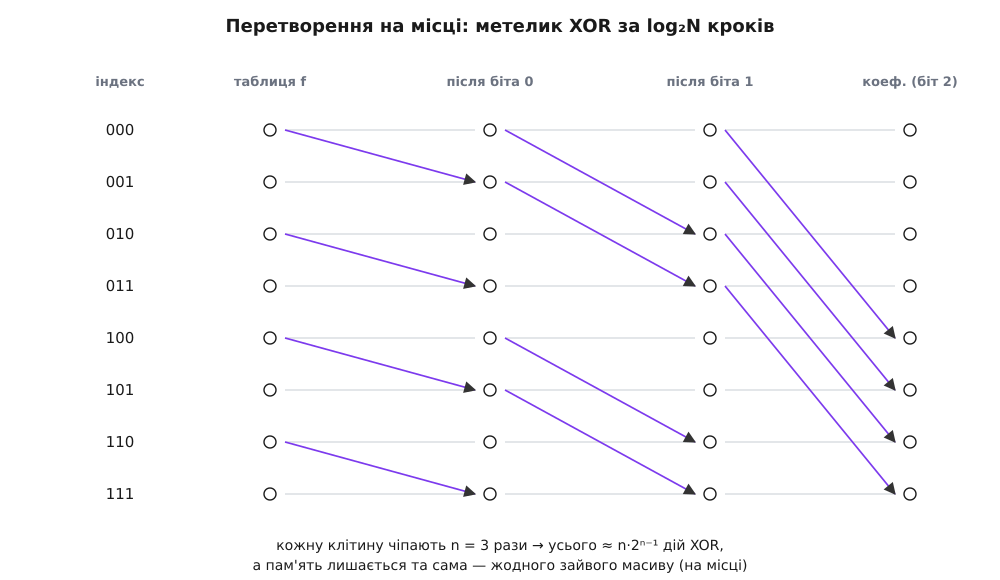
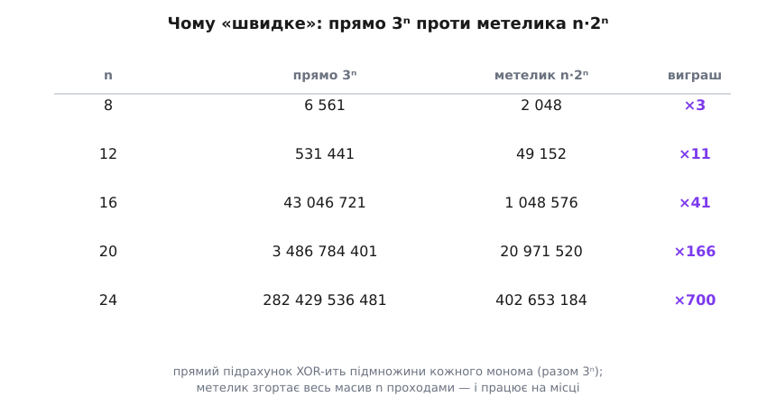

# ⚙️ Перетворення Мебіуса на місці: поліном за n·2ⁿ дій

<preknowlist>
- [Булева функція й таблиця істинності](topic:math-logic/boolean-algebra) — функція від n нулів-одиниць, задана стовпчиком із 2ⁿ виходів 0/1.
- [XOR — додавання за модулем 2](topic:hw-digital/xor-comparison) — ⊕: одиниця, коли входи різні; 1⊕1 = 0, тож однакові доданки гинуть парами.
- [Нотація O великого](topic:computability/asymptotic-complexity) — як міряють кількість роботи алгоритму залежно від розміру входу.
</preknowlist>

**Задача.** Функція задана найчеснішим способом — голим стовпчиком таблиці істинності: масив із 2ⁿ бітів, де в комірці з номером m лежить значення функції на тому наборі входів, чий двійковий запис дорівнює m. Хочемо дістати з нього коефіцієнти полінома Жегалкіна: той самий масив із 2ⁿ комірок, але тепер у комірці m — коефіцієнт (0 або 1) при мономі з тих змінних, чиї біти в m увімкнені. Порожній набір (m = 0) — це вільний член, {c} — доданок c, {a, b} — доданок a·b, і так далі. А маючи готовий поліном, хочемо швидко відповідати на три запитання: скільки він дає на конкретному наборі, який у нього степінь (найдовший доданок) і чи він лінійний. Усе — за час, лінійний до розміру таблиці з точністю до множника-логарифма.

**Ідея.** Лобовий рецепт очевидний, але марнотратний. Коефіцієнт при мономі m — це XOR значень функції на всіх наборах-підмножинах m (це і є перетворення Мебіуса; чому саме підмножини і чому воно так гарно обертається — окрема, коротка алгебра, тут беремо як даність). Порахувати кожен коефіцієнт окремо — означає для кожного з 2ⁿ мономів пробігти його підмножини. Скільки це разом? Моном на k змінних має 2ᵏ підмножин, а мономів на k змінних рівно C(n,k) — тож усього роботи Σ C(n,k)·2ᵏ = (1+2)ⁿ = **3ⁿ** дій. Уже для n = 20 це мільярди XOR-ів, тоді як таблиця — усього мільйон комірок. Сусідні коефіцієнти перелічують майже ті самі суми наново, і за це переплата.

Хитрість — не рахувати кожен коефіцієнт окремо, а перегнати весь масив **на місці**, за один короткий прохід на кожну змінну. Візьмімо змінну під бітом i й розіб'ємо всі 2ⁿ комірок на пари, що різняться лише цим бітом: комірку m, де біт i нульовий, та її сусідку m|2ⁱ, де він увімкнений. У кожній парі до комірки-з-одиницею **додаємо** (⊕) комірку-з-нулем — і більше нічого не чіпаємо. Один такий прохід «згортає» одну змінну: після нього в кожній комірці сидить XOR по тих наборах, що відрізняються від неї значенням саме цієї змінної вниз. Проженемо по всіх n бітах — і масив значень перетвориться на масив коефіцієнтів. Кожну комірку зачепили рівно n разів (по разу на біт), кожен дотик — один XOR, а пар на прохід — половина масиву; разом виходить ≈ n·2ⁿ⁻¹ операцій, тобто O(n·2ⁿ). Замість 3ⁿ — n·2ⁿ: для n = 20 це у півтори сотні разів менше, і розрив тільки росте.


*Уся механіка згортки в одній картинці. Сірі лінії — значення, що йде далі незмінним; фіолетові стрілки — XOR: рядок-з-нулем за поточним бітом вливається в рядок-з-одиницею. Крок за бітом 0 в'яже сусідів через один рядок, крок за бітом 1 — через два, крок за бітом 2 — через чотири. Це та сама фігура «метелика», що й у [швидкому перетворенні Фур'є](topic:com-signal/fft): той самий поділ навпіл, ті самі пари подвійних відстаней — лише замість комплексних поворотних множників тут гола XOR-згортка, тож і код коротший, і жодної арифметики з комою.*

## Осердя: три вкладені цикли

Увесь алгоритм — це три вкладені цикли й один рядок роботи всередині. Зовнішній перебирає біти-змінні (`step` = 1, 2, 4, … — вага поточного біта). Середній стрибає від блоку до блоку по два кроки. Внутрішній проходить нижню половину блоку й доливає її у верхню. Це гарячий, бітово-паралельний цикл із передбачуваним доступом до пам'яті — рівно те місце, де перформанс-мова окупається, тож поряд із читабельним пайтонівським еталоном варто мати й версії, що працюють на сирій пам'яті.

:::tabs
```python
def anf_transform(t):                 # t — масив із 2ⁿ бітів (0/1); згорнеться на місці
    step = 1
    while step < len(t):              # по одному біту-змінній за раз
        for j in range(0, len(t), step * 2):        # від блоку до блоку
            for k in range(j, j + step):            # нижня половина блоку
                t[k + step] ^= t[k]   # рядку-з-одиницею ⊕ рядок-з-нулем
        step *= 2
    return t
```
```c
#include <stdint.h>
#include <stddef.h>

// t — 2^n байтів-бітів; після виклику t[m] — коефіцієнт при мономі-підмножині m
void anf_transform(uint8_t *t, int n) {
    for (size_t step = 1; step < ((size_t)1 << n); step <<= 1)
        for (size_t j = 0; j < ((size_t)1 << n); j += step << 1)
            for (size_t k = j; k < j + step; ++k)
                t[k + step] ^= t[k];        // рядку-з-одиницею ⊕ рядок-з-нулем
}
```
```rust
// t — зріз із 2^n значень 0/1; згортається на місці в коефіцієнти
fn anf_transform(t: &mut [u8]) {
    let mut step = 1;
    while step < t.len() {                  // по одному біту-змінній за раз
        for block in t.chunks_mut(step << 1) {          // блок = дві сусідні половини
            let (lo, hi) = block.split_at_mut(step);
            for (a, b) in lo.iter().zip(hi.iter_mut()) {
                *b ^= *a;                   // половину-з-одиницею ⊕ половина-з-нулем
            }
        }
        step <<= 1;
    }
}
```
:::

Вкладки різняться не перекладом одного циклу в інший синтаксис, а тим, як кожна мова *думає* про масив. Пайтон бачить список і крутить індекси — зрозуміло очам, але кожен `t[k]` коштує розіменування об'єкта. C бачить суцільний шматок байтів і адресну арифметику — саме те, що ляже у векторні регістри процесора без жодного зусилля. Rust ту саму суцільну пам'ять розрізає безпечно: `chunks_mut` ділить масив на блоки завширшки у два кроки, `split_at_mut` дає дві половини, які компілятор дозволяє чіпати одночасно, бо статично довів, що вони не перетинаються. Три погляди на один і той самий рух даних — і той, хто пише швидку версію, обирає між «читабельно» й «лягає в залізо» свідомо, а не за звичкою.

Прожену на знайомій функції — мажоритарній МАЖ(a, b, c), що видає одиницю, коли одиниць на вході більшість. Її таблиця для наборів 000…111 — це `0, 0, 0, 1, 0, 1, 1, 1`:

```python
maj = [0, 0, 0, 1, 0, 1, 1, 1]        # МАЖ(a,b,c), рядки 000..111
coef = anf_transform(maj[:])          # копія: перетворення псує вхід (на місці)
print(coef)                           # [0, 0, 0, 1, 0, 1, 1, 0]

names = "cba"                          # домовленість: біт 0 → c, біт 1 → b, біт 2 → a
terms = []
for m, c in enumerate(coef):
    if c:                              # коефіцієнт увімкнено — моном входить у поліном
        vs = [names[i] for i in range(3) if m >> i & 1]
        terms.append("·".join(reversed(vs)) or "1")
print(" ⊕ ".join(terms))              # b·c ⊕ a·c ⊕ a·b
```

Три однакові доданки, `МАЖ = a·b ⊕ b·c ⊕ a·c` — саме той симетричний многочлен, що ховається за «більшістю голосів». Ці кілька рядків метелика відтворили його з голої таблиці, без жодного алгебричного здогаду.

## Перетворення — саме собі обернене

Одна властивість цього метелика заслуговує окремої уваги, бо економить і код, і думання: він **інволюція**. Прогнати `anf_transform` удруге, тепер уже над коефіцієнтами, — і повернеться вихідна таблиця істинності. Окремої «оберненої» функції писати не треба, бо туди й назад веде та сама дорога:

```python
back = anf_transform(coef[:])
print(back)                           # [0, 0, 0, 1, 0, 1, 1, 1]  — знову таблиця МАЖ
```

Причина коротка: кожен крок метелика — це додавання нижньої половини у верхню за модулем 2, а така операція над GF(2) сама себе скасовує (додав те саме двічі — `x ⊕ x = 0` — і нічого не змінилося). Ціла матриця перетворення при піднесенні у квадрат обертається на тотожну. Практичний зиск подвійний: по-перше, з коефіцієнтів так само дешево дістати назад усю таблицю значень; по-друге, це готова перевірка коду — прогін «туди-назад» мусить повернути вхід біт у біт, і якщо не повернув, помилку видно одразу.

## Три запитання до готового полінома

Коли масив уже тримає коефіцієнти, три обіцяні відповіді читаються майже без роботи.

**Значення на наборі x.** Поліном на конкретному наборі — це XOR тих доданків, що «загорілися». А моном загоряється рівно тоді, коли всі його змінні дорівнюють одиниці, тобто коли його множина-маска m **сидить усередині** маски входу x (кожен біт m увімкнений і в x). Мовою бітів: m ⊆ x ⟺ `m & x == m`. Тож значення — це XOR коефіцієнтів по всіх підмножинах x, а підмножини маски перебирають класичним трюком `m = (m - 1) & x`, що спускається від самої x до нуля.

**Алгебричний степінь.** Найдовший живий доданок — це коефіцієнт-одиниця з найбільшою кількістю увімкнених бітів у своєму номері. Отже, степінь — це максимум від *popcount* (кількості одиниць у двійковому запису) по всіх індексах, де коефіцієнт ненульовий. Тотожний нуль живих доданків не має; йому за домовленістю віддаємо −1 (стала 1 має степінь 0, тож нуль мусить бути нижче).

**Лінійність.** Функція лінійна (точніше афінна, якщо дозволити вільну одиницю) рівно тоді, коли її степінь не перевищує 1 — жодного доданка з двох і більше змінних. Не треба навіть рахувати степінь до кінця: щойно трапився ненульовий коефіцієнт з popcount ≥ 2, відповідь «ні», і можна виходити.

:::tabs
```python
def anf_eval(coef, x):                # значення полінома на наборі x
    acc, m = 0, x
    while True:
        acc ^= coef[m]                # ⊕ коефіцієнти всіх підмножин x
        if m == 0:
            break
        m = (m - 1) & x               # наступна підмножина маски x
    return acc

def anf_degree(coef):                 # алгебричний степінь = найдовший живий доданок
    return max((m.bit_count() for m, c in enumerate(coef) if c), default=-1)

def is_affine(coef):                  # лінійна (афінна) ⟺ степінь ≤ 1
    return all(c == 0 or m.bit_count() < 2 for m, c in enumerate(coef))
```
```c
#include <stdint.h>
#include <stddef.h>

// значення полінома на наборі x: ⊕ коефіцієнтів усіх підмножин x
uint8_t anf_eval(const uint8_t *coef, size_t x) {
    uint8_t acc = 0;
    for (size_t m = x; ; m = (m - 1) & x) {     // перебір підмножин маски x
        acc ^= coef[m];
        if (m == 0) break;
    }
    return acc;
}

// алгебричний степінь; -1 для тотожного нуля (живих доданків нема)
int anf_degree(const uint8_t *coef, int n) {
    int deg = -1;
    for (size_t m = 0; m < ((size_t)1 << n); ++m)
        if (coef[m]) {
            int d = __builtin_popcountll((unsigned long long)m);
            if (d > deg) deg = d;
        }
    return deg;
}

// лінійна (афінна) ⟺ немає доданка з двох і більше змінних
int is_affine(const uint8_t *coef, int n) {
    for (size_t m = 0; m < ((size_t)1 << n); ++m)
        if (coef[m] && __builtin_popcountll((unsigned long long)m) >= 2)
            return 0;
    return 1;
}
```
```rust
// значення полінома на наборі x: ⊕ коефіцієнтів усіх підмножин x
fn anf_eval(coef: &[u8], x: usize) -> u8 {
    let (mut acc, mut m) = (0u8, x);
    loop {
        acc ^= coef[m];
        if m == 0 { break; }
        m = (m - 1) & x;              // наступна підмножина маски x
    }
    acc
}

// алгебричний степінь; -1 для тотожного нуля
fn anf_degree(coef: &[u8]) -> i32 {
    coef.iter().enumerate()
        .filter(|&(_, &c)| c != 0)
        .map(|(m, _)| m.count_ones() as i32)
        .max()
        .unwrap_or(-1)
}

// лінійна (афінна) ⟺ жодного доданка з двох і більше змінних
fn is_affine(coef: &[u8]) -> bool {
    coef.iter().enumerate()
        .all(|(m, &c)| c == 0 || m.count_ones() < 2)
}
```
:::

Тут добре видно, як кожна мова каже те саме своїм голосом. Popcount — операція, задля якої в процесорі є окрема інструкція: у C її дає `__builtin_popcountll`, у Rust — метод `count_ones`, у Python — `int.bit_count`. Перебір підмножин маски `m = (m - 1) & x` — той самий у всіх трьох, бо це чиста бітова тотожність, а не ідіома мови. А Rust-версії степеня й лінійності показують, як ланцюжок ітераторів (`filter` → `map` → `max`, або `all`) читається майже як означення — і при цьому компілюється в такий самий цикл, як рукописний C. Прожену на МАЖ:

```python
print(anf_degree(coef))               # 2
print(is_affine(coef))                # False
print(anf_eval(coef, 0b011))          # 1  — МАЖ(0,1,1) = 1, двоє за
print(anf_eval(coef, 0b001))          # 0  — МАЖ(0,0,1) = 0, більшості нема
```

Степінь 2 — і це вже щось означає: МАЖ **не** лінійна, за стіну лінійних функцій їй ходу немає, тому суматор на самих XOR-ах і не збудуєш (перенос — це МАЖ). А `anf_eval` на всіх восьми входах відтворює вихідну таблицю — ще одна перевірка, що поліном порахувався правильно.

## Складність і чому «швидке» — не марнославство

Метелик робить ≈ n·2ⁿ⁻¹ операцій XOR і не бере **жодної** зайвої пам'яті понад сам масив: усе згортається на місці. Прямий підрахунок за означенням коштує 3ⁿ, а зовсім лобовий («для кожного з 2ⁿ коефіцієнтів просканувати всі 2ⁿ комірок і перевірити підмножинність») — аж 4ⁿ. Різниця не косметична, а вирішальна:


*Обидві колонки — це кількість елементарних дій, не вигадка. Прямий шлях XOR-ить підмножини кожного монома окремо (разом 3ⁿ), метелик згортає весь масив n проходами (n·2ⁿ⁻¹). Уже на n = 16 різниця сорокакратна, на n = 24 — сімсоткратна, і далі 3ⁿ/(n·2ⁿ) росте без стелі, бо (3/2)ⁿ переганяє будь-який поліном від n. Для криптографа, що жене цей аналіз на кожен S-блок мільйони разів, це різниця між «за секунду» і «до ранку».*

Три деталі варто тримати в голові окремо. По-перше, `anf_eval` для одного набору коштує 2^popcount(x) — стільки, скільки підмножин у x; для щільного x (багато одиниць) це може дорости майже до 2ⁿ. Якщо потрібні значення на **всіх** наборах, дешевше не викликати `anf_eval` 2ⁿ разів, а один раз прогнати самообернений метелик — і за n·2ⁿ дістати всю таблицю. По-друге, `anf_degree` і `is_affine` — це один прохід по масиву, O(2ⁿ), і саме `is_affine` завдяки ранньому виходу зазвичай спиняється на першому ж нелінійному доданку. По-третє, зберігати біти окремими байтами — марнотратство у вісім разів: справжні бібліотеки пакують 64 біти в машинне слово й XOR-ять цілими словами, тож ціла хвиля метелика для дрібних кроків стає *словесно-паралельною*, а на великих кроках лягає в SIMD-регістри AVX2/AVX-512. Ідея та сама, лічба та сама — просто кожна дія обробляє відразу пучок бітів.

## Пастки

**Порядок і напрям — тут ховається половина помилок.** Уся домовленість тримається на двох речах, і сплутати їх легко. Перша: який біт індексу відповідає якій змінній. Якщо таблицю ви будували, вважаючи першу змінну старшим бітом набору, а коефіцієнти читаєте, вважаючи її молодшим, — метелик спрацює бездоганно, але видасть поліном **іншої**, переставленої функції, і жоден `assert` вас не спинить. Друга, підступніша: напрям згортки. Ми доливаємо рядок-з-нулем у рядок-з-одиницею (`t[k+step] ^= t[k]`). Зробіть навпаки — `t[k] ^= t[k+step]` — і теж дістанете коректну інволюцію, тільки вона порахує поліном у **доповнених** змінних (від'ємно-полярну форму замість додатної). Обидві помилки не падають і не сигналять; ловляться лише звіркою — прогнати результат назад через `anf_eval` і порівняти з вихідною таблицею.

**Переповнення при великих n.** Тут два різні провали. Перший — цілочисловий: у виразі `1 << n` літерал `1` має тип `int`, і для n ≥ 31 зсув виходить за межі 32-бітного знакового числа — невизначена поведінка в C, паніка чи сміття деінде. Лікування — рахувати ширину заздалегідь: `(size_t)1 << n` у C, `1usize << n` у Rust; Python від цього застрахований, бо цілі в нього необмежені. Другий провал — пам'ять: масив на 2ⁿ комірок росте нещадно. n = 30 — це вже гігабайт навіть по байту на біт, n = 34 — шістнадцять. Стеля алгоритму — не в його швидкості, а в цьому 2ⁿ: сам метелик радо перемолов би й більше, та йому нема де розкластися. Тому справжня межа застосовності — не «скільки XOR-ів», а «скільки влізе в пам'ять», і саме через це біти пакують у слова.

**Інволюція — не «два різні перетворення».** Спокуса написати окрему `anf_inverse`, що робить «те саме, але навпаки», породжує в кращому разі мертвий код, у гіршому — тонку помилку, бо «навпаки» пишуть із переставленим напрямом згортки (див. першу пастку) і зненацька отримують форму в доповнених змінних. Правильно — довіритися тому, що дорога одна: та сама `anf_transform` веде і від таблиці до коефіцієнтів, і назад.

**Степінь — це не кількість доданків.** Функція може мати сотню доданків і степінь 1 (наприклад, `a ⊕ b ⊕ c ⊕ … ⊕ z` — довжелезна, але лінійна), а може мати єдиний доданок і степінь n (`a·b·c·…·z`). Лінійність вимірюється **найдовшим** доданком, а не їхнім числом; плутанина тут веде до хибного висновку про стійкість функції.

> 🔧 **Навіщо це.** Той самий метелик — робоча конячка і криптографії, і завадостійких кодів, і його ганяють не раз, а тисячами. Оцінюючи вузол шифру (S-блок), першими рахують саме алгебричний степінь Жегалкіна й близькість до лінійних функцій: низький степінь — це вразливість, бо лінійне наближення розв'язується системою рівнянь за мить. А в кодах Ріда–Маллера це перетворення — просто спосіб перейти між повідомленням-многочленом і його значеннями-кодовими словами. Ім'я «Рід–Маллер» тут не випадкове: Девід Маллер 1954 року застосував булеву алгебру до проєктування перемикальних схем і виявлення похибок, а того ж року Ірвінг Рід дав до цих кодів схему **мажоритарного** декодування — так, тієї самої «більшості голосів», що ми брали за наскрізний приклад (усталений факт: обидві статті вийшли у вересні 1954-го). Тому в літературі цей алгоритм так і звуть — швидке перетворення Мебіуса, воно ж перетворення Ріда–Маллера.

Отже, метелик перетворення Мебіуса — це жменька рядків, що женуть таблицю істинності в поліном Жегалкіна за n·2ⁿ⁻¹ операцій XOR на місці, без зайвого байта пам'яті, і роблять це самооберненою дорогою. Поверх нього три коротші відповіді: значення на наборі — XOR коефіцієнтів по підмножинах входу; степінь — максимум popcount живих доданків; лінійність — той самий степінь, зважений на «≤ 1». А головні граблі — не в математиці, а в двох домовленостях: який біт яка змінна і куди тече згортка; переплутаєш — дістанеш охайний, коректний і зовсім не той поліном.
