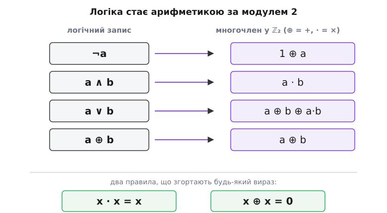
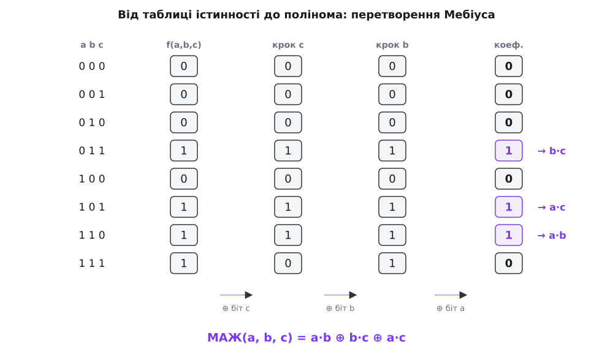
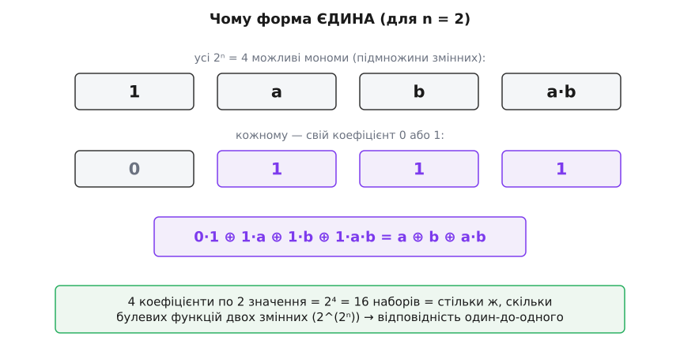
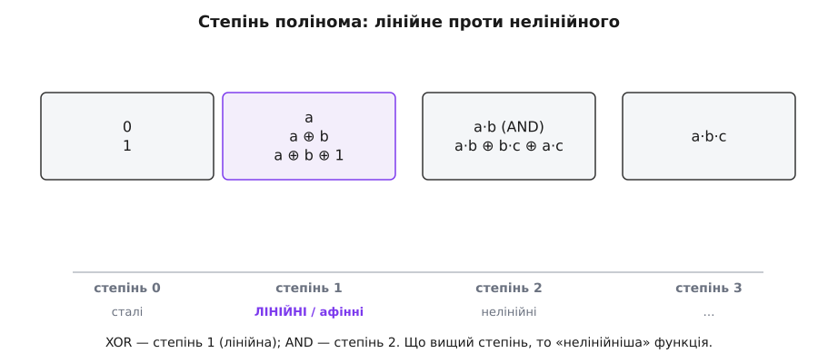

# Поліном Жегалкіна

<preknowlist>
- [Булева алгебра](topic:math-logic/boolean-algebra) — значення 0/1, таблиця істинності, дії ∧ («і»), ∨ («або»), ¬ («не») і запис функції сумою добутків.
- [XOR](topic:hw-digital/xor-comparison) — «виключне або» ⊕: одиниця, коли входи **різні**; воно ж — додавання за модулем 2.
- [Модульна арифметика](topic:math-number-theory/modular-arithmetic) — лічба за залишком; зокрема арифметика за модулем 2, де 1 + 1 = 0.
</preknowlist>

У булевій алгебрі та сама функція має безліч облич. «Або» можна записати як a ∨ b, а можна — за Де Морганом — як ¬(¬a ∧ ¬b); [сума добутків](topic:math-logic/boolean-algebra) дає ще один запис, карта Карно — ще коротший. Усі рівні між собою, і жоден не має права зватися «тим самим». Для ока це зручно, але для машини — біда: щоб спитати «чи ці дві формули задають одну функцію?», доводиться щоразу зводити обидві до чогось спільного. А спільного канонічного вигляду в мові ∧, ∨, ¬ немає — надто вона гнучка.

Іван Жегалкін 1927 року поставив інше, майже нахабне запитання: а що, як писати логіку **не** логічними значками, а звичайним многочленом — з плюсом і множенням, як у школі? Тоді функція стала б формулою на кшталт `a·b ⊕ b·c ⊕ 1`, і дві такі формули рівні тоді й лише тоді, коли збігаються буква в букву. Виявилося — можна. І цей запис не просто можливий, а **єдиний** для кожної функції. Його й називають **поліномом Жегалкіна** (або алгебричною нормальною формою, англ. *algebraic normal form*, ANF).

## Дві дії, що поводяться як плюс і множення

Щоб логіка стала арифметикою, треба знайти серед логічних дій такі, що підкоряються звичним законам додавання й множення. Кандидати знаходяться відразу.

**Множення — це «і».** Погляньмо на таблицю a ∧ b: одиниця лише коли обидва входи одиниці, тобто рівно тоді, коли **добуток** чисел a·b дорівнює 1. Для значень 0 і 1 кон'юнкція й множення — та сама операція, клітина в клітину. Отже, пишемо a ∧ b як a·b і нічого не втрачаємо.

**Додавання — це «виключне або».** А що буде плюсом? Спокуса взяти ∨ хибна: 1 ∨ 1 = 1, а не 2 і не 0 — на звичайне додавання не схоже. Зате [⊕](topic:hw-digital/xor-comparison), «виключне або», лягає ідеально: 0⊕0 = 0, 0⊕1 = 1, 1⊕0 = 1, а 1⊕1 = 0 — це рівно **додавання за модулем 2**, де двійка обертається на нуль. Тому значок XOR і малюють як плюс у кружечку: ⊕ — це `+`, у якому пам'ятають лише парність.

Отже, за основу беремо два дійства — множення (·) і додавання за модулем 2 (⊕) — над двома числами, 0 і 1. Ця крихітна система замкнена: додаси чи помножиш два біти — знову дістанеш біт. Математик назве її [полем (чи кільцем) із двох елементів](topic:math-algebra/rings), ℤ₂ — найменшою ареною, де водночас живуть додавання й множення. Уся арифметика в ній тримається на двох тотожностях, і саме вони роблять поліноми Жегалкіна такими охайними:

```
x · x = x       бо  0·0 = 0  і  1·1 = 1   → квадратів (і будь-яких степенів) не буває
x ⊕ x = 0       бо  0⊕0 = 0  і  1⊕1 = 0   → однакові доданки взаємно гинуть
```

Перша викидає всі степені: x², x³, x¹⁰⁰ — це просто x, бо змінна дорівнює одиниці або нулю, а вони на піднесення не реагують. Друга каже: якщо той самий доданок трапився двічі — обидва зникають. Разом вони гарантують, що хоч як розкладай і згортай вираз, урешті лишиться сума **різних** добутків **різних** змінних, і кожен — або є, або нема. Ніяких коефіцієнтів, крім 0 і 1, ніяких показників, крім 1. Уся звична алгебраїчна каша сама википає до сухого залишку.


*Кожну логічну дію переписуємо арифметикою в ℤ₂: «і» стає множенням, «виключне або» — додаванням, а «не» — це 1⊕a (перевернути біт = додати одиницю). «Або» не має власного знака, зате виражається через три доданки. Два правила внизу — вся магія спрощення: степені сплющуються, парні повтори гинуть.*

Лишилися ще ¬ і ∨ — і обидва легко перекласти. Заперечення перевертає біт: 0↔1. Але «перевернути» — це ж «додати одиницю за модулем 2» (0⊕1 = 1, 1⊕1 = 0). Тому **¬a = 1 ⊕ a**. А «або» дістаємо, згадавши, що a ∨ b відрізняється від a ⊕ b лише в одному рядку — там, де обидва входи одиниці: XOR там дає 0, а OR хоче 1. Доточимо цей рядок добутком a·b (він одиниця тільки там) — і рівність готова:

```
a ∨ b  =  a ⊕ b ⊕ a·b
```

Тепер маємо словник для всіх базових дій. А оскільки [будь-яку функцію можна зібрати з ¬, ∧, ∨](topic:math-logic/functional-completeness), то, підставляючи ці переклади й згортаючи двома правилами, **будь-яку** булеву функцію можна догнати до полінома Жегалкіна. Спосіб є завжди.

## Побудова згортанням: приклад

Найпряміший шлях — узяти звичний логічний запис і механічно перекласти. Візьмімо «або» й переконаймося, що воно справді згортається в обіцяне `a ⊕ b ⊕ a·b`, а не в щось інше.

**Приклад (a ∨ b через арифметику).** Почнімо з тотожності a ∨ b = ¬(¬a ∧ ¬b) і перекладімо кожен значок:

```
a ∨ b  =  ¬(¬a ∧ ¬b)
       =  1 ⊕ (¬a · ¬b)                 ← зовнішнє ¬ як 1⊕…
       =  1 ⊕ (1⊕a)·(1⊕b)               ← кожне ¬ як 1⊕…
       =  1 ⊕ (1 ⊕ a ⊕ b ⊕ a·b)         ← розкрили дужки як у школі
       =  a ⊕ b ⊕ a·b                    ← 1⊕1 = 0, передня одиниця згасла
```

Розкриття дужок (1⊕a)·(1⊕b) іде звичайним множенням: 1·1 ⊕ 1·b ⊕ a·1 ⊕ a·b. Далі спрацьовує x⊕x = 0: зовнішня одиниця й одиниця з дужки — однакові доданки, тож гинуть парою. Лишається `a ⊕ b ⊕ a·b`. Звірмо не на слово, а перебором усіх чотирьох входів:

```python
def xor(*bits):                 # додавання за модулем 2
    r = 0
    for b in bits: r ^= b
    return r

for a in (0, 1):
    for b in (0, 1):
        left  = a | b                        # звичайне «або»
        right = xor(a, b, a & b)             # a ⊕ b ⊕ a·b
        assert left == right, (a, b)
print("a ∨ b = a ⊕ b ⊕ a·b — збігається на всіх входах")
```

Жоден `assert` не спрацював — переклад точний. Так само згортається будь-яка формула: підставив словник, розкрив дужки, викинув степені й парні повтори — і на столі лежить поліном Жегалкіна.

## Побудова з таблиці: перетворення Мебіуса

Згортання зручне для короткої формули, але коли функція задана голою таблицею істинності, хочеться механічнішого рецепта — без алгебричної спритності. Він є, і напрочуд простий.

Ідея така. Кожному можливому добутку змінних відповідає своя підмножина: константі 1 — порожня множина, доданку a — множина {a}, доданку a·b — {a, b}, і так далі. Для n змінних таких добутків рівно 2ⁿ — стільки, скільки підмножин. Питання «який поліном?» зводиться до питання «які з цих 2ⁿ добутків увімкнені (коефіцієнт 1), а які ні (0)?».

Відповідь дає **перетворення Мебіуса** (на честь Авґуста Мебіуса, нім. *Möbius*): коефіцієнт при добутку — це XOR значень функції на всіх «менших або рівних» наборах входів. На практиці це рахується каскадом, за одним бітом за раз: пробігаємо по змінних, і для кожної додаємо (⊕) до кожного рядка значення рядка-сусіда, що відрізняється лише цією змінною. Після n проходів масив значень перетворюється на масив коефіцієнтів. Розберімо це на функції, що варта окремої уваги.

**Приклад (мажоритарна функція).** МАЖ(a, b, c) видає одиницю, коли одиниць на вході **більшість** — принаймні дві з трьох. Це вихідний перенос суматора й типова «трикутна» логіка. Її таблиця (для входів 000…111): 0, 0, 0, 1, 0, 1, 1, 1. Проженімо каскад — тричі, по одному біту:

```
вхід:      0 0 0 1 0 1 1 1
⊕ біт c →  0 0 0 1 0 1 1 0     (кожен непарний рядок ⊕ сусід зверху)
⊕ біт b →  0 0 0 1 0 1 1 1
⊕ біт a →  0 0 0 1 0 1 1 0     ← це вже коефіцієнти
```

Читаємо коефіцієнти за їхніми добутками: одиниці стоять на позиціях 011, 101, 110 — тобто при добутках b·c, a·c, a·b. Отже:

```
МАЖ(a, b, c)  =  a·b  ⊕  b·c  ⊕  a·c
```

Три однакові доданки, гарні, як на підбір. Хто б подумав, що «більшість голосів» — це така симетрична алгебра. Перевірити легко: на 111 усі три добутки одиниці, 1⊕1⊕1 = 1 (більшість є); на 011 одиниця лише в b·c, отже 1 (двоє за); на 001 усі добутки нульові, отже 0 (більшості нема). Сходиться на всіх восьми рядках.


*Таблиця істинності зліва проходить три хвилі XOR-згортки — по одній на кожну змінну. Після третьої хвилі значення обертаються на коефіцієнти полінома: там, де стоїть 1, добуток при відповідній підмножині змінних входить у поліном. Уся процедура — чиста механіка, жодного здогаду.*

Ця процедура — перетворення Мебіуса — не лише будує поліном; вона ще й **сама собі обернена**. Прогнавши той самий каскад над коефіцієнтами, дістанемо назад таблицю істинності. [Чому саме XOR підмножин дає коефіцієнти й чому перетворення обертає само себе](topic:math-logic/zhegalkin-polynomial/math-mobius-transform.md) — окрема, коротка й гарна алгебра.

## Форма єдина — і в цьому вся сила

Тепер — головне, заради чого все затівалося. Поліном Жегалкіна не просто **існує** для кожної функції; він для неї **єдиний**. Двох різних поліномів Жегалкіна, що задають ту саму функцію, не буває.

Переконатися можна найчеснішою лічбою. Для n змінних є 2ⁿ можливих добутків (по одному на кожну підмножину змінних). Поліном — це вибір, які з них увімкнути: кожному добутку — прапорець 0 або 1. Отже, різних поліномів рівно 2 у степені 2ⁿ. А скільки взагалі є булевих функцій від n змінних? Таблиця істинності має 2ⁿ рядків, у кожному вихід 0 або 1 — теж 2 у степені 2ⁿ. Числа збіглися. Поліномів **рівно стільки**, скільки функцій, і кожен поліном задає якусь функцію — а виходить, різні поліноми задають різні функції. Відповідність один-до-одного, без збігів і без пропусків.


*Для n = 2 мономів рівно чотири, тож поліном — це четвірка бітів-коефіцієнтів. Таких четвірок 2⁴ = 16, і булевих функцій двох змінних теж рівно 16. Раз наборів стільки ж, скільки функцій, і кожен дає функцію — відповідність точна, а отже, форма кожної функції одна-єдина.*

Ось чому поліном Жегалкіна — справжня **канонічна форма** (гр. *kanón* — мірило, взірець): не один із багатьох рівноправних записів, а один-єдиний на функцію. Порівняти дві функції стає тривіально: звести обидві до полінома й глянути, чи однакові. Немає збігу доданок у доданок — функції різні, і жодні перетворення цього не змінять. Ту саму послугу, до речі, надає й [сума добутків з усіма змінними](topic:math-logic/boolean-algebra) (досконала диз'юнктивна форма), але Жегалкінів запис коротший там, де багато «виключних або», і, головне, робить видимою одну властивість, невидиму в мові ∧, ∨.

## Степінь: що видно лише в поліномі

Коли функція записана поліномом, у неї раптом з'являється **степінь** — як у звичайного многочлена: найбільша кількість змінних в одному добутку. У `a ⊕ b ⊕ 1` найдовший доданок — одна змінна, степінь 1. У МАЖ найдовший — a·b, дві змінні, степінь 2. Ця цифра, непомітна у звичному логічному записі, виявляється напрочуд змістовною.

Функції степеня не вище 1 — з доданками щонайбільше в одну змінну — звуть **лінійними** (точніше афінними, коли є вільна одиниця). Це рівно ті функції, що будуються з самих ⊕ і заперечень, без жодного справжнього множення змінних: a ⊕ b ⊕ c ⊕ 1 і подібні. Саме вони утворюють один із [п'яти класів критерію Поста](topic:math-logic/functional-completeness) — «лінійний клас», крізь стіну якого не проходить жодна суто-XOR-схема. Тому, до речі, на самих логічних XOR-ах суматор не збудуєш: перенос — це МАЖ, а вона степеня 2, за стіну лінійності їй ходу нема.


*Степінь полінома сортує функції за «нелінійністю». Сталі — степінь 0, лінійні (сама сума XOR-ів) — степінь 1, а щойно з'являється добуток двох змінних — степінь 2 і вище. XOR лінійне, AND — уже ні. Чим вищий степінь, тим «нелінійніша» функція, і тим важче її вгадати чи наблизити лінійним рівнянням.*

> 🔧 **Навіщо це.** Ступінь нелінійності — це прямо про стійкість шифру. Лінійну функцію зламати легко: система лінійних рівнянь розв'язується за мить, тож якби вузли шифрувального перетворення (S-блоки) були лінійні, шифр падав би одразу. Тому криптографи навмисне беруть функції **високого** степеня Жегалкіна й далеких від будь-якої лінійної — щоб зловмисник не зміг наблизити перетворення рівняннями. Алгебричний степінь, який видно тільки в поліномі Жегалкіна, — один із перших чисел, що рахують, оцінюючи S-блок. А те, що будь-яку функцію можна виразити поліномом, лежить в основі цілого класу помилковиправних кодів (кодів Ріда — Маллера) і швидких схем на XOR-логіці, де добуток дорогий, а «виключне або» — дешеве.

Якщо ці перетворення хочеться не робити руками, а порахувати машинно — [швидкий алгоритм і робочий код](topic:math-logic/zhegalkin-polynomial/proj-anf-transform.md) будують поліном із таблиці за n·2ⁿ дій, обчислюють значення й визначають степінь.

## Звідки він узявся

Поліном названо на честь [Івана Жегалкіна, що 1927 року переклав усю булеву логіку мовою многочленів за модулем 2](topic:math-logic/zhegalkin-polynomial/hist-arithmetization.md) — і, як не дивно, ту саму форму через чверть століття незалежно перевідкрили на Заході інженери, коли будували перші завадостійкі коди.

## Що з цього забрати

**Поліном Жегалкіна** — це запис булевої функції звичайним многочленом над найменшою арифметикою, ℤ₂: «і» стає множенням, «виключне або» — додаванням за модулем 2, а два правила x·x = x і x⊕x = 0 згортають будь-який вираз до суми різних добутків із коефіцієнтами лише 0 і 1. Побудувати його можна двома шляхами: згорнути готову формулу, підставивши ¬a = 1⊕a і a∨b = a⊕b⊕a·b, або механічно перегнати таблицю істинності перетворенням Мебіуса. Головна цінність — **єдиність**: рівно один поліном на функцію (бо поліномів стільки ж, скільки функцій), а отже, це канонічна форма, у якій рівність двох функцій перевіряється поглядом. І понад те — поліном показує **степінь**, приховане число, що відділяє лінійні функції від нелінійних і лежить в основі і критерію повноти, і стійкості шифрів, і завадостійких кодів.
