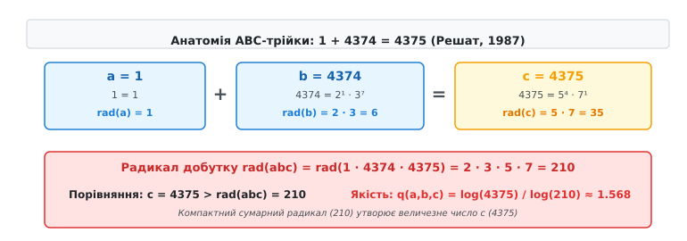
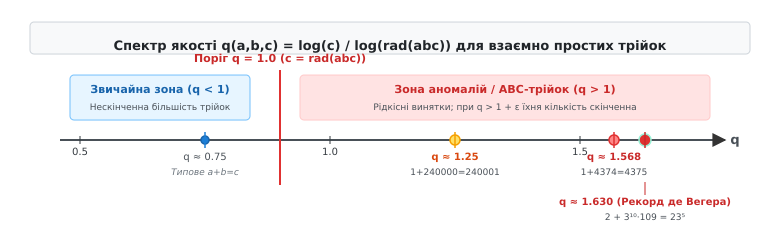
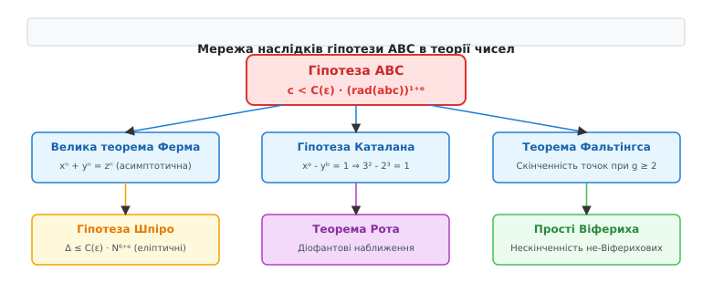

# Гіпотеза ABC

<preknowlist>
- [Основна теорема арифметики](root:math-number-theory/fundamental-theorem-arithmetic) — будь-яке натуральне число однозначно розкладається на прості множники.
- [Діофантові рівняння](root:math-number-theory/diophantine-equations) — рівняння у цілих числах та класичні методи їх розв'язання.
- [Велика теорема Ферма](root:math-number-theory/fermats-last-theorem) — неможливість цілочисельних розв'язків xⁿ + yⁿ = zⁿ для n ≥ 3 та роль кругових полів.
</preknowlist>

Натуральні числа володіють двома фундаментальними алгебраїчними структурами — адитивною (операція додавання) та мультиплікативною (розклад на прості множники за основною теоремою арифметики). У той час як множення є повністю прозорим і зберігає інформацію про прості дільники (`rad(a · b) = rad(a) · rad(b)`), додавання виявляється фундаментально несумісним із мультиплікативною будовою чисел. Знаючи розклад доданків `a` та `b`, ми не маємо жодного загального алгоритму чи формули, щоб передбачити прості дільники їхньої суми `c = a + b`.

Через цю глибоку структурну асиметрію математика протягом століть зіштовхувалася з нездоланними труднощами при дослідженні діофантових рівнянь. Без універсального закону, що пов'язує адитивні суми з мультиплікативними множниками, аналіз навіть найпростіших цілочисельних співвідношень (таких як `xⁿ + yⁿ = zⁿ` чи `xᵃ - yᵇ = 1`) вимагає побудови окремих громіздких теорій на сотні сторінок, оскільки найпростіший адитивний крок здатний повністю "хаотизувати" прості дільники результату.

Розглянемо рівність трьох натуральних чисел `1 + 4374 = 4375`. Якщо розкласти кожен доданок та підсумкову суму на прості множники, виявиться дивовижне співвідношення між операціями додавання та множення:

```
a = 1 = 1
b = 4374 = 2¹ · 3⁷
c = 4375 = 5⁴ · 7¹
```

Число `b` складається з дуже малих простих множників (2 та 3), піднесених до високих степенів (3⁷ = 2187). Число `c` так само побудоване з малих простих множників (5 та 7), піднесених до високих степенів (5⁴ = 625). Зібравши разом усі **різні** прості множники, з яких побудовані ці три числа, ми отримуємо їхній сумарний мультиплікативний носій — добуток `2 · 3 · 5 · 7 = 210`. Бачимо арифметичну аномалію: числа `b = 4374` та `c = 4375` мають гігантські значення, але складені з настільки компактного набору простих чисел, що їхній сумарний простіший добуток (210) виявляється у 20 разів меншим за саме число `c` (4375).

Розглянемо інший приклад, виявлений Бенне де Вегером у 1987 році:

```
a = 2 = 2¹
b = 6436341 = 3¹⁰ · 109¹
c = 6436343 = 23⁵
```

У цій рівності `2 + 6436341 = 6436343` число `b` містить 3¹⁰ (де 3 піднесене до десятого степеня), а сума `c` дорівнює 23⁵ (де 23 піднесене до п'ятого степеня). Сумарний добуток усіх різних простих дільників цих трьох чисел дорівнює `rad(abc) = 2 · 3 · 109 · 23 = 15042`. Величина `c = 6436343` перевищує цей радикал більше ніж у 427 разів!

Виникає фундаментальне питання теорії чисел: чи можуть два числа `a` та `b`, побудовані з високих степенів малих простих чисел, утворювати в сумі число `c = a + b`, яке **також** складається з високих степенів малих простих чисел? Чи існує невидимий арифметичний бар'єр, який заважає додаванню зберігати мультиплікативну стислість доданків?

Відповідь на це питання дає **гіпотеза ABC** — одна з найглибших і найважливіших нерозв'язаних проблем сучасної математики. Вона стверджує, що ситуації, подібні до `1 + 4374 = 4375` чи `2 + 6436341 = 6436343`, є надзвичайно рідкісними винятками. Додавання двох чисел майже завжди "збурює" структуру простих множників і створює нові великі прості числа або зрізає степені.

Фундаментальна суть гіпотези ABC полягає у формулюванні універсального метричного закону, який долає прірву між адитивною та мультиплікативною структурами цілих чисел. Вона встановлює, що сума двох чисел `c = a + b` не може довільно зростати, зберігаючи високу мультиплікативну стислість доданків: величина `c` жорстко обмежується сумарним добутком усіх унікальних простих дільників `rad(abc)`. Гіпотеза ABC стає тим єдиним "містком", без якого неможливо систематично контролювати поведінку цілочисельних розв'язків у діофантовій геометрії.

## Арифметичний розрив між додаванням та множенням

Щоб зрозуміти джерело складності гіпотези ABC, необхідно осягнути фундаментальний конфлікт між двома основними операціями арифметики — додаванням та множенням.

За [основною теоремою арифметики](root:math-number-theory/fundamental-theorem-arithmetic), кожне натуральне число `n > 1` однозначно розкладається у добуток простих множників:

```
n = p₁ᵃ¹ · p₂ᵃ² · ... · pₖᵃₖ
```

Множення цілих чисел є повністю прозорим відносно цього розкладу. Якщо ми множимо два числа `x` та `y`, то розклад добутку `x · y` складається просто з об'єднання мультимножин їхніх простих множників. Усі прості дільники добутку відомі заздалегідь, а їхні показники степенів додаються:

```
rad(x · y) ≤ rad(x) · rad(y)
```

Операція додавання `a + b = c` поводиться принципово інакше. Вона повністю руйнує мультиплікативну інформацію про доданки. Знаючи розклад числа `a` та розклад числа `b`, ми не маємо жодного простого алгебраїчного алгоритму, який дозволив би передбачити прості дільники їхньої суми `c = a + b` без безпосереднього виконання обчислення суми та її подальшого розкладання на прості множники.

Формалізуємо поняття "мультиплікативного носія" числа.

### Радикал натурального числа

**Радикалом** (числовим носієм) натурального числа `n`, що позначається як `rad(n)`, називається добуток усіх **різних** простих дільників числа `n`. 

Для `n = 1` за означенням покладають `rad(1) = 1`.
Для `n > 1` з розкладом `n = p₁ᵃ¹ · p₂ᵃ² · ... · pₖᵃₖ` радикал дорівнює:

```
rad(n) = p₁ · p₂ · ... · pₖ
```

Розглянемо кілька числових прикладів обчислення радикала:

```
rad(12) = rad(2² · 3) = 2 · 3 = 6
rad(81) = rad(3⁴) = 3
rad(100) = rad(2² · 5²) = 2 · 5 = 10
rad(1024) = rad(2¹⁰) = 2
rad(1300) = rad(2² · 5² · 13) = 2 · 5 · 13 = 130
rad(4374) = rad(2 · 3⁷) = 2 · 3 = 6
rad(4375) = rad(5⁴ · 7) = 5 · 7 = 35
```

Радикал `rad(n)` завжди задовольняє нерівність `1 ≤ rad(n) ≤ n`. 

Рівність `rad(n) = n` досягається тоді й лише тоді, коли число `n` є **вільним від квадратів** (square-free), тобто не ділиться на жоден квадрат простого числа (наприклад, `n = 2 · 3 · 7 = 42`). Натомість, якщо число `n` складається з високих степенів малих простих чисел, його радикал є незіставно меншим за саме число `n` (наприклад, `rad(2¹⁰) = 2`, хоча `2¹⁰ = 1024`).

### Радикал трійки та її якість

Розглянемо трійку взаємно простих натуральних чисел `(a, b, c)`, які задовольняють рівність `a + b = c` та `НСД(a, b) = 1`. Оскільки `a + b = c`, із взаємної простоти `a` та `b` автоматично випливає, що `НСД(a, c) = 1` та `НСД(b, c) = 1`.

**Радикалом трійки** `rad(abc)` називається радикал добутку цих трьох чисел:

```
rad(abc) = rad(a · b · c) = rad(a) · rad(b) · rad(c)
```

Остання рівність виконується саме завдяки взаємній простоті чисел `a`, `b` та `c`: вони не мають спільних простих дільників, тож їхні радикали просто перемножуються.

Для кожної такої трійки обчислимо співвідношення між величиною суми `c` та сумарним радикалом `rad(abc)`. Для зручності порівняння логарифмуємо обидві величини і вводимо безрозмірний показник — **якість трійки** (quality):

```
q(a, b, c) = log(c) / log(rad(abc))
```

Логарифм може бути взятий за будь-якою основою (зазвичай за основою `e` або 10), оскільки основа скасовується у відношенні.


*Анатомія аномальної трійки 1 + 4374 = 4375: розклад доданків на прості множники та обчислення сумарного радикала rad(abc) = 210, що дає рекордну якість q ≈ 1.568.*

Значення якості `q(a, b, c)` дозволяє чітко розкласти всі трійки `a + b = c` на дві категорії:

1. **Звичайні трійки (`q < 1` або `c < rad(abc)`):** Сумарний радикал `rad(abc)` перевищує значення `c`. Це означає, що утворення суми `c = a + b` привело до появи нових простих дільників або зберегло високі степені лише у невеликої частини факторів.
2. **Аномальні трійки або ABC-трійки (`q > 1` або `c > rad(abc)`):** Значення `c` є більшим за радикал `rad(abc)`. Це означає, що всі три числа `a`, `b`, `c` одночасно складаються переважно з високих степенів простих чисел.

Для автоматизованого пошуку та аналізу розподілу якості таких трійок застосовуються спеціальні алгоритми на основі модифікованого решета Ератосфена (детальний алгоритм, захист від цілочисельного переповнення та його реалізацію мовами C і C++ наведено у вставці [⚙️ Алгоритм пошуку та аналізу трійок ABC](root:math-number-theory/abc-conjecture/proj-abc-search.md)).

## Спростування прямолінійної нерівності `c < rad(abc)`

Першою природною гіпотезою, яку можна було б висунути, є абсолютна нерівність `c < rad(abc)` для **всіх** взаємно простих трійок `a + b = c`. Тобто припущення, що якість `q(a, b, c)` ніколи не може перевищувати 1.

Проте це перше припущення є хибним. Можна доведено побудувати нескінченні сімейства контрприкладів, де `c > rad(abc)`.

### Контрприклад на основі степенів двійки

Розглянемо сімейство трійок, побудоване за допомогою виразу `a = 1`, `c = 2ⁿ`, `b = 2ⁿ - 1` для спеціально підібраних показників `n`.

Нехай `k ≥ 1` — довільне натуральне число. Покладемо `n = 6k`. Тоді рівність `a + b = c` набуває вигляду:

```
1 + (2⁶ᵏ - 1) = 2⁶ᵏ
```

Розкладемо число `b = 2⁶ᵏ - 1` на множники за формулою різниці квадратів та різниці кубів:

```
2⁶ᵏ - 1 = (2³ᵏ - 1)(2³ᵏ + 1) = (8ᵏ - 1)(8ᵏ + 1)
```

Зауважимо, що для `k = 1` маємо:

```
a = 1
c = 2⁶ = 64
b = 64 - 1 = 63 = 3² · 7
```

Обчислимо радикали доданків для `k = 1`:

```
rad(a) = rad(1) = 1
rad(c) = rad(2⁶) = 2
rad(b) = rad(3² · 7) = 3 · 7 = 21
```

Сумарний радикал трійки дорівнює:

```
rad(abc) = rad(a) · rad(b) · rad(c) = 1 · 21 · 2 = 42
```

Порівняємо `c` та `rad(abc)`:

```
c = 64  >  rad(abc) = 42
```

Ми отримали `c > rad(abc)`! Якість цієї трійки дорівнює:

```
q(1, 63, 64) = log(64) / log(42) ≈ 4.1588 / 3.7377 ≈ 1.1126
```

Розглянемо наступний випадок `k = 2`:

```
a = 1
c = 2¹² = 4096
b = 4096 - 1 = 4095 = 5 · 7 · 9 · 13 = 3² · 5 · 7 · 13
```

Обчислимо радикали для `k = 2`:

```
rad(a) = 1
rad(c) = rad(2¹²) = 2
rad(b) = rad(3² · 5 · 7 · 13) = 3 · 5 · 7 · 13 = 1365
rad(abc) = 1 · 1365 · 2 = 2730
```

Порівняємо `c` та `rad(abc)` для `k = 2`:

```
c = 4096  >  rad(abc) = 2730
```

Отримали `q(1, 4095, 4096) = log(4096) / log(2730) ≈ 8.3178 / 7.9121 ≈ 1.0513`.

Збільшуючи `k`, можна показувати, що число `b = 2⁶ᵏ - 1` завжди ділиться на 9 (оскільки `2⁶ = 64 ≡ 1 (mod 9)`), а також ділиться на 7, 5, 13 тощо. Детальний арифметичний аналіз доводить, що існує нескінченно багато таких значень `k`, для яких `c = 2⁶ᵏ` виявляється строго більшим за `rad(1 · (2⁶ᵏ - 1) · 2⁶ᵏ)`.

Отже, твердження "для всіх трійок `c < rad(abc)`" спростовується нескінченною кількістю контрприкладів.

Неможливо просто заявити `c < rad(abc)`. Потрібно виміряти, наскільки саме `c` може перевищувати `rad(abc)` і як часто це відбувається у нескінченному натуральному ряді.

## Строге формулювання гіпотези ABC

Щоб приборкати нескінченні сімейства контрприкладів і зафіксувати точну межу аномалій, у 1985 році Жозеф Естерле та Девід Массер ввели додатковий параметр `ε > 0` (епсилон), який підносить радикал до степеня `1 + ε`.

### Класичне формулювання (Естерле — Массер, 1985)

> **Гіпотеза ABC:** Для будь-якого дійсного числа `ε > 0` існує така додатна константа `C(ε) > 0`, що для всіх трійок взаємно простих натуральних чисел `(a, b, c)`, які задовольняють рівність `a + b = c`, виконується нерівність:
>
> ```
> c < C(ε) · (rad(abc))¹⁺ᵉ
> ```

Роль параметра `ε` є вирішальною. Як тільки ми додаємо до степеня радикала навіть найменше додатне число (наприклад, `ε = 0.000001`), множник `(rad(abc))ᵉ` починає зростати разом із величиною чисел. Це піднесення до степеня `1 + ε` повністю "поглинає" невеликі логарифмічні відхилення, які створювали контрприклади на зразок `1 + 63 = 64`.

### Альтернативне формулювання через скінченність трійок

Еквівалентним і більш наочним є формулювання мовою теорії множин:

> **Гіпотеза ABC (формулювання про скінченність):** Для будь-якого `ε > 0` існує лише **скінченна кількість** трійок взаємно простих натуральних чисел `(a, b, c)` з `a + b = c`, для яких виконується нерівність:
>
> ```
> c > (rad(abc))¹⁺ᵉ
> ```

Це означає, що якщо ми зафіксуємо планку якості `q(a, b, c) > 1 + ε` (наприклад, `q > 1.01`), то у всьому нескінченному натуральному ряді знайдеться лише обмежена, скінченна кількість трійок, які перетнуть цю планку.


*Розподіл якості q(a,b,c) на числовій осі. Переважна більшість трійок лежить у зоні q < 1; зона q > 1 містить рідкісні аномалії (Решат, де Вегер), а при q > 1 + ε кількість таких трійок стає скінченною.*

Якщо ж ми покладемо `ε = 0`, то планка якості стане `q > 1.0`, і як ми бачили у попередньому розділі, таких трійок буде вже **нескінченно багато**. Межа `ε = 0` є критичною точкою фазового переходу від скінченності до нескінченності.

Історію висунення цієї гіпотези, зв'язок із теорією еліптичних кривих Шпіро, обчислювальний проект ABC@home та сучасний драматичний статус її доведення науковою спільнотою детально описано у вставці [📜 Історія виникнення та статус гіпотези ABC](root:math-number-theory/abc-conjecture/hist-abc-genesis.md).

## Поліноміальне передвістя: теорема Мейсона — Стозерса

Найсильнішим теоретичним аргументом на користь того, що гіпотеза ABC є фундаментальною істиною природи, виступає той факт, що її точний аналог у кільці многочленів є **доведеною теоремою**.

У 1983–1984 роках В. В. Стозерс та Річард Мейсон незалежно довели теорему для многочленів над полем комплексних чисел `C[t]`.

### Теорема Мейсона — Стозерса

Нехай `A(t)`, `B(t)`, `C(t)` — взаємно прості некопостійні многочлени, що задовольняють рівність `A(t) + B(t) = C(t)`. Позначимо через `N₀(P)` кількість **різних** коренів многочлена `P(t)` (без урахування їхньої кратності), а через `deg(P)` — його степінь.

Тоді виконується строга нерівність:

```
max(deg A, deg B, deg C) ≤ N₀(A · B · C) - 1
```

Між кільцем многочленів `C[t]` та кільцем цілих чисел `Z` існує точна математична відповідність (словник аналогій):

```
Кільце багаточленів C[t]           Кільце цілих чисел Z
------------------------           --------------------
Степінь deg(P)              <--->  Натуральний логарифм log(n)
Кількість коренів N₀(P)     <--->  Логарифм радикала log(rad(n))
Вронськіан W = A·B' - A'·B  <--->  (Аналог похідної відсутній)
```

За цією аналогією нерівність Мейсона — Стозерса `deg(C) ≤ N₀(A·B·C) - 1` після потенціювання перетворюється саме на нерівність `c ≤ rad(abc)`.

У світі багаточленів аналог гіпотези ABC справджується **навіть без параметра `ε`**. Це пояснюється тим, що многочлени мають диференціальну структуру (похідну `d/dt`), яка дозволяє точним чином контролювати кратність коренів через Вронськіан. Повне покрокове виведення, алгебраїчне доведення та геометрію цієї теореми наведено у вставці [🧮 Теорема Мейсона — Стозерса: поліноміальний аналог ABC](root:math-number-theory/abc-conjecture/math-mason-stothers.md).

## Великий синтез: наслідки гіпотези ABC для теорії чисел

Якби гіпотезу ABC було остаточно доведено, вона б миттєво перезапустила значну частину сучасної теорії чисел. Десятки найскладніших теорем, доведення яких займали сотні сторінок вищої математики, перетворилися б на короткі наслідки з кількох рядків алгебраїчних перетворень.


*Фундаментальне значення гіпотези ABC як центрального вузла теорії чисел: прямолінійне виведення асимптотичної теореми Ферма, теореми Каталана, теореми Фальтінгса та гіпотези Шпіро.*

Розглянемо найяскравіші приклади того, як гіпотеза ABC розв'язує класичні проблеми.

### 1. Асимптотична Велика теорема Ферма

[Велика теорема Ферма](root:math-number-theory/fermats-last-theorem) стверджує, що рівняння `xⁿ + yⁿ = zⁿ` не має розв'язків у натуральних числах для `n ≥ 3`. Ендрю Вайлс довів її у 1995 році за допомогою понад 100 сторінок складного апарату модулярних форм та еліптичних кривих.

Подивимося, як Велика теорема Ферма випливає з гіпотези ABC в усього кілька рядків.

Припустимо, що існує розв'язок `xⁿ + yⁿ = zⁿ` у взаємно простих натуральних числах `x, y, z`.
Покладемо:

```
a = xⁿ,  b = yⁿ,  c = zⁿ
```

Тоді `a + b = c` і `НСД(a, b) = 1`. Обчислимо радикал трійки:

```
rad(abc) = rad(xⁿ · yⁿ · zⁿ) = rad(x · y · z)
```

Оскільки радикал добутку не перевищує самого добутку, маємо:

```
rad(x · y · z) ≤ x · y · z
```

Оскільки `x < z` та `y < z`, маємо `x · y · z < z · z · z = z³`.
Таким чином:

```
rad(abc) < z³
```

Застосуємо гіпотезу ABC до трійки `(xⁿ, yⁿ, zⁿ)`. Для будь-якого `ε > 0` існує константа `C(ε)` така, що:

```
c < C(ε) · (rad(abc))¹⁺ᵉ
```

Підставимо `c = zⁿ` та `rad(abc) < z³`:

```
zⁿ < C(ε) · (z³)¹⁺ᵉ = C(ε) · z³⁽¹⁺ᵉ⁾
```

Розділимо обидві частини нерівності на `z³⁽¹⁺ᵉ⁾`:

```
zⁿ⁻³⁽¹⁺ᵉ⁾ < C(ε)
```

Зафіксуємо, наприклад, `ε = 0.1`. Тоді `3(1 + ε) = 3.3`. Нерівність набуває вигляду:

```
zⁿ⁻³ˑ³ < C(0.1)
```

Оскільки `C(0.1)` є фіксованою числовою константою, для будь-якого показника `n ≥ 4` величина `z` є обмеженою зверху. Для великих `n` (наприклад, при `n > 3.3 + log₂(C(0.1))`) нерівність взагалі стає неможливою для `z ≥ 2`.

Це доводить, що рівняння Ферма `xⁿ + yⁿ = zⁿ` може мати розв'язки лише для **скінченної кількості** показників `n` та скінченної кількості чисел `z`. Перевірка цієї скінченної кількості випадків залишає лише класичні дрібні степені. Складне 300-річне завдання зводиться до тривіальної алгебраїчної нерівності!

### 2. Гіпотеза Каталана (теорема Міхайлеску)

Гіпотеза Каталана (доведена Предою Міхайлеску у 2002 році) стверджує, що єдиним розв'язком рівняння `xᵃ - yᵇ = 1` у натуральних числах `x, y, a, b > 1` є `3² - 2³ = 1` (числа 8 і 9).

Перепишемо рівняння у вигляді суми:

```
1 + yᵇ = xᵃ
```

Поклавши `a = 1`, `b = yᵇ`, `c = xᵃ`, маємо:

```
rad(abc) = rad(1 · y · x) = rad(x · y) ≤ x · y
```

Застосуємо гіпотезу ABC для `ε = 0.1`:

```
xᵃ < C(0.1) · (x · y)¹ˑ¹
```

Оскільки `y < xᵃ/ᵇ`, дана нерівність обмежує показники `a` та `b` константою, що залишає лише скінченну кількість комбінацій для перевірки.

### 3. Теорема Фальтінгса (гіпотеза Морделла)

Теорема Фальтінгса (1983) є однією з вершин алгебраїчної геометрії: вона стверджує, що будь-яка гладка алгебраїчна крива роду `g ≥ 2` над полем раціональних чисел має лише **скінченну кількість** раціональних точок.

Доведення Фальтінгса було надзвичайно складним і неконструктивним (воно не давало ефективного способу знайти ці точки). Ноам Елкіс (Noam Elkies) у 1991 році довів, що з гіпотези ABC випливає не лише скінченність кількості раціональних точок для будь-якої кривої роду `g ≥ 2`, а й надається **явна ефективна верхня межа** на координати цих точок через їхній дискримінант.

### 4. Гіпотеза Шпіро про еліптичні криві

Як зазначалося у розділі історії, гіпотеза Шпіро стверджує, що для мінімального дискримінанта `Δ` та провідника `N` еліптичної кривої виконується обмеження `|Δ| ≤ C(ε) · N⁶⁺ᵉ`. 

Гіпотеза ABC є повністю еквівалентною узагальненій гіпотезі Шпіро: з гіпотези ABC нерівність Шпіро виводиться безпосередньо через зв'язок параметрів еліптичної кривої у формі Лежандра `y² = x(x - 1)(x - λ)`.

### 5. Теорема Рота про діофантові наближення

Теорема Рота (1955) у теорії діофантових наближень стверджує, що для будь-якого ірраціонального алгебраїчного числа `α` та будь-якого `ε > 0` існує лише скінченна кількість раціональних дробів `p/q`, для яких:

```
|α - p/q| < 1 / q²⁺ᵉ
```

Гіпотеза ABC дозволяє отримати нерівність Рота як прямий наслідок для алгебраїчних чисел степеня 3 і вище.

### 6. Прості числа Віфериха

Просте число `p` називається **простим числом Віфериха**, якщо воно задовольняє порівняння за модулем `p²`:

```
2ᵖ⁻¹ ≡ 1 (mod p²)
```

Усі відомі прості числа (2, 3, 5, 7, 11, 13...) задовольняють малу теорему Ферма `2ᵖ⁻¹ ≡ 1 (mod p)`. Проте лише два прості числа уві всьому перевіреному діапазоні до `10¹⁷` ділять `2ᵖ⁻¹ - 1` на квадрат `p²` — це `p = 1093` та `p = 3511`.

Досі невідомо, чи є множина простих чисел Віфериха скінченною чи нескінченною. Проте у 1988 році Джозеф Сильверман (Joseph Silverman) довів, що з гіпотези ABC випливає фундаментальний результат: **існує нескінченно багато не-Віферихових простих чисел** (тобто простих `p`, для яких `2ᵖ⁻¹ ≢ 1 (mod p²)`).

> 🔧 **Навіщо це.**
> Гіпотеза ABC є не просто абстрактною красивою теорією, а фундаментальним метричним обмеженням на інформаційну щільність цілих чисел.
>
> 1. **Асиметрична криптографія та факторизація:** Безпека криптосистем RSA та криптографії на еліптичних кривих (ECC) спирається на складність розкладання великих чисел на прості множники. Гіпотеза ABC встановлює межі того, наскільки "мультиплікативно стисненими" можуть бути результати арифметичних операцій у криптографічних групах.
> 2. **Ефективне розв'язання діофантових рівнянь:** Багато алгоритмів символьної алгебри шукають цілочисельні розв'язки алгебраїчних рівнянь. Звичайні алгоритми не знають, коли зупиняти пошук. Гіпотеза ABC дає точні теоретичні зупиночні межі (bounds), перетворюючи нескінченний перебір на скінченний алгоритм.
> 3. **Архітектура теорії алгоритмів:** У теорії обчислювальної складності аналог гіпотези ABC для многочленів використовується для побудови розплідників дерандомізації та перевірки тотожностей поліномів (Polynomial Identity Testing).

Гіпотеза ABC демонструє, що натуральні числа — це не просто хаотичний набір точок, а суворо впорядкована кристалічна структура. Множення і додавання в ній пов'язані жорсткою фундаментальною константою, яка не дозволяє арифметичному світові розпастися на хаос.
