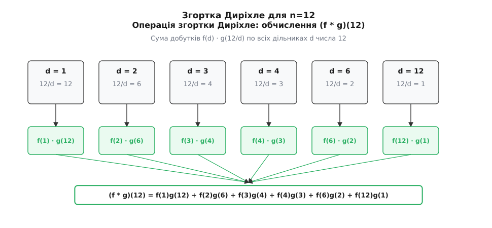
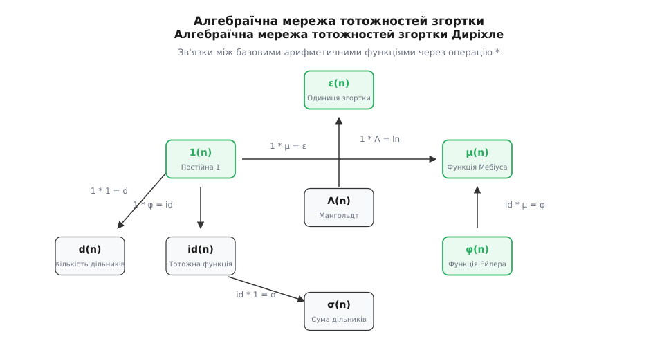
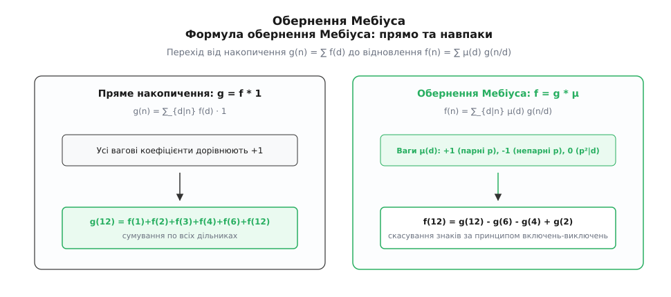

# Арифметичні функції

<preknowlist>
- [Подільність і прості числа](root:math-number-theory/prime-numbers) — фундаментальна теорема арифметики, розклад цілого числа на прості множники.
- [НСД та алгоритм Евкліда](root:math-number-theory/gcd-euclidean) — найбільший спільний дільник і співвідношення взаємної простоти (НСД = 1).
- [Функція Ейлера](root:math-number-theory/euler-totient) — кількість взаємно простих чисел, не більших за n, та її мультиплікативність.
- [Модульна арифметика](root:math-number-theory/modular-arithmetic) — порівняння за модулем та класи лишків.
- [Китайська теорема про залишки](root:math-number-theory/chinese-remainder-theorem) — розклад арифметичних структур за взаємно простими модулями.
</preknowlist>

Якщо обчислити значення [функції Ейлера](root:math-number-theory/euler-totient) `φ(d)` для кожного дільника `d` числа `12` та просумувати їх, виникає несподівана закономірність. Дільниками числа `12` є числа `1, 2, 3, 4, 6, 12`. Відповідні значення `φ(d)` дорівнюють `φ(1) = 1`, `φ(2) = 1`, `φ(3) = 2`, `φ(4) = 2`, `φ(6) = 2` та `φ(12) = 4`. Додавши їх разом, отримуємо `1 + 1 + 2 + 2 + 2 + 4 = 12` — точне значення самого вихідного числа. Візьмемо інше число, наприклад `30`. Його дільники — `1, 2, 3, 5, 6, 10, 15, 30`, а значення `φ(d)` дорівнюють `1, 1, 2, 4, 2, 4, 4, 8`. Рівність знову справджується бездоганно: `1 + 1 + 2 + 4 + 2 + 4 + 4 + 8 = 30`.

Цей збіг не є випадковістю. Розглянемо всі `12` звичайних дробів із знаменником `12`: `1/12, 2/12, 3/12, 4/12, 5/12, 6/12, 7/12, 8/12, 9/12, 10/12, 11/12, 12/12`. Скоротимо кожен із них до нескоротного вигляду `k/d`:
- Дріб `1/12` вже нескоротний (знаменник `12`).
- Дріб `2/12` скорочується до `1/6` (знаменник `6`).
- Дріб `3/12` скорочується до `1/4` (знаменник `4`).
- Дріб `4/12` скорочується до `1/3` (знаменник `3`).
- Дріб `5/12` вже нескоротний (знаменник `12`).
- Дріб `6/12` скорочується до `1/2` (знаменник `2`).
- Дріб `7/12` вже нескоротний (знаменник `12`).
- Дріб `8/12` скорочується до `2/3` (знаменник `3`).
- Дріб `9/12` скорочується до `3/4` (знаменник `4`).
- Дріб `10/12` скорочується до `5/6` (знаменник `6`).
- Дріб `11/12` вже нескоротний (знаменник `12`).
- Дріб `12/12` скорочується до `1/1` (знаменник `1`).

Згрупуємо отримані нескоротні дроби за їхніми знаменниками `d`:
- Знаменник `d = 1`: дріб `1/1` (усього `1` дріб, що дорівнює `φ(1) = 1`).
- Знаменник `d = 2`: дріб `1/2` (усього `1` дріб, що дорівнює `φ(2) = 1`).
- Знаменник `d = 3`: дроби `1/3, 2/3` (усього `2` дроби, що дорівнює `φ(3) = 2`).
- Знаменник `d = 4`: дроби `1/4, 3/4` (усього `2` дроби, що дорівнює `φ(4) = 2`).
- Знаменник `d = 6`: дроби `1/6, 5/6` (усього `2` дроби, що дорівнює `φ(6) = 2`).
- Знаменник `d = 12`: дроби `1/12, 5/12, 7/12, 11/12` (усього `4` дроби, що дорівнює `φ(12) = 4`).

Оскільки кожен початковий дріб після скорочення потрапляє у клясу з певним знаменником `d`, який обов'язково ділить `12`, а чисельник `k` є числом від `1` до `d` і взаємно простим із `d`, кількість дробів зі знаменником `d` за означенням дорівнює `φ(d)`. Підсумовування `φ(d)` по всіх дільниках `d` розбиває множину з `n` початкових дробів на неперетинні класи, що й доводить загальну тотожність `∑_{d|n} φ(d) = n` для будь-якого натурального числа.

Описаний приклад показує фундаментальний факт теорії чисел: функції, визначені на множині цілих чисел, живуть не як окремі розрізнені алгоритми. Вони пов'язані між собою через решітку дільників цілісною алгебраїчною системою.

Математично **арифметичною функцією** називається будь-яке відображення `f: ℤ⁺ → ℂ`, яке зіставляє кожному додатному цілому числу `n ∈ {1, 2, 3, ...}` певне комплексне (або дійсне) число `f(n)`. Множина всіх арифметичних функцій утворює векторний простір над полем комплексних чисел, а також комутативне кільце відносно операцій додавання та згортки.

## Мультиплікативність: як розклад на прості керує функцією

Загальні арифметичні функції можуть мати довільні значення на кожному цілому числі. Проте фундаментальна теорема арифметики стверджує, що кожне натуральне число `n > 1` однозначно розкладається у добуток простих множників з відповідними показниками степенів:

```
n = p₁^{k₁} · p₂^{k₂} · … · p_r^{k_r}
```

Ця фундаментальна факторизаційна симетрія дозволяє розбити всю множину арифметичних функцій на два виключно важливих класи за їхньою поведінкою відносно добутку аргументів.

**Мультиплікативна функція** — це арифметична функція `f`, яка не дорівнює тотожно нулю та задовольняє умову `f(a · b) = f(a) · f(b)` для всіх таких пар натуральних чисел `a` та `b`, які є взаємно простими, тобто `gcd(a, b) = 1`.

**Абсолютно (повністю) мультиплікативна функція** — це арифметична функція `f`, для якої співвідношення `f(a · b) = f(a) · f(b)` виконується для **будь-яких** натуральних чисел `a` та `b`, незалежно від того, чи мають вони спільні прості множники.

Крім того, у теорії чисел велику роль відіграють **адитивні функції**, які перетворюють добуток аргументів на суму значень: `f(a · b) = f(a) + f(b)` при `gcd(a, b) = 1`. Прикладом адитивної функції є `ω(n)` — кількість різних простих множників числа `n`. Якщо ж умова `f(a · b) = f(a) + f(b)` виконується для всіх `a` та `b`, функція називається абсолютно адитивною (прикладом є `Ω(n)` — загальна кількість простих множників із урахуванням їхніх кратностей, а також логарифм `ln n`).

З означення мультиплікативності негайно випливає важлива властивість значення функції в одиниці. Для будь-якої ненульової мультиплікативної функції `f` маємо:

```
f(1) = f(1 · 1)
= f(1) · f(1)                    [за мультиплікативністю при gcd(1,1)=1]
```

Звідси `f(1) · (f(1) - 1) = 0`. Оскільки функція не є тотожною нулю, існує таке число `m`, що `f(m) ≠ 0`. Записавши `f(m) = f(m · 1) = f(m) · f(1)`, після скорочення на `f(m) ≠ 0` переконуємося, що для будь-якої ненульової мультиплікативної функції завжди **`f(1) = 1`**.

Головна практична перевага мультиплікативних функцій полягає у тому, що для обчислення `f(n)` на довільному великому числі `n` не потрібно аналізувати число в цілому. Достатньо розкласти `n` на прості множники й застосувати формулу обчислення функції на окремих простих степенях `f(p^k)`:

```
f(n) = f(p₁^{k₁}) · f(p₂^{k₂}) · … · f(p_r^{k_r})
```

Розглянемо три класичні арифметичні функції та обчислимо їхні значення для числа `n = 360 = 2³ · 3² · 5¹`:

1. **Кількість дільників `d(n)`** (або `τ(n)`). Для кожного простого степеня `p^k` дільниками є `1, p, p², ..., p^k`, усього `k + 1` дільник. Отже `d(p^k) = k + 1`.
   ```
   d(360) = d(2³) · d(3²) · d(5¹)                      [мультиплікативність d]
   = (3 + 1) · (2 + 1) · (1 + 1)                        [підстановка формули k_i + 1]
   = 4 · 3 · 2 = 24                                    [перемноження множників]
   ```

2. **Сума дільників `σ(n)`**. Сума степенів простого `p` утворює геометричну прогресію `σ(p^k) = 1 + p + p² + ... + p^k = (p^{k+1} - 1)/(p - 1)`.
   ```
   σ(360) = σ(2³) · σ(3²) · σ(5¹)                      [мультиплікативність σ]
   = ( (2⁴ - 1)/(2 - 1) ) · ( (3³ - 1)/(3 - 1) ) · ( (5² - 1)/(5 - 1) ) [сума геометричної прогресії]
   = 15 · 13 · 6 = 1170                                [підсумкове множення]
   ```

3. **Функція Ейлера `φ(n)`**. На простому степені взаємно простими з `p^k` є всі числа, окрім тих, що діляться на `p` (їх рівно `p^{k-1}`). Отже `φ(p^k) = p^k - p^{k-1} = p^{k-1}(p - 1)`.
   ```
   φ(360) = φ(2³) · φ(3²) · φ(5¹)                      [мультиплікативність φ]
   = (2² · 1) · (3¹ · 2) · (5⁰ · 4)                    [формула φ(p^k) = p^{k-1}(p - 1)]
   = 4 · 6 · 4 = 96                                    [підсумкове множення]
   ```

## Згортка Діріхле: операція, яка робить із функцій групу

Якщо ми маємо дві арифметичні функції `f` та `g`, виникає питання: як побудувати їхній природний алгебраїчний добуток по решітці дільників?

Звичайне точкове множення `(f · g)(n) = f(n) · g(n)` не враховує арифметичної структури подільності цілих чисел. Справжнім внутрішнім множенням для числових функцій є операція згортки.

**Згорткою Діріхле** (або добутком Діріхле) двох арифметичних функцій `f` та `g` називається нова арифметична функція `f * g`, значення якої в точці `n` дорівнює сумі добутків `f(a) · g(b)` по всіх парах натуральних чисел `(a, b)`, добуток яких дорівнює `n`:

```
(f * g)(n) = ∑_{d|n} f(d) g(n/d) = ∑_{a·b = n} f(a) g(b)
```

Обчислимо для наочності значення згортки двох функцій `f = 1` (постійна одиниця `1(n) = 1`) та `g = μ` (функція Мебіуса) для числа `n = 12`. Дільниками числа `12` є такі 6 пар чисел `(d, 12/d)`: `(1, 12)`, `(2, 6)`, `(3, 4)`, `(4, 3)`, `(6, 2)` та `(12, 1)`.

```
(1 * μ)(12)
= 1(1)μ(12) + 1(2)μ(6) + 1(3)μ(4) + 1(4)μ(3) + 1(6)μ(2) + 1(12)μ(1) [розгортка за всіма дільниками 12]
= 1·(0) + 1·(1) + 1·(0) + 1·(-1) + 1·(-1) + 1·(1)                   [підстановка значень μ]
= 0 + 1 + 0 - 1 - 1 + 1                                             [спрощення доданків]
= 0                                                                 [підсумкова сума]
```


*Схема обчислення згортки (f * g)(12): кожна пара дільників (d, 12/d) дає свій внесок у підсумкову суму центрального вузла.*

Операція згортки Діріхле має фундаментальні алгебраїчні властивості, які роблять множину арифметичних функцій комутативним кільцем:

- **Комутативність:** `f * g = g * f`.
- **Асоціативність:** `(f * g) * h = f * (g * h)`.
- **Дистрибутивність відносно додавання:** `f * (g + h) = f * g + f * h`.
- **Нейтральний (одиничний) елемент `ε(n)`:** функція, що дорівнює `ε(1) = 1` та `ε(n) = 0` при `n > 1`. Для будь-якої арифметичної функції виконується рівність `f * ε = f`.

Функція `f` має обернену відносно згортки функцію `f⁻¹` (таку, що `f * f⁻¹ = ε`) тоді й лише тоді, коли `f(1) ≠ 0`. Оскільки для будь-якої ненульової мультиплікативної функції `f(1) = 1 ≠ 0`, кожна мультиплікативна функція є оборотною відносно згортки Діріхле.

Крім того, мультиплікативні функції є зачиненими відносно згортки: якщо `f` та `g` є мультиплікативними, то їхня згортка `f * g` також є мультиплікативною функцією. Повний розбір [історії виникнення згортки та внеску Діріхле](root:math-number-theory/arithmetic-functions/hist-dirichlet-convolution.md) та строге [математичне виведення алгебраїчних властивостей та групи згортки](root:math-number-theory/arithmetic-functions/math-dirichlet-algebra.md) винесені в окремі матеріали.

## Функція Мебіуса та формула обернення

Якщо розглянути постійну арифметичну функцію `1(n) = 1` для всіх `n ≥ 1`, природно запитати: яка функція є для неї оберненою відносно згортки, тобто задовольняє рівняння `1 * μ = ε`?

Шляхом послідовного індуктивного розв'язання рівняння `(1 * μ)(n) = ε(n)` знаходяться значення функції `μ(n)` на простих степенях:

```
(1 * μ)(1) = 1  ⇒  1 · μ(1) = 1  ⇒  μ(1) = 1
(1 * μ)(p) = 0  ⇒  μ(1) + μ(p) = 0  ⇒  μ(p) = -1
(1 * μ)(p²) = 0 ⇒  μ(1) + μ(p) + μ(p²) = 0  ⇒  1 - 1 + μ(p²) = 0  ⇒  μ(p²) = 0
```

Це дає точне означення класичної **функції Мебіуса `μ(n)`**:
- `μ(1) = 1`;
- `μ(n) = (-1)^r`, якщо число `n` вільне від квадратів і розкладається у добуток `r` різних простих чисел;
- `μ(n) = 0`, якщо `n` ділиться на квадрат будь-якого простого числа (`p² | n`).

Функція Мебіуса виступає комбінаторним ваговим коефіцієнтом для принципу включень-виключень на решітці дільників. Завдяки існуванню оберненого елемента `μ = 1⁻¹` виконується знаменита **теорема про обернення Мебіуса**:

```
g(n) = ∑_{d|n} f(d)   ⇔   f(n) = ∑_{d|n} μ(d) g(n/d)
```

В алгебраїчних позначеннях це доводиться в один рядок: якщо `g = f * 1`, то множення обох частин на `μ` дає `g * μ = (f * 1) * μ = f * (1 * μ) = f * ε = f`.

Застосуємо обернення Мебіуса до тотожності Ейлера `∑_{d|n} φ(d) = n`, яку ми розглядали на початку. У позначеннях згортки вона має вигляд `φ * 1 = id`. Помноживши обидві частини рівності на `μ`, отримуємо алгебраїчне виведення для функції тотієнта:

```
φ = id * μ
φ(n) = ∑_{d|n} μ(d) · (n / d) = n · ∑_{d|n} (μ(d) / d) = n · ∏_{p|n} (1 - 1/p)
```


*Мережа тотожностей згортки Диріхле: множення на постійну функцію 1(n) здійснює накопичення дільників, а згортка з функцією Мебіуса μ(n) відновлює початкову функцію.*


*Пряме накопичення сумує значення по всіх дільниках із вагами +1, тоді як обернення Мебіуса відновлює початкові значення через вагові коефіцієнти μ(d).*

Детальні тотожності та формули для інших класичних функцій зібрано в [довіднику стандартних арифметичних функцій та тотожностей згортки](root:math-number-theory/arithmetic-functions/api-common-functions.md).

## Генеруючі ряди Діріхле: місток між арифметикою та аналізом

Найпотужнішим зв'язковим містком між дискретною теорією чисел та неперервним комплексним аналізом є **ряди Діріхле**. Для будь-якої арифметичної функції `f(n)` її рядом Діріхле називається функціональний ряд від комплексної змінної `s`:

```
L(f, s) = ∑_{n=1}^∞ f(n) / n^s
```

Фундаментальне відкриття Діріхле полягає в тому, що звичайне множення двох рядів Діріхле точно відповідає згортці їхніх коефіцієнтів:

```
L(f, s) · L(g, s)
= ( ∑_{n=1}^∞ f(n) / n^s ) · ( ∑_{m=1}^∞ g(m) / m^s )   [підстановка рядів Діріхле]
= ∑_{n=1}^∞ ∑_{m=1}^∞ f(n) g(m) / (n · m)^s            [перемноження двох сум]
= ∑_{k=1}^∞ ( ∑_{d|k} f(d) g(k/d) ) / k^s               [групування коефіцієнтів при k = n·m]
= L(f * g, s)                                            [означення згортки (f * g)]
```

Це дозволяє перетворювати арифметичні співвідношення на тотожності між відомими аналітичними функціями:

- Дзета-функція Рімана: `L(1, s) = ∑_{n=1}^∞ 1 / n^s = ζ(s)`.
- Для функції Мебіуса: `L(μ, s) = 1 / ζ(s)`, бо `1 * μ = ε ⇒ ζ(s) · L(μ, s) = 1`.
- Для кількості дільників `d = 1 * 1`: `L(d, s) = ζ(s)²`.
- Для суми дільників `σ = id * 1`: `L(σ, s) = ζ(s) ζ(s - 1)`.
- Для функції Ейлера `φ = id * μ`: `L(φ, s) = ζ(s - 1) / ζ(s)`.

Крім того, для будь-якої мультиплікативної функції ряд Діріхле розкладається у нескінченний **добуток Ейлера**:

```
L(f, s) = ∏_p ( 1 + f(p)/p^s + f(p²)/p^{2s} + f(p³)/p^{3s} + … )
```

А для абсолютно мультиплікативної функції цей добуток набуває компактної форми `L(f, s) = ∏_p (1 - f(p)/p^s)⁻¹`. Детальніше аналітичні властивості рядів розкрито у матеріалі про [L-функції Діріхле](root:math-number-theory/dirichlet-l-functions) та [формулу добутку Ейлера](root:math-number-theory/euler-product-formula).

## Середній порядок зростання та асимптотичний аналіз

Значення багатьох арифметичних функцій здійснюють хаотичні коливання від одного цілого числа до сусіднього. Наприклад, кількість дільників `d(p) = 2` для будь-якого простого числа, проте на степенях двійки `d(2^k) = k + 1` зростає логарифмічно, а для високоскладених чисел зростає ще швидше. Для аналізу глобальної поведінки таких функцій використовують **середній порядок зростання** — асимптотичну поведінку префіксних сум:

```
S_f(x) = ∑_{n ≤ x} f(n)
```

Для оцінки суми кількості дільників `∑_{n ≤ x} d(n)` використовують **метод гіперболи Діріхле**. Задача підрахунку `d(n)` зводиться до підрахунку кількості цілочисельних точок `(a, b)` у першій чверті координатної площини під гіперболою `a · b ≤ x`.

Розбиваючи область під гіперболою на дві симетричні частини відносно лінії `a = √x` та квадрат розміром `√x × √x`, отримуємо асимптотичну формулу Діріхле:

```
∑_{n ≤ x} d(n) = x ln x + (2γ - 1) x + O(√x)
```

де `γ ≈ 0.577215` — стала Ейлера-Маскероні. Це означає, що в середньому число `n` має приблизно `ln n` дільників.

Для функції Ейлера асимптотичний середній порядок суми дорівнює:

```
∑_{n ≤ x} φ(n) = (3 / π²) · x² + O(x ln x)
```

Звідси випливає важливий ймовірнісний висновок: ймовірність того, що два випадково вибрані цілі числа є взаємно простими, дорівнює `6 / π² ≈ 60.79%`.

## Практична обчислювальна складність та алгоритми

При алгоритмічній реалізації на комп'ютері обчислення значень арифметичних функцій виконують спеціалізованими решетами.

Для обчислення значень мультиплікативної функції на діапазоні `1 ≤ n ≤ N` використовують **лінійне решето**, яке працює за час `O(N)` та пам'ять `O(N)`, гарантуючи, що кожне складене число відвідується рівно один раз через свій найменший простий множник.

Якщо ж потрібно обчислити лише префіксну суму `S_f(X) = ∑_{n ≤ X} f(n)` для величезних `X ≤ 10¹¹`, застосовують сублінійний **алгоритм Дю (Du Sieve)**, який обчислює підсумкову суму за час `O(X^(2/3))` без створення масиву в пам'яті. Детальний [практичний алгоритм обчислення згортки та префіксних сум](root:math-number-theory/arithmetic-functions/proj-fast-convolution.md) із робочим кодом винесено в окремий практичний модуль.

> 🔧 **Навіщо це в реальній розробці та криптографії.**
> Арифметичні функції та згортка Діріхле є фундаментом сучасної криптографії з відкритим ключем. У криптосистемі RSA та алгоритмах на еліптичних кривих (ECC) для генерації ключів та вибору модулів обчислюється функція Ейлера `φ(N) = (p-1)(q-1)` та [функція Кармайкла](root:math-number-theory/carmichael-function) `λ(N)`, які визначають період мультиплікативної групи. В алгоритмічному аналізі та комбінаториці обернення Мебіуса використовується для розв'язання задач включень-виключень, обчислення хроматичних многочленів графів та генерації комбінаторних об'єктів без повторів.
