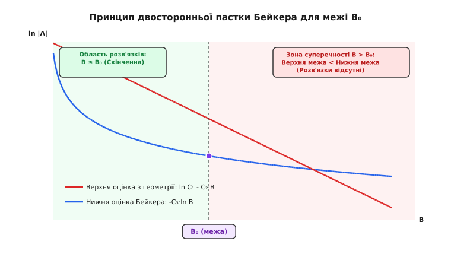
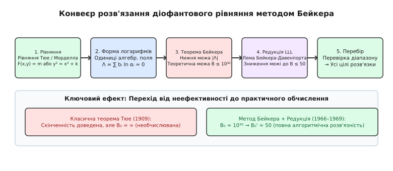

# Метод логарифмічних форм Бейкера

<preknowlist>
- [Діофантові рівняння](root:math-number-theory/diophantine-equations) — рівняння у цілих числах та класифікація їхніх розв'язків.
- [Ланцюгові дроби](root:math-number-theory/continued-fractions) — найкращі раціональні наближення дійсних та алгебраїчних чисел.
- [Ірраціональні числа](root:math-number-theory/irrational-numbers) — міра ірраціональності, алгебраїчні та трансцендентні числа.
</preknowlist>

Для багатьох класичних діофантових рівнянь — таких як рівняння Тюе `F(x, y) = m` ступеня 3 чи вище або рівняння Морделла `y² = x³ + k` — теореми Акселя Тюе (1909) та Карла Зігеля (1929) довели скінченність кількості цілих розв'язків. Однак ці доведення виявилися принципово **неефективними**: вони гарантують, що розв'язків скінченна кількість, але не дають жодної верхньої межі для їхнього значення. Максимальний розв'язок `x` може дорівнювати 10, а може — `10^(10^100)`, і класичні методи аналітичної теорії чисел не дозволяли відрізнити ці випадки чи розпочати скінченний перебір на комп'ютері. Жоден алгоритм у світі не може перевірити нескінченний діапазон, якщо немає обчислюваної межі `X₀`, вище якої розв'язків гарантовано немає.

Метод логарифмічних форм Бейкера, відкритий Аланом Бейкером у 1966 році, зламав цю стіну неефективності. Він надав точні нижні оцінки для абсолютного значення лінійних комбінацій логарифмів алгебраїчних чисел вигляду:

```
Λ = b₁ ln α₁ + b₂ ln α₂ + ... + bₙ ln αₙ
```

де `αᵢ` — алгебраїчні числа, а `bᵢ` — цілі коефіцієнти. Якщо така форма не дорівнює нулю точно, вона не може бути довільно близькою до нуля: існує чітка, явно обчислювана нижня межа `|Λ| > exp(-C · ln B)`, де `B = max |bᵢ|`. Ця нижня оцінка, поєднана з верхніми оцінками, що випливають зі структури самого рівняння, утворює двосторонню пастку, яка дає скінченну, обчислювану межу `B₀` для коефіцієнтів і самих змінних.

## Стіна неефективності в діофантовому аналізі

Щоб зрозуміти масштаби революції Бейкера, необхідно осягнути, чому класична теорія діофантових рівнянь першої половини XX століття опинилася в глухому куті.

У 1909 році норвезький математик Аксель Тюе довів, що однорідне рівняння `F(x, y) = m` ступеня `n ≥ 3` має лише скінченне число цілих розв'язків. Доведення спиралося на факт, що якщо розв'язок `(x, y)` існує і є дуже великим, то раціональний дріб `x / y` надзвичайно добре наближає корінь `α` многочлена `F(t, 1) = 0`:

```
|α - p/q| < C / qⁿ
```

Тюе довів, що для алгебраїчного числа `α` ступеня `n` неможливо побудувати нескінченно багато раціональних наближень `p / q`, які були б кращими за `q^(n/2 + 1 + ε)`. Потім Карл Зігель у 1921 році покращив цей показник до `2 √(n)`, Фрімен Дайсон та Олександр Ґельфонд у 1947 році — до ще менших величин, а у 1955 році Клаус Рот (Klaus Roth) довів остаточну фундаментальну теорему: для будь-якого алгебраїчного ірраціонального числа `α` та будь-якого `ε > 0` нерівність має лише скінченну кількість розв'язків у цілих числах `p, q`:

```
|α - p/q| < 1 / q²⁺ᵉ
```

За цей триумфальний результат Клаус Рот у 1958 році отримав Філдсівську премію. Проте і доведення Тюе, і доведення Зігеля, і фундаментальне доведення Рота мали спільний критичний недолік: вони спиралися на **принцип суперечності при припущенні існування двох дуже великих розв'язків**.

Схема доведення Рота виглядає так: припустивши існування першого велетенського розв'язку `(p₁, q₁)`, математики будують допоміжний многочлен багатьох змінних `P(X₁, X₂, ..., X_m)` за допомогою леми Зігеля про лінійні системи. Цей многочлен дозволяє довести, що *другого* ще більшого розв'язку `(p₂, q₂)` бути не може, якщо `q₂` перевищує деяку функцію від `q₁`.

Звідси випливав фатальний наслідок: константа `C(α, ε)` у теоремі Рота прямо залежить від значення **першого невідомого розв'язку** `q₁`, існування якого ми намагаємося перевірити. Якщо рівняння взалі не має розв'язків або якщо ми не знаємо найбільшого розв'язку, ми не можемо навіть сформулювати константу! Теорема Рота каже: «якщо існує розв'язок `q₁ > 10¹⁰`, то інших розв'язків немає». Але вона не каже, чи існує цей `q₁`, чи він дорівнює `10¹⁰000`.

Через це класичний аналіз був позбавлений обчислювальної сили. Побачивши рівняння на кшталт `x³ - 2 y³ = 1`, математики знали, що розв'язків скінченно, але не мали жодного способу дізнатися, чи вичерпуються вони відомим розв me `(1, 0)`.

[Історія логарифмічних форм та відкриття Бейкера](root:math-number-theory/baker-method/hist-baker-transcendence.md)

## Висоти алгебраїчних чисел та їх роль

Для математичного формулювання оцінок Бейкера необхідна строга міра арифметичної складності алгебраїчних чисел, яка називається **висотою**.

Нехай `α` — алгебраїчне число ступеня `d` над `ℚ`, а `P(x) = a_d x^d + a_{d-1} x^{d-1} + ... + a_0` — його мінімальний непривідний многочлен у `ℤ[x]` з взаємно простими коефіцієнтами.

1. **Наївна висота (Naive Height)** `H(α)` — це максимум абсолютних значений коефіцієнтів його мінімального многочлена:

```
H(α) = max( |a_d|, |a_{d-1}|, ..., |a_0| )
```

2. **Міра Малера (Mahler Measure)** `M(α)` обчислюється через корені `α = α₁, α₂, ..., α_d` у `ℂ`:

```
M(α) = |a_d| · ∏ max(1, |αᵢ|)
```

3. **Абсолютна логарифмічна висота Вейля (Absolute Logarithmic Weil Height)** `h(α)` визначається як:

```
h(α) = (1 / d) · ln M(α)
```

Логарифмічна висота має фундаментальні алгебраїчні властивості:
- `h(α · β) ≤ h(α) + h(β)`
- `h(α + β) ≤ h(α) + h(β) + ln 2`
- `h(αᵏ) = |k| · h(α)`

Висота прямо вимірює арифметичну розмірність чисел: що складнішим є алгебраїчне число (більший знаменник або ступінь), то більшою є його висота. У теоремі Бейкера висоти `Aᵢ = max(d · h(αᵢ), |ln αᵢ|, 1)` відіграють роль масштабуючих множників.

## Концепція логарифмічних форм

Ключем до подолання неефективності став перехід від раціональних наближень у дійсній області до аналізу логарифмів алгебраїчних чисел у комплексній області.

У 1934 році Олексій Ґельфонд та Теодор Шнайдер розв'язали сьому проблему Гільберта, довівши, що для алгебраїчних чисел `α₁ ≠ 0, 1` та алгебраїчного ірраціонального `β` число `α₁^β` є трансцендентним. У логарифмічній формі це означає:

```
b₁ ln α₁ + b₂ ln α₂ ≠ 0
[для лінійно незалежних над ℚ логарифмів ln α₁, ln α₂]
```

Один лише факт трансцендентності не вирішував діофантових рівнянь. Справжній прорив вимагав відповіді на кількісне питання: **наскільки близько до нуля може підійти ця комбінація?** 

Ґельфонд у 1935 році довів, що для двох логарифмів існує нижня межа:

```
|b₁ ln α₁ + b₂ ln α₂| > exp( -C · ln B )
```

де `B = max(|b₁|, |b₂|)`, а `C` — явна, ефективно обчислювана константа, що залежить лише від висот та ступенів алгебраїчних чисел `α₁` та `α₂`.

Однак абсолютна більшість діофантових проблем (рівняння Тюе ступеня `n ≥ 3`, рівняння Морделла, рівняння Каталана) при розкладі на алгебраїчні одиниці вимагають роботи з **трьома і більше логарифмами** (`n ≥ 3`). Протягом трьох десятиліть спроби поширити оцінку Ґельфонда на `n` логарифмів зазнавали невдачі через відсутність аналітичних методів оцінки нулів багатовимірних функцій.

У 1966 році Алан Бейкер сформулював та довів фундаментальну теорему про нижню межу для `n` логарифмів.

### Теорема Бейкера (1966)

Нехай `α₁, α₂, ..., αₙ` — ненульові алгебраїчні числа, а `b₁, b₂, ..., bₙ` — цілі числа. Розглянемо лінійну форму:

```
Λ = b₁ ln α₁ + b₂ ln α₂ + ... + bₙ ln αₙ
```

Якщо `ln α₁, ..., ln αₙ` є лінійно незалежними над раціональними числами `ℚ` і не всі `bᵢ` дорівнюють нулю, то `Λ ≠ 0`, і виконується строга нерівність:

```
|Λ| > exp( -C · ln A₁ · ln A₂ ... ln Aₙ · ln B )
```

де:
- `d = [ℚ(α₁, ..., αₙ) : ℚ]` — ступінь алгебраїчного розширення поля;
- `Aᵢ ≥ max(h(αᵢ), e)` — абсолютні логарифмічні висоти алгебраїчних чисел `αᵢ`;
- `B = max( |b₁|, |b₂|, ..., |bₙ| )` — максимальний модуль цілих коефіцієнтів;
- `C = (16 n d)^(200 n)` — **абсолютно ефективна константа**, яка обчислюється заздалегідь і не залежить від невідомих коефіцієнтів `bᵢ`.

Сучасні модифікації цієї теореми (зокрема оцінка Матвєєва 2000 року) зменшили константу `C` до значення порядку `1.4 · 30ⁿ⁺¹ · n³·⁵ · d²`, що робить теоретичні межі значно компактнішими.

### Ідея аналітичного доведення Бейкера

Доведення теореми Бейкера спирається на побудову багатовимірної допоміжної цілої функції `Φ(z₁, z₂, ..., zₙ₋₁)` вигляду:

```
Φ(z₁, ..., zₙ₋₁) = ∑ C_{m₁,...,mₙ} · z₁ᵐ¹ ... zₙ₋₁ᵐⁿ⁻¹ · α₁^(γ₁ z₁) ... αₙ^(γₙ zₙ)
```

За допомогою алгебраїчної леми Зігеля про лінійні системи коефіцієнти `C_{m₁,...,mₙ} ∈ ℤ` підбираються так, щоб функція `Φ` та її часткові похідні високих порядків обнулялися у цілому кубі точок `(l₁, l₂, ..., lₙ₋₁)`.

Потім за допомогою теореми про контурні інтеграли Коші та максимальний модуль аналітичних функцій доводиться, що якщо форма `Λ` була б занадто малою, то похідні функції `Φ` мусили б обнулятися на набагато більшій решітці точок. Індуктивне розширення цієї сітки нулів врешті-решт призводить до того, що всі коефіцієнти `C_{m₁,...,mₙ}` мусять дорівнювати нулю, що суперечить їхній початковій побудові. Ця аналітична суперечність і гарантує існування нижньої межі для `|Λ|`.

## Механізм двосторонньої пастки

Центральною ідеєю методу Бейкера є створення алгебраїчно-аналітичної суперечності між двома протилежними оцінками однієї й тієї ж величини `|Λ|`.


*Перетин нижньої логарифмічної оцінки Бейкера з верхньою геометричною оцінкою рівняння створює скінченну обчислювану межу.*

Процес побудови двосторонньої пастки складається з чотирьох послідовних кроків:

1. **Верхня геометрична оцінка з рівняння**: Припускаємо, що існує дуже великий розв'язок діофантового рівняння з висотою `B = max |bᵢ|`. Завдяки алгебраїчній структурі рівняння (наприклад, через наближення до одиниць поля або розклад Тейлора), лінійна форма логарифмів `Λ` виявляється експоненціально малою:

```
|Λ| ≤ C₁ · exp( -C₂ · B )
```

Прологарифмувавши це співвідношення, отримуємо верхню межу для `ln |Λ|`:

```
ln |Λ| ≤ ln C₁ - C₂ · B
```

Ця функція є **лінійно спадною** відносно `B`.

2. **Нижня аналітична оцінка за теоремою Бейкера**: Незалежно від самого рівняння, чисто з властивостей алгебраїчних чисел за теоремою Бейкера маємо нижню межу:

```
|Λ| > exp( -C₃ · ln B )
```

Прологарифмувавши це співвідношення, отримуємо нижню межу для `ln |Λ|`:

```
ln |Λ| > -C₃ · ln B
```

Ця функція є **логарифмічно спадною** відносно `B`.

3. **Зіставлення протилежностей**: Оскільки обидві нерівності мають виконуватися одночасно для справжнього розв'язку `B`, об'єднуємо їх у подвійну нерівність:

```
-C₃ · ln B < ln |Λ| ≤ ln C₁ - C₂ · B
```

Звідси випливає фундаментальна нерівність щодо змінної `B`:

```
C₂ · B - C₃ · ln B < ln C₁
```

4. **Незмінність лінійного зростання над логарифмічним**: Лінійна функція `C₂ · B` зростає зі збільшенням `B` незрівнянно швидше, ніж логарифмічна функція `C₃ · ln B`. Для малих `B` ця нерівність може виконуватися. Але як тільки `B` перевищує критичне значення `B₀`, доданок `C₂ · B` повністю переважає `C₃ · ln B + ln C₁`, і нерівність перетворюється на математичну суперечність.

Отже, будь-який цілий розв'язок `B` **зобов'язаний задовольняти строгу верхню межу**:

```
B ≤ B₀
```

Оскільки `B₀` обчислюється виключно через коефіцієнти початкового рівняння та ефективну константу Бейкера, нескінченний простір пошуку миттєво стискається до скінченного куба `[-B₀, B₀]ⁿ`.

[Математичне виведення межі розв'язків для рівняння Тюе](root:math-number-theory/baker-method/math-thue-equation-bound.md)

## Застосування до класичних діофантових проблем

Метод логарифмічних форм Бейкера дозволив розв'язати цілу низку діофантових проблем, які залишалися неприступними протягом десятиліть і століть.

### 1. Повна алгоритмічна розв'язність рівняння Тюе

Для будь-якого однорідного рівняння `F(x, y) = m` ступеня `n ≥ 3` метод Бейкера надає обчислювану константу `X₀`, таку що:

```
|x|, |y| ≤ X₀ = exp( (16 n d)^(200 n) · H(F)ⁿ )
```

Це означає, що рівняння Тюе тепер можна повністю розв'язати за скінченне число кроків.

### 2. Рівняння Еліпса та Морделла

Рівняння Морделла `y² = x³ + k` (де `k ∈ ℤ, k ≠ 0`) описує цілі точки на еліптичних кривих. За теоремою Зігеля 1929 року кількість таких точок завжди скінченна. Метод Бейкера вперше надав явну верхню межу для їхніх координат:

```
|x|, |y| < exp( 10¹⁰ · |k|⁶ )
```

Зведення рівняння Морделла до логарифмів виконується через **еліптичні логарифми**: точка `P(x,y)` на кривій `E` подається як комплексний інтеграл `z = ∫ dx / (2 y)`, де `z = m₁ ω₁ + m₂ ω₂ + z₀` підпорядковується оцінкам логарифмічних форм на еліптичних кривих.

### 3. Гіпотеза Каталана та теорема Тійдемана

У 1844 році Ежен Шарль Каталан висловив гіпотезу, що єдиним розв'язком рівняння `xᵖ - yʳ = 1` у натуральних числах `x, y, p, r > 1` є `3² - 2³ = 1`.

Класичні методи не могли обмежити показники степенів `p` та `r`. У 1976 році Роберт Тійдеман (Robert Tijdeman), застосувавши метод Бейкера до лінійних форм з чотирьох логарифмів, довів, що показники `p` та `r` обмежені ефективною константою:

```
p, r < 10¹¹
```

Це перетворило гіпотезу Каталана на скінченну обчислювальну проблему, що дозволило Премі Міхайлеску (Preda Mihăilescu) у 2002 році остаточно довести її за допомогою алгебраїчних полів ділення круга.

### 4. S-одиничні рівняння та найбільший простий дільник

S-одиничним рівнянням називається рівняння вигляду `u + v = 1`, де `u, v` належать до групи S-одиниць числового поля `K` (тобто мають прості дільники лише з фіксованої скінченної множини `S`). Метод p-адичних логарифмів Юя Куньжуя дозволив ефективно знайти всі розв'язки S-одиничних рівнянь.

Крім того, для будь-якого багаточлена `P(x)` без кратних коренів найбільший простий дільник `P_max(x)` задовольняє:

```
P_max(x) > C · ln(ln x)
```

Це доводить, що послідовність значень багаточлена не може складатися лише з елементів з малими простими дільниками.

## Проблема «Астрономічних меж» та редукція LLL

Попри фундаментальний теоретичний успіх, первинне застосування теореми Бейкера створило нову обчислювальну перешкоду: **проблему астрономічних меж**.

Оскільки константа Бейкера `C` містить високі степені `(16 n d)^(200 n)`, початкова межа `B₀` для рівняння Тюе або Морделла зазвичай становить `10³⁰`, `10¹⁰⁰` або навіть `10³⁰⁰`. 

Прямий комп'ютерний перебір `10³⁰` варіантів вимагав би більше часу, ніж вік Всесвіту. Метод Бейкера сам по собі давав теоретичну розв'язність, але не практичну.


*Кроки перетворення початкового рівняння через оцінку лінійної форми в логарифмах та редукцію LLL до цілочисельного перебору.*

Рішення цієї проблеми знайшли Алан Бейкер та Гарольд Давенпорт у 1969 році. Вони розробили лему редукції, яка поєднує теоретичну межу Бейкера з апаратом **ланцюгових дробів** (для `n = 2` логарифмів) та **алгоритмом редукції ґрат LLL** (Ленстра — Ленстра — Ловас, для `n ≥ 3` логарифмів).

[Алгоритм редукції Бейкера — Давенпорта](root:math-number-theory/baker-method/proj-baker-reduction.md)

Якщо нерівність `|b₁ θ - b₂ + β| < K · exp(-c · B)` має початкову межу `B ≤ 10³⁰`, ми знаходимо підхідний дріб `p / q` для ірраціонального числа `θ` із знаменником `q ≈ 10³¹`. Оскільки підхідний дріб надзвичайно точний, умова `||q β|| > 0` дозволяє отримати нову межу:

```
B' ≤ ( ln(q · K / ε) ) / c
```

Число `q ≈ 10³¹` під логарифмом дає `ln q ≈ 71.3`. За один-єдиний крок редукції межа скорочується з `10³⁰` до `B' ≤ 45`!

Після цього перебір `45` значень виконується за мікросекунди.

## Межі застосовності та порівняння з теоремою Фалтінгса

Важливо чітко розуміти межі застосовності методу Бейкера:

1. **Рівняння другого ступеня (Рівняння Пелля)**: Для рівняння `x² - D y² = 1` ранг одиниць `r = 1`, але кількість розв'язків нескінченна. Метод Бейкера не застосовується для обмеження кількості розв'язків (оскільки вони утворюють нескінченну групу), але дозволяє оцінити регулятор та відстані між розв'язками.
2. **Рівняння вищих родів (Теорема Фалтінгса)**: У 1983 році Ґерд Фалтінгс довів гіпотезу Морделла: будь-яка алгебраїчна крива роду `g ≥ 2` над `ℚ` має лише скінченну кількість раціональних точок. Проте доведення Фалтінгса є **неефективним** (як і теорема Рота!). Метод Бейкера дає ефективні межі для цілих точок (`ℤ`-точок), але не дає меж для раціональних точок (`ℚ`-точок) на загальних кривих роду `g ≥ 2`. Для раціональних точок зараз розвиваються методи Чабауті — Коулмана та Мінхьона Кіма.

> 🔧 **Навіщо це.**
> Метод логарифмічних форм Бейкера у поєднанні з LLL-редукцією є базовим двигуном сучасних комп'ютерних систем алгебри (PARI/GP, Magma, SageMath). Коли ви викликаєте функцію `thue()` або `thueSolve()` у PARI/GP для розв meння рівняння Тюе 4-го ступеня, програма під капотом обчислює константу Бейкера для логарифмів одиниць відповідного алгебраїчного поля, будує ґратку коефіцієнтів, виконує LLL-редукцію і видає всі цілі розв'язки за декілька мілісекунд. Крім того, ці алгоритми є критично важливими у сучасній криптографії для перевірки відсутності малих цілих точок на зсунутих еліптичних кривих.
