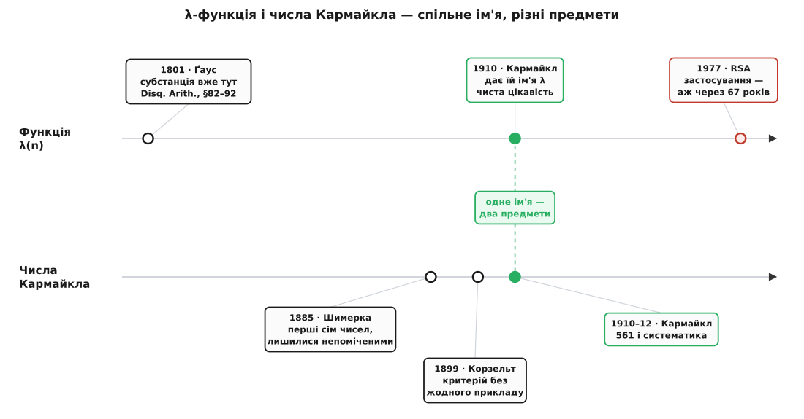

# 📜 Найменше число, що ждало 67 років на роботу

Восени 1909-го молодий американець дописував у Принстоні дисертацію зовсім про інше — про різницеві рівняння — і між ділом зупинився на дрібниці з теорії чисел. [Теорема Ейлера](root:math-number-theory/euler-totient) обіцяє, що a^φ(n) ≡ 1 (mod n) для кожного взаємно простого з n числа; але φ(n) — показник, який просто **годиться**, а зовсім не конче найменший. То який же найменший — той, що заразом повертає до одиниці всі взаємно прості лишки? Кармайкл дав цьому найменшому показникові окрему назву й окрему літеру, λ, і надрукував коротеньку нотатку. Застосування не було й на видноті: стояв 1910 рік, до RSA лишалося шістдесят сім років. Це історія про те, як чисте питання про остачі степенів дістало ім'я, сплуталося з власною тезкою й аж через півжиття знайшло собі поважну роботу.

## Хто такий Роберт Кармайкл

**Роберт Даніель Кармайкл** (*Robert Daniel Carmichael*, 1879–1967) народився 1 березня 1879-го в містечку Ґудвотер, що в штаті Алабама, а помер 2 травня 1967-го в штаті Канзас. Шлях у велику математику він почав з глухого кута американської провінції: закінчив невеликий Ліневільський коледж 1898-го, кілька років учителював і лише 1909-го, вже тридцятирічним, дістав стипендію до Принстона. Науковим керівником у нього став **Джордж Девід Біркгоф** (*George David Birkhoff*) — один із найсильніших американських математиків тієї доби.

Тут варто затямити одну деталь, бо вона задає весь тон історії. Докторат Кармайкл 1911 року захистив **не з теорії чисел**, а про різницеві рівняння — «Linear Difference Equations and their Analytic Solutions»; цю роботу вважають першим по-справжньому вагомим американським внеском у теорію таких рівнянь. Функція λ не була ні темою дисертації, ні частиною якогось прикладного замовлення — вона народилася збоку, з чистого інтересу до того, як поводяться остачі степенів. За ту саму пору, 1910-го, Кармайкл дістав Jacobus Fellowship — найвищу аспірантську відзнаку Принстона; далі викладав в Індіанському університеті (1911–1915), а відтак майже три десятиліття в Іллінойському (1915–1947).

## Нотатка 1910 року

Функція народилася в статті з підкреслено скромною назвою — «Note on a new number theory function», тобто «Нотатка про нову теоретико-числову функцію», надрукованій у Bulletin of the American Mathematical Society (том 16, 1910, с. 232–238); перед самим Американським математичним товариством Кармайкл читав її ще 13 вересня 1909-го. Ці дані звірені за оцифрованим оригіналом і бібліографією AMS.

Що ж він зробив? Узяв відомий зазор між обіцянкою й дійсністю. Ейлерів показник φ(n) завжди повертає взаємно прості лишки до одиниці, та часто-густо тягне задалеко. Кармайкл виокремив **точний** найменший показник, який повертає їх усіх заразом, назвав його «найменшим універсальним показником» і позначив λ. Мовою пізніших підручників його функцію описують як **загострення теореми Ейлера**: там, де Ейлер дає працездатну, але грубу межу, λ дає гостру, яку вже не вкоротити.

> 🔧 **Навіщо це.** Здавалося б, дрібниця — назвати вже відому величину літерою. Але саме тут і полягав крок Кармайкла. Розкидане спостереження «іноді показник можна взяти менший» він перетворив на **об'єкт**: функцію з власним іменем, про яку можна ставити теореми, рахувати її значення, питати, коли вона збігається з φ, а коли ділить n−1. Названа величина — це вже не примітка на полях, а інструмент; чимала частина роботи в математиці — вчасно дати чомусь ім'я.

## Корінь глибший, ніж 1910-й

Тепер — необхідна чесність щодо слова «нова» в назві. Сама субстанція λ була відома **за століття** до Кармайкла. Ще **Карл Фрідріх Ґаус** (*Carl Friedrich Gauss*) у «Disquisitiones Arithmeticae» (1801), у статтях приблизно 82–92, фактично оперував цим найменшим показником і знав ключову річ: для складеного модуля він збирається найменшим спільним кратним таких самих показників за простими степенями,

```
λ(n) = НСК( λ(p₁^k₁), …, λ(p_r^k_r) )
```

— тобто те, що сьогодні звуть формулою Кармайкла, у зародку сиділо вже в Ґауса. Це не змова й не крадіжка: Кармайкл будував усе на класиці й Ейлера не приховував. Але справедливо розрізняти «знати факт» і «зробити з факту названу функцію». Ґаус мав структуру; Кармайкл виокремив із неї самостійний предмет, дав літеру λ і почав вивчати його властивості нарізно — як арифметичну функцію, а не побічний наслідок теорії первісних коренів. Першість тут не спірна, а просто двошарова, і чесно називати обидва шари.

## Два предмети під одним іменем

А тепер про плутанину, яку це ім'я породжує. Ім'я Кармайкла носять **два зовсім різні предмети**, і їх раз у раз змішують. Перший — сама функція λ(n). Другий — **числа Кармайкла**: складені числа, які прикидаються простими, бо проходять [Фермів тест на простоту](root:math-number-theory/fermat-little-theorem) на всіх основах одразу. Найменше з них — 561 = 3·11·17. Обидва предмети Кармайкл вивів майже з того самого місця: у нотатці 1910-го він навів перший приклад такої мімікрії — те саме 561, — а систематичний розбір цих чисел дав окремою статтею 1912 року в American Mathematical Monthly.

Але з першістю на самі числа виходить куди заплутаніша й повчальніша річ — класичний зразок того, як відкриття називають не за першим відкривачем.

Спершу критерій. Ще 1899 року німець **Альвін Корзельт** (*Alwin Korselt*) у нотатці «Problème chinois» точно сформулював умову, за якої складене число обдурює Фермів тест: воно має бути без квадратних множників, і для кожного його простого дільника p різниця p−1 мусить ділити n−1. Формулювання бездоганне — але Корзельт **не навів жодного прикладу**, і сам, схоже, сумнівався, чи такі числа взагалі існують. Приклад — 561 — з'явився щойно за одинадцять років, у Кармайкла; тому й числа, і сам критерій закріпилися за Кармайкловим іменем, дарма що критерій — Корзельтів.

І це ще не дно. За нинішніми історико-математичними дослідженнями (передусім праця Франца Леммермаєра 2013 року) перші сім таких чисел — 561, 1105, 1729, 2465, 2821, 6601, 8911 — виписав чеський математик **Вацлав Шимерка** (*Václav Šimerka*) ще **1885-го**, у статті «Zbytky z arithmetické posloupnosti» («Остачі арифметичної прогресії»). Він випередив і Кармайкла на двадцять сім років, і Корзельта. Робота вийшла чеською, в «Časopis pro pěstování matematiky a fysiky», і залишилася майже непоміченою більш ніж на століття. Числа названо не за тим, хто знайшов їх першим, — цей сюжет навіть має свою назву, «закон Стіґлера»: наукове відкриття рідко зветься іменем свого справжнього першовідкривача.


*Обидві історії проходять крізь Кармайкла близько 1910-го — звідси спільне ім'я на двох різних предметах. Порожні проміжки промовисті: функція λ пролежала століття від Ґауса до Кармайкла й ще шістдесят сім років до першого застосування; числа знали вже від Шимерки, та світ помітив їх аж із прикладом Кармайкла.*

Отже під одним прізвищем — функція, що дає найменший показник **будь-якого** модуля, і рідкісні складені числа, у яких цей показник ділить n−1. Названі на честь однієї людини, але це два різні питання, і Кармайкл тут — не перший відкривач ні того, ні того, а той, хто дав обом ім'я та довів до вжитку. Докладний розбір самих чисел — чому їх нескінченно багато й що вони роблять із перевіркою на простоту — окрема тема, [числа Кармайкла](root:math-number-theory/carmichael-numbers).

## Робота знайшлася через 67 років

Кармайкл увів λ без жодної гадки про застосування — просто тому, що питання «який показник найменший?» саме собою варте відповіді. Так тривало десятиліттями. А 1977 року **Рональд Рівест**, **Аді Шамір** і **Леонард Адлеман** оприлюднили шифр [RSA](root:sf-security/rsa) — і виявилося, що правильний модуль, за яким там треба зводити показник, це саме λ(n), а не Ейлерів φ(n): λ і коротший, і працює без винятків там, де доведення через φ спотикається. Величина, яка 1910-го не мала на видноті жодного вжитку, за шістдесят сім років стала несучою деталлю чи не найпоширенішого у світі шифру з відкритим ключем.

І тут сходяться всі нитки. «Нова функція» була старою — її знав Ґаус. Числа Кармайкла знайшов не Кармайкл — їх виписав Шимерка. Та ім'я закріпилося за тим, хто розрізнив, назвав і зробив із розсипу спостережень предмет, придатний до теорем; а справжня його ціна проступила аж тоді, коли світ навчився ховати за остачами степенів свої таємниці.
