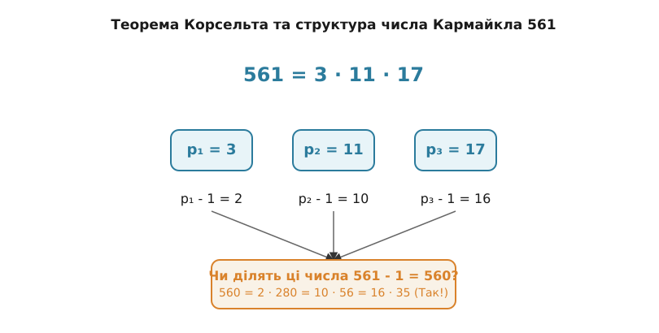

<preknowlist>
  - <a href="/math/number-theory/fermat-little-theorem/">Мала теорема Ферма</a>
  - <a href="/math/number-theory/modular-arithmetic/">Модульна арифметика та конгруенції</a>
  - <a href="/math/number-theory/primality-testing/">Базові алгоритми перевірки на простоту</a>
</preknowlist>

# Числа Кармайкла та абсолютні псевдопрості числа

Коли ми намагаємося з'ясувати, чи є велике число n простим, ми шукаємо хитрощі, щоб уникнути простого, але неймовірно повільного перебору всіх можливих дільників. Одним із найпотужніших таких хитрощів є Мала теорема Ферма. Вона стверджує фундаментальну властивість усіх простих чисел, пропонуючи елегантний тест: якщо число не проходить цей тест, воно гарантовано складене. 

Але що, якщо складене число "навчиться" проходити цей тест? Що, якщо воно буде майстерно маскуватися під просте, обманюючи нашу перевірку? Саме тут ми зустрічаємося з числами Кармайкла — найдосконалішими математичними імітаторами у світі теорії чисел. Вони є абсолютними псевдопростими числами, які руйнують наївні алгоритми криптографії та змушують нас використовувати значно складніші методи тестування.

> 🔧 **Навіщо це.** У сучасній криптографії (наприклад, у системі RSA) безпека тримається на здатності швидко генерувати величезні прості числа (довжиною в сотні або тисячі біт). Якщо алгоритм помилково прийме складене число Кармайкла за просте, уся криптографічна система стане вразливою. Розуміння природи чисел Кармайкла пояснює, чому ми покладаємося на складніші ймовірнісні тести Міллера-Рабіна, а не на простий тест Ферма, і як саме ми можемо гарантовано відрізнити справжнє просте число від ідеальної підробки.

## Першопричини: Ілюзія Малої теореми Ферма

Мала теорема Ферма — це наріжний камінь модульної арифметики. Вона стверджує: якщо n — просте число, а a — будь-яке ціле число, яке не ділиться на n, то виконується конгруенція:
aⁿ⁻¹ ≡ 1 (mod n)

Ця рівність здається магічною. Візьмемо просте число n = 7 і основу a = 2.
2⁷⁻¹ = 2⁶ = 64.
64 ділимо на 7. Отримуємо 9 і остачу 1. Тобто 64 ≡ 1 (mod 7). Теорема працює.

Тепер подумаємо як програміст, якому потрібно перевірити число на простоту. Замість того, щоб ділити велике число n на всі числа до √n, ми можемо обрати випадкове число a (наприклад, 2), піднести його до степеня n-1 за модулем n (це робиться дуже швидко алгоритмом швидкого піднесення до степеня) і подивитися на результат.
Якщо aⁿ⁻¹ ≢ 1 (mod n), то число n гарантовано складене! Цей тест називається тестом простоти Ферма.

Але що, якщо результат дорівнює 1? Чи гарантує це, що n — просте?
На жаль, ні. Мала теорема Ферма працює лише в один бік: "якщо просте, то 1". Вона не стверджує: "якщо 1, то просте".

Існують складені числа n, для яких aⁿ⁻¹ ≡ 1 (mod n) при певній основі a. Такі числа називаються **псевдопростими числами за основою a**.
Наприклад, розглянемо n = 341 і a = 2.
Число 341 дорівнює 11 · 31, отже, воно точно складене.
Але якщо ми обчислимо 2³⁴⁰ (mod 341), ми з подивом отримаємо 1.
Тому 341 — це псевдопросте число Ферма за основою 2. Воно обманює тест, якщо ми перевіряємо його лише за цією однією основою.

Як боротися з такими псевдопростими числами? Дуже просто: змінити основу!
Спробуємо основу a = 3 для того ж n = 341.
Обчислення 3³⁴⁰ (mod 341) дає результат 56, що не дорівнює 1.
Маска зірвана! Тест за основою 3 викрив, що 341 — складене число.

Здавалося б, проблема вирішена. Якщо тест повертає 1 для якоїсь основи a, ми просто беремо кілька інших випадкових основ. Якщо хоч для однієї з них результат не 1, число складене. 

Але тут на сцену виходять числа Кармайкла. Вони ставлять під сумнів увесь цей підхід.

## Визначення чисел Кармайкла: Абсолютні підробки

Число Кармайкла — це складене непарне додатне ціле число n, яке задовольняє конгруенцію:
aⁿ⁻¹ ≡ 1 (mod n)
для **усіх** цілих чисел a, які є взаємно простими з n (тобто gcd(a, n) = 1).

Що це означає на практиці? Це означає, що як би ви не змінювали основу a, намагаючись викрити складене число, тест Ферма завжди буде повертати 1. Число Кармайкла проходить тест Ферма за всіма можливими дозволеними основами. Воно є **абсолютним псевдопростим числом**.

Як таке взагалі можливо? Звідки беруться ці числа і як вони влаштовані? Відповідь на це дав німецький математик Альтвін Корсельт ще у 1899 році, хоча він і не знайшов жодного такого числа.

## Теорема Корсельта: Анатомія обману

Альтвін Корсельт довів елегантний критерій, який повністю описує внутрішню структуру чисел Кармайкла, навіть не знаючи жодного конкретного прикладу. 

**Теорема Корсельта:** Додатне складене число n є числом Кармайкла тоді й лише тоді, коли воно є бесквадратним (не ділиться на квадрат жодного простого числа) і для кожного його простого дільника p виконується умова: (p - 1) ділить (n - 1).

Запишемо це формально. Число n є числом Кармайкла, якщо:
1. n = p₁ · p₂ · ... · pₖ, де всі pᵢ — різні прості числа (бесквадратність).
2. Для кожного i від 1 до k виконується умова: (n - 1) ≡ 0 (mod (pᵢ - 1)), або простіше: n - 1 ділиться націло на pᵢ - 1.

Чому цей критерій працює? Давайте розберемо першопричину з точки зору модульної арифметики.
Ми хочемо, щоб aⁿ⁻¹ ≡ 1 (mod n) для всіх a, взаємно простих з n.
За Китайською теоремою про остачі, ця конгруенція виконуватиметься тоді й лише тоді, коли вона виконується за модулем кожного простого дільника pᵢ числа n:
aⁿ⁻¹ ≡ 1 (mod pᵢ).

З Малої теореми Ферма ми вже знаємо, що:
aᵖ⁻¹ ≡ 1 (mod pᵢ).

Отже, якщо ми піднесемо a до будь-якого степеня, що є кратним (pᵢ - 1), результат теж буде дорівнювати 1 за модулем pᵢ. Тобто, якщо n - 1 є кратним pᵢ - 1, то:
n - 1 = m · (pᵢ - 1) для якогось цілого m.
Тоді: aⁿ⁻¹ = a^{m(p_i-1)} = (a^{p_i-1})ᵐ ≡ 1ᵐ ≡ 1 (mod pᵢ).

Це має відбуватися для всіх простих дільників pᵢ одночасно. Отже, (pᵢ - 1) має ділити (n - 1) для кожного дільника. Саме це і стверджує [Критерій Корсельта](root:math-number-theory/korselt-criterion)! (А умова бесквадратності необхідна, щоб уникнути ускладнень з вищими степенями простих чисел, де вступає в дію функція Ейлера або функція Кармайкла λ(n), яка показує, що для квадратів тест Ферма не може давати 1 для всіх a).

## Перше число Кармайкла: 561

У 1910 році Роберт Деніел Кармайкл знайшов перше (і найменше) число, яке задовольняє [Критерій Корсельта](root:math-number-theory/korselt-criterion), і тим самим довів, що такі числа дійсно існують. Це число — 561.

Давайте розкладемо 561 на прості множники і застосуємо теорему Корсельта:
561 = 3 · 11 · 17.

Перевіряємо умови:
1. Число складене? Так.
2. Чи є воно бесквадратним? Так, множники 3, 11 та 17 зустрічаються рівно по одному разу. Усі вони різні.
3. Чи ділить (pᵢ - 1) число (n - 1)?
Тут n - 1 = 560.
Для p₁ = 3: p₁ - 1 = 2. Чи ділиться 560 на 2? Так (560 = 2 · 280).
Для p₂ = 11: p₂ - 1 = 10. Чи ділиться 560 на 10? Так (560 = 10 · 56).
Для p₃ = 17: p₃ - 1 = 16. Чи ділиться 560 на 16? Так (560 = 16 · 35).

Всі умови [Критерій Корсельта](root:math-number-theory/korselt-criterion) виконані ідеально! Отже, 561 є числом Кармайкла.

Спробуємо побачити магію цього числа на практиці. Візьмемо основу a = 2 (вона взаємно проста з 561).
Перевіримо конгруенцію 2⁵⁶⁰ ≡ 1 (mod 561).
Число 561 дорівнює 3 · 11 · 17. Перевіримо за кожним модулем окремо.
Модуль 3: 2² ≡ 1 (mod 3). Тоді 2⁵⁶⁰ = (2²)²⁸⁰ ≡ 1²⁸⁰ ≡ 1 (mod 3).
Модуль 11: 2¹⁰ ≡ 1 (mod 11). Тоді 2⁵⁶⁰ = (2¹⁰)⁵⁶ ≡ 1⁵⁶ ≡ 1 (mod 11).
Модуль 17: 2¹⁶ ≡ 1 (mod 17). Тоді 2⁵⁶⁰ = (2¹⁶)³⁵ ≡ 1³⁵ ≡ 1 (mod 17).
Оскільки 2⁵⁶⁰ дає остачу 1 при діленні на 3, 11 і 17, то за Китайською теоремою про остачі воно дає остачу 1 і при діленні на їхній добуток 561.
Цей же ланцюжок міркувань працюватиме для абсолютно будь-якої основи a, яка не ділиться на 3, 11 або 17. Число 561 є абсолютним імітатором простого числа для тесту Ферма!

Інші перші числа Кармайкла:
- 1105 = 5 · 13 · 17 (1104 ділиться на 4, 12 та 16)
- 1729 = 7 · 13 · 19 (1728 ділиться на 6, 12 та 18 — до речі, це відоме число Харді-Рамануджана!)
- 2465 = 5 · 17 · 29 (2464 ділиться на 4, 16 та 28)
- 2821 = 7 · 13 · 31 (2820 ділиться на 6, 12 та 30)

Цікавий факт: [Критерій Корсельта](root:math-number-theory/korselt-criterion) також має наслідок, що будь-яке число Кармайкла повинно мати принаймні три різних простих дільники. Воно не може складатися лише з двох.
Доведення від супротивного: Припустимо, n = p · q, де p і q — прості, і p > q.
За Корсельтом, (p - 1) повинно ділити (n - 1).
n - 1 = pq - 1 = p(q - 1) + p - 1.
Оскільки (p - 1) ділить (p - 1), воно має ділити і перший доданок p(q - 1).
Оскільки p і p - 1 взаємно прості, то (p - 1) має ділити (q - 1).
Але ми припустили, що p > q, тому p - 1 > q - 1. Більше число не може ділити менше. Суперечність!
Отже, чисел Кармайкла з двома простими множниками не існує. 561, маючи три множники (3, 11, 17), є найменшим можливим числом Кармайкла за структурою.

## Нескінченність чисел Кармайкла

Тривалий час після відкриття Кармайкла математики не знали, чи кількість таких чисел скінченна, чи їх нескінченно багато. Вони траплялися рідко (серед першого мільйона натуральних чисел є лише 43 числа Кармайкла, тоді як простих чисел — 78498). Здавалося, що вони можуть взагалі закінчитися.

Проте у 1994 році троє математиків — Вільям Альфорд, Ендрю Гранвілль та Карл Померанс — довели, що чисел Кармайкла нескінченно багато. Їхня теорема не просто встановила факт нескінченності, а й дала оцінку їх кількості.
Вони довели, що для достатньо великого x кількість чисел Кармайкла C(x), менших за x, перевищує:
C(x) > x^(2/7)

Хоча їхня щільність серед усіх чисел наближається до нуля зі зростанням x, їх абсолютної кількості достатньо, щоб становити серйозну загрозу для ймовірнісних алгоритмів генерації простих чисел. Якби криптографічні системи просто обирали випадкове непарне число і перевіряли його лише тестом Ферма за випадковими основами, ймовірність натрапити на число Кармайкла (і створити вразливий ключ) була б маленькою, але неприйнятною для систем, які вимагають абсолютної надійності.

## Викриття підробок: Тести Міллера-Рабіна та Соловея-Штрассена

Числа Кармайкла знищили надію на те, що Малу теорему Ферма можна безпосередньо використовувати як надійний ймовірнісний тест на простоту. Оскільки aⁿ⁻¹ ≡ 1 (mod n) для всіх a (якщо gcd(a,n)=1), ми не можемо знайти "свідка складеності" за допомогою цього конкретного рівняння, окрім випадків, коли ми випадково обираємо a, яке не є взаємно простим з n (тобто gcd(a,n) > 1). Але знайти таке a для великого числа Кармайкла так само складно, як і знайти його дільник факторизацією.

Математикам довелося шукати нові критерії простоти, які були б сильнішими за тест Ферма. 
Рішення полягало в тому, щоб зазирнути глибше у властивості конгруенцій.

Якщо n — просте число, то рівняння x² ≡ 1 (mod n) має лише два корені: x ≡ 1 (mod n) та x ≡ -1 (mod n). (Адже x² - 1 = (x - 1)(x + 1), і якщо добуток ділиться на просте n, то принаймні один із множників ділиться на n).
А от якщо n — складене, то це рівняння може мати додаткові нетривіальні корені (наприклад, для n = 15 рівняння x² ≡ 1 (mod 15) має 4 корені: 1, 4, 11, 14, оскільки 4² = 16 ≡ 1 і 11² = 121 ≡ 1).

Алгоритм **Міллера-Рабіна** використовує цей факт. Він бере ту саму величину aⁿ⁻¹ ≡ 1, але оскільки n - 1 для непарних чисел є парним, ми можемо розкласти його на двійки: n - 1 = 2ˢ · d, де d — непарне число.
Алгоритм обчислює aᵈ (mod n), а потім починає послідовно підносити результат до квадрата, перевіряючи, чи не з'явиться нетривіальний корінь з 1.
Числа Кармайкла розсипаються перед цим тестом! Оскільки вони складені і мають кілька простих дільників, Китайська теорема про остачі гарантує існування нетривіальних квадратних коренів з одиниці. [Тест Міллера — Рабіна](root:math-number-theory/miller-rabin-test) швидко знаходить такий корінь під час серії піднесень до квадрата і безпомилково оголошує число складеним. Для будь-якого складеного числа (включаючи числа Кармайкла) [Тест Міллера — Рабіна](root:math-number-theory/miller-rabin-test) знаходить "свідка складеності" з ймовірністю не менше 75% для кожної випадкової основи a.

Інший підхід — тест **Соловея-Штрассена**, який використовує властивості символу Якобі та критерій Ейлера a^{(n-1)/2} ≡ (a/n) (mod n). Для чисел Кармайкла ця рівність часто порушується, що також дозволяє їх відсіяти.

## Підсумок

Числа Кармайкла — це прекрасний приклад того, як математичні об'єкти можуть обходити правила, що здавалися універсальними. Вони нагадують нам про важливість строгого розрізнення між необхідними та достатніми умовами: властивість "якщо просте, то виконується рівність" не завжди означає "якщо виконується рівність, то просте".

Вивчення цих абсолютних псевдопростих чисел стимулювало розвиток сучасних алгоритмів тестування простоти. Саме завдяки розумінню їхньої структури через [Критерій Корсельта](root:math-number-theory/korselt-criterion), математики змогли створити надійні ймовірнісні тести, такі як алгоритм Міллера-Рабіна, які сьогодні лежать в основі безпеки всього цифрового світу.
