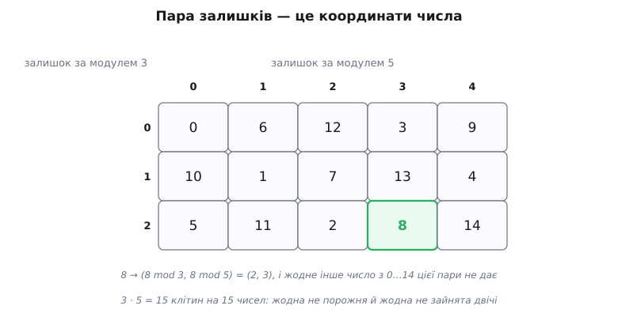
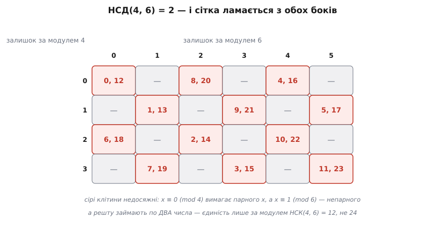
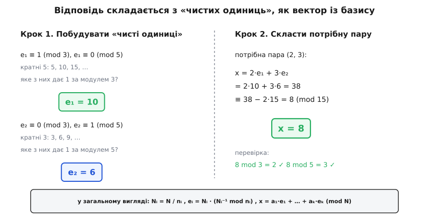
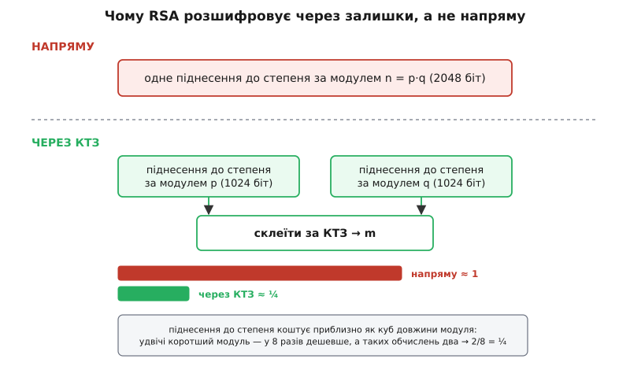

# Китайська теорема про залишки

<preknowlist>
- [Модульна арифметика](root:math-number-theory/modular-arithmetic) — запис a ≡ b (mod m), класи лишків і головне: суму й добуток можна зводити за модулем будь-коли, до дії чи після неї.
- [НСД і алгоритм Евкліда](root:math-number-theory/gcd-euclidean) — найбільший спільний дільник, що означає «взаємно прості» (НСД = 1), найменше спільне кратне і як їх швидко знайти.
- [Обернений елемент за модулем](root:math-number-theory/modular-inverse) — число a⁻¹, для якого a·a⁻¹ ≡ 1 (mod m); існує тоді й лише тоді, коли НСД(a, m) = 1.
</preknowlist>

У китайському «Обчислювальному каноні Сунь-цзи» (*Sunzi Suanjing*, 孫子算經) записана задача, що на вигляд — звичайна головоломка: «Є речі, кількість яких невідома. Лічимо по три — лишається дві; лічимо по п'ять — лишається три; лічимо по сім — лишається дві. Скільки речей?»

Спокуса — підставляти числа підряд, доки не збіжиться. Але цікава тут не відповідь, а три питання, які задача ставить мовчки. Чи знайдеться розв'язок за **будь-яких** трьох залишків, чи бувають безнадійні набори? Якщо знайдеться — він один чи їх багато? І чи можна дійти до нього прямо, не перебираючи? Ствердна відповідь на всі три й зветься **китайська теорема про залишки**.

Проте головне в ній — не спосіб розв'язати давню загадку, а зміна погляду. Набір залишків числа — це не сліди, що лишилися від ділення. Це **координати** самого числа.

### Залишки як координати

Візьмімо два модулі — 3 і 5 — і подивімося на числа від 0 до 14, тобто рівно на 3·5 = 15 чисел. Кожному числу *x* поставимо у відповідність **пару** його залишків: (*x* mod 3, *x* mod 5). Скажімо, 8 → (2, 3).

Пар усього теж п'ятнадцять: три можливості для першого числа й п'ять для другого. Чисел п'ятнадцять, пар п'ятнадцять — і від того, як вони лягають одні на одних, залежить усе. Чи потрапляє кожне число у свою власну пару, чи хтось стикається?

Припустімо, що два числа *x* і *y* з проміжку 0…14 дали ту саму пару. Однакові залишки означають, що різниця *x* − *y* ділиться і на 3, і на 5. Число, кратне обом, кратне і їхньому найменшому спільному кратному, — а для взаємно простих 3 і 5 найменше спільне кратне є просто добутком, тобто 15. Отже, *x* − *y* ділиться на 15. Але різниця двох чисел із проміжку 0…14 за модулем не перевищує 14. Ділитися на 15 і бути меншою за 15 може лише одна річ — нуль. Тому *x* = *y*.

Зіткнень немає: п'ятнадцять чисел лягають у п'ятнадцять пар без жодного повтору. А коли скінченна множина відображається в іншу такого самого розміру й ніде не злипається, вона неминуче накриває її **повністю** — вільних пар не лишається. Ось і вся теорема, здобута лічбою: **кожна пара залишків досяжна** (розв'язок завжди є) **і рівно одне число з 0…14 її дає** (розв'язок один).


*П'ятнадцять чисел і п'ятнадцять клітин. Жодна клітина не порожня — тому розв'язок існує за будь-яких залишків; жодна не зайнята двічі — тому він єдиний. Число 8 сидить у клітині (2, 3) саме тому, що 8 = 2·3 + 2 і 8 = 1·5 + 3. Пара залишків визначає число так само повно, як пара «широта, довгота» визначає точку на карті.*

Саме тому залишки й варто називати координатами. Пара чисел, кожне з яких саме собою нічого не знає про *x*, разом відновлює його однозначно.

### На чому все тримається: взаємна простота

У міркуванні вище взаємна простота 3 і 5 знадобилася рівно один раз — в одному підрядку, де найменше спільне кратне виявилося добутком. Але саме цей підрядок ніс усе. Варто прибрати умову — і подивитися, що впаде.

Візьмімо 4 і 6. Добуток той самий за духом — 24 числа, 4·6 = 24 пари, лічба ніби сходиться. Але НСД(4, 6) = 2: обидва модулі бачать одну й ту саму двійку.

Наслідок видно без жодних формул. Умова *x* ≡ 0 (mod 4) означає, що *x* парне. Умова *x* ≡ 1 (mod 6) означає, що *x* непарне. Пари (0, 1) не досягне ніхто — система суперечлива сама собі. І це не поодинока прикрість: недосяжною виявляється рівно половина клітин.


*Спільний дільник ламає сітку одразу з двох боків. Половина пар недосяжна — такі системи не мають розв'язку взагалі. А ті, що досяжні, займають по два числа: 0 і 12 дають однакову пару (0, 0). Єдиності теж немає — точніше, вона є, але за модулем НСК(4, 6) = 12, а не за модулем 24.*

Обидві половини теореми впали одночасно, і причина в обох одна. Спільний дільник — це рівно та частина інформації про число, яку два модулі бачать **обидва**. Через неї вони можуть суперечити один одному (тоді розв'язку немає) і через неї ж витрачають частину своєї роздільності на дублювання того самого (тоді розв'язків два). Умова «попарно взаємно прості» вимагає, щоб кожен модуль бачив **свою** частину числа й нічого чужого. Тоді координати не сперечаються й не повторюються — вони доповнюють одна одну.

> 🔧 **Навіщо це.** Найпоширеніша помилка застосування — узяти модулі, які на око різні, але не взаємно прості: 12 і 18, наприклад, зі спільною шісткою. Формула, наведена нижче, на таких модулях не зупиниться з помилкою — вона обчислить обернений там, де його немає, і поверне число, яке просто не задовольняє вихідну систему. Перевірка НСД перед склеюванням коштує один виклик алгоритму Евкліда; без неї помилку знаходять уже в зіпсованих даних. Тому в кожній чесній реалізації перший рядок — перевірка взаємної простоти, а не оптимізація.

### Як дійти до відповіді прямо

Лічба довела, що відповідь є. Тепер її треба **побудувати** — бажано не перебором.

Тут координатна аналогія віддає борг. Як задають точку в координатах? Розкладають по **базису**: беруть «чисті» одиничні напрямки й додають їх із потрібними вагами. Спробуймо буквально те саме із залишками.

«Чиста одиниця по осі mod 3» — це число *e*₁, що за модулем 3 дорівнює одиниці, а за модулем 5 — нулю; пара (1, 0). Знайти його неважко, бо вимоги майже не заважають одна одній. Нуль за модулем 5 означає, що *e*₁ кратне п'яти, тобто лежить у ряду 5, 10, 15, … Лишилося пройти цим рядом і взяти перше, що дає одиницю за модулем 3: п'ятірка дає 2, десятка дає 1 — отже, *e*₁ = 10.

Так само *e*₂ — пара (0, 1): кратне трьом, що дає одиницю за модулем 5. Трійка дає 3, шістка дає 1 — отже, *e*₂ = 6.

А тепер — крок, заради якого все й будувалося. Залишки додаються й множаться почленно, тому з *e*₁ та *e*₂ складається будь-яка пара. Щоб дістати (2, 3), беремо *x* = 2·*e*₁ + 3·*e*₂ = 2·10 + 3·6 = 38 ≡ 8 (mod 15). Чому це працює, видно, якщо глянути на кожну координату окремо: за модулем 3 другий доданок зникає (бо *e*₂ ≡ 0) і лишається 2·1 = 2; за модулем 5 зникає перший і лишається 3·1 = 3. Кожен доданок працює на **свою** координату й невидимий для чужої — точнісінько як одиничні вектори базису.


*Спершу будують «чисті одиниці» — числа, що дорівнюють одиниці за своїм модулем і нулю за всіма іншими. Тоді будь-яку потрібну пару складають із них із вагами-залишками, як вектор із базису. Перебору немає ніде: кожен крок — це або ділення, або пошук оберненого.*

Узагальнення дослівне. Нехай модулі *n*₁, …, *n*ₖ попарно взаємно прості, а *N* — їхній добуток. Для кожного *i* позначмо *N*ᵢ = *N* / *n*ᵢ — добуток **усіх інших** модулів. Таке *N*ᵢ автоматично ділиться на кожен *n*ⱼ, крім самого *n*ᵢ, тож половина роботи вже зроблена: нулі по чужих осях є. Лишається підкрутити його так, щоб за модулем *n*ᵢ вийшла рівно одиниця, — а це і є множення на обернений:

```
N  = n₁ · n₂ · … · nₖ
Nᵢ = N / nᵢ                        добуток усіх модулів, крім i-го
Mᵢ = Nᵢ⁻¹ (mod nᵢ)                 існує, бо НСД(Nᵢ, nᵢ) = 1
eᵢ = Nᵢ · Mᵢ                       «чиста одиниця» i-ї осі: (0, …, 1, …, 0)
x  = a₁·e₁ + a₂·e₂ + … + aₖ·eₖ     (mod N)
```

Зверніть увагу, де саме тут удруге спрацювала взаємна простота. Обернений *M*ᵢ існує лише тоді, коли НСД(*N*ᵢ, *n*ᵢ) = 1, — а *N*ᵢ складений із модулів, кожен з яких взаємно простий з *n*ᵢ, тому й добуток їхній взаємно простий з ним. Перший раз ця умова дала єдиність, тепер вона ж дає саму можливість побудови. Одна вимога тримає обидві половини теореми.

[Строге виведення](root:math-number-theory/chinese-remainder-theorem/math-crt-derivation.md) варте окремого розгляду: тотожність Безу як джерело оберненого, повні доведення існування та єдиності, формулювання через ізоморфізм кілець ℤ/*N* ≅ ℤ/*n*₁ × … × ℤ/*n*ₖ і точне узагальнення на модулі, що не взаємно прості, — з умовою сумісності *a*ᵢ ≡ *a*ⱼ (mod НСД(*n*ᵢ, *n*ⱼ)).

### Задача Сунь-цзи, розв'язана формулою

**Умова: x ≡ 2 (mod 3), x ≡ 3 (mod 5), x ≡ 2 (mod 7).**

```
модулі попарно взаємно прості:  НСД(3,5) = НСД(3,7) = НСД(5,7) = 1   ✓
N = 3 · 5 · 7 = 105

i = 1:  n₁ = 3,   N₁ = 105 / 3 = 35
        35 ≡ 2 (mod 3)             шукаємо обернений до 2 за модулем 3
        2 · 2 = 4 ≡ 1 (mod 3)   →  M₁ = 2
        e₁ = 35 · 2 = 70           (70 mod 3, 70 mod 5, 70 mod 7) = (1, 0, 0)   ✓

i = 2:  n₂ = 5,   N₂ = 105 / 5 = 21
        21 ≡ 1 (mod 5)          →  M₂ = 1
        e₂ = 21 · 1 = 21           (21 mod 3, 21 mod 5, 21 mod 7) = (0, 1, 0)   ✓

i = 3:  n₃ = 7,   N₃ = 105 / 7 = 15
        15 ≡ 1 (mod 7)          →  M₃ = 1
        e₃ = 15 · 1 = 15           (15 mod 3, 15 mod 5, 15 mod 7) = (0, 0, 1)   ✓

склеюємо:
x = 2·70 + 3·21 + 2·15 = 140 + 63 + 30 = 233
233 = 2·105 + 23                →  x ≡ 23 (mod 105)

перевірка:  23 = 7·3 + 2        →  23 ≡ 2 (mod 3)   ✓
            23 = 4·5 + 3        →  23 ≡ 3 (mod 5)   ✓
            23 = 3·7 + 2        →  23 ≡ 2 (mod 7)   ✓
```

А тепер найцікавіше — те, заради чого варто було порахувати руками. У «Каноні Сунь-цзи» правило записане так: за лічби по три бери 70, за лічби по п'ять — 21, за лічби по сім — 15; помнож кожне на свій залишок, склади, і віднімай 105, доки не стане менше. Ті самі 70, 21 і 15. Автор не мав ні знака ≡, ні слова «базис», і подав це як рецепт для однієї трійки модулів — але числа, які він виписав, є буквально нашими *e*₁, *e*₂, *e*₃.

[Шлях від цієї загадки до теореми](root:math-number-theory/chinese-remainder-theorem/hist-sunzi-to-gauss.md) — окрема історія, і вона плутаніша, ніж підказує назва. Рецепт Сунь-цзи (III–V ст., датування спірне) був саме рецептом: без доведення й без загального випадку. Повний загальний алгоритм — навіть для модулів, що не взаємно прості, — дав Цінь Цзюшао 1247 року. Незалежну індійську нитку почав Аріабхата ще 499-го методом *куттака* («подрібнювач»). Сучасне формулювання зі знаком ≡ належить Гауссові (1801). Назву ж «китайська» теоремі дали європейці аж у XIX–XX ст. — і вона водночас заслужена й затуляє половину картини.

### Що дає теорема

Гарна головоломка — слабка причина, щоб теорема прожила півтори тисячі років. Справжня причина в тому, що вона **розбирає одне велике число на кілька малих і нічого при цьому не втрачає**.

Ключове — не сам розклад, а те, що арифметика переживає його неушкодженою. Додати, відняти чи помножити два числа за модулем *N* — те саме, що зробити це **покоординатно**, кожному модулю окремо. Сама ця властивість належить іще лишкам; теорема додає до неї те, чого бракувало, — гарантію, що з координат завжди можна зібрати число назад, і то єдине. Разом виходить повноцінний **словник** між «одним великим числом» і «набором маленьких», у якому +, − і · перекладаються дослівно, без утрат.

**Замість одного великого — кілька малих.** Наслідок для обчислень прямий: замість арифметики над числом у тисячі бітів можна вести кілька незалежних арифметик над числами в десятки бітів. Незалежних — тобто без переносів між компонентами, а отже, придатних до розпаралелювання. На цьому стоїть система залишкових класів (RNS), яку вживають у процесорах цифрового опрацювання сигналів і в криптографічному залізі.

**Розшифрування RSA.** Найгучніше застосування. Секретний ключ вимагає піднести число до величезного степеня за модулем *n* = *p*·*q*, де прості *p* і *q* відомі лише власникові ключа. Вартість такого піднесення росте приблизно як **куб** довжини модуля: шкільне множення двох *m*-бітних чисел коштує ~*m*², а самих множень при піднесенні до степеня треба ~*m*.

Звідси й трюк. Володіючи *p* і *q*, обчислення ведуть не за модулем *n*, а за модулями *p* і *q* окремо — тобто в координатах теореми. Кожен модуль удвічі коротший, тож кожна половина коштує ~(*m*/2)³ = *m*³/8; половин дві — разом *m*³/4. Виграш — приблизно **вчетверо**, і склеювання назад на цьому тлі майже безкоштовне. Саме тому кожен реальний формат приватного ключа RSA зберігає поруч із *p* і *q* ще й заготовки для цього шляху — зокрема обернений *q*⁻¹ mod *p*, який не залежить ні від повідомлення, ні від степеня, тож його рахують один раз при породженні ключа.


*Кубічна вартість — це і є весь виграш. Удвічі коротший модуль дешевший у вісім разів, а таких обчислень треба два: 2/8 = ¼. Теорема тут не прискорює арифметику — вона лише дозволяє розібрати задачу на дві менші та обіцяє, що склеювання поверне точно ту саму відповідь.*

**Структура арифметики за складеним модулем.** Третій наслідок — не швидкодія, а розуміння. Будь-яке *n* розкладається на степені [простих чисел](root:math-number-theory/prime-numbers), а різні степені різних простих попарно взаємно прості. Отже, теорема дає:

```
ℤ/n  ≅  ℤ/p₁^k₁ × ℤ/p₂^k₂ × … × ℤ/pᵣ^kᵣ        де n = p₁^k₁ · p₂^k₂ · … · pᵣ^kᵣ
```

Читати це слід так: **арифметика за складеним модулем не має власних таємниць** — вона рівно є набором незалежних арифметик за модулями-степенями простих. Скільки розв'язків має рівняння за модулем 1000? Розв'яжіть його за модулем 8 і за модулем 125 та перемножте кількості — 1000 = 8·125. Звідси ж випливає й мультиплікативність [функції Ейлера](root:math-number-theory/euler-totient): φ(*mn*) = φ(*m*)·φ(*n*) для взаємно простих *m* і *n* — бо теорема ставить у відповідність оборотні елементи однієї сторони оборотним елементам другої.

### Де ця картина ламається

Аналогія з координатами точна майже в усьому — і саме тому варто знати, де вона відмовляє.

Координати не зберігають **порядок**. За парою (*x* mod 3, *x* mod 5) не можна сказати, більше *x* чи менше за *y*, не зібравши обидва числа назад. У наших координатах 8 = (2, 3), а 9 = (0, 4); жодне порівняння цих пар — ні почленне, ні лексикографічне — не скаже, що 9 > 8. Те саме стосується ділення, визначення знака й перевірки на переповнення: усе, що спирається на **величину** числа, а не на кільцеві дії, вимагає повної реконструкції. Ось чому RNS чудова там, де множень багато, а порівнянь мало, і незручна майже скрізь інде — обмеження не в реалізації, а в самій природі координат.

Друга пастка практична — розмір проміжних чисел. У формулі *x* = Σ *a*ᵢ·*N*ᵢ·*M*ᵢ кожен доданок буває майже завбільшки з *N*, а їхня сума — у *k* разів більша за *N*. У мові з машинними цілими це переповнення настане раніше, ніж дійде до зведення за модулем, і відповідь буде тихо зіпсована. Обходів два: зводити за модулем *N* після кожного доданка (як у коді нижче) або склеювати модулі попарно, поступово, — тоді проміжні взагалі не виходять за *N*.

### Розв'язувач у коді

Обчислення дослівно за формулою. Модулі попарно взаємно прості — інакше оберненого немає, і код мусить це помітити, а не мовчки повернути сміття.

:::tabs
```py
from math import prod

def crt(residues, moduli):
    """Розв'язати x ≡ residues[i] (mod moduli[i]) для попарно взаємно простих moduli."""
    N = prod(moduli)
    x = 0
    for a, n in zip(residues, moduli):
        Ni = N // n
        Mi = pow(Ni, -1, n)      # обернений; кине ValueError, якщо НСД(Ni, n) ≠ 1
        x += a * Ni * Mi
    return x % N

print(crt([2, 3, 2], [3, 5, 7]))     # 23 — задача Сунь-цзи
```
```cpp
#include <cstdint>
#include <vector>
#include <stdexcept>

// розширений Евклід: НСД(a, b) плюс x, y такі, що a·x + b·y = НСД(a, b)
static int64_t egcd(int64_t a, int64_t b, int64_t &x, int64_t &y) {
    if (b == 0) { x = 1; y = 0; return a; }
    int64_t x1, y1;
    int64_t g = egcd(b, a % b, x1, y1);
    x = y1;
    y = x1 - (a / b) * y1;
    return g;
}

static int64_t inv_mod(int64_t a, int64_t m) {
    int64_t x, y;
    if (egcd(a % m, m, x, y) != 1) throw std::domain_error("модулі не взаємно прості");
    return (x % m + m) % m;          // egcd може дати від'ємний x — нормалізуємо
}

int64_t crt(const std::vector<int64_t> &res, const std::vector<int64_t> &mod) {
    int64_t N = 1;
    for (int64_t n : mod) N *= n;
    __int128 x = 0;                  // добуток a·Nᵢ·Mᵢ переростає int64_t уже на скромних модулях
    for (size_t i = 0; i < mod.size(); ++i) {
        int64_t Ni = N / mod[i];
        int64_t Mi = inv_mod(Ni % mod[i], mod[i]);
        x += (__int128)res[i] * Ni % N * Mi % N;   // зводимо після кожного множення
    }
    return (int64_t)(x % N);
}
```
:::

Різниця між вкладками — не синтаксис, а те, з чим кожна мова лишає читача сам на сам. Python має довгу арифметику вбудовану, тож `x += a * Ni * Mi` безпечне за будь-яких модулів, а `pow(Ni, -1, n)` уже вміє шукати обернений і сам кидає помилку на не взаємно простих. У C++ обидві ці послуги доводиться надати собі власноруч: обернений — через розширений Евкліда, а захист від переповнення — через `__int128` і зведення за модулем після кожного множення.

[Повний розв'язувач](root:math-number-theory/chinese-remainder-theorem/proj-crt-solver.md) заслуговує окремого розбору: склеювання модулів, що не взаємно прості, мішано-основне подання Гарнера (де проміжні не роздуваються взагалі), покоординатна арифметика RNS, RSA-CRT із виміряним прискоренням — і класична пастка цього прискорення, збійна атака, яка з єдиної помилки в одній із двох половин видобуває розклад модуля на множники.

> 🔧 **Навіщо це.** Винесіть одну думку: **набір залишків за взаємно простими модулями — це повноцінне подання числа, а не його огризок**. Щойно ви це побачили, теорема перестає бути головоломкою й стає інструментом розбиття: велике число можна розібрати на малі, порахувати їх незалежно (а отже, паралельно чи просто швидше) і склеїти назад без утрат — саме так живе RSA-CRT і саме так живе RNS. Але межа інструмента так само чітка: словник перекладає лише +, − і ·. Тієї миті, коли задачі знадобилося порівняння, ділення або знак, координати доведеться зібрати назад — і весь виграш зникне. Тому питання «чи є в моєму гарячому шляху хоч одне порівняння» вирішує долю всієї витівки ще до того, як написано перший рядок.
