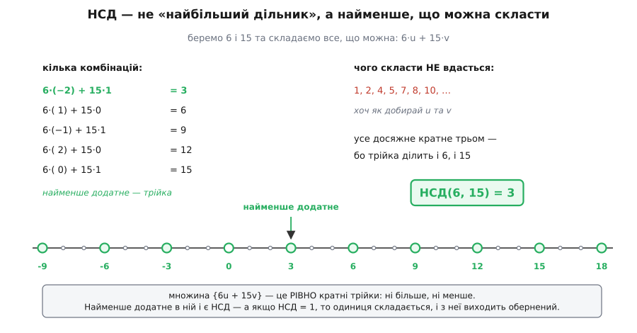
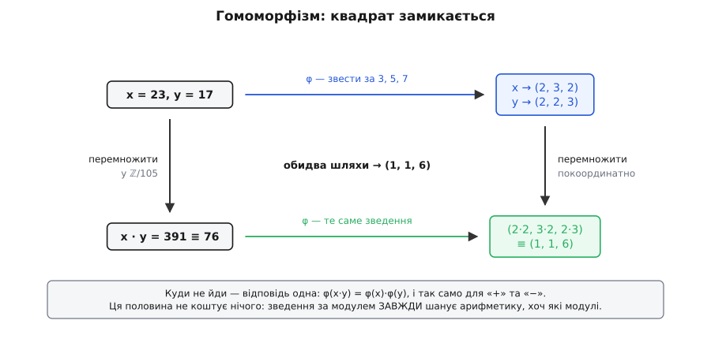
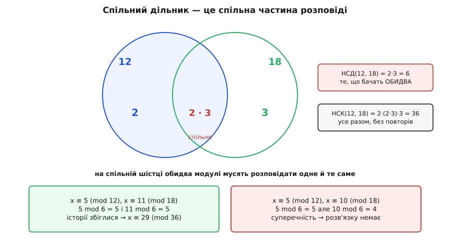

# 🧮 Строге виведення: одна тотожність, з якої росте все

Лічба — чесний доказ. Візьміть модулі 3 і 5, п'ятнадцять чисел і п'ятнадцять пар залишків; покажіть, що два різні числа не можуть дати ту саму пару, — і порожніх пар теж не лишиться. Заперечити нема чому: скінченна множина, яка вкладається в іншу такого самого розміру й ніде не злипається, накриває її повністю.

Але цей доказ дивно мовчазний. Він запевняє, що число в клітині є, і не каже, яке саме. Він спирається на те, що обидві сторони однакового розміру, — а це правда рівно доти, доки модулі взаємно прості; щойно умова падає, лічба замовкає й не підказує навіть, які клітини спорожніли. І головне: у побудові «чистих одиниць» *e*ᵢ = *N*ᵢ·*M*ᵢ на видноті сидить крок, якого лічба не пояснює зовсім, — обернений *M*ᵢ. Сказано: «він існує, бо НСД = 1» — і по тому.

Спинімося саме тут, бо це найцікавіше місце в усій теоремі. «НСД(*a*, *m*) = 1» — твердження про **дільники**: немає числа, більшого за одиницю, яке ділило б обидва. «Існує *a*⁻¹» — твердження про **множення**: знайдеться щось, що в добутку з *a* дає одиницю. Це висловлювання про різні світи. Дільники кажуть, на що число **розпадається**; обернений — що з числа можна **зібрати**. Чому відсутність спільних дільників зобов'язана породити одиницю, з першого погляду не видно ніяк — між цими двома реченнями зяє провалля.

Через нього перекинута рівно одна дошка. І та сама дошка, знайдена один раз, витримає все інше: і обернений, і єдиність, і точну умову для модулів, що не взаємно прості. Заради цього варто йти повільно.

### Що саме треба довести

Спершу — точні формулювання, бо далі кожне слово в них працюватиме.

```
ДАНО:    модулі n₁, …, nₖ — попарно взаємно прості (НСД(nᵢ, nⱼ) = 1 при i ≠ j)
         залишки a₁, …, aₖ — довільні цілі
         N = n₁ · n₂ · … · nₖ

ІСНУВАННЯ:  знайдеться x, для якого x ≡ aᵢ (mod nᵢ) одночасно для всіх i
ЄДИНІСТЬ:   будь-які два такі x конгруентні за модулем N
```

Два твердження — і вони не рівносильні й не випливають одне з одного. Єдиність каже, що зайвих відповідей немає; існування — що є бодай одна. Доводити їх доведеться нарізно, і спираються вони на взаємну простоту з різних боків: єдиність — через найменше спільне кратне, існування — через обернений.

Слово «попарно» тут не окраса. Умова накладена на кожну **пару** модулів окремо, а не на весь набір гуртом. Набір (6, 10, 15) не має спільного дільника в усіх трьох одразу — НСД усієї трійки дорівнює одиниці, — та попарно вони не взаємно прості жодного разу: НСД(6, 10) = 2, НСД(6, 15) = 3, НСД(10, 15) = 5. Теорема на такому наборі не працює, хоч «спільного дільника в усіх» і немає.

### Тотожність Безу: звідки береться одиниця

Забудьмо на хвилину про залишки. Питання простіше: **що взагалі можна скласти з двох чисел?**

Візьмімо 6 і 15 та дозволімо собі лише додавати їх і віднімати, скільки завгодно разів. Виходять числа вигляду 6·*u* + 15·*v*, де *u* та *v* — цілі будь-якого знака. Скажімо, 6·(−2) + 15·1 = 3. Або 6·1 + 15·0 = 6. Або 6·(−1) + 15·1 = 9.

Питання, від якого все залежить: **яке найменше додатне число тут досяжне?**

Помітно, що трійка вискочила одразу, а от одиницю чи двійку добути не вдається, хоч як добирай. Причина на поверхні: трійка ділить і 6, і 15, отже, ділить і будь-яке 6*u* + 15*v* — сума двох кратних трьох кратна трьом. Уся множина замкнена в кратних трійки, і нижче за 3 додатних чисел там просто немає.


*Одиниці й двійки з шісток і п'ятнадцяток не скласти ніяк — спільний дільник трійка тримає всю множину при собі. Найменше додатне досяжне число збіглося з НСД, і це не збіг.*

Трійка ж — це НСД(6, 15). Збіг? Ні. І тут — головний поворот усього виведення.

**Твердження.** Нехай *a* й *m* — цілі, не обидва нульові, а *S* — множина всіх чисел вигляду *a·u* + *m·v*. Тоді найменше додатне число в *S* дорівнює НСД(*a*, *m*), і **вся множина *S* — це рівно кратні цього НСД**.

Доведення варте того, щоб пройти його рядок за рядком, бо воно коротке й у ньому нема жодного зайвого руху.

Спершу — чому найменше додатне взагалі існує. Множина додатних чисел у *S* не порожня (там є хоча б |*a*| або |*m*|), а всяка непорожня множина натуральних чисел має найменший елемент — це [принцип повного впорядкування](root:math-logic/well-ordering-principle): натуральний ряд не має нескінченного спуску вниз, тож у будь-якому непорожньому наборі є найменший. Позначмо це найменше додатне через *d*; за побудовою *d* = *a·u*₀ + *m·v*₀ для якихось конкретних *u*₀, *v*₀.

Тепер — ключовий крок: **чому *d* ділить *a***. Поділімо *a* на *d* з остачею: *a* = *q·d* + *r*, де 0 ≤ *r* < *d*. Випишімо цю остачу явно:

```
r = a − q·d
  = a − q·(a·u₀ + m·v₀)
  = a·(1 − q·u₀) + m·(−q·v₀)
```

Погляньте, що вийшло. Остача *r* сама виявилася числом вигляду *a·u* + *m·v* — тобто теж лежить у *S*. Але *r* менша за *d*, а *d* — **найменше додатне** в *S*. Вихід один: *r* = 0. Отже, *d* ділить *a*. Те саме міркування слово в слово дає, що *d* ділить *m*.

Отже, *d* — спільний дільник. Лишилося показати, що він найбільший. Нехай *c* — будь-який спільний дільник *a* й *m*. Тоді *c* ділить *a·u*₀ і ділить *m·v*₀, а отже, ділить їхню суму — тобто саме *d*. Число, що ділить *d*, не перевищує *d*. Отже, *d* більший за всіх — це і є НСД.

І остання дрібниця, яка згодиться пізніше: множина *S* — це **точно** кратні *d*, без винятків. В один бік ми вже бачили: *d* ділить *a* й *m*, тому ділить кожне *a·u* + *m·v*. У другий: якщо взяти будь-яке кратне *k·d*, то *k·d* = *a*·(*k·u*₀) + *m*·(*k·v*₀) — знову потрібний вигляд. Тож ані більше, ані менше:

```
{ a·u + m·v  :  u, v ∈ ℤ }  =  { кратні НСД(a, m) }
```

> 🔧 **Навіщо це.** Тут відбулася підміна означення, і саме вона все й рухає. Шкільне «НСД — найбільший спільний дільник» дивиться **назад**: перебирає те, на що числа розпадаються. Щойно доведене «НСД — найменше додатне, що можна скласти» дивиться **вперед**: каже, що з чисел можна **побудувати**. Обидва описують одне число, але працює лише другий. З «найбільшого дільника» не випливає нічого, крім нього самого; із «найменшого, що складається» випливає одиниця — а з одиниці й увесь апарат теореми. Коли доведення застрягло на НСД, майже завжди рятує перехід до цього другого погляду.

Тепер по обернений — він дістається задарма. Хай НСД(*a*, *m*) = 1. За щойно доведеним одиниця досяжна: знайдуться *u*₀ і *v*₀ з

```
a·u₀ + m·v₀ = 1
```

Зведімо цю рівність за модулем *m*. Доданок *m·v*₀ кратний *m*, тож зникає:

```
a·u₀ ≡ 1 (mod m)
```

Ось і все. Обернений — це *u*₀, коефіцієнт із тотожності, поданий просто в руки. Провалля між «немає спільних дільників» і «є обернений» перекрито: спільних дільників немає ⟹ найменше досяжне дорівнює одиниці ⟹ одиниця складається з *a* та *m* ⟹ за модулем *m* внесок *m* зникає ⟹ лишається *a·u*₀ ≡ 1.

Варто зауважити, що це не одностороння імплікація, а рівносильність, і зворотний бік теж корисний. Хай *a·u* ≡ 1 (mod *m*) для якогось *u*. Тоді *a·u* − 1 кратне *m*, тобто *a·u* − 1 = *m*·(−*v*) для якогось *v*, звідки *a·u* + *m·v* = 1. Але будь-який спільний дільник *a* та *m* мусить ділити ліву частину, а отже, й одиницю — тож він сам дорівнює одиниці. Виходить строге «тоді й лише тоді»:

```
обернений до a за модулем m існує  ⟺  НСД(a, m) = 1
```

**Умова: знайти обернений до 41 за модулем 97.**

Тотожність доводить, що коефіцієнти є, але не показує, як їх дістати. Показує це [алгоритм Евкліда](root:math-number-theory/gcd-euclidean): він шукає НСД послідовним діленням з остачею — тим самим кроком, на якому тримається доведення вище, — а якщо остачі запам'ятовувати й підставляти назад, то з нього випадають і самі *u*₀, *v*₀. Такий хід називають розширеним Евклідом.

```
прямий хід — ділення з остачею, доки не дійдемо до нуля:
  97 = 2·41 + 15
  41 = 2·15 + 11
  15 = 1·11 + 4
  11 = 2·4  + 3
   4 = 1·3  + 1        ← остання ненульова остача: НСД(41, 97) = 1
   3 = 3·1  + 0

зворотний хід — виражаємо одиницю, щоразу підставляючи попередній рядок:
  1 = 4 − 1·3
    = 4 − (11 − 2·4)          = 3·4  − 1·11        [3 = 11 − 2·4]
    = 3·(15 − 11) − 11        = 3·15 − 4·11        [4 = 15 − 11]
    = 3·15 − 4·(41 − 2·15)    = 11·15 − 4·41       [11 = 41 − 2·15]
    = 11·(97 − 2·41) − 4·41   = 11·97 − 26·41      [15 = 97 − 2·41]

перевірка тотожності:  11·97 − 26·41 = 1067 − 1066 = 1   ✓
```

Тотожність дала 41·(−26) + 97·11 = 1, тобто *u*₀ = −26. За модулем 97 це і є обернений, тільки поданий від'ємним числом:

```
41 · (−26) ≡ 1 (mod 97)
−26 ≡ 71 (mod 97)                       нормалізуємо у проміжок 0…96
перевірка:  41 · 71 = 2911 = 30·97 + 1  →  41 · 71 ≡ 1 (mod 97)   ✓
```

Від'ємний коефіцієнт — не збій, а звичайний вихід тотожності: вона говорить про цілі числа обох знаків, і лише зведення за модулем повертає відповідь у звичний проміжок. Тому кожна реалізація [оберненого за модулем](root:math-number-theory/modular-inverse) закінчується нормалізацією.

> 📜 **Про ім'я.** Тотожність носить ім'я Етьєна Безу (Étienne Bézout, 1730–1783), і це майже непорозуміння. Безу справді довів її — але **для многочленів**, у праці «Théorie générale des équations algébriques» (Париж, 1779). Для **цілих чисел** твердження вже було в Клода Ґаспара Баше де Мезір'яка (Claude Gaspard Bachet de Méziriac, 1581–1638): друге видання його «Problèmes plaisants & délectables qui se font par les nombres» (Ліон, 1624), Пропозиція XVIII, розв'язує *ax* − *by* = ±1 для взаємно простих *a* й *b* — без нашого запису, зате з методом. Ендрю Ґренвілл (Andrew Granville) простежив саму назву «identité de Bezout» до «Алгебри» Бурбакі (1949) і доводить, що і Баше запізнився: результат уже прочитується в «Началах» Евкліда (кн. VII, твердження 1–2 з поризмом, бл. 300 р. до н. е.), тільки мовою вимірювання відрізків, а Баше, схоже, Евклідового тексту не знав і перевідкривав алгоритм самотужки. Статус доказовості: те, що Безу займався многочленами, а не цілими, — факт, засвідчений його працею; що назва пішла від Бурбакі — документована реконструкція Ґренвілла; що результат «уже є в Евкліда» — обґрунтоване прочитання давнього тексту, тобто твердження інтерпретаційне, хоч і прийняте. Ім'я лишається зручним ярликом, але воно вказує не на першого й не на того, хто зробив саме це.

### Дві дрібні леми — і обидві з тієї самої тотожності

Перш ніж братися до теореми, витягнімо з тотожності два наслідки. Обидва короткі, обидва знадобляться, і показово, що обидва беруться з одного місця.

**Лема 1. Якщо НСД(*a*, *c*) = 1 і НСД(*b*, *c*) = 1, то НСД(*a·b*, *c*) = 1.**

Словами: якщо *c* не має нічого спільного ні з *a*, ні з *b*, то нічого спільного з їхнім добутком у нього теж не візьметься. Звучить очевидно, але «очевидно» тут — пастка: множення могло б, здавалося, зліпити з *a* та *b* дільник, якого не було в жодного. Не зліплює, і ось чому. За тотожністю є розклади одиниці:

```
a·u + c·v = 1
b·s + c·t = 1

перемножмо ці дві рівності:
(a·u + c·v)·(b·s + c·t) = 1
a·b·u·s + a·u·c·t + c·v·b·s + c·v·c·t = 1
(a·b)·(u·s) + c·(a·u·t + v·b·s + v·c·t) = 1
```

Ліворуч знову тотожність — цього разу для *a·b* і *c*. Отже, з добутку *a·b* та *c* складається одиниця, а значить, НСД(*a·b*, *c*) = 1.

Звідси відразу випливає те, що потрібне в побудові. Якщо модулі попарно взаємно прості, то *N*ᵢ — добуток усіх модулів, крім *i*-го, — взаємно простий з *n*ᵢ: кожен співмножник узаємно простий з *n*ᵢ окремо, а лема раз за разом дозволяє множити їх, не псуючи умови. Отже, *M*ᵢ = *N*ᵢ⁻¹ (mod *n*ᵢ) **існує** — і це вже не побажання, а доведений факт.

**Лема 2. Рівняння *a·t* ≡ *b* (mod *m*) має розв'язок ⟺ НСД(*a*, *m*) ділить *b*.**

Тут тотожність працює вже не коефіцієнтами, а описом усієї множини. Рівняння *a·t* ≡ *b* (mod *m*) означає, що *a·t* − *b* кратне *m*, тобто *a·t* + *m·s* = *b* для якогось *s*. Але ліва частина пробігає **рівно** кратні НСД(*a*, *m*) — це доведено вище. Отже, розв'язок є тоді й лише тоді, коли *b* лежить у цій множині, тобто коли НСД(*a*, *m*) ділить *b*. Коротше й не скажеш.

Ця друга лема — уся теорія [лінійних діофантових рівнянь](root:math-number-theory/linear-diophantine) у згорнутому вигляді, і саме вона згодом видасть точну умову для модулів, що не взаємно прості.

### Єдиність

Тепер доведення теореми — і почнімо з єдиності, бо вона коштує дешевше й показує, де саме взаємна простота вступає в гру.

Нехай *x* і *y* обидва розв'язують систему. Тоді для кожного *i* маємо *x* ≡ *a*ᵢ і *y* ≡ *a*ᵢ за модулем *n*ᵢ, звідки *x* − *y* ≡ 0 (mod *n*ᵢ). Отже, різниця *x* − *y* ділиться на кожен модуль — тобто є **спільним кратним** усіх *n*ᵢ. А всяке спільне кратне ділиться на [найменше спільне кратне](root:math-number-theory/lcm):

```
НСК(n₁, …, nₖ)  ділить  (x − y)
```

Зверніть увагу, що досі про взаємну простоту не було й слова. Єдиність за модулем НСК дається **задарма, за будь-яких модулів**. Взаємна простота потрібна лише для однієї, зате вирішальної речі — підняти НСК до добутку:

**Лема 3. НСК(*n*₁, …, *n*ₖ) = *n*₁·…·*n*ₖ ⟺ модулі попарно взаємно прості.**

Найпрозоріше це видно через розклад на [прості множники](root:math-number-theory/prime-numbers), де НСД і НСК читаються по показниках: у НСК кожен простий *p* входить у **найбільшому** зі степенів, у якому він трапляється серед модулів, а в добутку — у **сумі** всіх степенів. Максимум дорівнює сумі невід'ємних доданків рівно тоді, коли ненульовий доданок не більш ніж один. Тож якщо якийсь простий *p* сидить одразу у двох модулях (а це і є спільний дільник), сума строго перевищує максимум — і добуток строго більший за НСК. Якщо ж кожен простий трапляється щонайбільше в одному модулі — а це і є попарна взаємна простота, — сума й максимум збігаються, і НСК дорівнює добуткові.

Складімо докупи. Для попарно взаємно простих НСК = *N*, тож *N* ділить *x* − *y*, тобто *x* ≡ *y* (mod *N*). Єдиність доведено.

Тепер ясно видно, чим насправді є «зіпсована єдиність» у поганих модулів. Для 4 і 6 маємо НСК = 12, а добуток 24. Різниця двох розв'язків кратна дванадцяти, а не двадцяти чотирьом, — і в проміжку 0…23 таких чисел рівно 24/12 = 2. Єдиність не зникла: вона просто рахується за модулем 12. Ніщо не поламалося — просто модулі витратили частину роздільності на дублювання того самого простого дільника, і добуток перестав бути чесною мірою.

### Існування

Єдиність — заперечна: вона забороняє зайве. Існування треба **пред'явити**.

Найкраще пред'явити його конструктивно, і матеріал для цього вже готовий. За Лемою 1 обернений *M*ᵢ = *N*ᵢ⁻¹ (mod *n*ᵢ) існує, тож можна покласти *e*ᵢ = *N*ᵢ·*M*ᵢ. Перевірмо, що ці числа справді роблять обіцяне, — по кожній координаті окремо.

```
для j ≠ i:   Nᵢ = добуток усіх модулів, крім i-го, тож nⱼ ділить Nᵢ
             ⟹ eᵢ = Nᵢ·Mᵢ ≡ 0 (mod nⱼ)

для j = i:   eᵢ = Nᵢ·Mᵢ ≡ 1 (mod nᵢ)      за означенням оберненого Mᵢ
```

Тобто *e*ᵢ ≡ 1 за своїм модулем і ≡ 0 за всіма чужими. Візьмімо тепер *x* = *a*₁·*e*₁ + … + *a*ₖ·*e*ₖ і зведімо за довільним *n*ⱼ:

```
x = a₁·e₁ + … + aⱼ·eⱼ + … + aₖ·eₖ   (mod nⱼ)
  ≡ a₁·0  + … + aⱼ·1  + … + aₖ·0
  ≡ aⱼ
```

Усі доданки, крім *j*-го, обнулилися; лишився рівно *a*ⱼ. Це справджується для кожного *j*, отже, *x* розв'язує всю систему одразу. Існування доведено — і не просто доведено, а з числом у руках.

Порівняймо тепер два шляхи, бо різниця між ними повчальна. Лічба виводить існування з єдиності: відображення не злипається, обидві сторони скінченні й однакові за розміром, отже, воно накриває все. Хід бездоганний і напрочуд дешевий — але **неконструктивний**: він доводить, що клітина не порожня, і не каже, що в ній лежить. Пред'явлення через *e*ᵢ дорожче (треба Лема 1 плюс обернений), зате видає саме число.

Є й друга, менш очевидна різниця. Лічба тримається на тому, що обидві сторони однакового розміру, тобто на рівності *N* = *n*₁·…·*n*ₖ, — і це рівно та сама Лема 3, тільки не сказана вголос. Щойно модулі перестають бути взаємно простими, лівий бік має *N* чисел, правий — стільки ж клітин, але відображення злипається, і жоден підрахунок уже нічого не дає. Конструктивний шлях натомість ламається в чітко названому місці: не існує *M*ᵢ. Він не просто падає — він **каже, де саме** впав, і згодом це дозволить полагодити його для загального випадку.

### Формулювання через ізоморфізм кілець

Усе доведене можна стиснути в одне речення — але для цього потрібне слово, якого досі бракувало.

Множина лишків за модулем *n* — це не просто набір із *n* значків. У ній **додають** і **множать**, і обидві дії поводяться пристойно: додавання має нуль і протилежні елементи, множення має одиницю й асоціативне, а зв'язує їх дистрибутивність. Множина з двома такими діями зветься [кільцем](root:math-algebra/rings) (нім. *Zahlring* — термін Давида Гільберта з «Die Theorie der algebraischen Zahlkörper», 1897; чому саме «кільце», певності немає — за поясненням Гарві Кона, тому що високі степені цілого алгебраїчного числа «замикаються» назад на комбінації скінченного набору нижчих, хоча в німецькій XIX ст. *Ring* означало ще й просто «об'єднання»), а конкретно ця — позначається ℤ/*n*. Ключове: працюючи з лишками, ви не просто рахуєте окремі значки, а маєте повноцінну арифметику.

Із кількох кілець будують **прямий добуток** ℤ/*n*₁ × … × ℤ/*n*ₖ. Його елементи — набори (*r*₁, …, *r*ₖ), а дії виконуються **покоординатно**: кожна компонента живе своїм життям і про сусідів не знає.

```
(r₁, …, rₖ) + (s₁, …, sₖ) = (r₁+s₁ mod n₁, …, rₖ+sₖ mod nₖ)
(r₁, …, rₖ) · (s₁, …, sₖ) = (r₁·s₁ mod n₁, …, rₖ·sₖ mod nₖ)
```

Тепер визначмо відображення, яке й так уже було в усіх на очах:

```
φ : ℤ/N → ℤ/n₁ × … × ℤ/nₖ
φ(x mod N) = (x mod n₁, …, x mod nₖ)
```

Далі — чотири перевірки. Розгляньмо їх нарізно, бо саме тут стає видно, яка частина теореми чого коштує.

**Перше: φ узагалі коректно визначене.** Це не формальність. Вхід у φ — клас лишків за модулем *N*, а не число: 23 і 128 — той самий елемент ℤ/105. Щоб відображення мало сенс, обидва мусять давати однаковий вихід. Дають, і причина одна: *n*ᵢ ділить *N*, тож із *N* | (*x* − *y*) випливає *n*ᵢ | (*x* − *y*). Приберіть цю умову — і все розсиплеться: спроба відобразити ℤ/100 → ℤ/3 не визначена зовсім, бо 0 і 100 — той самий елемент ℤ/100, а за модулем 3 дають 0 і 1. Ділимість *n*ᵢ | *N* — тихий фундамент усієї конструкції.

**Друге: φ шанує дії** — тобто є гомоморфізмом (гр. *homós* — однаковий, *morphḗ* — форма):

```
φ(x + y) = φ(x) + φ(y)
φ(x · y) = φ(x) · φ(y)
φ(1) = (1, …, 1)
```

Доводити тут майже нема чого: (*x* + *y*) mod *n*ᵢ = (*x* mod *n*ᵢ + *y* mod *n*ᵢ) mod *n*ᵢ — це властивість самого зведення за модулем. Зате висновок вагомий: **ця половина не коштує нічого й не потребує взаємної простоти взагалі**. Хоч які модулі, звести й перемножити — те саме, що перемножити й звести.


*Гомоморфізм — це замкнений квадрат: обидва шляхи від кутка до кутка ведуть в одне число. Для цієї властивості модулі можуть бути які завгодно; взаємна простота тут не потрібна ані на крихту.*

**Третє: φ ін'єктивне** (не злипається). Ось де взаємна простота нарешті знадобилася. Елемент іде в нуль тоді й лише тоді, коли кожен *n*ᵢ ділить *x*, тобто коли *x* кратне НСК. Отже, φ не злипається ⟺ з «НСК ділить *x*» випливає «*N* ділить *x*» ⟺ НСК = *N* (бо НСК завжди ділить *N*) ⟺ за Лемою 3 модулі попарно взаємно прості.

**Четверте: φ сюр'єктивне** (накриває все). Тут на вибір: або лічба — розміри сторін однакові, тож ін'єктивне відображення накриває все; або пред'явлення *x* = Σ *a*ᵢ·*e*ᵢ, що вже зроблено.

Складімо все в одне речення:

```
модулі попарно взаємно прості  ⟺  φ : ℤ/N ≅ ℤ/n₁ × … × ℤ/nₖ  — ізоморфізм кілець
```

Значок ≅ пакує сюди все відразу: сюр'єктивність — це існування, ін'єктивність — це єдиність, гомоморфність — це покоординатна арифметика. Три твердження, що доводилися нарізно, виявилися трьома властивостями одного відображення.

І тут з абстракції випадає річ, якої простими засобами не побачити. Оскільки φ — ізоморфізм, воно переносить **усі** кільцеві рівності туди й назад. Погляньмо, що це означає для «чистих одиниць». Набір (0, …, 1, …, 0) у прямому добутку має очевидні властивості: помножений сам на себе, він не змінюється; помножений на такий самий набір з одиницею в іншому місці, дає нулі; а всі вони разом дають (1, …, 1). Через ізоморфізм те саме зобов'язане бути правдою й для *e*ᵢ:

```
eᵢ · eᵢ ≡ eᵢ (mod N)              кожне eᵢ — ідемпотент («той самий у степені»)
eᵢ · eⱼ ≡ 0  (mod N),   i ≠ j     різні eᵢ взаємно знищуються
e₁ + e₂ + … + eₖ ≡ 1 (mod N)      разом вони складають одиницю
```

Перевіримо на числах Сунь-цзи, де *N* = 105, а *e*₁ = 70, *e*₂ = 21, *e*₃ = 15:

```
70 + 21 + 15 = 106 = 105 + 1  ≡ 1 (mod 105)       ✓
70² = 4900 = 46·105 + 70      ≡ 70 (mod 105)      ✓
21² = 441  =  4·105 + 21      ≡ 21 (mod 105)      ✓
15² = 225  =  2·105 + 15      ≡ 15 (mod 105)      ✓
70 · 21 = 1470 = 14·105       ≡ 0  (mod 105)      ✓
70 · 15 = 1050 = 10·105       ≡ 0  (mod 105)      ✓
21 · 15 =  315 =  3·105       ≡ 0  (mod 105)      ✓
```

Три числа з давнього рецепта виявилися **повною системою ортогональних ідемпотентів** кільця ℤ/105. Кожне дорівнює своєму квадратові, попарні добутки гинуть, а сума дає одиницю — і той, хто виписував 70, 21 і 15, про жодну з цих властивостей не знав.

Ось що насправді додає слово «ізоморфізм» до слова «координати». Координатна картина — про додавання: число розкладається по осях із вагами, як вектор по базису. Але базис у векторному просторі нічого не каже про множення — його там просто немає. Ідемпотентність *e*ᵢ² ≡ *e*ᵢ і ортогональність *e*ᵢ·*e*ⱼ ≡ 0 — це властивості **множення**, і сказати їх мовою координат неможливо. Розкладається не лише число — розкладається **вся арифметика разом із ним**, і саме це й означає ≅ між кільцями.

Далі це працює вже на автоматі. Ізоморфізм переводить оборотні елементи в оборотні, а оборотні прямого добутку — це набори, оборотні в кожній компоненті. Звідси (ℤ/*mn*)\* ≅ (ℤ/*m*)\* × (ℤ/*n*)\*, а порівняння розмірів дає мультиплікативність [функції Ейлера](root:math-number-theory/euler-totient): φ(*mn*) = φ(*m*)·φ(*n*) для взаємно простих *m* і *n*. Доводити окремо нічого не треба — воно вже доведене.

### Точне узагальнення: модулі, що не взаємно прості

Лишилося питання, на якому лічба замовкає: коли модулі мають спільні дільники, половина клітин порожня — але **яка саме половина**? Досі відповіді не було: сказано лише, що система «може суперечити сама собі».

Тепер відповідь дістається однією лемою. І спершу — картина, що робить її неминучою.

Візьмімо 12 = 2·2·3 і 18 = 2·3·3. Спільна в них двійка й трійка, тобто НСД = 6. Але «спільний дільник» означає дуже конкретну річ: **обидва модулі бачать одну й ту саму шістку**. Знаючи *x* mod 12, ви знаєте й *x* mod 6 — бо 6 ділить 12. Знаючи *x* mod 18, ви теж знаєте *x* mod 6. Два свідки розповідають про ту саму шістку — і якщо їхні розповіді розходяться, жодне число їх не помирить. Не тому, що бракує спритності, а тому, що *x* mod 6 у числа одне.


*НСД — це перетин, спільна частина розповіді; НСК — об'єднання без повторів. Розв'язок є рівно тоді, коли на перетині обидва свідки кажуть одне й те саме.*

Тепер те саме — через Лему 2, вже без картинок. Візьмімо два модулі:

```
x ≡ a₁ (mod n₁)
x ≡ a₂ (mod n₂)
```

Перше рівняння каже, що *x* = *a*₁ + *n*₁·*t* для якогось цілого *t*. Підставмо це в друге:

```
a₁ + n₁·t ≡ a₂ (mod n₂)
n₁·t ≡ a₂ − a₁ (mod n₂)
```

А це рівно Лема 2, де роль *a* грає *n*₁, роль *m* — *n*₂, роль *b* — різниця *a*₂ − *a*₁. Отже, розв'язок є ⟺ НСД(*n*₁, *n*₂) ділить *a*₂ − *a*₁. Або, що те саме:

```
розв'язок існує  ⟺  a₁ ≡ a₂ (mod НСД(n₁, n₂))
```

**Умова сумісності не постулюється — вона випадає з тотожності Безу.** Те, що картинка показала як «свідки мусять зійтися на перетині», алгебра видала як умову ділимості, і це те саме твердження.

Догляньмо викладку до кінця, бо в ній сидить і модуль єдиності. Позначмо *d* = НСД(*n*₁, *n*₂). Якщо умова виконана, то *d* ділить *a*₂ − *a*₁, і всю конгруенцію можна поділити на *d*:

```
(n₁/d)·t ≡ (a₂ − a₁)/d   (mod n₂/d)
```

Тепер НСД(*n*₁/*d*, *n*₂/*d*) = 1 — спільне вичерпане, — тож (*n*₁/*d*) оборотне за модулем *n*₂/*d*, і *t* визначається однозначно за модулем *n*₂/*d*. Отже, *t* = *t*₀ + (*n*₂/*d*)·*s*, а тоді:

```
x = a₁ + n₁·t₀ + n₁·(n₂/d)·s = a₁ + n₁·t₀ + НСК(n₁, n₂)·s
```

бо *n*₁·(*n*₂/*d*) — це і є НСК. Розв'язок єдиний **за модулем НСК(*n*₁, *n*₂)**.

Зупинімося й погляньмо, що вийшло, бо це найкрасивіше місце.

```
загальний випадок:  розв'язок є ⟺ a₁ ≡ a₂ (mod НСД(n₁, n₂));  єдиний за модулем НСК(n₁, n₂)
```

Підставмо сюди взаємно прості модулі: НСД = 1, і умова стає «*a*₁ ≡ *a*₂ (mod 1)». Але за модулем одиниці конгруентні **будь-які** два числа — усе ділиться на 1. Умова не зникла: вона **спорожніла**, стала тотожно істинною. А НСК при цьому дорівнює добутку. Класична теорема — не окремий випадок із власним доведенням, а той самий загальний факт, у якому одна умова виродилася в порожню, а НСК доріс до *N*. Взаємна простота не вмикає теорему — вона лише робить її умову беззмістовною, а міру єдиності — максимальною.

Звіримо з випадком, на якому все ламалося. Модулі 4 і 6, НСД = 2, отже, умова — *a*₁ ≡ *a*₂ (mod 2), тобто залишки мусять збігатися за парністю. Пара (0, 1): 0 парне, 1 непарне — умова порушена, розв'язку немає. Саме те, що видно й без формул. А тепер лічба, якої без умови не було: пар із *a*₁ ≡ *a*₂ (mod 2) рівно 2·3 + 2·3 = 12 із 24 — **точно половина**, і це та половина, що досяжна. Решта — порожні клітини. Кожна ж досяжна клітина містить 24/НСК(4, 6) = 24/12 = 2 числа. Умова сумісності пояснила порожні клітини, а НСК — подвоєння; загальний факт дав обидві половини, які раніше доводилося просто констатувати.

### Чому «попарно» вистачає для всього набору

Лишився останній крок — від двох модулів до *k*. І тут ховається пастка, повз яку легко пройти, не помітивши.

Спокуса — сказати: «умова попарна, перевірмо всі пари, та й по всьому». Але **з попарної сумісності зовсім не зобов'язана випливати сумісність усього набору**. Так буває суцільно: три відрізки можуть попарно перетинатися, не маючи спільної точки; три умови можуть бути сумісні по двох, а разом — суперечливі. Що для конгруенцій це не так — окрема теорема, а не бухгалтерія.

Доводити її природно [індукцією](root:math-logic/mathematical-induction): склеювати рівняння по двоє, щоразу замінюючи пару однією конгруенцією за модулем їхнього НСК. Але саме тут і зачаїлася діра. Склеївши *n*₁ і *n*₂ в одну конгруенцію *x* ≡ *a*₁₂ (mod НСК(*n*₁, *n*₂)), ми зобов'язані переконатися, що **новий, склеєний модуль лишився сумісним із *n*₃** — а це вже не дано умовою, бо умова говорила лише про вихідні модулі. Без цього індукція не рушить.

Потрібна одна рівність, і вона знову про показники простих:

```
НСД( НСК(a, b), c )  =  НСК( НСД(a, c), НСД(b, c) )
```

Читається так: подивитися на спільне з *c* після об'єднання *a* та *b* — те саме, що подивитися на спільне з *c* окремо й уже те об'єднати. По показниках простих це очевидна властивість чисел: min(max(α, β), γ) = max(min(α, γ), min(β, γ)) — мінімум і максимум на впорядкованій шкалі розподільні один щодо одного. Звіримо на наших числах: НСД(НСК(12, 18), 20) = НСД(36, 20) = 4, а НСК(НСД(12, 20), НСД(18, 20)) = НСК(4, 2) = 4. Збігається.

Тепер індукція проходить. Хай *L* = НСК(*n*₁, *n*₂), а *a*₁₂ — залишок склеєної конгруенції; треба показати *a*₁₂ ≡ *a*₃ (mod НСД(*L*, *n*₃)). Позначмо *d*₁ = НСД(*n*₁, *n*₃) і *d*₂ = НСД(*n*₂, *n*₃); за щойно доведеною рівністю НСД(*L*, *n*₃) = НСК(*d*₁, *d*₂). Далі — двома однаковими рухами:

```
за модулем d₁:   a₁₂ ≡ a₁ (бо d₁ ділить n₁, а a₁₂ ≡ a₁ за модулем n₁)
                 a₁  ≡ a₃ (попарна умова для пари 1, 3)
                 ⟹ a₁₂ ≡ a₃ (mod d₁)

за модулем d₂:   a₁₂ ≡ a₂ (бо d₂ ділить n₂, а a₁₂ ≡ a₂ за модулем n₂)
                 a₂  ≡ a₃ (попарна умова для пари 2, 3)
                 ⟹ a₁₂ ≡ a₃ (mod d₂)

а конгруентність за d₁ і за d₂ разом — це конгруентність за НСК(d₁, d₂) = НСД(L, n₃)   ✓
```

Склеєна конгруенція сумісна з *n*₃ — індукція рушила. Повторюючи крок, дійдемо до одного рівняння за модулем НСК усіх модулів. Остаточно:

```
ЗАГАЛЬНА ТЕОРЕМА (без жодних умов на модулі):

система  x ≡ aᵢ (mod nᵢ),  i = 1…k

розв'язна   ⟺   aᵢ ≡ aⱼ (mod НСД(nᵢ, nⱼ))   для всіх пар i < j
якщо розв'язна — розв'язок єдиний за модулем НСК(n₁, …, nₖ)
```

**Умова: x ≡ 5 (mod 12), x ≡ 11 (mod 18), x ≡ 17 (mod 20).**

```
попарна сумісність:
  НСД(12, 18) = 6 :   5 mod 6 = 5,   11 mod 6 = 5    ✓
  НСД(12, 20) = 4 :   5 mod 4 = 1,   17 mod 4 = 1    ✓
  НСД(18, 20) = 2 :  11 mod 2 = 1,   17 mod 2 = 1    ✓
система сумісна — розв'язок є

склеюємо 12 та 18:
  x = 5 + 12t  ⟹  12t ≡ 11 − 5 = 6 (mod 18)
  НСД(12, 18) = 6 ділить 6 — розв'язне; ділимо все на 6:
  2t ≡ 1 (mod 3)  →  2⁻¹ ≡ 2 (mod 3)  →  t ≡ 2 (mod 3)
  t = 2:  x = 5 + 12·2 = 29
  x ≡ 29 (mod 36)                    НСК(12, 18) = 36

склеюємо результат із 20:
  перевірка сумісності: НСД(36, 20) = 4;  29 mod 4 = 1,  17 mod 4 = 1   ✓
  (лема гарантувала цей збіг наперед — перевірка лише підтверджує)
  x = 29 + 36s  ⟹  36s ≡ 17 − 29 = −12 ≡ 8 (mod 20)
  НСД(36, 20) = 4 ділить 8 — розв'язне; ділимо все на 4:
  9s ≡ 2 (mod 5),  тобто  4s ≡ 2 (mod 5)  →  4⁻¹ ≡ 4 (mod 5)  →  s ≡ 8 ≡ 3 (mod 5)
  s = 3:  x = 29 + 36·3 = 137
  x ≡ 137 (mod 180)                  НСК(36, 20) = 180

перевірка:  137 = 11·12 + 5    →  137 ≡ 5  (mod 12)   ✓
            137 =  7·18 + 11   →  137 ≡ 11 (mod 18)   ✓
            137 =  6·20 + 17   →  137 ≡ 17 (mod 20)   ✓
```

Зверніть увагу на останній рядок відповіді: модуль єдиності — 180, а не добуток 12·18·20 = 4320. Різниця у 24 рази — і це міра того, скільки ці три модулі переказують одне одного замість того, щоб розповідати нове. Взаємно прості модулі не переказують нічого, тому в них НСК і дорівнює добуткові.

### Що з усього цього тримати в голові

Одна тотожність — і з неї все.

Обернений *M*ᵢ, без якого не побудувати жодної «чистої одиниці», — це коефіцієнт Безу, поданий у руки. Лема про добуток взаємно простих, яка гарантує, що *M*ᵢ узагалі існує, — це та сама тотожність, перемножена сама на себе. Умова сумісності *a*ᵢ ≡ *a*ⱼ (mod НСД(*n*ᵢ, *n*ⱼ)) — це вона ж, прочитана як опис множини всіх *a·u* + *m·v*. Три різні на вигляд факти виявилися одним, побаченим із трьох боків.

Звідси й практичне: перевірка НСД у коді — не оборонна параноя, а єдине місце, де тотожність може відмовитися видати одиницю. Розширений Евклід, який не дійшов до НСД = 1, не «зламався» — він чесно повідомив, що одиниці з цих двох чисел не скласти, а отже, оберненого немає й бути не може. Код, що ігнорує це повідомлення, рахує далі з числом, яке оберненим не є.

І остання річ — про те, куди дивитися, коли модулі не взаємно прості. Формула через *N*ᵢ та *M*ᵢ там не рятується ніяк: вона з самого початку вимагає оборотності, якої немає. А от склеювання по двоє працює завжди — воно ніде не потребує взаємної простоти, само дає модуль НСК і само спотикається рівно там, де система суперечлива. Тому загальний випадок доводять склеюванням, а не формулою: доведення й алгоритм тут — та сама річ.
