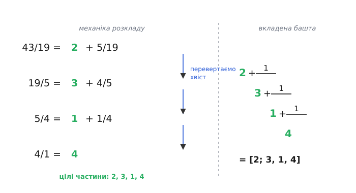
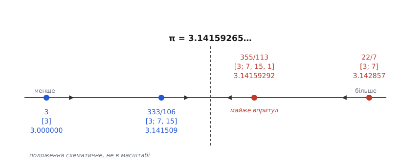
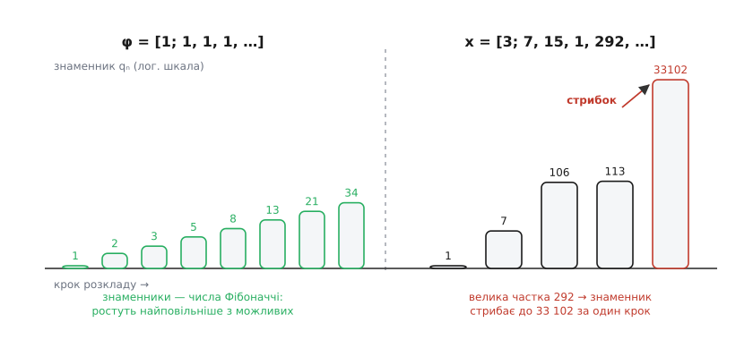

# Ланцюгові дроби

<preknowlist>
- [Алгоритм Евкліда](topic:math-number-theory/gcd-euclidean) — послідовне ділення з остачею, яким шукають найбільший спільний дільник; це та сама механіка, що стоїть за ланцюговим дробом.
- [Ірраціональні числа](topic:math-number-theory/irrational-numbers) — числа, які не можна записати відношенням двох цілих; саме на них ланцюговий дріб стає нескінченним.
</preknowlist>

Кожен, хто мав справу з числом π, знає наближення 22/7. Воно старше за десятковий запис самого π і досі живе в шкільних задачах. Але звідки воно взялося — і чому саме воно, а не якесь інше? Спробуймо обійти його «в лоб», через десятковий дріб. π = 3.14159…, обрубаємо на другій цифрі: 3.14 = 314/100 = 157/50. Дріб громіздкий (знаменник 50), а точність гірша, ніж у 22/7 із його знаменником 7. Візьмімо ще коротший дріб для π — 355/113. Він збігається з π аж до шостого знака після коми, і зробити це десятковим обрубанням просто неможливо: щоб дійти до такої точності десятковими, треба знаменник у мільйони.

Отже, звичайний десятковий запис **погано вміє знаходити прості дроби**, близькі до числа. І зрозуміло чому: десятка — випадковий вибір людства (стільки в нас пальців), вона нічого не знає про арифметичну природу π. Кожна десяткова цифра — це відповідь на питання «скільки тут десятих, сотих, тисячних», нав'язане самим числом 10, а не самим π.

Постає питання, з якого й народжуються ланцюгові дроби: **чи існує спосіб записати число, не обираючи жодної основи — так, щоб він сам, без нашого втручання, видавав найкращі прості наближення?** Виявляється, існує, і він єдиний природний. Число саме диктує свої «цифри».

### Як розкласти число, не обираючи основи

Візьмімо будь-яке число — хай для початку звичайний дріб 43/19 — і подивімося, що з ним можна зробити, не привертаючи жодної системи числення. Єдине, що дає нам саме число, — це його **ціла частина**: скільки цілих одиниць у ньому вкладається. У 43/19 вкладається дві одиниці (бо 2·19 = 38 ≤ 43, а 3·19 = 57 > 43), і лишається хвіст:

```
43/19 = 2 + 5/19
```

Хвіст 5/19 менший за одиницю — його цілою частиною вже нічого не візьмеш, вона нульова. Тут і криється єдиний природний хід. Дріб, менший за одиницю, незручний; але його **обернене** число більше за одиницю, отже, у нього знову є непорожня ціла частина. Перевернімо хвіст:

```
5/19  →  19/5 = 3 + 4/5
```

Ми зробили той самий крок, що й на початку: відділили цілу частину (3) і дістали новий хвіст 4/5, знову менший за одиницю. Перевертаємо його й повторюємо, аж поки хвіст не зникне:

```
4/5  →  5/4 = 1 + 1/4
1/4  →  4/1 = 4 + 0     ← хвіст зник, спиняємося
```

Тепер зберімо все докупи, підставляючи кожен перевернутий хвіст на його місце. Виходить башта з дробів:

```
43        1
── = 2 + ─────────
19            1
        3 + ─────────
                  1
            1 + ─────
                  4
```


*Ліворуч — механіка розкладу: на кожному щаблі відділяємо цілу частину (скільки цілих вкладається) і перевертаємо хвіст, менший за одиницю, щоб у нього знову з'явилася ціла частина. Праворуч — зібрана з цих цілих частин вкладена башта. Числа 2, 3, 1, 4 — це і є ланцюговий дріб.*

Оце й є **ланцюговий дріб** — число, записане як ланцюг вкладених «ціла частина плюс перевернений хвіст». Писати багатоповерхову башту незручно, тож її стискають у рядок, лишаючи самі цілі частини:

```
43/19 = [2; 3, 1, 4]
```

Крапка з комою після першого числа відділяє цілу частину всього числа від дробової начинки — далі йдуть коми. Числа 2, 3, 1, 4 називають **неповними частками** (бо кожне — це неповна, тобто ціла, частина від чергового ділення). І зверніть увагу: ми жодного разу не згадали ні десятку, ні двійку, ні будь-яку основу. Розклад визначило саме число.

### Це — алгоритм Евкліда, побачений з іншого боку

Придивімося до чисел, що пробігали в нашому розкладі: пари (43, 19), потім (19, 5), потім (5, 4), потім (4, 1). На кожному кроці ми ділили більше на менше, брали цілу частку й лишали остачу, а тоді робили остачу новим дільником. Але це ж дослівно [алгоритм Евкліда](topic:math-number-theory/gcd-euclidean) — та сама процедура, якою шукають найбільший спільний дільник двох чисел:

```
43 = 2·19 + 5        ← частка 2, остача 5
19 = 3· 5 + 4        ← частка 3, остача 4
 5 = 1· 4 + 1        ← частка 1, остача 1
 4 = 4· 1 + 0        ← частка 4, остача 0  →  НСД = 1
```

Частки в правому стовпчику — 2, 3, 1, 4 — це буква в букву неповні частки нашого ланцюгового дробу. Ланцюговий дріб раціонального числа **не що інше, як протокол алгоритму Евкліда для його чисельника й знаменника**. Це не збіг, а тотожність: відділити цілу частину від *a/b* — те саме, що поділити *a* на *b* з остачею, а перевернути хвіст — те саме, що поставити стару остачу новим дільником.

Із цієї тотожності одразу випливають три речі, які інакше довелося б доводити окремо. По-перше, **ланцюговий дріб будь-якого раціонального числа скінченний**: алгоритм Евкліда завжди спиняється (остачі суворо спадають і не бувають від'ємні), тож і башта має скінченну висоту. По-друге, **остання ненульова остача — це НСД**, тобто розклад заразом скорочує дріб: якщо остання остача 1, чисельник і знаменник взаємно прості. По-третє, розклад по суті **єдиний** — з однією маленькою двозначністю: останню частку, більшу за одиницю, завжди можна переписати, відщепивши від неї одиницю, бо `… + 1/n` при цілому n = `… + 1/(n−1 + 1/1)`. Тому [2; 3, 1, 4] і [2; 3, 1, 3, 1] — один і той самий дріб. Щоб уникнути плутанини, домовляються не закінчувати ланцюг одиницею — і тоді запис однозначний.

> 🔧 **Навіщо це.** Комп'ютер тримає дроби наближено, в рухомій комі, і 0.333333 для нього — просто послідовність бітів, а не «одна третя». Але якщо прогнати це число ланцюговим дробом, воно майже одразу згорнеться в [0; 3] = 1/3: великі неповні частки, що вискакують від похибки, легко відсікти. Так працює *раціональна реконструкція* — відновлення точного дробу з наближеного значення; нею користуються системи символьних обчислень і деякі криптографічні алгоритми, щоб повернутися від чисел із комою до чесної арифметики цілих.

### Дроби кінчаються, ірраціональні числа — ні

Скінченність розкладу трималася на тому, що алгоритм Евкліда спиняється. А він спиняється лише для дробів. Що станеться, якщо запустити ту саму машину на [ірраціональному числі](topic:math-number-theory/irrational-numbers) — такому, яке взагалі не є відношенням двох цілих?

Візьмімо √2 = 1.41421356… Ціла частина — 1, хвіст — (√2 − 1), число менше за одиницю. Перевертаємо хвіст, і тут стається несподіванка. Щоб позбутися кореня у знаменнику, домножимо і чисельник, і знаменник на (√2 + 1):

```
   1        √2 + 1        √2 + 1
────────  = ──────────── = ────── = √2 + 1
 √2 − 1     (√2−1)(√2+1)      1
```

Отже, обернений хвіст дорівнює √2 + 1 = 2 + (√2 − 1). Його ціла частина — 2, а хвіст — знову (√2 − 1), той самий, що й був. Машина зайшла в **цикл**: відтепер вона нескінченно видаватиме двійки.

```
√2 = [1; 2, 2, 2, 2, …] = [1; 2̄]
```

Погляньте, що сталося. Нескінченний, безладний десятковий хвіст 1.41421356… — де цифри не мають жодної видимої закономірності — обернувся кришталево простим періодичним записом: одиниця, а далі самі двійки. Ланцюговий дріб побачив у √2 порядок, якого десятковий запис не бачить у принципі.

Це не примха саме √2. **Лагранж** 1770 року (він тоді очолював математичне відділення Берлінської академії, успадкувавши місце від Ойлера) довів чудову теорему: ланцюговий дріб числа стає **періодичним** тоді й лише тоді, коли число є **квадратичною ірраціональністю** — коренем квадратного рівняння з цілими коефіцієнтами, як-от √2 (корінь x² − 2 = 0) чи (1+√5)/2. Періодичність у ланцюговому дробі — це відбиток «квадратичності» числа, так само як скінченність — відбиток його раціональності.

А що з числами, які не раціональні й не квадратичні? Їхні ланцюгові дроби нескінченні й неперіодичні, але часом усе одно мають візерунок. Ойлер 1737 року в праці «De fractionibus continuis» (латиною — «Про неперервні дроби»; звідси, до речі, і сам термін, що його ввів англієць Джон Валліс) показав, що основа натурального логарифма розкладається напрочуд ладно:

```
e = [2; 1, 2, 1, 1, 4, 1, 1, 6, 1, 1, 8, …]
```

Пари одиниць, розділені зростаючими парними числами, тягнуться без кінця — візерунок є, але періоду нема, бо *e* не квадратичне. А ось π не дає й такого:

```
π = [3; 7, 15, 1, 292, 1, 1, 1, 2, 1, 3, …]
```

Жодного закону, суцільний хаос. Ланцюговий дріб тут виступає як **градусник арифметичної глибини** числа: раціональне обривається, квадратичне зациклюється, а глибші числа тягнуть нескінченний неперіодичний ланцюг — і чим примхливіший ланцюг, тим «складніше» число.

### Підхідні дроби — сходинки, що ведуть до числа

Нескінченний ланцюг сам собою не полічиш. Але його можна **обривати** — на першій частці, на другій, на третій — і щоразу згортати обрізок назад у звичайний дріб. Ці обрізки й є те, заради чого все затівалося. Для π:

```
[3]              = 3/1        = 3
[3; 7]           = 22/7       ≈ 3.142857
[3; 7, 15]       = 333/106    ≈ 3.141509
[3; 7, 15, 1]    = 355/113    ≈ 3.1415929
```

Ось воно, шукане 22/7 — це просто ланцюговий дріб π, обірваний після другої частки. А 355/113 — після четвертої. Ці обрізки називають **підхідними дробами** (бо кожен наступний ще ближче підходить до числа). Розкладати башту згори щоразу заново — марудно; на щастя, підхідні дроби ростуть один з одного за простим правилом. Якщо чисельники позначити *pₙ*, а знаменники *qₙ*, то

```
pₙ = aₙ·pₙ₋₁ + pₙ₋₂
qₙ = aₙ·qₙ₋₁ + qₙ₋₂
```

— кожен новий чисельник і знаменник збирається з двох попередніх, зважених черговою неповною часткою *aₙ*. Звідки береться саме таке правило й чому воно працює, розписано окремо — у [виведенні рекурентної формули підхідних дробів](topic:math-number-theory/continued-fractions/math-convergents.md). Тут важливий результат: маючи неповні частки, підхідні дроби рахуються майже миттєво, додаванням і множенням, без жодного кореня чи ділення в стовпчик.

І ще одна річ упадає в око, коли випишеш підхідні дроби π у стовпчик: вони підходять до числа **по черзі з двох боків**. 3 — менше за π, 22/7 — більше, 333/106 — знову менше, 355/113 — більше. Кожен затискає π у щораз вужчу вилку між собою й попередником. Підхідні дроби не повзуть до числа з одного боку, як десяткові наближення, а обступають його з двох, замикаючи в лещата.


*Підхідні дроби обступають число з двох боків, як лещата: непарні — з одного боку, парні — з другого, і вилка між сусідами стрімко вужчає. Тому підхідний дріб не просто наближає число, а й одразу дає межу похибки — вона менша за відстань до наступного підхідного дробу.*

За цим чергуванням боків стоїть маленька, але могутня тотожність. Якщо взяти два сусідні підхідні дроби й перемножити їх «навхрест», різниця завжди дорівнює ±1:

```
pₙ·qₙ₋₁ − pₙ₋₁·qₙ = (−1)ⁿ⁻¹
```

Знак стрибає з кроком — ось звідки чергування боків. А сама рівність на ±1 означає, що *pₙ* і *qₙ* не мають спільних дільників: **кожен підхідний дріб уже нескоротний**, сам собою, без жодного скорочення. Ця ж тотожність — місток до цілого розділу арифметики, до чого ми ще повернемося.

### Чому це найкращі наближення з можливих

Підхідні дроби близькі до числа — це видно. Але сила їхня не в цьому, а в тому, що **ближче за них при такому знаменнику не підійде ніхто**. Строго: якщо *pₙ/qₙ* — підхідний дріб числа *x*, то жоден інший дріб зі знаменником, не більшим за *qₙ*, не лежить до *x* ближче. Підхідні дроби — це не просто добрі наближення, а **найкращі наближення** серед усіх дробів не складніших за них. Ось чому 22/7 живе у шкільних задачах, а десяткове 314/100 — ні: 314/100 має вп'ятеро більший знаменник і при цьому гірше.

Наскільки добре наближає підхідний дріб, підказує сам ланцюг. З лещат випливає межа похибки:

```
│x − pₙ/qₙ│ < 1/(qₙ·qₙ₊₁)
```

Похибка менша за одиницю, поділену на добуток двох сусідніх знаменників. А знаменник *qₙ₊₁ = aₙ₊₁·qₙ + qₙ₋₁* тим більший, чим більша **наступна** неповна частка *aₙ₊₁*. Отже, велика неповна частка одразу за підхідним дробом означає, що цей підхідний дріб надзвичайно точний. Пригадаймо π = [3; 7, 15, 1, **292**, …]: перед 292 стоїть підхідний дріб 355/113, і саме той гігантський стрибок 292 робить його майже неправдоподібно точним.

**Наскільки точне 355/113.**
```
наступний знаменник:  q₅ = 292·113 + 106 = 33 102
межа похибки:         1/(113 · 33 102) = 1/3 740 526 ≈ 2.7·10⁻⁷

перевірка:  355/113 = 3.14159292…
                  π = 3.14159265…
            різниця ≈ 2.7·10⁻⁷        ← точно в межах оцінки
```
Один-єдиний дріб зі знаменником у три цифри тримає π із похибкою менше три десятимільйонні. Не дивно, що китайський астроном Цзу Чунчжі знайшов саме 355/113 ще близько 480 року — і майже тисячу років ніхто у світі не побив цю точність.

> 🔧 **Навіщо це.** Коли треба відтворити задане відношення механічно — зубцями шестерень, кроками двигуна, дільником частоти, — знаменник підхідного дробу прямо каже, скільки зубців чи кроків знадобиться. Ґюйґенс, будуючи в XVII столітті механічний планетарій, мусив підібрати шестерні, що відтворюють відношення періодів обертання планет; він розклав ці відношення в ланцюгові дроби й узяв підхідні — так вийшли шестерні з небагатьма зубцями, що дають майже точний небесний рух. Той самий прийом і досі стоїть за розрахунком передавальних чисел і подільників частоти.

### Календар, побудований на ланцюговому дробі

Найяскравіше сила підхідних дробів видно там, де людство віками боролося з невдалим числом, — у календарі. Рік не вкладається в ціле число діб: земля обертається навколо Сонця приблизно за 365.2422 доби. Ті зайві 0.2422 доби на рік і треба якось надолужувати вставними днями — але скільки й через скільки років? Це буквально задача про найкраще наближення числа 0.2422 простим дробом. Розкладаємо:

```
0.2422 = [0; 4, 7, 1, 3, …]

підхідні дроби:
[0; 4]        = 1/4    = 0.2500     ← один вставний день на 4 роки
[0; 4, 7]     = 7/29   = 0.24138
[0; 4, 7, 1]  = 8/33   = 0.24242    ← вісім вставних днів на 33 роки
[0; 4, 7, 1, 3] = 31/128 = 0.24219
```

Перший же підхідний дріб, 1/4, — це юліанський календар: один додатковий день кожні чотири роки. Груба, зате проста мірка, і трималася вона понад півтори тисячі років. Наступний вагомий підхідний дріб, 8/33, дає куди точніший ритм — вісім вставних днів на кожні 33 роки. Саме такий 33-річний цикл поклав в основу перського сонячного календаря Омар Хаям зі своїми астрономами близько 1079 року, і за точністю він перевершив навіть теперішній григоріанський: григоріанська поправка 97/400 = 0.2425 відхиляється від 0.2422 більше, ніж хаямове 8/33 = 0.24242. Календар, яким ми користуємося щодня, — це застиглий підхідний дріб; просто в різні епохи люди зупинялися на різних щаблях того самого ланцюга.

### Найупертіше число

Якщо велика неповна частка робить наближення чудовим, то напрошується протилежне питання: **яке число наближати найважче?** Найгірший випадок настане, коли всі неповні частки якнайменші, тобто всі дорівнюють одиниці — меншими цілими додатними вони бути не можуть. Що це за число, у якого ланцюг — суцільні одиниці?

Позначмо його *x*. Раз ланцюг нескінченний і весь із одиниць, то під першою одиницею сидить точнісінько такий самий ланцюг, тобто знову *x*. Звідси число замикається саме на себе одним рівнянням:

```
x = 1 + 1/x
```

Домноживши на *x*, дістаємо x² = x + 1, тобто x² − x − 1 = 0, а звідси x = (1 + √5)/2 = 1.6180339… Це [золотий перетин](topic:math-number-theory/golden-ratio) φ — число, що зринає у правильному п'ятикутнику, у спіралях мушель і в пропорціях, які людське око вважає гармонійними.

```
φ = (1 + √5)/2 = [1; 1, 1, 1, 1, …] = [1̄]
```

Тепер порахуймо його підхідні дроби. Оскільки всі неповні частки — одиниці, рекурентне правило *qₙ = 1·qₙ₋₁ + qₙ₋₂* перетворюється на *qₙ = qₙ₋₁ + qₙ₋₂* — кожен знаменник є сумою двох попередніх. Це ж закон [чисел Фібоначчі](topic:math-number-theory/fibonacci-numbers)! І справді, підхідні дроби золотого перетину — це відношення сусідніх чисел Фібоначчі:

```
1/1,  2/1,  3/2,  5/3,  8/5,  13/8,  21/13,  34/21,  …  →  φ
```


*Знаменники підхідних дробів ростуть тим повільніше, чим менші неповні частки. Одиниці — найменші можливі, тому золотий перетин має найповільніше зростання знаменників (числа Фібоначчі) і найгіршу з усіх можливих швидкість наближення. Це й робить його «найбільш ірраціональним» числом.*

А ось у чому підступ. Похибка підхідного дробу менша за 1/(qₙ·qₙ₊₁) — але вона й **не набагато менша**: коли всі неповні частки дорівнюють одиниці, знаменники ростуть найповільніше з усіх можливих (повільніше за Фібоначчі не буває), тож і вилка звужується найповільніше. Золотий перетин — число, яке простими дробами наближати **найважче в усьому світі чисел**. Це не образний зворот, а точна теорема Гурвіца: для будь-якого ірраціонального *x* знайдеться нескінченно багато дробів із похибкою менше 1/(√5·q²), і стала √5 тут найкраща можлива — а досягається вона рівно на золотому перетині; для будь-якого числа, «менш ірраціонального» за нього, вона з запасом виконується.

Ця впертість — не курйоз, а річ, яку природа використовує. Соняшник, розкладаючи насінини, повертає кожну наступну на сталий кут відносно попередньої. Якби цей кут був раціональною часткою повного оберту — скажімо, 1/5 кола, — насінини вишикувалися б у п'ять променів і між ними зяяли б порожнечі. Щоб насінини ніколи не потрапляли одна одній «у слід», кут має бути якнайдалі від будь-якого простого дробу — тобто кутом золотого перетину. Рослина неусвідомлено обрала найбільш ірраціональне число, бо саме воно дає найщільніше, найрівномірніше пакування.

### Де ще це працює

Тотожність про хрест-навхрест — `pₙ·qₙ₋₁ − pₙ₋₁·qₙ = ±1` — це не просто пояснення чергування знаків. Перепишіть її для останніх двох підхідних дробів звичайного дробу *a/b*, і ви дістанете розв'язок рівняння *a·x + b·y = 1* у цілих числах. Тобто ланцюговий дріб дає готовий рецепт для [лінійних діофантових рівнянь](topic:math-number-theory/linear-diophantine) і для [оберненого елемента за модулем](topic:math-number-theory/modular-inverse) — того самого, на якому тримається розшифрування в RSA: щоб знайти обернене до *a* за модулем *b*, досить розкласти *a/b* у ланцюговий дріб і взяти передостанній підхідний дріб.

Для квадратичних ірраціональностей ланцюговий дріб розв'язує знамените [рівняння Пелля](topic:math-number-theory/pell-equation) *x² − N·y² = 1*: його найменший цілий розв'язок ховається серед підхідних дробів √N — це класичний результат Лагранжа, яким він скористався ще у XVIII столітті.

І, як завжди буває з гострим інструментом, ним можна не лише будувати, а й ламати. Якщо в RSA нерозважливо взяти маленький секретний показник *d*, то відкриті дані задають дріб, серед підхідних дробів якого сидить саме *d*. Майкл Вінер 1990 року показав: щойно *d* менший приблизно за корінь четвертого степеня з модуля, зловмисник розкладає відкритий дріб у ланцюговий, перебирає його небагато підхідних дробів — а їх лише порядку логарифма від модуля — і знаходить секретний ключ за лічені кроки. Ціла [криптосистема з відкритим ключем](topic:sf-security/public-key-crypto) валиться від того, що знаменник підхідного дробу занадто добре наближає потрібне відношення. Історія та математика цих сюжетів — окремо, у [нарисі про народження ланцюгових дробів](topic:math-number-theory/continued-fractions/hist-birth.md), а сам алгоритм пошуку найкращого наближення й код до нього — у [розборі обчислення підхідних дробів](topic:math-number-theory/continued-fractions/proj-best-approximation.md).

За всіма цими сюжетами — календарем, шестернями, соняшником, зламом шифру — стоїть одна річ. Десятковий запис показує число крізь випадкові окуляри основи 10; ланцюговий дріб знімає ці окуляри й показує число таким, яким його бачить сама арифметика. Він народжується з алгоритму Евкліда, обривається на раціональних, зациклюється на квадратичних, і на кожному щаблі видає найкоротший дріб, ближчого за який не буває. Це не ще один спосіб писати числа — це їхній справжній, незалежний від основи відбиток.
