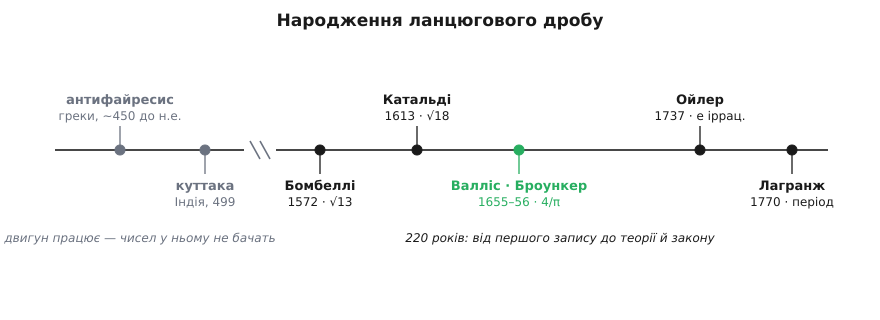

# 📜 Народження ланцюгового дробу: дві тисячі років між машиною і числом

Ланцюговий дріб виростає з алгоритму Евкліда — а той старший за дві тисячі років; то чому саму назву «ланцюговий дріб» цей запис дістав аж у XVII столітті, а теорію — у XVIII? Цей нарис — про дорогу від грецької машини для ділення до усвідомлення, що вона весь той час писала числа, і про тих кільканадцятьох людей від Афін до Берліна, що врешті це побачили.


*Двигун — грецьке взаємне віднімання — працює вже дві тисячі років, а чисел у ньому не бачать. Коли ж нарешті побачили, вся будова постала за якихось 220 років: від першого явного запису Бомбеллі до Ойлерової теорії й Лагранжевого закону.*

### Грецький засів: машина, у якій не бачили чисел

Уся механіка ланцюгового дробу — відняти, скільки влазить, перевернути залишок, повторити — вже стояла готова в грецькій математиці. Греки називали цю процедуру **антифайресис** (гр. ἀνθυφαίρεσις — взаємне, почергове віднімання): від більшої з двох величин віднімай меншу, скільки вдасться, тоді помінятими ролями роби те саме із залишком, і так далі. Це буква в букву [алгоритм Евкліда](root:math-number-theory/gcd-euclidean) — те саме послідовне ділення з остачею, яким шукають найбільший спільний дільник двох чисел. Процедура з'явилася в колі піфагорійців і геометрів Платонової академії — насамперед Теетета — і потрапила до «Начал» Евкліда (книги VII і X, близько 300 до н.е.); сам термін трапляється ще в Арістотеля. Machина, отже, старша за Евкліда — і назва «алгоритм Евкліда» вже сама по собі трохи спрощення, бо крутили її задовго до нього.

І ось у чому загадка: маючи цю машину дві тисячі років, греки не побачили в ній ланцюгового дробу. Причина не в кмітливості, а в тому, **навіщо** вони її крутили. Для грека антифайресис відповідав на одне питання — чи мають дві довжини спільну міру, тобто чи вкладається в обидві якийсь третій відрізок ціле число разів. Якщо віднімання колись обривалося — міра є, довжини **сумірні**. Якщо тривало без кінця — спільної міри немає, довжини [несумірні](root:math-number-theory/irrational-numbers), а їхнє відношення не є відношенням цілих. Саме так відкрили, що діагональ квадрата несумірна з його стороною. Машина слугувала доведенням — інструментом, щоб сказати «так» або «ні», — а не способом записати число. Щоб побачити в поверхах віднімання **число**, бракувало самої думки: що число можна не назвати точно, а наблизити — щораз кращими простими дробами. Цієї думки в грецькій математиці, з її суто геометричним відношенням і без позиційного запису, просто не було.

Той самий двигун тим часом жив і власним життям на сході: індійські астрономи крутили його не заради несумірності, а щоб розв'язувати цілочислові рівняння — метод «куттака» (санскр. kuṭṭaka — подрібнювач) описав Аріабгата ще 499 року. Історія цього застосування — окремо, у [лінійних діофантових рівняннях](root:math-number-theory/linear-diophantine); тут важливо лиш те, що ту саму евклідову шестерню століттями крутили в різних краях, і ніде ще з неї не випадало «нове письмо для чисел».

### Болонья: перший явний ланцюг

Побачили його аж у XVI столітті, і не в геометра, а в людей, що воювали з квадратним коренем. Щоб добути √13 чи √18, потрібне було наближення — і саме тут природно виростає вкладений дріб. **Рафаель Бомбеллі** (Rafael Bombelli, 1526–1572), болонський інженер-осушувач боліт і математик, у своїй «L'Algebra» (1572) для √13 виписав по суті ось таку вежу:

```
√13 = 3 + 4/(6 + 4/(6 + 4/(6 + …)))
```

Чому саме така? √13 = 3 + (√13 − 3), а (√13 − 3)(√13 + 3) = 13 − 9 = 4, тож √13 − 3 = 4/(6 + (√13 − 3)) — і хвіст відтворює сам себе, як у дзеркалі. Бомбеллі перший поставив цю нескінченну вкладену конструкцію як **робочий обчислювальний засіб**, а не побічний слід віднімання. Через це історики й кажуть, що теорія ланцюгових дробів починається з нього — з обережним застереженням: сам Бомбеллі про «ланцюговий дріб» не думав, у нього це був спосіб добувати корені, а не окремий об'єкт.

Наступний крок зробив його земляк **П'єтро Антоніо Катальді** (Pietro Antonio Cataldi, 15 квітня 1552 — 11 лютого 1626), теж болонець, викладач математики в Болоньї та Флоренції. У праці «Trattato del modo brevissimo di trovar la radice quadra delli numeri» («Трактат про найкоротший спосіб знаходити квадратний корінь чисел»; оголошено 1603, видано 1613) він розклав √18:

```
√18 = 4 + 2/(8 + 2/(8 + 2/(8 + …)))
```

і зробив дві речі, яких не було в Бомбеллі. По-перше, дав цим поверхам ім'я — «rotti di rotti», *дроби дробів*. По-друге, вигадав для них перший спеціальний запис (через & і крапки, щоб показати, як дріб чіпляється за дріб). Це вже усвідомлений об'єкт зі своєю нотацією, хоч і без загальної теорії. Катальді, до речі, був схиблений на числах взагалі: ще 1588 року він перевірив, що 2¹⁷ − 1 і 2¹⁹ − 1 прості, і тим дав шосте й сьоме досконалі числа — той самий болонський дух копирсання в коренях і простих.

Зверніть увагу на одну рису обох болонських дробів: чисельники в них **не одиниці** (4 у Бомбеллі, 2 у Катальді). Це так званий *узагальнений* ланцюговий дріб — ширший за звичайний, де над кожною рискою стоїть 1. Саме узагальнена форма так гладко ловить квадратний корінь: корінь сам диктує сталий чисельник і сталий знаменник, і вежа виходить періодичною з першого ж поверху. Болонья, отже, приборкала алгебричні корені — але до чисел на кшталт π цим шляхом було ще далеко.

### Англія, 1655: у дробу з'являється ім'я

Саму назву «continued fraction» дала не Італія, а Англія, і народилася вона у співпраці двох дуже різних людей. **Джон Валліс** (John Wallis, 1616–1703) — оксфордський професор геометрії і водночас головний шифрувальник парламенту, який під час громадянської війни розшифровував перехоплені роялістські депеші. Ганяючись за площею круга, Валліс вивів свій знаменитий нескінченний добуток для π і, шукаючи для того самого числа ще й форму дробу, підбив на задачу друга — **Вільяма Броункера** (William Brouncker, бл. 1620 — 1684), майбутнього першого президента Лондонського королівського товариства. Навесні 1655 Броункер видав напрочуд гарну відповідь:

```
4/π = 1 + 1²/(2 + 3²/(2 + 5²/(2 + 7²/(2 + …))))
```

— непарні квадрати над сталими двійками, вежа без кінця. Валліс надрукував цей дріб у своїй «Arithmetica Infinitorum» і, коментуючи його, назвав таку конструкцію латиною **fractio continua** — «тягнутий, неперервний дріб». Так у запису з'явилося ім'я, яке живе досі. (Дату коментаря звично подають як 1653 рік, хоча повністю книгу надрукували 1656-го — тут джерела трохи розходяться, але авторство терміна за Валлісом не оспорюють.)

У цій англійській сцені сховані дві тонкощі, варті того, щоб їх розрізнити. Перша: об'єкт — Броункерів, а ім'я — Валлісове; винахід і назва тут належать різним людям, і жоден із них ланцюгового дробу не «відкрив» — це вже зробила Болонья. Друга, важливіша: болонці приборкували **корені** — квадратичні числа, чиї вежі періодичні; Броункер уперше дотягся нескінченним ланцюгом до π — числа зовсім іншої, глибшої породи. Дріб перестав бути хитрощами для добування коренів і став претендувати на роль універсального письма для будь-якого числа.

### Петербург, 1737: із розсипу прийомів — теорія

Досі ланцюгові дроби були саме розсипом прийомів: тут корінь, там π, кожен випадок сам по собі. У теорію їх звів **Леонард Ойлер** (Leonhard Euler, 1707–1783). У Петербурзькій академії 7 березня 1737 року він подав працю «De fractionibus continuis dissertatio» («Міркування про неперервні дроби»; надрукована 1744). Це перший систематичний виклад: Ойлер вивів рекурентне правило для підхідних дробів, довів їхні головні властивості, розібрав, як переганяти ряд у ланцюг і навпаки. А вінцем стало ось що — він показав, що регулярний ланцюг числа e тягнеться без кінця з чітким візерунком:

```
e = [2; 1, 2, 1, 1, 4, 1, 1, 6, 1, 1, 8, …]
```

Раз ланцюг нескінченний, число не може бути дробом — отже, e [ірраціональне](root:math-number-theory/irrational-numbers). Це було **перше в історії доведення ірраціональності e**, і прийшло воно саме з ланцюгового дробу. Тут гарний поворот: Ойлер дійшов до всього цього не від Валліса й не від Броункера, про чиї праці спершу навіть не спирався, а розв'язуючи диференціальне рівняння Ріккаті — ланцюговий дріб випав йому побічним продуктом зовсім іншої задачі й тільки потім розрісся в окрему теорію. Це і є та межа, за якою розрізняють «мати прийом» і «мати науку»: до Ойлера ланцюговими дробами користувалися, від Ойлера їх почали **вивчати**.

### Берлін, 1770: закон, що замкнув коло

Останній камінь у підмурок поклав **Жозеф-Луї Лагранж** (Joseph-Louis Lagrange, 1736–1813). Показово, де саме: він успадкував у Берлінській академії те самісіньке крісло голови математичного класу, яке звільнив Ойлер, повернувшись до Петербурга, — теорія перейшла з рук у руки буквально через одне сидіння. Доповідь Лагранж прочитав 25 серпня 1769 року, а надрукував 1770-го, і довів у ній **закон періодичності**: регулярний ланцюг числа стає з певного місця періодичним тоді й лише тоді, коли саме число — квадратична ірраціональність, тобто корінь квадратного рівняння з цілими коефіцієнтами (як √2 чи (1+√5)/2).

Ця теорема замкнула трикутник, що почався ще з греків. Скінченний ланцюг ⟺ раціональне число (це, по суті, і є те, що бачив антифайресис: обірвалося віднімання — є спільна міра). Періодичний ланцюг ⟺ квадратична ірраціональність (Лагранж). Нескінченний неперіодичний ⟺ число ще глибшої породи, як e чи π. Ланцюговий дріб із хитрощів для коренів перетворився на **прилад, що читає арифметичну природу числа з самого візерунка його поверхів**. Тим самим знаряддям Лагранж розв'язав і рівняння Пелля — але це вже інша розповідь.

Отже, машину зібрали греки, а числа в ній розгледіли аж через дві тисячі років — і не одна людина, не один народ. Грецький антифайресис доводив несумірність; індійська куттака дробила рівняння; болонські інженери приборкали ним квадратні корені; англійський лорд дотягся до π, а оксфордський шифрувальник дав дробу ім'я; Ойлер зробив теорію, Лагранж — закон. «Винахідника ланцюгового дробу» не існує, бо винаходили не запис, а думку: що число можна вловити його власною спадною чергою найкращих дробів, не питаючи в нього жодної основи. Визрівала ця думка так повільно саме тому, що машина, яка її втілює, увесь той час стояла в усіх на очах — і мовчала.
