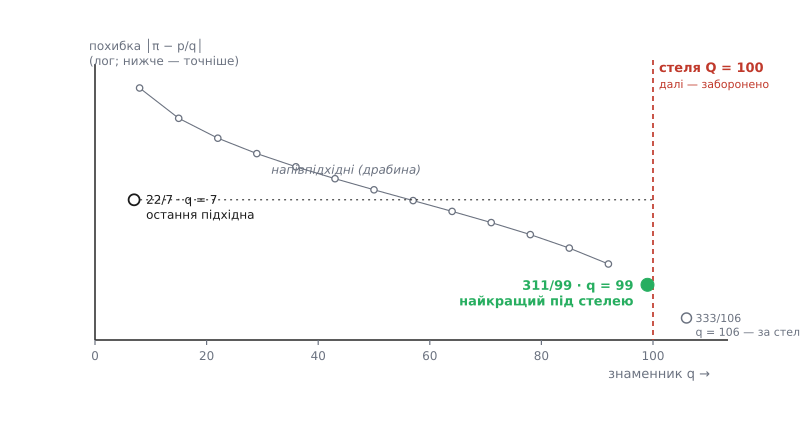

# 🎯 Найкращий дріб зі стелею на знаменник

Задано число *x* і стелю *Q*. Знайти дріб *p/q*, у якого знаменник не більший за *Q*, а сам він лежить до *x* ближче, ніж будь-який інший такий дріб. Ось процедура, що робить це за десяток арифметичних дій, і код, який можна взяти й запустити.

Формально задача звучить так:

```
знайти p/q, що мінімізує │x − p/q│
за умови  1 ≤ q ≤ Q,   q, p — цілі
```

Стеля тут — не примха. Знаменник майже завжди впирається у фізичний бюджет: скільки зубців можна нарізати на шестерні, на скільки кроків ділиться такт, скільки бітів відведено дробовій частині у форматі з фіксованою комою, через скільки років дозволено вставляти високосний день. У кожному з цих випадків нескінченно точний дріб непотрібний — потрібен найкращий із тих, що фізично вкладаються. Задача про наближення зі стелею на знаменник — це задача про найдешевший механізм, що відтворює задане відношення.

## Кістяк: зривати цілі частини

Механіка розкладу проста, і вона тримається на [алгоритмі Евкліда](topic:math-number-theory/gcd-euclidean) — тому самому послідовному діленні з остачею, яким шукають найбільший спільний дільник. Від числа беремо **цілу частину** *a₀ = ⌊x⌋*, лишається хвіст, менший за одиницю; його **перевертаємо** (обернене більше за одиницю — у нього знову є ціла частина) і повторюємо. Цілі частини *a₀, a₁, a₂, …*, що вискакують на кожному щаблі, — це неповні частки ланцюгового дробу.

Обривати цей ланцюг на кожному кроці й згортати обрізок назад у звичайний дріб не треба заново — обрізки (їх називають **підхідними дробами**) ростуть один з одного за рекурентою. Якщо чисельники позначити *pₙ*, знаменники *qₙ*, то

```
pₙ = aₙ·pₙ₋₁ + pₙ₋₂
qₙ = aₙ·qₙ₋₁ + qₙ₋₂
```

зі стартовими *p₋₁/q₋₁ = 1/0* і *p₋₂/q₋₂ = 0/1*, щоб перший же крок дав *p₀/q₀ = a₀/1*. Кожен підхідний дріб — найкраще наближення для свого розміру знаменника, а знаменники зростають щонайповільніше як числа Фібоначчі, тобто не повільніше за геометричну прогресію. Тому вже через десяток кроків знаменник переростає будь-яку розумну стелю. Напрошується проста стратегія: крутити рекуренту, доки *qₙ* не перескочить *Q*, і повернути останній підхідний дріб, що влізає.

**Ця проста стратегія неправильна.** І помилка не рідкісна дрібниця на краю — вона спрацьовує на найзвичайніших вхідних даних.

## Пастка: остання підхідна — ще не відповідь

Візьмімо *x = π* і стелю *Q = 100*. Підхідні дроби π ідуть 3/1, 22/7, 333/106, … Знаменник 106 пробиває стелю, тож наївна стратегія віддасть 22/7 із похибкою близько 0.0013. Але погляньте на дріб **311/99**: його знаменник 99 ≤ 100, а до π він у сім разів ближчий — похибка лише 0.00018. Наївний перебір підхідних дробів його не побачив і видав відповідь усемеро гіршу за наявну.

Звідки взявся 311/99, якщо серед підхідних дробів його немає? Між двома сусідніми підхідними дробами ховається ціла драбина проміжних. Візьміть попередній підхідний дріб *pₙ₋₁/qₙ₋₁* і додавайте до нього *pₙ/qₙ* по одному разу:

```
        pₙ₋₁ + t·pₙ
sₜ  =  ─────────────      t = 1, 2, …, aₙ₊₁ − 1
        qₙ₋₁ + t·qₙ
```

Ці дроби називають **напівпідхідними** (проміжними). При *t = 0* це попередній підхідний дріб, при *t = aₙ₊₁* — уже наступний; між ними драбина монотонно підповзає до *x* з одного боку, а знаменник щоразу підростає рівно на *qₙ*. Отже, треба взяти найвищий щабель, чий знаменник ще влазить під стелю:

```
t = ⌊(Q − qₙ₋₁) / qₙ⌋
```

Для π при *Q = 100*: попередній підхідний дріб 3/1 (тобто *qₙ₋₁ = 1*), останній, що влізає, — 22/7 (*qₙ = 7*), а наступна неповна частка *aₙ₊₁ = 15*. Тоді *t = ⌊99/7⌋ = 14*, і напівпідхідний виходить *(3 + 14·22)/(1 + 14·7) = 311/99* — рівно той дріб. Драбина від 3/1 повзе вгору до 333/106; щабель *t = 15* дав би сам 333/106 зі знаменником 106, але він за стелею, тож зупиняємось на *t = 14*.


*Кожна точка — дріб; по горизонталі його знаменник, по вертикалі похибка (що нижче, то точніше). Підхідні дроби 22/7 і 333/106 — це кінці драбини напівпідхідних, що збігає вниз між ними. Стеля Q = 100 відрізає 333/106; найнижча точка ліворуч від стелі — 311/99, і вона лежить глибоко під рівнем 22/7. Ось чому «остання підхідна, що влізла» — не відповідь.*

Лишається один запобіжник. Коли щабель *t* малий (менший за половину *aₙ₊₁*), напівпідхідний ще не встиг обігнати сам підхідний дріб *pₙ/qₙ*, і ближчим лишається той. Коли *t* великий — перемагає напівпідхідний. Замість розбирати випадки з половиною частки простіше **порівняти дві відстані** й лишити меншу: це завжди дає правильну відповідь. Саме на цьому — вибір між підхідним і напівпідхідним дробом — стоїть стандартна `Fraction.limit_denominator` у Python.

> 🔧 **Навіщо це.** Є дві різні «найкращості», і їх легко переплутати. Наближення **другого роду** мінімізує *│q·x − p│* — і такими є рівно підхідні дроби, без винятків. Наближення **першого роду** мінімізує *│x − p/q│* — саме про нього питає задача зі стелею на знаменник, і сюди вже входять напівпідхідні. Якщо повертати самі підхідні дроби, ви бездоганно відповідаєте на друге питання, тоді як задача — про перше; біля стелі ці відповіді розходяться, і 311/99 проти 22/7 — жива ціна цієї плутанини.

## Робочий код

Процедура цілочисельна й теоретико-числова, тож зважена оцінка мов тягне у два боки. C++ дає точність і швидкість: увесь рахунок — у цілих, порівняння відстаней теж цілочисельне, без жодної коми. Python бере ясністю й тим, що цілі в ньому необмежені (переповнення просто не існує), а `Fraction` дає точний раціональний вхід задарма. Обидва варіанти реалізують той самий алгоритм: розклад Евкліда → рекурента підхідних дробів → напівпідхідний під стелею → вибір ближчого.

:::tabs
```cpp
#include <cstdint>
#include <cstdlib>   // llabs

struct Frac { long long p, q; };

// floor(a / b) для b > 0 (цілочисельне ділення в C++ округляє до нуля,
// тож для від'ємного діленого потрібна поправка):
static long long floordiv(long long a, long long b) {
    long long t = a / b;
    return (a % b < 0) ? t - 1 : t;
}

// Найближчий до a/b дріб p/q зі знаменником 1 ≤ q ≤ Q.
// Вхід ТОЧНИЙ: a, b цілі, b ≠ 0, Q ≥ 1. Повертає нескоротний {p, q}.
// Припущення: значення комфортно вкладаються в int64 (до ~1e9).
Frac best_rational(long long a, long long b, long long Q) {
    if (b < 0) { a = -a; b = -b; }          // тримаємо знаменник додатним
    long long num = a, den = b;
    long long p = 1, pp = 0;                 // чисельники підхідних «−1» і «−2»
    long long q = 0, qq = 1;                 // знаменники «−1» і «−2»

    while (den != 0) {                       // кроки Евкліда для (a, b)
        long long ai = floordiv(num, den);   // чергова неповна частка
        long long qn = ai * q + qq;          // знаменник наступного підхідного

        if (qn > Q) {                        // стеля пробита — шукаємо напівпідхідний
            long long t = (Q - qq) / q;      // найвищий щабель, що влазить
            if (t > 0) {
                long long sp = pp + t * p, sq = qq + t * q;
                // порівняти │a/b − p/q│ і │a/b − sp/sq│ без дробів:
                //   │a·q − b·p│·sq   vs   │a·sq − b·sp│·q   (спільний множник b скорочено).
                // Множимо в __int128 — потрійний добуток легко перебиває int64:
                __int128 e1 = (__int128)a * q  - (__int128)b * p;   if (e1 < 0) e1 = -e1;
                __int128 e2 = (__int128)a * sq - (__int128)b * sp;  if (e2 < 0) e2 = -e2;
                if (e2 * q < e1 * sq) return { sp, sq };            // напівпідхідний ближчий
            }
            return { p, q };                 // інакше лишається сам підхідний
        }

        long long pn = ai * p + pp;          // чисельник наступного підхідного
        pp = p; qq = q; p = pn; q = qn;      // зсув вікна рекуренти
        long long rem = num - ai * den;      // остача Евкліда, 0 ≤ rem < den
        num = den; den = rem;
    }
    return { p, q };                         // ланцюг обірвався: a/b влазить точно
}
```
```py
from fractions import Fraction
from math import floor

def best_rational(x, Q):
    """Найближчий до x дріб p/q зі знаменником 1 ≤ q ≤ Q (Q ≥ 1).
    x — int, float або Fraction; повертає Fraction.
    Те саме, що stdlib Fraction(x).limit_denominator(Q), лише з відкритим нутром."""
    target = x if isinstance(x, Fraction) else Fraction(x)
    a = floor(target)
    pp, qq = 1, 0                    # підхідний «−1»:  1/0
    p,  q  = a, 1                    # підхідний [a₀]:  a/1
    frac = target - a

    while frac != 0:
        y = 1 / frac                 # перевертаємо хвіст — це крок Евкліда
        a = floor(y)
        p2, q2 = a*p + pp, a*q + qq  # наступний підхідний за рекурентою
        if q2 > Q:                   # він вискочить за стелю — спиняємось
            break
        pp, qq, p, q = p, q, p2, q2  # зсуваємо вікно
        frac = y - a

    best = Fraction(p, q)            # остання підхідна, що влізла
    if frac != 0:                    # ланцюг не скінчився → є напівпідхідні
        t = (Q - qq) // q            # найвищий щабель: qq + t·q ≤ Q
        if t > 0:
            semi = Fraction(pp + t*p, qq + t*q)
            if abs(target - semi) < abs(target - best):
                best = semi          # напівпідхідний виявився ближчим
    return best
```
:::

**Пастка на живому числі: best_rational(π, 100).**
```
a₀ = ⌊π⌋ = 3        →  підхідний 3/1
a₁ = 7             →  22/7,   q = 7   ≤ 100   беремо
a₂ = 15            →  333/106, q = 106 > 100  СТОП
   стеля пробита. попередній підхідний 3/1 (qq = 1), останній 22/7 (q = 7)
   t = ⌊(100 − 1) / 7⌋ = 14
   напівпідхідний = (3 + 14·22)/(1 + 14·7) = 311/99,  q = 99 ≤ 100
   │π − 311/99│ = 1.79·10⁻⁴  <  │π − 22/7│ = 1.26·10⁻³   →  ближчий
відповідь: 311/99
```
Наївний варіант тут спинився б на 22/7; правильний — на всемеро точнішому 311/99.

## Складність

Кількість кроків — це кількість ділень в алгоритмі Евкліда, а вона логарифмічна від знаменника. **Габріель Ламе** (французький математик) 1844 року довів чіткий верхній край: ділень не більше ніж уп'ятеро від кількості десяткових цифр меншого числа. Найгірший випадок настає, коли всі неповні частки дорівнюють одиниці, — тоді рекурента *qₙ = qₙ₋₁ + qₙ₋₂* стає законом Фібоначчі, знаменники ростуть щонайповільніше, а кроків найбільше: близько *1.44·log₂ qₙ*. Отже, для стелі аж до мільярда алгоритм укладається приблизно в сорок кроків, кожен — кілька цілочисельних операцій.

Порівняйте це з лобовим перебором: пройти всі знаменники *q = 1 … Q*, для кожного взяти найближчий чисельник і зберегти найкращу пару. Це *O(Q)* — лінійно від стелі. Ланцюговий дріб дає ту саму відповідь за *O(log Q)* — експоненційно швидше; там, де перебір робить мільярд ділень, Евклід робить сорок.

## Пастки

**Шум рухомої коми.** Якщо на вхід приходить [число з рухомою комою](topic:hw-arch/floating-point), яке «насправді» є простим відношенням, розклад спершу видасть кілька чесних неповних часток, а тоді двійковий хвіст числа впорсне гігантську частку — на кшталт 10¹⁵, — чисту цифрову сміттєвину від округлення. Два запобіжники: сама стеля (`q > Q`) звичайно відрізає раніше, ніж вилізе сміття; а якщо стелі мало, спиняйтеся за точністю входу — щойно *│x − p/q│* провалюється нижче за відому точність числа або чергова неповна частка на порядки переростає всі попередні. Це і є **раціональна реконструкція** — відновлення чесного дробу, замість якого стояло число з комою. У Python `Fraction(0.1)` — це монстр `3602879701896397/36028797018963968`, зате `.limit_denominator(1000)` повертає рівно `1/10`.

**Переповнення.** Цілочисельне порівняння відстаней множить *a·q*, потім результат на *sq* — це потрійний добуток. Для *a, b* близько 10⁹ і *Q* близько 10⁴ він перескакує 10¹⁷ і рве int64. Тому в C++ добуток рахують у `__int128` (у коді так і зроблено); Python цієї турботи не має взагалі — його цілі ростуть без стелі, і саме тому він тут такий безтурботний.

**Знак і крихітна стеля.** Від'ємне *x* обробляється само собою: *a₀* виходить від'ємним, решта неповних часток — додатні, рекурента не змінюється. Стеля *Q = 1* стискає задачу до «найближчого цілого», і той самий код дає його — порівняння відстаней тихо перетворюється на округлення. Єдина вимога — *Q ≥ 1*.

**Не пропустити напівпідхідний.** Це найчастіша помилка саморобних версій: повернути останній підхідний дріб під стелею. Вона правильна рівно тоді, коли стеля потрапляє на знаменник якогось підхідного дробу, і мовчки хибна між ними — точнісінько як у пастці з π і *Q = 100*. Стеля перетворює нескінченну драбину підхідних дробів на скінченне питання, і чесна відповідь лежить за одне порівняння від наївної: не зробите цього порівняння — і шестерня дістане не той зубець.
