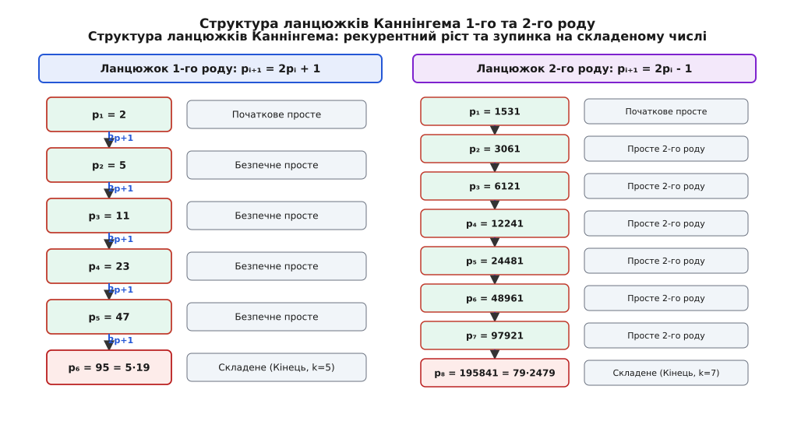
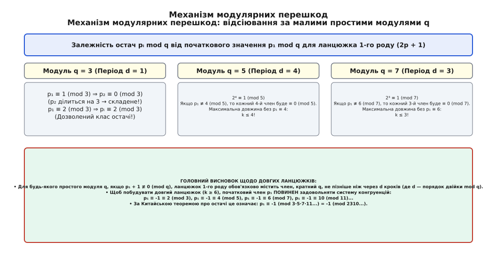
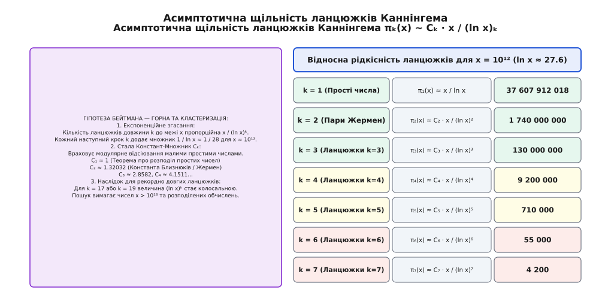

# Ланцюжки Каннінгема

<preknowlist>
- [Прості числа](topic:math-number-theory/prime-numbers) — цілі числа, що мають рівно два натуральні дільники.
- [Прості числа Софі Жермен](topic:math-number-theory/germain-primes) — зв'язок p ↦ 2p + 1 між простими числами.
- [Мала теорема Ферма](topic:math-number-theory/fermat-little-theorem) — порівняння за простим модулем та порядки елементів.
- [Китайська теорема про остачі](topic:math-number-theory/chinese-remainder-theorem) — розв'язання систем лінійних порівнянь.
</preknowlist>

У криптографічних протоколах обміну ключами з відкритим ключем (таких як асиметрична система Діффі — Геллмана, підписи Ель-Ґамаля чи алгоритм цифрового підпису DSA) безпека операцій у мультиплікативній групі остач за простим модулем `q` вимагає, щоб порядок цієї групи `q - 1` не розкладався на малі прості множники. Якщо число `q - 1` є гладким (тобто розкладається лише на дрібні прості дільники `q - 1 = p₁ᵉ¹ · p₂ᵉ² ... pᵣᵉʳ`), алгоритм Поліга — Геллмана миттєво розщеплює складну задачу дискретного логарифмування `gˣ ≡ y (mod q)` на серію тривіальних задач у малих підгрупах порядків `pᵢᵉⁱ`. Зловмисник знаходить остачі секретного ключа `x mod pᵢᵉⁱ` для кожного малого дільника і за допомогою Китайської теореми про остачі відновлює повний секретний ключ `x` за лічені мілісекунди.

Для надійного захисту від атак розщеплення обране просте число `q` повинно бути безпечним простим числом вида `q = 2p + 1`, де `p` — також велике просте число. У такій групі порядок `q - 1 = 2p` містить єдиний гігантський простий дільник `p`, тому зловмисник не може розщепити задачу, а складність обчислення дискретного логарифма визначається величиною `√p` і є максимально можливою для даного розміру ключа.

Однак у сучасних багаторівневих криптографічних протоколах (зокрема у доведеннях із нульовим розголошенням Zero-Knowledge Proofs, порогових схемах ієрархічного підпису або при побудові ланцюжків сертифікатів простоти) одного кроку безпечності `2p + 1` виявляється недостатньо. Якщо число `p - 1` виявиться гладким, структура розпадається на внутрішньому алгебраїчному рівні. Це змушує будувати не просто поодинокі пари Жермен, а послідовні каскади простих чисел `p₁ ↦ 2p₁ + 1 ↦ 2(2p₁ + 1) + 1 ...`, у яких кожний наступний член одночасно слугує безпечним простим числом для попереднього та простим числом Софі Жермен для наступного.

Послідовності простих чисел, згенеровані такими лінійними рекурентними формулами, називають **ланцюжками Каннінгема**. Вони є фундаментальними арифметичними об'єктами, які пов'язують теорію диофантових порівнянь, асимптотичні закони розподілу простих чисел та обчислювальні алгоритми сучасної криптографії.

## 1. Рекурентне зростання: формальне означення та типи ланцюжків

У теорії чисел впроваджено суворе класичне розрізнення ланцюжків Каннінгема за видом лінійного перетворення, яке пов'язує сусідні члени послідовності.

### Ланцюжки Каннінгема першого роду

Послідовність простих чисел `(p₁, p₂, ..., pₖ)` називають **ланцюжком Каннінгема першого роду** (англ. *Cunningham chain of the first kind*) довжини `k`, якщо для всіх елементів з індексами `1 ≤ i < k` виконується арифметична умова подвоєння зі збільшенням на одиницю:

```
pᵢ₊₁ = 2 · pᵢ + 1
```

У такому ланцюжку кожне число `pᵢ` при `i < k` за означенням є **простим числом Софі Жермен**, а кожне число `pᵢ` при `i > 1` — **безпечним простим числом**.

Обчислимо початкові члени ланцюжка першого роду, що починається з найменшого простого числа `p₁ = 2`:

```
p₁ = 2                              [початкове просте число]
p₂ = 2(2) + 1 = 5                   [просте число]
p₃ = 2(5) + 1 = 11                  [просте число]
p₄ = 2(11) + 1 = 23                 [просте число]
p₅ = 2(23) + 1 = 47                 [просте число]
p₆ = 2(47) + 1 = 95 = 5 · 19        [складене число!]
```

Оскільки шостий член `p₆ = 95` ділиться на 5, послідовність простоти переривається. Отже, ланцюжок `(2, 5, 11, 23, 47)` є ланцюжком Каннінгема 1-го роду довжини `k = 5`.

Іншим яскравим прикладом є ланцюжок, що починається з числа `p₁ = 89`:

```
p₁ = 89                             [початкове просте число]
p₂ = 2(89) + 1 = 179                [просте число]
p₃ = 2(179) + 1 = 359               [просте число]
p₄ = 2(359) + 1 = 719               [просте число]
p₅ = 2(719) + 1 = 1439              [просте число]
p₆ = 2(1439) + 1 = 2879             [просте число]
p₇ = 2(2879) + 1 = 5759 = 13 · 443  [складене число!]
```

Цей ланцюжок має довжину `k = 6`.

### Ланцюжки Каннінгема другого роду

Послідовність простих чисел `(p₁, p₂, ..., pₖ)` називають **ланцюжком Каннінгема другого роду** (англ. *Cunningham chain of the second kind*) довжини `k`, якщо сусідні члени пов'язані рекурентним співвідношенням подвоєння зі зменшенням на одиницю:

```
pᵢ₊₁ = 2 · pᵢ - 1
```

Розглянемо приклади ланцюжків 2-го роду:
- Для `p₁ = 2`: `p₂ = 2(2)-1 = 3`, `p₃ = 2(3)-1 = 5`, `p₄ = 2(5)-1 = 9 = 3²` (складене). Довжина `k = 3`.
- Для `p₁ = 19`: `p₂ = 2(19)-1 = 37`, `p₃ = 2(37)-1 = 73`, `p₄ = 2(73)-1 = 145 = 5 · 29` (складене). Довжина `k = 3`.
- Для стартового числа `p₁ = 1531`:

```
p₁ = 1531                           [початкове просте число]
p₂ = 2(1531) - 1 = 3061             [просте число]
p₃ = 2(3061) - 1 = 6121             [просте число]
p₄ = 2(6121) - 1 = 12241            [просте число]
p₅ = 2(12241) - 1 = 24481           [просте число]
p₆ = 2(24481) - 1 = 48961           [просте число]
p₇ = 2(48961) - 1 = 97921           [просте число]
p₈ = 2(97921) - 1 = 195841 = 79·2479 [складене число!]
```

Утворюється неперервний ланцюг із семи простих чисел, тобто довжина становить `k = 7`.


*Візуалізація рекурентного росту ланцюжків Каннінгема першого та другого роду зі стартовими числами 2 та 1531 до першого складеного числа.*

### Двонапрямлені ланцюжки (Bi-twin chains) та узагальнення

У теорії чисел окремо досліджують **двонапрямлені ланцюжки Каннінгема** (або ланцюжки простих близнюків, англ. *bi-twin chains*). Це послідовності пар простих чисел-близнюків `(pᵢ, pᵢ + 2)`, які одночасно задовольняють умови 1-го та 2-го роду:

```
pᵢ₊₁ = 2 · pᵢ + 1
(pᵢ₊₁ + 2) = 2 · (pᵢ + 2) - 1 = 2 · pᵢ + 3
```

Найменший такий двонапрямлений ланцюжок починається з пари близнюків `(5, 7)`:

```
i = 1: (5, 7)         [обидва прості]
i = 2: (11, 13)       [2(5)+1 = 11, 2(7)-1 = 13 — обидва прості]
i = 3: (23, 25)       [2(11)+1 = 23 (просте), але 2(13)-1 = 25 = 5² (складене)]
```

Ланцюжок зупиняється на кроці `k = 2`, оскільки число 25 виявляється квадратом п'ятірки.

Узагальнені ланцюжки Каннінгема (англ. *generalized Cunningham chains*) виникають тоді, коли замість двійки застосовують довільну цілочисельну основу `a ≥ 2` та зсув `b`: `pᵢ₊₁ = a · pᵢ + b`.

## 2. Повний ланцюг та завади росту: межі розширення

Важливим поняттям для класифікації арифметичних послідовностей є **повний ланцюжок Каннінгема**.

Ланцюжок Каннінгема `(p₁, p₂, ..., pₖ)` 1-го роду називають **повним** (англ. *complete Cunningham chain*), якщо його неможливо розширити ані вправо, ані вліво:

1. **Обмеження праворуч:** Число `2 · pₖ + 1` є складеним числом.
2. **Обмеження ліворуч:** Число `p₁` не можна подати у вигляді `2 · p₀ + 1` для якогось простого `p₀`. Тобто число `(p₁ - 1) / 2` або не є цілим (якщо `p₁ = 2`), або є складеним цілим числом.

Аналогічно для 2-го роду розширення ліворуч вимагає, щоб число `(p₁ + 1) / 2` було складеним.

Розглянемо раніше наведений ланцюжок `(2, 5, 11, 23, 47)`. Для нього:
- Праворуч: `2(47) + 1 = 95 = 5 · 19` (складене ✗).
- Ліворуч: `(2 - 1) / 2 = 1/2` (не є натуральним числом).

Отже, ланцюжок `(2, 5, 11, 23, 47)` є повним ланцюжком Каннінгема 1-го роду довжини 5.

Натомість підпослідовність `(5, 11, 23)` не є повним ланцюжком, оскільки її можна розширити ліворуч числом 2 (бо `(5 - 1)/2 = 2` — просте) та праворуч числом 47.

> 🔧 **Навіщо це.**
> У криптографічних застосуваннях неповні ланцюжки створюють вразливість: якщо згенерований модуль `q = p₂` є частиною більшого ланцюжка, аналітик може обчислити попереднє просте `p₁ = (q - 1)/2` і використати його для прискореної факторизації або перевірки підгруп. Тому криптографічні стандарти вимагають генерації саме повних ланцюжків із чітко визначеними межами.

## 3. Аналіз модулярних перешкод та остачі

Чому ланцюжки Каннінгема не можуть зростати нескінченно? Чому при спробі побудувати послідовність із десятків простих чисел ми неодмінно впираємося у складене число?

Відповідь дає теорія порівнянь за малими простими модулями `q`. Розглянемо член `pᵢ` ланцюжка 1-го роду. За допомогою індукції довільний член `pᵢ` виражається через початковий член `p₁`:

```
pᵢ = 2ⁱ⁻¹ · p₁ + (2ⁱ⁻¹ - 1) = 2ⁱ⁻¹(p₁ + 1) - 1
```

Дослідимо це значення за довільним непарним простим модулем `q`:

```
pᵢ ≡ 2ⁱ⁻¹(p₁ + 1) - 1 (mod q)
```

Якщо початковий член `p₁` задовольняє умову `p₁ + 1 ≡ 0 (mod q)` (тобто `p₁ ≡ -1 ≡ q - 1 (mod q)`), то для будь-якого індексу `i`:

```
pᵢ ≡ 2ⁱ⁻¹(0) - 1 ≡ -1 ≡ q - 1 (mod q)
```

У цьому випадку жоден член ланцюжка не ділиться на `q`.

Проте якщо `p₁ ≢ -1 (mod q)`, то вираз `2ⁱ⁻¹(p₁ + 1) - 1` періодично набуває значення 0 за модулем `q`. Оскільки двійка має певний мультиплікативний порядок `d = ord_q(2)` за модулем `q`, послідовність остач `2ⁱ⁻¹ mod q` є цикличною з періодом `d`. Це означає, що **з кожної групи у `d` послідовних членів принаймні один член буде кратним `q`** (і, відповідно, буде складеним числом, якщо він більший за `q`).

Проаналізуємо малі модулі:

- **Модуль `q = 3`:** Порядок `ord₃(2) = 2`. Якщо `p₁ ≢ 2 (mod 3)` (наприклад, `p₁ ≡ 1 (mod 3)`), то другий член `p₂ = 2p₁ + 1 ≡ 2(1) + 1 = 3 ≡ 0 (mod 3)`. Число `p₂` ділиться на 3, тобто є складеним для `p₁ > 1`. Отже, для будь-якого ланцюжка довжини `k ≥ 2` (зі стартом `p₁ > 3`) початковий член **зобов'язаний** задовольняти порівняння:
  ```
  p₁ ≡ 2 ≡ -1 (mod 3)
  ```

- **Модуль `q = 5`:** Порядок `ord₅(2) = 4` (`2¹=2, 2²=4, 2³=3, 2⁴=1 mod 5`). Якщо `p₁ ≢ 4 (mod 5)`, то серед перших чотирьох членів ланцюжка обов'язково трапиться число, кратне 5. Отже, без умови `p₁ ≡ 4 ≡ -1 (mod 5)` довжина ланцюжка **не може перевищувати 4** (`k ≤ 4`).

- **Модуль `q = 7`:** Порядок `ord₇(2) = 3` (`2¹=2, 2²=4, 2³=1 mod 7`). Якщо `p₁ ≢ 6 (mod 7)`, то кожний третій член ділиться на 7, що обмежує довжину `k ≤ 3` (за винятком окремих класів нелишків).


*Схема відсіювання кандидатів за малими простими модулями 3, 5 та 7. Для побудови довгого ланцюжка початковий член зобов'язаний збігатися з остачею -1 за модулем їхнього добутку.*

Звідси випливає фундаментальний висновок: щоб побудувати ланцюжок Каннінгема 1-го роду великої довжини `k ≥ 6`, початковий член `p₁` **повинен одночасно задовольняти систему конгруенцій**:

```
p₁ ≡ -1 (mod 3)
p₁ ≡ -1 (mod 5)
p₁ ≡ -1 (mod 11)
...
```

За [Китайською теоремою про остачі](topic:math-number-theory/chinese-remainder-theorem) це означає, що число `p₁` має належати до вузького класу остач за модулем добутку малих простих чисел:

```
p₁ ≡ -1 (mod 3 · 5 · 11 · ...)
```

Повний математичний вивід усіх модулярних обмежень, аналіз періодів для перших двадцяти простих модулів та розрахунок коефіцієнтів відсіювання наведено у вставці [🧮 Математичний вивід модулярних перешкод та константи Бейтмана — Горна](topic:math-number-theory/cunningham-chain/math-modular-obstructions.md).

## 4. Асимптотичний розподіл та гіпотеза Бейтмана — Горна

Скільки існує ланцюжків Каннінгема довжини `k`, які не перевищують заданої верхньої межі `x`?

Згідно з Теоремою про розподіл простих чисел, кількість простих чисел `π(x) ≤ x` асимптотично оцінюється як `x / ln x`. Для оцінки кількості складніших конфігурацій простих чисел 1962 року американські математики Пол Бейтман (Paul T. Bateman) та Гарольд Горн (Harold Horn) висунули узагальнену гіпотезу.

За **гіпотезою Бейтмана — Горна**, кількість ланцюжків Каннінгема 1-го роду довжини `k` зі стартовим членом `p₁ ≤ x` оцінюється асимптотичною формулою:

```
πₖ(x) ≈ Cₖ · ∫₂ˣ (dt / (ln t)ᵏ) ≈ Cₖ · (x / (ln x)ᵏ)
```

де `Cₖ` — нормалізувальна константа Гарді — Літлвуда (Hardy-Littlewood constant), яка враховує модулярні перешкоди для всіх простих чисел `q`.

Константа `Cₖ` обчислюється як нескінченний добуток:

```
Cₖ = 2⁻⁽ᵏ⁻¹⁾ · ∏_{q > 2} ((1 - ω(q)/q) / (1 - 1/q)ᵏ)
```

де `ω(q)` означає кількість класів остач за модулем `q`, які призводять до діленості одного з `k` членів ланцюжка на `q`.


*Асимптотичне згасання кількості ланцюжків Каннінгема зі зростанням довжини k для x = 10¹².*

Для ілюстрації ступеня рідкісності довгих ланцюжків наведемо обчислені теоретичні значення `πₖ(x)` для межі `x = 10¹²` (де `ln x ≈ 27.63`):

| Довжина ланцюжка `k` | Опис об'єкта | Наближена формула `πₖ(x)` | Очікувана кількість `πₖ(10¹²)` |
|---|---|---|---|
| `k = 1` | Усі прості числа `p ≤ 10¹²` | `x / ln x` | 37 607 912 018 |
| `k = 2` | Пари Софі Жермен `(p, 2p+1)` | `C₂ · x / (ln x)²` | 1 740 000 000 |
| `k = 3` | Ланцюжки довжини 3 | `C₃ · x / (ln x)³` | 130 000 000 |
| `k = 4` | Ланцюжки довжини 4 | `C₄ · x / (ln x)⁴` | 9 200 000 |
| `k = 5` | Ланцюжки довжини 5 | `C₅ · x / (ln x)⁵` | 710 000 |
| `k = 6` | Ланцюжки довжини 6 | `C₆ · x / (ln x)⁶` | 55 000 |
| `k = 7` | Ланцюжки довжини 7 | `C₇ · x / (ln x)⁷` | 4 200 |
| `k = 10` | Ланцюжки довжини 10 | `C₁₀ · x / (ln x)¹⁰` | 1.8 (поодинокі випадки) |

Таблиця наочно демонструє ефект «експоненційного згасання»: кожен наступний крок у довжині ланцюжка зменшує кількість сприятливих кандидатів приблизно в `ln x ≈ 28` разів. Саме тому знаходження ланцюжків довжини `k ≥ 15` вимагає опрацювання чисел у діапазоні `10¹⁸–10²5`.

## 5. Історія відкриття та обчислювальний проект Каннінгема

Історичний шлях дослідження цих послідовностей пов'язаний із працями британського військового інженера та математика Аллана Каннінгема (1842–1928), який 1925 року ініціював створення масштабних факторних таблиць для чисел вида `bⁿ ± 1`, що пізніше переросло в найтриваліший обчислювальний проект Американського математичного товариства. Повний історичний опис розробок Каннінгема, Мешеля Лемера та сучасних світових рекордів Ярослава Врублевського винесено у вставку [📜 Історія дослідження ланцюжків та проект Каннінгема](topic:math-number-theory/cunningham-chain/hist-cunningham-life.md).

## 6. Алгоритми пошуку та обчислювальна складність

Прямий перебір чисел із перевіркою простоти кожного членом рекурентності `2p + 1` є вкрай неефективним для великих забігів. Для високопродуктивного пошуку застосовують комбінацію трьох технологій:

1. **Колісне відсіювання (Wheel Factorization):** Генерація кандидатів тільки серед чисел, які належать до сприятливих модулярних класів `p₁ ≡ -1 (mod 2310)`, де `2310 = 2 · 3 · 5 · 7 · 11`. Це одразу відсіює 92.2% усіх цілих чисел.
2. **Сегментоване бітове решето:** Побудова бітового масиву у пам'яті для інтервалу кандидатів, де малі прості числа `q ≤ B` маркують складені елементи без виконання дорогих операцій ділення.
3. **Імовірнісна перевірка Міллера — Рабіна:** Для кандидатів, які пройшли решето, проводиться перевірка тестом Міллера — Рабіна за детермінованим набором основ.

Повну програму пошуку ланцюжків Каннінгема з використанням багатопотокових обчислень OpenMP, розширеної 128-бітної арифметики та порівняльними реалізаціями мовами C та C++ наведено у вставці [⚙️ Алгоритм та реалізація високопродуктивного пошуку ланцюжків Каннінгема](topic:math-number-theory/cunningham-chain/proj-chain-search.md).

## 7. Практичні застосування: від каскадної криптографії до Proof-of-Work

Ланцюжки Каннінгема знайшли важливі застосування на стику теоретичної арифметики та комп'ютерної інженерії.

### Каскадні криптографічні групи та сертифікати простоти Пратта

У сучасних протоколах доведення знання з нульовим розголошенням (Zero-Knowledge Proofs, ZKP) та криптосистемах на основі гомоморфного шифрування часто вимагається побудова верифіковного ланцюжка груп, де порядок кожної наступної групи дорівнює `(q - 1)/2`. Якщо `q` є елементом ланцюжка Каннінгема довжини `k`, то вся ієрархія з `k` груп володіє максимально можливим рівнем захисту від редукційних атак.

Крім того, ланцюжки Каннінгема дозволяють будувати миттєво верифіковні **сертифікати простоти Пратта** (Pratt primality certificates). Згідно з тестом простоти Люка, число `q` є простим тоді і тільки тоді, коли існує таке ціле `a`, що:

```
a^{q-1} ≡ 1 (mod q)   та   a^{(q-1)/p} ≢ 1 (mod q)
```

для всіх простих множників `p` числа `q - 1`. Якщо `q = 2p + 1` є членом ланцюжка Каннінгема, то єдиним великим простим дільником `q - 1` є `p`. Отже, доведення простоти `q` зводиться до перевірки одного-єдиного порівняння `a² ≢ 1 (mod q)` та посилання на сертифікат простоти попереднього члена `p`. Для ланцюжка довжини `k` сертифікат простоти останнього члена `pₖ` будується рекурентно за `O(k)` кроків, що усуває потребу у складних імовірнісних тестах.

### Proof-of-Work у криптовалютних мережах (Riecoin)

Традиційні криптовалюти (наприклад, Bitcoin) використовують у якості Proof-of-Work (PoW) розрахунок подвійного хэшу SHA-256. Ця робота є «сухим спалюванням електроенергії», оскільки знайдені хэші не мають жодної самостійної наукової чи практичної цінності.

2014 року було створено криптовалюту **Riecoin**, яка замінила обчислення SHA-256 на пошук кортежів простих чисел та ланцюжків Каннінгема. Майнери в мережі Riecoin виконують корисні математичні обчислення: вони шукають рекордно довгі ланцюжки Каннінгема та констеляції простих чисел заданої складності. Блок вважається знайденим, якщо майнер надає підтверджений ланцюжок простоти, який задовольняє поточну складність мережі. Це перетворило майнінг на постійно діючий розподілений науковий експеримент із відкриття нових об'єктів теорії чисел.

## 8. Підсумок та відкриті проблеми теорії чисел

Ланцюжки Каннінгема залишаються одним із найпривабливіших і водночас найскладніших об'єктів сучасної теорії чисел. Незважаючи на значний прогрес в обчисленнях, фундаментальні питання щодо їхньої природи лишаються відкритими:

1. **Гіпотеза про нескінченність:** Чи існує нескінченна кількість ланцюжків Каннінгема заданої довжини `k` (наприклад, `k = 3` або `k = 5`)? Наразі це не доведено навіть для `k = 2` (гіпотеза про нескінченність простих чисел Софі Жермен).
2. **Максимальна довжина:** Чи існує абсолютна верхня межа довжини `k` для ланцюжків Каннінгема, чи для будь-якого `k` знайдеться хоча б один ланцюжок такої довжини? Гіпотеза Бейтмана — Горна передбачає, що для будь-якого `k` існує нескінченно багато ланцюжків, проте через модулярне відсіювання їхні початкові члени `p₁` зростають як надекспоненційні функції від `k`.

Вивчення ланцюжків Каннінгема продовжує стимулювати розвиток нових методів факторизації, алгоритмів сіювання та криптографічних протоколів, поєднуючи класичну елегантність диофантового аналізу із потужністю сучасних суперкомп'ютерів.
