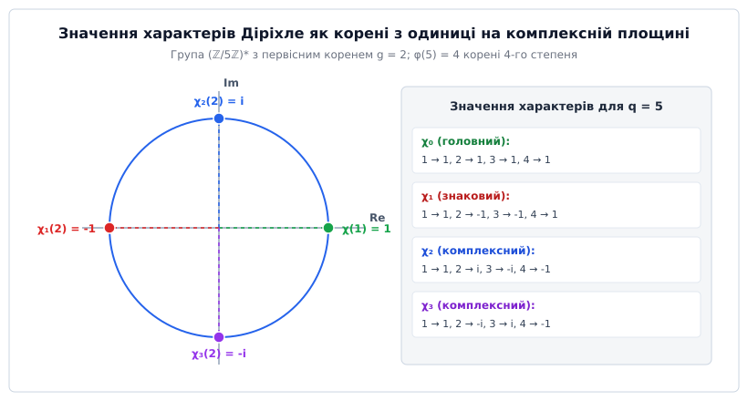
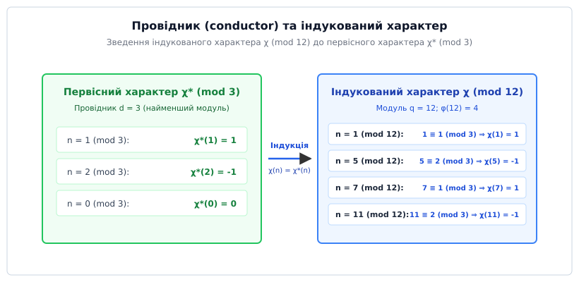
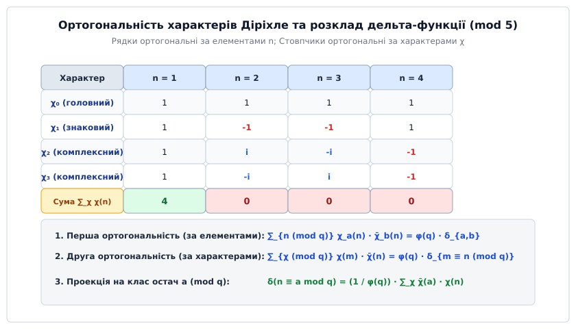

# Характери Діріхле

<preknowlist>
- [Групові структури](root:math-algebra/group-theory) — абелеві групи, ізоморфізми та двоїста група.
- [Функція Ейлера](root:math-number-theory/euler-totient) — структура приведеної системи залишків за модулем.
- [Первісні корені](root:math-number-theory/primitive-root) — циклічні твірні елементи та дискретне логарифмування.
- [Модульна арифметика](root:math-number-theory/modular-arithmetic) — порівняння, остачі та взаємна простота.
</preknowlist>

> 🔧 **Навіщо це.**
> Характери Діріхле є фундаментом, на якому тримається аналітична теорія чисел та сучасний гармонічний аналіз на скінченних групах. Вони перетворюють дискретні, важкодоступні задачі про подільність та розподіл простих чисел у рівномірних арифметичних прогресіях `a + k·q` на дослідження аналітичних властивостей комплексних рядів — L-функцій Діріхле. Без характерів Діріхле неможливо довести нескінченність кількості простих чисел у арифметичних прогресіях, обчислити число класів квадратичних полів, аналізувати стійкість криптографічних схем на основі дискретного логарифма або будувати швидкі імовірнісні алгоритми перевірки чисел на простоту (такі як тест Соловея–Штрассена на основі символу Якобі).

## 1. Проблема виділення залишків та мультиплікативна криза

Класичне доведення Евкліда опирається на побудову числа `N = p₁ · p₂ · ... · pₖ + 1` з добутку вже відомих простих чисел. Воно строго гарантує, що існує нескінченно багато простих чисел у повній множині натуральних чисел `ℕ`. Однак, як тільки ми звужуємо область пошуку і ставимо фундаментальне питання теорії чисел: *"Чи існує нескінченно багато простих чисел, які при діленні на заданий модуль `q` дають конкретний остаток `a`?"*, елементарна комбінаторна схема Евкліда швидко вичерпує свої можливості.

Для найпростішої арифметичної прогресії `4k + 3` (де модуль `q = 4`, а остаток `a = 3`) елементарний підхід ще дає результат. Якщо припустити, що існує лише скінченна кількість простих чисел вигляду `4k + 3` — позначимо їх `p₁, p₂, ..., pₖ` — і розглянути число:

```
N = 4 · p₁ · p₂ · ... · pₖ - 1
```

то можна помітити дві ключові властивості числа `N`. З одного боку, воно має вигляд `4M - 1 ≡ 3 (mod 4)`. З іншого боку, жодне з вже знайдених простих чисел `p₁, ..., pₖ` не ділить `N`, оскільки остаток від ділення дорівнює `-1`. Оскільки всі дільники числа `N` є непарними, вони можуть мати лише вигляд `4k + 1` або `4k + 3`. Проте добуток довільної кількості чисел вигляду `4k + 1` завжди дає число вигляду `4k + 1`:

```
(4x + 1)(4y + 1) = 16xy + 4x + 4y + 1 = 4(4xy + x + y) + 1 ≡ 1 (mod 4)
```

Отже, аби число `N` мало остаток `3 (mod 4)`, принаймні один його простий дільник повинен мати вигляд `4k + 3`. Цей дільник є новим і не входить до нашого початкового списку `p₁, ..., pₖ`, що одразу дає логічну суперечність.

Проте спроба застосувати цей самий прийом до дзеркального класу залишків `4k + 1` моментально зазнає краху. Якщо побудувати аналогічне число `N = 4 · p₁ · ... · pₖ + 1`, то його остаток дорівнює `1 (mod 4)`. Але добуток двох чисел вигляду `4k + 3` також дає залишок `1 (mod 4)`:

```
(4a + 3)(4b + 3) = 16ab + 12a + 12b + 9 = 4(4ab + 3a + 3b + 2) + 1 ≡ 1 (mod 4)
```

Це означає, що число `N ≡ 1 (mod 4)` цілком може розкладатися на два прості дільники вигляду `4k + 3` (наприклад, `9 = 3 · 3` або `21 = 3 · 7`), і ми не отримуємо жодного нового простого числа вигляду `4k + 1`.

Аналогічна проблема виникає для довільного модуля `q` та класу залишків `a (mod q)` при `gcd(a, q) = 1`. Елементарна алгебра не дозволяє розділити мультиплікативні комбінації дільників.

### Аналітичний підхід Ейлера та його обмеження

У 1737 році Леонард Ейлер здійснив революційний крок, пов'язавши розподіл простих чисел із нескінченними рядами через тотожність:

```
ζ(s) = ∑_{n=1}^∞ 1 / nˢ = ∏_{p ∈ P} (1 - 1 / pˢ)⁻¹
```

При спрямуванні дійсного параметра `s → 1⁺` ліва частина тотожності перетворюється на розбіжний гармонічний ряд `ζ(1) = ∑ (1/n) = ∞`. Логарифмуючи обидві частини Ейлерового добутку, Ейлер отримав:

```
ln ζ(s) = ∑_{p ∈ P} ln(1 - 1/pˢ)⁻¹ = ∑_{p ∈ P} 1/pˢ + ∑_{p ∈ P} ∑_{k=2}^∞ 1 / (k · pᵏˢ)
```

Друга сума (при `k ≥ 2`) мажорується збіжним рядом `∑ 1/p² < ∞` і залишається обмеженою константою `O(1)`. Отже, коли `s → 1⁺`, вираз `ln ζ(s) → +∞`, що прямо доводить розбіжність суми обернених величин усіх простих чисел:

```
∑_{p ∈ P} 1 / p = ∞
```

Це був перший аналітичний доказ нескінченності множини всіх простих чисел. Однак перед математиками постало фундаментальне питання: як із цієї загальної суми `∑ 1/p` виділити лише ті прості числа `p`, які задовольняють порівняння `p ≡ a (mod q)`?

Пряма спроба підставити характеристичну функцію (індикатор належності до класу залишків) `δ(n ≡ a mod q)` у ряд:

```
F(s) = ∑_{n=1}^∞ δ(n ≡ a mod q) / nˢ
```

повністю руйнує аналітичний апарат Ейлера. Причина полягає в тому, що дельта-функція **не є мультиплікативною**:

```
δ(n · m ≡ a mod q) ≠ δ(n ≡ a mod q) · δ(m ≡ a mod q)
```

Наприклад, для `q = 4` та `a = 1`: маємо `δ(3 ≡ 1 mod 4) = 0`, проте для добутку `3 · 3 = 9 ≡ 1 (mod 4)` маємо `δ(9 ≡ 1 mod 4) = 1`. Оскільки індикатор руйнує мультиплікативність коефіцієнтів, ряд `F(s)` **неможливо розкласти у нескінченний добуток за простими числами**. Без Ейлерового добутку ми втрачаємо будь-який зв'язок між значенням ряду та простими дільниками чисел.

Щоб розв'язати цю проблему, необхідно розкласти дельта-функцію `δ(n ≡ a mod q)` за базисом таких функцій, які одночасно задовольняють дві вимоги:
1. Вони є **періодичними** з періодом `q`, що відповідає структурі класів залишків.
2. Вони є **строго мультиплікативними**, що дозволяє зберегти Ейлерів добуток для кожного елемента базису.

Детальніше ознайомитися з [історією створення характерів та розв'язанням проблеми Діріхле](root:math-number-theory/dirichlet-characters-l-functions/hist-dirichlet-characters.md) можна у відповідній історичній вставці.

## 2. Означення, аксіоми та спектральні властивості характерів

Нехай `q ≥ 1` — натуральне число, яке називається модулем. Множина класів залишків, взаємно простих із `q`, утворює приведену систему залишків і позначається як `(ℤ/qℤ)*`. Ця множина є скінченною абелевою групою щодо операції множення за модулем `q`. Порядок цієї групи дорівнює значенню функції Ейлера `φ(q)`.

**Означення.** Числовим характером Діріхле (грец. *charaktēr* — карб, відбиток, ознака) за модулем `q` називається функція `χ: ℤ → ℂ`, яка задовольняє такі чотири аксіоми:

1. **Періодичність за модулем `q`:** `χ(n + q) = χ(n)` для всіх `n ∈ ℤ`.
2. **Повна мультиплікативність:** `χ(m · n) = χ(m) · χ(n)` для всіх `m, n ∈ ℤ`.
3. **Умова підтримки:** `χ(n) ≠ 0` тоді і тільки тоді, коли `gcd(n, q) = 1`. Якщо `gcd(n, q) > 1`, то `χ(n) = 0`.
4. **Нормування одиниці:** `χ(1) = 1`.

З алгебраїчної точки зору характер Діріхле — це гомоморфізм зі скінченної абелевої групи `(ℤ/qℤ)*` у мультиплікативну групу ненульових комплексних чисел `ℂ*`, продовжений нулем на всі цілі числа, не взаємно прості з `q`.

За теоремою Ферма-Ейлера для будь-якого `n`, взаємно простого з `q`, виконується порівняння `n^φ(q) ≡ 1 (mod q)`. Завдяки мультиплікативності характера отримуємо:

```
(χ(n))^φ(q) = χ(n^φ(q)) = χ(1) = 1                    [піднесення значення характера до степеня φ(q)]
```

Це означає, що значення `χ(n)` для будь-якого `n`, взаємно простого з `q`, є **комплексним коренем степеня `φ(q)` з одиниці**:

```
χ(n) = exp(2 π i · k / φ(q)) = cos(2 π k / φ(q)) + i · sin(2 π k / φ(q))
```

де `k ∈ {0, 1, ..., φ(q) - 1}`. Звідси випливають дві важливі алгебраїчні властивості:

* **Модуль дорівнює одиниці:** `|χ(n)| = 1` для всіх `n` таких, що `gcd(n, q) = 1`.
* **Комплексне спряження є оберненим елементом:** Оскільки `|χ(n)| = 1`, маємо `χ̄(n) = (χ(n))⁻¹ = χ(n⁻¹ mod q)`.


*Значення характера на твірному елементі є комплексним коренем з одиниці на одиничному колі.*

## 3. Класифікація характерів: головний, дійсний, парність та провідник

Множина всіх характерів за даним модулем `q` містить `φ(q)` різних функцій. Для їх систематизації використовують чотири основні алгебраїчні критерії.

### 1. Головний (тривіальний) характер `χ₀`

Завжди існує характер, який приймає значення `1` на всіх елементах, взаємно простих із `q`:

```
χ₀(n) = 1,   якщо gcd(n, q) = 1
χ₀(n) = 0,   якщо gcd(n, q) > 1
```

Головний характер `χ₀` відіграє роль нейтрального елемента у групі характерів. При `q = 1` цей характер перетворюється на тотожну одиницю `χ(n) = 1` для всіх `n ∈ ℕ`.

### 2. Дійсні та комплексні характери. Символи Лежандра та Якобі

* **Дійсний характер (знаковий):** приймає лише дійсні значення `{-1, 0, 1}`. Для такого характера `χ̄ = χ`, а отже `χ² = χ₀`. Прикладами дійсних характерів є символ Лежандра `(n/p)`, символ Якобі `(n/k)` та символ Кронекера.
  Наприклад, для простого непарного модуля `p` символ Лежандра `χ(n) = (n/p)` показує, чи є остача `n` квадратом за модулем `p`. Він є повністю мультиплікативним і задовольняє критерій Ейлера:

  ```
  (n/p) ≡ n^{(p-1)/2} (mod p)
  ```

* **Комплексний характер:** приймає принаймні одне значення з ненульовою уявною частиною (`Im(χ(n)) ≠ 0`). Комплексні характери завжди ходять парами: якщо `χ` є комплексним характером, то спряжений характер `χ̄ ≠ χ` також є характером за модулем `q`.

### 3. Парність характера

Оскільки `(-1)² = 1 (mod q)`, то за мультиплікативністю `(χ(-1))² = χ((-1)²) = χ(1) = 1`. Отже, значення `χ(-1)` може дорівнювати лише `+1` або `-1`:

* **Парний характер:** `χ(-1) = +1`. Парні характери задовольняють умову симетрії `χ(-n) = χ(n)`.
* **Непарний характер:** `χ(-1) = -1`. Непарні характери задовольняють умову антисиметрії `χ(-n) = -χ(n)`.

Парність характера відіграє вирішальну роль у функціональному рівнянні L-функцій Діріхле та обчисленні гауссових сум.

### 4. Первісні характери та провідник (Conductor)

Нехай `d` — дільник модуля `q` (`d | q`). Характер `χ* (mod d)` індукує характер `χ (mod q)` за формулою:

```
χ(n) = χ*(n),   якщо gcd(n, q) = 1
χ(n) = 0,       якщо gcd(n, q) > 1
```

Якщо характер `χ (mod q)` можна отримати індукцією з якогось характера `χ* (mod d)` за меншим модулем `d < q`, то такий характер називається **індукованим (непервісним)**.

**Означення.** Найменший дільник `d` модуля `q`, за яким існує характер `χ* (mod d)`, що індукує `χ`, називається **провідником** (англ. *conductor*) характера `χ` і позначається як `cond(χ) = d`.

* Якщо `cond(χ) = q`, то характер `χ` називається **первісним** (англ. *primitive character*). Первісний характер містить «чисту» арифметичну інформацію модуля `q` і не зводиться до менших модулів.
* Якщо `cond(χ) = d < q`, то характер є індукованим. Його L-функція відрізняється від L-функції первісного характера `χ*` лише скінченною кількістю простих множників у Ейлеровому добутку:

```
L(s, χ) = L(s, χ*) · ∏_{p | q, p ∤ d} (1 - χ*(p) / pˢ)
```


*Характер за модулем 12 індукується первісним характером за найменшим модулем-провідником 3.*

## 4. Двоїста група та спектральний розклад дельта-функції

Множина всіх `φ(q)` характерів за модулем `q` позначається як `Ĝ` або `(ℤ/qℤ)*^̂`. Якщо ввести на цій множині операцію точкового множення `(χ₁ · χ₂)(n) = χ₁(n) · χ₂(n)`, то `Ĝ` утворює скінченну абелеву групу, яка називається **двоїстою групою** (або групою характерів).

Нейтральним елементом групи `Ĝ` є головний характер `χ₀`, а оберненим елементом до `χ` є спряжений характер `χ̄`.

Група характерів `Ĝ` абстрактно ізоморфна самій групі залишків `G = (ℤ/qℤ)*`:

```
Ĝ ≅ (ℤ/qℤ)*
```

Це означає, що кількість характерів точно дорівнює кількості взаємно простих залишків `|Ĝ| = φ(q)`.

### Співвідношення ортогональності

Фундаментальна цінність характерів Діріхле полягає у двох двосторонніх співвідношеннях ортогональності, які роблять їх аналогом базису Фур'є на скінченній групі.

**Перше співвідношення ортогональності (за елементами групи):**
Сума добутку двох характерів `χ_a` та `χ_b` за всіма елементами приведеної системи залишків дорівнює:

```
∑_{n (mod q), gcd(n,q)=1} χ_a(n) · χ̄_b(n) = φ(q) · δ_{a,b}
```

де `δ_{a,b} = 1`, якщо `χ_a = χ_b`, і `0`, якщо `χ_a ≠ χ_b`.

**Друге співвідношення ортогональності (за характерами двоїстої групи):**
Сума добутку значень усіх характерів на двох елементах `m` та `n` дорівнює:

```
∑_{χ ∈ Ĝ} χ(m) · χ̄(n) = φ(q) · δ_{m ≡ n (mod q)}
```

де `δ_{m ≡ n (mod q)} = 1`, якщо `m ≡ n (mod q)`, і `0` в іншому випадку.

Зі другого співвідношення ортогональності негайно випливає розклад дельта-функції класу залишків.

**Спектральний розклад дельта-функції:**

```
δ(n ≡ a mod q) = (1 / φ(q)) · ∑_{χ ∈ Ĝ} χ̄(a) · χ(n)
```

Ця формула є розгадкою проблеми Ейлера: вона виражає не-мультиплікативний індикатор класу залишків `δ(n ≡ a mod q)` як лінійну комбінацію **повністю мультиплікативних** характерів `χ(n)`.


*Матриця характерів: ортогональність за рядками та стовпчиками дозволяє виділити довільний клас залишків.*

З повним [виведенням співвідношень ортогональності характерів та ізоморфізму двоїстої групи](root:math-number-theory/dirichlet-characters-l-functions/math-orthogonality-relations.md) можна ознайомитися у математичній вставці.

## 5. Побудова характерів за циклічними компонентами

Для обчислення значення характеру `χ(n)` на практиці необхідно враховувати алгебраїчну структуру групи `(ℤ/qℤ)*`.

### Випадок 1. Модуль має первісний корінь

Якщо модуль `q` має первісний корінь `g` (тобто група `(ℤ/qℤ)*` є циклічною), то будь-яке число `n` з `gcd(n, q) = 1` однозначно подається через дискретний логарифм `ind_g(n)`:

```
n ≡ g^{ind_g(n)} (mod q),   де ind_g(n) ∈ {0, 1, ..., φ(q) - 1}
```

Усі `φ(q)` характерів замощуються індексом `k ∈ {0, 1, ..., φ(q) - 1}` і обчислюються за формулою:

```
χₖ(n) = exp(2 π i · k · ind_g(n) / φ(q))
```

Множення двох характерів відповідає додаванню їхніх індексів за модулем `φ(q)`: `χ_a · χ_b = χ_{(a + b mod φ(q))}`.

### Випадок 2. Загальний складений модуль

Якщо модуль `q` не має єдиного первісного кореня (наприклад, `q = 2ᵏ` при `k ≥ 3` або `q = 12, 15, 16, 20...`), група `(ℤ/qℤ)*` розкладається за канонічним розкладом `q = p₁ᵉ¹ · p₂ᵉ² ... pᵣᵉʳ` у прямий добуток циклічних компонент:

```
(ℤ/qℤ)* ≅ (ℤ/p₁ᵉ¹ℤ)* × (ℤ/p₂ᵉ²ℤ)* × ... × (ℤ/pᵣᵉʳℤ)*
```

У цьому випадку характер `χ(n)` будується як добуток компонентних характерів `χ⁽ⁱ⁾(n mod pᵢᵉⁱ)`:

```
χ(n) = χ⁽¹⁾(n) · χ⁽²⁾(n) ... χ⁽ʳ⁾(n)
```

З [практичною реалізацією побудови таблиці характерів та обчислення провідника](root:math-number-theory/dirichlet-characters-l-functions/proj-dirichlet-character-table.md) мовами C, C++ та Python можна ознайомитися у відповідній вставці.

## 6. Суми Ґаусса та зв'язок із квадратичним законом взаємності

Для первісного характера `χ (mod q)` важливим аналітичним об'єктом є **сума Ґаусса** `G(χ)`, яка поєднує мультиплікативний характер `χ` із аддитивною експонентою `exp(2 π i n / q)`:

```
G(χ) = ∑_{n=1}^q χ(n) · exp(2 π i · n / q)
```

Суми Ґаусса виступають дискретним перетворенням Фур'є характерів Діріхле і мають такі ключові властивості:

1. **Модуль суми Ґаусса:** Для кожного первісного характера `χ (mod q)` модуль суми Ґаусса строго дорівнює квадратному кореню з модуля `|G(χ)| = √q`.
2. **Розклад значень характера:** Для первісного характера виконується тотожність `χ(n) · G(χ̄) = ∑_{m=1}^q χ̄(m) · exp(2 π i · m · n / q)`.
3. **Квадратичний закон взаємності:** Виражаючи суму Ґаусса квадратичного характера `(n/p)` через корені з одиниці, Ґаусс дав одне з найелегантніших доведень квадратичного закону взаємності:

```
(p/q) · (q/p) = (-1)^{(p-1)(q-1)/4}   для непарних простих p ≠ q
```

## 7. Вихід у математичний аналіз: L-ряди та теорема Діріхле

Підставляючи спектральний розклад дельта-функції `δ(p ≡ a mod q) = (1 / φ(q)) ∑_{χ} χ̄(a) χ(p)` у суму обернених величин простих чисел, одержуємо:

```
∑_{p ≡ a mod q} 1 / pˢ = (1 / φ(q)) · ∑_{χ ∈ Ĝ} χ̄(a) · ( ∑_{p ∈ P} χ(p) / pˢ )
```

Кожна внутрішня сума `∑ (χ(p) / pˢ)` виникає з логарифма відповідного **L-ряда Діріхле**:

```
L(s, χ) = ∑_{n=1}^∞ χ(n) / nˢ = ∏_{p ∈ P} (1 - χ(p) / pˢ)⁻¹
```

Оскільки коефіцієнти `χ(n)` є повністю мультиплікативними, L-ряд Діріхле **зберігає Ейлерів добуток за всіма простими числами**.

У цій підсумковій сумі доданки розбиваються на дві частини:
1. **Головний характер `χ = χ₀`:** Ряд `L(s, χ₀)` пов'язаний із дзета-функцією Ейлера `ζ(s)` і має полюс першого порядку в точці `s = 1`. Його логарифм `ln L(s, χ₀) → +∞` при `s → 1⁺`.
2. **Неголовні характери `χ ≠ χ₀`:** Якщо `L(1, χ) ≠ 0`, то `ln L(s, χ)` залишається скінченною константою при `s → 1⁺`.

Отже, головний додаток `χ₀` дає розбіжний внесок `(1 / φ(q)) · ln(1 / (s - 1))`, а всі інші характери залишаються обмеженими. Це доводить, що:

```
lim_{s → 1⁺} ∑_{p ≡ a mod q} 1 / pˢ = +∞
```

що й завершує доведення теореми Діріхле: **у кожній арифметичній прогресії `a + k·q` з `gcd(a, q) = 1` міститься нескінченно багато простих чисел**.

Таким чином, характери Діріхле успішно з'єднали дискретну алгебру залишків із безперервним комплексним аналізом.
