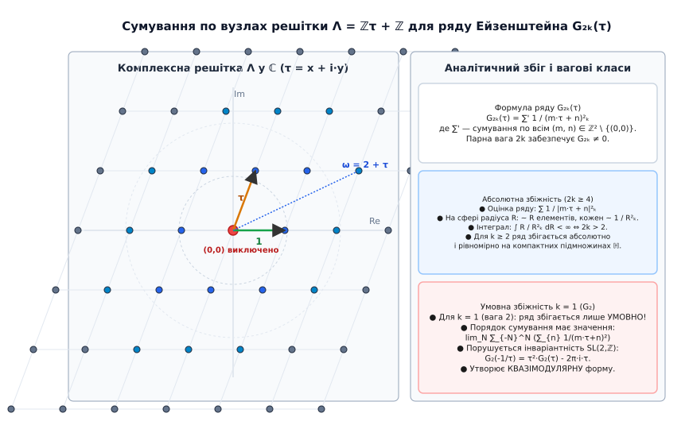
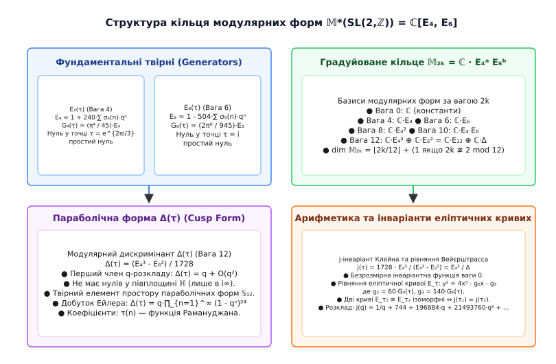

# Ряди Ейзенштейна

<preknowlist>
- [Модулярні форми](root:math-number-theory/modular-forms) — періодичність на верхній півплощині, вагові класи та перетворення Мебіуса.
- [Числа Бернуллі](root:math-number-theory/bernoulli-numbers) — суми степенів, значення дзета-функції Ейлера та зв'язок із рядами Тейлора.
- [Модулярна арифметика](root:math-number-theory/modular-arithmetic) — класи залишків, канонічні розклади та дискретна симетрія.
- [Основна теорема арифметики](root:math-number-theory/fundamental-theorem-arithmetic) — мультиплікативна структура цілих чисел та розклад на прості множники.
</preknowlist>

> 🔧 **Навіщо це.**
> Ряди Ейзенштейна утворюють фундамент усієї теорії модулярних форм та арифметичної алгебраїчної геометрії. Вони є канонічними твірними елементами градуйованого кільця модулярних форм `𝕄*(SL(2, ℤ)) = ℂ[E₄, E₆]`, через які явно виражаються всі автоморфні функції на Верхній півплощині: від дискримінантної параболічної форми `Δ(τ)` та `j`-інваріанта Клейна до параметрів еліптичних кривих Вейєрштрасса `g₂` і `g₃`. Коефіцієнти Фур'є рядів Ейзенштейна кодують глибинну арифметику цілих чисел — суми дільників `σₖ(n)` та точні комбінаторні формули для кількості способів представлення чисел сумами 4, 8, 12 та 16 квадратів. У сучасній математиці ряди Ейзенштейна слугують містком між аналітичною теорією чисел, теорією представлень та Програмою Ленглендса.

## 1. Від двовимірних решіток до голоморфних функцій на Верхній півплощині

Спроба побудувати нетривіальну комплексную функцію на Верхній півплощині `ℍ = { τ ∈ ℂ : Im(τ) > 0 }`, яка володіла б нескінченною симетрією відносно дробово-лінійних перетворень спеціальної лінійної групи `SL(2, ℤ)` (лат. *specialis linearis* — особлива лінійна група залишків):

```
f( (a·τ + b) / (c·τ + d) ) = (c·τ + d)²ₖ · f(τ),     ∀ ( a  b ) ∈ SL(2, ℤ)
                                                      ( c  d )
```

негайно стикається з аналітичною перешкодою. Просте усереднення довільної голоморфної функції за нескінченною дискретною групою розбігається або дає тотожний нуль. 

Ключ до розв'язання цієї задачі знайшов німецький математик Ґотгольд Ейзенштейн (нім. *Gotthold Eisenstein*, 1823–1852; детальніше про створення та еволюцію концепції див. [Історія рядів Ейзенштейна](root:math-number-theory/eisenstein-series/hist-eisenstein-series.md)). Замість абстрактного усереднення за групою `SL(2, ℤ)` слід звернутися до геометрії двовимірних решіток у комплексній площині `ℂ`.

Нехай у `ℂ` задано решітку (ґратку) `Λ = { m·ω₁ + n·ω₂ : m, n ∈ ℤ }`, утворену двома базисними числами `ω₁, ω₂ ∈ ℂ`, які є лінійно незалежними над дійсними числами `ℝ`. Якщо підсумувати обернені парні степені всіх ненульових вузлів решітки, утворюється геометрична сума:

```
G₂ₖ(Λ) = ∑_{ω ∈ Λ \ {0}} 1 / ω²ₖ = ∑'_{(m, n) ∈ ℤ² \ {(0,0)}} 1 / (m·ω₁ + n·ω₂)²ₖ
```

де штрих біля знака суми означає виключення впорядкованої пари `(m, n) = (0, 0)`.

Оскільки будь-яка заміна базису `(ω₁, ω₂)` на нову пару `(ω₁', ω₂') = (d·ω₁ + c·ω₂, b·ω₁ + a·ω₂)` із цілочисельною матрицею `(a, b; c, d) ∈ SL(2, ℤ)` лише переставляє вузли решітки `Λ` місцями, сума `G₂ₖ(Λ)` залишається абсолютно інваріантною відносно вибору базису.

Геометричний зміст цієї інваріантності полягає у тому, що площа фундаментального паралелограма решітки `det(Λ) = Im(ω₂ · ω₁̄)` зберігається при перетвореннях з детермінантом `1`. 

Нормалізуємо решітку, поділивши всі її елементи на ненульове число `ω₁`. Співвідношення двох періодів утворює комплексний параметр `τ = ω₂ / ω₁`. Щоб базис задавав додатньо орієнтовану сітку, вимагається `Im(τ) > 0`, тобто `τ ∈ ℍ`. При такому масштабуванні решітка `Λ` стає колінеарною до канонічної решітки `Λ_τ = ℤ·τ + ℤ`, а функція `G₂ₖ(Λ)` перетворюється на функцію комплексної змінної `τ`:

```
G₂ₖ(τ) = G₂ₖ(ℤ·τ + ℤ) = ∑'_{(m, n) ∈ ℤ² \ {(0,0)}} 1 / (m·τ + n)²ₖ
```

Ці канонічні суми називаються **рядами Ейзенштейна** ваги `2k`.


*Геометричне сумування по концентричних шарах вузлів решітки Λ = ℤτ + ℤ на комплексній площині ℂ для побудови ряду G₂ₖ(τ).*

З'ясуємо, як перетворюється функція `G₂ₖ(τ)` під дією дробово-лінійного перетворення Мебіуса `γ·τ = (a·τ + b) / (c·τ + d)` для матриці `γ = (a, b; c, d) ∈ SL(2, ℤ)`:

```
G₂ₖ(γ·τ)
= ∑' 1 / [ m·((a·τ + b)/(c·τ + d)) + n ]²ₖ
= ∑' 1 / [ (m·(a·τ + b) + n·(c·τ + d)) / (c·τ + d) ]²ₖ         [приведення до спільного знаменника]
= (c·τ + d)²ₖ · ∑' 1 / [ (m·a + n·c)·τ + (m·b + n·d) ]²ₖ      [винесення множника (c·τ + d)²ₖ]
```

Ввівши нові цілочисельні змінні `m' = m·a + n·c` та `n' = m·b + n·d`, помічаємо, що векторне перетворення `(m', n') = (m, n) · (a, b; c, d)` є автоморфізмом решітки `ℤ² \ {(0,0)}`, оскільки детермінант `a·d - b·c = 1`. Отже, пара `(m', n')` пробігає всі ненульові точки `ℤ²` рівно по одному разу:

```
∑' 1 / [ m'·τ + n' ]²ₖ = G₂ₖ(τ)
```

Підставляючи це назад, отримуємо фундаментальний **модулярний закон перетворення**:

```
G₂ₖ( (a·τ + b) / (c·τ + d) ) = (c·τ + d)²ₖ · G₂ₖ(τ)
```

Таким чином, якщо ряд `G₂ₖ(τ)` є аналітично збіжним, він виявляється голоморфною модулярною формою ваги `2k` відносно цілої модулярної групи `SL(2, ℤ)`.

## 2. Аналітичний збіг та оцінки сумування

Дослідимо питання абсолютної та рівномірної збіжності ряду `G₂ₖ(τ)`. Для цього оцінимо модуль загального доданка `1 / |m·τ + n|²ₖ` на комплексній площині.

Нехай параметр `τ = x + i·y` належить фундаментальній області `ℱ = { τ ∈ ℍ : |x| ≤ 1/2, |τ| ≥ 1 }`. Тоді для будь-якої пари цілих чисел `(m, n)` виконується квадратична оцінка:

```
|m·τ + n|²
= (m·x + n)² + m²·y²
= m²·(x² + y²) + 2·m·n·x + n²
≥ m² · |τ|² - 2·|m·n|·(1/2) + n²                               [враховуючи |x| ≤ 1/2]
≥ m² - |m·n| + n²
= (1/2)·(m² + n²) + (1/2)·(|m| - |n|)²
≥ (1/2) · (m² + n²)
```

Отже, модулі знаменників обмежені знизу квадратичною формою `|m·τ + n|² ≥ (1/2)·(m² + n²)`. Для дослідження збіжності ряду `G₂ₖ(τ)` достатньо оцінити подвійну числову суму:

```
S₂ₖ = ∑'_{(m, n) ∈ ℤ² \ {(0,0)}} 1 / (m² + n²)ᵏ
```

Перейдемо від дискретного сумування за вузлами до інтегрування у полярних координатах `(r, θ)` на площині `ℝ²`:

```
S₂ₖ ≈ ∫₀²π dθ ∫₁^∞ (1 / r²⪝) · r dr = 2·π · ∫₁^∞ r¹⁻²⪝ dr
```

Обчислимо визначений інтеграл на нескінченності:

```
∫₁^∞ r¹⁻²⪝ dr = [ r²⁻²⪝ / (2 - 2k) ] |₁^∞
```

Первісна на верхній межі `r → ∞` є скінченною тоді й лише тоді, коли показник степеня строго від'ємний:

```
2 - 2k < 0   ⇔   2k > 2   ⇔   2k ≥ 4  (оскільки k ∈ ℤ)
```

Звідси випливає фундаментальна **теорема про збіжність рядів Ейзенштейна**:
1. Для будь-якого цілого `k ≥ 2` (вага `2k ≥ 4`) ряд `G₂ₖ(τ)` збігається **абсолютно і рівномірно** на будь-якій компактній підмножині Верхньої півплощини `ℍ`. Отже, `G₂ₖ(τ)` є голоморфною функцією у півплощині `ℍ`.
2. Для випадку `k = 1` (вага `2k = 2`) інтеграл розбігається логарифмічно (`∫ (1/r) dr = ln r → ∞`). Ряд `G₂(τ)` є лише **умовно збіжним**, а його значення залежить від порядку сумування доданків (детальніше цей особливий випадок розібрано в розділі 6 та у вставці [Квазімодулярність E₂(τ)](root:math-number-theory/eisenstein-series/math-e2-quasi-modularity.md)).

Оскільки непарні степені `(m·τ + n)²ₖ⁺¹` змінюють знак при заміні `(m, n) ↦ (-m, -n)`, сума ряду для непарних ваг `G₂ₖ⁺₁(τ)` тотожно дорівнює нулю. Тому рядів Ейзенштейна непарної ваги не існує.

## 3. Формула підсумовування Ліпшиця та розклад Фур'є (q-розклад)

Оскільки ряд Ейзенштейна `G₂ₖ(τ)` задовольняє умову періодичності `G₂ₖ(τ + 1) = G₂ₖ(τ)` (що відповідає дії матриці `T = (1, 1; 0, 1) ∈ SL(2, ℤ)`), його можна розкласти в ряд Фур'є за комплексною змінною `q`:

```
q = e^{2·π·i·τ} = exp(2·π·i·x - 2·π·y),     |q| = e^{-2·π·y} < 1
```

Для виведення коефіцієнтів Фур'є виділимо у визначенні `G₂ₖ(τ)` члени з `m = 0` та члени з `m ≠ 0`:

```
G₂ₖ(τ)
= ∑'_{n ∈ ℤ} 1 / n²ₖ + ∑_{m ∈ ℤ \ {0}} ∑_{n ∈ ℤ} 1 / (m·τ + n)²ₖ
= 2 · ∑_{n=1}^∞ 1 / n²ₖ + 2 · ∑_{m=1}^∞ ∑_{n ∈ ℤ} 1 / (m·τ + n)²ₖ      [симетрія відносно m ↦ -m]
```

Перша сума є подвоєним значенням дзета-функції Рімана (нім. *Bernhard Riemann*) у точці `2k`: `2·ζ(2k)`.

Для другого доданка використаємо класичну **формулу підсумовування Ліпшиця** (нім. *Rudolf Lipschitz*), яка виражає тригонометричні суми через степені `q`. Вона виводиться логарифмічним диференціюванням нескінченного добутку для синуса:

```
sin(π·z) = π·z · ∏_{n=1}^∞ ( 1 - z² / n² )
```

Взявши логарифмічну похідну `d/dz ln(sin(π·z)) = π · cot(π·z)` та розклавши котангенс у ряд за степенями `e^{2·π·i·z}`, багаторазове диференціювання дає точну тотожність Ліпшиця:

```
∑_{n ∈ ℤ} 1 / (τ + n)²ₖ = ( (-2·π·i)²ₖ / (2k - 1)! ) · ∑_{d=1}^∞ d²ₖ⁻¹ · e^{2·π·i·d·τ}
```

Застосуємо формулу Ліпшиця до кожної підсуми з аргументом `m·τ`:

```
∑_{n ∈ ℤ} 1 / (m·τ + n)²ₖ = ( (-2·π·i)²ₖ / (2k - 1)! ) · ∑_{d=1}^∞ d²ₖ⁻¹ · q^{m·d}
```

Просумуємо цей вираз за всіма `m ≥ 1`:

```
∑_{m=1}^∞ ∑_{n ∈ ℤ} 1 / (m·τ + n)²ₖ
= ( (-2·π·i)²ₖ / (2k - 1)! ) · ∑_{m=1}^∞ ∑_{d=1}^∞ d²ₖ⁻¹ · q^{m·d}
```

Зробимо заміну індексу `n = m·d`. Тоді для кожного фіксованого `n ≥ 1` число `d` пробігає всі додатні дільники числа `n` (позначення `d | n`). Сума перетворюється на арифметичну **функцію суми дільників** `σ₂ₖ⁻₁(n)`:

```
σ₂ₖ⁻₁(n) = ∑_{d | n} d²ₖ⁻¹
```

Підставляючи це у формулу ряду `G₂ₖ(τ)`, отримуємо точний **розклад Фур'є ряду Ейзенштейна**:

```
G₂ₖ(τ) = 2·ζ(2k) + 2 · ( (-2·π·i)²ₖ / (2k - 1)! ) · ∑_{n=1}^∞ σ₂ₖ⁻₁(n) · qⁿ
```

Зв'язок між значеннями дзета-функції `ζ(2k)` та числами Бернуллі `B₂ₖ` (нім. *Jakob Bernoulli*) задається класичною формулою Ейлера:

```
ζ(2k) = ( (2·π)²ₖ · (-1)ᵏ⁺¹ · B₂ₖ ) / ( 2 · (2k)! )
```

Поділивши весь ряд `G₂ₖ(τ)` на його вільний член `2·ζ(2k)`, отримуємо **нормалізований ряд Ейзенштейна** `E₂ₖ(τ)`, у якого коефіцієнт при `q⁰` дорівнює строго `1`:

```
E₂ₖ(τ) = G₂ₖ(τ) / (2·ζ(2k)) = 1 - ( 4k / B₂ₖ ) · ∑_{n=1}^∞ σ₂ₖ⁻₁(n) · qⁿ
```


*Аналітична структура q-розкладу, нормалізація через числа Бернуллі B₂ₖ та арифметичні значення функцій дільників σₖ(n).*

Оскільки для парних показників `2k` числа Бернуллі `B₂ₖ` є раціональними числами, коефіцієнти при всіх степенях `qⁿ` у розкладі `E₂ₖ(τ)` виявляються строго раціональними!

Обчислимо перші нормалізовані ряди Ейзенштейна, використовуючи відомі значення чисел Бернуллі:
- `B₄ = -1/30`  ⇒  `-4·4 / B₄ = -16 / (-1/30) = +240`
- `B₆ = 1/42`   ⇒  `-4·6 / B₆ = -24 / (1/42) = -504`
- `B₈ = -1/30`  ⇒  `-4·8 / B₈ = -32 / (-1/30) = +480`
- `B₁₀ = 5/66`  ⇒  `-4·10 / B₁₀ = -40 / (5/66) = -264`
- `B₁₂ = -691/2730` ⇒ `-4·12 / B₁₂ = -48 / (-691/2730) = 65520 / 691`

Звідси отримуємо явні `q`-розклади для ключових рядів Ейзенштейна:

```
E₄(τ) = 1 + 240 · ∑_{n=1}^∞ σ₃(n) · qⁿ = 1 + 240·q + 2160·q² + 6720·q³ + ...
E₆(τ) = 1 - 504 · ∑_{n=1}^∞ σ₅(n) · qⁿ = 1 - 504·q - 16632·q² - 122976·q³ - ...
E₈(τ) = 1 + 480 · ∑_{n=1}^∞ σ₇(n) · qⁿ = 1 + 480·q + 61920·q² + 1050240·q³ + ...
E₁₀(τ) = 1 - 264 · ∑_{n=1}^∞ σ₉(n) · qⁿ = 1 - 264·q - 135432·q² - 17344800·q³ + ...
E₁₂(τ) = 1 + (65520 / 691) · ∑_{n=1}^∞ σ₁₁(n) · qⁿ
```

Дивовижний факт полягає в тому, що для ваг `4, 6, 8, 10, 14` усі коефіцієнти розкладу є **цілими числами**! Лінійні та мультиплікативні алгоритми обчислення цих коефіцієнтів на мовах C та C++ детально викладено у вставці [Обчислення коефіцієнтів Фур'є](root:math-number-theory/eisenstein-series/proj-eisenstein-fourier.md).

## 4. Алгебраїчна структура кільця модулярних форм та теорема про нулі

Побудовані ряди `E₄(τ)` та `E₆(τ)` відіграють фундаментальну роль у всій теорії модулярних форм: вони утворюють вільні алгебраїчні твірні градуйованого кільця всіх модулярних форм відносно групи `SL(2, ℤ)`.

Позначимо через `𝕄₂ₖ(SL(2, ℤ))` векторний простір модулярних форм ваги `2k`.

### Формула валентності (Valenzformel)

Для доведення структури кільця модулярних форм ключовим аналітичним інструментом є **Формула валентності** (нім. *Valenzformel*), яка пов'язує порядки нулів модулярної форми `f ∈ 𝕄₂ₖ` у фундаментальній області `ℱ` з її вагою `2k`:

```
v_∞(f) + (1/2)·v_i(f) + (1/3)·v_ρ(f) + ∑_{p ∈ ℱ \ {i, ρ}} v_p(f) = 2k / 12
```

де `v_p(f)` — порядок нуля функції `f` у точці `p`, `i = √(-1)` — еліптична точка порядку 2, а `ρ = e^{2·π·i/3} = -1/2 + i·√3/2` — еліптична точка порядку 3.

З формули валентності випливає низка важливих наслідків:
1. Ненульових модулярних форм від'ємної ваги чи ваги `2` не існує (`𝕄₂ₖ = {0}` для `2k < 0` та `2k = 2`).
2. Для ваги `4` команда `4 / 12 = 1/3` вимагає `v_ρ(E₄) = 1`. Отже, `E₄(τ)` має єдиний простий нуль у точці `ρ` і не має інших нулів у фундаментальній області! Значення `E₄(i)` при цьому дорівнює:
   ```
   E₄(i) = 3 · (Г(1/4))⁸ / (16 · π⁶) ≈ 1.45576
   ```
3. Для ваги `6` команда `6 / 12 = 1/2` вимагає `v_i(E₆) = 1`. Отже, `E₆(τ)` має єдиний простий нуль у точці `i` (`E₆(i) = 0`) і не має інших нулів! Значення `E₆(ρ)` дорівнює строго `0`.

### Теорема про структуру кільця модулярних форм

Будь-яка модулярна форма `f ∈ 𝕄₂ₖ(SL(2, ℤ))` ваги `2k` однозначно виражається у вигляді полінома від `E₄` та `E₆`:

```
f(τ) = ∑_{4a + 6b = 2k, a,b ∈ ℤ_{≥0}} c_{a,b} · (E₄(τ))ᵃ · (E₆(τ))ᵇ,     c_{a,b} ∈ ℂ
```

Отже, градуйоване кільце модулярних форм ізоморфне кільцю поліномів від двох незалежних змінних:

```
𝕄*(SL(2, ℤ)) = ⨁_{k=0}^∞ 𝕄₂ₖ(SL(2, ℤ)) ≅ ℂ[E₄, E₆]
```


*Градуйована структура кільця модулярних форм 𝕄*(SL(2,ℤ)) = ℂ[E₄, E₆], дискримінантна форма Δ(τ) та j-інваріант Клейна.*

Розмірність простору `dim 𝕄₂ₖ` обчислюється за формулою:

```
dim 𝕄₂ₖ = ⌊ 2k / 12 ⌋ + ( 1  якщо  2k ≢ 2 mod 12;  0  якщо  2k ≡ 2 mod 12 )
```

Звідси маємо значення розмірностей для малих ваг:
- `dim 𝕄₀ = 1` (лише константи `ℂ`)
- `dim 𝕄₂ = 0` (ненульових модулярних форм ваги 2 не існує!)
- `dim 𝕄₄ = 1` (базис: `{E₄}`)
- `dim 𝕄₆ = 1` (базис: `{E₆}`)
- `dim 𝕄₈ = 1` (базис: `{E₈ = E₄²}`)
- `dim 𝕄₁₀ = 1` (базис: `{E₁₀ = E₄ · E₆}`)
- `dim 𝕄₁₂ = 2` (базис: `{E₄³, E₆²}` або `{E₁₂, Δ}`)

З огляду на одновимірність просторів `𝕄₈`, `𝕄₁₀` та `𝕄₁₄`, ряди Ейзенштейна високих ваг повинні тотожно виражатися через добутки `E₄` та `E₆`:

```
E₈(τ) = (E₄(τ))²
E₁₀(τ) = E₄(τ) · E₆(τ)
E₁₄(τ) = (E₄(τ))² · E₆(τ)
```

Зіставляючи `q`-розклади лівих і правих частин цих тотожностей, виникають нетривіальні арифметичні співвідношення між сумами дільників, наприклад для `E₈ = E₄²`:

```
1 + 480 · ∑_{n=1}^∞ σ₇(n)·qⁿ = ( 1 + 240 · ∑_{n=1}^∞ σ₃(n)·qⁿ )²
```

Розкриваючи квадрат у правій частині та прирівнюючи коефіцієнти при `qⁿ`, отримуємо точну **згорткову тотожність Рамануджана**:

```
σ₇(n) = σ₃(n) + 120 · ∑_{m=1}^{n-1} σ₃(m) · σ₃(n - m)
```

Це дивовижне співвідношення дозволяє обчислити суму 7-х степенів дільників числа `n` через згортку кубів дільників менших чисел!

### Модулярний дискримінант та j-інваріант Клейна

Для ваги `12` розмірність `dim 𝕄₁₂ = 2`. У цьому просторі виникає фундаментальна **параболічна форма** (англ. *cusp form*) — модулярна форма, яка перетворюється на нуль на нескінченності (`q = 0`).

**Модулярний дискримінант** `Δ(τ)` визначається як комбінація:

```
Δ(τ) = ( (E₄(τ))³ - (E₆(τ))² ) / 1728
```

Обчислимо перший член `q`-розкладу дискримінанта:

```
E₄³ = (1 + 240·q + ... )³ = 1 + 720·q + 172800·q² + ...
E₆² = (1 - 504·q + ... )² = 1 - 1008·q + 254016·q² + ...

E₄³ - E₆² = (1 + 720·q) - (1 - 1008·q) + ... = 1728·q + 165888·q² + ...
```

Поділивши на `1728`, одержуємо:

```
Δ(τ) = q · ∏_{n=1}^∞ (1 - qⁿ)²⁴ = q - 24·q² + 252·q³ - 1472·q⁴ + 4830·q⁵ - ... = ∑_{n=1}^∞ τ(n) · qⁿ
```

де `τ(n)` — знаменита **арифметична функція тау Рамануджана**.

Відношення двох модулярних форм однакової ваги утворює безрозмірну мероморфну функцію ваги `0`. **Абсолютний інваріант Клейна** `j(τ)` визначається як:

```
j(τ) = 1728 · (E₄(τ))³ / ( (E₄(τ))³ - (E₆(τ))² ) = (E₄(τ))³ / Δ(τ)
```

Його `q`-розклад починається з простого полюса на нескінченності:

```
j(q) = 1/q + 744 + 196884·q + 21493760·q² + 864299970·q³ + ...
```

Коефіцієнт `196884` при `q¹` є ключем до так званого «Чудодійного місячного сяйва» (англ. *Monstrous Moonshine*) — глибокого зв'язку між коефіцієнтами `j`-інваріанта та розмірностями незвідних представлень найбільшої спорадичної простої групи «Монстр» (Роберт Ґрісс, англ. *Robert Griess*, 1982).

### Зв'язок із еліптичними кривими Вейєрштрасса

Будь-яка комплексна еліптична крива `E` може бути подана у канонічній формі Вейєрштрасса:

```
y² = 4·x³ - g₂·x - g₃
```

Коефіцієнти `g₂` та `g₃` прямо пропорційні рядам Ейзенштейна `G₄(τ)` та `G₆(τ)`:

```
g₂ = 60 · G₄(τ) = (4·π⁴ / 3) · E₄(τ)
g₃ = 140 · G₆(τ) = (8·π⁶ / 27) · E₆(τ)
```

Дискримінант кубічного многочлена `4x³ - g₂x - g₃` дорівнює:

```
Δ_{куб} = g₂³ - 27·g₃³ = (2·π)¹² · Δ(τ)
```

Отже, еліптична крива є гладкою (неособливою) тоді й лише тоді, коли модулярний дискримінант `Δ(τ) ≠ 0`, що виконується для всіх `τ ∈ ℍ`. Дві еліптичні криві `E_τ₁` та `E_τ₂` ізоморфні над `ℂ` тоді й лише тоді, коли `j(τ₁) = j(τ₂)`.

## 5. Діофантові застосування: представлення чисел сумами квадратів

Завдяки зв'язку між рядами Ейзенштейна та тета-функціями Якобі `ϑ(τ) = ∑_{n ∈ ℤ} q^{n²}`, ряди Ейзенштейна дають точні комбінаторні формули для кількості розв'язків діофантових рівнянь вида:

```
x₁² + x₂² + ... + x_k² = n,     x_i ∈ ℤ
```

Позначимо кількість таких представлень через `r_k(n)`.

### Суми чотирьох квадратів (Теорема Якобі)

Тета-функція в четвертому степені `ϑ(τ)⁴ = ∑_{n=0}^∞ r₄(n) · qⁿ` належить простору модулярних форм ваги `2` відносно конгруенц-підгрупи `Γ₀(4)`. Вона виражається через ряди Ейзенштейна ваги `2` зі зсувом аргументу:

```
ϑ(τ)⁴ = E₂(τ) - 4 · E₂(4·τ)   (всі ряди в нормалізованій формі)
```

Розкриваючи `q`-розклад правого виразу, виводиться **теорема Якобі про 4 квадрати**:

```
r₄(n) = 8 · ∑_{d | n, 4 ∤ d} d
```

Проілюструємо обчислення на конкретному числовому прикладі для `n = 5`.

Знайдемо дільники числа `5`: дільниками є `1` та `5`. Жоден із них не ділиться на `4`. За формулою Якобі:

```
r₄(5) = 8 · (1 + 5) = 8 · 6 = 48
```

Перевіримо комбінаторно: числа 5 подаються у вигляді `(±2)² + (±1)² + 0² + 0²`. Існує `4` вибори знаків для двох ненульових чисел (`±2, ±1`) та `12` перестановок позицій чотирьох елементів `(2, 1, 0, 0)`. Загальна кількість розв'язків: `4 × 12 = 48`. Збіг ідеальний!

Для непарних чисел `n` формула спрощується до `r₄(n) = 8 · σ₁(n)`. Оскільки для будь-якого `n ≥ 1` сума дільників `σ₁(n) ≥ 1`, звідси негайно випливає **теорема Лагранжа**: кожне натуральне число є сумою 4 квадратів цілих чисел!

### Суми восьми квадратів

Тета-функція у восьмому степені `ϑ(τ)⁸` належить простору `𝕄₄(Γ₀(2))` і виражається через ряд Ейзенштейна `E₄(τ)`:

```
ϑ(τ)⁸ = ( 16 / 15 ) · E₄(2·τ) + ( 16 / 15 ) · E₄(τ/2) - ( 17 / 15 ) · E₄(τ)
```

Зіставляючи коефіцієнти при `qⁿ`, одержуємо точну формулу для **суми 8 квадратів**:

```
r₈(n) = 16 · ∑_{d | n} (-1)^{n - d} · d³ = 16 · (-1)ⁿ · ∑_{d | n} (-1)^{n/d} · d³
```

Обчислимо точне значення `r₈(2)` для `n = 2`:
- Дільники `n = 2`: `d = 1` та `d = 2`.
- Для `d = 1`: `(-1)^{2 - 1} · 1³ = -1`.
- Для `d = 2`: `(-1)^{2 - 2} · 2³ = +8`.
- Сума: `16 · (-1 + 8) = 16 · 7 = 112`.

Комбінаторна перевірка: число `2` подається як `(±1)² + (±1)² + 0 + ... + 0` в 8 позиціях. Кількість виборів 2 позицій із 8 є `C(8, 2) = 28`, а вибір знаків `(±1, ±1)` має `4` варіанти. Загалом: `28 × 4 = 112`. Результат виведеної формули точний!

Аналогічні точні формули через ряди Ейзенштейна виведено для `r₁₂(n)` та `r₁₆(n)`, де знімається потреба в обчисленні залишкових членів завдяки скінченній розмірності відповідних модулярних просторів.

## 6. Квазімодулярна аномалія E₂(τ) та диференціальні рівняння Рамануджана

Як виявлено в розділі 2, для ваги `2k = 2` ряд `G₂(τ)` є лише умовно збіжним. Нормалізований ряд:

```
E₂(τ) = 1 - 24 · ∑_{n=1}^∞ σ₁(n) · qⁿ
```

порушує точну модулярную інваріантність під дією генератора `S: τ ↦ -1/τ`.

За допомогою регуляризації Геке або формули підсумовування Пуассона доводиться закон **квазімодулярного перетворення**:

```
E₂(-1/τ) = τ² · E₂(τ) + ( 6 / (π·i) ) · τ
```

Адитивний член `(6 / (π·i)) · τ` показує, що `E₂(τ)` не є класичною модулярною формою. Проте додавання неголоморфної поправки дає повністю модулярну (але неголоморфну) форму ваги `2`:

```
Ê₂(τ) = E₂(τ) - 3 / (π · Im(τ)),     Ê₂(-1/τ) = τ² · Ê₂(τ)
```

Строге виведення цього перетворення та аналіз регуляризації Геке наведено у вставці [Квазімодулярність E₂(τ)](root:math-number-theory/eisenstein-series/math-e2-quasi-modularity.md).

Нераціональність квазімодулярного ряда `E₂` урівноважується його унікальною алгебраїчною роллю: він замикає оператор диференціювання `q · d/dq` на кільці модулярних форм. Рамануджан відкрив, що похідні від `E₂`, `E₄` та `E₆` записуються у вигляді замкненої автономної **диференціальної системи Рамануджана**:

```
q · dE₂/dq = ( (E₂(τ))² - E₄(τ) ) / 12
q · dE₄/dq = ( E₄(τ) · E₂(τ) - E₆(τ) ) / 3
q · dE₆/dq = ( E₆(τ) · E₂(τ) - (E₄(τ))² ) / 2
```

Завдяки цій системі будь-який оператор диференціювання на модулярних формах переводить класичні модулярні форми у квазімодулярні форми, забезпечуючи точний алгебраїчний зв'язок між аналітичними диференціальними рівняннями та арифметикою дільників цілих чисел.
