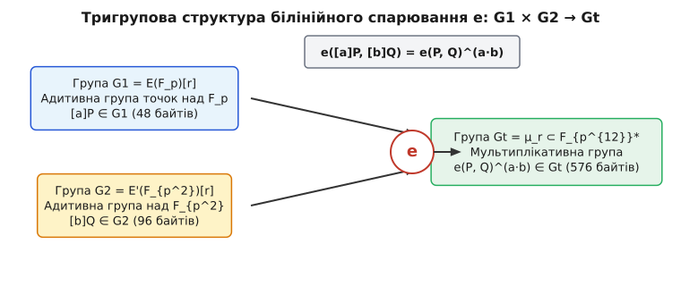
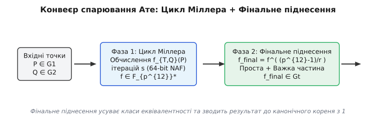
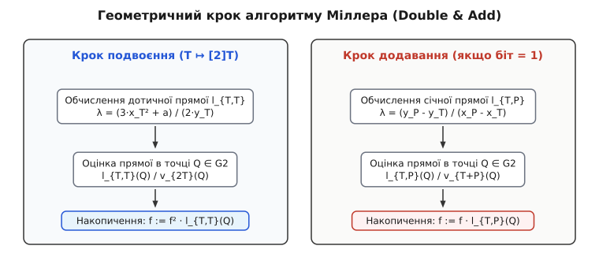
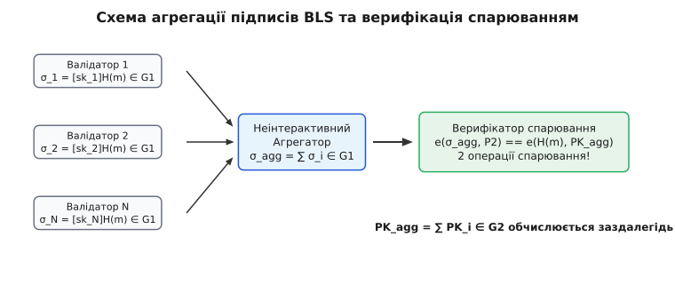

# Спарювання еліптичних кривих (Bilinear Pairings)

<preknowlist>
- [Скінченні поля](root:math-algebra/finite-field-arithmetic) — арифметика полів 𝔽ₚ та їхніх розширень 𝔽ₚᵏ, незвідні многочлени та вежі розширень.
- [Еліптичні криві](root:math-number-theory/elliptic-curves) — алгебраїчні криві роду 1, груповий закон додавання точок та підгрупи кручення.
- [Автоморфізм Фробеніуса](root:math-algebra/frobenius-automorphism) — гомоморфізм піднесення до степеня p у скінченних полях та його власні підпростори.
- [Дивізори та простір Рімана — Роха](root:math-number-theory/divisors-riemann-roch) — формальні суми точок алгебраїчної кривої, головні дивізори та раціональні функції.
- [Кругові поля](root:math-algebra/cyclotomic-fields) — розширення полів, утворені приєднанням коренів з одиниці, та кругові многочлени.
- [Проблема дискретного логарифма](root:sf-security/discrete-log-problem) — математична складність обернення піднесення до степеня у скінченних групах.
- [Протоколи нульового розголошення](root:sf-security/zero-knowledge-proofs) — криптографічні доведення без розкриття секретних аргументів.
- [Криптографічне зобов'язання](root:sf-security/cryptographic-commitment) — схеми зв'язування з можливістю подальшого відкриття значення.
</preknowlist>

У класичній криптографії на еліптичних кривих додавання точок є лінійним: знаючи дві точки `[a]P` та `[b]P`, обчислити точку `[a + b]P` можна за долі мікросекунди. Однак обчислити точку `[a · b]P`, мавши лише відкриті значення `[a]P` та `[b]P` без знання секретних скалярів `a` і `b`, неможливо — це становить основу обчислювальної проблеми Діффі — Геллмана. Перемноження двох секретних скалярів, схованих у генераторах групи, вимагає виходу за межі одновимірної алгебраїчної структури кривої. Білінійні спарювання (англ. *bilinear pairings*, від латинського *par* — пара) розв'язують цю фундаментальну обмеженість, створюючи алгебраїчний міст між двома адитивними групами точок еліптичної кривої та мультиплікативною групою розширення скінченного поля.

Спарювання трансформує перевірку складених квадратних і мультиплікативних відношень у прихованих скалярах на однократне обчислення відображення. Це відкрило шлях до агрегації підписів без взаємодії, криптосистем на основі ідентифікаторів (IBE) та компактних аргументів знань у режимі реального часу (ZK-SNARKs).

> 🔧 **Навіщо це.** Без білінійних спарювань протоколи ZK-SNARKs (зокрема Groth16 та PLONK) вимагали б передачі мегабайтів даних для перевірки арифметичних схем, а блокчейни на кшталт Ethereum витрачали б гігабайти пам'яті на зберігання окремих підписів кожного валідатора. Спарювання дозволяє стиснути тисячі підписів у єдиний елемент групи розміром 48 байтів та перевірити його за допомогою лише двох операцій спарювання.

---

## 1. Математичне означення та алгебраїчні властивості

Білінійне спарювання — це ефективно обчислюване відображення `e`, яке приймає два елементи з двох адитивних груп точок еліптичної кривої `G1` та `G2` і повертає елемент мультиплікативної групи `Gt`:

```
e: G1 × G2 → Gt
```

Усі три групи `G1`, `G2` та `Gt` мають однаковий великий простий порядок `r`. Для кожного спарювання вимагається виконання трьох фундаментальних аксіом:

1. **Білінійність (англ. *bilinearity*):** Для довільних точок `P ∈ G1`, `Q ∈ G2` та будь-яких скалярів `a, b ∈ Z_r` виконується рівність:
   ```
   e([a]P, [b]Q) = e(P, Q)^(a · b)
   ```
   З лінійності за кожним аргументом окремо випливає аддитивна дистрибутивність:
   ```
   e(P1 + P2, Q) = e(P1, Q) · e(P2, Q)
   e(P, Q1 + Q2) = e(P, Q1) · e(P, Q2)
   ```
2. **Невиродженість (англ. *non-degeneracy*):** Якщо `P` є генератором групи `G1` (`P ≠ O`), а `Q` є генератором групи `G2` (`Q ≠ O`), то `e(P, Q)` є генератором мультиплікативної групи `Gt` (тобто `e(P, Q) ≠ 1` у `Gt`).
3. **Ефективна обчислюваність (англ. *computability*):** Для будь-яких точок `P ∈ G1` та `Q ∈ G2` значення `e(P, Q)` обчислюється за поліноміальний час від довжини порядку групи `log2(r)`.


*Відображення двох адитивних груп точок еліптичної кривої G1 та G2 у мультиплікативну групу розширення поля Gt з збереженням білінійних відношень у показниках степеня.*

Залежно від співвідношення та зв'язку між групами `G1` та `G2` спарювання класифікують на три основні типи:

- **Тип 1 (симетричне):** `G1 = G2`. Визначається на supersingular кривих. Воно зручне для побудови теоретичних протоколів, але вважається застарілим через низьку захищеність від атак зниження складності (атаки MOV та Frey — Rück).
- **Тип 2 (асиметричне з ефективним гомоморфізмом):** `G1 ≠ G2`, але існує ефективно обчислюваний гомоморфізм `ψ: G2 → G1` (слідовий оператор).
- **Тип 3 (асиметричне без ефективного гомоморфізму):** `G1 ≠ G2`, і не існує ефективного обчислюваного відображення між `G2` та `G1`. Це сучасний інженерний стандарт (криві BN254, BLS12-381), оскільки він надає найкоротші елементи в `G1` та максимальну обчислювальну продуктивність.

---

## 2. Геометрія кривих, дивізори та ступінь занурення

Нехай `E` — еліптична крива, задана рівнянням Вейєрштрасса `y² = x³ + a·x + b` над скінченним полем `F_p`. Підгрупа точок кручення orders `r` (англ. *r-torsion subgroup*), позначувана як `E[r]`, складається з усіх точок `P ∈ E(F̄_p)`, для яких `[r]P = O`, де `O` — точка на нескінченності.

Алгебраїчна теорія стверджує, що якщо характеристика поля `p` не ділить `r`, то підгрупа `E[r]` ізоморфна прямому добутку двох циклічних груп:

```
E[r] ≅ Z_r × Z_r
```

Однак не всі `r²` точок групи `E[r]` лежать у базовому полі `F_p`. Більшість із них визначені лише над розширенням поля `F_{p^k}`.

Мінімальне додатне ціле число `k`, для якого базове розширення `F_{p^k}` містить усі `r`-точки кручення `E[r]` (що еквівалентно умові `r | (p^k - 1)`), називається **ступенем занурення** (англ. *embedding degree*).

Геометрично підгрупи `G1` та `G2` визначаються як власні підпростори ендоморфізму Фробеніуса `π_p(x, y) = (x^p, y^p)`:
- `G1 = E(F_p)[r] = Ker(π_p - [1])` — точка з координатами в базовому полі `F_p`.
- `G2 = E'(F_{p^{k/d}})[r] ≅ Ker(π_p - [p])` — точка, визначена над розширенням поля, що належить власному значенню `p`.
- `Gt = μ_r ⊂ F_{p^k}*` — підгрупа коренів `r`-го степеня з одиниці в мультиплікативній групі розширення поля.

### Фундаментальні тотожності ендоморфізму Фробеніуса

Ендоморфізм Фробеніуса `π_p` задовольняє характеристичний многочлен:

```
π_p² - [t] · π_p + [p] = O
```

Де `t` — слід Фробеніуса (англ. *trace of Frobenius*), що пов'язаний з кількістю точок кривої над базовим полем: `#E(F_p) = p + 1 - t`.

Для точки `Q ∈ G2` дія Фробеніуса зводиться до скалярного множення: `π_p(Q) = [p]Q`. Ця алгебраїчна властивість дозволяє замінити дорогі операції скалярного множення точок у `G2` на застосування відображення Фробеніуса `(x, y) ↦ (x^p, y^p)`, яке у вежі полів обчислюється майже миттєво через множення компонентів на заздалегідь обчислені константи (корені з одиниці).

### Перевірка належності точок підгрупам (Subgroup Membership Testing)

Оскільки порядок кривої над `F_{p^2}` становить `#E'(F_{p^2}) = h2 · r`, де `h2` — кофактор підгрупи, довільна точка на кривій може не належати правильній підгрупі `G2`. Пряме скалярне множення `[r]Q == O` є коштовним.

Завдяки ендоморфізму Галлант — Ламберта — Ванстоуна (GLV/GLS) та тотожності Фробеніуса перевірка належності точки `Q` до підгрупи `G2` спрощується до перевірки рівняння:

```
π_p(Q) == [x]Q
```

Де `x` — параметр кривої (наприклад, для BLS12-381). Це замінює повнорозмірне скалярне множення 255-бітовим числом на одне швидке застосування Фробеніуса та множення на коротке 64-бітове значення `x`.

### Алгебраїчна теорія дивізорів

Фундаментом побудови конкретних функцій спарювання є **раціональні функції** на кривій та їхні **дивізори** (англ. *divisors*, від латинського *divisor* — той, що ділить). Дивізором раціональної функції `f` на кривій `E` називають скінченну формальну суму точок:

```
div(f) = ∑ n_i · (P_i),  де n_i ∈ Z
```

Коефіцієнт `n_i > 0` означає, що функція `f` має нуль кратності `n_i` у точці `P_i`, а `n_i < 0` означає полюс кратності `|n_i|`.

Наприклад, для прямої `l(x, y) = a·x + b·y + c`, що перетинає криву Вейєрштрасса у трьох точках `P1, P2, P3`, дивізором функції прямої є:

```
div(l) = (P1) + (P2) + (P3) - 3 · (O)
```

А для вертикальної прямої `v(x, y) = x - x_P`, що проходить через точку `P` та її протилежну `-P`, дивізор дорівнює:

```
div(v) = (P) + (-P) - 2 · (O)
```

Відношення двох прямих `l / v` має дивізором:

```
div(l / v) = (P1) + (P2) - (P1 + P2) - (O)
```

Це рівняння становить геометричний фундамент накопичення функцій у циклі Міллера.

Де детально розглянуто алгебраїчну теорію дивізорів та доведення теореми Абеля — Якобі, див. вставку [Математичне виведення алгоритму Міллера та теорія дивізорів](root:math-number-theory/elliptic-curve-pairings/math-miller-algorithm.md).

Для того, щоб формальна сума точок була дивізором деякої раціональної функції `f` (головним дивізором), вимагається виконання двох умов:
1. Сума коефіцієнтів дорівнює нулю: `∑ n_i = 0`.
2. Сума точок з урахуванням кратних на кривій дорівнює нейтральному елементу: `∑ n_i · P_i = O`.

Зокрема, для будь-якої точки `P ∈ E[r]` існує раціональна функція `f_{r,P}`, дивізором якої є:

```
div(f_{r,P}) = r · (P) - r · (O)
```

---

## 3. Анатомія спарювань: Вейль, Тейт, Ате та Optimal Ate

### Спарювання Вейля

Історично першим білінійним відображенням на еліптичних кривих стало спарювання Вейля (англ. *Weil pairing*). Нехай `P, Q ∈ E[r]`. Виберемо допоміжні дивізори `D_P` та `D_Q` такі, що `D_P ~ (P) - (O)` та `D_Q ~ (Q) - (O)` з взаємно неперетинними носіями. Тоді існує функція `f_{r,P}` з дивізором `div(f_{r,P}) = r · D_P` та функція `f_{r,Q}` з дивізором `div(f_{r,Q}) = r · D_Q`.

Спарювання Вейля визначається як відношення значень функцій:

```
w_r(P, Q) = (-1)^r · ( f_{r,P}(D_Q) / f_{r,Q}(D_P) )
```

Спарювання Вейля має властивість знаковозмінності (знакоперемінності): `w_r(P, P) = 1` для будь-якої точки `P`. Це означає, що воно вироджується в одиницю при обчисленні на двох точках з однієї циклічної підгрупи.

### Спарювання Тейта

Щоб подолати обмеження спарювання Вейля та уникнути обчислення двох функцій `f_{r,P}` і `f_{r,Q}`, було розроблено спарювання Тейта (англ. *Tate pairing*, точніше модифіковане зведене спарювання Тейта — *Reduced Tate Pairing*).

Для точок `P ∈ E(F_p)[r]` та `Q ∈ E(F_{p^k})/r E(F_{p^k})` спарювання Тейта обчислюється як оцінка однієї функції `f_{r,P}` у точці `Q` з наступним піднесенням до степеня **фінального експонування**:

```
t_r(P, Q) = f_{r,P}(Q)^( (p^k - 1) / r )
```

Оскільки показник степеня `(p^k - 1) / r` відображає будь-який елемент з мультиплікативної групи `F_{p^k}*` у підгрупу коренів `r`-го степеня з одиниці `μ_r`, результат спарювання не залежить від вибору конкретного представника класу еквівалентності дивізора.

### Спарювання Ате (Ate Pairing)

У спарюванні Тейта функція `f_{r,P}` будується для точки `P ∈ G1`, а обчислюється у точці `Q ∈ G2`. Оскільки точка `Q` визначена над розширенням поля `F_{p^k}`, а операції алгоритму Міллера при побудові `f_{r,P}` виконуються над `G1`, додавання точок відбувається в `F_p`.

У спарюванні Ате (англ. *Ate pairing*) аргументи міняють місцями. Використовуючи ендоморфізм Фробеніуса `π_p(x, y) = (x^p, y^p)`, функція будується для точки `Q ∈ G2`, але оцінюється в точці `P ∈ G1`. Головна перевага полягає в тому, що довжина циклу Міллера скорочується з `log2(r)` до `log2(T)`, де `T = t - 1` (де `t` — слід Фробеніуса кривої `t = p + 1 - #E(F_p)`).

### Оптимізоване спарювання (Optimal Ate Pairing)

В оптимізованому спарюванні (**Optimal Ate Pairing**) довжина циклу Міллера скорочується до мінімальної теоретичної межі за допомогою знаходження найкоротших векторів у решітці тотожностей ендоморфізму Фробеніуса:

```
s ≈ log2(r) / φ(k)
```

Де `φ(k)` — функція Ейлера від ступеня занурення. Для кривих типу BLS12 та BN254 це означає скорочення кількості ітерацій циклу Міллера вдвічі порівняно зі спарюванням Тейта.

Про історичний шлях від криптоаналітичних атак MOV до створення конструктивних протоколів детально розповідає вставка [Історія спарювань: від атак до конструктивного інструменту](root:math-number-theory/elliptic-curve-pairings/hist-pairing-crypto.md).

---

## 4. Структура кривих, дружніх до спарювання

Випадково вибрана еліптична крива над полем `F_p` має астрономічно великий ступінь занурення `k ≈ r`, що робить обчислення `F_{p^k}` практично неможливим. Для криптографічних застосувань потрібні спеціально згенеровані **криві, дружні до спарювання** (англ. *pairing-friendly curves*), які мають припустимий ступінь занурення (`k = 12`, `k = 24`) та великий простий дільник порядку `r`.

### Застосування скручування (Twists) та вежі розширень

Обчислення в полях високого ступеня `F_{p^{12}}` безпосередньо вимагали б прямих операцій над многочленами 12-го степеня. Застосування **скручування 6-го степеня** (англ. *sextic twist*) дозволяє ізоморфно відобразити групу `G2` з кривої над полем `F_{p^{12}}` на скручену криву `E'` над полем удвічі меншого степеня `F_{p^2}`:

```
E': y² = x³ + b / ξ
```

Де `ξ` — елемент поля `F_{p^2}`, який не є квадратом або кубом у `F_{p^2}`. Завдяки цьому всі операції з точками групи `G2` (додавання, подвоєння, обчислення прямих) проводяться в arithmetic-полі `F_{p^2}`, а не `F_{p^{12}}`.

Вежа розширень полів (англ. *field extension tower*) конструюється послідовно через квадратичні та кубічні розширення:

```
F_p  ──(u² - β = 0)──►  F_{p²}  ──(v³ - u = 0)──►  F_{p⁶}  ──(w² - v = 0)──►  F_{p¹²}
```

Арифметика у вежі полів будується так:
1. `F_{p^2} = F_p[u] / (u² - β)`, де `β = -1` або `β = -2`. Елемент подається як `a_0 + a_1 · u`.
2. `F_{p^6} = F_{p^2}[v] / (v³ - u)`. Елемент подається як `b_0 + b_1 · v + b_2 · v²`, де `b_i ∈ F_{p^2}`.
3. `F_{p^{12}} = F_{p^6}[w] / (w² - v)`. Елемент подається як `c_0 + c_1 · w`, де `c_i ∈ F_{p^6}`.

Завдяки цьому множення двох елементів у `F_{p^{12}}` вимагає лише 3 множень у полях `F_{p^6}` за формулою Карацуби, а ті своєю чергою розкладаються на операції в `F_{p^2}` та `F_p`.

### Параметри кривих BN254 та BLS12-381

Популярними сімействами є криві Баррето — Наеріга (BN) та Баррето — Лінна — Скотта (BLS).

- **BN254:** Задається параметром `x`. Просте число `p(x)` та порядок `r(x)` є многочленами 4-го степеня:
  ```
  p(x) = 36·x⁴ + 36·x³ + 24·x² + 6·x + 1
  r(x) = 36·x⁴ + 36·x³ + 18·x² + 6·x + 1
  ```
- **BLS12-381:** Ступінь занурення `k = 12`. Порядок поля `p` займає 381 біт, порядок групи `r` займає 255 бітів. Параметризується значенням `x = -0xd201000000010000`.

Для кривої BLS12-381 параметр `x` обрано у формі NAF (Non-Adjacent Form), що містить лише 6 ненульових бітів у 64-бітному двійковому розкладі. Це означає, що протягом усього циклу Міллера виконується 63 кроки подвоєння точки і лише 6 кроків додавання, що мінімізує обчислювальне навантаження.

---

## 5. Конвеєр обчислення спарювання

Процес обчислення оптимізованого спарювання Ате поділяється на дві послідовні фази: **цикл Міллера** (англ. *Miller loop*) та **фінальне піднесення до степеня** (англ. *final exponentiation*).

```
   P ∈ G1, Q ∈ G2
         │
         ▼
┌──────────────────┐
│  Цикл Міллера    │ ──► Обчислення f_{T,Q}(P) за T бітами параметра s
└──────────────────┘
         │
         ▼  f ∈ F_{p^k}*
┌──────────────────┐
│ Фінальне підн.   │ ──► f_final = f^( (p^k - 1) / r ) ∈ Gt
└──────────────────┘
```


*Конвеєр обчислення спарювання: накопичення добутку функцій прямих у циклі Міллера з наступним фінальним піднесенням до степеня.*

### Фаза 1: Цикл Міллера та проєктивна арифметика

Алгоритм Міллера будує раціональну функцію `f_{T,Q}` за принципом «подвоєння та додавання» (англ. *double-and-add*). На кожному кроці накопичуються значення січних та дотичних прямих, проведених через поточні точки на кривій.

Для двох точок `T1, T2` рівняння прямої, що проходить через них, задається у вигляді `l_{T1, T2}(x, y) = a·x + b·y + c`. Вертикальна пряма, що проходить через точку `T1 + T2`, задається рівнянням `v_{T1 + T2}(x, y) = x - x_{T1 + T2}`.


*Геометричне значення обчислення дотичних та січних прямих у циклі Міллера при додаванні та подвоєнні точок на еліптичній кривій.*

Щоб уникнути коштовних інверсій (ділення) на кожній ітерації циклу Міллера, точки зберігаються у проєктивних координатах Якобі `(X : Y : Z)`, де афінні координати відновлюються як `x = X / Z²`, `y = Y / Z³`.

При цьому оцінка дотичної прямої `l_{T, T}(P)` у точці `P = (x_P, y_P)` у координатах Якобі обчислюється як розріджений елемент поля `F_{p^{12}}`:

```
l_{T, T}(P) = (2 · Y_T · Z_T³ · y_P) - (3 · X_T² · x_P) + (3 · X_T³ - 2 · Y_T²)
```

У цій формулі лише 3 з 6 коефіцієнтів у `F_{p^6}` є відмінними від нуля. Множення поточного накопичувача `f ∈ F_{p^{12}}` на такий розріджений елемент (англ. *sparse multiplication*) вимагає лише 13 множень у базовому полі `F_{p^2}` замість 18.

Алгоритм виконання циклу Міллера для параметра `s = ∑ b_i · 2^i`:

```
Input: Q ∈ G2, P ∈ G1, параметр s
Output: f ∈ F_{p^{12}}

1. T := Q
2. f := 1
3. For i := m-2 down to 0 do:
     f := f² · l_{T, T}(P) / v_{2T}(P)
     T := [2]T
     If b_i == 1 then:
       f := f · l_{T, Q}(P) / v_{T + Q}(P)
       T := T + Q
4. Return f
```

Завдяки використанню скручування та проективних координат значення `v_{2T}(P)` потрапляє у підполе і повністю знищується під час фінального піднесення до степеня. Це дозволяє усунути ділення в циклі Міллера, замінивши його лише множенням на розріджені елементи.

### Фаза 2: Фінальне піднесення до степеня

Результат `f`, отриманий після циклу Міллера, лежить у повному розширенні `F_{p^{12}}*`. Щоб отримати унікальний канонічний елемент групи `Gt`, його необхідно піднести до степеня `e_exp = (p^{12} - 1) / r`.

Цей показник степеня розкладається на дві частини: **просту** (англ. *easy part*) та **важку** (англ. *hard part*).

```
(p^{12} - 1) / r = ( (p^{12} - 1) / Φ_{12}(p) ) · ( Φ_{12}(p) / r )
```

Де `Φ_{12}(p) = p⁴ - p² + 1` — 12-й круговий многочлен (англ. *cyclotomic polynomial*).

1. **Проста частина:**
   ```
   (p^{12} - 1) / Φ_{12}(p) = (p⁶ - 1) · (p² + 1)
   ```
   Піднесення елемента `f` до степеня `(p⁶ - 1)` зводиться до спряження у полі `F_{p^{12}}` (інверсія знаку компонентів) та одного ділення: `f^(p⁶ - 1) = f̄ / f`. Піднесення до степеня `(p² + 1)` обчислюється через автоморфізм Фробеніуса `f^(p²)`. Обчислення цієї фази займає менше 5% загального часу фінального піднесення.

2. **Важка частина:**
   Показник `λ = (p⁴ - p² + 1) / r` має складну структуру. Для кривих BLS12 він подається у вигляді ланцюжка тотожностей Скотта (англ. *Scott chain*):
   ```
   λ(x) = c_0 + c_1·p + c_2·p² + c_3·p³
   ```
   Застосовуючи розклад Скотта або метод Фуентеса — Кастаньєди, обчислення `f^λ` зводиться до серії операцій піднесення до квадрата у круговій підгрупі (англ. *cyclotomic squaring*), операцій Фробеніуса та кількох множень у `F_{p^{12}}`.

Повна програмна реалізація алгоритму Міллера та фінального піднесення мовами C та C++ подана у вставці [Реалізація спарювання Тейта/Ате мовами C та C++](root:math-number-theory/elliptic-curve-pairings/proj-miller-pairing.md).

---

## 6. Приклад обчислення: Спарювання на іграшковій кривій

Для наочності розглянемо обчислення спарювання Тейта на малій кривій над полем `F_{19}` зі ступенем занурення `k = 2`.

**Параметри кривої:**
- Рівняння: `E: y² = x³ + 1 (mod 19)`.
- Порядок групи точок над `F_{19}`: `#E(F_{19}) = 18`.
- Обираємо простий порядок підгрупи `r = 3`.
- Ступінь занурення `k = 2`, оскільки `19² - 1 = 360`, що ділиться на `r = 3`.
- Розширення поля `F_{19²}` будується за допомогою незвідного многочлена `i² + 1 = 0` (тобто `i = √(-1)`).

**Точки:**
- Нехай `P = (0, 1) ∈ E(F_{19})`. Перевірка: `1² = 0³ + 1 (mod 19)` — істинно.
  Точка `P` має порядок `r = 3`, оскільки `[2]P = (0, 18) = (0, -1)`, а `[3]P = O`.
- Нехай `Q = (7, 6·i) ∈ E(F_{19²})`. Перевірка на кривій:
  ```
  (6·i)² = -36 ≡ 2 (mod 19)
  7³ + 1 = 343 + 1 = 344 = 18 × 19 + 2 ≡ 2 (mod 19)
  ```
  Точка `Q` належить кривій `y² = x³ + 1 (mod 19)`.

**Обчислення циклу Міллера для `f_{3,P}(Q)`:**
Оскільки `r = 3` має двійкове представлення `(11)_2`, цикл вимагає одного кроку подвоєння та одного кроку додавання.

1. **Крок подвоєння `[2]P`:**
   Дотична пряма в точці `P = (0, 1)` має кутовий коефіцієнт `λ = (3·0² + 0) / (2·1) = 0`.
   Рівняння чисельника прямої: `l_{P,P}(x, y) = y - 1`.
   Значення прямої в точці `Q = (7, 6·i)`:
   ```
   l_{P,P}(Q) = 6·i - 1
   ```
   Точка `[2]P = (0, 18)`.

2. **Крок додавання `[2]P + P = [3]P = O`:**
   Січна пряма між `[2]P = (0, 18)` та `P = (0, 1)` є вертикальною прямою `x = 0`.
   Рівняння прямої: `v(x, y) = x`.
   Значення в точці `Q = (7, 6·i)`:
   ```
   v(Q) = 7
   ```

3. **Підсумок циклу Міллера:**
   Функція перед фінальним піднесенням має вигляд:
   ```
   f = l_{P,P}(Q) / v(Q) = (6·i - 1) / 7 ≡ 7⁻¹ · (6·i - 1) (mod 19)
   7⁻¹ (mod 19) = 11   [бо 7 · 11 = 77 = 4·19 + 1]
   f = 11 · (6·i - 1) = 66·i - 11 ≡ 9·i + 8 (mod 19)
   ```

4. **Фінальне піднесення до степеня:**
   Показник степеня: `(19² - 1) / 3 = 360 / 3 = 120`.
   Обчислюємо `f_final = (8 + 9·i)¹²⁰ (mod 19)`.
   Завдяки тотожностям у `F_{19²}` отримуємо:
   ```
   (8 + 9·i)¹²⁰ ≡ 1 (mod 19)
   ```
   У полях розширення `F_{19²}` піднесення елементів до степеня здійснюється з урахуванням `i² = -1`; зокрема `(7 + 4·i)³ = (7 + 4·i)² · (7 + 4·i) = (14 - i) · (7 + 4·i) = 102 + 49·i ≡ 7 + 11·i (mod 19)`.

---

## 7. Криптографічні застосування спарювань

Білінійні спарювання змінили ландшафт прикладної криптографії, дозволивши конструювати нові класи протоколів.

### Тристоронній обмін ключами Жу (Joux's Protocol)

До винаходу спарювань трьохсторонній обмін ключами за схемою Діффі — Геллмана вимагав 2 раунди передачі повідомлень. Антуан Жу у 2000 році запропонував однораундовий протокол:

1. Аліса, Боб та Чарлі обирають приватні ключі `a, b, c ∈ Z_r` і публікують відкриті точки `[a]P, [b]P, [c]P ∈ G1`.
2. Кожна сторона обчислює спільний секрет `K ∈ Gt` в один крок:
   - Аліса обчислює `K = e([b]P, [c]P)^a = e(P, P)^(a · b · c)`.
   - Боб обчислює `K = e([a]P, [c]P)^b = e(P, P)^(a · b · c)`.
   - Чарлі обчислює `K = e([a]P, [b]P)^c = e(P, P)^(a · b · c)`.

### Відображення хеш-функції в точку кривої (HashToCurve)

Схеми BLS та IBE вимагають безпечного відображення довільного повідомлення `m` у точку кривої `H_m ∈ G1` або `G2`. Просте обчислення `x = Hash(m)` з подальшою спробою вилучення квадратного кореня `y = √(x³ + a·x + b)` викриває систему для атак за часом виконання (через неоднаковий час для квадратних та неквадратних значень) та не є точним відображенням.

Сучасний стандарт (RFC 9380) використовує спрощений алгоритм Шаллі — Вуалі — Уена (Simplified SWU map). Він відображає елемент поля `t ∈ F_p` у точку кривої `P = (x, y) ∈ E(F_p)` за допомогою раціональної функції без квадратних коренів у циклі, за чим слідує скалярне множення на кофактор `h1`. Це гарантує константний час виконання та захист від атак розкриття структури групи.

### Схема підпису BLS (Boneh — Lynn — Shacham)

Схема підпису BLS використовує білінійні спарювання для створення найкоротших відомих криптографічних підписів.

```
Генерація ключів:
  Секретний ключ: x ∈_R Z_r
  Публічний ключ: PK = [x]P2 ∈ G2

Підпис повідомлення m:
  H_m = HashToG1(m) ∈ G1
  Підпис: σ = [x]H_m ∈ G1

Перевірка підпису:
  Перевірити рівність: e(σ, P2) == e(H_m, PK)
```

**Доведення коректності за білінійністю:**
```
e(σ, P2) = e([x]H_m, P2)
         = e(H_m, P2)^x
         = e(H_m, [x]P2)
         = e(H_m, PK)
```

#### Неінтерактивна агрегація підписів та захист від атак Rogue Key

Якщо `N` користувачів підписали `N` різних повідомлень `m_i` своїми ключами `PK_i`, їхні підписи `σ_i ∈ G1` можна об'єднати в єдиний агрегований підпис `σ_agg`:

```
σ_agg = ∑_{i=1}^N σ_i  ∈ G1
```

Перевірка агрегованого підпису вимагає лише `N + 1` обчислень спарювання замість `2N`:

```
e(σ_agg, P2) == ∏_{i=1}^N e(H(m_i), PK_i)
```

Якщо всі `N` користувачів підписують **одне й те саме** повідомлення `m` (типова ситуація в консенсусі Ethereum 2.0), публічні ключі можна агрегувати заздалегідь `PK_agg = ∑ PK_i ∈ G2`. Тоді верифікація вимагає лише **двох** спарювань незалежно від кількості підписів `N`:

```
e(σ_agg, P2) == e(H(m), PK_agg)
```

Захист від атак підробленим ключем (англ. *rogue key attack*), коли зловмисник реєструє ключ `PK_adv = PK_victim - PK_target`, вимагає використання доведення володіння ключем (PoP — *Proof of Possession*) або вагового підсумовування ключів `PK_agg = ∑ H(PK_i, {PK}) · PK_i`.


*Схема об'єднання N підписів різних валідаторів у єдину точку групи G1 та перевірка через два спарювання.*

### Поліноміальні зобов'язання KZG (Kate — Zaverucha — Goldberg)

Схема KZG дозволяє створити зобов'язання до многочлена `A(X)` розміром всього 48 байтів (одна точка `G1`), а потім довести значення `A(z) = y` за допомогою доведення `π` також розміром 48 байтів.

1. **Довірена ініціалізація (Trusted Setup):**
   Генерується секрет `s ∈ Z_r` і публікується структурована довідкова строка (SRS):
   ```
   [P1, [s]P1, [s²]P1, ..., [s^d]P1] ∈ G1,  та  [P2, [s]P2] ∈ G2
   ```
2. **Зобов'язання (Commitment):**
   Для многочлена `A(X) = ∑ a_i · X^i` зобов'язанням є точка:
   ```
   C = [A(s)]P1 = ∑ a_i · ([s^i]P1) ∈ G1
   ```
3. **Обчислення доведення (Open):**
   Щоб довести, що `A(z) = y`, будується частковий многочлен `Q(X) = (A(X) - y) / (X - z)`. Доведенням є точка:
   ```
   π = [Q(s)]P1 ∈ G1
   ```
4. **Перевірка спарюванням (Verify):**
   Верифікатор перевіряє рівність за допомогою одного спарювання (або двох):
   ```
   e(π, [s]P2 - [z]P2) == e(C - [y]P1, P2)
   ```
   **Коректність:**
   ```
   e(π, [s - z]P2) = e([Q(s)]P1, [s - z]P2)
                   = e(P1, P2)^( Q(s) · (s - z) )
                   = e(P1, P2)^( A(s) - y )
                   = e([A(s) - y]P1, P2)
                   = e(C - [y]P1, P2)
   ```

### Верифікація в протоколах ZK-SNARKs (Groth16)

У протоколі доведення з нульовим розголошенням Groth16 доведення складається лише з трьох точок: `A ∈ G1`, `B ∈ G2`, `C ∈ G1`. Рівняння верифікації перевіряє виконання арифметичної схеми над відкритими входами `x` через одне рівняння multi-pairing:

```
e(A, B) = e(α, β) · e(∑ x_i · L_i(s), γ) · e(C, δ)
```

Завдяки білінійності це рівняння зводять до перевірки добутку чотирьох спарювань у `F_{p^{12}}`:

```
e(A, B) · e(-α, β) · e(-L_x, γ) · e(-C, δ) == 1
```

Обчислення 4 циклів Міллера зі спільним фінальним піднесенням до степеня займає близько 1.8 мілісекунди, що робить перевірку складних математичних доведень майже миттєвою.

### Шифрування на основі ідентифікаторів (IBE, Boneh — Franklin)

У традиційній інфраструктурі відкритих ключів (PKI) для шифрування потрібно завантажити сертифікат одержувача. У схемі IBE публічним ключем користувача може бути будь-який довільний рядок, наприклад email `alice@example.com`.

1. **Ініціалізація Центру Генерації Ключів (KGC):**
   KGC обирає майстер-секрет `s ∈ Z_r` і публікує системний ключ `PK_KGC = [s]P2 ∈ G2`.
2. **Видача секретного ключа користувача:**
   Для ідентифікатора `ID` обчислюється точка `Q_ID = HashToG1(ID) ∈ G1`. KGC видає користувачу секретний ключ `d_ID = [s]Q_ID ∈ G1`.
3. **Шифрування:**
   Щоб зашифрувати повідомлення `M`, відправник обирає випадковий скаляр `r ∈ Z_r` і обчислює зашифрований текст:
   ```
   C1 = [r]P2 ∈ G2
   C2 = M ⊕ Hash( e(Q_ID, PK_KGC)^r )
   ```
4. **Розшифрування:**
   Одержувач відновлює ключ шифрування за допомогою свого секретного ключа `d_ID`:
   ```
   e(d_ID, C1) = e([s]Q_ID, [r]P2) = e(Q_ID, P2)^(s · r) = e(Q_ID, [s]P2)^r = e(Q_ID, PK_KGC)^r
   M = C2 ⊕ Hash( e(d_ID, C1) )
   ```

Детальні описи програмних інтерфейсів та структур даних для роботи зі спарюваннями у криптографічних бібліотеках наведено у вставці [Інтерфейс криптографічної бібліотеки білінійних спарювань](root:math-number-theory/elliptic-curve-pairings/api-pairing-interface.md).

---

## 8. Криптоаналіз та ландшафт безпеки

Безпека системи на основі спарювань визначається складністю розв'язання проблеми дискретного логарифмування в трьох різних групах:

1. **ECDLP у початкових групах `G1` та `G2`:** Найдрібніша атака — алгоритм ρ-Полларда зі складністю `O(√r)`. Для забезпечення 128 бітів безпеки порядок `r` повинен мати довжину не менше 256 бітів.
2. **DLP у мультиплікативній групі розширення поля `Gt ⊂ F_{p^k}*`:** Складність визначається алгоритмами решета числового поля (NFS — *Number Field Sieve*).

### Вплив атаки Кіма — Барбулеску (TNFS)

У 2016 році Кім та Барбулеску запропонували вежовий варіант алгоритму решета числового поля (TNFS — *Tower Number Field Sieve*). Ця атака суттєво знизила складність дискретного логарифмування в полях вигляду `F_{p^{12}}`, якщо порядок поля `p` має особливу алгебраїчну структуру (як у кривих BN).

Внаслідок атаки TNFS оцінка рівня безпеки популярної кривої **BN254** впала з 128 бітів до приблизно **100 бітів**, що стало недостатнім для довгострокового захисту.

Це змусило криптографічну спільноту здійснити міграцію на криву **BLS12-381**, у якій розмір поля `p` збільшено до 381 біта, що гарантує чесні **128 бітів безпеки** навіть з урахуванням атак TNFS.

| Параметр | Крива BN254 | Крива BLS12-381 | Крива BLS24-315 |
| :--- | :--- | :--- | :--- |
| Ступінь занурення `k` | 12 | 12 | 24 |
| Розмір поля `p` (біти) | 254 | 381 | 315 |
| Розмір порядку `r` (біти) | 254 | 255 | 253 |
| Розмір елемента `G1` (стиснутий) | 32 байт | 48 байт | 40 байт |
| Розмір елемента `G2` (стиснутий) | 64 байт | 96 байт | 240 байт |
| Рівень безпеки (з урахуванням TNFS) | ~100 біт | **128 біт** | **192 біт** |

### Захист від атак по сторонніх каналах та валідація точок

При практичній реалізації спарювань виникає загроза атак за часом виконання (англ. *timing attacks*) та атак маніпуляцій початковими даними (англ. *fault / subgroup attacks*).

1. **Константність часу (Constant-time execution):** Цикл Міллера повинен виключати розгалуження залежно від значень секретних скалярів. Оцінка прямих та додавання точок мають виконуватися за однаковий час.
2. **Перевірка належності підгрупам (Subgroup checks):** Точки `P` та `Q`, що подаються на вхід спарювання, можуть надходити від недовіреної сторони. Якщо точка `Q` не належить підгрупі порядку `r` (а належить некоректній підгрупі малого порядку на кривій), атака малого масиву (англ. *small subgroup attack*) дозволяє відновити секретний ключ за декілька запитів спарювання. Реалізації зобов'язані перевіряти рівності `[r]P = O` та `[r]Q = O` перед виконанням циклу Міллера.

### Загроза квантових обчислень та постквантовий перехід

Усі сучасні білінійні спарювання на еліптичних кривих уразливі до квантового алгоритму Шора. Квантовий комп'ютер достатньої потужності зможе обчислити дискретний логарифм як у групі `G1` (`O(n³)` квантових гейтів), так і у `Gt`.

З цієї причини в довгостроковій перспективі спарювання розглядаються як класичний інструмент високопродуктивних систем (ZK-доведення, Layer-2 масштабування), який у постквантову епоху доповнюватиметься решітковою криптографією (LWE) та хеш-системами доведень (STARKs).

---

## 9. Порівняльний аналіз обчислювальної складності

При виборі кривої та параметрів спарювання інженери орієнтуються на баланс між розміром даних та швидкістю обчислень.

У сучасних реалізаціях (наприклад, `arkworks`, `blst`, `pairing-ffi`) відносне співвідношення часу виконання основних операцій на кривій BLS12-381 на процесорі x86_64 становить:

- Скалярне множення в `G1` (`[k]P1`): **1.0x** (відносний еталон, ~50 мікросекунд).
- Скалярне множення в `G2` (`[k]P2`): **2.4x** (~120 мікросекунд, через арифметику `F_{p^2}`).
- Цикл Міллера спарювання Ате: **8.5x** (~425 мікросекунд).
- Фінальне піднесення до степеня: **12.0x** (~600 мікросекунд).
- Повне спарювання `e(P, Q)`: **20.5x** (~1.02 мілісекунди).

> 💡 **Пакетне спарювання (Multi-pairing):** Для перевірки рівнянь вигляду `∏ e(P_i, Q_i) == 1` обчислюється спільне спарювання. При цьому виконується `N` циклів Міллера, їхні проміжні результати перемножуються в `F_{p^{12}}`, після чого виконується **лише одне** фінальне піднесення до степеня. Це зменшує середній час обчислення одного спарювання у пакеті майже вдвічі.

Таким чином, спарювання на еліптичних кривих поєднують строгий математичний апарат алгебраїчної геометрії та оптимізовану обчислювальну арифметику скінченних полів. Вони залишаються невід'ємною основою сучасних масштабованих блокчейн-мереж, криптографічних протоколів нульового розголошення та систем агрегації цифрових підписів.
