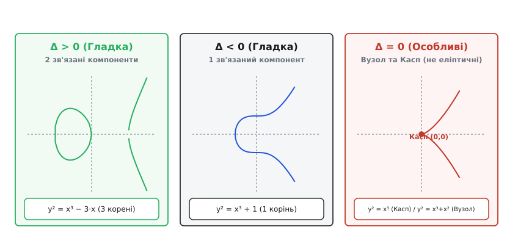
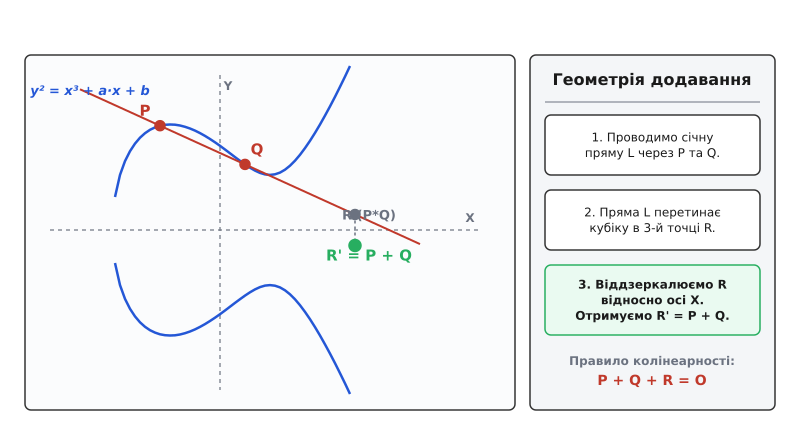
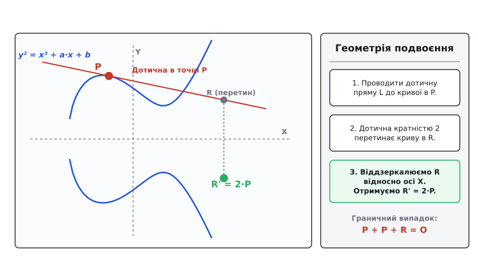
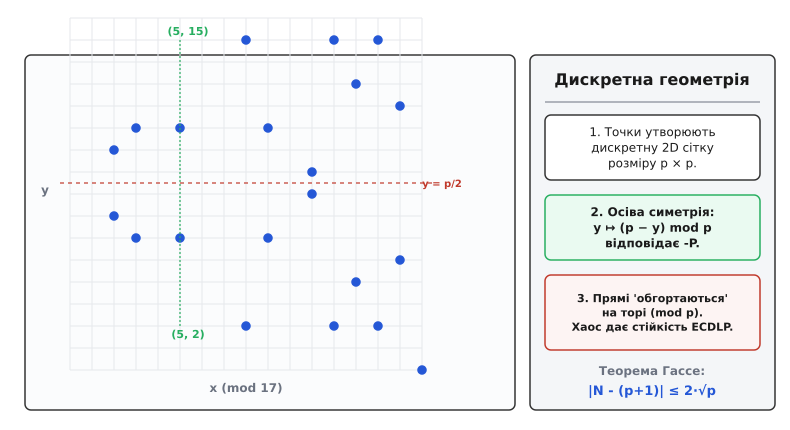

<preknowlist>
- [НСД та алгоритм Евкліда](topic:math-number-theory/gcd-euclidean) — подільність цілих чисел, найбільший спільний дільник та розширений алгоритм Евкліда.
- [Модульна арифметика](topic:math-number-theory/modular-arithmetic) — порівняння за модулем, обчислення у кільці залишків ℤ/pℤ та обернені елементи.
</preknowlist>

# Еліптичні криві

Еліптична крива — це неособлива алгебраїчна кубічна крива роду 1 з виділеною раціональною точкою. На множині її точок існує природна структура абелевої групи, яка об'єднує глибокі результати теорії чисел, аналітичної геометрії, комплексно-функціонального аналізу та сучасної криптографії.

---

## 1. Від конік до кубік: Геометрична природа роду кривої

Розв'язання діофантових рівнянь у раціональних чи цілих числах кардинально залежить від так званого **геометричного роду** алгебраїчної кривої `g`. 

Для кривих роду `g = 0` (коніки — кола, еліпси, параболи, гіперболи вида `A·x² + B·x·y + C·y² + D·x + E·y + F = 0`):
- Якщо існує хоча б одна раціональна точка `P₀`, то проведена через неї пряма `y - y₀ = t·(x - x₀)` з раціональним нахилом `t ∈ ℚ` перетинає коніку в **другій** точці `P(t)`, координати якої раціонально виражаються через `t`.
- Це дає повну раціональну параметризацію: коніка має або нескінченно багато раціональних точок, або жодної.

```
       g = 0 (Коніка)                        g = 1 (Еліптична крива / Кубіка)
       Параметризація прямими                Груповий закон (метод хорд і дотичних)

          \   /                                      Y ^
           \ /                                         |     /---\
      ------*-------> X                                |    /     \
           / \                                         +---*-------*---> X
          /   \                                        |    \     /
       (Раціональна                                    |     \---/
      параметризація)                             (Точки утворюють абелеву групу)
```

Для кубічних кривих (`g = 1`) ситуація змінюється докорінно. Пряма перетинає кубічну криву не в двох, а в **трьох** точках (за теоремою Безу). Зі знання однієї раціональної точки `P₀` неможливо побудувати параметризацію всієї кривої. Проте якщо відомо **дві** раціональні точки `P` та `Q`, пряма через них обов'язково перетинає кубіку у **третій** раціональній точці `R`.

Саме ця геометрична властивість хорд і дотичних утворює фундамент для **групового закону** на еліптичних кривих.

### Історична задача про конгруентні числа (Congruent Number Problem)

Найдавнішим прикладом виникнення еліптичних кривих у теорії чисел є класична проблема конгруентних чисел, яку досліджував ще арабський математик Аль-Караджі у X столітті та Леонард Ейлер у XVIII столітті.

Натуральне число `N` називається **конгруентним**, якщо воно є площею прямокутного трикутника з раціональними сторонами `a, b, c ∈ ℚ`:

```
a² + b² = c²,   (1/2) · a · b = N
```

Зробивши алгебраїчну заміну змінних:

```
x = (c / 2)²,   y = (a² - b²) · c / 8
```

отримуємо, що знаходження раціонального прямокутного трикутника площі `N` є строго еквівалентним знаходженню раціональної точки `(x, y)` з `y ≠ 0` на еліптичній кривій:

```
E_N : y² = x³ - N²·x
```

Число `N = 5` є конгруентним, оскільки прямокутний трикутник зі сторонами `a = 3/2`, `b = 20/3`, `c = 41/6` має площу `(1/2)·(3/2)·(20/3) = 5`. Відповідна раціональна точка на кривій `y² = x³ - 25·x` має координати `P = (1681/144, 62279/1728)`.

Теорема Джеррольда Таннела (Tunnell's Theorem, 1983) дає точний алгоритм перевірки конгруентності числа `N` через підрахунок цілочисельних точок у тривимірних еліпсоїдах, умови якого прямо випливають із Гіпотези Берча і Свіннертона-Даєра!

---

## 2. Рівняння Вейєрштрасса, дискримінант та морфологія

Будь-яку неособливу кубічну криву роду 1 з раціональною точкою над полем `K` (при `char(K) ≠ 2, 3`) можна шляхом біраціональних перетворень звести до **короткої форми Вейєрштрасса**:

```
y² = x³ + a·x + b
```

де `a, b ∈ K`. У проективних координатах `(X : Y : Z)`, де `x = X/Z` та `y = Y/Z`, рівняння набуває однорідного вигляду `Y²·Z = X³ + a·X·Z² + b·Z³`. Усі детальні алгебраїчні зведення та аналітичні виводи представлено у вставці [🧮 Виведення формул групового закону](topic:math-group-law-derivation.md).

Умова гладкості (неособливості) кривої означає відсутність точок самоперетину чи каспів. Це еквівалентно вимозі, щоб кубічний многочлен `P(x) = x³ + a·x + b` не мав кратних коренів. Умову гладкості контролює **дискримінант кривої `Δ`**:

```
Δ = -16 · (4·a³ + 27·b²)
```

- **`Δ ≠ 0`**: Крива є неособливою (еліптичною).
- **`Δ = 0`**: Крива є особливою (виродженою):
  - Якщо `a = 0, b = 0` (`y² = x³`), виникає **касп** (точка загострення).
  - Якщо `4·a³ + 27·b² = 0` при `a, b ≠ 0` (наприклад `y² = x³ + x²`), виникає **вузол** (точка самоперетину).


*Форма еліптичної кривої над дійсними числами ℝ залежить від знака дискримінанта Δ: при Δ > 0 крива складається з двох зв'язних компонент, при Δ < 0 — з однієї; при Δ = 0 крива стає особливою (вузол або касп).*

Для класифікації кривих із точністю до ізоморфізму над алгебраїчно замкненим полем використовується **`j`-інваріант**:

```
j = 1728 · (4·a³) / (4·a³ + 27·b²) = -1728 · (4·a³) / Δ
```

Дві еліптичні криві ізоморфні над `K̄` тоді і тільки тоді, коли їхні `j`-інваріанти збігаються.

---

## 3. Геометричний груповий закон (метод хорд і дотичних)

Множина точок неособливої еліптичної кривої `E(K)` разом із виділеною нескінченно віддаленою точкою `O = (0 : 1 : 0)` утворює **коммутативну (абелеву) групу** відносно операції додавання `+`.

### Геометричне правило:
1. **Додавання нерівних точок `P + Q` (`P ≠ Q`):**
   Проведемо січну пряму через точки `P` та `Q`. За теоремою Безу пряма перетинає криву у третій точці `R`. Симетрично віддзеркалимо точку `R` відносно осі абсцис `X` (змінимо знак ординати `y`). Отримана точка `-R = (x_R, -y_R)` називається сумою `P + Q`.


*Геометричне додавання точок P та Q: пряма перетинає криву в точці R, а її симетричне віддзеркалення відносно осі абсцис дає суму R' = P + Q.*

2. **Подвоєння точки `2·P` (`P = Q`):**
   Якщо точки збігаються `P = Q`, замість січної проведемо **дотичну пряму** до кривої у точці `P`. Вона перетинає криву у точці `R`. Віддзеркалення цієї точки відносно осі абсцис дає подвоєну точку `2·P = -R`.


*Геометричне подвоєння точки P: дотична пряма в точці P перетинає криву в точці R, віддзеркалення якої дає 2·P = R'.*

3. **Нейтральний елемент `O`:**
   Нескінченно віддалена точка `O` слугує нулем групи: `P + O = P` для будь-якої точки `P`. Вертикальна пряма перетинає криву в точках `P = (x, y)`, `-P = (x, -y)` та в точці `O`.

### Координатні формули над полем `K` (`char(K) ≠ 2, 3`):

Для точок `P = (x₁, y₁)` та `Q = (x₂, y₂)` сума `P + Q = (x₄, y₄)` обчислюється так:

```
λ = (y₂ - y₁) / (x₂ - x₁),           якщо P ≠ Q (додавання)
λ = (3·x₁² + a) / (2·y₁),            якщо P = Q (подвоєння)

x₄ = λ² - x₁ - x₂
y₄ = λ·(x₁ - x₄) - y₁
```

Формули додавання вимагають операції ділення (знаходження оберненого елемента за модулем), що є найбільш обчислювально витратним кроком.

---

## 4. Комплексна геометрія: Еліптичні функції, гратки та модулярна група

У комплексній геометрії будь-яка еліптична крива над полем `ℂ` ізоморфна комплексному тору `ℂ / Λ`, де `Λ = {m·ω₁ + n·ω₂ : m, n ∈ ℤ}` — двовимірна гратка періодів. 

Ізоморфізм задається еліптичною `℘`-функцією Вейєрштрасса:

```
z ↦ (℘(z) : ℘'(z) : 1)
```

Повний аналітичний огляд комплексного тору, рядів Ейзенштейна `G₄, G₆` та історії відкриття еліптичних інтегралів Ейлером, Гауссом та Якобі наведено у вставці [📜 Історія відкриття еліптичних інтегралів](topic:hist-elliptic-integrals.md).

### Сигма- та Дзета-функції Вейєрштрасса та Співвідношення Лежандра

Поряд із `℘(z)`, Вейєрштрасс ввів **дзета-функцію `ζ(z)`**, яка описується неповним двоперіодичним рядом:

```
ζ(z) = 1/z + ∑_{w ∈ Λ\{0}} [ 1/(z - w) + 1/w + z/w² ]
```

Похідна дзета-функції дорівнює мінус `℘`-функції: `ζ'(z) = -℘(z)`.

Інтегруючи `ζ(z)`, отримуємо цілу цілу **сигма-функцію Вейєрштрасса `σ(z)`**:

```
σ(z) = z · ∏_{w ∈ Λ\{0}} (1 - z/w) · exp(z/w + (1/2) · (z/w)²)
```

Значення залишків дзета-функції на періодах `η₁ = 2·ζ(ω₁ / 2)` та `η₂ = 2·ζ(ω₂ / 2)` задовольняють знамените **Співвідношення Лежандра для періодів**:

```
η₁ · ω₂ - η₂ · ω₁ = 2 · π · i
```

### Топологічна структура Риманової поверхні роду 1

Топологічно еліптична крива над complex полем `ℂ` є двовимірним тором `S¹ × S¹`. Проективно її можна розглядати як **дволисте накриття** комплексної проективної прямої `ℙ¹(ℂ)` з 4 точками розгалуження `e₁, e₂, e₃` та `∞`.

Розрізи між точками розгалуження `[e₁, e₂]` та `[e₃, ∞]` склеюють два листи комплексної площини в один гладкий тороподібний многовид роду `g = 1`. 

Перша група гомологій тора `H₁(E, ℤ) ≅ ℤ ⊕ ℤ` породжується двома незалежними замкненими циклами `γ₁` (A-цикл, що обходить шийку тора) та `γ₂` (B-цикл, що обходить внутрішній отвір). Інтегрування інваріантного диференціала `ω = dx / (2y)` уздовж цих циклів відновлює періоди гратки:

```
ω₁ = ∮_{γ₁} dx / (2y),   ω₂ = ∮_{γ₂} dx / (2y)
```

### Фундаментальні теореми теорії еліптичних функцій

Еліптичною функцією називається мероморфна двоперіодична функція `f(z + w) = f(z)` для всіх `w ∈ Λ`. Загальна теорія комплексних торів спирається на 3 класичні теореми Ліувілля:

1. **Перша теорема Ліувілля:** Голоморфна еліптична функція (яка не має полюсів у фундаментальному паралелограмі) є строго константою.
2. **Друга теорема Ліувілля:** Сума залишків (residues) еліптичної функції у полюсах фундаментального паралелограма дорівнює нулю: `∑ Res(f) = 0`. Зокрема, не існує еліптичної функції з єдиним простим полюсом.
3. **Третя теорема Ліувілля:** Кількість полюсів еліптичної функції дорівнює кількості її нулів (з урахуванням кратності). Це число називається **порядком еліптичної функції** (`n ≥ 2`). Для функцій Вейєрштрасса order(`℘`) = 2, оскільки вона має єдиний полюс 2-го порядку у точці `z = 0`.

Модулярна група `SL₂(ℤ)` оперує на верхній напівплощині `ℍ = {τ ∈ ℂ : Im(τ) > 0}` за допомогою дрібно-лінійних перетворень:

```
τ ↦ (a·τ + b) / (c·τ + d),   де a, b, c, d ∈ ℤ, ad - bc = 1
```

Модулярний дискримінант `Δ(τ)` задається як параболічна форма ваги 12 відносно групи `SL₂(ℤ)` за допомогою Ейлерового добутку для ета-функції Дедекінда `η(τ)`:

```
Δ(τ) = (2·π)¹² · η(τ)²⁴ = (2·π)¹² · q · ∏_{n=1}^∞ (1 - qⁿ)²⁴,   де q = e^{2·π·i·τ}
```

Коефіцієнти Фур'є цього розкладу `Δ(τ) = (2·π)¹² · ∑_{n=1}^∞ τ(n) · qⁿ` задають знамениту **функцію Рамануджана `τ(n)`**. Гіпотеза Рамануджана про обмеженість її значень `|τ(p)| ≤ 2 · p^{11/2}` була доведена П'єром Делінем у 1974 році як наслідок Гіпотез Вейля.

### Комплексне множення (Complex Multiplication, CM)

Для більшості граток періодів `Λ` кільце ендоморфізмів `End(E)` еліптичної кривої складається лише зі звичайного скалярного множення `[m] : z ↦ m·z`, тому `End(E) ≅ ℤ`.

Проте для окремих особливих граток періодів (де відношення періодів `τ = ω₂ / ω₁` належить уявній квадратичній розширенню `ℚ(√-d)`) кільце ендоморфізмів `End(E)` розширюється до порядку уявного квадратичного поля `O_d`. Це явище називається **Комплексним множенням**:

1. **Крива Гаусса `y² = x³ - x` (`j = 1728`):**
   Гратка періодів є квадратичною `Λ = ℤ ⊕ i·ℤ`. Ендоморфізм `[i] : (x, y) ↦ (-x, i·y)` має 4-й порядок (`i² = -1`). Кільце ендоморфізмів `End(E) ≅ ℤ[i]` (Гаусові цілі числа).

2. **Крива Ейзенштейна `y² = x³ + 1` (`j = 0`):**
   Гратка періодів є гексагональною `Λ = ℤ ⊕ ζ₃·ℤ` (де `ζ₃ = e^{2πi / 3}`). Ендоморфізм `[ζ₃] : (x, y) ↦ (ζ₃·x, y)` має 6-й порядок. Кільце ендоморфізмів `End(E) ≅ ℤ[e^{2πi / 3}]` (числа Ейзенштейна).

Теорія комплексного множення дозволяє будувати еліптичні криві із заздалегідь відомою точною кількістю точок nad `𝔽ₚ` (алгоритм CM-побудови кривих), що є ключовим інструментом при створенні кривих для спарювань (Pairing-Friendly Curves, таких як BN254 або BLS12-381).

---

## 5. Теорема Морделла–Вейля та раціональні точки над ℚ

Найголовнішим результатом арифметики еліптичних кривих над полем раціональних чисел `ℚ` є **Теорема Морделла–Вейля** (доведена Луїсом Морделлом у 1922 році для `ℚ` та узагальнена Андре Вейлем у 1928 році для довільних числових полів):

> **Теорема Морделла–Вейля:** Група раціональних точок `E(ℚ)` неособливої еліптичної кривої є **скінченно породженою абелевою групою**:
>
> `E(ℚ) ≅ E(ℚ)_tors ⊕ ℤʳ`
>
> де `E(ℚ)_tors` — скінченна група точок кручення, а `r ≥ 0` — **ранг еліптичної кривої**.

### Конструкція доведення: Метод нескінченного спуску Ферма

Доведення теореми Морделла спирається на дві фундаментальні вимоги:
1. **Скінченність фактор-групи `E(ℚ) / 2·E(ℚ)`:** Фактор-група точок по підгрупі подвоєних точок є скінченною.
2. **Властивості функцій висоти:** Існує функція логарифмічної висоти `h(P)`, яка задовольняє:
   - Для будь-якого `B > 0` множина точок `{P ∈ E(ℚ) : h(P) ≤ B}` є скінченною.
   - Для кожної точки `P₀` існує константа `C`, така що `h(P + P₀) ≤ 2·h(P) + C`.
   - `h(2·P) = 4·h(P) - C'`.

Канонічна висота Нерона–Тате `ĥ(P) = lim_{n → ∞} h(2ⁿ·P) / 4ⁿ` задає додатньо визначену квадратичну форму на `E(ℚ) / E(ℚ)_tors`, що перетворює раціональний ранг на розмірність векторного простору!

### Матриця Грама та Регулятор Морделла–Вейля R_E

Для базових точок нескінченного порядку `{P₁, P₂, ..., P_r}` будується симетрична білінійна скалярна матриця Грама:

```
⟨P_i, P_j⟩ = (1/2) · [ ĥ(P_i + P_j) - ĥ(P_i) - ĥ(P_j) ]
```

Визначник цієї матриці `R_E = det(⟨P_i, P_j⟩)` називається **Регулятором Морделла–Вейля**. Регулятор вимірює «щільність» раціональних точок на кривій `E` та входить до точної формули Гіпотези BSD.

### Локально-глобальний принцип Гассе та Група Тейта–Шафаревича Ш(E/ℚ)

Для класичних конік виконується класичний Локально-глобальний принцип Гассе: рівняння має раціональний розв'язок у `ℚ` тоді і тільки тоді, коли воно має розв'язок у дійсних числах `ℝ` та у всіх `p`-адичних полях `ℚ_p`.

Для кубічних еліптичних кривих **принцип Гассе НЕ ЗАВЖДИ ВИКОНУЄТЬСЯ**! Знаменитий приклад Ернста Сельмера (1951) показує, що кубічне рівняння:

```
3·x³ + 4·y³ + 5·z³ = 0
```

має розв'язки над `ℝ` та над усіма `p`-адичними полями `ℚ_p`, але **НЕ МАЄ ЖОДНОГО НЕТРИВІАЛЬНОГО РАЦІОНАЛЬНОГО РОЗВ'ЯЗКУ** у `ℚ`!

Мірою порушення принципу Гассе є скінченна **Група Тейта–Шафаревича `Ш(E/ℚ)`**, елементи якої описуються точними когомологіями Галуа `H¹(Gal(ℚ̄/ℚ), E)`. 

### Структура точок кручення: Теорема Мазура та Теорема Луца–Жіловена

Які скінченні групи кручення `E(ℚ)_tors` взагалі можуть виникати над `ℚ`? Відповідь дає фундаментальна теорема Баррі Мазура (1977):

> **Теорема Мазура:** Група кручення `E(ℚ)_tors` для будь-якої еліптичної кривої над `ℚ` може бути ізоморфною лише одній із **15 канонічних груп**:
> - `ℤ / n·ℤ`, де `1 ≤ n ≤ 10` або `n = 12`;
> - `ℤ / 2·ℤ ⊕ ℤ / 2n·ℤ`, де `1 ≤ n ≤ 4`.

Для практичного знаходження точок кручення використовують **Теорему Луца–Жіловена (Lutz-Nagell Theorem)**:
- Якщо точка `P = (x, y) ∈ E(ℚ)` має скінченний порядок (`P ∈ E(ℚ)_tors`), то її координати `x` та `y` є **цілими числами** (`x, y ∈ ℤ`).
- При цьому або `y = 0` (точка 2-го порядку), або `y²` є точним дільником дискримінанта кривої `Δ` (`y² | Δ`).

#### Приклад:
Для кривої `y² = x³ - x` дискримінант дорівнює `Δ = 64`. Цілі корені `y² | 64` дають точні координати точок кручення `E(ℚ)_tors = { O, (0, 0), (1, 0), (-1, 0) } ≅ ℤ / 2·ℤ ⊕ ℤ / 2·ℤ`.

Аналогічно, для кривої Ейзенштейна `y² = x³ + 1` цілі корені ділять `Δ = -432`, що дає точно 6 точок кручення: `E(ℚ)_tors = { O, (0, 1), (0, -1), (-1, 0), (2, 3), (2, -3) } ≅ ℤ / 6·ℤ`.

---

## 6. Проблема раціонального рангу r, Факторизація Ленстри (ECM) та Гіпотеза BSD

На відміну від точок кручення, ранг `r` описує нескінченну частину групи `E(ℚ) ≅ E(ℚ)_tors ⊕ ℤʳ`.
- Якщо `r = 0`, крива має лише скінченну кількість раціональних точок.
- Якщо `r ≥ 1`, крива має **нескінченно багато** раціональних точок, які породжуються `r` незалежними точками нескінченного порядку.

Чи існує алгоритм для знаходження рангу `r` для довільної кривої? Чи може ранг бути довільно великим? Наразі найвищий відомий ранг дорівнює `r ≥ 28` (знайдений Елкісом у 2006 році).

### Метод факторизації Хендріка Ленстри (ECM - Elliptic Curve Factorization)

Окрім чистої алгебраїчної теорії, група точок еліптичної кривої утворює потужний алгоритм факторизації великих складених чисел `N`. 

Метод Ленстри (1987) обирає випадкову криву `E` над кільцем `ℤ / N·ℤ` та точку `P`. Потім виконується скалярне множення `k·P` для `k = lcm(1, 2, ..., B)`. Якщо для якогось невідомого простого дільника `p | N` порядок групи `#E(𝔽_p)` ділить `k`, а для дільника `q` не ділить, то у проективних формулах координата `Z` стає кратною `p`. НСД `gcd(Z, N)` негайно відкриває таємний дільник `p`! 

Часова складність `O(exp((√2 + o(1)) · √(ln p · ln ln p)))` робить ECM найкращим алгоритмом у світі для пошуку дільників розміром до 80-100 біт.

### Гіпотеза Берча і Свіннертона-Даєра (BSD)

Відповідь на питання про значення рангу `r` дає одна з 7 Проблем Тисячоліття — **Гіпотеза Берча і Свіннертона-Даєра (BSD Conjecture)**.

Гіпотеза пов'язує аналітичну поведінку `L`-функції еліптичної кривої `L(E, s)` у точці `s = 1` з алгебраїчним рангом `r`:

```
L(E, s) = ∏_{p ∤ Δ} [ 1 - a_p·p⁻ˢ + p¹⁻²ˢ ]⁻¹
```

де `a_p = p + 1 - #E(𝔽ₚ)` — слід Фробеніуса за модулем `p`.

> **Гіпотеза BSD (слабка форма):** Порядок нуля `L`-функції кривої `E` у точці `s = 1` строго дорівнює алгебраїчному рангу `r` групи Морделла–Вейля `E(ℚ)`:
>
> `ord_{s=1} L(E, s) = r`

### Повна асимптотична формула BSD (сильна форма):

Сильна форма гіпотези BSD стверджує, що перший ненульовий член розкладу Тейлора `L`-функції у точці `s = 1` виражається точної алгебраїчною формулою:

```
lim_{s → 1}  L(E, s) / (s - 1)ʳ  =  ( Ω_E · R_E · #Ш(E/ℚ) · ∏ c_p ) / ( #E(ℚ)_tors )²
```

де:
- `Ω_E` — дійснозначний період кривої (інтеграл від голоморфного диференціала `ω = dx / (2y)`);
- `R_E` — регулятор Морделла–Вейля;
- `Ш(E/ℚ)` — група Тейта–Шафаревича (вимірює відхилення від принципу Гассе);
- `c_p` — локальні індекси Тамагави для точок поганого зведення;
- `#E(ℚ)_tors` — порядок групи кручення.

---

## 7. Еліптичні криві над скінченними полями 𝔽ₚ, Редукція за модулем p, Символ Лежандра та Теорема Гассе

У теорії чисел та криптографії розглядають еліптичні криві над скінченними полями `𝔽ₚ`. Оскільки множина координат обмежена точками сітки `𝔽ₚ × 𝔽ₚ`, кількість точок `#E(𝔽ₚ)` є скінченним числом.


*Дискретна еліптична крива над скінченним полем 𝔽ₚ утворює симетричну сітку точок відносно горизонтальної осі y = p/2 завдяки тотожності y² ≡ (p - y)² (mod p).*

### Типи редукції за модулем p (Good / Bad Reduction) та Провідник N_E

Нехай еліптична крива `E` визначена над `ℚ`. Для кожного простого числа `p` розглядають її зведення (редукцію) `Ẽ(𝔽ₚ)` за модулем `p`:
1. **Добре зведення (Good Reduction):** Якщо `p ∤ Δ`, крива `Ẽ` залишається неособливою еліптичною кривою над `𝔽ₚ`.
2. **Мультиплікативне зведення (Multiplicative Reduction):** Якщо `p | Δ`, але `p ∤ c₄`, особлива точка є вузлом. Множина неособливих точок `Ẽ_{ns}(𝔽ₚ)` утворює мультиплікативну групу `𝔽ₚ*`.
3. **Адитивне зведення (Additive Reduction):** Якщо `p | Δ` та `p | c₄`, особлива точка є каспом. Множина неособливих точок `Ẽ_{ns}(𝔽ₚ)` утворює адитивну групу `𝔽ₚ`.

Ці типи редукцій задають важливий інваріант — **Провідник еліптичної кривої `N_E = ∏ p^{f_p}`**, який є точним рівнем відповідної модулярної форми.

Кількість розв'язків рівняння `y² ≡ x³ + a·x + b (mod p)` для кожного фіксованого `x` точно виражається через **Символ Лежандра** `((x³ + a·x + b) / p)`:
- Якщо `x³ + a·x + b ≡ 0 (mod p)`, то є 1 розв'язок (`y = 0`).
- Якщо `x³ + a·x + b` є квадратичним лишком, то є 2 розв'язки (`±y`).
- Якщо є квадратичним нелишком, розв'язків немає (0).

Отже, точна кількість точок кривої `E(𝔽ₚ)` виражається сумою:

```
#E(𝔽ₚ) = p + 1 + ∑_{x ∈ 𝔽ₚ} ( (x³ + a·x + b) / p )
```

Строку оцінку відхилення цієї суми від середнього значення `p + 1` дає фундаментальна **Теорема Гассе (Hasse bound)**:

> **Теорема Гассе (1934):** Кількість точок еліптичної кривої `#E(𝔽ₚ)` над скінченним полем `𝔽ₚ` задовольняє сувору нерівність:
>
> `| #E(𝔽ₚ) - (p + 1) | ≤ 2 · √p`

Значення `t = p + 1 - #E(𝔽ₚ)` називається **слідом Фробеніуса**.

### Алгоритм Шоофа (Schoof's Algorithm) та розширення SEA

Обчислення кількості точок `#E(𝔽ₚ)` для великих криптографічних простих чисел `p` (наприклад `p ≈ 2²⁵⁶`) неможливо виконати повним перебором. У 1985 році Рене Шооф розробив перший поліноміальний алгоритм з часовою складністю `O(log⁸ p)`. 

Алгоритм Шоофа використовує поділкові многочлени `Ψ_ℓ(x)` (розглянуті у вставці [🧮 Виведення формул групового закону](topic:math-group-law-derivation.md)) для обчислення значення `t mod ℓ` для малого набору простих чисел `ℓ₁, ℓ₂, ..., ℓ_k`. Знайшовши залишки `t mod ℓ_i`, підсумкове значення `t` однозначно відновлюється за допомогою Китайської теореми про залишки!

Модифікація **SEA (Schoof-Elkies-Atkin Algorithm)** розбиває малі прості числа `ℓ` на класи Елкіса та Аткіна, прискорюючи алгоритм Шоофа до `O(log⁴ p)` операцій, що дозволяє генерувати безпечні криптографічні криві за лічені мілісекунди.

---

## 8. Моделі кривих у сучасній криптографії (Вейєрштрасс, Монтгомері, Едвардс)

Залежно від практичних вимог обчислювальної швидкості та захисту від атак, у криптографії застосовують 3 основні математичні моделі еліптичних кривих:

1. **Короткі криві Вейєрштрасса (`y² = x³ + a·x + b`):**
   - *Представники:* `secp256k1` (Bitcoin, Ethereum), `NIST P-256`.
   - *Особливості:* Класичний стандарт. Обчислення у координатах Якобі вимагають `12M + 4S` для додавання.
   - *Мінуси:* Наявність окремих формул для подвоєння та додавання точок, що вимагає обережності для запобігання атак по побічних каналах.

2. **Криві Монтгомері (`B·y² = x³ + A·x² + x`):**
   - *Представники:* `Curve25519` (X25519 в OpenSSH, TLS 1.3, Signal).
   - *Особливості:* Скалярне множення виконується виключно по **`x`-координаті** за допомогою драбини Монтгомері (Montgomery Ladder). 
   - *Плюси:* Рекордна швидкість обміну ключами Діффі-Геллмана та вроджена стійкість до атак за часом виконання.

3. **Скручені криві Едвардса (`a·x² + y² = 1 + d·x²·y²`):**
   - *Представники:* `Ed25519` (цифрові підписи EdDSA).
   - *Особливості:* Повність додавання (Complete Addition Formulas). Формула додавання точок є **універсальною**: вона працює однакове як для нерівних точок, так і для подвоєння `P = Q`, і навіть для нуля `O`!
   - *Плюси:* Повне усунення умовних розгалужень у коді на алгебраїчному рівні.

---

## 9. Застосування: Еліптична криптографія (ECC), ECDH, ECDSA, Ed25519, zk-SNARKs та Ізогенії

Криптографічна стійкість систем на еліптичних кривих спирається на складність **Проблеми дискретного логарифма у групі точок еліптичної кривої (ECDLP)**:

> **Задача ECDLP:** За даними точками `P` та `Q = k·P` на еліптичній кривій над `𝔽ₚ` знайти ціле число `k` (приватний ключ).

На відміну від звичайного дискретного логарифма у мультиплікативній групі `𝔽ₚ*` або факторизації цілих чисел (де працює субекспоненційний метод субполів алгебраїчного числа `NFS`), для довільної еліптичної кривої не існує субекспоненційних алгоритмів! Найкращий відомий загальний метод — `ρ`-алгоритм Полларда — має експоненційну складність `O(√p)`.

### Порівняння довжини ключів для однакового рівня стійкості:

| Рівень безпеки (біти) | RSA ключ (біти) | Еліптична крива ECC (біти) | Співвідношення розміру |
|---|---|---|---|
| **80** | 1024 | **160** | 1 : 6 |
| **128** (стандарт) | 3072 | **256** (secp256k1 / Curve25519) | 1 : 12 |
| **256** (найвищий) | 15360 | **512** | 1 : 30 |

Завдяки компактним розмірам ключів (256 біт замість 3072 біт) ECC забезпечує колосальну епонію обчислювальних ресурсів, пропускної здатності мережі та пам'яті.

> 🔧 **Навіщо це.** Еліптичні криві — це серце захисту сучасного цифрового світу. Щоразу, коли ви відкриваєте HTTPS-сайт (TLS 1.3), підключаєтеся через SSH, підписуєте транзакцію у Bitcoin чи Ethereum або надсилаєте повідомлення у Signal, ваш пристрій виконує скалярне множення точок на еліптичній кривій (найчастіше `Curve25519` або `secp256k1`). Реалізація точкової арифметики трьома мовами програмування детально розібрана у вставці [⚙️ Реалізація точкової арифметики](topic:proj-ecc-point-arithmetic.md).

### Протокол обміну ключами ECDH (Elliptic Curve Diffie-Hellman)

Протокол **ECDH** дозволяє двом сторонам (Алісі та Бобу) створити спільний секретний ключ через незахищений канал зв'язку:
1. Аліса обирає приватний ключ `d_A` і надсилає Бобу публічний ключ `Q_A = d_A · G`.
2. Боб обирає приватний ключ `d_B` і надсилає Алісі публічний ключ `Q_B = d_B · G`.
3. Аліса обчислює `S = d_A · Q_B = d_A · (d_B · G)`.
4. Боб обчислює `S = d_B · Q_A = d_B · (d_A · G)`.
5. Обидві сторони отримують **однакову точку** `S = (x_S, y_S)`. Абсциса `x_S` використовується як сеансовий ключ симетричного шифрування (AES-GCM).

### Алгоритми цифрового підпису ECDSA, Шнорр (BIP-340) та Ed25519 (EdDSA)

Стандарт **ECDSA (Elliptic Curve Digital Signature Algorithm)** працює так:
1. **Генерація пари ключів:** Обирається випадковий приватний ключ `d ∈ [1, n-1]`. Публічний ключ обчислюється як точка `Q = d·G` (де `G` — базова точка генератора).
2. **Створення підпису для повідомлення `m`:**
   - Обчислюється криптографічний геш `h = Hash(m)`.
   - Обирається випадковий секретний криптографічний одноразовий значення (nonce) `k ∈ [1, n-1]`.
   - Обчислюється точка `R = k·G = (x₁, y₁)`. Значення `r = x₁ mod n`. Якщо `r = 0`, обирається інше `k`.
   - Обчислюється значення `s = k⁻¹ · (h + r·d) mod n`.
   - Цифровий підпис складається з пари чисел `(r, s)`.
3. **Перевірка підпису `(r, s)` для гешу `h`:**
   - Обчислюються коефіцієнти `u₁ = h · s⁻¹ mod n` та `u₂ = r · s⁻¹ mod n`.
   - Обчислюється точка `P = u₁·G + u₂·Q = (x₂, y₂)`.
   - Підпис є валідним тоді і тільки тоді, коли `x₂ mod n == r`.

В алгоритмі **Ed25519 (EdDSA)** одноразове значення `k` генерується строго детерміновано: `k = SHA-512(d || m)`. Це повністю виключає катастрофічні витоки приватного ключа при випадковому повторному використанні одного й того самого `k` (як це сталося при зломі приставки Sony PlayStation 3 в ECDSA).

У протоколі Bitcoin (оновлення Taproot / BIP-340) алгоритм ECDSA замінено на **підписи Шнорра (Schnorr Signatures)**. Головна перевага підписів Шнорра — їхня алгебраїчна лінійність, яка дозволяє об'єднувати багато підписів різних учасників у єдиний 64-байтний підпис (MuSig), що підвищує приватність та зменшує розміри блоків блокчейну.

### Системи доказів із нульовим розголошенням (zk-SNARKs)

У сучасних протоколах приватності (Zcash, Ethereum Rollups) використовуються **спарювання на еліптичних кривих (Pairings)** nad кривими `BN254` та `BLS12-381`. Вони дозволяють перевіряти складні математичні твердження без розкриття самих даних за допомогою білінійного відображення `e: G₁ × G₂ → G_T`.

### Еліптичні криві у поствизначеному світі (Post-Quantum Cryptography & Isogenies)

З появою потужних квантових комп'ютерів алгоритм Шора зможе обчислювати дискретний логарифм у будь-якій абелевій групі за поліноміальний час `O((log p)³)`.

Для створення квантово-стійких систем використовують **криптографію на ізогеніях (CSIDH)**. Замість арифметики точок усередині однієї групи, операції виконуються над **графами ізогеній** між різними суперсингулярними еліптичними кривими. Кільце ендоморфізмів суперсингулярних кривих `End(E)` є некоммутативним порядком у кватерніонній алгебрі, де квантовий алгоритм Шора повністю втрачає свою ефективність.

### Атаки на некоректні криві (Invalid Curve Attacks) та Алгоритм Поліга–Хеллмана

Під час прийому публічної точки `Q` від контрагента криптографічна система зобов'язана суворо перевірити, що координати точки задовольняють вихідне рівняння кривої `y² ≡ x³ + a·x + b (mod p)`. 

Якщо розробник пропустить цю перевірку, зловмисник може навмисно передати точку `Q'`, яка лежить не на кривій `E`, а на викрученій нестійкій кривій `E' : y² = x³ + a·x + b'`. За алгоритмом **Поліга–Хеллмана (Pohlig-Hellman Algorithm)**, якщо порядок цієї нестійкої кривої `#E'(𝔽ₚ)` розкладається на добуток малих простих дільників `∏ p_i^{e_i}`, зловмисник зможе швидко обчислити значення приватного ключа за модулем кожного малого простого числа `k mod p_i`, а потім відновити повне значення приватного ключа `k` за допомогою Китайської теореми про залишки всего за декілька запитів!

Саме тому сувора валідація належності точок кривій та перевірка порядку підгрупи є фундаментальною інженерною вимогою безпеки при розробці криптографічних модулів у промисловому програмуванні.

---

## 10. Модулярність та доведення Останньої теореми Ферма

Еліптичні криві відіграли центральну роль у доведенні найвідомішої математичної загадки століття — **Останньої теореми Ферма** (`xⁿ + yⁿ = zⁿ` не має натуральних розв'язків при `n ≥ 3`).

У 1984 році Герхард Фрей висунув гіпотезу, що якби існував розв'язок рівняння Ферма `aⁿ + bⁿ = cⁿ`, то з нього можна побудувати фіктивну еліптичну криву Фрея:

```
y² = x · (x - aⁿ) · (x + bⁿ)
```

Крива Фрея володіє абсолютно дивовижними властивостями: її дискримінант має вигляд `Δ = (a·b·c)²ⁿ / 256`. У 1986 році Кен Рібет довів, що крива Фрея **не може бути модулярною**.

У 1994 році Ендрю Вайлс (за участю Річарда Тейлора) блискуче довів **Теорему про модулярність (Гіпотезу Таніями–Шимури–Вейля)** для напівстабільних еліптичних кривих:

> **Теорема про модулярність:** Кожна еліптична крива над `ℚ` є **модулярною**, тобто пов'язаною з відповідною параболічною модулярною формою ваги 2.

Оскільки кожна раціональна еліптична крива зобов'язана бути модулярною, а крива Фрея модулярною бути не може, це означає, що **крива Фрея не існує**. Отже, не існує й початкового розв'язку рівняння Ферма! Остання теорема Ферма була остаточно доведена після 358 років пошуку.

---

## 11. Підсумок

Еліптичні криві є унікальним математичним мостом між чистою алгеброю, геометрією, теорією чисел та практичною інженерією. Від комплексної `℘`-функції Вейєрштрасса та Останньої теореми Ферма — до захисту банківських транзакцій, криптовалют та пост-квантового зашифрування — еліптичні криві залишаються однією з найвеличніших і найпрактичніших концепцій в історії науки.
