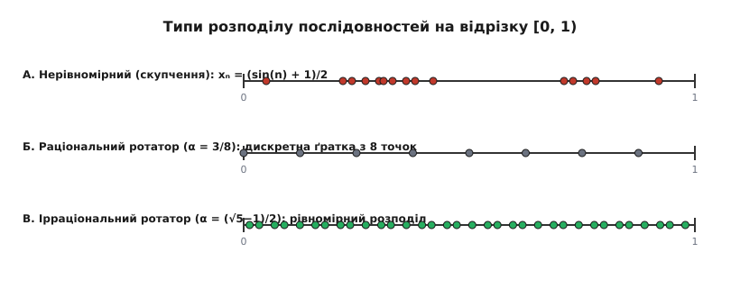
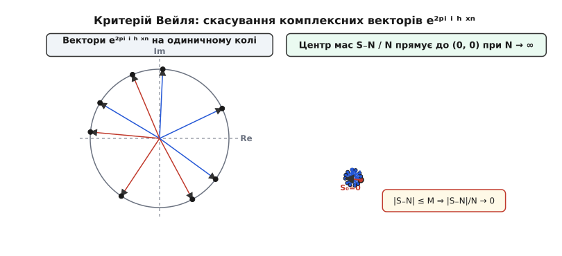
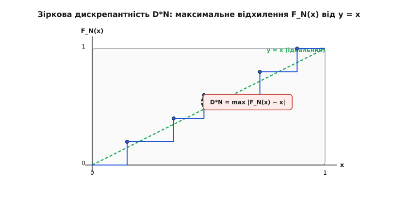
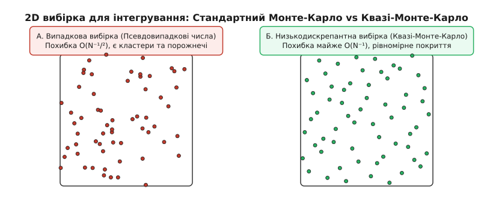

# Рівномірний розподіл за модулем одиниці

<preknowlist>
- [Ланцюгові дроби](topic:math-number-theory/continued-fractions) — квадратні ірраціональності та найкращі раціональні наближення.
- [Ідея Фур'є](topic:math-analysis/fourier-idea) — розклад періодичних функцій у суми гармонік.
- [Золотий перетин](topic:math-number-theory/golden-ratio) — найгірше наближуване ірраціональне число.
</preknowlist>

Уявімо механічний ротор або диск, який на кожному кроці повертається на кут `α`, виміряний у частках одного повного оберту від `0` до `1`. Якщо кут повертання є раціональним числом — наприклад `α = 3/8`, — ротор за вісім кроків опише коло й повернеться точно у початковий стан. При цьому його стрілка відвідає лише вісім дискретних кутів `0, 3/8, 6/8, 1/8, 4/8, 7/8, 2/8, 5/8`, лишаючи решту кола повністю порожньою. Проте якщо кут зсуву `α` виявиться ірраціональним числом — наприклад `√2 − 1` або золотим перетином `(√5 − 1) / 2`, — послідовність кутових положень не повториться ніколи. Стрілка ротора описуватиме все нові й нові позиції, незупинно заповнюючи простір.

Виникає глибше арифметичне та мірно-теоретичне питання: як саме ці точки розсипані вздовж кола з перебігом часу? Чи не виявиться так, що ротор годинами застрягає в одній півсфері, зрідка проскакуючи в іншу, чи його точки відвідують кожен інтервал із часовою частотою, яка суворо пропорційна геометрії цього інтервалу?

Відповідь дає теорія **рівномірного розподілу за модулем одиниці** (англ. *equidistribution modulo 1*). Вона досліджує не просто топологічну присутність точок у регіонах, а асимптотичну часову рівномірність — гарантію того, що у довгостроковій перспективі будь-які два відрізки однакової довжини отримують однакову кількість точок вибірки.

---

## 1. Дробова частина та строге означення рівномірності

Будь-яке дійсне число `x` розкладається на цілу частину `⌊x⌋` (найбільше ціле число, яке не перевищує `x`) та дробову частину `{x} = x − ⌊x⌋`. За означенням, дробова частина завжди належить напівінтервалу `[0, 1)`. 

З геометричного погляду операція узяття дробової частини відповідає відображенню дійсної прямої `ℝ` на одиничне коло або одноновимірний тор `ℝ / ℤ` довжиною `1`. Коли число `x` зростає, відповідна точка `{x}` нескінченно рухається по колу від `0` до `1` і повертається у `0`.

Розглянемо нескінченну послідовність дійснозначних чисел `(xₙ)_{n=1}^∞` та послідовність їхніх дробових частин `{xₙ} ∈ [0, 1)`. Зафіксуємо довільний вимірний підінтервал `[a, b) ⊆ [0, 1)` з геометричною довжиною `b − a`. Для кожного скінченного числа випробувань `N` обчислимо кількість точок із перших `N` членів послідовності, які потрапили всередину обраного інтервалу:

```
A([a, b); N) = # { 1 ≤ n ≤ N : {xₙ} ∈ [a, b) }
```

Відношення `A([a, b); N) / N` виражає відносну частоту випадання точок у підінтервал `[a, b)`.

**Строге означення.** Послідовність чисел `(xₙ)` називається **рівномірно розподіленою за модулем 1**, якщо для будь-якого підінтервалу `[a, b) ⊆ [0, 1)` границя відносної частоти при `N → ∞` точно дорівнює геометричній довжині цього інтервалу:

```
lim_{N → ∞} (A([a, b); N) / N) = b − a
```


*_Три варіанти точкового розподілу: нерівномірне скупчення, періодична раціональна ґратка та рівномірно розподілена ірраціональна послідовність._*

### Суттєва різниця між щільністю та рівномірним розподілом

У математичному аналізі існує поняття **всюди щільної множини**. Множина точок `(xₙ)` є всюди щільною на `[0, 1)`, якщо у будь-якому, скільки завгодно малому інтервалі `[a, b)` знайдеться хоча б одна точка послідовності. 

Проте рівномірний розподіл є значно сильнішою та вимогливішою властивістю. Всюди щільна послідовність може бути катастрофічно нерівномірною. 

Розглянемо для прикладу послідовність, яка на кожному кроці `N` виставляє `N − ⌊√N⌋` точок у лівий інтервал `[0, 0.5)` і лише `⌊√N⌋` точок — у правий інтервал `[0.5, 1)`. Множина точок буде всюди щільною на всьому відрізку `[0, 1]`, оскільки правий інтервал неперервно поповнюється новими елементами. Проте границя частки точок у лівому інтервалі дорівнює `100%` замість належних `50%`, а в правому — `0%`.

Рівномірний розподіл виключає подібні викривлення. Він вимагає не просто наявності точок, а суворої асимптотичної відповідності між геометричною мірою регіону та часом, який послідовність у ньому проводить.

---

## 2. Від розривних індикаторів до гармонік Фур'є: Критерій Вейля

Пряме застосування означення рівномірного розподілу вимагає підрахунку точок у кожному з нескінченної кількості можливих інтервалів `[a, b)`. Характеристична (індикаторна) функція інтервалу `I_[a,b)(x)` є розривною функцією: вона приймає значення `1` всередині відрізка і миттєво падає до `0` за його межами. Працювати з розривними функціями під час оцінювання скінченних сум обчислювально важко.

Щоб розв'язати цю проблему, математичний аналіз переходить від індикаторів до гладких неперервних функцій. З'ясувалося, що послідовність `(xₙ)` є рівномірно розподіленою mod 1 тоді й лише тоді, коли для будь-якої неперервної періодичної функції `f(x)` із періодом `1` дискретне середнє арифметичне значення цієї функції на послідовності прямує до її точного інтеграла Рімана:

```
lim_{N → ∞} (1 / N) · ∑_{n=1}^N f({xₙ}) = ∫₀¹ f(t) dt
```

Оскільки будь-яку неперервну періодичну функцію за теоремою Вейєрштрасса можна з довільною точністю наблизити тригонометричними поліномами — скінченними сумами гармонік `e²ᵖⁱ ⁱ ʰ ˣ`, — перевірку неперервного інтегрального співвідношення достатньо виконати лише для фундаментальних базисних експонент.

Це міркування дозволило німецькому математику Герману Вейлю у 1916 році сформулювати знаменитий критерій. Детальний історичний контекст цього відкриття, пов'язаний із працями П'єрса Боля та Вацлава Серпінського, розкрито у нарисі [📜 Історія рівномірного розподілу: від небесної механіки до Германа Вейля](topic:math-number-theory/equidistribution/hist-weyl-equidistribution.md).

> **Теорема (Критерій Вейля, 1916).** Послідовність дійсних чисел `(xₙ)` є рівномірно розподіленою за модулем 1 тоді й лише тоді, коли для кожного цілого ненульового числа `h ≠ 0` виконується співвідношення:
>
> ```
> lim_{N → ∞} (1 / N) · ∑_{n=1}^N e²ᵖⁱ ⁱ ʰ ˣⁿ = 0
> ```

Вираз `S_N(h) = ∑_{n=1}^N e²ᵖⁱ ⁱ ʰ ˣⁿ` називається **експоненціальною сумою Вейля**.


*_Геометрична інтерпретація критерію Вейля: одиничні комплексні вектори гармонік нейтралізують один одного, спрямовуючи центр мас до нуля при рівномірному розподілі._*

### Геометричний зміст вектора Вейля

Критерій Вейля має вражаюче наочну комплексне інтерпретацію. Кожен доданок `e²ᵖⁱ ⁱ ʰ ˣⁿ` є вектором одиничної довжини на комплексній площині, повернутим на кут `2π h xₙ`. Вираз `(1 / N) ∑ e²ᵖⁱ ⁱ ʰ ˣⁿ` являє собою центр мас `N` таких векторів.

Якщо дробові частини `{xₙ}` рівномірно або хаотично розпорошені по колу, вектори вказують у найрізноманітніші напрямки. При додаванні вони взаємно компенсують і гасять один одного (векторна сума утворює замкнену або компактну траєкторію). Поділивши цю суму на `N`, центр мас прямує до нуля. 

Якщо ж у розподілі виникає хоча б найменший дисбаланс чи скупчення точок в окремому секторі, вектори починають переважно вказувати в один бік. Векторна сума починає лінійно зростати за модулем разом із `N`, і границя частки `(1/N) |S_N(h)|` перестає дорівнювати нулю.

Повне строге доведення критерію Вейля для неперервних функцій та експоненціальних сум винесено у математичну вставку [🧮 Математичний апарат рівномірного розподілу: від індикаторів до експоненціальних сум](topic:math-number-theory/equidistribution/math-weyl-criterion.md).

---

## 3. Теорема Боля — Серпінського — Вейля для послідовності nα

Застосуємо критерій Вейля для аналізу найпростішої арифметичної послідовності: арифметичної прогресії `xₙ = n α` для довільного дійсного параметра `α`.

### Аналіз раціонального кута α = p / q

Нехай `α = p / q` є раціональним числом, де `p, q ∈ ℤ` і `gcd(p, q) = 1`. 

У цьому випадку послідовність дробових частин `{n p / q}` приймає лише `q` дискретних значень із знаменником `q`. Послідовність є строго періодичною з періодом `q`. Розподіл не є рівномірним, оскільки між точками ґратки лишаються прогалини довжиною `1/q`.

Перевіримо це через критерій Вейля. Застосуємо гармоніку `h = q ≠ 0`. Обчислимо значення експоненти для будь-якого `n`:

```
e²ᵖⁱ ⁱ ᑫ (ⁿ ᵖ / ᑫ) = e²ᵖⁱ ⁱ ⁿ ᵖ = 1
```

Оскільки `n p` є цілим числом, експонента дорівнює `1` для всіх `n`. Підставимо це у суму Вейля:

```
(1 / N) · ∑_{n=1}^N 1 = (1 / N) · N = 1 ≠ 0
```

Границя суми дорівнює `1`, а не `0`. Критерій Вейля підтверджує: для раціонального `α` рівномірний розподіл відсутній.

### Аналіз ірраціонального кута α

Нехай `α` є ірраціональним числом. Тоді для будь-якого цілого `h ≠ 0` число `h α` не може бути цілим. Звідси випливає, що комплексний множник `e²ᵖⁱ ⁱ ʰ ᵃ ≠ 1`.

Сума Вейля `S_N(h)` перетворюється на суму скінченної геометричної прогресії:

```
S_N(h) = ∑_{n=1}^N e²ᵖⁱ ⁱ ʰ ⁿ ᵃ = e²ᵖⁱ ⁱ ʰ ᵃ · ( (1 − e²ᵖⁱ ⁱ ʰ ᴺ ᵃ) / (1 − e²ᵖⁱ ⁱ ʰ ᵃ) )
```

Оцінимо чисельник та знаменник отриманого дробу за модулем:
- Чисельник за нерівністю трикутника обмежений числом `2`: `|1 − e²ᵖⁱ ⁱ ʰ ᴺ ᵃ| ≤ |1| + |e²ᵖⁱ ⁱ ʰ ᴺ ᵃ| = 2`.
- Знаменник дорівнює `|1 − e²ᵖⁱ ⁱ ʰ ᵃ| = 2 |sin(π h α)| > 0` і не залежить від `N`.

Звідси випливає, що модуль суми Вейля є рівномірно обмеженим постійною константою `C(h)` для будь-якого `N`:

```
|S_N(h)| ≤ 1 / |sin(π h α)| = C(h) < ∞
```

Поділивши обидві частини на `N` і спрямувавши `N → ∞`:

```
lim_{N → ∞} (|S_N(h)| / N) ≤ lim_{N → ∞} (C(h) / N) = 0
```

Умову критерію Вейля виконано для всіх `h ≠ 0`. Це доводить теорему Боля — Серпінського — Вейля:

> **Теорема.** Послідовність дробових частин `{n α}` є рівномірно розподіленою за модулем 1 тоді й лише тоді, коли число `α` є ірраціональним.

---

## 4. Діофантові наближення та вплив розкладу у ланцюговий дріб

Швидкість, із якою тригонометрична сума Вейля `S_N(h)` та дискрепантність послідовності `{n α}` прямують до нуля, тісно пов'язана з арифметичною природою числа `α` та його розкладом у [ланцюговий дріб](topic:math-number-theory/continued-fractions):

```
α = [a₀; a₁, a₂, a₃, ...]
```

Знаменник підхідних дробів `pₖ / qₖ` визначає точність наближення ірраціонального числа `α` раціональними дробами. Відстань від `qₖ α` до найближчого цілого числа задовольняє оцінку `||qₖ α|| < 1 / qₖ₊₁`.

### Вплив величини часткових часток aₖ

1. **Погано наближувані числа (Обмежені часткові частки):**
   Якщо часткові частки `aₖ` у розкладі ланцюгового дробу є обмеженими (тобто `aₖ ≤ M` для всіх `k`), значення `|sin(π h α)|` не може ставати катастрофічно малим для малих `h`. Знаменник суми Вейля лишається віддаленим від нуля.
   Найкращим прикладом такого числа є [золотий перетин](topic:math-number-theory/golden-ratio) `ϕ = (√5 − 1) / 2 = [0; 1, 1, 1, ...]`. Усі його часткові частки дорівнюють `1`. Точки `{n ϕ}` розподіляються по відрізку найбільш збалансовано, унеможливлюючи появу великих прогалин.

2. **Добре наближувані числа (Числа Ліувілля):**
   Якщо у розкладі `α` з'являються гігантські часткові частки (наприклад `aₖ = 1000000`), то раціональний дріб `pₖ / qₖ` надзвичайно точно наближає `α`. 
   У цьому випадку протягом `qₖ₊₁` кроків послідовність `{n α}` майже точно повторює періодичну ґратку раціонального числа `pₖ / qₖ`. Точки групуються у вузькі кластери навколо `qₖ` позицій, а дискрепантність тимчасово підстрибує до великих значень. 

### Теорема про три відстані (Three-Gap Theorem)

Глибоку внутрішню впорядкованість ірраціональних ротацій відображає знаменита **теорема про три відстані** (сформульована Гуго Штайнгаузом і доведена Віра Шош у 1957 році).

> **Теорема про три відстані.** Для будь-якого ірраціонального числа `α` та будь-якого цілого `N ≥ 1`, перші `N` точок послідовності `{α}, {2α}, ..., {Nα}` розбивають одиничне коло `[0, 1)` на `N + 1` інтервалів, довжини яких приймають **не більше ніж три різних значення**.

Більше того, якщо інтервалів три, то найбільша довжина завжди дорівнює сумі двох менших. Це показує, що ірраціональне обертання кола утворює унікальну кристаллоподібну структуру інтервалів, яка принципово відрізняється від випадкового розкиду точок.

---

## 5. Поліноміальні послідовності та метод зсуву Вейля

Герман Вейль узагальнив свій результат на випадок поліномів довільного степеня `P(n) = aₖ nₖ + ... + a₁ n + a₀`.

> **Теорема Вейля про поліноми.** Якщо принаймні один із коефіцієнтів многочлена `P(n)` при степенях `nʲ` (`j ≥ 1`, тобто окрім вільного члена `a₀`) є ірраціональним числом, то послідовність `{P(n)}` є рівномірно розподіленою за модулем 1.

Наприклад, послідовності `{n² √2}`, `{n³ π}` або `{n² √5 + 7n}` є рівномірно розподіленими на `[0, 1)`.

Для доведення цього результату Вейль розробив метод, який називається **зсувом Вейля** (англ. *Weyl differencing*). Суть методу полягає у піднесенні модуля суми Вейля до квадрата:

```
|∑_{n=1}^N e²ᵖⁱ ⁱ P(n)|² = ∑_{n=1}^N ∑_{m=1}^N e²ᵖⁱ ⁱ (P(n) − P(m))
```

Зробивши заміну змінних `m = n + k`, різниця поліномів `P(n + k) − P(n)` зменшує степінь многочлена `P` на одиницю. Повторюючи цю операцію `k − 1` разів, аналіз квадратичного чи кубічного полінома зводиться до оцінки лінійної суми для `n α`.

---

## 6. Багатовимірний рівномірний розподіл на торах ℝᵈ / ℤᵈ

Концепція рівномірного розподілу природно розширюється з одного відрізка на `d`-вимірний одиничний куб `[0, 1)ᵈ` або `d`-вимірний тор `Tᵈ = ℝᵈ / ℤᵈ`.

Нехай `Xₙ = (xₙ,₁, xₙ,₂, ..., xₙ,ₚ) ∈ [0, 1)ᵈ` — послідовність векторів.

**Означення.** Послідовність векторів `(Xₙ)` називається **рівномірно розподіленою на [0, 1)ᵈ**, якщо для будь-якого прямокутного паралелепіпеда `I = [a₁, b₁) × [a₂, b₂) × ... × [a_d, b_d) ⊆ [0, 1)ᵈ` частка точок, що випали у `I`, прямує до його об'єму:

```
lim_{N → ∞} (1 / N) · # { 1 ≤ n ≤ N : Xₙ ∈ I } = ∏_{j=1}^d (bⱼ − aⱼ)
```

Багатовимірний критерій Вейля стверджує, що послідовність `(Xₙ)` рівномірно розподілена на `[0, 1)ᵈ` тоді й лише тоді, коли для будь-якого ненульового цілого вектора `h = (h₁, ..., h_d) ∈ ℤᵈ \ {(0,...,0)}`:

```
lim_{N → ∞} (1 / N) · ∑_{n=1}^N e²ᵖⁱ ⁱ ⟨h, Xₙ⟩ = 0
```

де `⟨h, Xₙ⟩ = ∑_{j=1}^d hⱼ xₙ,ⱼ` — скалярний добуток векторів.

Зокрема, векторна послідовність `Xₙ = n α = (n α₁, n α₂, ..., n α_d)` є рівномірно розподіленою на `[0, 1)ᵈ` тоді й лише тоді, коли числа `1, α₁, α₂, ..., α_d` є **лінійно незалежними над полем раціональних чисел ℚ**. 

Це означає, що жодна цілочисельна лінійна комбінація `h₁ α₁ + h₂ α₂ + ... + h_d α_d` не є цілим числом, окрім випадку `h₁ = h₂ = ... = h_d = 0`.

### Приклад лінійної залежності та незалежності

- **Незалежний випадок:** Розглянемо вектор `α = (√2, √3)`. Оскільки `1, √2, √3` є лінійно незалежними над `ℚ`, послідовність `Xₙ = (n√2, n√3) mod 1` є рівномірно розподіленою у двовимірному квадраті `[0, 1)²`.
- **Залежний випадок:** Розглянемо вектор `α = (√2, 2√2)`. Оскільки `α₂ = 2 α₁`, маємо цілочисельне співвідношення `2 α₁ − α₂ = 0 ∈ ℤ`. Послідовність точок `Xₙ = (n√2, 2n√2) mod 1` вироджується і лягає виключно на дві відрізкові лінії `y = 2x` та `y = 2x − 1` у двовимірному квадраті, не заповнюючи решту площі.

---

## 7. Нормальні числа за Борелем

З теорією рівномірного розподілу тісно пов'язане поняття **нормальних чисел**, яке запровадив Еміль Борель у 1909 році.

**Означення.** Дійсне число `x` називається **нормальним за цілою основою `b ≥ 2`**, якщо послідовність дробових частин `{bⁿ x}` для `n = 0, 1, 2, ...` є рівномірно розподіленою за модулем 1 на `[0, 1)`.

Якщо число `x` є нормальним за кожною цілою основою `b = 2, 3, 4, ...`, воно називається **абсолютно нормальним числом**.

### Геометричний та комбінаторний зміст нормальності

Нормальність числа `x` за основою `b` означає, що у його нескінченному `b`-арному дробовому розкладі кожна окрема цифра від `0` до `b − 1` зустрічається з асимптотичною частотою `1/b`. Більше того, будь-яка блочна послідовність із `k` цифр зустрічається з точною частотою `1 / bᵏ`.

Еміль Борель довів фундаментальну теорему міри: **майже всі дійсні числа (у сенсі міри Лебеґа) є абсолютно нормальними**. Тобто якщо вибрати випадкове дійсне число на відрізку `[0, 1]`, ймовірність того, що воно виявиться абсолютно нормальним, дорівнює `100%`.

Незважаючи на те, що майже всі числа є нормальними, довести нормальність конкретних фундаментальних математичних констант виявилося надзвичайно важко. Досі невідомо, чи є числа `π`, `e`, `√2` або `ln 2` нормальними за основою 10, хоча чисельні експерименти на мільярдах знаків підтверджують це.

Перший явний конструктивний приклад нормального числа збудував Девід Чамперноунов у 1933 році, просто виписавши підряд усі натуральні числа:

```
C₁₀ = 0.123456789101112131415161718192021...
```

Число Чамперноунова `C₁₀` є доведено нормальним за основою 10, а послідовність `{10ⁿ C₁₀}` є рівномірно розподіленою за модулем 1.

---

## 8. Дискрепантність: кількісна міра рівномірності

Границя `N → ∞` визначає рівномірність у нескінченності. Проте обчислювальні алгоритми та прикладна математика працюють зі скінченними вибірками `N`. Наскільки швидко послідовність стає рівномірною? Яка послідовність дає найкращий рівномірний розподіл?

Для цього введено кількісну метрику — **дискрепантність** (англ. *discrepancy*).

### Зіркова дискрепантність

Нехай `x₁, ..., x_N` — скінченний набір точок у `[0, 1)`. Визначимо емпіричну функцію розподілу `F_N(x) = (1/N) · # {n : xₙ < x}`. Ідеальний рівномірний розподіл виражається прямою лінією `y = x`. 

**Зіркова дискрепантність** `D_N*` вимірює найбільшу вертикальну відстань між емпіричною функцією розподілу та ідеальною діагоналлю:

```
D_N* = sup_{0 ≤ x ≤ 1} | F_N(x) − x |
```


*_Зіркова дискрепантність як найбільша вертикальна відстань між емпіричною функцією розподілу та ідеальною діагоналлю._*

Якщо впорядкувати `N` точок за зростанням `0 ≤ x₁ ≤ x₂ ≤ ... ≤ x_N < 1`, дискрепантність обчислюється точним алгоритмом за час `O(N log N)`:

```
D_N* = max_{1 ≤ i ≤ N} max( | (i / N) − x_i |, | ((i − 1) / N) − x_i | )
```

Повний систематичний список метрик дискрепантності ($L_2$-дискрепантність, формула Варнока) зведено у довіднику [📋 Довідник метрик, математичних критеріїв та низькодискрепантних послідовностей](topic:math-number-theory/equidistribution/api-discrepancy-metrics.md).

### Оцінка Ердеша — Турана та роль золотого перетину

Зв'язок між скінченними сумами Вейля та дискрепантністю дає **нерівність Ердеша — Турана** (1941). Вона стверджує, що для будь-якого цілого `M ≥ 1`:

```
D_N* ≤ C · ( (1 / M) + ∑_{h=1}^M (1 / h) · | (1 / N) · ∑_{n=1}^N e²ᵖⁱ ⁱ ʰ ˣⁿ | )
```

У 1972 році Вольфганг Шмідт довів, що для будь-якої одновимірної послідовності дискрепантність не може спадати швидше за `O(log N / N)`. Послідовність на основі золотого перетину `{n ϕ}` досягає цієї фундаментальної межі.

---

## 9. Прикладні застосування: Квазі-Монте-Карло, Генератори та Закон Бенфорда

Теорія рівномірного розподілу є не лише красивим розділом теорії чисел, а й кістяком сучасних обчислювальних технологій.

### Інтегрування методом Квазі-Монте-Карло (QMC)

Для обчислення визначеного інтеграла `I = ∫₀¹ f(t) dt` традиційний метод Монте-Карло генерує `N` псевдовипадкових точок `xₙ` і обчислює середнє `(1/N) ∑ f(xₙ)`. Статистична похибка класичного Монте-Карло за законом великих чисел спадає як `O(1 / √N)` (щоб зменшити похибку в `10` разів, треба збільшити обсяг обчислень у `100` разів).

Якщо замість випадкових точок взяти детерміновану **низькодискрепантну послідовність** (наприклад, послідовність Ван дер Корпута, Галтона або Соболя), то за **теоремою Коксми — Главки** похибка оцінюється зверху:

```
| (1 / N) · ∑_{n=1}^N f(xₙ) − ∫₀¹ f(t) dt | ≤ V(f) · D_N*
```

де `V(f)` — варіація функції `f`.

Завдяки тому, що низькодискрепантні послідовності заповнюють простір без кластерів та порожнеч, похибка спадає зі швидкістю майже `O(1 / N)` замість `O(1 / √N)`. Це дає гігантський приріст швидкодії при підрахунку багатовимірних інтегралів.


*_Порівняння псевдовипадкового розподілу Монте-Карло та низькодискрепантного розподілу Квазі-Монте-Карло у двовимірному просторі._*

> 🔧 **Навіщо це.** Низькодискрепантні вибірки (Low-Discrepancy Sampling) є стандартом у сучасних графічних рушіях (наприклад, Unreal Engine та Blender Cycles) для трасування променів (Ray Tracing). При розрахунку м'яких тіней та вторинного відбиття світла за допомогою послідовностей Соболя або Галтона шуми на зображенні зникають у десятки разів швидше, ніж при псевдовипадковому зборі семплів. Аналогічно, у фінансовій математиці Квазі-Монте-Карло застосовують для оцінювання вартості багатопараметричних опціонів (моделі Блека — Шоулза).

Готові алгоритми обчислення дискрепантності та чисельного QMC-інтегрування мовами C, C++ та Python зібрано у вставці [⚙️ Алгоритми обчислення дискрепантності та Квазі-Монте-Карло інтегрування](topic:math-number-theory/equidistribution/proj-discrepancy-calculator.md).

### Аналіз псевдовипадкових генераторів (Теорема Марсальї)

У програмному забезпеченні широко застосовують лінійні конгруентні генератори (LCG) вида `xₙ₊₁ = (a xₙ + c) mod m`. Дробові частини `uₙ = xₙ / m` моделюють випадкові числа на `[0, 1)`.

У 1968 році Джордж Марсалья опублікував знамениту працю «Random numbers fall mainly in the planes» («Випадкові числа випадають переважно на гіперплощини»). Він довів, що якщо згрупувати послідовні виходи LCG у `d`-вимірні вектори `(uₙ, uₙ₊₁, ..., uₙ₊ₛ₋₁)`, вони лягають на паралельні гіперплощини у `d`-вимірному кубі, кількість яких не перевищує `(d! m)¹/ᵈ`.

Критерій Вейля та оцінка дискрепантності дають математичний інструмент (спектральний тест) для перевірки якості псевдовипадкових генераторів та відбору оптимальних множників `a` і модулів `m`, які максимізують рівномірність у багатьох вимірах.

### Закон Бенфорда (Закон першої цифри)

Якщо розглянути послідовність степеней двійки `2, 4, 8, 16, 32, 64, 128, 256, 512, 1024...`, можна помітити дивну асиметрію: перша цифра цих чисел набагато частіше дорівнює `1`, ніж `9`.

Причина цього явища полягає у рівномірному розподілі за модулем `1`. Перша десяткова цифра числа `2ⁿ` визначається дробовою частиною його десяткового логарифма:

```
log₁₀(2ⁿ) = n · log₁₀(2)
```

Оскільки `log₁₀(2) ≈ 0.30103...` є ірраціональним числом, послідовність `{n · log₁₀(2)}` є **рівномірно розподіленою на [0, 1)**.

Перша цифра числа `2ⁿ` дорівнює `d ∈ {1, 2, ..., 9}` тоді й лише тоді, коли дробова частина `{n log₁₀(2)}` потрапляє в інтервал `[log₁₀(d), log₁₀(d + 1))`. Довжина цього інтервалу дорівнює:

```
P(перша цифра = d) = log₁₀(d + 1) − log₁₀(d) = log₁₀(1 + 1 / d)
```

Оскільки послідовність рівномірно розподілена, частота появи першої цифри `d` строго дорівнює довжині цього інтервалу. Для одиниці ця ймовірність становить `log₁₀(2) ≈ 30.1%`, а для дев'ятки — лише `log₁₀(10/9) ≈ 4.6%`. 

Рівномірний розподіл за модулем одиниці є математичною причиною **закону Бенфорда**, який сьогодні використовують аудитори та податкові служби світу для виявлення фальсифікацій у фінансових звітах.
