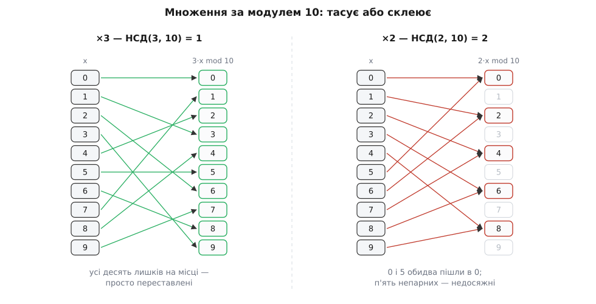
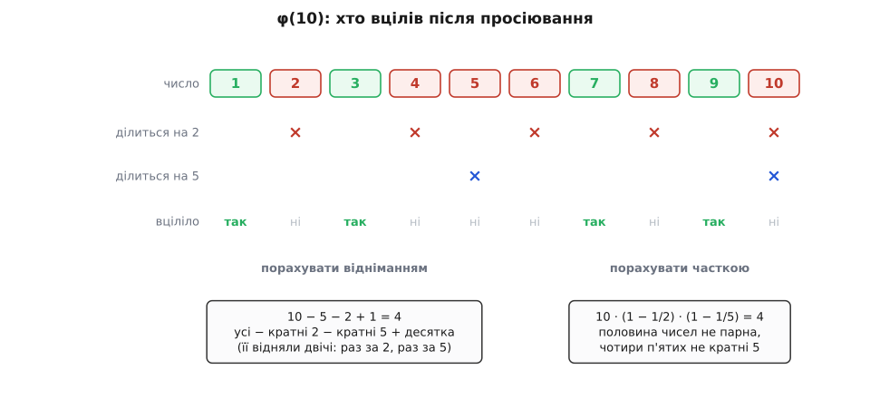
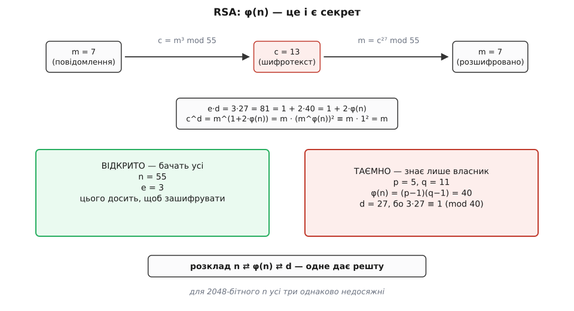

# Функція Ейлера і теорема Ейлера

<preknowlist>
- [Модульна арифметика](topic:math-number-theory/modular-arithmetic) — запис a ≡ b (mod m), класи лишків і те, що за модулем можна вільно додавати й множити.
- [НСД і алгоритм Евкліда](topic:math-number-theory/gcd-euclidean) — найбільший спільний дільник двох чисел і що означає «взаємно прості» (НСД = 1).
- [Прості числа](topic:math-number-theory/prime-numbers) — прості числа й розклад на прості множники, у кожного числа єдиний.
</preknowlist>

Яка остання цифра числа 7²²²?

Множити 222 сімки не збирається ніхто — та цього й не треба. Остання цифра — це залишок від ділення на 10, а залишки степенів сімки поводяться напрочуд слухняно:

```
7¹ = 7      ≡ 7   (mod 10)
7² = 49     ≡ 9   (mod 10)
7³ = 343    ≡ 3   (mod 10)
7⁴ = 2401   ≡ 1   (mod 10)   ← повернулися до одиниці
7⁵ = 16807  ≡ 7   (mod 10)   ← і все пішло спочатку
```

Щойно послідовність дійшла до одиниці, вона замикається в кільце: наступний крок множить одиницю на сімку, тобто починає ту саму пісню з початку. Уся нескінченна вервечка степенів насправді має лише чотири різні значення, розставлені по колу. А 222 = 4·55 + 2 — після 55 повних обертів лишається два кроки, тож 7²²² ≡ 7² ≡ 9. Остання цифра — дев'ятка.

Але тут напрошуються два питання, і обидва серйозні. Чому послідовність узагалі **повертається до одиниці**, а не блукає без ладу й не застрягає десь по дорозі? І чи можна дізнатися довжину кільця — оту четвірку — не виписуючи степенів? Відповідь на обидва дає одне-єдине число, що залежить тільки від модуля. Це функція Ейлера — і через двісті років після народження саме вона стала замком, на якому тримається шифрування з відкритим ключем.

## Множення за модулем: тасує або склеює

Почнімо не зі степенів, а з простішого — з одного множення. Візьмімо всі лишки за модулем 10, тобто числа від 0 до 9, і помножмо кожен на 3, щоразу лишаючи саму остачу:

```
x          : 0  1  2  3  4  5  6  7  8  9
3·x mod 10 : 0  3  6  9  2  5  8  1  4  7
```

Унизу — ті самі десять чисел, лише переставлені: жодне не зникло, жодне не повторилося. Тепер той самий дослід, але множимо на 2:

```
x          : 0  1  2  3  4  5  6  7  8  9
2·x mod 10 : 0  2  4  6  8  0  2  4  6  8
```

Картина зовсім інша. Різних значень лише п'ять, кожне трапляється двічі, а до непарних лишків не дістатися взагалі — множення на 2 їх не породжує ніколи.

Різниця між трійкою й двійкою тут не у величині, а у спільних множниках з модулем, і механізм виводиться одним рядком. Два входи склеїлися, якщо a·x ≡ a·y (mod m), тобто якщо m ділить a·(x − y). Коли НСД(a, m) = 1, у модуля немає з a жодного спільного множника — тож увесь m мусить поміститися всередині різниці (x − y). Отже m ділить x − y, а це просто означає x ≡ y: «склеїлися» не два різні лишки, а один і той самий сам із собою. Різні входи неминуче дають різні виходи, і множення на a лише **тасує** лишки, не втрачаючи жодного.

Коли ж НСД(a, m) = d > 1, склейка знаходиться миттєво. Візьмімо різницю x − y = m/d: вона менша за m, тобто x і y — таки різні лишки. Але a·(m/d) = (a/d)·m уже кратне m, отже a·x ≡ a·y. Для m = 10 і a = 2 маємо d = 2 та крок m/d = 5 — і справді, 0 та 5 обидва пішли в нуль, 1 та 6 обидва пішли у двійку. Множення склеїло лишки парами й тим стиснуло десять значень у п'ять, а половину кола лишило порожньою.


*Ліворуч НСД(3, 10) = 1 — кожна стрілка приходить у свою клітинку, жодна не збігається з іншою: множення перетасувало лишки. Праворуч НСД(2, 10) = 2 — стрілки сходяться попарно, п'ять непарних клітинок не отримали нічого. Уся різниця між двома картинами — в одному спільному дільнику.*

> 🔧 **Навіщо це.** Правило «множник у хеш-функції має бути непарним» — не забобон, а рівно цей висновок. Таблиця розміром 2ᵏ рахує індекси за модулем 2ᵏ; якщо множник теж парний, він має з модулем спільний дільник, і множення склеює — половина комірок (а за множника, кратного четвірці, то й три чверті) стає недосяжною ще до того, як у таблицю щось поклали. Непарний множник взаємно простий з 2ᵏ, і саме тому перебирає всі комірки без утрат.

## Скільки лишків виживає

Виходить, взаємна простота з модулем — не технічна умова з підручника, а межа між двома різними світами. Тоді природно спитати: а скільки взагалі чисел має цю властивість?

**Функція Ейлера** φ(n) — це кількість чисел серед 1, 2, …, n, взаємно простих з n: тих, що не мають з n жодного спільного дільника, крім одиниці.

```
φ(10) = 4     вціліли 1, 3, 7, 9    (2, 4, 6, 8 діляться на 2; 5 і 10 — на 5)
φ(12) = 4     вціліли 1, 5, 7, 11
φ(7)  = 6     вціліли всі 1…6 — сімка проста, ділити її нічим
φ(1)  = 1     єдиний претендент — сама одиниця, і НСД(1, 1) = 1
```

Ці вцілілі — не просто набір, а замкнений світ: добуток двох взаємно простих з n сам взаємно простий з n. Причина проста — жоден простий множник числа n не ділить ані a, ані b, а отже не ділить і a·b. Тому, множачи вцілілих між собою, з цього кола ніколи не вийти. Набір із φ(n) таких чисел називають зведеною системою лишків.

Саму функцію ввів 1763 року Леонард Ейлер — швейцарець із Базеля, що прожив життя між Петербурзькою та Берлінською академіями, — у праці «Theoremata arithmetica nova methodo demonstrata». Позначки для неї він тоді не мав і описав словами: «кількість частин, взаємно простих із N». Літеру π для цього він добрав аж 1784 року, пишучи πD. Звичне нам φ — це вже Гаусс, «Disquisitiones Arithmeticae» (1801, стаття 38). А слово «тотієнт» (від латин. *totiens* — «стільки разів», за зразком слова «квотієнт») вигадав Джеймс Джозеф Сильвестр 1879 року — через сто шістнадцять років після появи самої функції.


*Щоб не вціліти, досить ділитися бодай на один простий дільник десятки. Кратних 2 — п'ять штук, кратних 5 — двоє, і десятка попала під обидва ножі, тож її відняли двічі й доводиться повернути назад: 10 − 5 − 2 + 1 = 4. Той самий підрахунок, записаний часткою вцілілих, і дає формулу добутку.*

## Як порахувати φ(n), не перебираючи

Перебір годиться для десятки. Для числа з шестисот цифр — а саме на таких працює справжня криптографія — перебирати нічого. Потрібна структура, і вона є: φ читається просто з розкладу n на прості множники.

**Просте число.** φ(p) = p − 1. У простого немає дільників, окрім 1 і себе самого, тож жодне з чисел 1…p−1 не має з ним спільного множника. Вціліли всі, крім самого p.

**Степінь простого.** Тут теж усе прозоро: єдина причина не вціліти — ділитися на p. Серед чисел 1…pᵏ кратних p рівно pᵏ⁻¹ штук (це p, 2p, 3p, …, pᵏ⁻¹·p), а решта вціліли:

```
φ(pᵏ) = pᵏ − pᵏ⁻¹ = pᵏ·(1 − 1/p)

φ(8) = 8 − 4 = 4     → 1, 3, 5, 7
φ(9) = 9 − 3 = 6     → 1, 2, 4, 5, 7, 8
```

**Склеювання взаємно простих шматків.** Найцікавіше: якщо НСД(m, n) = 1, то φ(m·n) = φ(m)·φ(n). Причина не в арифметиці, а в тому, що за взаємно простих модулів число розпадається на пару своїх остач. [Китайська теорема про залишки](topic:math-number-theory/chinese-remainder-theorem) стверджує: за взаємно простих m і n кожному лишку x за модулем m·n відповідає рівно одна пара (x mod m, x mod n), і навпаки — кожній парі відповідає рівно один x; більших чи менших наборів не буває, відповідність точна. Додаймо до цього просте спостереження: x взаємно просте з m·n тоді й лише тоді, коли воно взаємно просте і з m, і з n окремо. Отже вцілілі за модулем m·n стоять у точній відповідності з парами «вцілілий за модулем m + вцілілий за модулем n» — а таких пар рівно φ(m)·φ(n).

```
φ(15) = φ(3)·φ(5) = 2 · 4 = 8     → 1, 2, 4, 7, 8, 11, 13, 14 — рівно вісім
```

Умова взаємної простоти тут не прикраса: φ(8) = 4, тоді як φ(4)·φ(2) = 2·1 = 2. Четвірка й двійка мають спільний множник, на незалежні пари остач число не розпадається — і рівність ламається.

**Формула добутку.** Тепер обидва шматки складаються. Розкладімо n на прості: n = p₁^k₁ · p₂^k₂ · … · p_r^k_r. Степені різних простих взаємно прості між собою, тож φ множиться по них, а для кожного працює φ(pᵏ) = pᵏ·(1 − 1/p). Перемножмо все — і самі pᵏ зберуться назад у n:

```
φ(n) = n · (1 − 1/p₁) · (1 − 1/p₂) · … · (1 − 1/p_r)
```

де добуток іде по **різних** простих дільниках n. Показники не важать зовсім — важить лише те, які прості взагалі беруть участь.

**Порахувати φ(360).**

```
360 = 2³ · 3² · 5            розклад на прості
різні прості: 2, 3, 5        показники (3, 2, 1) далі не потрібні

φ(360) = 360 · (1 − 1/2) · (1 − 1/3) · (1 − 1/5)
       = 360 ·    1/2    ·    2/3    ·    4/5
       = 180 · 2/3 · 4/5
       = 120 · 4/5
       = 96
```

Перевірка іншою дорогою, через степені простих: φ(8)·φ(9)·φ(5) = 4 · 6 · 4 = 96. Збіглося.

Варто спинитися на тому, чого формула **не** дає. Щоб нею скористатися, треба знати прості дільники n — не саме n, а його розклад. Для 360 розклад видно з першого погляду; для числа завдовжки в шістсот цифр його не знає ніхто, і формула, хоч і бездоганно правильна, стає непридатною. Це не дрібна незручність: саме на ній тримається вся криптографія з відкритим ключем.

## Теорема Ейлера

Тепер усе готове, щоб відповісти на питання про кільце степенів.

**Теорема Ейлера.** Якщо НСД(a, n) = 1, то a^φ(n) ≡ 1 (mod n).

Доведення тримається на одному спостереженні, яке вже здобуте: множення на взаємно просте a тасує лишки. Тільки тасувати треба не всі підряд, а самих вцілілих.

Візьмімо всіх φ(n) вцілілих за модулем n і назвімо їх r₁, r₂, …, r_φ. За модулем 10 це 1, 3, 7, 9. Помножмо кожного на a = 3:

```
3·1 = 3    ≡ 3   (mod 10)
3·3 = 9    ≡ 9   (mod 10)
3·7 = 21   ≡ 1   (mod 10)
3·9 = 27   ≡ 7   (mod 10)
```

Праворуч — {3, 9, 1, 7}. Той самий набір {1, 3, 7, 9}, лише в іншому порядку.

Це не збіг, і причин рівно дві, обидві вже на руках. По-перше, кожен добуток a·rᵢ сам взаємно простий з n — бо і a, і rᵢ взаємно прості з n, а їхній добуток не набуває нових спільних множників із n. Отже результат нікуди не тікає: він знову серед вцілілих. По-друге, два різні вцілілі не можуть дати однакового результату — множення на взаємно просте a не склеює. А коли φ(n) різних значень поміщаються всередину набору рівно з φ(n) елементів, вони заповнюють його повністю: іншого виходу немає, це перестановка.

Далі — один хід. Перемножмо всі рівності зліва й справа:

```
(a·r₁)·(a·r₂)·…·(a·r_φ)  ≡  r₁·r₂·…·r_φ   (mod n)     ліворуч і праворуч — той самий набір
a^φ(n) · (r₁·r₂·…·r_φ)   ≡  r₁·r₂·…·r_φ   (mod n)     зібрали всі a в один степінь
```

Ліворуч a виноситься рівно φ(n) разів — звідси й показник. А тепер добуток P = r₁·r₂·…·r_φ викреслюється з обох боків: P — добуток вцілілих, отже сам вцілілий, отже взаємно простий з n, отже множення на нього не склеює. А коли множення не склеює, з a^φ(n)·P ≡ 1·P неминуче випливає a^φ(n) ≡ 1.

Ось і вся теорема. Кільце степенів замикається не тому, що числам так забажалося, а тому, що вціліти можна лише скінченною кількістю способів, і множення на взаємно просте лише переставляє вцілілих між собою.


*Чотири вцілілі за модулем 10 після множення на 3 знову дають чотири вцілілі — інакше й бути не може, бо втекти нікуди, а склеїтися не можна. Набір той самий, тож добуток усіх його елементів той самий; ліворуч цей добуток стоїть помножений на 3⁴. Скорочення спільного множника й лишає теорему Ейлера.*

Перевірмо на модулі 10, де φ(10) = 4:

```
3¹ = 3
3² = 9
3³ = 27  ≡ 7   (mod 10)
3⁴ = 81  ≡ 1   (mod 10)     ← a^φ(10) = 1, як і обіцяно
```

І початкове питання: НСД(7, 10) = 1, отже 7⁴ ≡ 1, а тоді

```
7²²² = 7^(4·55 + 2) = (7⁴)⁵⁵ · 7² ≡ 1⁵⁵ · 49 ≡ 9   (mod 10)
```

Двісті двадцять два множення звелися до одного ділення з остачею. Викладене вище — це ідея доведення, подана на конкретних числах; строгий запис із доведеним законом скорочення, виведення формули добутку через включення-виключення і погляд згори (вцілілі лишки утворюють групу порядку φ(n), а теорема Ейлера виявляється окремим випадком теореми Лагранжа) зібрані в [повному виведенні](topic:math-number-theory/euler-totient/math-euler-proof.md).

## Мала теорема Ферма — той самий факт для простого модуля

Візьмімо n = p, просте. Тоді φ(p) = p − 1, а умова «НСД(a, p) = 1» означає просто «a не ділиться на p» — інших спільних дільників у простого немає. Теорема Ейлера обертається на

```
a^(p−1) ≡ 1 (mod p)     для будь-якого a, що не ділиться на p
```

Це [мала теорема Ферма](topic:math-number-theory/fermat-little-theorem), і історично вона була першою. П'єр де Ферма написав її в листі до Бернара Френікля де Бессі 18 жовтня 1640 року — без доведення, з приміткою, що надіслав би й доведення, якби не боявся, що воно завелике. Перше опубліковане доведення дав Ейлер 1736 року; Ляйбніц мав своє ще до 1683-го, але лишив у неопублікованих рукописах. А 1763-го Ейлер зняв із твердження умову простоти — і правильним узагальненням виявилася заміна p − 1 на φ(n). Що й не дивно, адже p − 1 **і є** φ(p). Усе це — усталені факти, підперті листуванням і публікаціями; чому Ферма взагалі цікавили остачі степенів і як Ейлер ішов від окремого випадку до загального, розказано в [історії поняття](topic:math-number-theory/euler-totient/hist-euler-fermat.md).

## Показник живе за іншим модулем

Перший практичний наслідок уже застосований до сімки, але варто виписати його окремо. Якщо НСД(a, n) = 1, показник можна зводити за модулем φ(n):

```
a^k ≡ a^(k mod φ(n))   (mod n)
```

Виводиться це прямо: поділімо k на φ(n) з остачею, k = q·φ(n) + r, тоді

```
a^k = a^(q·φ(n) + r) = (a^φ(n))^q · a^r ≡ 1^q · a^r = a^r   (mod n)
```

Зверніть увагу на дивину: **основа живе за модулем n, а показник — за модулем φ(n)**. Два різні модулі в одній формулі — і плутанина між ними коштує неправильної відповіді без жодного натяку на помилку.

```py
from math import gcd

def totient(n: int) -> int:
    """φ(n) за формулою добутку: n·∏(1 − 1/p) по РІЗНИХ простих дільниках n."""
    result, m, p = n, n, 2
    while p * p <= m:
        if m % p == 0:
            while m % p == 0:          # викидаємо всі копії p — показник не важить
                m //= p
            result -= result // p      # множимо на (1 − 1/p), не виходячи з цілих
        p += 1
    if m > 1:                          # лишився один великий простий дільник
        result -= result // m
    return result

assert totient(10) == 4
assert totient(360) == 96
assert totient(55) == 40

a, k, n = 7, 222, 10
assert gcd(a, n) == 1                  # без цього все нижче не має сили
print(pow(a, k % totient(n), n))       # 9 — звели показник: 222 mod 4 = 2
print(pow(a, k, n))                    # 9 — та сама відповідь довгою дорогою
```

## Обернений за модулем — однією формулою

Другий наслідок виходить із теореми одним кроком. Розпишімо a^φ(n) як a · a^(φ(n)−1):

```
a · a^(φ(n)−1) = a^φ(n) ≡ 1   (mod n)
```

Отже a^(φ(n)−1) — це [обернений до a за модулем n](topic:math-number-theory/modular-inverse): число, множення на яке повертає одиницю. За модулем 10 для a = 3 маємо 3³ = 27 ≡ 7 — і справді, 3·7 = 21 ≡ 1 (mod 10).

Ба більше, звідси видно й межу. Обернений існує **точно тоді**, коли НСД(a, n) = 1. Якщо d = НСД(a, n) > 1, то d ділить добуток a·x за будь-якого x і ділить n, отже ділить і остачу (a·x) mod n. Щоб ця остача дорівнювала одиниці, d мусив би ділити одиницю — а він більший за неї. Жодне множення на a одиниці не дасть. На практиці обернений шукають розширеним алгоритмом Евкліда — він швидший і, головне, не потребує знати розклад n; але саме формула Ейлера показує, чому обернений є завжди за взаємної простоти й не існує ніколи без неї.

## RSA: коли φ(n) стає замком

Тепер найцікавіше. Усе, що потрібне для шифрування з відкритим ключем, уже лежить на столі.

Візьмімо два прості p і q та їхній добуток n = p·q. Саме n оголошуємо всьому світові. А φ(n) рахується миттєво — але **тільки якщо знаєш p і q**:

```
φ(n) = φ(p)·φ(q) = (p − 1)·(q − 1)
```

Виберімо тепер показник e, взаємно простий з φ(n). Тоді в e є обернений за модулем φ(n) — назвімо його d, тобто e·d ≡ 1 (mod φ(n)). Розписавши цю конгруенцію, дістаємо e·d = 1 + k·φ(n) для якогось цілого k.

Шифруємо повідомлення m (число, менше за n) як c = m^e mod n. Розшифровуємо піднесенням до d:

```
c^d = (m^e)^d = m^(e·d) = m^(1 + k·φ(n)) = m · (m^φ(n))^k ≡ m · 1^k = m   (mod n)
```

Розшифрування — це теорема Ейлера, прочитана вголос. m^φ(n) ≡ 1 стирає весь доважок до показника, і від m^(1+k·φ(n)) лишається сама m.

**Іграшковий RSA на малих числах.**

```
p = 5,  q = 11
n = p·q = 55                  відкритий модуль
φ(n) = 4 · 10 = 40            (p−1)(q−1) — знає лише той, хто знає p і q
e = 3                         НСД(3, 40) = 1 → годиться; (n, e) — відкритий ключ
d = 27                        бо 3·27 = 81 = 2·40 + 1 ≡ 1 (mod 40) → таємний ключ

шифруємо m = 7:   c = 7³ = 343 = 6·55 + 13   →   c = 13
розшифровуємо:    13²⁷ mod 55
   13²  = 169  ≡ 4           169 − 3·55 = 4
   13⁴  ≡ 4²   = 16
   13⁸  ≡ 16²  = 256 ≡ 36    256 − 4·55 = 36
   13¹⁶ ≡ 36²  = 1296 ≡ 31   1296 − 23·55 = 31
   27 = 16 + 8 + 2 + 1
   13²⁷ ≡ 31 · 36 · 4 · 13
        ≡ 16 · 4 · 13        31·36 = 1116 = 20·55 + 16
        ≡ 9 · 13             16·4 = 64 = 55 + 9
        ≡ 7                  9·13 = 117 = 2·55 + 7
```

Сімка повернулася.

Тепер головне питання: **де тут секрет?** Зловмисник бачить n = 55 і e = 3. Щоб дістати d, йому потрібне φ(n); щоб дістати φ(n), потрібні p і q. Здавалося б, φ(n) — це якийсь окремий, додатковий секрет. Аж ні: знати φ(n) — **рівно те саме**, що знати розклад.

```
φ(n) = (p−1)(q−1) = p·q − p − q + 1 = n + 1 − (p + q)

тож  p + q = n + 1 − φ(n) = 55 + 1 − 40 = 16
     p · q = n = 55

p і q — корені x² − 16x + 55 = 0
x = (16 ± √(256 − 220)) / 2 = (16 ± 6) / 2 = 11  або  5
```

Два рядки шкільної алгебри — і прості знайдено. Отже φ(n) не «ще один» секрет поряд із розкладом: це той самий розклад, перевдягнений в інше вбрання. Уся стійкість RSA зводиться до одного факту: n оприлюднене, але його прості множники — а тому й φ(n), а тому й d — недосяжні, коли n має тисячу-другу бітів.


*Шифрування й розшифрування — те саме піднесення до степеня за модулем n, різняться лише показники. Уся асиметрія тримається на тому, що праворуч: розклад n, φ(n) і d рівносильні між собою — маючи будь-яке з них, решту дістають за кілька дій. Тому в RSA немає «трьох секретів», є один, поданий у трьох виглядах.*

Історія тут теж не однолінійна. Систему описали 1977 року й опублікували в лютому 1978-го в Communications of the ACM троє дослідників із MIT — Рональд Рівест, Аді Шамір і Леонард Адлеман (звідки й RSA). Але рівносильну схему знайшов раніше, ще 1973 року, англійський математик Кліффорд Кокс у британському GCHQ; його роботу засекретили й розсекретили аж 1997-го — через двадцять років після публікації трьох американців. Обидва факти усталені й документовані. Робочий код — обчислення φ, швидке піднесення до степеня за модулем, повний цикл шифрування — зібрано в [іграшковій реалізації](topic:math-number-theory/euler-totient/proj-rsa-toy.md), а сама система з усіма її вимогами описана окремо: [RSA](topic:sf-security/rsa).

## Де це ламається

Теорема Ейлера обіцяє менше, ніж часто здається, і різниця має ціну.

**φ(n) — не обов'язково найменший показник.** Теорема каже: a^φ(n) ≡ 1. Вона **не** каже, що φ(n) — перший момент, коли це стається. За модулем 10 із трійкою збіглося — кільце має рівно чотири кроки, і φ(10) = 4. А за модулем 12 φ(12) = 4, проте 5² = 25 ≡ 1, 7² = 49 ≡ 1, 11² = 121 ≡ 1: усе повертається до одиниці вже на другому кроці. Справжня довжина кільця — [мультиплікативний порядок](topic:math-number-theory/multiplicative-order) числа — тут дорівнює 2. Порядок завжди **ділить** φ(n), тож φ(n) — гарантована кратність періоду, а не сам період. Для зведення показників цього досить (кратність періоду працює нітрохи не гірше), але коли потрібен саме період, φ(n) дає лише верхню межу.

**Без взаємної простоти немає нічого.** Візьмімо n = 4 і a = 2. φ(4) = 2, отже 2² = 4 ≡ 0 (mod 4) — не одиниця. І ніколи не буде: якщо d = НСД(a, n) > 1, то d ділить aᵏ і ділить n, а отже ділить і остачу aᵏ mod n. Одиниця ж ділиться лише на одиницю — тож за d > 1 степінь не дійде до неї ніколи, скільки не множ.

**Зведення показника теж хоче взаємної простоти.** Правило a^k ≡ a^(k mod φ(n)) — наслідок теореми, тож успадковує її умову. Порушивши умову, дістанемо просто хибну відповідь: для n = 4, a = 2, k = 4 правило радить 4 mod φ(4) = 4 mod 2 = 0, тобто 2⁰ = 1. Насправді ж 2⁴ = 16 ≡ 0 (mod 4). Нуль і одиниця — не те саме, а помилка тиха.

**А RSA все одно працює.** Прискіпливе око помітить діру у виведенні: повідомлення m — довільне число, менше за n, і ніхто не обіцяв, що НСД(m, n) = 1. Якщо m кратне p чи q, теорема Ейлера до нього не застосовна — а розшифрування все одно повертає правильну m. Тонкість справжня, і латається вона не теоремою Ейлера, а розглядом за модулями p і q нарізно, через китайську теорему про залишки; цей випадок розібрано в тому самому [повному виведенні](topic:math-number-theory/euler-totient/math-euler-proof.md).

## Одне число з двома обличчями

Ейлер шукав відповідь на питання про остачі степенів — питання, чистіше за яке важко вигадати: жодного застосування, жодного замовника, самий лише інтерес до того, як поводяться числа. Через двісті з гаком років виявилося, що φ(n) має два обличчя водночас. З одного боку це довжина кільця, у яке замикаються степені, — і саме вона зводить двісті двадцять два множення до одного ділення з остачею. З другого — це рівно та сама інформація, що й розклад n на прості, тобто річ, якої з великого n не добути за розумний час. Одне число каже, як швидко все повертається на місце, і воно ж мовчить про те, чого не дізнатися, доки не розкладеш число на множники. Криптографія з відкритим ключем живе саме в цьому зазорі.
