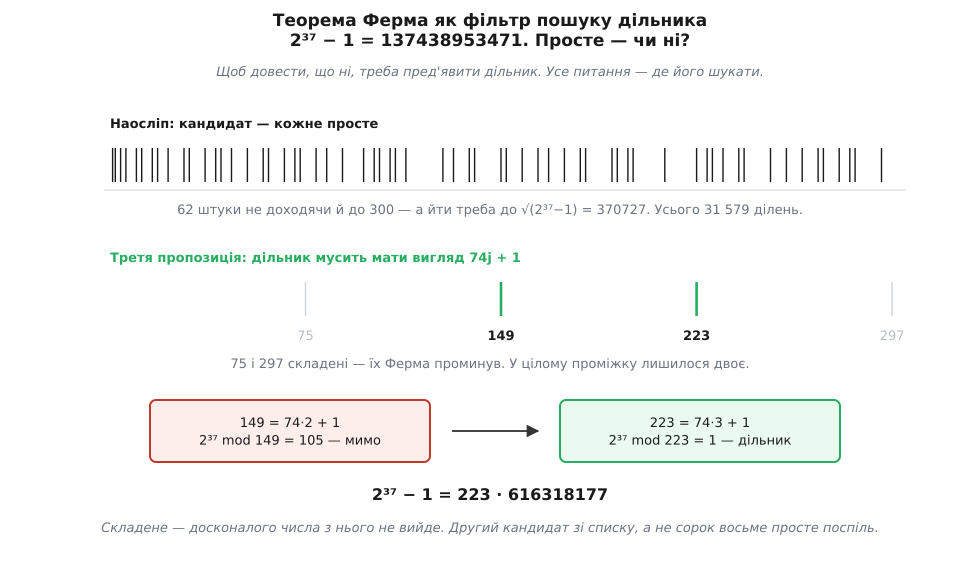
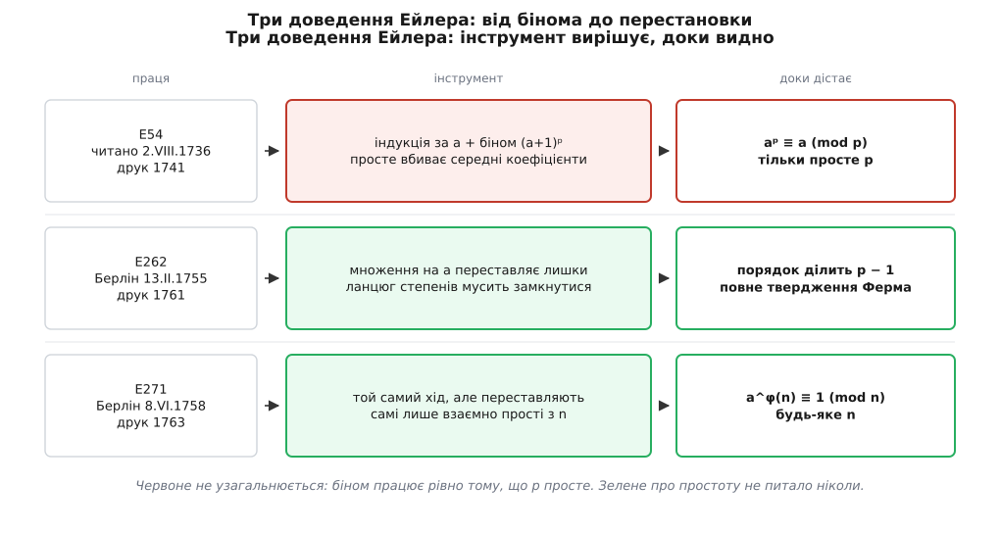

# 📜 Досконалі числа, з яких виросла φ

Функція, що лічить взаємно прості лишки, має вигляд знаряддя, зробленого під питання про степені. Насправді до цього питання не йшов ніхто. Ані Ферма, ані Ейлер не сідали вивчати, як поводяться остачі степенів; обидва прийшли по інше. Кожному трапилося одне вперте число, яке конче треба було розкласти на множники, і кожен уперся в те саме: навмання дільника не знайти, треба знати, **де** він стоїть. Уся теорія народилася як побічний здобуток полювання на дільники. А полювання почалося з парі.

## Питання, що не мало стосунку до степенів

Число 6 дорівнює сумі своїх власних дільників: 1 + 2 + 3. Число 28 — теж: 1 + 2 + 4 + 7 + 14. Греки назвали такі числа досконалими й знайшли їх усього чотири — 6, 28, 496, 8128. Далі почалася тиша, що протривала півтори тисячі років.

Тиша мала причину, і Евклід її бачив. У «Началах» (книга IX, твердження 36) стоїть: якщо 2ᵖ − 1 просте, то 2^(p−1)·(2ᵖ − 1) досконале.

```
p = 2:  2¹·(2² − 1) = 2·3    = 6
p = 3:  2²·(2³ − 1) = 4·7    = 28
p = 5:  2⁴·(2⁵ − 1) = 16·31  = 496
p = 7:  2⁶·(2⁷ − 1) = 64·127 = 8128
```

Чотири грецькі числа — це чотири перші прості вигляду 2ᵖ − 1, і більше нічого. Отже полювання на досконалі числа не є окремим заняттям: воно дослівно **є** полюванням на прості серед [чисел Мерсенна](root:math-number-theory/mersenne-primes) 2ᵖ − 1. Тиша пояснюється сама: наступне таке просте — 2¹³ − 1 = 8191, а щоб його впізнати, треба вміти доводити простоту п'ятизначного числа. Греки не вміли.

І тут стелиться місток, якого ніхто не будував навмисне. Питання «чи ділить q число 2ᵖ − 1» — це те саме питання, що «чи дає 2ᵖ остачу 1 за [модулем](root:math-number-theory/modular-arithmetic) q». [Досконалі числа](root:math-number-theory/perfect-numbers) вивели просто в остачі степенів, і жодної іншої дороги туди не було.

> 🔧 **Навіщо це.** Рівність двох поглядів — «дільник числа aᵏ − 1» і «модуль, за яким a повертається до одиниці» — не риторика 1640 року, а робочий важіль донині. На ній стоїть метод факторизації Полларда p − 1: беремо велике K, складене з самих дрібних множників, і рахуємо НСД(2^K − 1, n). Якщо в якогось простого дільника p числа n значення p − 1 розкладається на дрібні множники, то K уже кратне довжині кільця двійки за модулем p — отже 2^K повернулося до одиниці, отже p ділить 2^K − 1 і попадає в НСД. Той самий місток, той самий бік — і саме тому прості для RSA добирають так, щоб p − 1 мало великий простий множник.

## Виклик Френікля: двадцять цифр

Дійові особи тут троє, і жоден не професор.

**Марен Мерсенн** (*Marin Mersenne*, 1588–1648) — паризький монах-мінім, чия келія працювала замість наукової періодики: журналів ще не було, тож він листувався з усією Європою й переказував почуте далі. **Бернар Френікль де Бессі** (*Bernard Frénicle de Bessy*, бл. 1604–1674) — радник Монетного двору в Парижі, з кінця 1630-х завсідник кола Мерсенна, обчислювач такої сили, що Ферма ставив його поряд із Декартом. **П'єр де Ферма** (*Pierre de Fermat*, 1607–1665) — радник парламенту Тулузи; математика була його приватною справою, і майже нічого з неї він не надрукував.

Звичай кола був такий: методу не показувати, а кидати виклик. У березні 1640 року Френікль зажадав від Ферма досконале число щонайменше з двадцяти цифр.

Двадцять — не кругле число, а пастка, і поставлена свідомо. Щоб побачити пастку, треба знати, який тоді був стан справ, а він тримався на одному списку. Італієць **П'єтро Катальді** (*Pietro Cataldi*, 1548–1626) 1603 року виписав показники, за яких 2ᵖ − 1 нібито просте: 17, 19, 23, 29, 31, 37. Довів він лише два перші. Решта чотири були заявою.

Найбільше досконале число, на яке тоді вказували, дає p = 31 — тобто третій із чотирьох недоведених рядків Катальдієвого списку:

```
2³⁰ · (2³¹ − 1) = 2305843008139952128     ← дев'ятнадцять цифр
```

Дев'ятнадцять. Умова «щонайменше двадцять» відтинає його рівно на одну цифру й жене Ферма далі — на наступний рядок списку, до 2³⁷ − 1. Френікль, по суті, зажадав пред'явити те, що обіцяв Катальді.

А чого не знав і не міг знати ніхто з них — так це що досконалого числа з двадцятьма цифрами не існує взагалі. Прості показники від 37 до 59 усі до одного дають складені 2ᵖ − 1; наступне досконале число народжується аж із p = 61 і має тридцять сім цифр. (Простоту 2⁶¹ − 1 довів лише 1883 року Іван Первушин.) Тобто Френікль зажадав числа, якого немає, а найближче до нього стоїть далеко за межею будь-якої ручної лічби.

## Три твердження червня 1640-го

Ферма відповів не досконалим числом, а знаряддям. У червні 1640-го він пише Мерсеннові: ось три дуже гарні твердження, — і додає, що з цих скорочень уже бачить, як народиться безліч інших, і що це видається йому великим світлом.

```
1.  n складене                         →  2ⁿ − 1 складене
2.  p непарне просте                   →  p ділить 2^(p−1) − 1
3.  q непарне просте,
    p — простий дільник 2^q − 1        →  p = 2jq + 1
```

Перше твердження пояснює, чому показник у 2ᵖ − 1 узагалі беруть простий: у складеного показника число розпадається алгебраїчно, без жодної теорії чисел. Друге — це вже [мала теорема Ферма](root:math-number-theory/fermat-little-theorem) для основи 2; у червні 1640-го вона в нього на руках. А третє — те, заради чого все й затівалося: воно каже, де лежать дільники.

## 223

Третє твердження — не прикраса, а фільтр. Ось що воно робить із 2³⁷ − 1.

```
2³⁷ − 1 = 137438953471
√(2³⁷ − 1) ≈ 370727              далі дільника шукати немає сенсу
простих до 370727:  31 579       стільки ділень наосліп

третє твердження:  q = 37  →  дільник має вигляд 2j·37 + 1 = 74j + 1
таких простих до 370727:  886    у тридцять шість разів менше

j = 1:   75 = 3·5²               не просте — проминаємо
j = 2:  149                      2³⁷ mod 149 = 105    мимо
j = 3:  223                      2³⁷ mod 223 = 1      дільник

137438953471 = 223 · 616318177
```


*Обидві смуги показують той самий проміжок від 1 до 300. Угорі кандидат — кожне просте, і їх там шістдесят два; унизу лишається арифметична прогресія 74j + 1, з якої 75 і 297 складені й відпадають самі. Ферма мав перевірити двох — і другий виявився дільником.*

Ферма знайшов дільник на другому кандидаті зі списку. Заразом він знайшов і відповідь Френіклю, і помилку Катальді: 2³⁷ − 1 не просте, обіцяного досконалого числа з нього не вийде. Того ж 1640 року Ферма вибив зі списку й показник 23. Далі списком зайнявся Ейлер: 1738-го поклав 29, а 1772-го довів, що про 31 Катальді таки не збрехав. З чотирьох заявлених рядків уцілів один.

Без третього твердження те саме 223 — сорок восьме просте поспіль: сорок вісім ділень замість двох. Але справжня ціна фільтра видніша не тут. Щоб оголосити 2ᵖ − 1 **простим**, мало не знайти дільника серед перших кількох — треба вичерпати всіх кандидатів до кореня. Ось де 886 замість 31 579 вирішує, чи можлива така робота руками взагалі.

Тепер видно, чому Ферма цікавили остачі степенів. Він не будував теорії чисел і не шукав краси. Йому треба було відповісти Френіклю; щоб відповісти — знайти дільник; щоб знайти дільник — знати, за яким модулем двійка повертається до одиниці. Питання про остачі степенів **і є** питання про дільники, лише сказане з іншого боку.

## Лист 18 жовтня 1640 року

За чотири місяці Ферма робить крок, який обертає фільтр на теорему: викидає двійку.

> Tout nombre premier mesure infailliblement une des puissances − 1 de quelque progression que ce soit, et l'exposant de la dite puissance est sous-multiple du nombre premier donné − 1.
>
> Усяке просте число неодмінно міряє один зі степенів − 1 хоч би якої прогресії, і показник того степеня є піддільником даного простого числа − 1.

«Міряє» тут — Евклідове слово: ділить без остачі, вкладається ціле число разів. «Прогресія» — послідовність степенів 1, a, a², a³, … Отже: для всякого простого p і всякої основи a знайдеться степінь, від якої досить відняти одиницю, щоб p поділило результат; а показник найпершого такого степеня ділить p − 1.

І ось що варте уваги. Ферма заявив **більше**, ніж те, що звуть його малою теоремою. Мала теорема каже a^(p−1) ≡ 1. Ферма ж говорить про найменший показник k, за якого це стається вперше, і стверджує, що цей k ділить p − 1; а ще в тому самому листі — що p ділить aⁿ − 1 рівно тоді, коли k ділить n. Це опис усієї будови, а не одна рівність. Мала теорема Ферма — наслідок того, що Ферма насправді написав, і назва ховає різницю.

Далі йде найвідоміше речення листа:

> …de quoi je vous envoierois la démonstration, si je n'appréhendois d'être trop long.
>
> …я надіслав би вам доведення, якби не боявся бути надто довгим.

Чи мав він доведення — невідомо, і чесно буде сказати саме так: жодного рядка не збереглося, перевірити нема на чому. Реконструкція Девіда Пенджеллі (2025) веде до іншого: всі три червневі твердження зчитуються просто з таблиці розкладів 2ⁿ − 1 — у ній видно, що кожен простий дільник з'являється в арифметичній прогресії показників, що вперше він з'являється не пізніше показника p − 1 і що перший показник ділить p − 1. Це дорога **відкриття**, а не доведення, і статус у неї відповідний: обґрунтована гіпотеза історика, не документ.

## Дві шухляди

Ферма не друкував майже нічого — ні цього, ні решти. Коло Мерсенна було йому і журналом, і рецензентом, і суперником; надіслати виклик означало опублікувати. Наслідок відомий: майже все, що ми знаємо про його арифметику, ми знаємо з листів до інших людей.

Друга шухляда глибша. **Ґотфрід Вільгельм Ляйбніц** (*Gottfried Wilhelm Leibniz*, 1646–1716) лишив у паперах доведення — приблизно 1683 року, тобто за півстоліття до Ейлера, і по суті те саме, яке Ейлер згодом знайде наново. Не опублікував. Рукопис розшукав і оприлюднив італієць **Джованні Вакка** (*Giovanni Vacca*) 1894 року в «Bibliotheca Mathematica».

Отже перше доведення й перше **надруковане** доведення розділяє півстоліття. Першість, яку роздають підручники, — факт про друкарню, а не про думку.

## Легенда про давній Китай

Тут-таки живе найживучіша побрехенька всієї цієї історії, і позначити її треба прямо: **це міф**.

Розказують, що стародавні китайці ще за часів Конфуція знали окремий випадок малої теореми й помилково брали його за ознаку простоти: n просте тоді й лише тоді, коли n ділить 2ⁿ − 2. Твердження навіть має назву — «китайська гіпотеза».

Ані китайська, ані стародавня. Джерело знайдене й задокументоване. 1898 року **Джеймс Гопвуд Джинс** (*James Hopwood Jeans*, 1877–1946) — тоді ще студент, згодом відомий астрофізик — друкує в «Messenger of Mathematics» (т. 27, с. 174) замітку «The converse of Fermat's theorem» і пише, що теорема міститься в «папері, знайденому серед паперів покійного сера Томаса Вейда й датованому часами Конфуція». Томас Френсіс Вейд — британський дипломат і синолог (той самий, чиїм ім'ям звуть транскрипцію Вейда — Джайлза), помер 1895 року.

Насправді твердження належить цінському математикові **Лі Шаньланю** (*李善蘭*, 1811–1882), і не давнішому за середину XIX століття. Сам Лі Шаньлань з'ясував, що воно хибне, і друкувати не став; надрукував його 1882 року **Хуа Хенфан** (*華蘅芳*). Міф розібрали: Джозеф Нідем у «Science and Civilisation in China» (1959) показав, що за ним стоїть хибний переклад місця з «Дев'яти розділів про математичне мистецтво», а дорогу до Лі Шаньланя простежив **Хань Ці** (*韓琦*) у праці 1991 року. Докладний розбір усієї плутанини: Han Qi, Siu Man-Keung, «On the myth of an ancient Chinese theorem about primality», *Taiwanese Journal of Mathematics* 12:4 (2008).

А до того ж воно просто неправильне. 341 = 11 · 31 — складене, але 2³⁴⁰ ≡ 1 (mod 341). Знайшов цей приклад француз **П'єр Фредерік Саррюс** (*Pierre Frédéric Sarrus*) 1819 року. Ферма, треба сказати, оберненого твердження ніколи й не заявляв: він казав, що просте **мусить** ділити, а не що ділити **може лише** просте. Міф приписав давнім китайцям помилку, якої не робив навіть той, кому теорему завдячують.

## Ґольдбах приводить Ейлера тією самою дорогою

Тепер про другий бік — і починається він так само випадково.

1 грудня 1729 року **Крістіан Ґольдбах** (*Christian Goldbach*, 1690–1764) пише Ейлерові першого листа й у приписці, майже мимохідь, питає: чи відоме йому спостереження Ферма, що всі числа вигляду 2^(2ⁿ) + 1 прості?

Ейлер спершу відмахнувся. Потім узявся — і 1732 року відповів так, як на такі питання й відповідають: ні, не всі.

```
2^(2⁵) + 1 = 2³² + 1 = 4294967297 = 641 · 6700417
```

А ось **як** він знайшов 641 — тут дорога й упізнається. Тим самим ходом: Ейлер довів, що дільник числа 2^(2ⁿ) + 1 мусить мати вигляд k·2^(n+1) + 1; для n = 5 це 64k + 1, і 641 = 10·64 + 1 знаходиться майже одразу.

Збіг повний, і він не випадковий.

```
Ферма:  2³⁷ − 1   фільтр 74j + 1   →  223
Ейлер:  2³² + 1   фільтр 64k + 1   →  641
```

Обидва увійшли в остачі степенів однією дорогою: кожному трапилося одне вперте число, яке треба було розкласти, і кожен уперся в те, що навмання не вийде — треба знати, де стоять дільники. Теорія остач степенів — це те, що потрібне мисливцеві за дільниками. Нічого романтичнішого в її народженні не було.

## 1736: доведення, приварене до простого

2 серпня 1736 року Ейлер читає Петербурзькій академії працю «Theorematum quorundam ad numeros primos spectantium demonstratio» (E54; надрукована 1741-го у восьмому томі «Commentarii», с. 141–146). Це перше надруковане доведення малої теореми. Дата «1736» — день читання; друк відстав на п'ять років, і така відстань для академічних записок була звичайною.

Доведення йде індукцією за основою a, і вся вага лягає на один крок — розкласти (a + 1)ᵖ за біномом.

```
(a + 1)ᵖ = aᵖ + C(p,1)·a^(p−1) + C(p,2)·a^(p−2) + … + C(p,p−1)·a + 1

C(p,k) = p! / (k!·(p−k)!)        для 0 < k < p
```

Чисельник містить p. Знаменник складений із чисел, менших за p, — а отже й усі його прості множники менші за p. Спільних множників із простим p у нього немає, скоротити p нічим — і воно лишається в кожному середньому коефіцієнті. За модулем p уся середина зникає:

```
(a + 1)ᵖ ≡ aᵖ + 1   (mod p)
```

Далі індукція: 1ᵖ ≡ 1, а якщо aᵖ ≡ a, то (a + 1)ᵖ ≡ aᵖ + 1 ≡ a + 1. І так до будь-якого a.

А тепер найважливіше про це доведення — не те, що воно доводить, а те, чого воно довести не може ніколи. Воно приварене до простого. Візьмімо n = 4:

```
C(4,1) = 4     ділиться на 4    ✓
C(4,2) = 6     на 4 не ділиться ✗
C(4,3) = 4     ділиться на 4    ✓
```

Шістка вціліла, бо в 4! = 24 четвірка розкладається на 2·2, а двійки знизу (2!·2! = 4) її з'їдають. Середина не зникає, зведення (a + 1)⁴ ≡ a⁴ + 1 хибне, індукція розсипається. Це не брак кмітливості: знаряддя працює рівно тому, що p просте, і на складений модуль його не перенести жодним зусиллям. Доки Ейлер тримався бінома, узагальнення було не важким — воно було неможливим.

Ферма в цій праці не названий.

## 1755: Ейлер міняє знаряддя

Через дев'ятнадцять років Ейлер повертається до тієї самої теореми з іншого боку. 13 лютого 1755 року він подає Берлінській академії «Theoremata circa residua ex divisione potestatum relicta» (E262; надрукована 1761-го в сьомому томі «Novi Commentarii», с. 49–82).

Нове доведення бінома не чіпає. Воно дивиться на самі степені: a, a², a³, … за модулем p. Різних лишків скінченно, тож ланцюг мусить колись повторитися; а якщо на a можна скорочувати, то повторитися він може лише замкнувшись у кільце, що починається з одиниці. Довжина того кільця — порядок a — і виявляється дільником p − 1.

Це рівно те, що написав Ферма 1640 року: не сама рівність a^(p−1) ≡ 1, а те, що найменший показник ділить p − 1. Ейлер уперше дістав **повне** твердження Ферма — і в цій же праці вперше називає Ферма на ім'я.

Але важить інше, і видно це просто з ходу міркування. Про що воно взагалі питає в p? Лише про одне: що на a можна скорочувати, тобто що множення на a не склеює лишків. Простота p потрібна тут не сама по собі — вона лише постачає цю властивість задарма, одразу для всіх a від 1 до p − 1. А сама властивість зветься інакше: [взаємна простота](root:math-number-theory/gcd-euclidean) a з модулем. Не простота модуля — взаємна простота з ним.

## 1758: просте ніколи не працювало

Знаряддя вже було в руках. Лишалося помітити, що одна з умов не робить нічого.

8 червня 1758 року Ейлер читає Берлінській академії «Theoremata arithmetica nova methodo demonstrata» (E271; подана до Петербурзької академії 15 жовтня 1759-го, надрукована 1763-го у восьмому томі «Novi Commentarii», с. 74–104).

Хід той самий, що й 1755-го, з однією поправкою. Не переставляти всі лишки — переставляти самих лише взаємно простих із модулем. Для простого p це те саме: взаємно прості з p — усі, крім нуля, і їх якраз p − 1. Для складеного n — уже ні, і їх менше. А скільки саме — і є те число, задля якого все це писалося.

Простота ніколи не була умовою. Вона була скороченням: коли модуль простий, лічити нема чого — вціліли всі. Щойно модуль складений, лічити доводиться, і на місце p − 1 стає кількість вцілілих. Ейлер тут-таки дістає й те, як їх лічити: для степеня простого — pᵐ − p^(m−1), а для взаємно простих множників — добуток.


*Червоне не узагальнюється в принципі: біном працює рівно тому, що p просте, і поза простим модулем не працює зовсім. Зелене про простоту не питало ніколи — йому досить, щоб на a можна було скорочувати. Інструмент вирішив, доки видно.*

Між 1755-м і 1758-м — три роки. Механізм 1755 року — скінченність і скоротність — про простоту не питав ніколи; простота лише постачала скоротність задарма. Три роки пішли не на нову ідею, а на те, щоб побачити стару умову, яка нічого не тримала. Так відкриття зазвичай і мають вигляд: не стрибок, а повільне зауваження, що одна з підпор стоїть у повітрі.

## Що ховають назви

Обидві назви в цій історії трохи брешуть.

«Мала теорема Ферма», приліплена до самої рівності a^(p−1) ≡ 1, применшує написане: Ферма заявив будову цілком — найменший показник, його дільність на p − 1 і точну умову, коли p ділить aⁿ − 1. «Теорема Ейлера» приховує, що її двигун — друга думка Ейлера, а не перша, і що форму їй задав лист 1640 року, якого Ейлер, беручись за доведення 1736-го, ще навіть не згадував.

А початок усього — не питання про степені й не любов до чисел. Радник Монетного двору посперечався з радником парламенту, зажадавши досконалого числа з двадцяти цифр. Такого числа немає. Але щоб це з'ясувати, знадобилося знати, за яким модулем двійка повертається до одиниці, — і з питання, поставленого заради парі, за сто двадцять три роки виросло число вцілілих лишків.
